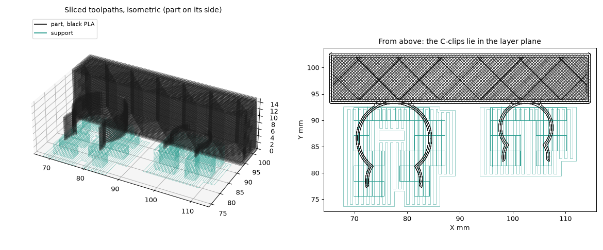
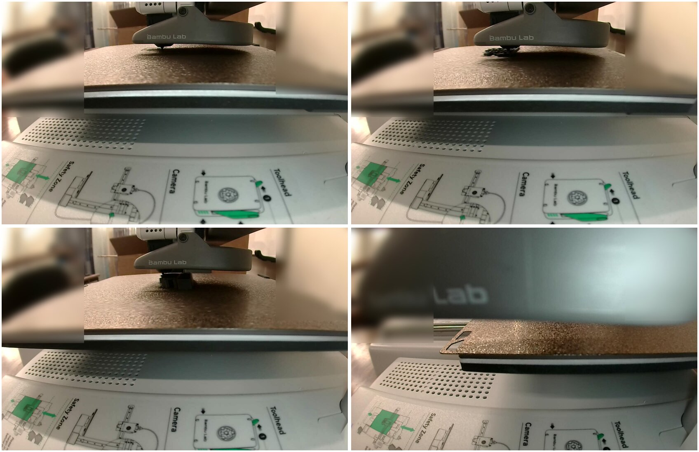

# Atomizer transducer cable holder

A two-clip cable holder for the atomizer's transducer cables, designed by @ronnie-guymon in
Onshape ([document](https://byudesign.onshape.com/documents/3094e1d7fbb4c4351dcd0e1a/w/d3134413115bb70af771d24a/e/ef669eb623cfc76bb11527a4),
*Atomizer holder*, Part Studio 1). One was printed in black PLA on the lab's A1 mini on
2026-10-05, at the request in [#256](https://github.com/vertical-cloud-lab/byu-vcl/issues/256).

| File | What |
|---|---|
| [`atomizer_holder.stl`](atomizer_holder.stl) | The part as designed (Onshape version of 17:03 UTC), in millimetres and Onshape's coordinates |
| [`atomizer_holder_A1mini_blackPLA.gcode.3mf`](atomizer_holder_A1mini_blackPLA.gcode.3mf) | The sliced plate that was sent. Its plate G-code is byte-identical to Studio's own slice |
| [`evidence/2026-10-05/print.json`](evidence/2026-10-05/print.json) | Source, settings, Send options, estimates, timeline and who gave the go |
| [`evidence/2026-10-05/`](evidence/2026-10-05/) | Both pre-flights with their camera frames, `watch`'s log (`watch.jsonl.gz`), key frames and renders |

## The part

| | As printed (Onshape, 17:03 UTC) | First version (superseded before anything was sent) |
|---|---|---|
| Bar | 50 × 10 mm, 15 mm deep | same |
| Large clip | Ø12.75 mm bore, 1 mm wall, 7 mm deep | Ø11 mm, 1.6 mm wall, 10 mm deep |
| Small clip | Ø8.75 mm bore, 1 mm wall, 2 mm deep | Ø7 mm, 1 mm wall, 5 mm deep |
| Fillets | 0.7 mm | 1 mm and 0.7 mm |
| Overall | 50 × 15 × 26.0 mm, 7.80 cm³ | 50 × 15 × 26.6 mm, 8.21 cm³ |

The two clips hang under the bar, 12.5 mm either side of its middle. Each has a narrow
opening with a flared lead-in.

## Getting it out of Onshape

The document is in BYU's `byudesign` enterprise. The lab's Onshape API key belongs to
Sterling's personal EDU account, which has no company attached. What each request returned:

| Request | Before sharing | Link share, view only | Link share with export |
|---|---|---|---|
| Document metadata, feature list | 403 | 200 | 200 |
| `parts`, `stl`, `tessellatedfaces`, mass properties, anonymous or keyed at `byudesign` | 403 | 401 "Unauthenticated API request" | 401 |
| `stl`, keyed at `cad.onshape.com` | 403 | 403 | 400 "Element must be a part studio" |
| `gltf`, keyed at `cad.onshape.com` | 403 | — | **200** |

- **The working route:** turn on export for the link, then ask for **glTF** with the key at
  `cad.onshape.com`. Then convert the mesh to an STL in millimetres with trimesh.
- **The glTF is in Onshape's Z-up world coordinates and in metres.**
- **Why this is simpler next time:** ask for an STL to be exported and attached, or have the
  document shared with export allowed.

## Print settings

- **Printer and material:** A1 mini, 0.4 mm nozzle, Textured PEI Plate. Bambu PLA Basic,
  black (AMS slot A3).
- **Process:** `0.20mm Standard @BBL A1M`, with one change: supports on, `normal(auto)`,
  30°, on build plate only.
- **Orientation:** on its side, so the clip profiles lie in the layer plane.
  - Each clip has to open wide to take its cable. Printed this way, the clips flex along
    their extruded perimeters rather than across layer lines, where PLA clips usually snap.
  - The clips are narrower than the bar and centred on it. On its side, the large clip
    starts 4.0 mm above the bed and the small one 6.5 mm above it, and both stand on supports.
- **Slice:** 96 layers to 15.0 mm, 4.67 g (0.64 g of it support). Bambu's estimate was
  18 min 41 s.

## How it went (2026-10-05, UTC)

| | |
|---|---|
| Route | Bambu Studio's GUI on the runner, logged in to the lab's Bambu account (route 3 of the Bambu runbook in [PR #234](https://github.com/vertical-cloud-lab/byu-vcl/pull/234)) |
| The go | @ronnie-guymon: "the build plate is clear" (17:09), "plate still clear" (17:13). The fresh pre-flight at 17:14:49 passed every automated check |
| Login | The code had to be relayed twice. The first code posted was refused as incorrect, probably because a fresh code had been requested in the meantime. The second worked |
| Send | 17:15:22, `RUNNING` by 17:15:55 |
| Layer 1 | 17:21:59, after Bambu's start sequence |
| `FINISH` | 17:33:29, 18 min 7 s after Send. `watch` exited 0 with no print error or HMS alert, and temperatures stayed on target |

The first pre-flight (16:46) showed a red box right behind the bed's back edge. The A1 mini
moves its bed front to back, so it was raised before the go, and it was gone from the
17:14:49 frame. Room corners in the committed frames are blurred.
