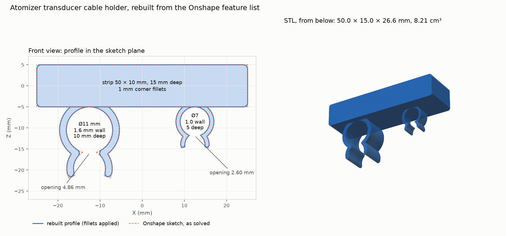

# Atomizer transducer cable holder: rebuilt from the Onshape feature list

A strip with two snap clips for the atomizer transducer's cables, designed by
@ronnie-guymon in Onshape ([document](https://byudesign.onshape.com/documents/3094e1d7fbb4c4351dcd0e1a/w/d3134413115bb70af771d24a/e/ef669eb623cfc76bb11527a4),
"Atomizer holder", Part Studio 1). Requested as a print in
[#256](https://github.com/vertical-cloud-lab/byu-vcl/issues/256): one part, black PLA.
The file that was printed, its slice and the print evidence are in the folder above,
committed by the run that did the print. This folder is the independent rebuild.



## Why this is a rebuild, not an export

The document is shared by link as view-only, with export off. Through that link the
Onshape API returns the feature list, but answers 401 or 403 to everything that touches
geometry: STL/STEP export, tessellation, mass properties, bounding boxes. So
[`transducer_cable_holder.stl`](transducer_cable_holder.stl) is rebuilt from the feature
list ([`onshape/features.json`](onshape/features.json), fetched 2026-10-05, microversion
`cfeb7b999fb9e175115c8d7c`) by [`rebuild_from_features.py`](rebuild_from_features.py).

Export was switched on later the same morning. The print in #256 uses Onshape's own
export, made by the run that held the printer. The rebuild stays here as a cross-check,
and as a worked example for the next view-only link. Measured against Onshape's mesh, it
is exact to within tessellation (see [Checks](#checks)).

| Feature | What it is |
|---|---|
| Sketch 1 | Front plane: a 50 × 10 mm rectangle and two C-shaped clip profiles hanging below it |
| Extrude 1 | the strip, 15 mm, symmetric |
| Extrude 2 | the Ø11 mm clip (1.6 mm wall), 10 mm, symmetric |
| Fillet 1 | 1 mm: the strip's four long edges, the Ø11 clip's two lips and four tip edges |
| Extrude 3 | the Ø7 mm clip (1.0 mm wall), 5 mm, symmetric |
| Fillet 2 | 0.7 mm: the Ø7 clip's four tip edges |

The feature list carries the solved sketch, so every coordinate, radius, depth and fillet
radius is read from it. The script writes down only the topology, decoded from the
features' queries: which sketch entities bound each extruded region, and which pairs meet
at each filleted edge. It checks those names against the query text.

All 14 filleted edges run straight along the extrude direction through the full depth of
their own extrude, so the fillets are applied to the 2D profile before extruding, which
gives the same solid.

**One judgement call: the clip tips.** Each tip is narrower than its two fillets: 1.6 mm
against 2 × 1 mm, and 1.0 mm against 2 × 0.7 mm. Onshape reports both fillets OK, so it
let the two blends meet. Here they are trimmed where they cross. That leaves a ridge
0.02–0.03 mm short of the original tip face. Onshape's mesh agrees: its lowest point,
which is on that ridge, is at the same Z to within 0.00002 mm.

## Checks

From [`rebuild_summary.json`](rebuild_summary.json):

| | |
|---|---|
| Bounding box | 50.0 × 15.0 × 26.57 mm (X × Y × Z, Onshape's frame) |
| Volume | 8,208 mm³: strip 499.14 mm² × 15 + Ø11 clip 60.98 mm² × 10 + Ø7 clip 22.30 mm² × 5 |
| Strip profile | 500 mm² less four 1 mm corners (0.86 mm²), as expected |
| Ø11 clip opening | 4.86 mm, the narrowest gap between the arms after the lip fillets (3.15 mm at the sharp sketch corners) |
| Ø7 clip opening | 2.60 mm (no lip fillet on this clip) |
| Solid | one valid solid; every feature in the source reports `OK` |

**Against Onshape's own mesh** ([`compare_to_onshape.py`](compare_to_onshape.py), using
the Part Studio's glTF export in [`onshape/part_studio.gltf`](onshape/part_studio.gltf)):

| | Onshape | Rebuild |
|---|---|---|
| Volume (mesh) | 8,208.27 mm³ | 8,208.37 mm³ |
| Surface area (mesh) | 3,871.21 mm² | 3,871.32 mm² |
| Bounding box | same to within 0.00002 mm | |
| Surface distance, 80,000 samples both ways | mean 0.0002 mm, max 0.0021 mm | |

A 0.002 mm gap is the two tessellations' own chord error, so the rebuild is the same part.

## Fit note

The clip openings are narrow for their bores: 4.86 mm for Ø11 (44%) and 2.60 mm for Ø7
(37%). Pushing a full-size, firm cable in through the gap would spread each arm by
3.1 mm and 2.2 mm. A CalculiX model of each clip ([`fea/`](fea/README.md)) puts the peak
strain at 4.6% and 5.1%, on the inside of each arm where it joins the strip. (A hand
estimate here, treating each arm as a curved cantilever, had said 6–7%.) PLA yields at
about 2–3%, and at less across layer lines. So expect a firm cable to go in from the end,
not snap in from the side. A soft or flattenable cable may still snap in.

The printed revision (17:03 UTC) widened the openings to 7.2 and 5.88 mm and gave both
clips 1 mm walls. A cable as wide as the bore then strains them 2.3% and 2.8%. That is
better, but still above a rule-of-thumb 1.2% for snapping PLA over and over: see
[`fea/README.md`](fea/README.md) for the curves, other materials and where the strain sits.

## Re-running

```bash
pip install cadquery trimesh matplotlib rtree
python rebuild_from_features.py   # STL, STEP and rebuild_summary.json
python render.py                  # render.png
python compare_to_onshape.py      # adds the comparison to rebuild_summary.json
```
