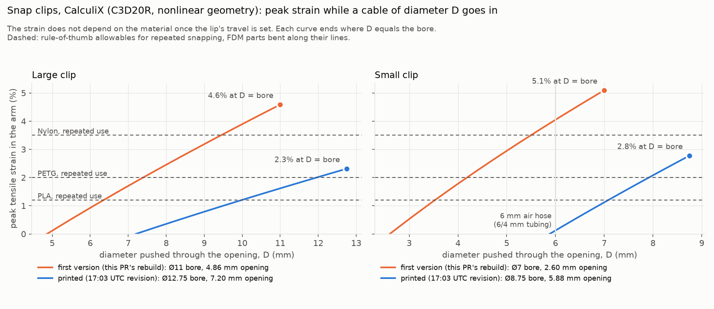
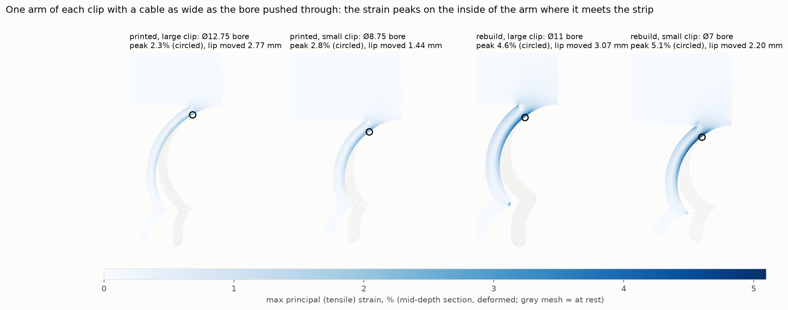

# Snap clips under repeated use: CalculiX FEA

Asked in [PR #257](https://github.com/vertical-cloud-lab/byu-vcl/pull/257): how the holder
stands up to repeated use, whether another material suits the repeated flexing, and whether a
magnet would be a better way to hold the cable. This folder answers the first two with a
nonlinear CalculiX model of each clip, for both versions of the part. The magnet question is
answered in the PR thread.



## Where the part goes

The transducer is the base of the rePowder's ultrasonic stack (transducer → booster →
sonotrode → plate), and the stack is mounted in the atomization chamber's door, which swings
out on a front-edge hinge. Two lines leave the transducer: the LEMO cable from the ultrasonic
generator and the 6/4 mm compressed-air cooling hose
([T5 06:45](https://www.youtube.com/embed/58wJ_Khwgyk?start=405)). Bartosz asked for the cable
to be kept secured "so nobody is going to stand on it… we have like one thousand volts going
through it" ([T7 19:45](https://www.youtube.com/embed/FDRTt68Vfvo?start=1185)), and warned
that both lines are stiff enough to damage the transducer end if pushed back too far
([T5 18:33](https://www.youtube.com/embed/58wJ_Khwgyk?start=1113)). This holder keeps those
lines in place. Links are to the training recordings indexed in `atomizer-training/` on
`claude/issue-124-20261003-0335`.

The clips flex only while a line is pushed in or pulled out. A line that rides in its clip
when the door swings bends the line, not the clip. So the number of flex cycles is the number
of times the lines are taken out and put back: tens to hundreds over the part's life, not
millions. What matters is the strain of a single snap-in, and whether it stays below what the
plastic tolerates every time.

## Model

| | |
|---|---|
| Geometry | Both versions are built from their Onshape feature lists with [`../rebuild_from_features.py`](../rebuild_from_features.py)'s own functions. *rebuild* is [`../onshape/features.json`](../onshape/features.json), the first version. *printed* is [`../onshape/features_printed.json`](../onshape/features_printed.json), microversion `cd9c2a2c228a77ea7351edcd`, the 17:03 UTC revision printed in #256. Rebuilt from its features, the printed version is 7,804.47 mm³, against 7,804.5 mm³ for the STL that was printed |
| Domain | One arm and the half of the strip above it, out to the part's end, at half the clip's depth. Symmetry on the clip's centre plane and on the extrude's mid-plane. The strip's top face is held, as if taped or glued down |
| Load | A cable of diameter D pushed through the opening g spreads each lip by (D − g)/2. The narrowest point of the opening is moved outward by that much, through the depth, in 10 steps up to D = the bore. Nothing else is constrained there |
| Solver | CalculiX 2.21 (`ccx`), static, nonlinear geometry (`NLGEOM`) |
| Mesh | gmsh: the profile in quads, extruded into 20-node hexes (C3D20R), with C3D15 wedges where a quad would not form. 0.25 mm in the arm, so 4 elements through a 1 mm wall, coarsening to 1 mm up the strip. 2 to 6 layers through the half depth |
| Mesh check | The printed large clip at 0.15 mm and 20 steps (48,257 nodes): 2.31 % peak strain at D = bore, against 2.31 % at 0.25 mm |
| Material | Linear elastic, E = 3.5 GPa, ν = 0.35. With the lip's travel prescribed, the strain field does not depend on E, so one run serves every material. Forces scale with E |

The peak tensile strain sits in the same place in every case: on the inside face of the arm,
just below where it joins the strip (circled below). That is where a crack would start. The
outside corner, where the arm's outer arc meets the strip at a sharp angle, carries a slightly
larger compressive strain. A sharp corner makes that value depend on the mesh, and it is in
compression, which does not open cracks.



## Results, with a cable as wide as the bore

From [`results.json`](results.json). Force is the sideways push needed to hold one lip open
with that cable in the opening, for the clip's full depth.

| Version | Clip | Bore | Opening | Each lip moves | Peak tensile strain | Force per lip: PLA | PETG | Nylon | TPU 95A |
|---|---|---|---|---|---|---|---|---|---|
| printed | large, 7 mm deep | Ø12.75 mm | 7.20 mm (56 %) | 2.77 mm | **2.3 %** | 8.0 N | 4.6 N | 3.4 N | 0.07 N |
| printed | small, 2 mm deep | Ø8.75 mm | 5.88 mm (67 %) | 1.44 mm | **2.8 %** | 4.2 N | 2.4 N | 1.8 N | 0.04 N |
| rebuild | large, 10 mm deep | Ø11 mm | 4.86 mm (44 %) | 3.07 mm | **4.6 %** | 60 N | 35 N | 26 N | 0.52 N |
| rebuild | small, 5 mm deep | Ø7 mm | 2.60 mm (37 %) | 2.20 mm | **5.1 %** | 21 N | 12 N | 9.1 N | 0.18 N |

Forces are elastic, so they hold only where the strain is within the material's limit below;
past it the plastic yields and pushes back less. The printed revision widened both openings,
and thinned the large clip's wall from 1.6 mm to 1 mm. That roughly halved the strain.

Smaller cables strain the clips proportionally less: the curves above are nearly straight.
A 6 mm air hose would barely touch the printed small clip's 5.88 mm opening.

## Materials

The strain a printed clip tolerates every time depends on the plastic, and on the print: these
clips lie in the layer plane, so they bend along the extruded lines, the strong direction.

| Material | E | Allowable strain: once / repeatedly | printed large (2.3 %) | printed small (2.8 %) | rebuild large (4.6 %) | rebuild small (5.1 %) |
|---|---|---|---|---|---|---|
| PLA | 3.5 GPa | 2 % / 1.2 % | **over** | **over** | **over** | **over** |
| PETG | 2 GPa | 3.5 % / 2 % | once only | once only | **over** | **over** |
| Nylon (PA12/PA6, unfilled) | 1.5 GPa | 6 % / 3.5 % | within | within | once only | once only |
| TPU 95A | 0.03 GPa | 30 % / 20 % | within | within | within | within |

The largest line each printed clip takes and stays within the repeated-use allowable, read
off the curves:

| | PLA | PETG | Nylon |
|---|---|---|---|
| printed large clip (Ø12.75 bore) | 10.0 mm | 12.0 mm | the bore |
| printed small clip (Ø8.75 bore) | 7.1 mm | 7.9 mm | the bore |

- **PLA** is fine for lines a few millimetres smaller than the bores. With a line as wide as
  the bore, expect the inside of an arm root to whiten after some snaps, then crack.
- **PETG** is the easy swap: same printer, same file, and it tolerates about twice the strain.
  A bore-sized line is still above its repeated-use value, so it is better, not unlimited.
- **Nylon** is the material for clips that are snapped in and out often. Print it on the H2D,
  from dried filament.
- **TPU 95A** never cracks at these strains, but holds about 100 times less firmly than PLA:
  0.07 N to spread a lip of the large clip. That is too little to keep a stiff cable seated.
  A PLA or PETG body with TPU clips, printed together on the H2D, is the way to use it.
- **Geometry does more than material.** The strain is close to proportional to how far each
  lip moves, so a wider opening, or thinner and longer arms, cuts it directly.

The allowables are rule-of-thumb snap-fit values, not measurements of these filaments.
Moulded-part design guides give a permissible strain for a single snap-in. For repeated
snapping they use about 60 % of it, and printed parts deserve a further margin.

## What the model leaves out

- **Contact with a real cable.** The lip is moved, not pushed by a cylinder, so friction, the
  cable squashing and the lead-in sliding are not modelled. A soft cable strains the clip less.
- **Plastic behaviour.** Past the material's yield strain, the stresses here are not real. The
  strain is still a fair measure of the demand, which is how snap-fit guides use it.
- **Creep.** If a cable is bigger than the bore, the arm stays strained. PLA creeps under a
  sustained load and softens at 55–60 °C, and the transducer gets hot where it is touched.
- **The mounting.** The strip's top is held rigidly. Double-sided tape gives a little.

## Re-running

```bash
sudo apt-get install calculix-ccx libglu1-mesa
pip install cadquery gmsh matplotlib numpy
python clip_fea.py     # about 7 min on 4 cores: results.json, clip_strain.png, clip_contours.png
```

Meshes and CalculiX output go to `runs/`, which is not committed. A finished run there is reused
if its deck is unchanged, so delete `runs/` to start over.
