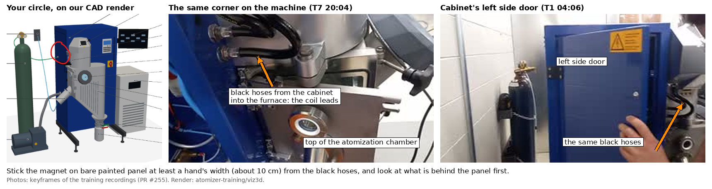

# Where the magnet goes

In [PR #257](https://github.com/vertical-cloud-lab/byu-vcl/pull/257), Ronnie proposed a slotted
box held on by a magnet in place of the snap clips, and circled where he wants it: the upper
front of the cabinet's left side, beside the furnace (left, below). On the machine, that is
where black hoses leave the cabinet and loop into the furnace's left side. Our CAD model takes
them to be the induction coil's water-cooled leads.

## The spot

- **Heat from the coil leads.** While the furnace heats, the coil current runs through those
  leads. The alternating field round them heats nearby metal by eddy currents, and it falls off
  quickly with distance. A magnet about 10 cm away should stay cool; one pressed against the
  leads could get warm. The PLA box would go first (it softens at 55–60 °C), and NdFeB starts
  losing strength above about 80 °C.
- **What is behind the panel.** The left side door covers the air, argon and pneumatics
  ([T1 01:20](https://www.youtube.com/embed/wRc8p2_FnJo?start=80)). Bartosz's walkthrough of
  that side also covers the cooling water's pressure reducer and its flow and temperature
  sensor ([T1 03:02](https://www.youtube.com/embed/wRc8p2_FnJo?start=182)). Some flow switches
  and cylinder sensors are magnetic (reed or Hall). A pot magnet's field stays close to its
  face, and the steel panel carries most of it, so only something within a couple of
  centimetres directly behind the spot could notice it.
- **The side door opens at its front edge**, the edge by the hoses. A box on the door moves
  when the door opens.
- **The cable run.** In our model the transducer's cable end is about half a metre below the
  spot, pointing down and out, and it moves about 30 cm when the chamber door opens. The cable
  needs a loop long enough for that, or opening the door pulls the box off. It should also
  leave the transducer straight before curving up: a tight U-turn at the plug is the load
  Bartosz warned about when he said the lines could damage the transducer end
  ([T5 18:33](https://www.youtube.com/embed/58wJ_Khwgyk?start=1113)).

The same panel lower down, near the transducer's height, avoids both the coil leads and the
U-turn, if the cable's run to the generator allows it.

## Testing the magnet

1. Try a fridge magnet first. If it won't stick, the panel isn't steel.
2. Test the hold by sliding, not pulling. On a vertical panel the magnet holds by friction. A
   bare magnet slides at roughly a fifth to a quarter of its rated pull, and less on thin sheet.
   Rubber-coated pot magnets grip better and list a shear rating. Hang the box with the cables
   in it, and push it down the panel.
3. Check the breakaway. Tug the cable the way a foot would: the box should come off before the
   transducer end moves.
4. Open the chamber door, the side door and the furnace lid all the way with the box on.
5. Touch the magnet and the box after the first melt.

## The box

- Leave the magnet pocket open on the face that touches the panel, with the magnet flush. Even
  1 mm of printed plastic in front of the magnet costs a third or more of its pull, and a pot
  magnet loses more.
- Make each slot about 0.5 mm wider than its line, so nothing flexes. Point the openings at the
  panel or upward, so the panel or gravity keeps the lines in until the box is pulled off.
  Openings facing down let the lines' weight pull them out.
- A rubber-coated pot magnet 20–25 mm across, rated at about 4–6 kg of pull, is a reasonable
  first try. That is a guess, not a calculation. The sliding test decides it.

`spot.png` is made by `make_spot_figure.py`, from `circle_on_render.png` (Ronnie's circle on
`atomizer-training/viz3d/out/machine.png`) and two keyframes on the PR #255 branch.
