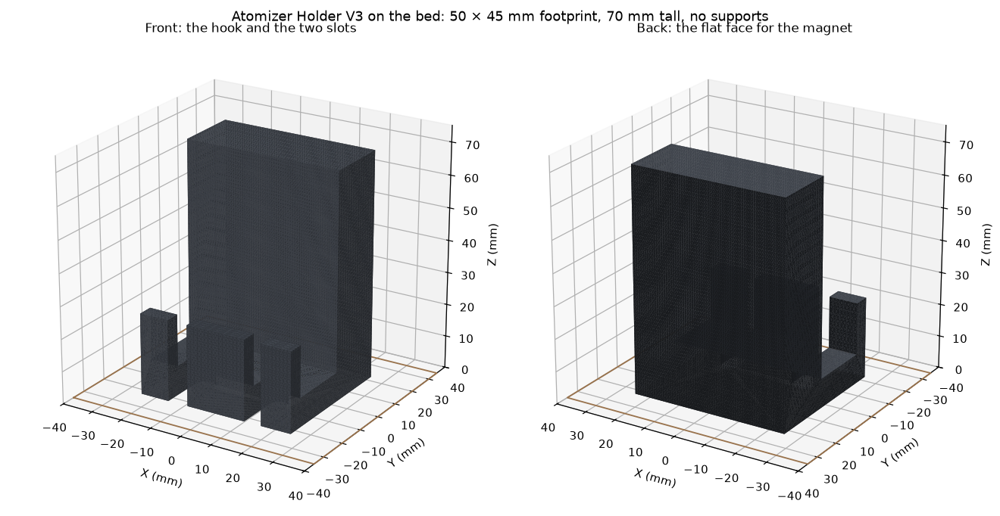
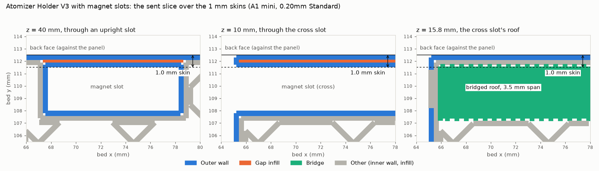

# Atomizer Holder V3

The third version of @ronnie-guymon's holder for the atomizer transducer's lines: a slotted
box instead of snap clips, to be held to the cabinet by a magnet (see
[`../rebuild/magnet/`](../rebuild/magnet/README.md)). Designed in Onshape
([*Atomizer holder*, element *Atomizer Holder V3*](https://byudesign.onshape.com/documents/3094e1d7fbb4c4351dcd0e1a/w/d3134413115bb70af771d24a/e/c785cc2846c2740d77a7bd91)).
One was printed in black PLA on the lab's A1 mini on 2026-10-06, at the request on
[PR #257](https://github.com/vertical-cloud-lab/byu-vcl/pull/257#issuecomment-6025049559).
A second, with three pockets for bar magnets added in the same element, was printed on
2026-10-08 ([below](#with-magnet-slots-2026-10-08)).

| File | What |
|---|---|
| [`atomizer_holder_v3.stl`](atomizer_holder_v3.stl) | The part as designed, in millimetres and Onshape's coordinates |
| [`atomizer_holder_v3_A1mini_blackPLA.gcode.3mf`](atomizer_holder_v3_A1mini_blackPLA.gcode.3mf) | The sliced plate that was sent. Its plate G-code is byte-identical to Studio's own slice. The lab account's `DesignerUserId` is blanked |
| [`onshape/features.json`](onshape/features.json) | The element's feature list (4 sketches, 4 extrudes, 1 plane), as fetched at 20:44 UTC |
| [`evidence/2026-10-06/`](evidence/2026-10-06/) | Both pre-flights with their camera frames, three key frames and the part render |
| [`atomizer_holder_v3_magnet_slots.stl`](atomizer_holder_v3_magnet_slots.stl) and the other `magnet_slots` files | The 2026-10-08 version and its print ([below](#with-magnet-slots-2026-10-08)) |
| [`off_the_shelf/`](off_the_shelf/README.md) | What Amazon sells that is like this holder, searched 2026-10-08 |

## The part

In Onshape's coordinates, as designed:

| | |
|---|---|
| Back plate | 50 × 70 mm, 20 mm thick. Its flat back is the face for the magnet |
| Hook | Along one 50 mm end: a 9 mm floor that runs 45 mm out from the back of the plate, ending in a 5 mm wall that stands 25 mm tall. Between the plate and that wall is a 20 mm wide channel |
| Slots | Two, 12.5 mm either side of the middle, cut through the floor and the end wall. 6.5 mm wide with a Ø6.5 mm round end, and 5.5 mm wide with a Ø5.5 mm round end. Both run about 17 mm in from the outside of the end wall, so the round ends sit 11 mm in front of the plate. The end wall is split into three fingers |
| Overall | 50 × 70 × 45 mm, 82.5 cm³, one watertight solid |

- **The 6.5 mm slot leaves 0.5 mm around the 6 mm air hose,** the clearance suggested in
  [`../rebuild/magnet/README.md`](../rebuild/magnet/README.md#the-box), so nothing has to
  flex. The 5.5 mm slot does the same for a 5 mm line.
- **Printed slots can come out 0.1–0.2 mm narrow.** Check the fit with the real hose and
  cable before relying on it.

## Getting it out of Onshape

The same route as the first version ([`../README.md`](https://github.com/vertical-cloud-lab/byu-vcl/blob/ac80509/atomizer-cable-holder/README.md#getting-it-out-of-onshape)
on `claude/issue-256-20261005-1618`). The document's link share still allows export:

| Request, with the lab's API key at `cad.onshape.com` | Status |
|---|---|
| Document, element list, feature list | 200 |
| Part Studio glTF | **200** |
| `parts`, mass properties | 403 |

The glTF is in metres, in Onshape's Z-up frame. It was converted to an STL in millimetres
with trimesh (`merge_vertices`, then a watertightness check).

## Print settings

- **Printer and material:** A1 mini, 0.4 mm nozzle, Textured PEI Plate. Bambu PLA Basic,
  black (AMS slot A3).
- **Process:** `0.20mm Standard @BBL A1M` with **no changes**: 2 walls, 15 % grid infill,
  5 top and 3 bottom layers, supports off.
- **Orientation:** stood on the bottom of the hook, which is also how the part is used.
  - Every layer lies within the one below it, so nothing overhangs and no supports are
    needed. In the STL's own orientation, the end wall would overhang the channel by 16 mm,
    and on its side the slot roofs would overhang.
  - The slots and their round ends lie in the layer plane, so their widths are set by the
    walls' paths rather than by stacked layers.
  - The magnet face is a side wall. It is as flat as the printer's walls, not as smooth as
    the plate.
  - Footprint 50 × 45 mm, 70 mm tall. The top 45 mm is the back plate alone, 50 × 20 mm in
    section.
- **Slice:** 350 layers to 70.0 mm, 29.71 g (9.80 m). Bambu's estimate was 1 h 1 min 33 s,
  of which about 4 min is timelapse moves that don't run with timelapse off.

## How it went (2026-10-06, UTC)

| | |
|---|---|
| Route | Bambu Studio's GUI on the runner, logged in to the lab's Bambu account (route 3 of the Bambu runbook in [PR #234](https://github.com/vertical-cloud-lab/byu-vcl/pull/234)). The printer was reached for pre-flight and `watch` through `RPI_STREAM_CAM`: the CubXL Pi, the runbook's default, was offline on the tailnet |
| The go | @ronnie-guymon in the request (20:40): "plate is clear". The first pre-flight (20:51) showed the red bin back at the bed's far-right corner, as on 2026-10-05, and he was asked to move it out of the bed's path. Then, with the login code (20:52:44): "box is moved, plate is clear". The 20:55:50 frame shows the bin at the far-left corner instead |
| Login | The code was typed 6 s after it was posted and worked the first time |
| Send | 20:57:45, `PREPARE` by 20:58:00, `RUNNING` by 20:58:12 |
| Layer 1 | 21:04:51, after Bambu's start sequence |
| Finish | Not recorded. The session's last update was at 21:28, on layer 129 of 350, with Studio's estimate at 21:59. It stopped before the print ended, so its `print.json` and `watch` log were never committed. The part was off the plate and hung on the machine by 2026-10-07 ([photo](https://github.com/vertical-cloud-lab/byu-vcl/pull/257#issuecomment-6048100182)) |

Frames: [layer 1](evidence/2026-10-06/frames/20261006T210524Z_L1.jpg) (21:05),
[layer 22](evidence/2026-10-06/frames/20261006T211005Z_L22.jpg) (21:10) and
[layer 122](evidence/2026-10-06/frames/20261006T212731Z_L122.jpg) (21:27).

## With magnet slots (2026-10-08)

@ronnie-guymon added three pockets for 40 × 10 × 3 mm bar magnets to the same Onshape element,
so the magnets sit inside the part instead of being hot-glued to its back. He asked for it
in black on [PR #257](https://github.com/vertical-cloud-lab/byu-vcl/pull/257#issuecomment-6069360332),
and it was printed on the A1 mini that afternoon.

| File | What |
|---|---|
| [`atomizer_holder_v3_magnet_slots.stl`](atomizer_holder_v3_magnet_slots.stl) | The part as designed: Onshape microversion `82e22af`, saved 21:35:51 UTC. Millimetres, Onshape's coordinates |
| [`atomizer_holder_v3_magnet_slots_print.stl`](atomizer_holder_v3_magnet_slots_print.stl) | The same mesh turned +90° about X, (x, y, z) → (x, −z, y), so it stands on the bottom of the hook. This is the file that was sliced |
| [`atomizer_holder_v3_magnet_slots_A1mini_blackPLA.gcode.3mf`](atomizer_holder_v3_magnet_slots_A1mini_blackPLA.gcode.3mf) | The file Studio uploaded at Send. Its plate G-code is byte-identical to Studio's slice. The lab account's `DesignerUserId` is blanked |
| [`onshape/features_2026-10-08.json`](onshape/features_2026-10-08.json) | The feature list at `82e22af`: the 2026-10-06 features plus Sketches 5–6 and Extrudes 5–6, the slots |
| [`toolpaths_magnet_slots.py`](toolpaths_magnet_slots.py) | Draws the sent G-code's toolpaths over the slots' skins (the figure below) |
| [`evidence/2026-10-08/`](evidence/2026-10-08/) | Both pre-flights with their camera frames, `print.json`, `watch`'s log and key frames |

### The slots

Nothing else changed. Subtracting the new mesh from the 2026-10-06 one leaves exactly the
three slots, 4,740.75 mm³. The part prints standing the way it hangs on the panel, hook at the
bottom, so the heights below are also where the slots sit in use.

| Slot | Section | Depth | Opens on | Where it is in the print |
|---|---|---|---|---|
| Cross | 10.5 × 3.5 mm | 45 mm | One long side, at the hook end | A tunnel from 5 to 15.5 mm up. Its roof bridges the 3.5 mm span |
| Upright, two | 10.5 × 3.5 mm | 42 mm | The top end of the back plate | Open from 28 mm up to the top, at 70 mm. The section lies in the layer plane |

- **Each slot is 1.0 mm from the back face,** the face that goes against the panel.
  - The first save, at 21:20 UTC, had 0.5 mm behind the upright slots and 0.7 mm behind the
    cross slot. There the slicer lays two 0.42 mm outer walls into a skin narrower than both
    together: 0.84 mm of plastic in 0.5 mm. That is likely to bulge the back face or pinch the slot.
  - Ronnie changed it to 1 mm at 21:35:51, before anything was sent.
  - In the sent slice, each 1 mm skin is two 0.42 mm outer walls with a 0.23 mm gap-fill line
    between them. That's solid, and nothing overlaps.
- **Fit.** The slots leave 0.25 mm a side around a 10 × 3 mm magnet. Printed slots often come out
  0.1–0.2 mm narrow, and the cross slot's bridged roof may sag a little, so try a magnet in each
  slot before relying on it.
- **Holding the magnets in.** The upright slots open upwards in use, so a magnet can't drop out of
  them. The cross slot opens on a side. In both, the magnet's pull on the panel holds it against
  the skin, and only friction and the slot's fit stop it sliding along the slot.

### Print settings

The same as 2026-10-06:
- A1 mini with a 0.4 mm nozzle and the Textured PEI Plate.
- Bambu PLA Basic, black, from AMS slot A3.
- `0.20mm Standard @BBL A1M` with no changes.
- Stood on the bottom of the hook, with no supports.

The slice is 350 layers to 70.0 mm and 31.36 g (10.35 m). Studio's estimate was 1 h 7 min 25 s;
4 min 13 s of that is timelapse moves, which don't run with timelapse off.

### How it went (2026-10-08, UTC)

| | |
|---|---|
| Route | Bambu Studio's GUI on the runner, logged in to the lab's Bambu account (route 3 of the Bambu runbook in [PR #234](https://github.com/vertical-cloud-lab/byu-vcl/pull/234)). Pre-flight and `watch` went through `OT2_STREAM_CAM`, using ssh port forwards only, because the CubXL and RPI stream-cam Pis were offline on the tailnet |
| Request | 21:26:05, "in black, the plate is clear". At 21:27:35, "print on the A1 mini" |
| First export | 21:28. This was the 21:20 save, with 0.5 and 0.7 mm skins |
| Pre-flight 1 | 21:32:54. `FINISH` after someone else's *Part Studio 1 - Carriage.step*, no error or HMS alert, heaters off, bed 33 °C. The red bin was again just behind the bed's back right corner, so Ronnie was asked about it |
| The 1 mm change | Saved 21:35:51, posted 21:36:40 |
| Login | *Log In* at 21:36:55. The code was posted at 21:40:52 and typed 5 s later, and it worked the first time |
| Second export | About 21:40, microversion `82e22af` |
| Slice | 21:43–21:45 in the GUI. The filament was set to black, then the plate was re-sliced and exported |
| The go | 21:45:55, "plate is clear, the red bin is not in the path" |
| Pre-flight 2 | 21:46:10, against the exported 3MF. Every automated check passed. The plate, the plate type and the empty plate are always left to a person |
| Send | 21:46:44. `RUNNING` by 21:47:04 |
| Layer 1 | 21:53:09, after a 6.4 min start sequence |
| Finish | `FINISH` at 22:48:47, 62.0 min after Send, against Studio's 1 h 7 min, which includes 4 min of timelapse moves that don't run. `watch` exited 0, with no `print_error`, HMS alert or temperature alarm in 1,682 status samples. By 22:49:11 the part was already off the plate |

The two other `@claude` comments in the thread, at 21:27:35 and 21:36:40, each started another run. Both stood
down without touching the printer. The second one spotted that this session's first export
predated the 1 mm change.

Frames, room blurred: [layer 5](evidence/2026-10-08/frames/20261008T215601Z_L5.jpg),
[layer 59](evidence/2026-10-08/frames/20261008T220726Z_L59.jpg),
[layer 80](evidence/2026-10-08/frames/20261008T221103Z_L80.jpg) (just above the cross slot's roof),
[layer 151](evidence/2026-10-08/frames/20261008T222133Z_L151.jpg),
[layer 248](evidence/2026-10-08/frames/20261008T223345Z_L248.jpg),
[the last layer](evidence/2026-10-08/frames/20261008T224759Z_L350.jpg) (22:47:59) and
[the empty plate](evidence/2026-10-08/frames/20261008T224911Z_after.jpg) (22:49:11).

**[Recording](https://www.youtube.com/watch?v=Yf4LR9r0XuM)** (5:09, unlisted). It runs from Studio's first run, through slicing and
Send, to `FINISH` through Studio's live view. The login and the home page that shows the
account name (21:36:35–21:42:35) are cut, and the room is blurred.

