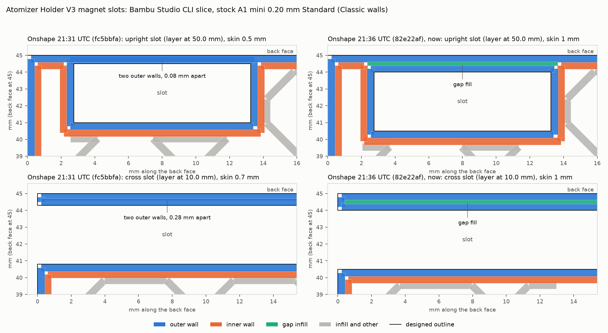

# Magnet slots: what the slicer lays down behind them

On 2026-10-08 @ronnie-guymon added three slots to *Atomizer Holder V3* for 40 × 10 × 3 mm
magnets (Onshape edit at 21:20 UTC). After the first check below, at 21:35:51 UTC, he moved
all three to 1 mm from the back face. This folder slices both versions with Bambu Studio's CLI
and reads the toolpaths over the plastic between each slot and the back face (the "skin").
Nothing here touched the printer or the Bambu account. The print itself is the other session's
on [PR #257](https://github.com/vertical-cloud-lab/byu-vcl/pull/257).



## The slots

Read from the Part Studio's glTF export and feature list (Sketches 5 and 6, Extrudes 5 and 6).

| Slot | Size | Opens at | Skin, 21:31 (`fc5bbfa`) | Skin, 21:36 (`82e22af`) |
|---|---|---|---|---|
| One across the back plate, just above the hook | 10.5 × 3.5 mm, 45 mm long | The side face next to the 6.5 mm (blue tube) slot | 0.7 mm | **1.0 mm** |
| Two upright, one behind each cable slot | 10.5 × 3.5 mm, 42 mm long | The end of the back plate away from the hook | 0.5 mm | **1.0 mm** |

- **No pause is needed.** All three slots open to the outside, so the magnets slide in after
  printing. The part is one watertight shell with no enclosed void. It is 4,741 mm³ lighter than
  the 2026-10-06 version, which is exactly the three slots' volume.
- **Printed standing on the hook, as on 2026-10-06, the upright slots open at the top.**
  Sections of the print-oriented mesh show them from 28 mm up to the top at 70 mm, and the
  face on the bed is unchanged (2,053.6 mm²). The cross slot spans 5–15.5 mm, and its roof
  bridges 3.5 mm. Neither needs supports.
- Each slot leaves 0.5 mm of clearance around a magnet. Printed holes often come out
  0.1–0.2 mm small, which would still leave about 0.3 mm.

## What the slicer does with the skin

Stock settings, as on 2026-10-06: A1 mini 0.4 nozzle, `0.20mm Standard @BBL A1M` (Classic wall
generator, 2 walls, 0.42 mm outer wall), Bambu PLA Basic, Textured PEI. One layer through each
kind of slot (50.0 mm and 10.0 mm), in [`skin_toolpaths.json`](skin_toolpaths.json):

| Skin | Lines along it (centre from the back face, width) | Plastic in the skin |
|---|---|---|
| 0.5 mm | outer wall 0.21 mm (0.42), outer wall 0.29 mm (0.42) | 0.84 mm of line in 0.5 mm: the two walls are 0.08 mm apart |
| 0.7 mm | outer wall 0.21 mm (0.42), outer wall 0.49 mm (0.42) | 0.84 mm in 0.7 mm: 0.28 mm apart |
| **1.0 mm** | outer wall 0.21 mm (0.42), gap fill 0.50 mm (0.23), outer wall 0.79 mm (0.42) | **1.07 mm in 1.0 mm: solid, with ordinary overlap** |

- **At 0.5 and 0.7 mm, Classic walls print both outer walls on top of each other.** The surplus
  has to go somewhere: most likely a ridge on the back face or a pinched slot. Neither version
  leaves the skin out.
- **At 1 mm the skin is two walls and a gap-fill line.** No settings change is needed.
- CLI estimate for the 1 mm version: 350 layers, 1 h 2 min of printing (1 h 8 min with the
  start sequence), 31.4 g ([`slice_summary.json`](slice_summary.json)).

## Files

| File | What |
|---|---|
| [`onshape/part_studio_fc5bbfa.gltf`](onshape/part_studio_fc5bbfa.gltf) | The Part Studio's glTF at 21:31 UTC: 0.5 / 0.7 mm skins |
| [`onshape/part_studio_82e22af.gltf`](onshape/part_studio_82e22af.gltf) | At 21:37 UTC, after the 1 mm change |
| [`slice_v3.py`](slice_v3.py) | glTF → STL in mm, stood on the bottom of the hook, then Bambu Studio's CLI with the stock presets |
| [`flatten_presets.py`](flatten_presets.py) | Copied from `piper-camera-mount/slice/` (branch `claude/issue-239-20261007-2023`): the CLI does not follow a preset's `inherits` |
| [`skin_toolpaths.py`](skin_toolpaths.py) | Reads the G-code of one layer through each slot, measures the skin, and draws the figure |
| [`skin_toolpaths.json`](skin_toolpaths.json), [`slice_summary.json`](slice_summary.json) | The numbers above |

```bash
# Bambu Studio 02.08.02.61 AppImage, extracted to ~/bambu/squashfs-root (see bambu/studio/README.md on PR #234)
python slice_v3.py ~/bambu/squashfs-root onshape/part_studio_82e22af.gltf build_1mm
python slice_v3.py ~/bambu/squashfs-root onshape/part_studio_fc5bbfa.gltf build_05mm
python skin_toolpaths.py skin_toolpaths.png skin_toolpaths.json \
    "Onshape 21:31 UTC (fc5bbfa)=build_05mm" "Onshape 21:36 UTC (82e22af), now=build_1mm"
```

**Not checked:** this is the CLI's slice, not the GUI slice that gets sent. Both use the stock
presets, but check the sent slice's `CONFIG_BLOCK` anyway. Nothing here was printed or measured.
