# rePowder first-run charges: CAD, experiments, and parts for the prototyping lab

Issue [#222](https://github.com/vertical-cloud-lab/byu-vcl/issues/222). This folder has the Al cups, plugs, and slugs
for the first atomizer runs (#161), all turned from the 3/4" 6063-T52 bar that arrived on 2026-09-24
(McMaster [1640T16](https://www.mcmaster.com/1640T16/), 2 ft). The CAD is parametric
([build123d](https://github.com/gumyr/build123d), OpenCascade B-rep): change a dimension in
[`cad/charge_cad.py`](cad/charge_cad.py) and the STEP files, renders, masses, compositions, and shop drawing all
regenerate from it.

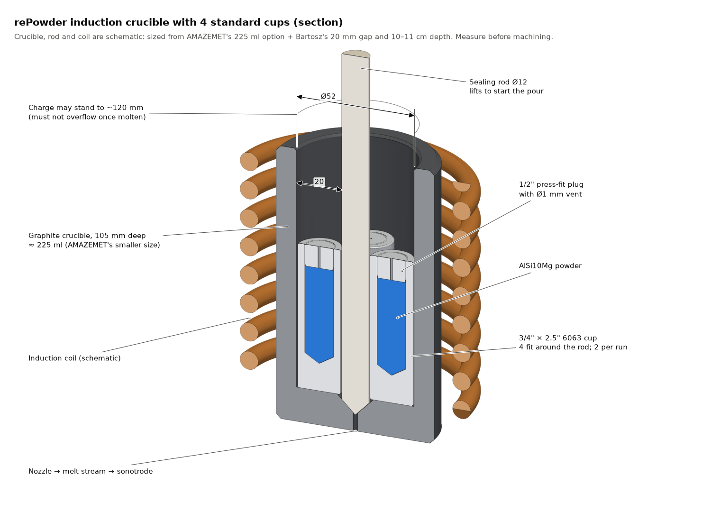

## How the parts get made

Three clips, generated from the same CAD by [`cad/machining.py`](cad/machining.py). Drilling is shown cut in half so
the hole is visible; the tool positions are the real ones, and each frame re-revolves the profile with the cut taken
so far.

| Turn the cup | Turn the lid | Load it and pump down |
| --- | --- | --- |
| 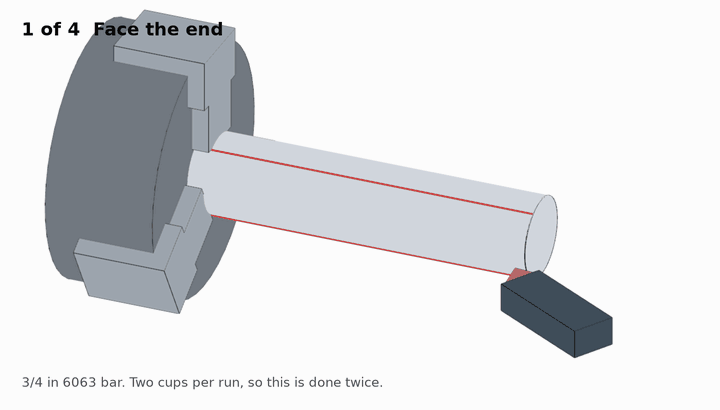 | 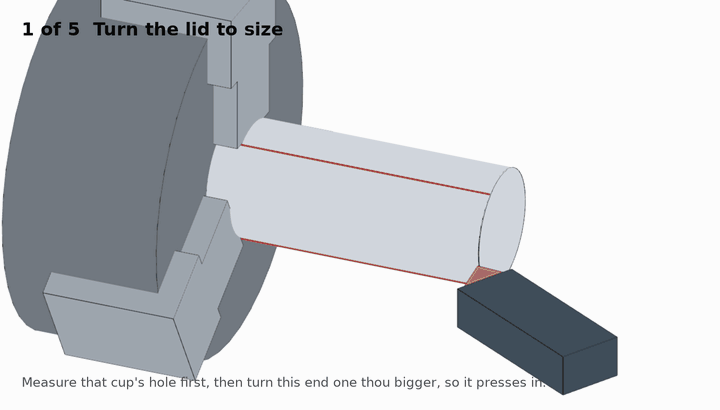 | 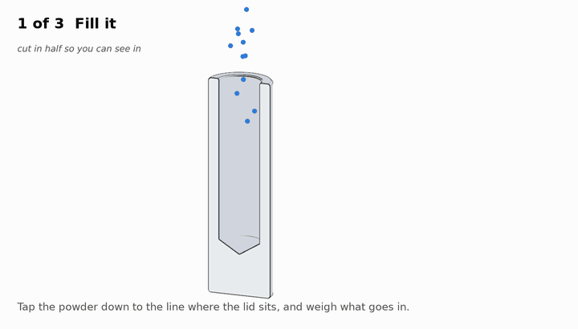 |

The vent, in one line: **the chamber is pumped down before melting, so air shut under a solid lid has to leave through
the powder.** A Ø1/16" hole through the lid gives it somewhere else to go (#104).

**Before anyone cuts metal, measure the crucible** ([what to measure](#measure-before-machining)). The bore and
sealing-rod diameters below are inferred, not measured.

## The crucible: documented vs. inferred

| Quantity | Value in the model | Status | Source |
| --- | --- | --- | --- |
| Crucible material | graphite | documented | AMAZEMET, [induction melting](https://www.amazemet.com/induction-melting-principle/) |
| Melt delivery | nozzle in the floor, sealed by the sealing rod; melt is pushed out by a pressure differential | documented | same page; [9/17 call](../docs/meetings/2026-09-17-repowder-install/transcript.md) (20:12, 17:40) |
| Crucible sizes | 225 ml and 400 ml, interchangeable | documented options. **Which one we have is not confirmed.** | AMAZEMET, [TUM case study](https://www.amazemet.com/technical-university-of-munich-amazemet-case-study/) |
| Rod-to-wall gap | 20 mm (= max feedstock Ø) | documented, verbal | Bartosz, 9/17 call, 20:12 |
| Inner depth | 105 mm (10–11 cm); charge may stand to ~120 mm | documented, verbal | Bartosz, 9/17 call, 21:21 |
| Bore | **Ø52 mm** | inferred: 225 ml at 105 mm deep is Ø52.2 | — |
| Sealing rod | **Ø12 mm** | inferred: 52 − 2 × 20 | — |
| Nozzle | **Ø0.7 mm hBN orifice** | documented, published | Ge et al. 2025, a rePowder induction-module study |
| Melt push | **200 mbar Ar over-pressure**, after 3 evacuation/Ar cycles to <50 ppm O₂; system pumps to 4×10⁻¹ mbar | documented, published | Ge et al. 2025; Ukabhai et al. 2025 |
| Crucible coating | **BN spray on the graphite** is published rePowder practice | documented, published | Ge et al. 2025 |
| Published charge sizes | 100 g Al/Cu pellets; 400–500 g discs + arc-melted bars | documented, published | Ukabhai et al. 2025; Ge et al. 2025 |
| Seat, wall, coil | schematic | not documented | — |

The 225 ml option fits the rest of the numbers. A 400 ml crucible at the same depth would be ~Ø70 mm, which with a
20 mm gap implies a ~30 mm sealing rod. That seems unlikely, but a caliper settles it.

## Rods around the piston, or one ring over it?

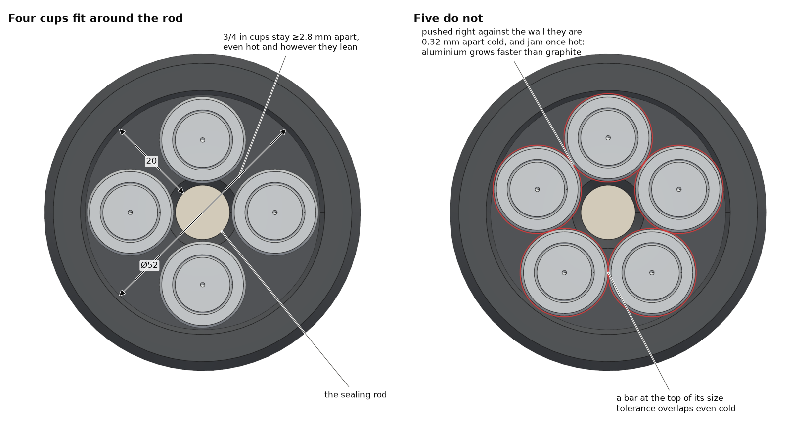

- **Four 3/4" slugs fit around the rod, and a fifth does not.** Four sit 2.9–4.3 mm apart depending on which way they
  lean, and still ≥2.8 mm apart at 600 °C. Five, even pushed against the wall, sit 0.32 mm apart cold and interfere
  once hot: Al grows ~1.4 % by 600 °C, graphite ~0.3 %. At the bar's +0.014" tolerance, five don't fit even cold.
- **You don't need a full crucible.** AMAZEMET's [FAQ](https://www.amazemet.com/faq/) puts the input at "a few to a
  few hundred grams". What limits the charge is the minimum melt for a steady pour, not crucible volume. Two slugs make
  80–100 g, which is the 100 g/run basis of the #161 purchase model. Four slugs make ~175 g. The crucible would hold
  ~500 g of liquid Al.
- **The ring over the rod** ([render](cad/renders/ring_concept.png)) only works if the sealing rod can be pulled and
  re-seated after loading. The ring has to pass over the whole rod, including whatever grips its top. It also doesn't
  add capacity. Powder capacity comes from wall thickness, not from ring vs. rods: the ring holds 37 cm³ of powder,
  while four 3/4" × 100 mm thin-wall cups would hold 73 cm³. On top of that, the ring needs a 2" bar (a 5N Ø50 bar
  costs far more than Ø20), a trepanning cut, and a rotary stage to dose into. Identical slugs stand in a rack and dose
  like vials.
- **So: repeat slugs.** Separate slugs also cover Bartosz's caveat. If a powder cup doesn't fully melt, rerun it as one
  cup plus one solid slug, so that part of the charge is already molten when the powder is released.

## Experiments

Two slugs per run by default. The insets share one scale, so a smaller picture is a smaller part. Powder masses assume
tapped densities (AlSi10Mg 1.60, Si 1.10, re-atomized 6063 1.65 g/cm³). **Weigh; don't trust volumes.**
"Designed" composition is what you get if every gram dissolves, so ICP/EDS on the powder against it measures recovery.

| | Run | Tier | Per run | Fill per cup (weigh it) | Charge / run | Powder | Designed | What it tells you |
| --- | --- | --- | --- | --- | ---: | ---: | --- | --- |
| 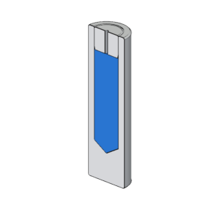 | **E1** AlSi10Mg in a cup, plug on top | first | 2 × P2 + P3 | 8.0 g AlSi10Mg, tapped to the plug line | 86 g | 18.5 % | Al-2.2Si-0.6Mg | Does powder inside Al melt fully? |
| 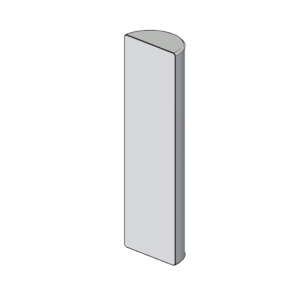 | **E2** Solid 6063 (control) | first | 2 × P1 | — | 97 g | 0 % | 6063 (Al-0.4Si-0.7Mg) | Baseline yield / PSD. **Run before E6**, which uses its powder |
| 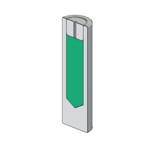 | **E3** AlSi10Mg + Si, plug on top | first | 2 × P2 + P3 | 3.75 g Si + 2.52 g AlSi10Mg, **premixed** | 83 g | 15.1 % | **Al-10Si-0.6Mg**: AlSi10Mg's Si | Si recovery. Compare with commercial AlSi10Mg and the arc-melted batch (#223) |
| 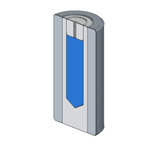 | **E4** AlSi10Mg, plug pressed hydraulically | handy | 2 × P2 + P3, pressed in F1 | 9.9 g AlSi10Mg filling the whole bore, then plug pressed flush (≈75 % dense) | 90 g | 22 % | Al-2.5Si-0.6Mg | Does compaction help (#104)? |
| 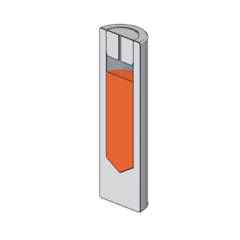 | **E5** Si only | handy | 2 × P2 + P3 | 4.64 g Si (leaves ~6 mm headspace) | 80 g | 11.6 % | **Al-12Si**, same as the Al 4047 benchmark rods | Si dissolution, compared directly with AMAZEMET's 4047 |
| 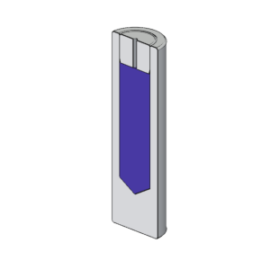 | **E6** Re-atomize our 6063 powder | handy | 2 × P2 + P3 | 8.2 g of E2's powder | 87 g | 19 % | 6063 | Powder melting with no composition change. Also O pickup per pass |
| 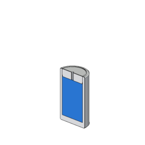 | **E7** Small batch, thin-wall cup | later | 1–2 × P4 + P5 | 7.5 g AlSi10Mg | 19 g per cup | 39.5 % | Al-4.2Si-0.55Mg | How small a charge still pours. Thin wall = less oxide skin ([#161 Edison note](https://github.com/vertical-cloud-lab/byu-vcl/issues/161#issuecomment-5593664416)) |

Cups stand **plug up**, so the powder drops into metal that is already liquid and the vent points up. With two slugs,
the melt is 17–20 mm deep in the annulus, assuming the floor is flat. E1, E3, E5, and E6 use the plug to close the
cup, not to compact it: the powder is tapped to the plug line first. E4 is the compaction test.

## Parts for the prototyping lab

Dimensioned drawing: [`cad/drawings/charge_parts.pdf`](cad/drawings/charge_parts.pdf) (1:1 on Letter at 100 %,
plugs 3:1), with a [PNG preview](cad/drawings/charge_parts.png). STEP: [`cad/step/`](cad/step). GitHub renders the
[STL files](cad/stl) in a 3D viewer, including a
[cutaway of the crucible with four cups](cad/stl/crucible_cutaway_4x_std_cup.stl).

| | Part | Key dimensions, inches [mm] | E1–E3 (bar on hand) | E4–E7 | Mass |
| --- | --- | --- | ---: | ---: | ---: |
|  | **P1** Solid slug | Ø.750 as received × 2.500 [63.5], .02 × 45° ends | 2 | — | 48.7 g |
| 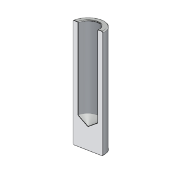 | **P2** Standard cup | Ø.750 × 2.500; Ø.500 bore 1.875 [47.6] deep to full Ø (118° point OK); drill 31/64, then bore or ream; 1/8" wall | 4 + 1 spare | 6 | 32.0 g |
| 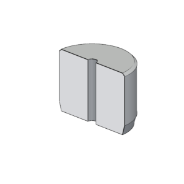 | **P3** Plug for P2 (shown ~3×) | Ø = **that cup's measured bore + .0005–.0008**; .375 [9.5] long; Ø1/16" vent through; 15° lead-in on the nose; .015 break on the top, deburr only | 4 + 1 spare | 6 | 3.1 g |
| 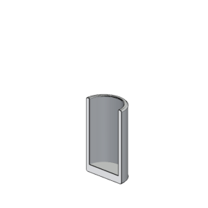 | **P4** Thin-wall cup | Ø.750 × 1.250 [31.75]; Ø.625 flat-bottom bore 1.125 deep; 1/16" wall, 1/8" floor | — | 2 | 9.1 g |
| 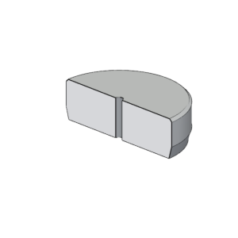 | **P5** Plug for P4 (shown ~3×) | Ø = measured P4 bore + .0005; .1875 [4.76] long; vent; lead-in | — | 2 | 2.5 g |
| 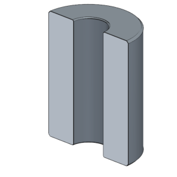 | **F1** Press support sleeve (1018 cold-finished, ASTM A108) | Ø1.250 × 2.500; bore = **measured P2 OD + .0005 max**, line-to-line is better | — | 1 | 252 g |

**Bar budget.** Each piece uses its length plus ~3 mm for kerf and facing, and ~25 mm is left as a chucking
remnant. E1–E3 plus a spare cup set take 528 of the 585 usable mm of the bar on hand. E4–E7 need 559 mm, so order
**one more 1640T16**: 2 ft ($21.65) just covers it, and 4 ft ($36.08) leaves room for re-dos (prices as of 9/17). At one
slug per run, all seven runs fit in the bar on hand (504 mm).

**Machining rules that matter** (also on the drawing):

1. **Cup first, then plug.** Measure each cup's bore and turn its own plug to **+.0005–.0008"** over it, never
   more. `fit_check()` in [`charge_cad.py`](cad/charge_cad.py) works this out from Lamé rather than asserting it,
   and lands in `parts.json`. At .0008" the contact pressure is 30.7 MPa and P2's 1/8" wall sees 79.7 MPa hoop at
   the bore, **98.7 MPa von Mises — 0.90 of 6063-T52's 110 MPa minimum yield**. The elastic ceiling is **.00089"**.
   *The old .001" limit was wrong*: hoop alone understates the bore by 24 %, and at .001" von Mises is 123 MPa,
   1.12× yield. Press force at .0008" is **1.3–1.6 t** (µ 1.05–1.35 static for dry Al on Al — 0.4 is the sliding
   value and it is breakaway that sizes the press). Reserve 2 t. The thin cup P4 is elastic to .0011".
2. **Every plug is vented** (Ø1/16" through the axis). Gas sealed in with the powder has nowhere to go until the cup
   melts, which is the melt-ejection risk flagged in #104 and PR #134. The chamber is also pumped down before melting.
3. **Slug OD ≤ measured rod-to-wall gap − 0.7 mm**, because Al outgrows graphite on heating. A max-tolerance bar
   (Ø.764) needs a 20.1 mm gap; otherwise skim the ODs. This matters even more for the 5N Ø20.0 rods: **a Ø20.0 bar
   in a 20 mm gap has to be turned down** before it goes in.
4. No marker ink, scribing, or stamping on the parts. Degrease in IPA, dry, weigh each part to 0.01 g, and label the
   bag.

## Every size is a stock size

Checked on 2026-09-25, because a drawing that calls out a size nobody stocks turns a two-day job into a two-week
one. Three dimensions were not standard and were changed; the rest were already right.

| Dimension | Standard? | Governing standard |
| --- | --- | --- |
| Ø3/4" 6063 bar | ✅ stock, on hand | ASTM B221 extruded bar |
| Ø.500 bore, Ø.625 bore | ✅ both standard chucking-reamer sizes | ASME B94.2 |
| 31/64 pilot drill before the Ø.500 bore | ✅ fractional; leaves .0156" total stock, which is Machinery's Handbook practice for a 1/2" reamer | ASME B94.11M |
| 118° drill point left in the cup bottom | ✅ general-purpose point | ASME B94.11M |
| Lengths 2.500 / 1.875 / 1.250 / .375 / .1875 | ✅ all on the inch scale | — |
| 15° press-fit lead-in | ✅ 10–15° is the recommended lead-in | ANSI B4.2 |
| .0005–.001" interference on a Ø.500 bore | ✅ top of **FN1**, the class ANSI B4.1 designates for *"thin sections or long fits"* — which is exactly a 1/8" wall | ANSI B4.1 |
| ~~Ø1 mm vent~~ → **Ø1/16"** | ⚠️ changed. A metric bit isn't in a US fractional/number index, and at .375" deep a 1 mm bit is 9.5×D where 1/16" is 6×D. #60 (.040") is the alternate if 1/16" looks too big | ASME B94.11M |
| ~~0.5 / 0.3 mm chamfers~~ → **.020 / .015"** | ⚠️ changed. The sheet was mixing mm and inch callouts, which is how a part gets made wrong | — |
| ~~Ø2.000" F1 sleeve, bore +.001–.002"~~ → **Ø1.250", bore +.0005" max** | ⚠️ changed, see below | 1018 CRS stock size |

**Why F1 shrank, and why its bore got tighter.** The cup's OD grows only **.00074"** before its bore reaches
yield (same Lamé calculation, in `fit_check()`). A .001–.002" slip fit therefore never touches the sleeve until
after the cup has already started to yield — the sleeve was decorative. Bored to +.0005" it actually takes load.
And it doesn't need to be 2": .25" of 1018 over a .750" bore sees ~30 MPa hoop at 100 MPa bore pressure, nowhere
near its ~370 MPa yield. Ø1.250" is a stock size, weighs 252 g instead of 870 g, and is less boring.

**One thing to watch, not a change.** A 1/2" chucking reamer's flute is 2.000" (ASME B94.2) and the bore is
1.875" deep, so a standard reamer only just reaches, with no room for chips. Single-point boring has no such limit
and gives a measured bore, which is what the plug is matched to anyway. The drawing now says *bore or ream*.

## Independent review (Edison, 2026-09-25)

Two FutureHouse/Edison crows were run against this folder — a literature crow on the metallurgy and an analysis
crow on the arithmetic. Raw answers and task ids are in
[`outputs/issue-222-edison-doublecheck/`](../outputs/issue-222-edison-doublecheck). What they changed:

**Confirmed, unchanged:** the Lamé contact pressure and hoop stress; the 0.00074" hoop-only OD growth; every
standard size above; the 2.000" reamer flute; four slugs fit and five do not (five need a 16.205 mm pitch radius
cold and 16.432 mm hot, against 16.420 mm available — 0.012 mm interference even pushed outward); Al ≈1.4 % and
graphite ≈0.3 % linear growth to 600 °C; BN wash on graphite is published rePowder practice.

**Corrected, and now in the files:**

| Was | Now | Why |
| --- | --- | --- |
| .001" interference ceiling | **.0008"** | Yield is von Mises, not hoop alone. At .001" the bore is (−38.3, 99.7, 0) MPa → **123.4 MPa von Mises, 1.12× yield**. Elastic ceiling .00089" |
| µ 0.4–1.2, press 0.6–1.8 t | **µ 1.05–1.35, 1.3–1.6 t** | 0.4 is *sliding* Al-on-Al; breakaway is what sizes the press. Reserve 2 t |
| F1 keeps the cup elastic | **It doesn't, and can't** | Even line-to-line, at E4's ~100 MPa bore pressure the Al bore is at 152 MPa von Mises; it first yields at ~73 MPa. The steel is fine (147 MPa von Mises against ~345 MPa). **F1's job is to bound the OD, not prevent set** — so gauge each cup's OD after pressing and before it goes near the crucible |
| "mild steel" | **1018 cold-finished, ASTM A108** | Round bar isn't cold *rolled* |

**Not changed — our numbers are right.** Edison's masses (cup 32.46 g, lid 3.20 g, slug 48.69 g) are higher than
ours (31.98 / 3.15 / 48.65) because it worked from nominal dimensions and said so: it ignored the .020 edge
breaks and the 118° drill point that the CAD actually cuts. The CAD volumes stand.

### Metallurgy flags — these are for #161, not for the machinist

Ranked by how much they would change the plan:

1. **Elemental Si may not dissolve in time (E3, E5).** Si melts at 1414 °C, so at 700–850 °C it *dissolves*,
   mass-transfer limited. Measured: Si cylinders at 738 °C were only **29–44 % dissolved after 2–3.5 min**.
   Raising superheat 40→80 °C bought ~30 % on the mass-transfer coefficient; stirring bought more. Edison's
   recommendation is **AlSi50 master alloy** instead, or coarse clean granules added below the surface with a
   validated hold. Undissolved Si in front of a **Ø0.7 mm nozzle** is the failure mode.
2. **Powder inside a cup melts, but not necessarily clean (E1, E4, E6, E7).** Every particle carries an alumina
   skin that does not dissolve in the melt; opposed skins make Campbell bifilms. Gas-atomised powder also holds Ar
   and adsorbed moisture, and liquid Al dissolves ~15× the hydrogen that solid Al does. Standard practice is
   vacuum degassing at 350–450 °C before consolidation — which the sealed cup has no path for. Remelting
   high-surface-area Al (chips) recovers only 60–83 % without flux, ~90 % with good Ar practice; powder is worse.
3. **The vent is a compromise, and Edison flags both sides of it.** Sealed, the capsule can pressurise; open, the
   Ø1/16" hole can aspirate powder during pump-down and can wick liquid Al under the 200 mbar Ar over-pressure.
   It specifically contraindicates **E4** — hydraulic compaction of a near-sealed capsule removes the interparticle
   volume the gas needs. A sintered or labyrinth plug above the metal line is the proper fix if we keep going.
4. **The cup is most of the charge.** At ~35 g of 6063 around 8–10 g of powder the cup is ~80 % of the slug, so it
   sets Si, Mg, Fe and Cu. Already in the mass balance here, but Mg also *leaves*: it oxidises and evaporates
   above ~700 °C (−7.8 % over ten LPBF cycles for AlSi7Mg, and worse in a small melt). Treat the designed Mg as an
   upper bound.
5. **Don't pre-specify a re-atomisation pass count (E6).** No Al-specific per-pass oxygen number exists. Proxies:
   AlSi10Mg LPBF reuse adds ~0.005 pp O per build against a 0.2 wt % limit; ultrasonic atomisation of Ti chips
   added ~220 ppm. Full remelt makes fresh droplet surface, so expect more. Measure O by inert-gas fusion each pass.
6. **Sequencing.** Run AMAZEMET's own solid **Al 4047 benchmark rods first**, then the solid control (E2), then
   one powder cup with full post-run chemistry — before E3–E7 add variables.
7. **E7's 1.6 mm wall** may melt through or collapse before its powder has melted. Unverified.
8. **Crucible geometry is still unverified.** Edison searched and found **no** published rePowder crucible bore,
   sealing-rod diameter, or 4047 rod dimensions. Ø52 / Ø12 remain inferred. It also notes that a Ø19.05 cup in a
   20 mm gap leaves almost nothing for expansion and gas flow — the same point as machining rule 3.

## Filling a cup

1. Dry the powders at 80 °C for ≥10 h (#161). Fill in the clean powder area with the usual PPE (#126).
2. Weigh the cup + plug pair. For E3, premix the Si and AlSi10Mg in a vial first.
3. Weigh the powder into the cup, tapping as you go. Stop at the target mass or the plug line, whichever comes first,
   and record the actual mass.
4. Press the plug flush in the soft-jaw vise or arbor press. For E4, stand the cup in F1 on a flat plate and use the
   hydraulic press, ~3–4 t (≈1.3 t to compact the powder plus ≈0.6–1.8 t of press fit). F1 is the cup's length, so
   the platen bottoms out at flush. Push the cup out through F1 with a 5/8" drift. Don't clear the vent with
   compressed air (#126).
5. Weigh the loaded cup: that mass balance gives the true powder fraction. Store sealed with desiccant (#30, #230).

## Measure before machining

The crucible is reachable now: Bartosz: "if you move the foam out you can see the crucible" (9/17 call, 20:12). Wear
gloves (#126).

1. **Crucible bore** at the rim and near the floor (graphite crucibles are often tapered).
2. **Sealing-rod OD**, and whether its tip sits in a conical seat. How much flat floor is there beside it?
3. **Depth** from the rim to the floor beside the rod, and the clearance above the rim with the lid closed. Is ~120 mm
   really available?
4. **Which crucible we have**, 225 or 400 ml: part number or packing list.
5. **The Al 4047 benchmark rods** AMAZEMET shipped: diameter, length, and how many make a run. That is AMAZEMET's own
   answer to both "what fits" and "what's the minimum charge".
6. **For Bartosz:** the minimum charge for a steady pour; whether the rod can be pulled and re-seated after loading
   (the ring concept depends on it); and whether a BN wash on the graphite is standard for Al (#161 Edison note).

Change `CRUCIBLE_ID`, `SEALING_ROD_D`, `CRUCIBLE_DEPTH`, or `STOCK_D` in `charge_cad.py` and re-run to update
everything.

## Regenerating

```bash
pip install build123d pyvista matplotlib   # tested: build123d 0.13.0, pyvista 0.49.0, VTK 9.7.0
cd atomizer-charge/cad
python charge_cad.py          # step/, stl/, parts.json, experiments.json (masses, compositions, bar budget)
xvfb-run -a python render.py  # renders/ (VTK needs a display; xvfb-run on a headless machine)
python drawings.py            # drawings/charge_parts.pdf + .png
xvfb-run -a python machining.py  # anim/*.gif (also needs pillow)
```
