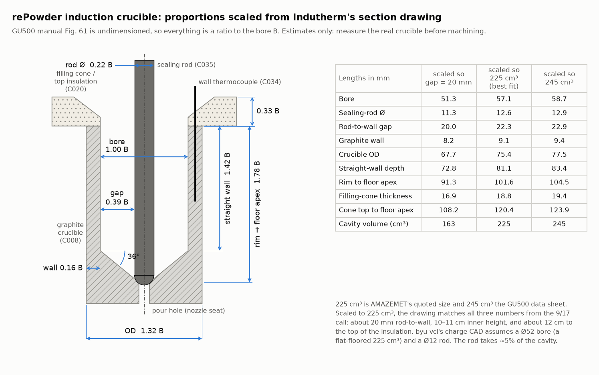
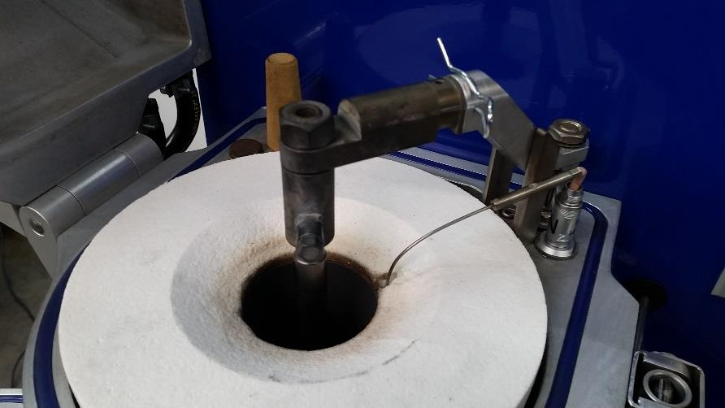
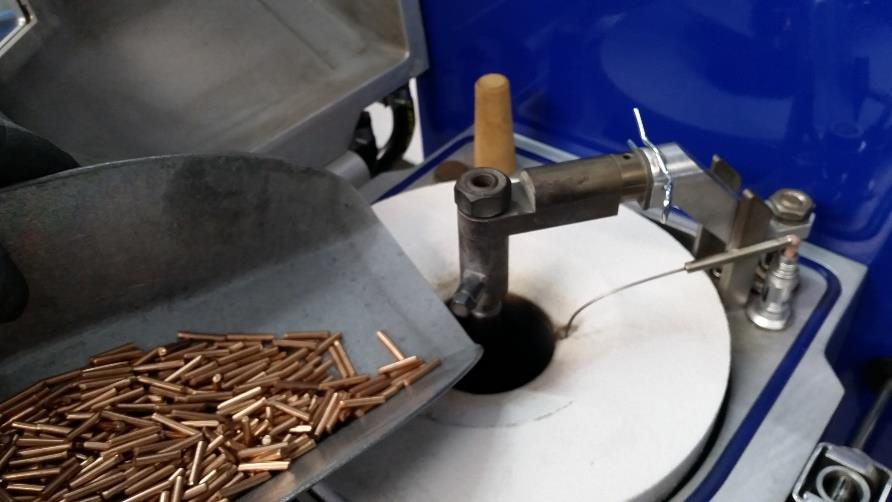

# rePowder atomizer: technical reference

Specs for BYU's rePowder induction module, restated from AMAZEMET's and Indutherm's documentation and AMAZEMET's quote, for the first Al runs in [byu-vcl#222](https://github.com/vertical-cloud-lab/byu-vcl/issues/222#issuecomment-5822478482) and as a general reference. Page numbers are PDF pages of the source documents. The documents are listed under [Sources](#sources) but not included: the manuals are copyrighted and the quote is confidential.

The text is our own words, apart from short quoted phrases. [`figures/crucible-proportions.png`](figures/crucible-proportions.png) and [`crucible_proportions.py`](crucible_proportions.py) are our own work. The two photos in [§4.3](#43-loading-clearance) are cropped from Indutherm's GU500 manual (Figs. 38 and 41), without the manual's text. No prices are reproduced, and the furnace's Indutherm machine number is left out on purpose ([§12](#12-contacts)).

**Contents:** [1 Which machine](#1-which-machine-these-documents-describe) · [2 Answers for byu-vcl#222](#2-answers-for-byu-vcl222) · [3 New relative to byu-vcl](#3-new-relative-to-byu-vcl) · [4 Crucible, sealing rod, nozzle](#4-crucible-sealing-rod-and-nozzle) · [5 Induction furnace](#5-induction-furnace) · [6 Ultrasonic system](#6-ultrasonic-system) · [7 Atmosphere](#7-atmosphere-pressure-and-vacuum) · [8 Utilities and site](#8-utilities-and-site) · [9 Controls and data](#9-controls-and-data-interfaces) · [10 Maintenance](#10-maintenance) · [11 Safety](#11-safety-notes) · [12 Contacts](#12-contacts) · [13 Documents to request](#13-documents-to-request) · [Sources](#sources)

## 1. Which machine these documents describe

BYU has the **stand-alone induction module**:

- The Facility Guide lists a complete system as "Induction Module, HMI (integrated into the side of Induction Module), Vacuum Pump" (FG p. 4).
- byu-vcl calls the facility guidelines "induction-only" ([#41](https://github.com/vertical-cloud-lab/byu-vcl/issues/41#issuecomment-4225003786)).
- The delivered unit ([photo, byu-vcl#124](https://github.com/vertical-cloud-lab/byu-vcl/issues/124#issuecomment-4694261295)) matches the module in O&MM Fig. 31: the induction furnace on top, with the melting control panel beside it; the atomization chamber below, with the ultrasonic unit in its door; a chute cone down to an airlock powder container; and a pneumatic cylinder that seals the chamber to the furnace.
- It matches AMAZEMET's quote for a "rePowder Upgrade Induction Atomization Platform".
- The purchase order would settle it.

How each document applies:

| Document | What it covers | Applies to our unit? |
|---|---|---|
| **O&MM** (AMAZEMET, v2.2, Apr 2023) | The plasma "materials development platform" (chamber, TIG/plasma torch, 20 kHz ultrasonics) with options. The induction module gets one page (p. 74) and points to a separate "O&MM rePowder Induction Module" (document 2), which we don't have. Its ID page (p. 8) is for a plasma-platform unit built in 2023, so this is a generic copy, not our unit's. | Partly: safety, utilities, ultrasonic assembly, procedures |
| **Facility Guide** (AMAZEMET, "rePowder 2025 Induction") | Site preparation for the induction module | Yes |
| **GU500 TechDoku** (Indutherm, 2022-06-03) | Indutherm's GU500 granulator: the same maker's induction furnace, crucible chamber, sealing rod and F-generator | **With care.** Our furnace head is a Blue Power **"aus500 powered by AMAZEMET"**. Blue Power's service sticker gives Indutherm's technical-service number. byu-vcl compared the unit with this manual and concluded "they are not the same" ([#124](https://github.com/vertical-cloud-lab/byu-vcl/issues/124#issuecomment-4694242549)). The crucible chamber in AMAZEMET's own photo (O&MM Fig. 32) matches the GU500's (Fig. 4). The GU500's granulation tank, contact pressure plate and front-panel buttons don't exist on ours; the atomization chamber and HMI replace them. |
| **GEN** (Indutherm generator types DM/F/PM, software MI800.0151) | Parameter list and error codes for Indutherm/Blue Power generators, including GU500 and the AU atomizers | Probably, for codes and parameter meanings |
| **STG1** (SONICTECH, v1.01, 2023-04-19) | The ultrasonic generator | Probably; confirm the nameplate |
| **HMI** (Weintek cMT2166X datasheet) | 15.6" HMI panel | Probably the panel on the module |

## 2. Answers for byu-vcl#222

The ["What I need" list](https://github.com/vertical-cloud-lab/byu-vcl/issues/222#issuecomment-5822478482), item by item:

| Asked | What the documents say | Status |
|---|---|---|
| **Crucible bore, sealing-rod OD, depth, clearance above the rim** | No document dimensions the crucible. Indutherm's section of the crucible chamber (GU500 Fig. 61, p. 75) is a CAD drawing, so its proportions can be measured, and scaling needs only one known length. Scaled to the quoted **225 cm³**, it is consistent with all three numbers Bartosz gave on 9/17: ≈22 mm rod-to-wall ("around 20 mm"), ≈10 cm inner height ("10–11 cm"), and ≈12 cm to the top of the insulation ("12 cm"). That gives a **≈Ø57 bore** and **≈Ø12.6 rod**. The floor is a ~36° cone down to a central pour hole, not flat. That is why byu-vcl's flat-floor inference came out at Ø52. A ≈19 mm insulating "filling cone" sits on the rim, and a charge can stand up into it (≈12 cm above the floor). Clearance above that, under the closed bell, isn't documented. For loading, the tighter limit is the sealing-rod adapter, which hangs over the axis down to about the top of the filling cone ([§4.3](#43-loading-clearance)). | **Estimate only; still measure.** Table and drawing below |
| **225 or 400 ml** | AMAZEMET's quote: "a graphite crucible of 225 cm3 with a sealing rod system", plus an "Induction 225 cm3 consumable pack". The 400 cm³ crucible is a separate upgrade that wasn't quoted (PL-2024). Indutherm's data sheet rates the same furnace's standard crucible at 245 cm³ (GU500 p. 18), and so does the O&MM (p. 39). | **225 cm³** (Indutherm: 245) |
| **4047 benchmark rods** | Not described in any document. Commissioning uses 1 kg of feedstock agreed with AMAZEMET and shipped as an "acceptance kit". About 0.5 kg is used during start-up; the rest, and its powder, is ours (O&MM p. 93). | Measure the rods |
| **Minimum charge for a steady pour** | Not stated. The upper bound is **≈0.5 kg Al**: the price list gives 0.9 kg Al for the 400 cm³ crucible, which matches 400 cm³ of liquid Al (2.37 g/cm³) minus the rod's volume, and pro-rating to 225 cm³ gives ≈0.5 kg. The generator warns W068 "too little material inside crucible" when it can't reach nominal current (GEN p. 20). A small charge also gives little head: 100 g of Al is ≈3 cm of melt, ≈7 mbar. That is well below the ≈50 mbar needed to push Al through a 0.7 mm nozzle it doesn't wet (see [§4.5](#45-nozzle-and-flow)). Small charges will therefore pour on chamber overpressure, not head. | Ask Bartosz / AMAZEMET |
| **Can the sealing rod come out for loading?** | It is removable: a screw holds it in an adapter, and a spring split pin holds the adapter on the holder (GU500 p. 50). The documented order is crucible → thermocouple → vacuum out → **rod in and seated** → **then weigh and fill the metal** (pp. 47–51). Metal goes in around a seated rod. Indutherm: the system "must not be operated without a sealing rod", and its tip "must stay in the centre of the pouring hole even when sealing-rod is open" (p. 15). Bartosz: running without the rod is possible for awkward feedstock, "but we'd have to discuss it" ([transcript 20:12](https://github.com/vertical-cloud-lab/byu-vcl/blob/56fae38/docs/meetings/2026-09-17-repowder-install/transcript.md)). A ring charge would have to go in before the rod, which is outside the documented order. | Ask AMAZEMET before a ring |
| **BN wash on the graphite** | Not mentioned in any document. Related items: Indutherm recommends a gas-washing (pump/backfill) cycle before heating, partly "to reduce wear of the graphite parts" (GU500 p. 44), and high-temperature grease on the sealing-rod thread weekly (p. 60). byu-vcl's Edison run found published rePowder work using BN spray. | Ask AMAZEMET |
| **Crucible page of the O&MM** | There isn't one. The O&MM is the plasma-platform manual, and the induction module has its own ("document 2", p. 74), which we don't have. The GU500 manual's machine-specific spare-parts list, `G<machine no.>_…_00`, would name the crucible and rod parts. It was never inserted; p. 77 is a placeholder saying to insert it. | Request both ([§13](#13-documents-to-request)) |

[`crucible_proportions.py`](crucible_proportions.py) documents how this was done: the drawing's edges were read off the image in the PDF and scaled three ways. The ratios assume only that the drawing is to scale and that our crucible is the one drawn. What to measure, in order: bore at the rim and just above the floor cone, sealing-rod OD, depth beside the rod to the cone, filling-cone thickness, and height from its top to the closed bell.

GU500 Fig. 62 is the same section for the micro-granulation variant, in which a nozzle holder carrying a nozzle plate screws into the crucible bottom. Part codes from both drawings are in [§4.1](#41-parts).

## 3. New relative to byu-vcl

byu-vcl already has, from the 9/17 call, Bartosz's emails and the web: the 20 mm gap, the 10–11 cm height, 32 A / 400 V, 8 bar argon, 13 mm hoses, compressed air up to 300 L/min, and the d50 by frequency. These specs aren't in byu-vcl, or resolve something it lists as unknown or contradictory:

| Topic | byu-vcl has | Documents say | Where |
|---|---|---|---|
| Crucible volume | "225 ml and 400 ml … not confirmed" | **225 cm³** quoted, with a 225 cm³ consumable pack | §2 |
| Crucible geometry | Ø52 / Ø12, flat floor, inferred | Conical floor ≈36°; ≈Ø57 bore / ≈Ø12.6 rod when scaled | §2 |
| Loading clearance | A ring must clear "whatever grips its top"; slugs not checked | The rod adapter over the axis leaves a ≈18 mm band beside it: too narrow for a 3/4" slug to go straight down | §4.3 |
| Crucible material | graphite vs "ceramic crucible" | **Graphite** (quote, O&MM, GU500) | §4 |
| Nozzle | 0.7 mm (literature) vs 2.0 mm (schematic) | 2 mm is Indutherm's hole *for water granulation*. Micro nozzle plates are 0.3 / 0.5 / 1 mm; blank graphite and ceramic plates can be drilled. The consumable pack includes "nozzles" of unstated size. | §4.5 |
| Max temperature | 1300 vs 1400–1500 °C | **1300 °C** with the Type N thermocouple; 1600 °C only in a special configuration (GU500 p. 18). AMAZEMET: "nonferrous alloys up to 1300°C"; 1600 / 1850 °C are paid options. | §5 |
| Induction power and frequency | not found | **10 kW, 7 kHz**, F-type generator | §5 |
| Thermocouple | not found | **Type N**, in a hole in the crucible wall. The consumable pack adds a centre thermocouple (the error list mentions one in the sealing rod) | §4, §5 |
| Melt program limits | — | −1 to +0.5 bar in the melting chamber; 10–1300 °C; ramp 1–200 °C/min; 0–5 gas washes | §5 |
| Ultrasonic frequency | "40 or 60" / unconfirmed | **40 kHz** single-frequency generator + 1 kW 40 kHz IP67 transducer (quoted) | §6 |
| Ultrasonic generator | not found | SONICTECH STG1: 230 V, 0.5 kW at 40 kHz per its manual, Modbus RTU | §6 |
| Sonotrodes | "plates", unnamed | Plate sonotrodes 20×100 in Ti, NbZr, CFC, CFC Si:Mo and CFC W; 40×200 in CFC and AlSi316 | §6 |
| Current draw | 60 A vs 16 A vs 32 A | 32 A supply for the whole module, 13.9 kW max (FG). The furnace alone is fused at 16 A (GU500). | §8 |
| Footprint and weight | "Waiting to hear back" | Module ≈300 kg on 4 feet, 714 × 600 mm spacing; crate 1000 × 1010 × 1850 mm, 400 kg | §8 |
| Room envelope | not found | 15–30 °C with an RH cap that falls as temperature rises; never below 10 °C; ≥3 °C above dew point | §8 |
| Argon use | not found | ≈15 L/min average in process (FG); furnace 4–6 L/min (GU500); chamber 57 L | §7, §8 |
| O₂ | <50 vs <100 ppm | O&MM spec is <100 ppm in process and max 0.1 % on the 0–25 % sensor; the quoted 0–1000 ppm sensor is on the induction chamber | §7 |
| Controls and data | "PLC model? OS? data?" | Weintek cMT2166X HMI (Ethernet, RS-485/232); Indutherm DMS over RS232/RJ45 (casting logs); STG1 over RS485 Modbus | §9 |

## 4. Crucible, sealing rod, and nozzle

### 4.1 Parts

Only C038 is named in the text. The other codes come from leader lines in GU500 Fig. 61 (p. 75) and Fig. 62, cross-checked against the labelled photos in Figs. 4 and 23. They are Indutherm consumable codes; the machine-specific list would confirm them.

| Code | Part | Confidence |
|---|---|---|
| C008 | Graphite crucible | High (Figs. 61, 62; Fig. 23 item 6) |
| C011 | Crucible insulation tube | High (Fig. 62; Fig. 23 item 3) |
| C020 | Filling cone: "upper insulation and additional filling aid" | Medium (Fig. 61 leader; named in Fig. 4) |
| C022 | Crucible bottom insulation | High (Figs. 61, 62; Fig. 23 item 2) |
| C034 | Wall thermocouple, in a hole drilled in the crucible wall | High (Fig. 61; Fig. 4 item 4) |
| C035 | Sealing rod (the micro photos call it the stopper rod) | High (Fig. 61; Fig. 4 item 7) |
| C017 / C018 / C037 | Rod-holder arm / rod adapter / locking screw | Medium |
| C036 | Something at the top of the thermocouple | Low |
| C038 | Metal filter (brass). The vacuum is drawn from the crucible chamber through it. | Named (Fig. 4) |
| C015 / C016 | Bell window frame / glass | Medium |
| C019 / C021 | Bell O-ring / bell lock | Medium |
| C081 | Outer layer between the insulation tube and the inductor (relabelled from C003) | Low |
| C134 / C135 / C136 / C138 | Micro variant: screw nut / nozzle holder / nozzle plate / graphite seal | Medium (Fig. 62 + Fig. 23) |

### 4.2 Assembly and loading order

From the GU500 micro-granulation walkthrough (pp. 47–51) and the crucible change (p. 34):

1. Graphite seal on the bottom plate, then the crucible bottom insulation, then the insulation tube.
2. Screw the nozzle holder, with its nozzle plate, into the crucible bottom.
3. Slide the crucible into the inductor. Turn it so **the thermocouple hole drilled in the crucible wall faces the thermocouple plug**.
4. Second graphite seal and nut on the thread that sticks out below; there is a special tool for the nut.
5. Filling cone on top, with its cut-out lined up with the wall hole.
6. Thermocouple, in its ceramic tube, into the wall hole.
7. Vacuum out the crucible and the nozzle opening.
8. Fit the sealing rod: screw it into its adapter, then pin the adapter to the holder with the spring split pin.
9. Press "sealing rod" to lower it. LED on = open/up, off = closed/down. Swivel the rod ~45° each way to seat it in the pour hole.
10. **Weigh and fill the metal**, around the seated rod ([§4.3](#43-loading-clearance)).
11. Close the bell. Evacuate and backfill (Indutherm: 1 cycle for usual alloys, 2 if there's Mn; 2 recommended for the micro setup), then heat.

### 4.3 Loading clearance

The rod is seated before any metal goes in, so a charge has to get past the rod's adapter and holder arm. Indutherm's photos of fitting the rod and of filling show the layout. They are of a GU500 with the micro-granulation crucible, not of our aus500, though the crucible top matches AMAZEMET's photo of the rePowder furnace (O&MM Fig. 32).

 

*Left: the sealing rod fitted and seated, before filling. Right: filling with cut pieces from a scoop. Photos from Indutherm's GU500 manual (Figs. 38 and 41), cropped to the photo.*

Around the mouth, with the bell open:

- **Rod adapter:** hangs from the holder arm over the crucible's axis and reaches down to about the top of the filling cone. ≈22 mm wide along the arm.
- **Holder arm:** reaches in from one side (back right in the photos). Its underside is ≈28 mm above the top of the filling cone, ≈47 mm above the crucible rim.
- **Wall thermocouple:** on the arm's side. Its sheath runs over the insulation from its plug into a hole in the crucible wall at the rim.
- **Filling cone:** its conical mouth narrows to the bore, so the opening is widest at the top.
- **Annulus between rod and wall:** ≈22 mm ([§2](#2-answers-for-byu-vcl222)).

These sizes are scaled from GU500 Fig. 61 in the same way as the crucible figure, at 225 cm³. [`crucible_proportions.py`](crucible_proportions.py) prints them, and the slug margins below, for all three scalings.

For byu-vcl's 3/4" (19.05 mm) slugs:

- They can't go straight down past the adapter. Beside it there is a ≈17.7 mm band between the adapter (≈11 mm from the axis) and the bore wall (≈28.5 mm).
- Tipped in with the top leaning away from the adapter, until the slug is ≈45 mm into the bore and its top clears the adapter, they are marginal at best. Across the crucible figure's three scalings, the fit ranges from 2 mm too tight to 0.5 mm to spare.
- A 5/8" bar would go straight down with 0–2.3 mm to spare, and a 1/2" bar with 3–5.5 mm.
- A 2.5" (63.5 mm) slug is taller than the ≈47 mm from the rim up to the arm, so slugs go in away from the arm.
- Indutherm's own charge (right-hand photo) is short cut pieces that drop into the annulus around the seated rod.

The adapter's footprint is the least certain number: the drawing shows only its width along the arm. Before cutting slugs:

1. With the rod fitted and closed, measure the adapter's width both ways, the height of its bottom and of the arm's underside above the filling cone, and where the arm and thermocouple sit around the mouth.
2. Ask AMAZEMET whether the rod can be stood in the pour hole on its own, with the adapter fitted and pinned after the metal is in, or the rod pulled and re-seated after loading. Either would clear the mouth, but both are outside the documented order (the same question as the ring in [§2](#2-answers-for-byu-vcl222)).
3. Check how AMAZEMET's 4047 benchmark rods are meant to go in.

### 4.4 Sealing-rod rules

- Never operate without the sealing rod (GU500 pp. 15, 60).
- Its tip stays centred in the pour hole even when lifted.
- With the rod fitted and closed, its cylinder must **not** sit on the lower end stop, or the hole isn't sealed.
- If protective gas (which drives the pneumatics) fails, the rod can't close properly. A check valve holds pressure in the cylinder. Don't press any pneumatic buttons; switch off (pp. 15, 33).
- A hot rod is re-seated by turning it with an 8 mm socket on the locking screw (p. 22).
- Weekly: high-temperature grease on the rod's thread (p. 60). After an error, check the rod, "graphite ball", crucible and bottom insulation.
- A thermocouple can also go *into the sealing rod* for a centre reading (GEN p. 18, error E025). AMAZEMET's 225 cm³ consumable pack "contains an upgrade allowing for temperature measurement in the middle of the furnace".
- A pour stops by closing the rod once the crucible is empty. Open the bell only below 500 °C (GU500 p. 42).

### 4.5 Nozzle and flow

- **Our nozzle size is unknown.** The consumable pack lists "nozzles" without a size; check what shipped.
- Indutherm recommends a 2 mm hole for water granulation, with blank crucibles available for drilling, e.g. 1 mm (p. 41). Changing the granule size means changing the "screw-fit in the crucible bottom" (p. 34).
- Micro nozzle plates come prepared at 0.3, 0.5 and 1 mm. Blank graphite and ceramic plates are also available. Plates are 4 mm thick; for very small holes, drill oversize and use the small drill for the last 1–2 mm (pp. 48, 55).
- Published rePowder work used a 0.7 mm hBN nozzle (byu-vcl Edison run).

Indutherm's bronze data (CuSn6, p. 55; ≈500 g poured in 1–5 min). Mass flow depends strongly on the pressure difference across the nozzle:

| Nozzle | Mass flow, bronze | "Graining pressure BEGIN" to start flow |
|---|---|---|
| 1 mm | ~30 kg/h | 0.0 bar |
| 0.5 mm | ~12 kg/h | 0.1 bar |
| 0.3 mm | ~6 kg/h | 0.2 bar |
| 0.1 mm | ~1 kg/h (estimated) | 0.5 bar |

Indutherm's hydrostatic figures are 10 cm of water = 10 mbar and 10 cm of bronze ≈ 80 mbar. They suggest raising the pressure from BEGIN to END as the melt level drops, to keep flow steady (p. 55).

*Derived, not from the documents:*
- 10 cm of liquid Al ≈ 23 mbar.
- In the ≈Ø57 bore, 100 g of Al stands ≈3 cm (≈7 mbar), 200 g ≈5 cm (≈11 mbar), 500 g ≈10 cm (≈23 mbar).
- The pressure needed to push a melt through a nozzle it doesn't wet is about 2γ/r (γ = surface tension, r = nozzle radius). With γ ≈ 1.15 N/m for bronze, that reproduces Indutherm's BEGIN pressures (0.5 mm ≈ 0.09 bar, 0.3 mm ≈ 0.15 bar, 0.1 mm ≈ 0.46 bar).
- For Al (γ ≈ 0.87 N/m, ignoring the oxide skin) it gives ≈35 mbar at 1 mm, ≈50 mbar at 0.7 mm and ≈70 mbar at 0.5 mm.
- So head alone won't start a sub-mm pour for charges under ~0.5 kg. Overpressure (0–0.5 bar available) will.

Indutherm's granulation rules of thumb (pp. 43–45) are for water granulation, not ultrasonic atomization, so use them loosely:
- **Superheat at least 50–80 °C** above liquidus, depending on material and nozzle.
- Hold ≥5 min once fully molten, or 10 min if alloying in the furnace (p. 42).
- Granules come out ≈1.5–2.5 × the nozzle diameter.
- On a first attempt use one hole, or at most three holes of 2–3 mm.

## 5. Induction furnace

Indutherm GU500 data (p. 18). Our "aus500" appears to share this platform; confirm against its nameplate.

| Parameter | Value |
|---|---|
| Crucible volume | 245 cm³ (~3.5 kg of 18 kt Au); "standard values which can be optionally changed" |
| Max working temperature | Set by the thermocouple: Type N (NiCrSi–NiSi) to 1300 °C, Type S (PtRh–Pt) to 1500 °C; 1600 °C in a special configuration |
| Generator | 10 kW, 7 kHz, microprocessor-controlled F-type, with a middle-frequency transformer |
| Melting-chamber pressure | −1 to +0.5 bar |
| Mains | 3 × 400 V, 50/60 Hz (3 × 208 V optional), ±10 %; fuse 16 A at 400 V (25–32 A at 230 V); short-circuit current max 5.0 kA; 5-pin CEE plug |
| Cooling water | 13 mm hose (8 mm before 2018); 2.5–5 bar; ≥120 L/h; 3–8 °dH; pH 7–8.5; inlet 15–25 °C (20–25 °C to avoid condensation); outlet unpressurized, ≤70 °C |
| Cooler | 5 kW (50 % of heating power) |
| Protective gas | Ar or N₂, ≥99.9 %, ≤8 bar, 6 mm hose (1/4" fitting), constant-*pressure* regulator; 4–6 L/min |
| Vacuum | 13 mm hose (1/4" fitting), 0–20 mbar abs; pump ≥21 m³/h, final pressure 2 mbar |
| Vacuum-pump socket | 16 A CEE, 4-pin, ≤1.0 kVA; check rotation direction |
| Ambient | 10–35 °C, RH 20–80 %; cooling air ≤35 °C |
| Size, weight, rating | 500 × 850 × 1550 mm (W × D × H); ≈160 kg; IP20; 75 dB(A) |
| Intended use | "melting, pouring and vacuum casting of commercially available precious metals and of copper- or aluminium-alloys" (p. 8) |

AMAZEMET's own figures for the module:
- "Full-scale production system for nonferrous alloys up to 1300°C", "Low frequency 10 kW induction heater", graphite crucible 225 cm³ (400 cm³ optional) (quote).
- Options: 1600 and 1850 °C; 386 and 700 cm³ crucibles (O&MM p. 39).
- A plate sonotrode in the chamber door, a chute cone to an airlock powder container, and a pneumatic cylinder that seals the chamber to the furnace (O&MM p. 74).
- Operational footprint 1000 × 800 × 1600 mm, 240 kg (O&MM p. 42); FG gives ≈300 kg.

**Program parameters.** GU500 p. 36; on our unit they are presumably set from the HMI.

| Parameter | Range | Note |
|---|---|---|
| Temperature | 10–1300 °C | Controlled on the crucible-wall thermocouple, so the metal lags |
| Heat ramp | Off or 1–200 °C/min | |
| Max heating power | 10–100 % | |
| Gas washing | 0–5 cycles | Each is a vacuum then a backfill. GEN P040: vacuum time 5–600 s (default 20); P041: gas time 2–100 s (default 10) |
| Melting pressure | −1.00 to 0.00 bar | During heat-up |
| Graining pressure BEGIN / END | 0.00–0.50 bar | Ramped over the pour time (0–30 min) to hold flow steady |
| Turbo pressure | 0.00–0.50 bar | Short burst, e.g. to clear the nozzle or start a stuck pour |

**Generator settings** (GEN):

| Parameter | Setting |
|---|---|
| P000 thermocouple type | K 100–1200 °C, S 500–1600 °C, **N 500–1300 °C**, B 500–1700 °C, or pyrometers |
| P006 / P007 | Wall-temperature limit when a second (centre) thermocouple is fitted |
| P070 | Protective-gas flushing of the crucible is active above a threshold, 100–2000 °C (default 500 °C) |
| P130 | Heating monitor: a 3 K rise must occur within the set time (active above 90 % power, below 100 °C) |
| P137 / P138 | Maintenance reminder W150 after N heating hours or N months |

**Operating rules** (GU500 pp. 13–16, 33, 42):
- Melt under protective gas above 500 °C, otherwise there is a "jet flame or explosion" risk when opening. Use only Ar or N₂.
- Cooling water must run whenever the crucible is above 100 °C, or the inductor is destroyed. Water failure shuts the heating off.
- Keep the bell closed above 500 °C.
- Graphite doesn't glow until above 500 °C.
- No pacemakers near the running unit.
- No flammables within 5 m.

**Errors worth knowing** (GEN pp. 17–25). E = heating stops; W = warning only.

| Code | Meaning | Likely cause |
|---|---|---|
| E010 / E018 | Cooling-water flow too low | Supply off or restricted |
| E012 / E016 | Cooling-water pressure too low / temperature too low | E016 is a condensation risk: raise the inlet temperature |
| E013 | Protective-gas pressure too low | Cylinder or regulator |
| E021 / W026 | Generator power stage over-temperature | Cooling |
| E024 | Missing phase or wrong rotation | Needs a clockwise field |
| E025 | <3 °C rise while heating | Thermocouple not in the crucible wall or sealing rod; wrong type (P000) |
| E030 / E035 / W070 | Peak current too high | Old or missing crucible; worn crucible (temporary fix: less power) |
| E041 / E047 | Crucible thermocouple fault (main / second) | Unplugged, broken, wrong type |
| W067 / W069 | Resonant frequency too low / too high, or no output | Crucible worn, cracked, or poor graphite |
| **W068** | Nominal current not reached | **Too little material in the crucible**, or poor graphite |
| W081 / W083 | Crucible pressure out of range / gas-supply error | Leak, filter, bell not closed or lock too loose, low supply pressure |
| E161–E163 | Bottom-plate temperature fault / too high / rising fast | **Crucible cracked, melt in the insulation**, or bottom insulation missing |
| W150 | Regular maintenance due | P137 / P138 |

Troubleshooting from GU500 p. 56:

| Symptom | Cause |
|---|---|
| Sealing rod won't open | Protective-gas input pressure too low |
| Heating won't start | E010 cooling water, E013 gas, "OFbE" thermocouple, E021 overheating |

## 6. Ultrasonic system

**As quoted:**
- Single-frequency **40 kHz** generator, "for plasma and induction". The price list says 40 kHz gives finer particles and a narrow PSD for LPBF and thermal spray than 20 kHz. 20 kHz gives "40–150 µm range with d50 of 80–100 µm", and 60 kHz (induction only) is finer again.
- **1 kW 40 kHz IP67 transducer**, dedicated housing, and an adapter for arc and induction atomization.
- 40 kHz induction sonotrode starter pack (sizes as written in the quote):
  - 20 × 100 plates: 20 Ti, 10 NbZr, 10 CFC, 20 CFC Si:Mo, 4 CFC W (plasma), 10 CFC W
  - 40 × 200 plates: 4 CFC, 10 AlSi316
- The transducer is cooled by compressed air. The quote gives 60 psi, up to 100 L/min (see [§8](#8-utilities-and-site)).

**Generator: SONICTECH STG1** (STG1 p. 14). BASIC (no screen, remote/PLC control) or PREMIUM (touchscreen). Confirm the PN on the rear nameplate, format `G<kHz><B|P>-<500|1000>-<mount>-<options>`.

| Item | Value |
|---|---|
| Supply | 230 V AC ±10 %, 50/60 Hz, IEC C14 inlet |
| Output | 0.5 or 1.0 kW at 20/30/35 kHz; **40 kHz is listed at 0.5 kW only** (0.6 kW in, 4 A) |
| Environment | 0–40 °C, IP20, 2 kg; 181 × 69.5 × 242.5 mm body (302.5 mm long with ears) |
| Connectors (p. 21) | X1 IEC C14 mains. X2 LEMO ERA.1S.405.CTL, HV >1 kV to the transducer; plug FFB.1S.405.CTAC57, shielded coax ≥0.5 mm². X3 DB15 analogue/digital I/O. X4 14-pin 3.81 mm terminal block (Phoenix MC 1,5/14-ST-3,81). X5/X6 RJ45 RS485. |
| X3 defaults | Start (FS-24V / FS-GND), clear error, amplitude in (0–10 V; 5–10 V → 50–100 %), power out (0–10 V), outputs "US active", "Error" and "Nominal" (24 V, 0.2 A) |
| Bus | **RS485 Modbus RTU, default address 170**, up to 12 Mb/s, 8N1 (p. 27) |
| Scan readouts (p. 32) | Fp/Fs parallel and series resonance, Zp/Zs impedances, F start/stop offsets. Protection limits: Ishort, Ifast, Islow, Itune, Ufast, Z, frequency drift (p. 34) |

**Setup and assembly values** (O&MM, written for the plasma platform's cylindrical sonotrodes):

| Item | Value |
|---|---|
| Booster to transducer | M12×1.25 at 130 Nm (20 kHz); **M10 at 65 Nm (40 kHz)** (p. 118) |
| Sonotrode to booster, second sonotrode | 125 / 120 Nm (20 kHz); **60 / 55 Nm (40 kHz)** |
| Clamp O-rings | 76×3 and 64×3 (20 kHz); 76×3 and 44×4 (40 kHz) |
| Converter voltage (PC app) | 1060 V for 20 kHz; **750 V for 40 kHz**. Power limit: "should not exceed the half of the nominal transducer power" (pp. 126–127) |
| Generator current at 100 % amplitude | 1 A (p. 122) |
| Scan window | Nominal ±1000 Hz. HMI defaults: F start offset 200 Hz, F stop offset 400/500 Hz, scan step 5. Pick 20/40/60 kHz to match the transducer and LEMO cable (pp. 124, 130) |
| First start | Low amplitude (e.g. 50 %), then increase. Watch for frequency falling fast or power climbing: stop (pp. 127, 131, 145) |

## 7. Atmosphere, pressure, and vacuum

| Item | Value | Source |
|---|---|---|
| Atomization-chamber volume | 57 L; ≈130 L with recirculation and accessories | FG p. 15 |
| Operating overpressure | 0.2–0.5 bar. The fill valve closes itself at 500 mbar; a mechanical safety valve opens at 0.8 bar | O&MM pp. 54, 67, 138 |
| Melting chamber | −1 to +0.5 bar | GU500 p. 18 |
| Oxygen | <100 ppm "during the process"; max 0.1 % on the 0–25 % sensor. Optional 0–1000 ppm sensor, which is on the quote for the induction chamber | O&MM pp. 45, 67; quote |
| Pump-down | ≥4×10⁻¹ (mbar) within 10 min before backfill. The plasma chamber's two-stage oil pump reaches <5×10⁻² mbar | O&MM p. 138; quote |
| Furnace vacuum | 0–20 mbar abs; pump ≥21 m³/h, 2 mbar final | GU500 pp. 18, 31 |
| Gas | Ar, He or mixtures (O&MM); Ar recommended (FG); Ar or N₂ ≥99.9 % for the furnace (GU500). byu-vcl: 5N Ar planned | O&MM p. 54; FG p. 15; GU500 p. 30 |
| Gas use | <30 L/min in process, <60 L/min purging (O&MM); ≈15 L/min average in process (FG); furnace 4–6 L/min (GU500) | O&MM p. 45; FG p. 15; GU500 p. 30 |
| Never | Open the chamber above atmospheric pressure. Clean with compressed air (fire/explosion risk with some powders) | O&MM pp. 20, 101 |

## 8. Utilities and site

**Electrical**

| Item | Requirement | Source |
|---|---|---|
| Induction-module configuration | 3P/N/PE (5-wire) 400 V AC, 32 A, 50–60 Hz, **clockwise** field; max 13.9 kW; IEC 60309 32 A 3P+N+PE socket (or hardwire) | FG p. 12 |
| Plasma configuration (for comparison) | 400 V, 63 A, 24.5 kW, IEC 60309 63 A | FG p. 12 |
| US sites | A transformer is needed; FG p. 13 shows acceptable types. The quote: "USA installations require the buyer to install an appropriate power transformer" | FG p. 13; quote |
| Chiller GR2A 20 (or similar) | 400 V, 32 A, ±10 %, 8.5 kW, IEC 60309 32 A. 60 Hz chillers on request | FG p. 12 |
| Heat exchanger | 230 V, 10 A, 1P/N/PE, Type F plug. On our unit it plugs into the atomizer (byu-vcl transcript 07:19) | FG p. 12 |
| Furnace alone | 16 A fuse at 400 V. The built-in EMC filter leaks enough current that an RCD may trip on plug-in: plug in, then switch the RCD on | GU500 pp. 18, 29 |
| Quote utilities | Computer 100 W; control systems 1100 W including the ultrasonic generator; 400 V ±10 % per PN-IEC 60038 | quote |

**Cooling water.** The sources disagree; the 9/17 setup is 1" facility ↔ heat exchanger ↔ 1/2" (13 mm) machine.

| Source | Pressure | Flow | Temperature | Hose | Water | Capacity |
|---|---|---|---|---|---|---|
| FG p. 14 (induction) | 4–6 bar | **≥30 L/min** | 10–20 °C | Ø25 mm ID (1" ok), NBR fabric, opaque, ≤10 m | Demineralized + corrosion inhibitor + biocide | ≥18.8 kW |
| O&MM pp. 45, 55–56 (plasma platform) | 4–6 bar | ≥10 L/min (16 L/min in process) | 10–25 °C | 13 mm ID (12 mm ID between components) | Demineralized + inhibitor + biocide | 20 kW |
| GU500 pp. 18, 30 (furnace only) | 2.5–5 bar | ≥120 L/h (2 L/min) | 15–25 °C (20–25 to avoid condensation) | 13 mm | **3–8 °dH, pH 7–8.5** | 5 kW |
| Quote | 5–6 bar | ~12 L/min | — | 11 mm ID | — | 18.8 kW water-air chiller quoted |
| Bartosz email (byu-vcl#41) | 4–5 bar | 15 L/min | — | 2 sets 13 mm ID | Soft tap or demineralized + inhibitor | — |

Indutherm specifies 3–8 °dH hard water; AMAZEMET specifies demineralized water. Ask AMAZEMET which applies to the furnace circuit. Indutherm also rinses the circuit yearly with ~25 % citric acid.

**Gas and compressed air**

| Item | FG (induction) | O&MM | Quote | GU500 |
|---|---|---|---|---|
| Protective gas | 8 bar supply, up to 100 L/min; average 15 L/min; main inlet 10×8 mm tube, additional 6×4 mm; push-fit; PA/PE tube; **pressure-adjustable (not flow) regulator, 0–10 bar** (p. 15) | 4–8 bar, ≥5 L/min (p. 54) | 60 psi, up to 30 L/min | ≤8 bar, 6 mm, 4–6 L/min; gauges in bar, "never in liter/minute" (p. 30) |
| Compressed air (transducer cooling) | 6–8 bar, ISO 8573 class 1; average 300 L/min, compressor 700 L/min; 10×8 mm blue PA/PE tube; humidity filter; oil filter if using an oiled compressor (p. 16) | 4–8 bar, ≥300 L/min, ISO 8573-1:2010 [1:4:1], oil-free (p. 53) | 60 psi, up to 100 L/min | — |

**Room and floor**

| Item | Value | Source |
|---|---|---|
| Operating envelope | 15–20 °C at ≤70 % RH, 20–25 °C at ≤60 %, 25–30 °C at ≤40 %. Local gradient ±5 °C; inert gas within ±5 °C of room. O&MM allows up to 80 % at 15–20 °C | FG p. 11; O&MM p. 46 |
| Hard limits | **Never below 10 °C or above 70 % RH**. Stay ≥3 °C above the dew point; FG p. 10 has a table | FG pp. 10–11 |
| Storage | 10–40 °C, 20–70 % RH | FG p. 11 |
| Altitude | ≤3000 m (Provo ≈1400 m) | FG p. 11 |
| Chillers | GR2A 20: −20 to +43 °C ambient; GRW 20: −20 to +48 °C | FG p. 11 |
| Floor | Continuous slab; flatness ≤30 mm over the area; slope ≤10 mm/m (O&MM: <5 mm/m); ≤400 kg/m²; vibration-free, conductive or antistatic, easy to clean wet; grounded antistatic mat in front | FG p. 9; O&MM p. 94 |
| Module on its feet | ≈300 kg on 4 adjustable Ø50 mm feet (≤100 kg each), **714 × 600 mm** spacing; vacuum pump 40 kg on a solid base | FG p. 7 |
| Clearances | Escape route 800 mm (IEC) or 1070 mm (NEC). GU500 alone: 1.5 m each side of the door, 0.5 m behind, 1.5 m in front | FG p. 4; GU500 p. 28 |
| Light, ventilation | ≥500 lux, no glare; well ventilated; exhaust to outside; O₂ monitor; no pits where argon can pool | O&MM pp. 31, 97, 98 |
| Shipping | Induction module crate 1000 × 1010 × 1850 mm, 400 kg; chiller BLD-08A 1050 × 810 × 1650 mm, 260 kg; heat exchanger ≈60 kg. **Upright only; tilting >10° is forbidden** (the GU500 has tilt sensors) | FG pp. 8, 19–20; GU500 p. 6 |

The O&MM's layout drawing (Fig. 43, top view) puts the plasma platform, its control cabinet and the induction module side by side in a reserved 4200 × 2400 mm area, with 600 mm clear at each end and 400 mm between the induction module and the cabinet. Ours is the induction module alone.

## 9. Controls and data interfaces

| Component | Interface | Notes |
|---|---|---|
| HMI: Weintek cMT2166X | 15.6" 1920×1080 capacitive; quad-core RISC, 1 GB RAM, 4 GB flash; **1× 10/100 Ethernet**, 1× USB 2.0 host, COM1/COM3 as RS-485 or RS-232; 24 V DC ±20 %, 0.9 A | Programmed in EasyBuilder Pro (V6.06.02+). Optional Weincloud EasyAccess 2.0 remote access. 400 × 263 × 27.6 mm, IP66 front |
| Furnace controller | **RS232 and RJ45 Ethernet**. Indutherm DMS software (V1.0.3.54, Windows 7+) reads machine parameters, logs long-term diagnostics, writes casting reports to file, and exports/restores programs | GU500 pp. 32, 57. Modem 71000320 or serial cable 50500060 |
| Ultrasonic generator | RS485 Modbus RTU (address 170); 0–10 V analogue power and amplitude; 24 V digital I/O | STG1 pp. 22–27 |
| Plasma-platform cabinet (not ours) | PLC, HMI, temperature recorder, touch-screen PC; ultrasonics via the "NuSonic/Nucleus" PC app | O&MM pp. 79–80, 121 |

## 10. Maintenance

| When | Furnace (GU500 pp. 31, 60–61) | Atomizer (O&MM pp. 105–106, plasma platform) | Ultrasonic generator (STG1 pp. 43–44) |
|---|---|---|---|
| Before each run | Daily, before casting: vacuum out the inductor housing. Check the crucible, rod and insulation. Clean the brass metal filter C038 with compressed air, blowing away from the room and wearing a mask. Check the white vacuum filter | Leak-check the ultrasonic unit, cooling and air lines; check X-rings when disassembled | — |
| Daily | — | Coolant level, cooling leak check, visual check of unit and seals | Check connections |
| Weekly | **High-temperature grease on the sealing-rod thread.** Pump oil level and air filter | ISO-KF clamps, pump oil level, cabinet visual | Wipe with a damp cloth |
| Every 20 h | — | Safety filter, flap-valve seals, pump filter | — |
| Monthly | — | Clean internals, retighten screws | Clear the vents |
| Every 4 months | Pump oil and filters | (quarterly: lubricate chamber hinges) | — |
| Yearly | ~25 % citric-acid rinse of the water circuit for ~1 h, then flush. Retighten electrics and fittings. Measure water flow in L/min | Clean fans, replace coolant, change pump oil, full leak check. Main filter at 150 mbar ΔP (clean) / 200 mbar (replace) | Replace damaged cables. **Manufacturer inspection yearly, or the warranty is lost** |
| Pump oil | First change after 100 h, then every 500–2000 h and at least twice a year; Indutherm oil 15000910; oil and exhaust filters every second change | — | — |
| Every 4 years | Repeat the electrical test (EN 60204-1) | — | — |

Wear parts excluded from AMAZEMET's warranty: sonotrode, work table, gaskets, KF connectors, electrodes (O&MM p. 10).

## 11. Safety notes

- **Powder:**
  - Class D extinguisher; room marked no smoking or open flames (FG p. 18).
  - Antistatic wrist strap grounded to the machine, antistatic shoes, and an ATEX vacuum for powder (O&MM pp. 33–34; FG p. 23).
  - P3 respirator (FG p. 22).
  - Filters that hold powder or condensate are passivated in quartz sand immediately after removal (O&MM p. 108).
  - OSHA hazardous location Class II Div 1 Group E and Class II Div 2 (quote, "HAZ-LOC").
- **Argon:** O₂ monitor, ventilation, and no pits where gas can collect (O&MM pp. 31, 97; FG p. 18).
- **Induction:**
  - No pacemakers near the running unit.
  - Hot graphite doesn't glow below 500 °C (GU500 p. 13).
  - Indutherm's granulation warnings about molten Al meeting water (hydrogen) apply to their water tank, not to our dry chamber.
- **Noise:** under 110 dB for 8 h at the workstation, but "due to the ultrasonic type of noise" earplugs *and* ear defenders are required during ultrasonic work (O&MM p. 36). The furnace alone is 75 dB(A).
- **Residual energy:**
  - Wait 10 min after power-off before touching electronics.
  - Mains and the 24 V DC control circuit stay live after an E-stop (O&MM pp. 20, 25).

## 12. Contacts

| Who | Details |
|---|---|
| AMAZEMET Sp. z o.o. | Al. Jana Pawła II 27, 00-867 Warsaw, Poland · service@amazemet.com · office@amazemet.com · +48 690 013 999 (O&MM) · +48 573 481 303 (FG). Service contact: Bartosz Kalicki (byu-vcl#41) |
| A3DM Technologies | North American distributor that issued the quote; commissioning and training were quoted with AMAZEMET |
| Indutherm / Blue Power (furnace) | Consumables order service +49 7203 9218-40, info@indutherm.de. **Technical service +49 7203 9218-41**, support@indutherm.de (GU500 p. 1); our unit's Blue Power service sticker gives the same -41 number. Consumables are ordered by machine-specific list `G<machine no.>_…_00` (p. 76) |
| Indutherm machine number | Indutherm asks for it "right from the beginning" in any service request, and it unlocks the "help with machine messages" section of their webshop (GU500 pp. 56, 78). Read it off the furnace's nameplate; it's left out of this page on purpose |
| SONICTECH Ultrasonics | Łomianki, Poland · +48 22 213 91 61 · info@sonictech.pl |
| Weintek | HMI maker, www.weintek.com |

## 13. Documents to request

1. **AMAZEMET "O&MM rePowder Induction Module"** (document 2, referenced on O&MM p. 74). It covers the actual crucible, plate sonotrode and induction procedures.
2. **Indutherm/Blue Power consumables list for our machine** (`G…_00`, the page missing at GU500 p. 77): crucible (C008) and sealing rod (C035) part numbers and sizes, nozzle options. Ask whether an "aus500" drawing of the crucible exists.
3. Our unit's own TechDoku, if the GU500 one isn't it (byu-vcl#124).
4. Nameplate photos: induction module, furnace mains switch or rear label, STG1 rear panel, transducer.
5. The contents list of the "Induction 225 cm³ consumable pack": how many crucibles and sealing rods, nozzle size.
6. AMAZEMET's position on water quality (demineralized vs 3–8 °dH), BN coating, superheat for Al, running without the sealing rod, loading a ring over the rod, and fitting the rod adapter after loading ([§4.3](#43-loading-clearance)).

## Sources

The documents themselves aren't included.

| Key | Document | Publisher, version | Pages |
|---|---|---|---|
| O&MM | Operation and Maintenance Manual, rePowder ultrasonic atomization R&D system | AMAZEMET, doc. 0001 v2.2, Apr 2023 | 169 |
| FG | Facility guide, rePowder ultrasonic powder atomizer, induction heating module | AMAZEMET, "rePowder 2025 Induction" | 23 |
| GU500 | Technical documentation (TechDoku), GU500 / GU500 micro with F-generator, English | Indutherm, 2022-06-03 | 78 |
| GEN | Generator types DM / F / PM, user documentation | Indutherm, software MI800–810.0151, 2021-05-03 (German/English) | 28 |
| STG1 | STG1 ultrasonic generator manual | SONICTECH Ultrasonics, v1.01, 2023-04-19 (file labelled v1.03) | 46 |
| HMI | cMT2166X datasheet | Weintek, 2022-08 | 2 |
| Quote | "rePowder Upgrade Induction Atomization Platform" | A3DM Technologies for AMAZEMET; confidential | — |
| PL-2024 | Price list | Amazemet USA, Nov 2024 | 8 |
| byu-vcl | [issue 222](https://github.com/vertical-cloud-lab/byu-vcl/issues/222), [#41](https://github.com/vertical-cloud-lab/byu-vcl/issues/41), [#124](https://github.com/vertical-cloud-lab/byu-vcl/issues/124), [9/17 transcript](https://github.com/vertical-cloud-lab/byu-vcl/blob/56fae38/docs/meetings/2026-09-17-repowder-install/transcript.md), [`atomizer-charge/`](https://github.com/vertical-cloud-lab/byu-vcl/tree/7fc0e3b/atomizer-charge) (PR 232) | — | — |
