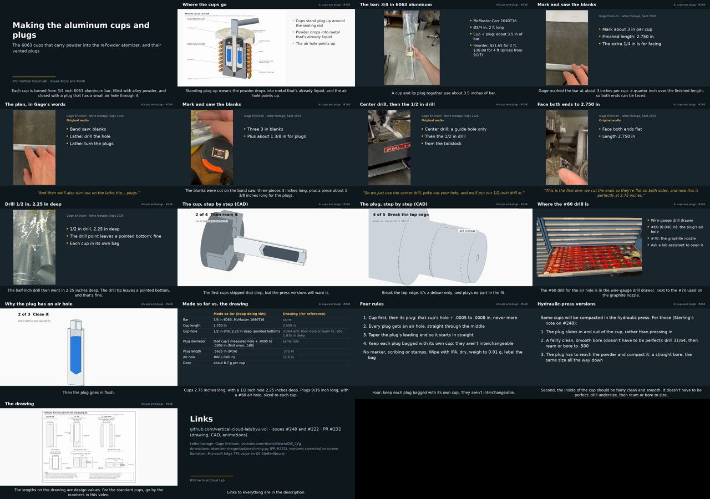

# Narrated tutorial: making the Al cups and plugs

**Video: <https://youtu.be/osx7moehRnE>** (unlisted, on the BYU Vertical Cloud Lab channel, uploaded 2026-10-03).
An earlier upload of the same day, `nPIPvVh38Dw`, is superseded. Its narration said each cup went into its own bag,
over footage showing them in one bag, and it gave .508 as a measured diameter rather than the target. The upload
token can't delete videos, so it needs removing in YouTube Studio or by an `@claude-youtube` run.

For [#248](https://github.com/vertical-cloud-lab/byu-vcl/issues/248): one video covering how the Al charge cups and their
vented plugs from [#222](https://github.com/vertical-cloud-lab/byu-vcl/issues/222) are made. It's 6:44 long, narrated
by the Microsoft Edge TTS voice `en-US-SteffanNeural` (the voice the atomizer training tutorials use), with captions
burned in. The YouTube description has the chapters and links.



Chapters ([`out/chapters.txt`](out/chapters.txt)): intro · where the cups go · the bar · on the lathe · the cup, step by
step · the plug, step by step · where the #60 drill is · why the air hole · the numbers · four rules · hydraulic-press
versions · the drawing, and one request. The 4 s end card gets no chapter, because YouTube drops every chapter if any
one is under 10 s.

## What's in it

- **Real footage:** Gage's Short [z6rwmQW_3Vg](https://youtube.com/shorts/z6rwmQW_3Vg) (marking, sawing, center
  drilling, facing to 2.750", the bagged cups). Where Gage explains a step, the clip plays with its own audio and a
  caption, in amber. Elsewhere Steffan talks over it, with the shop sound kept quietly underneath.
- **CAD clips** from PR [#232](https://github.com/vertical-cloud-lab/byu-vcl/pull/232) (`machining_cup`,
  `machining_plug`, `fill_and_vent`), each step held until its narration finishes. They predate the parts that were
  actually made, so their out-of-date callouts are painted out (OpenCV inpainting) and redrawn:

  | Clip | On screen in #232 | In the video |
  | --- | --- | --- |
  | cup, step 3 | Cut it off at 2.5 in | Cut it off at 2.75 in |
  | cup, last frame | 1/2 in hole, 1.9 in deep · 3.2 mm wall | 1/2 in drill, 2.25 in deep · 1/8 in wall |
  | plug, close-up | this corner is 0.3 mm · 0.3 mm break | this corner is .015 in · .015 in break |
  | plug, last frame | cup's hole + .001 in · 1 mm air hole · 0.3 mm break · 1.5 mm taper | cup's hole + .0005 to .0008 in · #60 air hole · .015 in break · 15° taper |
  | fill, last frame | 1 mm hole in the lid | #60 hole in the plug |

  Each clip's caption line ("one thou bigger", "1 mm hole", "about a thou tight") is cropped off, and the narration
  stands in for it. The clips still say "lid", so the narration points that out once.
- **Stills:** the crucible cutaway and the shop drawing from #232, and the two photos from #222 (bar, wire-gauge drill
  drawer). The photos are resized, with their metadata stripped.
- **Numbers:** as made, from #222: cups 2.750" long with a 1/2" drill 2.25" deep (Gage), plugs Ø.508" × .5625" with a
  #60 vent (Ronnie), and about 8.7 g of powder per cup. The drawing's values appear on one slide, for reference.
- **Press versions:** sgbaird's [note](https://github.com/vertical-cloud-lab/byu-vcl/issues/248#issuecomment-5939457112)
  on #248, taken to mean a plug that slides rather than presses in, a smooth reamed or bored hole, and a hole straight
  enough for the plug to reach the powder. Nobody has given a sliding-fit clearance yet, so the video doesn't state one.

## Rebuilding

Every sentence lives in [`narration.py`](narration.py), as the caption and, where the TTS would misread it, a spoken
form ("6063" becomes "sixty sixty-three", "#60" becomes "number sixty"). Edit it and rerun:

```bash
pip install edge-tts pillow numpy opencv-python-headless   # plus ffmpeg
python build.py   # -> out/al_cups_plugs_tutorial.mp4 (gitignored), captions.srt, chapters.txt, contact_sheet.jpg
```

Each sentence is synthesized on its own, so the captions are timed exactly. A full build takes about 2 minutes on a
4-core runner. `build.py` reads the #232 files from `../cad/` once that PR is merged, and from its commit until then.
The Short has to be in `$SHORT_DIR`, and YouTube refuses player requests from GitHub runners, so fetch it on a
stream-cam Pi. The commands are in `build.py`'s docstring.

[`out/captions.srt`](out/captions.srt) is the same captions as a track. The upload token can't attach it, since that
needs `youtube.force-ssl`, but it can be added in YouTube Studio or by an `@claude-youtube` run.
