# 2026-10-08 run: what the videos show

Three phone videos of one run, uploaded unlisted to the BYU Vertical Cloud Lab channel
on 2026-10-08 around 17:25 MDT and posted on
[#261](https://github.com/vertical-cloud-lab/byu-vcl/issues/261). The operator narrates
throughout, and says at the start that this is their first run on the atomizer alone.

| Video | Length | What it covers |
| --- | --- | --- |
| [pt1 `bWkP5YcsJTc`](https://youtu.be/bWkP5YcsJTc) | 26:08 | Start-up, from the ultrasonic check through purges at room temperature, 250 °C and 500 °C, following Gage's checklist on a phone. The recording was paused during waits, so video time is not elapsed time. |
| [pt2 `dTyuZmqYxHA`](https://youtu.be/dTyuZmqYxHA) | 4:30 | The pour, already under way when the video starts: the viewport, an ultrasonic re-scan and restart, draining the rest of the melt, and shutdown. |
| [results `KTJzug0D0mA`](https://youtube.com/shorts/KTJzug0D0mA) | 0:28 | The chamber, opened after the run. |

Where they come from and how they were read: [`../README.md`](../README.md). The narration
is in [`transcript.md`](transcript.md), with every line linked to its moment in the video.

## Summary

- **The melt dripped but didn't atomize.** pt2 opens with *"it's dripping perfect, but it's
  not atomizing at all"* ([0:00](https://youtu.be/dTyuZmqYxHA?t=0)). Gage, reached by phone,
  wasn't sure why either.
- **The stream landed at the plate's tip or fell past it.** Through the viewport, a thin,
  broken stream falls past the tip of the ultrasonic plate, where a lump of aluminium had
  already frozen, and carries on down into the white cup below.
- **The only spray comes off that lump.** At [2:08–2:10](https://youtu.be/dTyuZmqYxHA?t=128)
  the stream lands on the lump and a fan of droplets leaves its underside. That is the only
  spray in about 75 s of viewport footage.
- **The ultrasonic panel reads POWER 0 W throughout**, at 92 % and at 100 % amplitude. The
  operator saw 0 W at the cold check too and treated it as normal. The footage can't say
  whether that readout ever rises above 0 W.
- **Oxygen was slow to come down.** It took at least three gas washes at 500 °C. The
  narration gives 60–70 ppm, then about 45, then 25–26 ppm, against a target in the low
  20s. What the O2 was when the pour started isn't recorded.
- **After the run**, a solid puddle of aluminium sits in the white cup, and a little fine
  powder is spread over the cone and the collection port. Most of the charge likely froze
  rather than atomized, but only weighing the puddle, the lump and the powder will say.

## The pour (pt2)

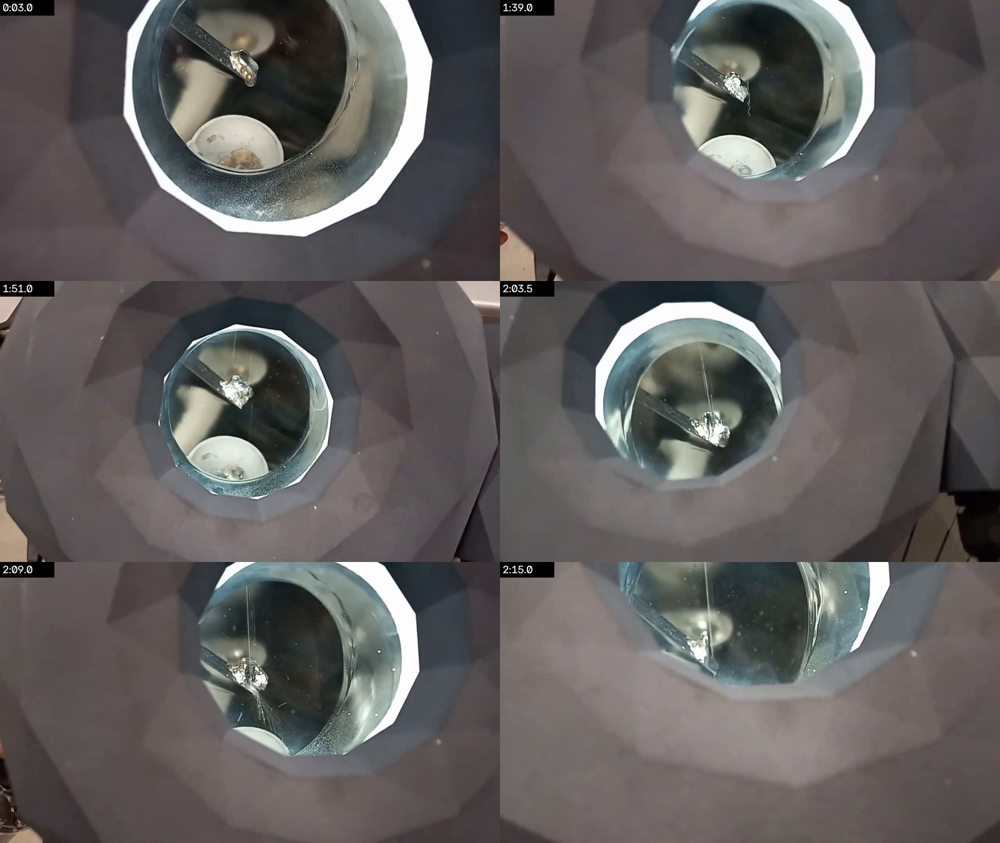

*Viewport frames from pt2 at 0:03, 1:39, 1:51, 2:03.5, 2:09 and 2:15. The dark bar from
the upper left is the plate, at 45°. The bright crumpled lump is aluminium frozen onto its
tip. The thin vertical line is the melt stream. The white cup below catches what falls past.*

**The lump was there before the footage starts.** At [0:03](https://youtu.be/dTyuZmqYxHA?t=3) it
already sits on the plate's tip. It is still there at the end, and every view of the
stream shows it landing on or beside the lump, never on the plate's open face.

**The stream falls past the plate.** At 1:50–1:52 the stream comes and goes from frame to
frame, which is the dripping the operator describes. When it shows, it passes just to the
right of the lump and carries on below it toward the cup, with no spray:

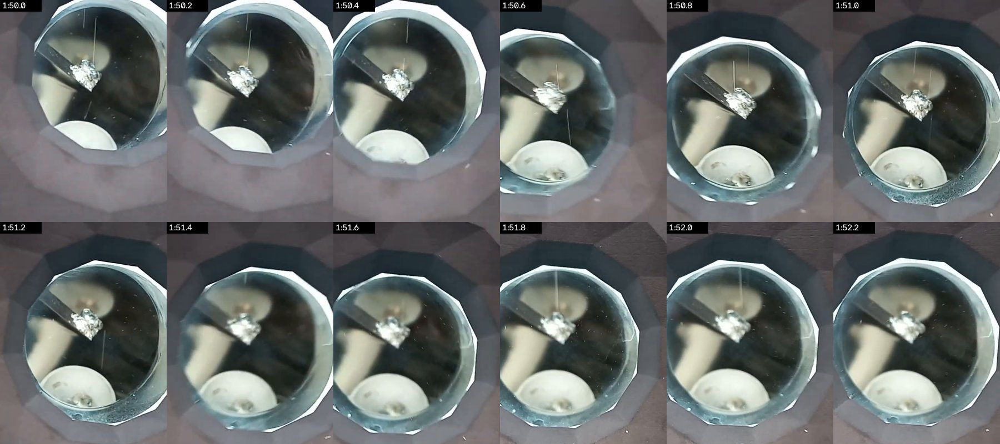

**When it lands on the lump, there is spray.** At 2:08–2:10 the stream is continuous and hits
the lump. A fan of fine streaks, droplets thrown off and drawn into lines by the exposure,
leaves the lump's underside and lower edge. The narration segment that starts at
[1:33](https://youtu.be/dTyuZmqYxHA?t=93) includes *"Oh, that's kind of cool"*:

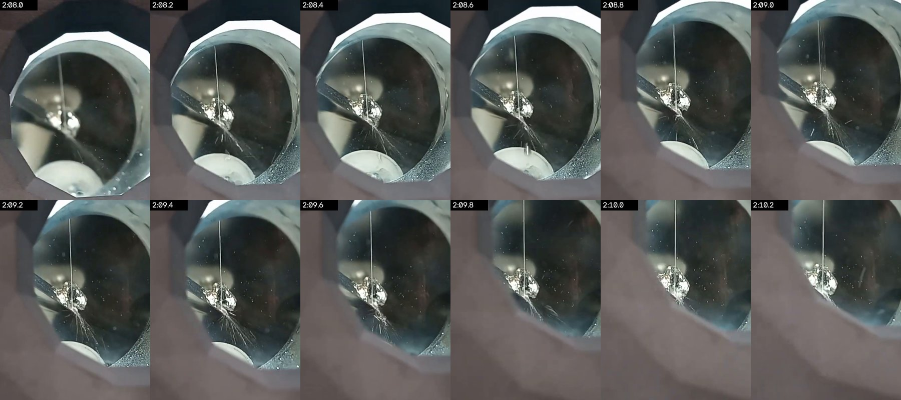

The footage can't tell whether that spray is the plate atomizing melt through the lump
or just the stream splashing off it. Either way, what it shows going wrong is delivery: the
stream was thin and intermittent, and it landed at or beyond the plate's tip rather than
on its face. The checklist (below) covers this in its step *"Check plate if it is in the
right position to catch the aluminum stream"*. A stream that misses the plate's face is
also what went wrong in run 1, where it landed on the upper sonotrode.

**Ultrasonic settings, read off the panel** ([0:36–1:27](https://youtu.be/dTyuZmqYxHA?t=36)):

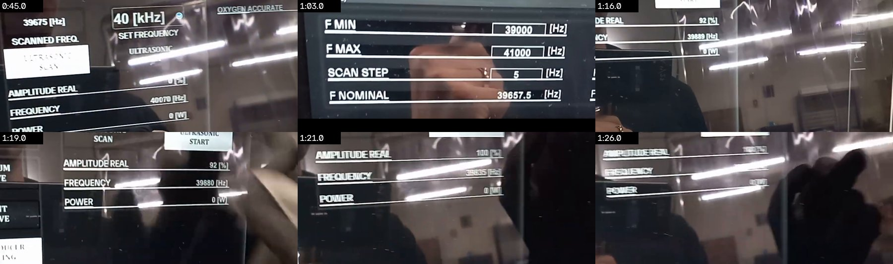

| Reading | Value | Video time |
| --- | --- | --- |
| Ultrasonic scan, done with Transducer Cooling on | scanned 39 675 Hz, set 40 kHz | 0:45 |
| Scan window | 39 000–41 000 Hz in 5 Hz steps, F nominal 39 657.5 Hz | 1:03 |
| After Ultrasonic Start | amplitude real 92 %, 39 889 then 39 880 Hz, **0 W** | 1:16, 1:19 |
| Amplitude raised to 100 % (*"instead of 92"*) | amplitude real 100 %, about 39.6–39.9 kHz (blurred), **0 W** | 1:21, 1:26 |

Before the start, the panel showed 40 070 Hz at 0 % amplitude (0:45). The running
frequency, 39.88 kHz at 92 %, is about 200 Hz above the scanned resonance.

## Start-up (pt1)

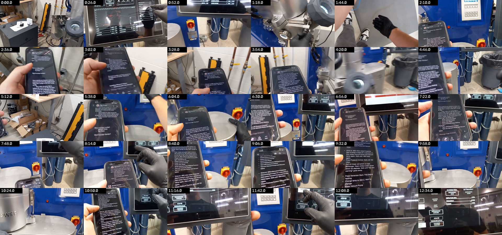
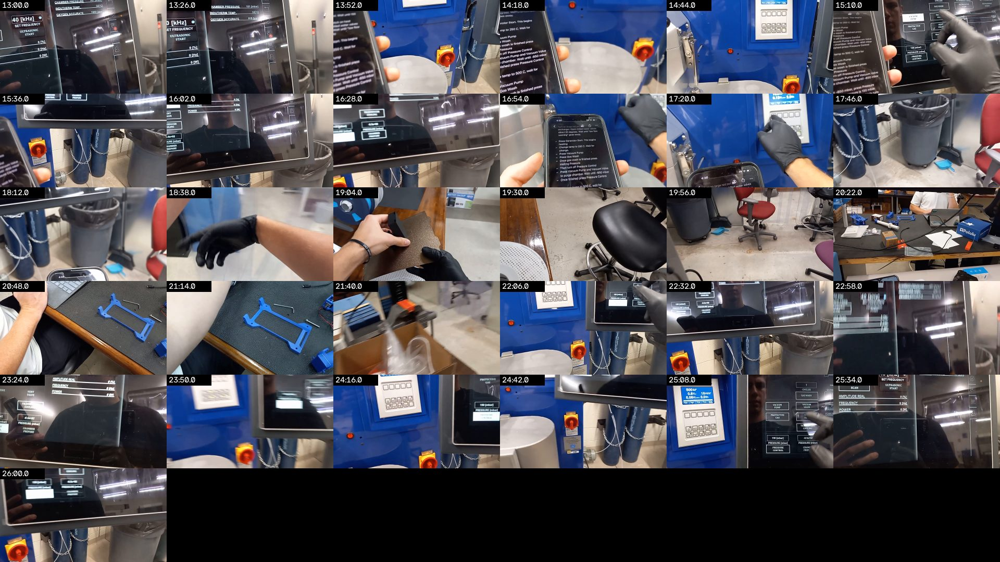

| Video time | What happens |
| --- | --- |
| [0:00](https://youtu.be/bWkP5YcsJTc?t=0) | Ultrasonic scan, *"one peak, one valley"*, then Ultrasonic Start: 0 W both times. |
| [0:39](https://youtu.be/bWkP5YcsJTc?t=39) | The aluminium was already loaded by Gage. Booster chosen and sonotrode assembled before the video ([2:13](https://youtu.be/bWkP5YcsJTc?t=133)). Chamber closed, plate oriented. |
| [2:52](https://youtu.be/bWkP5YcsJTc?t=172) | Chilled water opened about 20°. Compressed air already open. |
| [4:47](https://youtu.be/bWkP5YcsJTc?t=287) | The red switch at the back turned on, and the green light is on. |
| [5:31](https://youtu.be/bWkP5YcsJTc?t=331) | First purge at room temperature: vacuum pump and gas wash. |
| [5:45](https://youtu.be/bWkP5YcsJTc?t=345) | **W081 "pressure crucible" warning.** Gage, by phone, said it was all right. |
| [7:48–10:38](https://youtu.be/bWkP5YcsJTc?t=468) | Unsure of the step order until the right note turns up. Then Pressure Control, Vacuum Pump, Gas Wash, Melting Pressure, Pressure Control off, Vacuum Pump and Vacuum Valve. |
| [10:52–12:37](https://youtu.be/bWkP5YcsJTc?t=652) | Down to −850 mbar, argon (Protective Gas) for a couple of seconds, back to −850 mbar, then Pressure Control to 150 mbar. |
| [13:00, 13:26](https://youtu.be/bWkP5YcsJTc?t=780) | Panel: 141 then 151 mbar, 32 °C, **O2 1000 then 816 ppm** (below). |
| [13:31](https://youtu.be/bWkP5YcsJTc?t=811) | Generator Start, setpoint 250 °C, then the second purge (recording paused during the gas wash). |
| [16:49](https://youtu.be/bWkP5YcsJTc?t=1009) | Setpoint 500 °C, then the third purge. At 17:20 the phone's clock reads 4:38. |
| [21:44–22:55](https://youtu.be/bWkP5YcsJTc?t=1304) | Vacuum, back at −850 mbar, Pressure Control. |
| [23:10](https://youtu.be/bWkP5YcsJTc?t=1390) | *"It is dropping a lot again, so I think just needed to do one more gas wash"*, then the setpoint goes to 850 °C. Waiting for O2 to reach 20: *"it's chilling at 25, that's not low 20"*. |
| [24:10](https://youtu.be/bWkP5YcsJTc?t=1450) | *"This is my third gas wash on 500 degrees C, because the oxygen PPM was stuck at 60, so it was at 70, I did it again, it was at like 45, and now it's on 26, but I guess we need low 20."* The operator notes that in past runs one cycle was enough. |
| [24:56–26:08](https://youtu.be/bWkP5YcsJTc?t=1496) | Last gas wash, Melting Pressure, vacuum, Pressure Control. *"We'll come back once it's getting close."* |

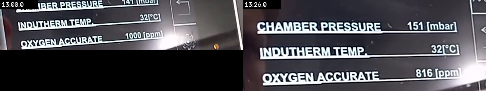

The 1000 ppm at 13:00 may be the top of the sensor's range rather than a measurement. For
comparison, run 1 (Oct 6) logged 19 ppm at the start and 140 ppm at the end.

## After the run (results short)

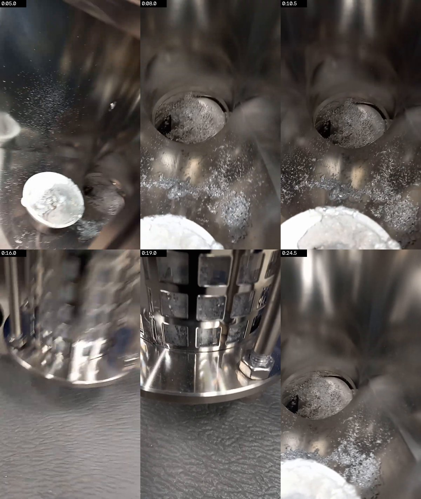

*"Look how weird it looks inside… it looks like there's a little [bit] that was atomized.
And even down here, it happened."* The white cup holds a solid puddle of aluminium
(0:05), presumably the stream that fell past the plate. Fine bright powder is
spread over the cone and around the collection port (0:08–0:11, 0:24), and deposits sit
on the windows of a slotted cylinder (0:19). The training SOP in
[#255](https://github.com/vertical-cloud-lab/byu-vcl/pull/255) has a step to *"collect,
bag, and mark metal splashes"*, and doing the same here, weighing each part separately,
gives a mass balance for this run.

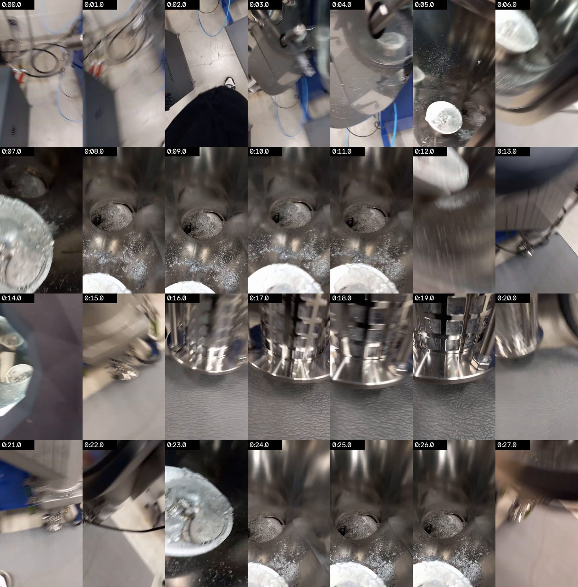

## The checklist on the phone

The operator works from Gage's notes in a Slack message. Transcribed from the frames
(pt1 8:40 and 9:32, pt2 4:22); words in brackets were too blurred to read with confidence.

> Once material and ultrasonic system are prepared and loaded: Do 1 purge at room temp,
> then 1 purge at 250, then 1 purge at 500.
> - First, make sure green light in bottom left corner is on. Flip red switch that is to
>   the left of light gray control panel to turn on. May need to be flipped twice. (Triple
>   check, if red switch is up, green light should be on)
> - Press Pressure Control
> - Press Vacuum Pump
> - Press Gas Wash
> - Once finished press Melting Pressure
> - Turn off Pressure Control
> - Turn on Vacuum Pump and Vacuum Valve
> - Once at -850 mbar press Protective Gas to bring in argon for a second or 2, then press
>   Vacuum Pump and Vacuum Valve again. Wait until -850 mbar again.
> - Press Pressure Control. Wait until 150 mbar.
> - Turn on large red switch on heat exchanger. Open chilled water valves about 20 degrees.
>   Wait until "low flow warning" goes away.
> - Press Generator Start. This begins heating
> - Change temp to 250 C. Wait for change.
> - Press Vacuum Pump
> - Press Gas Wash
> - Once gas wash is finished press Melting Pressure
> - Then turn off Pressure Control
> - Press Vacuum Pump and Vacuum Valve to purge chamber. Wait until -850 mbar
> - Once finished press Pressure Control, wait for 150 mbar
> - Change temp to 500 C, wait for […]
>
> […] Check plate if it is in the right position to catch the aluminum stream. Use
> [Turbo Pump] as needed to 1. Increase flow onto the plate to initiate atomizing,
> 2. Correct stream direction, 3. Push out nozzle in case of clog (especially when at the
> end of the atomizing run). Once finished, press Sealing Rod, Melting Pressure, Generator
> Stop, and Ultrasonic Start (to turn off ultrasonic). Then also turn off Transducer
> Cooling. Then turn temperature down to 250 C (the Generator Stop button turns it off,
> changing the temp is just prep for the next run.) Wait until ~400 C, then safe for
> graphite to be exposed to oxygen. (Above 500 C causes higher oxidation to graphite)
> Turn off […]

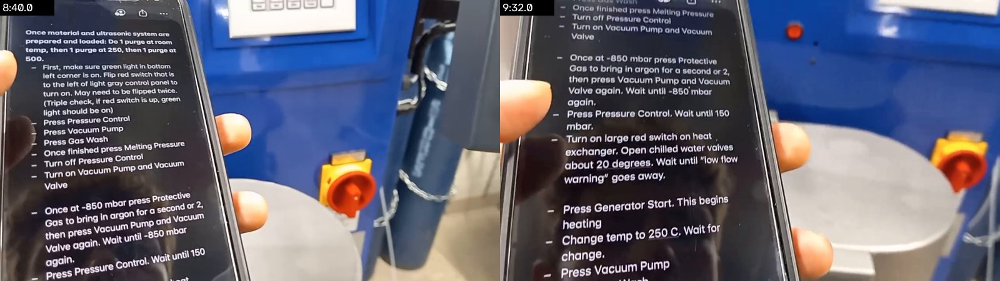
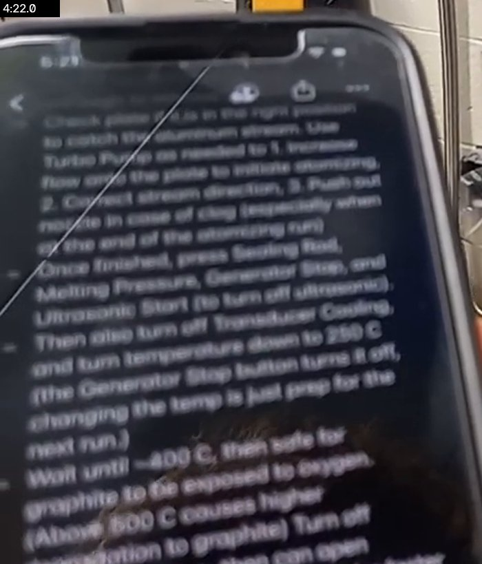

The steps between *"wait for"* at 500 °C and *"Check plate"* (the melt and the pour
itself, including the 850 °C setpoint, the graining pressure and when to start the
ultrasonics) aren't legible in any frame.

## Not in the footage

Nothing shows the pour starting, so these are unknown for this run: when the sealing rod
opened, the O2 and melt temperature at that moment, the graining pressure, the charge mass,
the booster, and the plate type. The issue's notes for run 1 have most of them. Run 2's
need adding to [#261](https://github.com/vertical-cloud-lab/byu-vcl/issues/261) from
memory or the machine's log.

## What would make the next run's video more useful

- **Film the viewport from before the sealing rod opens until the stream stops**, with the
  phone held still or clamped, so the stream's landing point and the start of atomization
  can be timed.
- **Point the camera at the panel's POWER readout while melt is on the plate.** If it stays
  at 0 W even while powder is being made, the readout means nothing. If it rises, then 0 W
  during this pour says no melt was loading the plate.
- **Say the O2, temperature, graining pressure and amplitude out loud when the pour
  starts**, or show them on the panel, so they're in the record.
- **Weigh the lump on the plate, the puddle in the cup, the powder and what is left in the
  crucible**, so each run has a mass balance and a yield.
