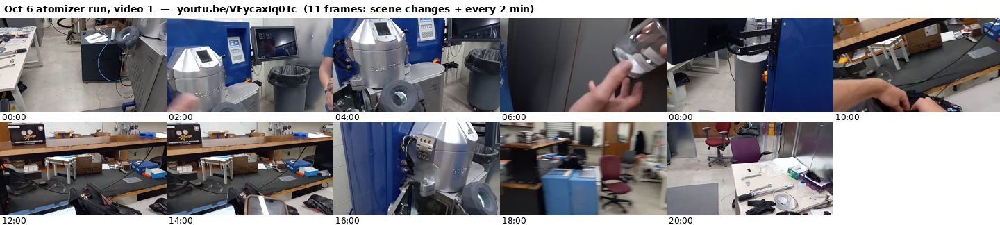
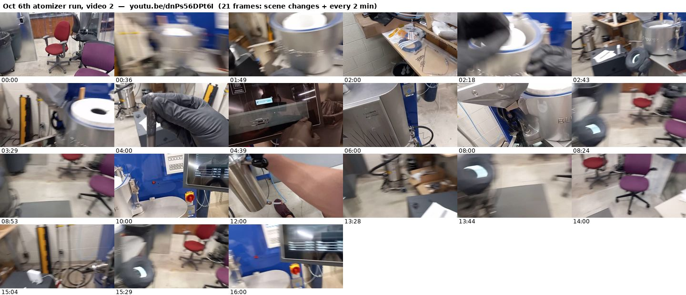
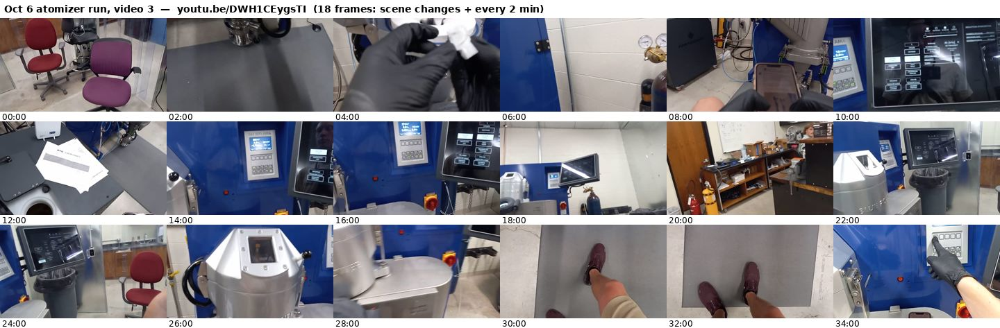

# Keyframes

One contact sheet per video: every scene change ffmpeg detects (`select=gt(scene,0.3)`, thinned to about one per minute) plus one frame every two minutes, each tile labelled with the `mm:ss` of its own frame. A scene change keeps ffmpeg's timestamp for that frame, and the two-minute frames are taken with an accurate seek at exactly 00:00, 02:00, 04:00, …, so every label is the true time of the frame above it (a frame less than 8 s after the previous tile is left out). They are a visual table of contents for [`../timestamps.md`](../timestamps.md): find the moment on the sheet, then open the paused link with the same time. [`sop-frames.md`](sop-frames.md) has one frame for every moment the SOP cites.

Frames come from the Pi-fetched low-resolution copies (640×360 for landscape videos, 144×256 for portrait phone videos), good enough to recognise a scene, not to read the HMI; full-resolution frames of a given moment can be pulled with `tools/hls_sections.py`. Regenerate the sheets with `tools/keyframes.py` and this page with `tools/make_keyframes_readme.py`.

## Atomizer training video 1 (Sep 29): tour of the module, the HMI, furnace teardown
`wRc8p2_FnJo` · 2026-09-29 · 29 frames · [open paused](https://www.youtube.com/embed/wRc8p2_FnJo?start=0) · [▶ watch](https://www.youtube.com/watch?v=wRc8p2_FnJo)

## Atomizer training video 2 (Sep 29): a run, from heating to powder out
`naePD8o9_Gk` · 2026-09-29 · 36 frames · [open paused](https://www.youtube.com/embed/naePD8o9_Gk?start=0) · [▶ watch](https://www.youtube.com/watch?v=naePD8o9_Gk)

## Atomizer training video 3 (Sep 29): 1:1 booster and a Mo plate, the last run of the day
`txH397FGTAU` · 2026-09-29 · 36 frames · [open paused](https://www.youtube.com/embed/txH397FGTAU?start=0) · [▶ watch](https://www.youtube.com/watch?v=txH397FGTAU)

## Atomizer training video 4 (Sep 29): loading the furnace, cleaning the chamber
`1F9_4ccwhss` · 2026-09-29 · 7 frames · [open paused](https://www.youtube.com/embed/1F9_4ccwhss?start=0) · [▶ watch](https://www.youtube.com/watch?v=1F9_4ccwhss)

## Atomizer training video 5 (Sep 29): the first run, start to finish
`58wJ_Khwgyk` · 2026-09-29 · 47 frames · [open paused](https://www.youtube.com/embed/58wJ_Khwgyk?start=0) · [▶ watch](https://www.youtube.com/watch?v=58wJ_Khwgyk)

## Atomizer training video 6 (Sep 29): closing the powder container
`tfb4fsVNIFI` · 2026-09-29 · 1 frames · [open paused](https://www.youtube.com/embed/tfb4fsVNIFI?start=0) · [▶ watch](https://www.youtube.com/watch?v=tfb4fsVNIFI)

## Atomizer training (Sep 29): right after a pour, brushing powder and cooling down
`Pk0K5sBz-sQ` · 2026-09-29 · 9 frames · [open paused](https://www.youtube.com/embed/Pk0K5sBz-sQ?start=0) · [▶ watch](https://www.youtube.com/watch?v=Pk0K5sBz-sQ)

## Atomizer training video 7 (Sep 30): reversing the booster, rebuilding the stack
`FDRTt68Vfvo` · 2026-09-30 · 44 frames · [open paused](https://www.youtube.com/embed/FDRTt68Vfvo?start=0) · [▶ watch](https://www.youtube.com/watch?v=FDRTt68Vfvo)

## Atomizer training video 8 (Sep 30): nozzles, and reassembling the furnace
`HTlUrAr5HVU` · 2026-09-30 · 7 frames · [open paused](https://www.youtube.com/embed/HTlUrAr5HVU?start=0) · [▶ watch](https://www.youtube.com/watch?v=HTlUrAr5HVU)

## Atomizer training video 9 (Sep 30): a full run, then consumables and plates
`9kn-HhXCr1o` · 2026-09-30 · 35 frames · [open paused](https://www.youtube.com/embed/9kn-HhXCr1o?start=0) · [▶ watch](https://www.youtube.com/watch?v=9kn-HhXCr1o)

## Atomizer training (Sep 30): the expert cleaning the atomizer, first-person view
`u-KjR5TENN4` · 2026-09-30 · 13 frames · [open paused](https://www.youtube.com/embed/u-KjR5TENN4?start=0) · [▶ watch](https://www.youtube.com/watch?v=u-KjR5TENN4)

## Atomizer training (Sep 30): cleaning a filter cartridge; a second scan peak
`f8KL31PN8bA` · 2026-09-30 · 11 frames · [open paused](https://www.youtube.com/embed/f8KL31PN8bA?start=0) · [▶ watch](https://www.youtube.com/watch?v=f8KL31PN8bA)

## Atomizer commissioning (Sep 28): walk-around of the utilities and consumables
`2wMgeI-E7zw` · 2026-09-30 · 14 frames · [open paused](https://www.youtube.com/embed/2wMgeI-E7zw?start=0) · [▶ watch](https://www.youtube.com/watch?v=2wMgeI-E7zw)

## Atomizer training (Sep 30): first custom charge, AlSi10Mg in an Al 6063 cup
`TFpU4uqVF9c` · 2026-09-30 · 11 frames · [open paused](https://www.youtube.com/embed/TFpU4uqVF9c?start=0) · [▶ watch](https://www.youtube.com/watch?v=TFpU4uqVF9c)

## Atomizer charge prep (Sep 29): dosing AlSi10Mg for charge nzyjn0 (no narration)
`prj_xgeuQtM` · 2026-09-29 · 35 frames · [open paused](https://www.youtube.com/embed/prj_xgeuQtM?start=0) · [▶ watch](https://www.youtube.com/watch?v=prj_xgeuQtM)

## Atomizer charge prep (Sep 30): preparing an Al 4047 dose (no narration)
`QXSj0j1OqL8` · 2026-10-01 · 13 frames · [open paused](https://www.youtube.com/embed/QXSj0j1OqL8?start=0) · [▶ watch](https://www.youtube.com/watch?v=QXSj0j1OqL8)

## Atomizer, first run on our own (Oct 2), part 1: startup, plates and loading
`qYyT39D5Yzo` · 2026-10-02 · 15 frames · [open paused](https://www.youtube.com/embed/qYyT39D5Yzo?start=0) · [▶ watch](https://www.youtube.com/watch?v=qYyT39D5Yzo)

## Atomizer, first run on our own (Oct 2), part 2: gas wash, pour and cooldown
`of5-LhkX_VQ` · 2026-10-02 · 23 frames · [open paused](https://www.youtube.com/embed/of5-LhkX_VQ?start=0) · [▶ watch](https://www.youtube.com/watch?v=of5-LhkX_VQ)

## Atomizer charge prep (Sep 30): asking Claude on GitHub to dose Al 4047
`BxA7Z9Fliss` · 2026-10-01 · 9 frames · [open paused](https://www.youtube.com/embed/BxA7Z9Fliss?start=0) · [▶ watch](https://www.youtube.com/watch?v=BxA7Z9Fliss)

## Atomizer charge prep (Sep 30): dosing Al 4047 with Claude; a stall and a clog
`dXRB7c6GeDw` · 2026-10-01 · 30 frames · [open paused](https://www.youtube.com/embed/dXRB7c6GeDw?start=0) · [▶ watch](https://www.youtube.com/watch?v=dXRB7c6GeDw)

## Atomizer nozzle prep (Sep 30): drilling a graphite nozzle with a #70 bit
`LSQmxwmlTkQ` · 2026-09-30 · 3 frames · [open paused](https://www.youtube.com/embed/LSQmxwmlTkQ?start=0) · [▶ watch](https://www.youtube.com/watch?v=LSQmxwmlTkQ)

## Atomizer charge prep (Sep 26): turning aluminum cups on the lathe
`z6rwmQW_3Vg` · 2026-09-26 · 4 frames · [open paused](https://www.youtube.com/embed/z6rwmQW_3Vg?start=0) · [▶ watch](https://www.youtube.com/watch?v=z6rwmQW_3Vg)

## Atomizer installation (Sep 3): the machine in its enclosure
`07QOPRHIEvw` · 2026-09-03 · 5 frames · [open paused](https://www.youtube.com/embed/07QOPRHIEvw?start=0) · [▶ watch](https://www.youtube.com/watch?v=07QOPRHIEvw)

## Atomizer installation (Sep 1): the lab enclosure under construction
`Kv9DT3Vo0GE` · 2026-09-01 · 2 frames · [open paused](https://www.youtube.com/embed/Kv9DT3Vo0GE?start=0) · [▶ watch](https://www.youtube.com/watch?v=Kv9DT3Vo0GE)

## Vacuum test (Sep 8): clearing a small amount of powder
`cKwQbKdE22Q` · 2026-09-08 · 2 frames · [open paused](https://www.youtube.com/embed/cKwQbKdE22Q?start=0) · [▶ watch](https://www.youtube.com/watch?v=cKwQbKdE22Q)

## Atomizer room (Sep 29): dehumidifier troubleshooting
`w02MRlZhpNk` · 2026-09-29 · 3 frames · [open paused](https://www.youtube.com/embed/w02MRlZhpNk?start=0) · [▶ watch](https://www.youtube.com/watch?v=w02MRlZhpNk)

## Oct 6 atomizer run, video 1
`VFycaxIq0Tc` · 2026-10-06 · 11 frames · [open paused](https://www.youtube.com/embed/VFycaxIq0Tc?start=0) · [▶ watch](https://www.youtube.com/watch?v=VFycaxIq0Tc)

## Oct 6th atomizer run, video 2
`dnPs56DPt6I` · 2026-10-06 · 21 frames · [open paused](https://www.youtube.com/embed/dnPs56DPt6I?start=0) · [▶ watch](https://www.youtube.com/watch?v=dnPs56DPt6I)

## Oct 6 atomizer run, video 3
`DWH1CEygsTI` · 2026-10-06 · 18 frames · [open paused](https://www.youtube.com/embed/DWH1CEygsTI?start=0) · [▶ watch](https://www.youtube.com/watch?v=DWH1CEygsTI)

