# Keyframes

One contact sheet per video: every scene change ffmpeg detects (`select=gt(scene,0.3)`, thinned to about one per minute) plus one frame every two minutes, each tile labelled with its `mm:ss`. They are a visual table of contents for [`../timestamps.md`](../timestamps.md): find the moment on the sheet, then open the paused link with the same time. [`sop-frames.md`](sop-frames.md) has one frame for every moment the SOP cites.

Frames are 360p (the Pi-fetched copy), good enough to recognise a scene, not to read the HMI. Regenerate with `tools/keyframes.py`.

## Video 1 of atomizer training
`wRc8p2_FnJo` · 2026-09-29 · 29 frames · [open paused](https://www.youtube.com/embed/wRc8p2_FnJo?start=0) · [▶ watch](https://www.youtube.com/watch?v=wRc8p2_FnJo)

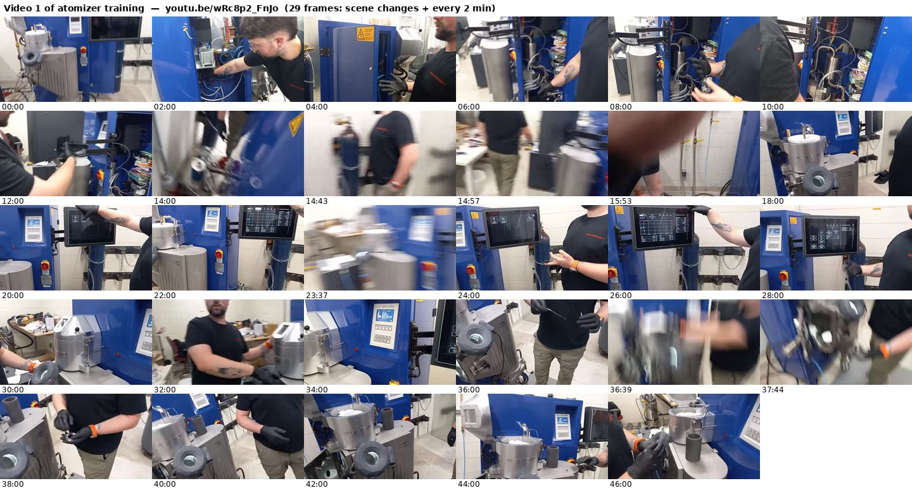

## Atomizer Training Video 2
`naePD8o9_Gk` · 2026-09-29 · 35 frames · [open paused](https://www.youtube.com/embed/naePD8o9_Gk?start=0) · [▶ watch](https://www.youtube.com/watch?v=naePD8o9_Gk)

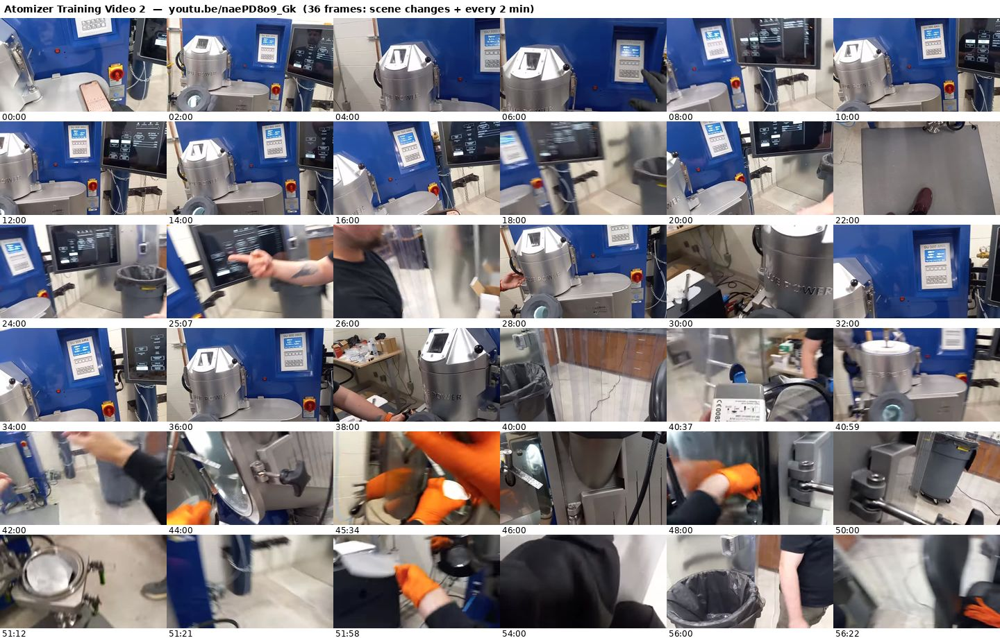

## Atomizer Training Video 3
`txH397FGTAU` · 2026-09-29 · 36 frames · [open paused](https://www.youtube.com/embed/txH397FGTAU?start=0) · [▶ watch](https://www.youtube.com/watch?v=txH397FGTAU)

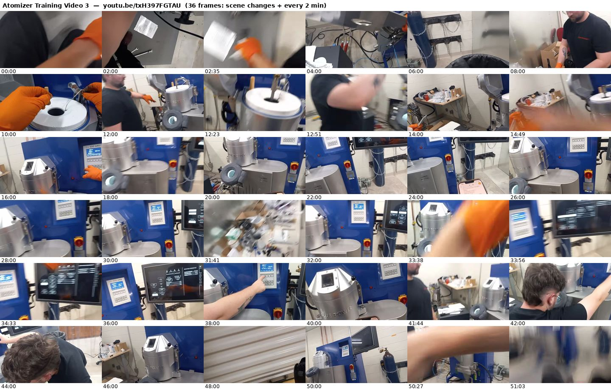

## Atomizer Training Video 4
`1F9_4ccwhss` · 2026-09-29 · 6 frames · [open paused](https://www.youtube.com/embed/1F9_4ccwhss?start=0) · [▶ watch](https://www.youtube.com/watch?v=1F9_4ccwhss)

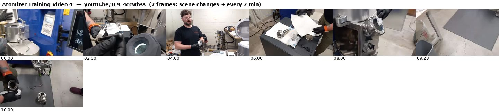

## Atomizer Training Video 5
`58wJ_Khwgyk` · 2026-09-29 · 46 frames · [open paused](https://www.youtube.com/embed/58wJ_Khwgyk?start=0) · [▶ watch](https://www.youtube.com/watch?v=58wJ_Khwgyk)

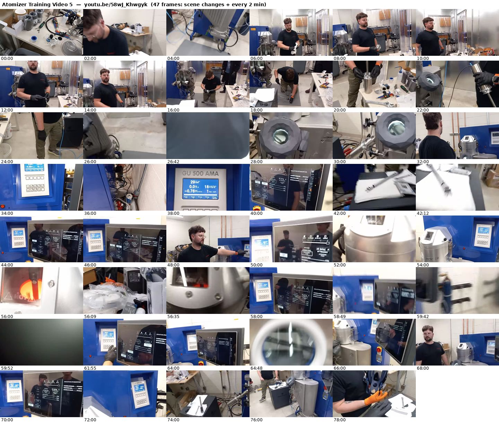

## Atomizer Training Video 6
`tfb4fsVNIFI` · 2026-09-29 · 1 frames · [open paused](https://www.youtube.com/embed/tfb4fsVNIFI?start=0) · [▶ watch](https://www.youtube.com/watch?v=tfb4fsVNIFI)

## Atomizer training
`Pk0K5sBz-sQ` · 2026-09-29 · 9 frames · [open paused](https://www.youtube.com/embed/Pk0K5sBz-sQ?start=0) · [▶ watch](https://www.youtube.com/watch?v=Pk0K5sBz-sQ)

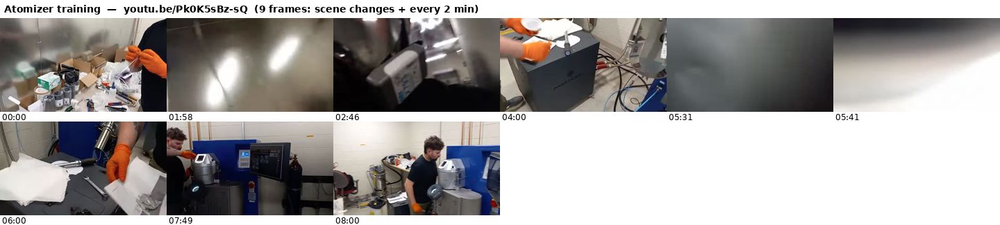

## Atomizer Training Video 7
`FDRTt68Vfvo` · 2026-09-30 · 43 frames · [open paused](https://www.youtube.com/embed/FDRTt68Vfvo?start=0) · [▶ watch](https://www.youtube.com/watch?v=FDRTt68Vfvo)

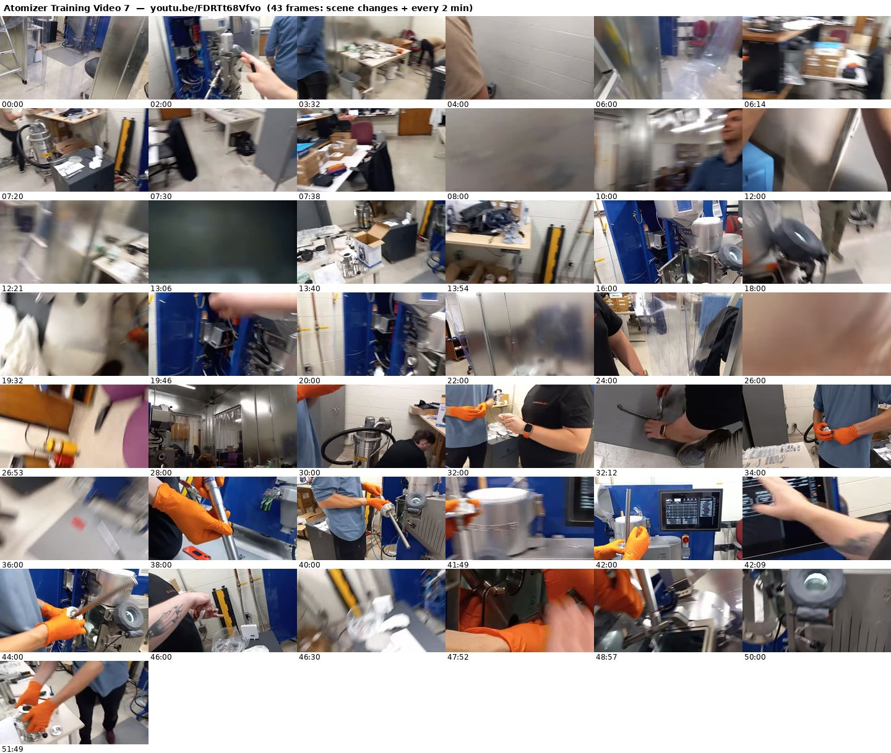

## Atomizer Training Video 8
`HTlUrAr5HVU` · 2026-09-30 · 7 frames · [open paused](https://www.youtube.com/embed/HTlUrAr5HVU?start=0) · [▶ watch](https://www.youtube.com/watch?v=HTlUrAr5HVU)

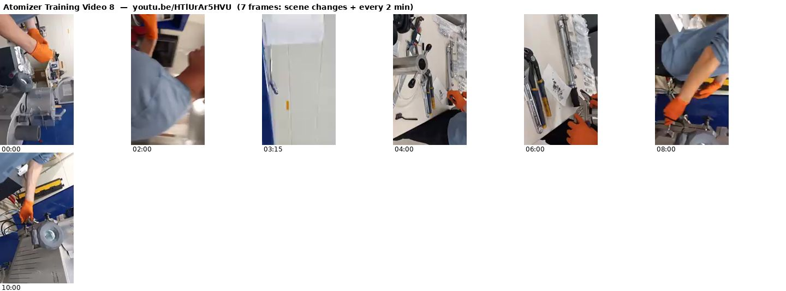

## Atomizer Training Video 9
`9kn-HhXCr1o` · 2026-09-30 · 34 frames · [open paused](https://www.youtube.com/embed/9kn-HhXCr1o?start=0) · [▶ watch](https://www.youtube.com/watch?v=9kn-HhXCr1o)

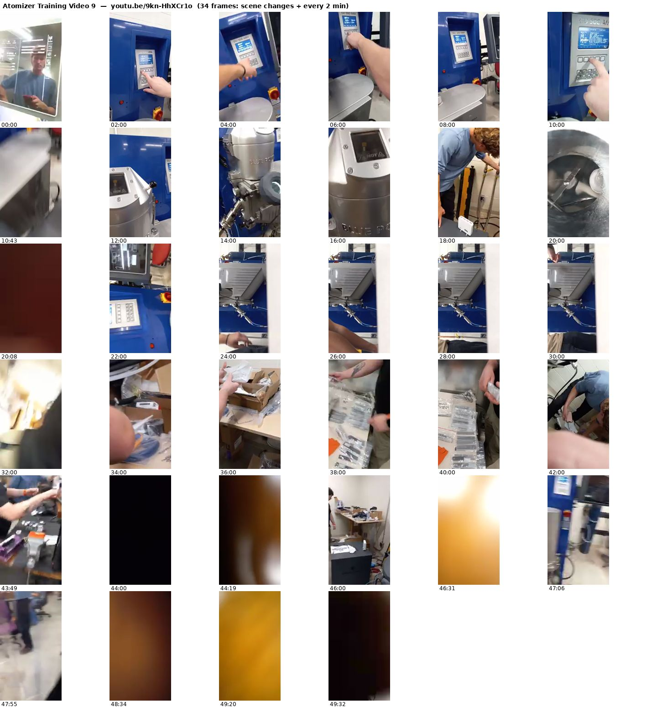

## The expert cleaning the atomizer, pov
`u-KjR5TENN4` · 2026-09-30 · 12 frames · [open paused](https://www.youtube.com/embed/u-KjR5TENN4?start=0) · [▶ watch](https://www.youtube.com/watch?v=u-KjR5TENN4)

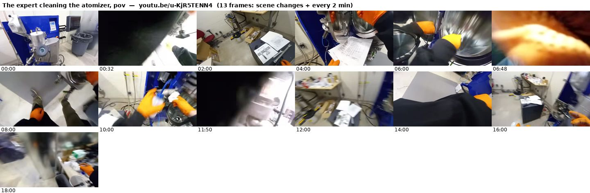

## Cartridge cleaning
`f8KL31PN8bA` · 2026-09-30 · 10 frames · [open paused](https://www.youtube.com/embed/f8KL31PN8bA?start=0) · [▶ watch](https://www.youtube.com/watch?v=f8KL31PN8bA)

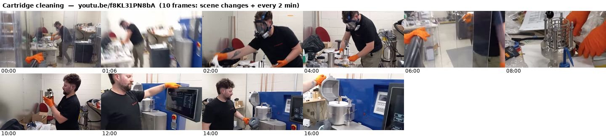

## Atomizer training (sterling's phone)
`2wMgeI-E7zw` · 2026-09-30 · 14 frames · [open paused](https://www.youtube.com/embed/2wMgeI-E7zw?start=0) · [▶ watch](https://www.youtube.com/watch?v=2wMgeI-E7zw)

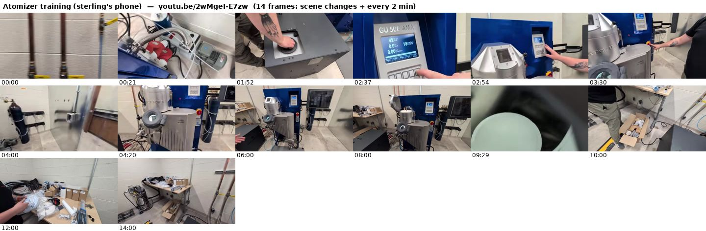

## nzyjn0 atomization AlSi10Mg-Al6063
`TFpU4uqVF9c` · 2026-09-30 · 10 frames · [open paused](https://www.youtube.com/embed/TFpU4uqVF9c?start=0) · [▶ watch](https://www.youtube.com/watch?v=TFpU4uqVF9c)

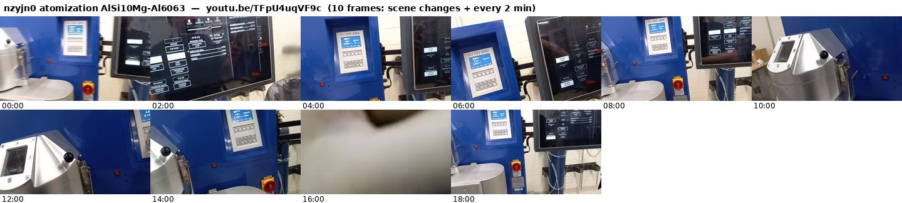

## nzyjn0 AlSi10Mg-Al6063 dosing session
`prj_xgeuQtM` · 2026-09-29 · 34 frames · [open paused](https://www.youtube.com/embed/prj_xgeuQtM?start=0) · [▶ watch](https://www.youtube.com/watch?v=prj_xgeuQtM)

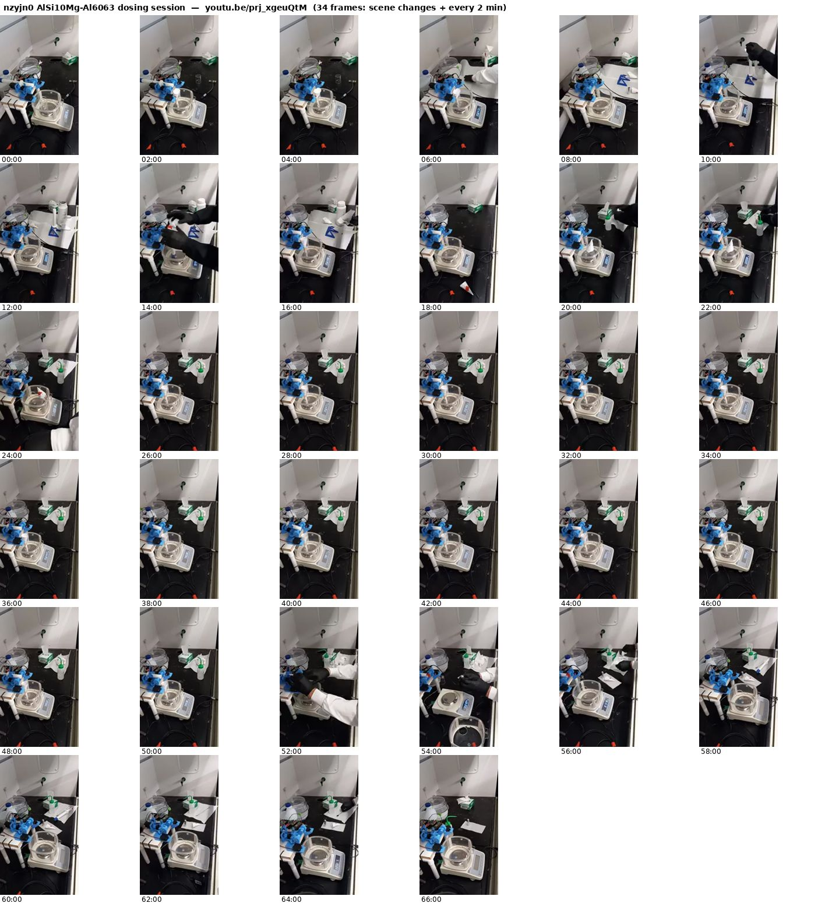

## Dosing Al 4047 powder
`QXSj0j1OqL8` · 2026-10-01 · 12 frames · [open paused](https://www.youtube.com/embed/QXSj0j1OqL8?start=0) · [▶ watch](https://www.youtube.com/watch?v=QXSj0j1OqL8)

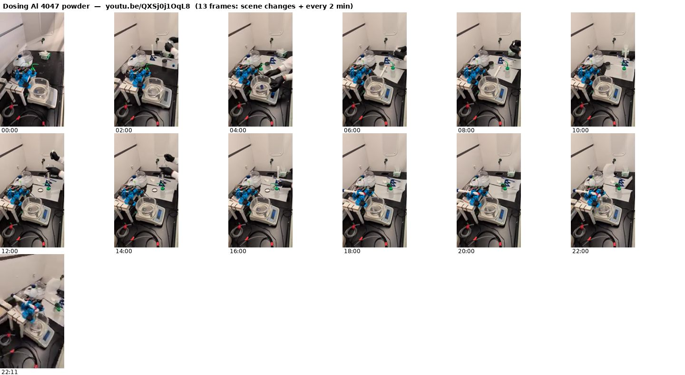

## Atomizer Fri Oct 2 pt1
`qYyT39D5Yzo` · 2026-10-02 · 15 frames · [open paused](https://www.youtube.com/embed/qYyT39D5Yzo?start=0) · [▶ watch](https://www.youtube.com/watch?v=qYyT39D5Yzo)

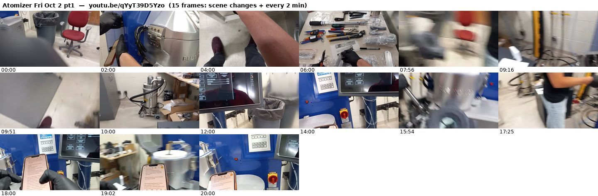

## Atomizer run Oct 2 part 2
`of5-LhkX_VQ` · 2026-10-02 · 23 frames · [open paused](https://www.youtube.com/embed/of5-LhkX_VQ?start=0) · [▶ watch](https://www.youtube.com/watch?v=of5-LhkX_VQ)

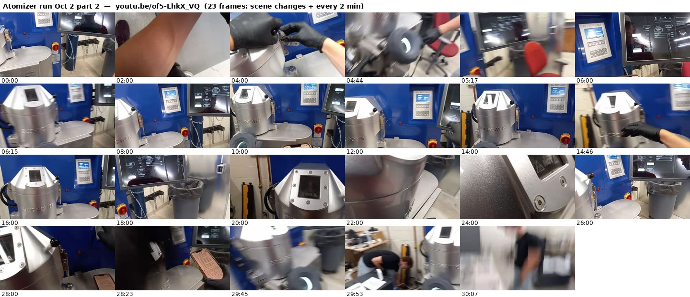

## Claude ping for dosing Al 4047
`BxA7Z9Fliss` · 2026-10-01 · 8 frames · [open paused](https://www.youtube.com/embed/BxA7Z9Fliss?start=0) · [▶ watch](https://www.youtube.com/watch?v=BxA7Z9Fliss)

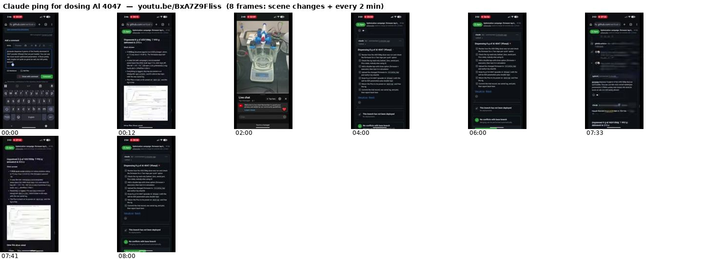

## Claude ping and troubleshooting for dosing Al 4047
`dXRB7c6GeDw` · 2026-10-01 · 30 frames · [open paused](https://www.youtube.com/embed/dXRB7c6GeDw?start=0) · [▶ watch](https://www.youtube.com/watch?v=dXRB7c6GeDw)

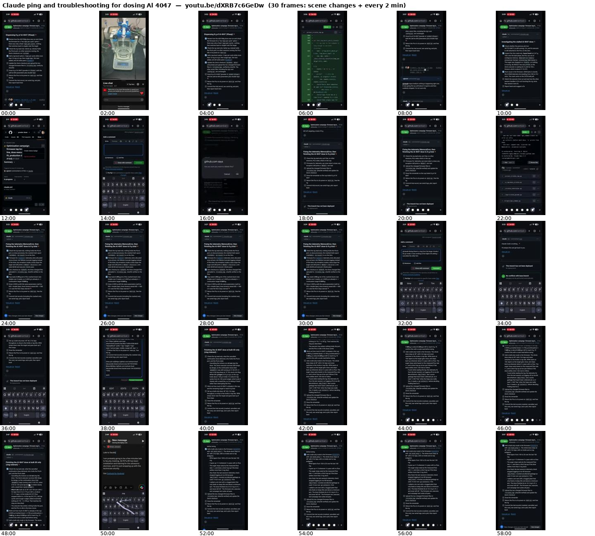

## Drill press, number 70 bit, graphite nozzle
`LSQmxwmlTkQ` · 2026-09-30 · 2 frames · [open paused](https://www.youtube.com/embed/LSQmxwmlTkQ?start=0) · [▶ watch](https://www.youtube.com/watch?v=LSQmxwmlTkQ)

## Lathe turning aluminum crucibles for atomizer experiments
`z6rwmQW_3Vg` · 2026-09-26 · 4 frames · [open paused](https://www.youtube.com/embed/z6rwmQW_3Vg?start=0) · [▶ watch](https://www.youtube.com/watch?v=z6rwmQW_3Vg)

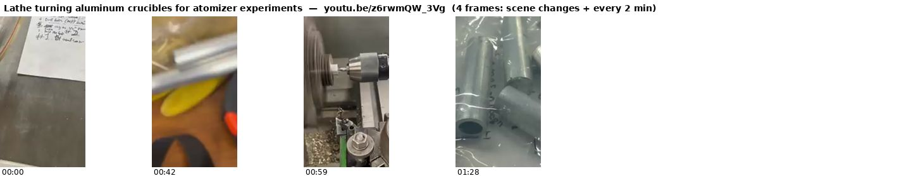

## Placing the Atomizer!!!
`07QOPRHIEvw` · 2026-09-03 · 5 frames · [open paused](https://www.youtube.com/embed/07QOPRHIEvw?start=0) · [▶ watch](https://www.youtube.com/watch?v=07QOPRHIEvw)

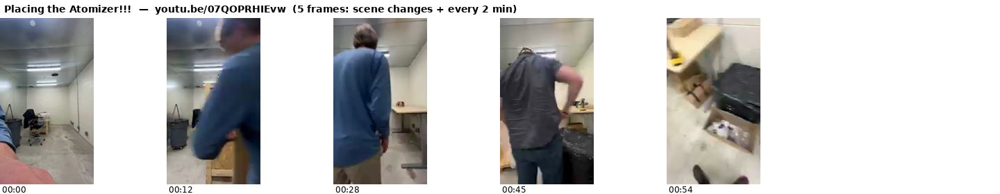

## Exciting Vertical Cloud Lab Construction Update!! Atomizer Will Be Installed Soon!
`Kv9DT3Vo0GE` · 2026-09-01 · 1 frames · [open paused](https://www.youtube.com/embed/Kv9DT3Vo0GE?start=0) · [▶ watch](https://www.youtube.com/watch?v=Kv9DT3Vo0GE)

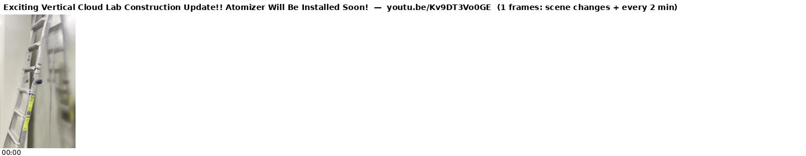

## Vacuum test
`cKwQbKdE22Q` · 2026-09-08 · 1 frames · [open paused](https://www.youtube.com/embed/cKwQbKdE22Q?start=0) · [▶ watch](https://www.youtube.com/watch?v=cKwQbKdE22Q)

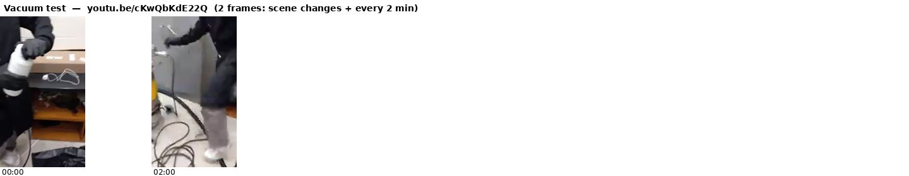

## Dehumidifier troubleshooting
`w02MRlZhpNk` · 2026-09-29 · 2 frames · [open paused](https://www.youtube.com/embed/w02MRlZhpNk?start=0) · [▶ watch](https://www.youtube.com/watch?v=w02MRlZhpNk)

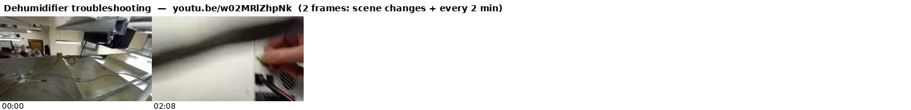
