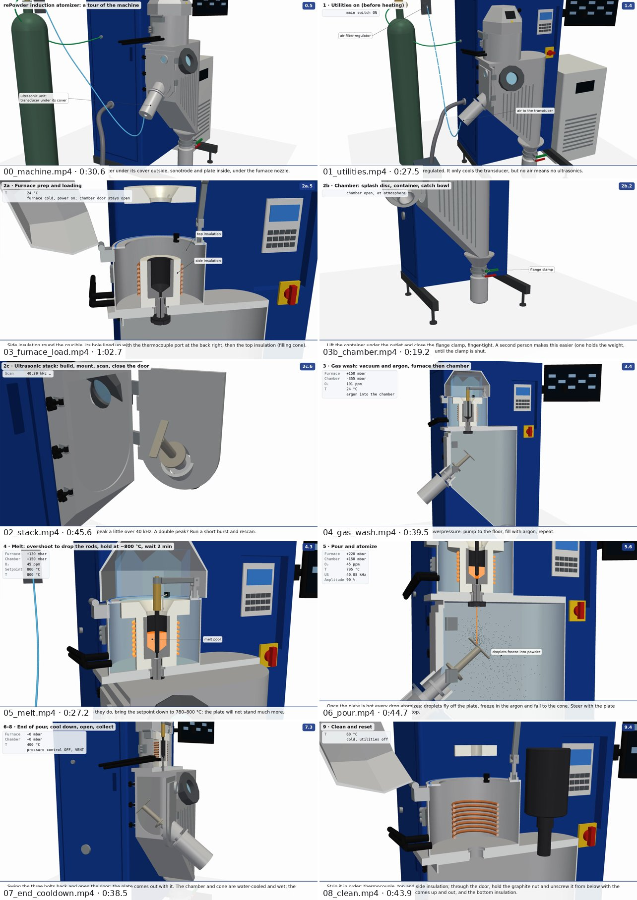

# Slide clips of the 3D animations

The 3D animations from [`../viz3d/`](../viz3d/README.md), cut for a PowerPoint slide. Each clip shows one short caption
at a time and speaks one short line per caption. The summary is the whole run in one condensed take, with the fasteners
sped up. The other three clips are single steps at the animation's own speed, the same as in the GIFs and the tutorials.
All ten animations are also here as they are, without captions or narration: see
[the animations as MP4s](#the-animations-as-mp4s).

| Clip | Narrated, unlisted | File | Length |
| --- | --- | --- | --- |
| **The whole run** (`summary`), condensed (draft 2). Furnace (19 s): crucible into the coil, nut, insulation, sealing rod, charge, lid. Stack (8 s): built, into the door, door shut. Run (17 s): argon and the melt, a close-up of the coil stirring the melt up the sealing rod, the pour onto the plate (zoomed in), powder into the container | https://www.youtube.com/watch?v=j9QcpcG8EVI (draft 1, 0:33: [qwopusVSwf4](https://www.youtube.com/watch?v=qwopusVSwf4)) | [`videos/summary.mp4`](videos/summary.mp4) | 0:44 |
| The same, one step per slide: furnace, stack, run. Cut at caption starts, so no line is cut; each ends on a 0.5 s hold | (parts of the above) | [`summary_1_furnace.mp4`](videos/summary_1_furnace.mp4), [`summary_2_stack.mp4`](videos/summary_2_stack.mp4), [`summary_3_run.mp4`](videos/summary_3_run.mp4) | 0:19.5, 0:08.8, 0:17.0 |
| Loading the furnace (`03_furnace_load`): lid and lever, crucible into the coil, the graphite nut from below, insulation, thermocouple, sealing rod, charge, lid | https://www.youtube.com/watch?v=86K-EHhtPp8 | [`videos/03_furnace_load.mp4`](videos/03_furnace_load.mp4) | 1:04 |
| The ultrasonic stack and the door (`02_stack`): transducer, booster, sonotrode, into the door, plate, scan, wet test, cover, door shut and bolted | https://www.youtube.com/watch?v=8lBR11fgznI | [`videos/02_stack.mp4`](videos/02_stack.mp4) | 0:47 |
| The pour (`06_pour`): the melt held near 800 °C, vibration on and the furnace pressure up, the sealing rod lifted, a turbo push to heat the plate, every drop atomizing, the powder into the container | https://www.youtube.com/watch?v=21oFnNmzd3E | [`videos/06_pour.mp4`](videos/06_pour.mp4) | 0:46 |

[`script.md`](script.md) lists every caption with when it is up, its spoken line and how long that line takes, with a
frame from each. The upload log, with the commit each description links to, is [`uploads.json`](uploads.json).

## The rules

They live in [`captions.py`](captions.py), and `build_ppt.py` refuses to build if any is broken:

- **At most 6 words on screen at a time.** A number and its unit ("65 N·m") count as two.
- **Each caption stays up at least 4 s.** The single-step clips' captions are up 4.0–7.7 s each. One caption per
  sub-step of the animation; the long nut sub-step (2a.4) carries two, the door and nut, then how tight. In the pour,
  three sub-steps are shorter than 4 s: the vibration caption also covers the draining pressure (5.3), and the turbo
  caption runs 0.5 s into the next sub-step.
- **Each line is spoken while its caption is up.** It starts 0.25 s after the caption appears and ends at least 0.3 s
  before the next.
- **No other text.** The GIFs' title, step label, leader labels, gauges and long captions are all off.
- **The single-step clips keep the animation's speed.** Nothing is slowed down or held to fit the voice, except that the
  last frame is held for 1 s. The voice is the tutorials' `en-US-AndrewMultilingualNeural` at 1×.
- **The summary is condensed, and captions only the steps an audience needs.** It is its own animation
  (`anim_summary` in [`../viz3d/steps.py`](../viz3d/steps.py)): the same parts on the same paths, in the same order, as
  the furnace, stack, melt and pour animations.
  - Sped up: the holder (4 turns in about a second), the nut (5 turns in about 1.6 s), the thermocouple, the lever, the
    booster, sonotrode and plate, the cover and the three bolts.
  - Paced for a slide (draft 2, 44 s): a short pause after each move, and 0.6 s between the furnace, the stack and the
    run. The narration pauses between steps rather than saying more.
  - Shows the coil stirring the melt: a 3 s close-up of the cut crucible, the melt surging up the sealing rod at each
    pulse ([`../viz3d/README.md`](../viz3d/README.md) has the sources).
  - Left out: the scan, the wet test, the gas washes and every hold.
  - Its 7 captions name the key steps only, so the fasteners pass without one. Its last frame is held 0.7 s.
  - Nothing passes through anything, checked frame by frame at 30 fps: [`../viz3d/out/collisions_summary.md`](../viz3d/out/collisions_summary.md).

## How they differ from the GIFs

- 1920 × 1080 at 30 fps. The GIFs are 800 × 450 at 10 fps, and the tutorials' animations 1280 × 720 at 15 fps. Every
  move lasts as many seconds as before.
- Rendered with no text at all (`VIZ3D_CLEAN=1` in [`../viz3d/scene.py`](../viz3d/scene.py)), then captioned here: white
  bold text on a navy pill, centred near the bottom, switched between frames with no fade.

## The animations as MP4s

All ten step animations as they are, without captions or narration: for a slide you talk over, or to cut your own
clips. They have the same moves at the same speed as the GIFs, at 1920 × 1080 and 30 fps, with no sound. An MP4 doesn't
loop on its own; PowerPoint loops a video only if *Loop until Stopped* is ticked. Each comes two ways:

- `<name>.mp4` has the GIF's text: the title, step label, caption, readouts and part labels, drawn at full size.
- `<name>_no_text.mp4` has no text at all, so you can add your own.

| Step | With the GIF's text | No text | Length |
| --- | --- | --- | --- |
| 0 · Tour of the machine | [`00_machine.mp4`](videos/animations/00_machine.mp4) (6.3 MB) | [`00_machine_no_text.mp4`](videos/animations/00_machine_no_text.mp4) (5.5 MB) | 0:30.6 |
| 1 · Utilities on | [`01_utilities.mp4`](videos/animations/01_utilities.mp4) (4.2 MB) | [`01_utilities_no_text.mp4`](videos/animations/01_utilities_no_text.mp4) (3.9 MB) | 0:27.5 |
| 2a · Furnace prep and loading | [`03_furnace_load.mp4`](videos/animations/03_furnace_load.mp4) (9.8 MB) | [`03_furnace_load_no_text.mp4`](videos/animations/03_furnace_load_no_text.mp4) (8.7 MB) | 1:02.7 |
| 2b · Chamber: splash disc, container, catch bowl | [`03b_chamber.mp4`](videos/animations/03b_chamber.mp4) (1.3 MB) | [`03b_chamber_no_text.mp4`](videos/animations/03b_chamber_no_text.mp4) (1.1 MB) | 0:19.2 |
| 2c · Ultrasonic stack and the door | [`02_stack.mp4`](videos/animations/02_stack.mp4) (3.8 MB) | [`02_stack_no_text.mp4`](videos/animations/02_stack_no_text.mp4) (3.2 MB) | 0:45.6 |
| 3 · Gas wash | [`04_gas_wash.mp4`](videos/animations/04_gas_wash.mp4) (1.1 MB) | [`04_gas_wash_no_text.mp4`](videos/animations/04_gas_wash_no_text.mp4) (0.7 MB) | 0:39.5 |
| 4 · Melt | [`05_melt.mp4`](videos/animations/05_melt.mp4) (2.0 MB) | [`05_melt_no_text.mp4`](videos/animations/05_melt_no_text.mp4) (1.7 MB) | 0:27.2 |
| 5 · Pour and atomize | [`06_pour.mp4`](videos/animations/06_pour.mp4) (7.4 MB) | [`06_pour_no_text.mp4`](videos/animations/06_pour_no_text.mp4) (7.2 MB) | 0:44.7 |
| 6–8 · End of pour, cool down, collect | [`07_end_cooldown.mp4`](videos/animations/07_end_cooldown.mp4) (3.3 MB) | [`07_end_cooldown_no_text.mp4`](videos/animations/07_end_cooldown_no_text.mp4) (3.1 MB) | 0:38.5 |
| 9 · Clean and reset | [`08_clean.mp4`](videos/animations/08_clean.mp4) (7.3 MB) | [`08_clean_no_text.mp4`](videos/animations/08_clean_no_text.mp4) (7.0 MB) | 0:43.9 |



They differ from the GIFs in one way besides size and frame rate. In the pour, the end of the run and the cleaning, the
powder uses the corrected particle model, so none of it is drawn outside the chamber. Both files come from the same
render (`VIZ3D_HD=1` in [`../viz3d/scene.py`](../viz3d/scene.py)), so they match frame for frame. `build_ppt.py
animations` copies them here after checking each one's size, frame rate and frame count against the animation's
timing. The no-text render (`../viz3d/out/clean/<name>.mp4`) is also the input the captioned clips above are built from.

## In PowerPoint

Insert → Video → This Device, and pick the MP4. Under Playback, set Start to Automatically or When Clicked. The narration
is in the file. To talk over it instead, set the clip's Volume to Mute; the captions are burned in either way.

## Rebuilding

```bash
export PIP_TIMEOUT=600 PIP_RETRIES=2
pip install cadquery pyvista edge-tts               # plus: apt-get install xvfb libgl1-mesa-dri ffmpeg
cd ../viz3d
VIZ3D_CLEAN=1 VIZ3D_SIZE=1920x1080 VIZ3D_FPS=30 xvfb-run -a -s "-screen 0 1920x1080x24" python steps.py 03_furnace_load 02_stack 06_pour summary
# or, for the animations as MP4s too: the same clean renders, plus the version with the GIF's text, from one render
VIZ3D_HD=1 VIZ3D_SIZE=1920x1080 VIZ3D_FPS=30 xvfb-run -a -s "-screen 0 1920x1080x24" python steps.py   # all ten (or name some)
cd ../ppt
python build_ppt.py animations                      # videos/animations/ and animations_sheet.jpg (or name some)
python build_ppt.py --check                         # the rules and timing (uses the 15 fps timing if nothing is rendered)
python build_ppt.py                                 # videos/*.mp4, script.md, *_sheet.jpg (or name one: summary)
python build_ppt.py upload --ref <pushed sha>       # unlisted, upload-only token; ids into uploads.json
```

The clean renders took 13 minutes for the two single steps, run side by side on four cores, and 7 minutes for the
summary. With `VIZ3D_HD=1`, all ten animations took 52 minutes, four at a time on four cores. To change the wording, edit `captions.py` and rerun
`build_ppt.py`; the renders are reused. A caption's time is given as an offset into one of the animation's sub-steps
(their frames are in `../viz3d/out/clean/<name>.json`). Moving one means changing that offset, or the motion in
`../viz3d/steps.py`.

The uploads are not in the [playlist](https://www.youtube.com/playlist?list=PLB8wxmcPAjLM), and
[`../playlist/sync.py`](../playlist/sync.py) does not touch them, since they are not in its catalog.
