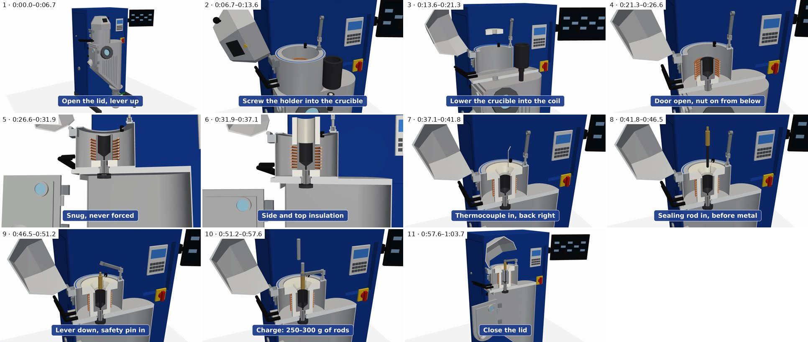
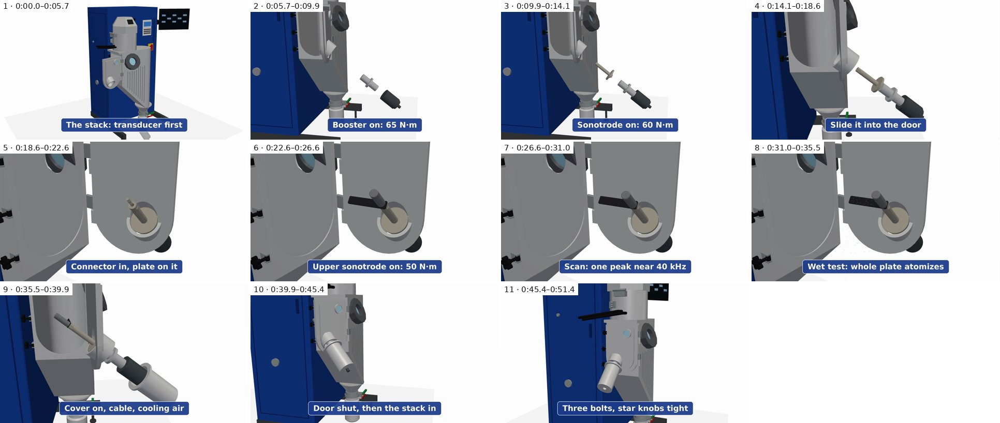
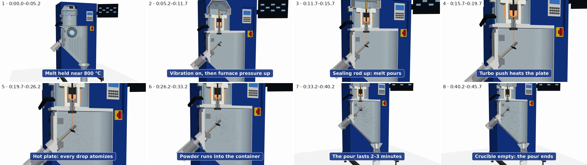
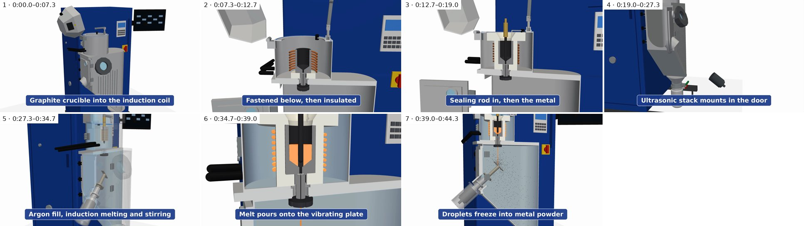

# Slide clips: captions, narration and timing

Generated by `build_ppt.py` from [`captions.py`](captions.py). Rules: at most 6 words a caption, each up at least 4 s; each line starts 0.25 s after its caption and ends at least 0.3 s before the next. Times are in the video, m:ss.s. The single-step clips run the animation at its own speed; the summary is condensed. The last frame is held at the end (1 s unless stated).

## Atomizer slide clip: loading the furnace (draft 1)

`03_furnace_load`, 1:03.7 long. 11 captions, up 4.7–7.7 s each; at most 6 words.

| # | Caption (words) | Up | For | Narration | Spoken | Spare |
|---|---|---|---|---|---|---|
| 1 | Open the lid, lever up (5) | 0:00.0–0:06.7 | 6.7 s | Start cold. Open the furnace lid, and swing the lever up. | 0:00.2–0:04.6 | 2.1 s |
| 2 | Screw the holder into the crucible (6) | 0:06.7–0:13.6 | 6.9 s | On the bench, screw the nozzle holder into the crucible. | 0:07.0–0:10.7 | 2.9 s |
| 3 | Lower the crucible into the coil (6) | 0:13.6–0:21.3 | 7.7 s | Bottom insulation first, then lower the crucible straight into the coil. | 0:13.8–0:18.7 | 2.6 s |
| 4 | Door open, nut on from below (6) | 0:21.3–0:26.6 | 5.3 s | Open the chamber door, and thread the graphite nut on from below. | 0:21.6–0:25.7 | 0.9 s |
| 5 | Snug, never forced (3) | 0:26.6–0:31.9 | 5.3 s | Snug, but never forced. Overtightened graphite cracks. | 0:26.9–0:31.3 | 0.6 s |
| 6 | Side and top insulation (4) | 0:31.9–0:37.1 | 5.2 s | Then the side and top insulation. | 0:32.1–0:34.5 | 2.6 s |
| 7 | Thermocouple in, back right (4) | 0:37.1–0:41.8 | 4.7 s | The thermocouple goes in at the back right. | 0:37.4–0:40.3 | 1.5 s |
| 8 | Sealing rod in, before metal (5) | 0:41.8–0:46.5 | 4.7 s | The sealing rod goes in before any metal. | 0:42.0–0:44.9 | 1.6 s |
| 9 | Lever down, safety pin in (5) | 0:46.5–0:51.2 | 4.7 s | Swing the lever down, and push the safety pin in. | 0:46.8–0:50.4 | 0.8 s |
| 10 | Charge: 250–300 g of rods (5) | 0:51.2–0:57.6 | 6.4 s | Now the charge: two hundred fifty to three hundred grams. | 0:51.5–0:55.5 | 2.1 s |
| 11 | Close the lid (3) | 0:57.6–1:03.7 | 6.1 s | Close the lid, and latch it just tight enough to seal. | 0:57.9–1:01.4 | 2.3 s |

## Atomizer slide clip: the ultrasonic stack and the door (draft 2)

`02_stack`, 0:51.4 long. 11 captions, up 4.0–6.0 s each; at most 6 words.

| # | Caption (words) | Up | For | Narration | Spoken | Spare |
|---|---|---|---|---|---|---|
| 1 | The stack: transducer first (4) | 0:00.0–0:05.7 | 5.7 s | The ultrasonic stack goes in last, starting with the transducer. | 0:00.2–0:04.8 | 0.9 s |
| 2 | Booster on: 65 N·m (4) | 0:05.7–0:09.9 | 4.2 s | Then the booster, at sixty-five newton meters. | 0:06.0–0:09.3 | 0.6 s |
| 3 | Sonotrode on: 60 N·m (4) | 0:09.9–0:14.1 | 4.2 s | The sonotrode, at sixty newton meters. | 0:10.2–0:13.1 | 1.0 s |
| 4 | Slide it into the door (5) | 0:14.1–0:18.6 | 4.5 s | Slide the stack into the door housing. | 0:14.3–0:16.9 | 1.7 s |
| 5 | Connector in, plate on it (5) | 0:18.6–0:22.6 | 4.0 s | Then the connector, and the plate onto it. | 0:18.9–0:21.7 | 0.9 s |
| 6 | Upper sonotrode on: 50 N·m (5) | 0:22.6–0:26.6 | 4.0 s | The upper sonotrode, at fifty newton meters. | 0:22.9–0:26.0 | 0.6 s |
| 7 | Scan: one peak near 40 kHz (6) | 0:26.6–0:31.0 | 4.4 s | Scan for one wide peak, near forty kilohertz. | 0:26.9–0:30.5 | 0.5 s |
| 8 | Wet test: whole plate atomizes (5) | 0:31.0–0:35.5 | 4.5 s | A drop of water should atomize over the whole plate. | 0:31.2–0:34.7 | 0.8 s |
| 9 | Cover on, cable, cooling air (5) | 0:35.5–0:39.9 | 4.4 s | Bolt the cover on, then the cable and the air. | 0:35.8–0:38.8 | 1.1 s |
| 10 | Door shut, then the stack in (6) | 0:39.9–0:45.4 | 5.5 s | Swing the door shut, then slide the stack in to its mark. | 0:40.1–0:43.9 | 1.5 s |
| 11 | Three bolts, star knobs tight (5) | 0:45.4–0:51.4 | 6.0 s | Swing the three bolts over, and tighten the knobs. | 0:45.6–0:49.1 | 2.3 s |

## Atomizer slide clip: the pour (draft 2)

`06_pour`, 0:45.7 long. 8 captions, up 4.0–7.0 s each; at most 6 words.

| # | Caption (words) | Up | For | Narration | Spoken | Spare |
|---|---|---|---|---|---|---|
| 1 | Melt held near 800 °C (5) | 0:00.0–0:05.2 | 5.2 s | The melt is held near eight hundred degrees, under argon. | 0:00.2–0:04.0 | 1.2 s |
| 2 | Vibration on, then furnace pressure up (6) | 0:05.2–0:11.7 | 6.5 s | Switch the vibration on, then raise the furnace pressure above the chamber's. | 0:05.5–0:10.5 | 1.2 s |
| 3 | Sealing rod up: melt pours (5) | 0:11.7–0:15.7 | 4.0 s | Lift the sealing rod, and the melt pours. | 0:11.9–0:14.9 | 0.8 s |
| 4 | Turbo push heats the plate (5) | 0:15.7–0:19.7 | 4.0 s | A short turbo push heats the plate. | 0:15.9–0:18.3 | 1.4 s |
| 5 | Hot plate: every drop atomizes (5) | 0:19.7–0:26.2 | 6.5 s | Once the plate is hot, every drop atomizes. | 0:19.9–0:23.4 | 2.8 s |
| 6 | Powder runs into the container (5) | 0:26.2–0:33.2 | 7.0 s | The droplets freeze in the argon, and the powder runs down into the container. | 0:26.4–0:31.9 | 1.4 s |
| 7 | The pour lasts 2–3 minutes (5) | 0:33.2–0:40.2 | 7.0 s | The pour lasts two to three minutes, with an operator watching at the window. | 0:33.5–0:38.3 | 1.9 s |
| 8 | Crucible empty: the pour ends (5) | 0:40.2–0:45.7 | 5.5 s | When the crucible runs empty, the pour is over. | 0:40.5–0:44.0 | 1.7 s |

## Atomizer slide clip: from loading to powder in 45 seconds (draft 3)

`summary`, 0:44.9 long. 7 captions, up 4.3–8.9 s each; at most 6 words. The last frame is held 0.7 s.

Condensed: the fasteners (holder, nut, thermocouple, lever, booster, sonotrode, connector, plate, upper sonotrode, cover and bolts) are sped up, and the checks, gas washes and holds are left out. Each move is followed by a short pause, and the furnace, the stack and the run are a longer pause apart. The parts follow the same paths, in the same order, as in the full step animations.

| # | Caption (words) | Up | For | Narration | Spoken | Spare |
|---|---|---|---|---|---|---|
| 1 | Graphite crucible into the induction coil (6) | 0:00.0–0:07.3 | 7.3 s | A graphite crucible, with a nozzle, goes into the coil. | 0:00.2–0:04.8 | 2.5 s |
| 2 | Fastened below, then insulated (4) | 0:07.3–0:12.7 | 5.4 s | It's fastened from below, then insulated. | 0:07.5–0:10.7 | 2.0 s |
| 3 | Sealing rod in, then the metal (6) | 0:12.7–0:19.0 | 6.3 s | A sealing rod plugs the nozzle; then the metal. | 0:12.9–0:16.6 | 2.5 s |
| 4 | Ultrasonic stack mounts in the door (6) | 0:19.0–0:27.9 | 8.9 s | The forty kilohertz ultrasonic stack mounts in the door. | 0:19.3–0:22.8 | 5.1 s |
| 5 | Argon fill, induction melting and stirring (6) | 0:27.9–0:35.3 | 7.4 s | Under argon, the coil melts and stirs the metal. | 0:28.2–0:31.7 | 3.6 s |
| 6 | Melt pours onto the vibrating plate (6) | 0:35.3–0:39.6 | 4.3 s | The rod lifts; melt hits the vibrating plate. | 0:35.6–0:38.9 | 0.7 s |
| 7 | Droplets freeze into metal powder (5) | 0:39.6–0:44.9 | 5.3 s | It flies off as droplets that freeze into powder. | 0:39.9–0:43.7 | 1.3 s |

Also cut into one part per step, for a slide each (each ends on a 0.5 s hold; the last keeps the clip's own):

- [`videos/summary_1_furnace.mp4`](videos/summary_1_furnace.mp4): 0:00.0–0:19.0 of the clip
- [`videos/summary_2_stack.mp4`](videos/summary_2_stack.mp4): 0:19.0–0:27.9 of the clip
- [`videos/summary_3_run.mp4`](videos/summary_3_run.mp4): 0:27.9–0:44.9 of the clip

