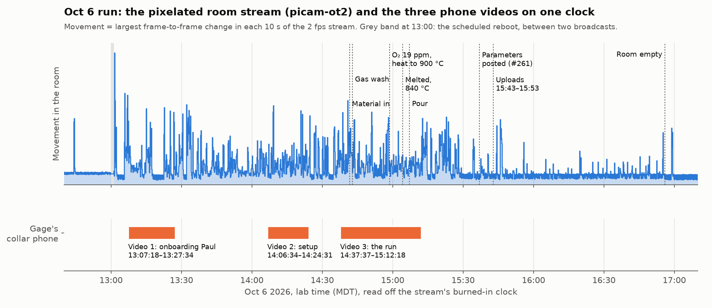
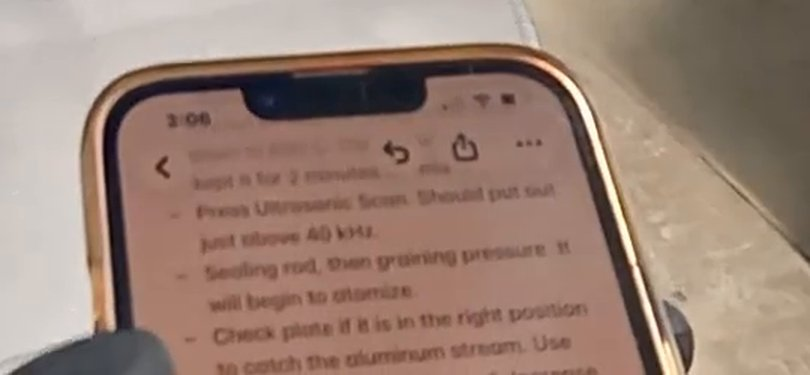

# Oct 6 2026, run 1: Gage's videos against his daily SOP and the room stream

Gage Erickson operated the atomizer on Tue Oct 6 2026, wearing a phone on his collar, and the same afternoon posted
two things: the run's parameters in [#261](https://github.com/vertical-cloud-lab/byu-vcl/issues/261), and a
*Daily Atomizer Run SOP* dividing a run day between himself, Ronnie and Paul in
[#126 (comment)](https://github.com/vertical-cloud-lab/byu-vcl/issues/126#issuecomment-6026802219), copied here as
[`../daily-sop.md`](../daily-sop.md). This page checks both against what was filmed. The phone videos are placed on
the wall clock with the pixelated room stream (`picam-ot2`), whose burned-in clock is read off the picture.

Times are lab time (MDT), read off the stream, to about ±1 s. Phone links (V1–V3) open YouTube's embed player paused at
that second, as everywhere in this folder. Stream links open the room stream at the same instant.

## Sources

| | Video | Length | Recording, MDT | What it shows |
| --- | --- | --- | --- | --- |
| V1 | [Oct 6 atomizer run, video 1](https://www.youtube.com/watch?v=VFycaxIq0Tc) (public) | 20:17 | 13:07:18–13:27:34 | Gage introduces Paul to the lab and to Paul's part of the daily SOP: ordering tools, the run spreadsheet, SEM stubs. No machine operation |
| V2 | [Oct 6th atomizer run, video 2](https://www.youtube.com/watch?v=dnPs56DPt6I) (unlisted) | 17:57 | 14:06:34–14:24:31 | Crucible, thermocouple and sealing rod into the open furnace, ultrasonic scan, a plate on at 50, swapped for carbon fibre, spray test, door closed |
| V3 | [Oct 6 atomizer run, video 3](https://www.youtube.com/watch?v=DWH1CEygsTI) (unlisted) | 34:42 | 14:37:37–15:12:18 | Charge cleaned and loaded, gas wash, heating, melt, pour, what went wrong, start of the cool-down |
| | [`AHERrlMcqKg`](https://www.youtube.com/watch?v=AHERrlMcqKg), *atomizer stream picam-ot2, 2026-10-06 UTC 19:00* | live until 21:00 | 13:01:11 on | The room from the ceiling, 144p at 2 fps, pixelated to 128 × 72 blocks ([`docs/stream-cams.md`](../../docs/stream-cams.md#pixelation)) |
| | [`EpFB_QaDegU`](https://www.youtube.com/watch?v=EpFB_QaDegU), *… 2026-10-06 UTC 11:00* | 7:58:50 | 05:01:09–13:00:00 | The same; the room is still all morning, apart from blips at 05:37, 06:19 and 12:44 |

Transcripts (Whisper large-v3-turbo, word-timed): [V1](../transcripts/whisper/VFycaxIq0Tc.txt),
[V2](../transcripts/whisper/dnPs56DPt6I.txt), [V3](../transcripts/whisper/DWH1CEygsTI.txt). Contact sheets:
[V1](../keyframes/VFycaxIq0Tc_sheet.jpg), [V2](../keyframes/dnPs56DPt6I_sheet.jpg),
[V3](../keyframes/DWH1CEygsTI_sheet.jpg). Review sheets in [`review/`](2026-10-06/review/): a phone frame every
20–30 s with the stream frame of the same instant inset, and the stream alone for the stretches no phone recorded.

## How the times were found

1. **The stream's clock.** The overlay (`YYYY-MM-DD_HH-MM-SS`, lab time) was cropped every 30 s and read with
   tesseract ([`stream_clock.csv`](2026-10-06/stream_clock.csv)). Every legible reading fits *time = start + offset*:
   460 of the 461 legible readings for the afternoon broadcast give 13:01:11 (50 crops were not legible), and 957 of 958
   for the morning give 05:01:09–05:01:10. The odd one out each time is the broadcast's first frame, 7 s late. So, unlike the stalled archive in
   `CLAUDE.md`, neither broadcast has a step, and an offset converts straight to wall time.
2. **The phone videos.** YouTube keeps no recording time for them (`fileDetails` has no creation time and
   `recordingDetails` is empty). The phone is on Gage's collar, so its picture moves when he moves, and the ceiling
   camera sees him move. The frame-to-frame change of each, every 0.5 s, was cross-correlated
   ([`../tools/stream_sync.py`](../tools/stream_sync.py) `align`, [`alignment.json`](2026-10-06/alignment.json)):

   | | Offset in the stream | Correlation | Next-best elsewhere | First half / second half alone |
   | --- | --- | --- | --- | --- |
   | V1 | 367.5 s | 0.48 | 0.30 | 367.5 / 368.5 s |
   | V2 | 3923.5 s | 0.76 | 0.28 | 3923.5 / 3923.5 s |
   | V3 | 5786.0 s | 0.80 | 0.25 | 5786.0 / 5786.0 s |

   V1 is a conversation, mostly standing, often with the camera covered, hence its weaker peak; each of its halves
   finds the same offset on its own.
3. **Checked by eye, and against an independent clock.** [`alignment_check.jpg`](2026-10-06/alignment_check.jpg) puts
   phone and stream frames side by side: Paul walking back to the bench, the spray test, Gage out in the main lab
   while the room is empty. And at [V3 28:58](https://www.youtube.com/embed/DWH1CEygsTI?start=1738) the phone in Gage's hand, showing his checklist, reads **3:06** in its
   status bar; the alignment puts that moment at 15:06:35–15:06:38.

## The day, minute by minute

| MDT | Where | What |
| --- | --- | --- |
| 12:44:13 | stream (morning) | 14 s of movement; before it, only blips at 05:37 and 06:19 |
| 13:01:11 | stream | Broadcast starts after the 13:00 scheduled reboot |
| 13:01:51–13:02:16 | stream [13:01:51](https://www.youtube.com/embed/AHERrlMcqKg?start=40) | Someone crouched by the black units on the right of the room |
| 13:05:50 | stream [13:06:11](https://www.youtube.com/embed/AHERrlMcqKg?start=300) | Two people at the machine, one in blue (Paul) |
| 13:07:18 | [V1 00:00](https://www.youtube.com/embed/VFycaxIq0Tc?start=0) · stream [13:07:18](https://www.youtube.com/embed/AHERrlMcqKg?start=367) | V1 starts: "set a 20 minute timer" |
| 13:08:26 | [V1 01:08](https://www.youtube.com/embed/VFycaxIq0Tc?start=68) · stream [13:08:26](https://www.youtube.com/embed/AHERrlMcqKg?start=435) | "Me and Ronnie are the only ones that are allowed to operate this machine" |
| 13:16:09–13:20:05 | [V1 08:51](https://www.youtube.com/embed/VFycaxIq0Tc?start=531) | ME orders, shown on the laptop in the main lab; the room is empty on the stream from 13:18 |
| 13:25:15 | [V1 17:57](https://www.youtube.com/embed/VFycaxIq0Tc?start=1077) · stream [13:25:15](https://www.youtube.com/embed/AHERrlMcqKg?start=1444) | SEM stubs: carbon tape, dip, shake off |
| 13:26:51 | [V1 19:33](https://www.youtube.com/embed/VFycaxIq0Tc?start=1173) | "every single run … put it into an excel sheet"; "CFC plate … carbon fiber" |
| 13:29–13:34 | stream [13:30:00](https://www.youtube.com/embed/AHERrlMcqKg?start=1729) | Three or four people in the room |
| 13:35–13:58 | stream [13:45:00](https://www.youtube.com/embed/AHERrlMcqKg?start=2629) | One person seated at the bench, not recorded |
| 13:58–14:06 | stream [14:02:00](https://www.youtube.com/embed/AHERrlMcqKg?start=3649) | At the machine; the furnace is open when V2 starts |
| 14:08:14–14:09:34 | [V2 01:40](https://www.youtube.com/embed/dnPs56DPt6I?start=100) · stream [14:08:14](https://www.youtube.com/embed/AHERrlMcqKg?start=4023) | Crucible and insulation into the furnace |
| 14:10:14–14:10:54 | [V2 03:40](https://www.youtube.com/embed/dnPs56DPt6I?start=220) · stream [14:10:14](https://www.youtube.com/embed/AHERrlMcqKg?start=4143) | Thermocouple, then the sealing rod |
| 14:12:12 | [V2 05:38](https://www.youtube.com/embed/dnPs56DPt6I?start=338) · stream [14:12:12](https://www.youtube.com/embed/AHERrlMcqKg?start=4261) | "Ultrasonic scan" … "40,000"; "as far as I understand, that's good" |
| 14:15:00–14:16:07 | [V2 08:26](https://www.youtube.com/embed/dnPs56DPt6I?start=506) · stream [14:15:00](https://www.youtube.com/embed/AHERrlMcqKg?start=4429) | "This needs to be set to 50": the torque wrench, for the plate |
| 14:16:42 | [V2 10:08](https://www.youtube.com/embed/dnPs56DPt6I?start=608) · stream [14:16:42](https://www.youtube.com/embed/AHERrlMcqKg?start=4531) | Test: "40,200. Perfect"; "20 watts of power. Good" |
| 14:19:40 | [V2 13:06](https://www.youtube.com/embed/dnPs56DPt6I?start=786) · stream [14:19:40](https://www.youtube.com/embed/AHERrlMcqKg?start=4709) | "I said we're going to do these with carbon fiber because those are the cheapest … I gotta redo this" |
| 14:22:59 | [V2 16:25](https://www.youtube.com/embed/dnPs56DPt6I?start=985) · stream [14:22:59](https://www.youtube.com/embed/AHERrlMcqKg?start=4908) | Spray test on the new plate (squeeze bottle through the open door) |
| 14:24:13–14:24:23 | [V2 17:39](https://www.youtube.com/embed/dnPs56DPt6I?start=1059) · stream [14:24:13](https://www.youtube.com/embed/AHERrlMcqKg?start=4982) | Door bolts: "That's tight"; "I think we're set now. I just need to prepare our material" |
| 14:24:50–14:35:30 | stream [14:30:30](https://www.youtube.com/embed/AHERrlMcqKg?start=5359) | Gage mostly out of the room; someone passes through at 14:26:50 and 14:30–14:31 |
| 14:37:37 | [V3 00:00](https://www.youtube.com/embed/DWH1CEygsTI?start=0) · stream [14:37:37](https://www.youtube.com/embed/AHERrlMcqKg?start=5786) | V3 starts: "Alright, got our material" |
| 14:38:17–14:40:37 | [V3 00:40](https://www.youtube.com/embed/DWH1CEygsTI?start=40) · stream [14:38:17](https://www.youtube.com/embed/AHERrlMcqKg?start=5826) | Charge wiped with IPA at the bench |
| 14:41:37–14:42:17 | [V3 04:00](https://www.youtube.com/embed/DWH1CEygsTI?start=240) · stream [14:41:37](https://www.youtube.com/embed/AHERrlMcqKg?start=6026) | Seal wiped; charge into the crucible beside the sealing rod |
| 14:42:54 | [V3 05:17](https://www.youtube.com/embed/DWH1CEygsTI?start=317) · stream [14:42:54](https://www.youtube.com/embed/AHERrlMcqKg?start=6103) | "pressure control, vacuum pump, gas wash, it's gonna do its thing a couple times" |
| 14:57:52 | [V3 20:15](https://www.youtube.com/embed/DWH1CEygsTI?start=1215) · stream [14:57:52](https://www.youtube.com/embed/AHERrlMcqKg?start=7001) | Out in the main lab: "Do you want to see this, Ronnie? Or Carl?" |
| 14:58:38 | [V3 21:01](https://www.youtube.com/embed/DWH1CEygsTI?start=1261) · stream [14:58:38](https://www.youtube.com/embed/AHERrlMcqKg?start=7047) | "now it's 19 … ppm"; "Low 20s is good enough" |
| 14:58:52 | [V3 21:15](https://www.youtube.com/embed/DWH1CEygsTI?start=1275) · stream [14:58:52](https://www.youtube.com/embed/AHERrlMcqKg?start=7061) | "put the temperature up to 900" |
| 15:00:55 | [V3 23:18](https://www.youtube.com/embed/DWH1CEygsTI?start=1398) · stream [15:00:55](https://www.youtube.com/embed/AHERrlMcqKg?start=7184) | "Set a timer for 16 minutes. That's how much time is left on the storage for the phone" |
| 15:02:03 | [V3 24:26](https://www.youtube.com/embed/DWH1CEygsTI?start=1466) · stream [15:02:03](https://www.youtube.com/embed/AHERrlMcqKg?start=7252) | "Increase the pressure to 20 bar" (Whisper, 0.99 on "20"); see the parameters below |
| 15:02:27 | [V3 24:50](https://www.youtube.com/embed/DWH1CEygsTI?start=1490) · stream [15:02:27](https://www.youtube.com/embed/AHERrlMcqKg?start=7276) | "PPM counts to 27" |
| 15:03:58 | [V3 26:21](https://www.youtube.com/embed/DWH1CEygsTI?start=1581) · stream [15:03:58](https://www.youtube.com/embed/AHERrlMcqKg?start=7367) | "remember for next time … bring down the [ppm] to like seven, just do one more purge at the end there, let it settle longer" |
| 15:04:19 | [V3 26:42](https://www.youtube.com/embed/DWH1CEygsTI?start=1602) · stream [15:04:19](https://www.youtube.com/embed/AHERrlMcqKg?start=7388) | "bring this down to 850 … 40, completely melted" |
| 15:05:00 | [V3 27:23](https://www.youtube.com/embed/DWH1CEygsTI?start=1643) · stream [15:05:00](https://www.youtube.com/embed/AHERrlMcqKg?start=7429) | "let that go for two minutes" |
| 15:05:57–15:06:13 | [V3 28:20](https://www.youtube.com/embed/DWH1CEygsTI?start=1700) · stream [15:05:57](https://www.youtube.com/embed/AHERrlMcqKg?start=7486) | Ultrasonic scan on the HMI, nominal 40,185 Hz |
| 15:06:24 | [V3 28:47](https://www.youtube.com/embed/DWH1CEygsTI?start=1727) · stream [15:06:24](https://www.youtube.com/embed/AHERrlMcqKg?start=7513) | "scanner is looking good, I'm gonna press draining pressure" |
| 15:06:35 | [V3 28:58](https://www.youtube.com/embed/DWH1CEygsTI?start=1738) · stream [15:06:35](https://www.youtube.com/embed/AHERrlMcqKg?start=7524) | Reads the checklist on the second phone (clock 3:06, above) |
| 15:07:12 | [V3 29:35](https://www.youtube.com/embed/DWH1CEygsTI?start=1775) · stream [15:07:12](https://www.youtube.com/embed/AHERrlMcqKg?start=7561) | "here we go": the pour |
| 15:08:12 | [V3 30:35](https://www.youtube.com/embed/DWH1CEygsTI?start=1835) · stream [15:08:12](https://www.youtube.com/embed/AHERrlMcqKg?start=7621) | "That'd be why, huh? It was just too high at this point, too late" |
| 15:08:17 | [V3 30:40](https://www.youtube.com/embed/DWH1CEygsTI?start=1840) · stream [15:08:17](https://www.youtube.com/embed/AHERrlMcqKg?start=7626) | Hand on the stack, pulling it back |
| 15:09:02 | [V3 31:25](https://www.youtube.com/embed/DWH1CEygsTI?start=1885) · stream [15:09:02](https://www.youtube.com/embed/AHERrlMcqKg?start=7671) | "There we go" |
| 15:09:48 | [V3 32:11](https://www.youtube.com/embed/DWH1CEygsTI?start=1931) · stream [15:09:48](https://www.youtube.com/embed/AHERrlMcqKg?start=7717) | "We're done" |
| 15:10:12 | [V3 32:35](https://www.youtube.com/embed/DWH1CEygsTI?start=1955) · stream [15:10:12](https://www.youtube.com/embed/AHERrlMcqKg?start=7741) | "That was too high, and so the stream was hitting that, blobbing up, and then falling under this. And I couldn't see it" |
| 15:10:35 | [V3 32:58](https://www.youtube.com/embed/DWH1CEygsTI?start=1978) · stream [15:10:35](https://www.youtube.com/embed/AHERrlMcqKg?start=7764) | "I forgot to turn on the ultrasonic system" |
| 15:10:57 | [V3 33:20](https://www.youtube.com/embed/DWH1CEygsTI?start=2000) · stream [15:10:57](https://www.youtube.com/embed/AHERrlMcqKg?start=7786) | HMI: chamber 138 mbar, 783 °C, oxygen 121 ppm; ultrasonic 0 %, 0 Hz, 0 W |
| 15:11:20 | [V3 33:43](https://www.youtube.com/embed/DWH1CEygsTI?start=2023) · stream [15:11:20](https://www.youtube.com/embed/AHERrlMcqKg?start=7809) | "wait for this to cool down to about 400 degrees, and then after that we can open it up" |
| 15:12:18 | stream [15:12:18](https://www.youtube.com/embed/AHERrlMcqKg?start=7867) | V3 ends; nothing after this was filmed by the phone |
| 15:13–15:22 | stream [15:13:30](https://www.youtube.com/embed/AHERrlMcqKg?start=7939) | Others come by at 15:13–15:14 and 15:21–15:22 |
| 15:17–16:55 | stream [15:40:00](https://www.youtube.com/embed/AHERrlMcqKg?start=9529) | One person, by the clothes Gage, seated at the bench; brief trips to the machine at 15:24, 15:27 and 15:46 |
| 15:37:01 | [#261](https://github.com/vertical-cloud-lab/byu-vcl/issues/261) | Parameters posted |
| 15:42:56, 15:44:15, 15:52:47 | YouTube | V2, V3 and V1 published |
| 16:56 | stream [16:57:00](https://www.youtube.com/embed/AHERrlMcqKg?start=14149) | Room empty; a 22 s visit at 16:58:53, nothing after it up to 17:16, where the download stops |

## The daily SOP, step by step

✔ seen on video · ◐ partly, or seen only as shapes on the stream · ✘ not done as written · – not filmed.
The SOP's wording is quoted from [`../daily-sop.md`](../daily-sop.md).

### Gage: setup

| Step | | Evidence |
| --- | --- | --- |
| Turn on recording cameras | ◐ | The collar phone recorded 73 min of the ~3 h 55 min someone was in the room (13:01–16:56). Not filmed: 13:01–13:07, 13:27–14:06 (the furnace is already open when V2 starts), 14:24–14:37 (fetching the charge) and everything after 15:12. The stream covers those stretches as shapes only. The phone was also short of space: "That's how much time is left on the storage for the phone" at [V3 23:18](https://www.youtube.com/embed/DWH1CEygsTI?start=1398) |
| Put on PPE | ◐ | Black nitrile gloves throughout V2 and V3. Glasses, coat and shoes are out of the collar camera's view, and the stream is too coarse to tell |
| Check for / or prepare material for atomizing | ✔ | Charge fetched between V2 and V3 (stream 14:24–14:37), "got our material" [V3 00:00](https://www.youtube.com/embed/DWH1CEygsTI?start=0), wiped with IPA [V3 00:40](https://www.youtube.com/embed/DWH1CEygsTI?start=40) |
| Check atomizer water, argon pressure, vacuum pump oil, and filters | ◐ | Before the first video, someone crouches by the black units on the right of the room (stream 13:01:51–13:02:16). Argon regulator gauges at [V3 06:00](https://www.youtube.com/embed/DWH1CEygsTI?start=360) and the wall valves at [V3 11:40](https://www.youtube.com/embed/DWH1CEygsTI?start=700). Water, pump oil and filters are not on the phone |
| Turn on atomizer power, compressed air, argon | ◐ | The HMI is already on at [V1 01:00](https://www.youtube.com/embed/VFycaxIq0Tc?start=60) (13:08), so power was on before the first video. The wall valves at [V3 11:40](https://www.youtube.com/embed/DWH1CEygsTI?start=700) |
| Check atomizer inside and out for cleanliness | – | Not on camera. In V1 Gage explains that the whole inside of the container is brushed clean [V1 15:27](https://www.youtube.com/embed/VFycaxIq0Tc?start=927) |
| Check nozzle, guards, and sonotrode … properly in place | ✘ | Crucible, thermocouple and sealing rod were fitted [V2 01:40](https://www.youtube.com/embed/dnPs56DPt6I?start=100) [V2 03:40](https://www.youtube.com/embed/dnPs56DPt6I?start=220), but the plate and upper sonotrode sat where the stream hit the sonotrode instead of the plate: "That was too high, and so the stream was hitting that" [V3 32:35](https://www.youtube.com/embed/DWH1CEygsTI?start=1955), and the #261 comment |
| Reconfigure sonotrode (boosters) if necessary | – | Not on camera; #261 records a 1:1 booster |
| Install US (ultrasonic) Plate | ✔ | Torque wrench set "to 50" [V2 08:26](https://www.youtube.com/embed/dnPs56DPt6I?start=506), then swapped for carbon fibre "because those are the cheapest" [V2 13:06](https://www.youtube.com/embed/dnPs56DPt6I?start=786) and torqued again [V2 15:40](https://www.youtube.com/embed/dnPs56DPt6I?start=940) |
| Test sonotrode frequency and spray IPA to test ability | ✔ | Scan "40,000" [V2 05:38](https://www.youtube.com/embed/dnPs56DPt6I?start=338), test "40,200. Perfect", "20 watts" [V2 10:08](https://www.youtube.com/embed/dnPs56DPt6I?start=608); spray test on the new plate [V2 16:25](https://www.youtube.com/embed/dnPs56DPt6I?start=985); scanned again just before the pour, nominal 40,185 Hz [V3 28:20](https://www.youtube.com/embed/DWH1CEygsTI?start=1700) |
| Close chamber | ✔ | Star knobs, "That's tight" [V2 17:39](https://www.youtube.com/embed/dnPs56DPt6I?start=1059) |
| Put in material | ✔ | [V3 04:00](https://www.youtube.com/embed/DWH1CEygsTI?start=240) |
| Clean seal and close furnace | ✔ | Seal wiped, charge in, lid closed [V3 04:00](https://www.youtube.com/embed/DWH1CEygsTI?start=240) [V3 05:40](https://www.youtube.com/embed/DWH1CEygsTI?start=340) |

### Gage: atomization

| Step | | Evidence |
| --- | --- | --- |
| Begin purge process | ✔ | "pressure control, vacuum pump, gas wash" [V3 05:17](https://www.youtube.com/embed/DWH1CEygsTI?start=317); argon fill at [V3 20:43](https://www.youtube.com/embed/DWH1CEygsTI?start=1243); 19 ppm at [V3 21:01](https://www.youtube.com/embed/DWH1CEygsTI?start=1261) |
| Atomize | ✘ | Heated to 900 °C, then 850–840 °C, melted, held 2 min [V3 21:15](https://www.youtube.com/embed/DWH1CEygsTI?start=1275) [V3 26:42](https://www.youtube.com/embed/DWH1CEygsTI?start=1602) [V3 27:23](https://www.youtube.com/embed/DWH1CEygsTI?start=1643). The pour began with the ultrasonic system off and the stream hitting the upper sonotrode; Gage pulled the stack back part way through, and some of the melt atomized [V3 30:35](https://www.youtube.com/embed/DWH1CEygsTI?start=1835)–[V3 32:58](https://www.youtube.com/embed/DWH1CEygsTI?start=1978). See [what the footage adds](#what-the-footage-adds-to-the-daily-sop) |
| Begin post process cooling procedure | ✔ | "wait for this to cool down to about 400 degrees" [V3 33:43](https://www.youtube.com/embed/DWH1CEygsTI?start=2023) |

### Gage: post atomization

| Step | | Evidence |
| --- | --- | --- |
| Upload information parameters from run into #261 | ✔ | Posted 15:37:01, 25 min after the pour; Gage is seated at the bench on the stream [15:37:00](https://www.youtube.com/embed/AHERrlMcqKg?start=9349) |
| Upload all videos … Labeled "Month/Day/Year Atomizer Run Video #". Attach to Atomizer Runs playlist | ◐ | Published 15:42–15:52. The titles do not follow the pattern ("Oct 6 atomizer run, video 1", "Oct 6th atomizer run, video 2 ", "Oct 6 atomizer run, video 3"). V1 is public, V2 and V3 unlisted. The channel has no *Atomizer Runs* playlist, so they went into the [atomizer playlist](https://www.youtube.com/playlist?list=PLB8wxmcPAjLM) as items 35–37 |
| Once at 100 degrees C turn off heat exchanger and atomizer fully | – | Not filmed. Gage leaves at about 16:56; a 22 s visit at 16:58:53 [16:58:50](https://www.youtube.com/embed/AHERrlMcqKg?start=14259) may be this, but 128 × 72 blocks cannot show it |
| Close furnace lid to protect against dust buildup | – | Not filmed |

### Ronnie and Paul

Ronnie's cleaning (furnace, chamber, collection chamber) comes after the cool-down and is not in these videos; in V2
Gage rebuilds the furnace himself. V1 is Gage introducing Paul to his part:

| Paul's step | Evidence in V1 |
| --- | --- |
| Upload parameters from #261 to the Excel sheet | "every single run, we've got all these parameters that we need and put it into an excel sheet": plate type, amplitude, melt temperature, type of aluminum [V1 19:33](https://www.youtube.com/embed/VFycaxIq0Tc?start=1173) |
| Wipe down, organize, sweep | Not discussed |
| Check phones and YouTube; delete uploaded videos from the phones | Not discussed; on the day the phone was short of space ([V3 23:18](https://www.youtube.com/embed/DWH1CEygsTI?start=1398)) |
| Material preparation: cups per #248, rods | Paul already knew of the aluminum shells "you fill with metal" [V1 05:07](https://www.youtube.com/embed/VFycaxIq0Tc?start=307) |
| Not in the SOP yet: ordering tools | The T-piece clip, brushes, a stainless scraper "like a card", a tape measure, through ME orders and checked with Gage or Ronnie before submitting [V1 07:43](https://www.youtube.com/embed/VFycaxIq0Tc?start=463) [V1 08:51](https://www.youtube.com/embed/VFycaxIq0Tc?start=531) [V1 12:17](https://www.youtube.com/embed/VFycaxIq0Tc?start=737) [V1 16:52](https://www.youtube.com/embed/VFycaxIq0Tc?start=1012) |
| Not in the SOP yet: SEM stubs | Carbon tape on a cleaned stub, dip, shake off, wearing gloves [V1 17:57](https://www.youtube.com/embed/VFycaxIq0Tc?start=1077); in V3, out in the main lab, Gage says he has asked Paul to start making them [V3 19:55](https://www.youtube.com/embed/DWH1CEygsTI?start=1195) |

## The #261 parameters against the footage

| #261 | Footage | |
| --- | --- | --- |
| 180 g of Al 6067 | Mass and alloy are not said on camera. "6067" is probably Al 6063, the alloy the daily SOP names for the rods (inferred) | ? |
| Small CF plate | "I said we're going to do these with carbon fiber" [V2 13:06](https://www.youtube.com/embed/dnPs56DPt6I?start=786) | ✔ |
| 1-1 booster | Not said or shown | ? |
| O₂ started at 19 ppm and ended at 140 | 19 ppm at [V3 21:01](https://www.youtube.com/embed/DWH1CEygsTI?start=1261), 27 during heating [V3 24:50](https://www.youtube.com/embed/DWH1CEygsTI?start=1490), 121 on the HMI after the pour [V3 33:20](https://www.youtube.com/embed/DWH1CEygsTI?start=2000). The 140 must have been read after V3 ends | ✔ |
| Amp = 50 (forgot to set this) | The amplitude is not on camera. The "50" in V2 is the torque wrench. The training's value is about 90 ([`sop.md`](../sop.md#operator-checklist)) | ? |
| 840 °C melt temperature | "up to 900" [V3 21:15](https://www.youtube.com/embed/DWH1CEygsTI?start=1275), then "down to 850 … 40" [V3 26:42](https://www.youtube.com/embed/DWH1CEygsTI?start=1602) | ✔ |
| Graining pressure 0.2 bar | "Increase the pressure to 20 bar" [V3 24:26](https://www.youtube.com/embed/DWH1CEygsTI?start=1466); 0.20 bar is meant (inferred). Said as "draining pressure" [V3 28:47](https://www.youtube.com/embed/DWH1CEygsTI?start=1727); the phone checklist says "graining" | ✔ (inferred) |
| 2 minute melt time | "let that go for two minutes" [V3 27:23](https://www.youtube.com/embed/DWH1CEygsTI?start=1643); the checklist says "kept it for 2 minutes" | ✔ |
| Comment: upper sonotrode in the way; pulled it back ¾ of the way through; should have started the ultrasonic system before opening the sealing pin | [V3 30:35](https://www.youtube.com/embed/DWH1CEygsTI?start=1835), [V3 30:40](https://www.youtube.com/embed/DWH1CEygsTI?start=1840), [V3 32:35](https://www.youtube.com/embed/DWH1CEygsTI?start=1955), [V3 32:58](https://www.youtube.com/embed/DWH1CEygsTI?start=1978) | ✔ |

## What the footage adds to the daily SOP

Suggestions for Gage and Ronnie; nothing in [`../daily-sop.md`](../daily-sop.md) has been changed.

1. **Switch the vibration on before the pour, as its own step.** The checklist on Gage's phone at 15:06 has "Press
   Ultrasonic Scan" and then "Sealing rod, then graining pressure", with no step that starts the vibration. A scan does not
   start it: the HMI has separate ULTRASONIC SCAN and ULTRASONIC START buttons ([V3 10:40](https://www.youtube.com/embed/DWH1CEygsTI?start=640)). The training order, in
   [`sop.md`](../sop.md#pour), is vibration on ([T5 59:51](https://www.youtube.com/embed/58wJ_Khwgyk?start=3591)), draining pressure on
   ([T3 41:48](https://www.youtube.com/embed/txH397FGTAU?start=2508)), then the sealing rod up. On the day Gage did press draining pressure first and then the sealing rod ([V3 28:47](https://www.youtube.com/embed/DWH1CEygsTI?start=1727)), but the checklist has those two the other way round.
   The amplitude belongs in the same step: #261 records 50, "forgot to set this", and the training used about 90.
2. **Check the plate's position under the nozzle before the door is closed.** Once the pour starts the stream is hard to
   see through the window: "I couldn't see it, so I wasn't sure what was going on" [V3 32:44](https://www.youtube.com/embed/DWH1CEygsTI?start=1964). On Oct 2 the plate was too far
   from the nozzle and the lesson was to move it closer and higher
   ([`sop.md`](../sop.md#lessons-from-the-first-unsupervised-run-oct-2)); on Oct 6 it was too high. A marked reference
   position for the stack would settle it.
3. **Units and spelling.** "tighten to 50 torr" should be 50 N·m (torr is a pressure; the wrench is set to 50 in
   [V2 08:26](https://www.youtube.com/embed/dnPs56DPt6I?start=506), and [`sop.md`](../sop.md#ultrasonic-stack) has 50 N·m). "Dawn respirator" should be "Don".
   "utlrasonic" should be "ultrasonic". "Al 6067" in #261 is probably 6063.
4. **Purge target.** Oxygen went from 19 ppm before heating to 121 ppm after the pour. Gage's own note at the time was to
   purge further, to about 7 ppm, with one more purge and a longer settle [V3 26:21](https://www.youtube.com/embed/DWH1CEygsTI?start=1581). The training limit is
   ≤100 ppm, best 40–50 ([`sop.md`](../sop.md#gas-wash-and-heating-schedule)).
5. **"Last time … I don't think we had enough pressure"** [V3 24:36](https://www.youtube.com/embed/DWH1CEygsTI?start=1476), said while raising the pour pressure to 0.2
   bar, reads against the Oct 2 lesson that 0.17 bar was far too high ([`sop.md`](../sop.md#lessons-from-the-first-unsupervised-run-oct-2)).
   Worth settling which pressure, and whether the HMI value is relative to the chamber (an open question in
   [`sop.md`](../sop.md#open-questions)).
6. **Recording.** Clear the phone before the run (Paul's "delete videos off of phones" does this), start it before
   opening the furnace, and keep it running through the shutdown. The furnace opening, the charge and the shutdown are
   only on the stream, as shapes.
7. **Uploads.** If the "Month/Day/Year Atomizer Run Video #" pattern stands, the three titles need renaming. The
   *Atomizer Runs* playlist does not exist yet; creating it needs YouTube Studio or an `@claude-youtube` run. Until then
   the run videos are in the [atomizer playlist](https://www.youtube.com/playlist?list=PLB8wxmcPAjLM), which
   [`../playlist/sync.py`](../playlist/sync.py) now leaves alone (it used to delete any video it did not know).
8. **Paul's list** could add ordering tools through ME orders and making SEM stubs, both given to Paul in V1.
9. **Heated washes?** V3 mentions one gas-wash sequence, "it's gonna do its thing a couple times" ([V3 05:17](https://www.youtube.com/embed/DWH1CEygsTI?start=317)), then 19 ppm and heating straight to 900 °C at 14:58 ([V3 21:15](https://www.youtube.com/embed/DWH1CEygsTI?start=1275)). The training schedule adds washes at 250 °C and 500 °C ([`sop.md`](../sop.md#gas-wash-and-heating-schedule)). Whether they ran is not visible in the footage; the daily SOP has only "Begin purge process".

## Files

| File | What |
| --- | --- |
| [`2026-10-06/timeline.png`](2026-10-06/timeline.png) | The chart above |
| [`2026-10-06/alignment_check.jpg`](2026-10-06/alignment_check.jpg) | Phone and stream frames of the same instant, five pairs |
| [`2026-10-06/phone_checklist_1506.jpg`](2026-10-06/phone_checklist_1506.jpg) | The checklist phone at 3:06 |
| [`2026-10-06/alignment.json`](2026-10-06/alignment.json) | Offsets, correlations, half-video checks |
| [`2026-10-06/stream_clock.csv`](2026-10-06/stream_clock.csv) | Every overlay reading, both broadcasts |
| [`2026-10-06/room_activity_10s.csv`](2026-10-06/room_activity_10s.csv) | Movement on the stream per 10 s, 12:30–17:15 |
| [`2026-10-06/review/`](2026-10-06/review/) | Dense review sheets: each phone video every 20–30 s with the stream inset; the stream alone 13:27–14:07, 14:24–14:38, 15:12–16:00, 16:15–17:05 |
| [`../tools/stream_sync.py`](../tools/stream_sync.py) | `clock`, `motion`, `align`, `sheet`: the steps above, for the next run |
| [`../tools/live_frags.py`](../tools/live_frags.py) | Fetches a broadcast that is still live from its start, on the Pi |

The downloads are on the stream-cam Pi, under `~/atomizer-dl/oct6/`: the three videos at 720p with their audio, the
morning broadcast at 144p, and the afternoon one as fetched while live (13:01–17:16). About 1 GB, and safe to delete.
The afternoon broadcast ends at 21:00 MDT; YouTube's archive should keep the same timeline, since its fragments are
numbered from the start, but the stream links above are worth a spot check once it does.
