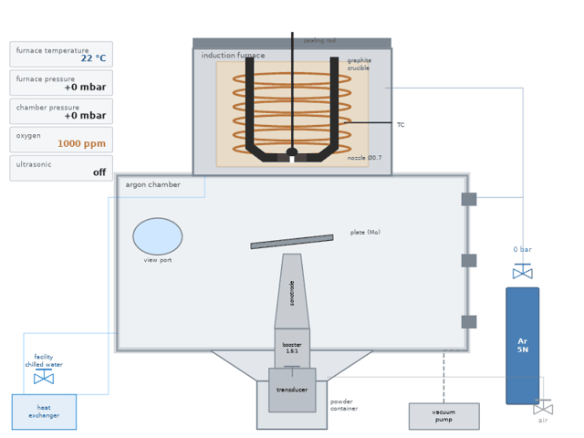
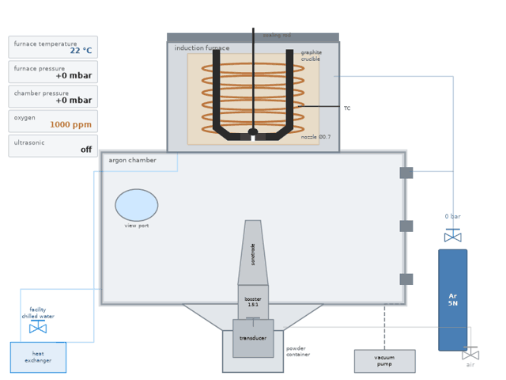
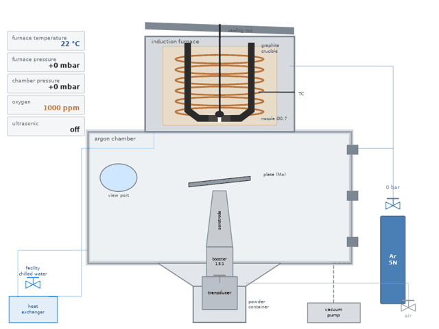
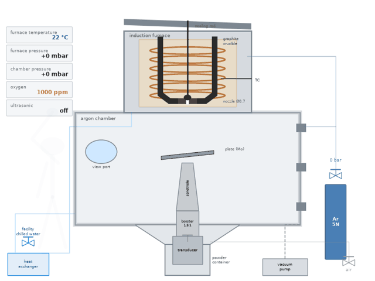
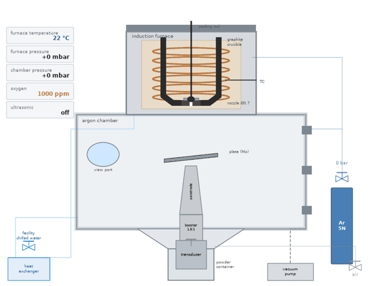
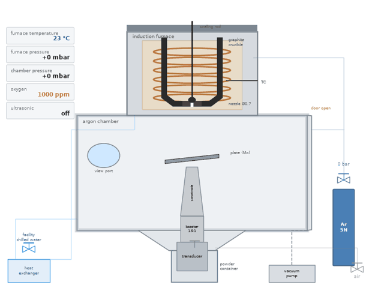

# Step visualizations

Schematic animations of one rePowder run, one GIF per core step of [`../sop.md`](../sop.md), in the spirit of the
assembly and machining clips in #245 and #232. They are drawn by [`atomizer_steps.py`](atomizer_steps.py) (matplotlib,
no CAD): a side section of the machine with the induction furnace, graphite crucible, sealing rod and nozzle on top, the
argon chamber with the ultrasonic stack and plate in the middle, the powder container below, utilities at the right and
the HMI readouts at the left. The readouts show the values used in training (see the SOP); they are illustrative, not a
recipe. Re-render everything with `python atomizer_steps.py` (about a minute per step on the CI runner).

| | |
| --- | --- |
| **1 · Utilities on** — chilled water barely open, heat exchanger, 8 bar air, 5N argon  | **2 · Ultrasonic stack** — transducer → booster → sonotrode → plate, 65 / 60 / 50 N·m, scan, wet test  |
| **3 · Furnace prep and loading** — nozzle white side up, rod before metal, insulation, charge, lid  | **3 (operator)** — the same step with a semi-transparent operator doing the motions  |
| **4 · Gas wash** — furnace ×5 then chamber, overpressure in the other vessel, washes at 250 and 500 °C  | **5 · Melt** — overshoot to drop the rods, hold ~800 °C, two minutes and no longer  |
| **6 · Pour** — vibration on → draining pressure → rod up → turbo; wetting, steering, the thin-stream trap  | **7 · End, cooldown, collect** — stop sequence, open ≤400 °C, vent, brush, container valve, bag + ID  |
| **8 · Clean and reset** — brushes/paper/IPA, plate rules, rod and nozzle, HEPA tray  | |

## The operator test

The request was to try a human-style operator doing the motions, semi-transparent so it does not hide the machine, and
to judge whether it helps. Step 3 exists both ways. Observations after rendering both:

- **Where the operator helps:** steps whose content is a *sequence of hand actions on parts* (loading: rod in, charge in,
  lid down). The figure's hand carrying the part makes the order and the "rod before any metal" rule legible at a glance,
  and the transparency (alpha 0.35) keeps the furnace internals readable behind it.
- **Where it does not:** steps whose content is *state changes read from gauges* (gas wash, melt, pour). There the
  operator would be standing still at the window; the readouts and the stream carry the information, and a figure adds
  clutter. Those steps were left without one.
- **Cringe check:** a stick figure with an articulated arm reads as a diagram, not as a person, so it avoids the uncanny
  feel of a rendered human. It is deliberately not a photo overlay. The arm is a two-link inverse-kinematics reach, so
  the motion is smooth rather than teleporting.
- **Verdict:** keep the operator for the loading step (and it would suit cleaning and container handling), skip it for the
  process-state steps. If a photo-realistic treatment is ever wanted, the better route is a semi-transparent *video* of the
  real operator composited over a still of the machine, cut from the training videos listed in
  [`../timestamps.md`](../timestamps.md).

## How it is built

`DEFAULT` holds every drawable state value (temperatures, pressures, which parts are installed, rod lift, melt fraction,
operator hand position, …). Each step is a list of `(seconds, target_state)` keyframes; numeric values are eased
between keyframes and discrete ones switch at the midpoint. `draw()` renders one frame from a state dict, so adding a
step is adding a keyframe list. `*_still.png` is the middle frame of each GIF, for READMEs and the tutorials.
