# 3-D step animations of the rePowder atomizer

CAD-based replacements for draft 1's flat matplotlib schematics (removed after review; they are in the git history at
`3803f3b`): the machine is modelled in CadQuery, tessellated
into PyVista and rendered off-screen, the same pipeline as the PiPER camera-mount (#239), OT-2 lid-mount and atomizer
charge (#222) renders. Parts move along their real assembly paths (the lid hinges, the door swings on its hinge with
the ultrasonic unit in it, the sealing rod lifts, the crucible screws down into the coil), the furnace and chamber are
cut open at the furnace axis so their insides show, and there is no operator figure: hands are implied by the parts
moving. Draft 1 tried a semi-transparent stick-figure operator on the loading step; in review it read as a cartoon
(an arm stretching across the machine misstates what an operator can reach), so it was dropped.

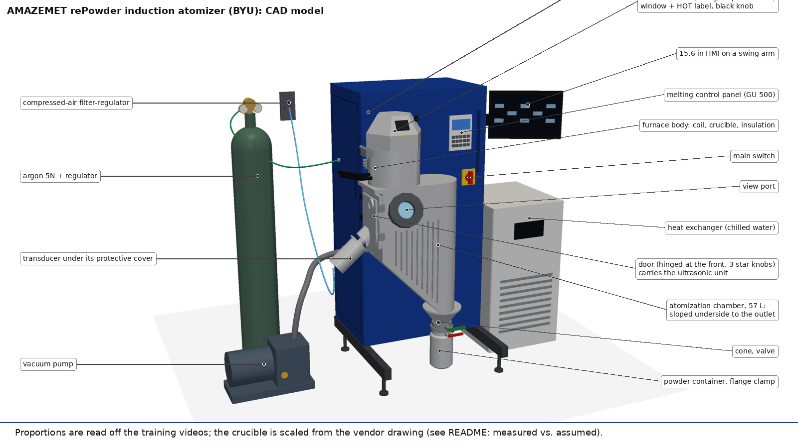

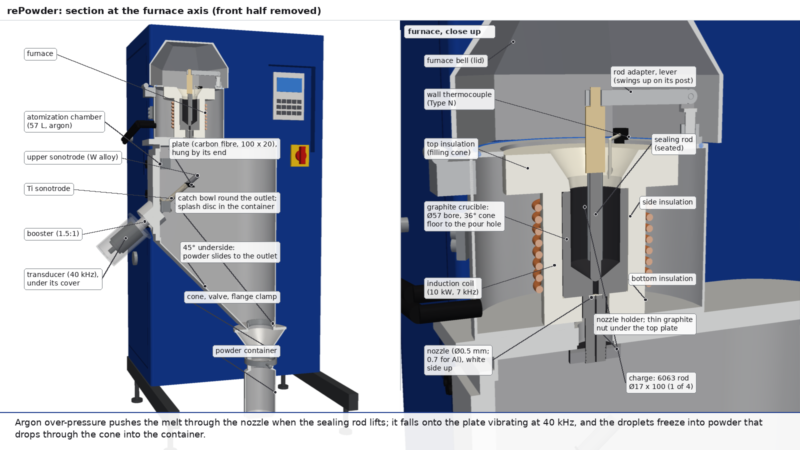

## Files

| File | What it is |
| --- | --- |
| [`model.py`](model.py) | The machine as named CadQuery parts with colours: cabinet, melting control panel, HMI, main switch; furnace body, faceted lid (window, HOT label, knob), coil, insulation (bottom, side, top/filling cone), graphite crucible with its cone floor and pour hole, nozzle (white side up) and holder, sealing rod, adapter, holder arm and lift post, wall thermocouple, the four charge rods; chamber, door with three clamps, view port, catch bowl, splash plate; ultrasonic stack (transducer, booster, sonotrode with KF50 flange, plate on its stud, protective cover); chute cone, valve, flange clamp, powder container; argon cylinder and regulator, vacuum pump, heat exchanger, air filter-regulator, and the utility lines. `meshes()` tessellates everything (whole, and halved at y = 0 with the cut faces tinted) and caches it in `.cache/`. |
| [`scene.py`](scene.py) | The `Scene` framework (after #239's `animate.py`): actors in groups that move together (groups can ride on other groups: the stack on the door, the rod on the arm), eased moves, opacity fades, colour and glow changes, camera moves, leader-line labels, gauge readouts, step label and wrapped caption. Each `step()` is one sub-step (one action, one caption) followed by a hold of at least 1 s; where particles, flow dots or the plate's vibration are running, the hold keeps them moving (`live=True`) instead of freezing the frame. Every frame is rendered once at 1280 × 720 and written to the MP4 (15 fps) and, every 1.5th frame, to the GIF (800 × 450, 10 fps, one palette, `gifsicle -O3 --lossy`). Text is drawn with PIL at each output's own size, so the GIF's text stays legible. |
| [`steps.py`](steps.py) | One animation per SOP step, under draft 1's step names so the tutorial build could switch over, plus `00_machine` (a tour) and `03b_chamber` (container, splash plate, door). |
| [`render.py`](render.py) | Hero stills at 1600 × 900: `out/machine.png` (labelled), `out/machine_clean.png` (no text; the machine in the right 60 %, artwork for title cards) and `out/section.png` (the column cut at the furnace axis, with the furnace close up). |
| `out/<name>.gif` | 800 × 450, 10 fps, ≤ 5 MB, for GitHub. |
| `out/mp4/<name>.mp4` | 1280 × 720, 15 fps, h264 yuv420p, no audio, for the narrated tutorials. Not committed (see `.gitignore`); regenerate with `steps.py`. |
| `out/<name>_still.png` | One representative 1280 × 720 frame. |
| `out/<name>.json` | `{name, fps, n_frames, size, substeps: [{label, caption, start_frame, end_frame}]}`: the MP4 frame range of every sub-step (motion plus its hold), for timing narration sentence by sentence. Every animation opens with 1 s of establishing view, counted in its first sub-step. |

## Running

```bash
export PIP_TIMEOUT=600 PIP_RETRIES=2
pip install cadquery pyvista                       # plus: apt-get install xvfb libgl1-mesa-dri gifsicle ffmpeg
xvfb-run -a -s "-screen 0 1920x1080x24" python render.py          # hero stills
xvfb-run -a -s "-screen 0 1920x1080x24" python steps.py           # every animation
xvfb-run -a -s "-screen 0 1920x1080x24" python steps.py 06_pour   # one (or several) by name
PREVIEW=1 xvfb-run -a -s "-screen 0 1920x1080x24" python steps.py 06_pour   # last frame of each sub-step only, as a contact sheet in /tmp
```

A frame takes about 0.25 s (software OpenGL, SSAA and depth peeling for the see-through parts), so an animation takes
two to three minutes. The first run builds the CadQuery model (about 15 s) and caches the meshes; editing `model.py`
invalidates the cache. When two renders run at once, give each its own display (`xvfb-run -n 201 …`, `-n 202 …`):
`-a` can hand both the same one.

## The animations

| | |
| --- | --- |
| **0 · Tour of the machine** — furnace, controls, chamber and door, ultrasonic unit, cone and container, utilities, then the cutaway 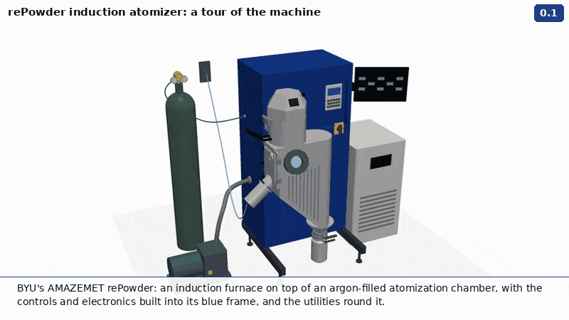 | **1 · Utilities on** — main switch, chilled water, heat exchanger, compressed air, argon; flow shown as dots along each line 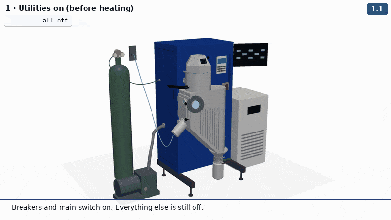 |
| **2 · Ultrasonic stack** — transducer → booster (65 N·m) → sonotrode (60 N·m) → into the door housing → plate (50 N·m) → scan → wet test → cover 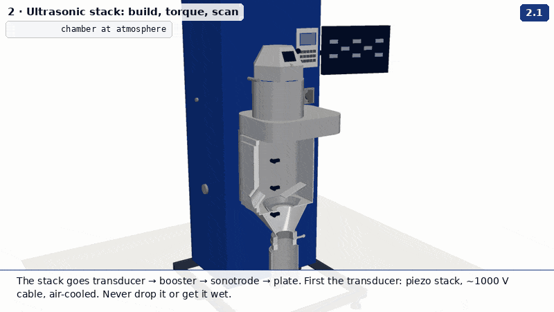 | **3 · Furnace prep and loading** — lid, nozzle white side up, crucible into the coil, insulation, thermocouple, sealing rod before metal, charge, lid 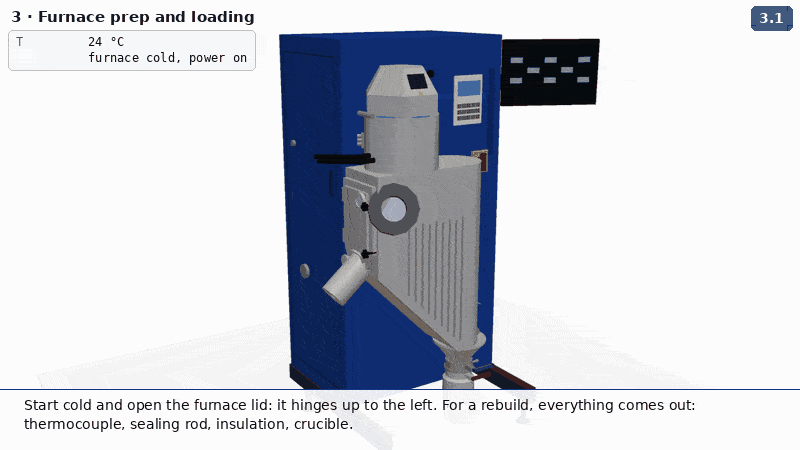 |
| **3b · Chamber** — container lifted and clamped, catch bowl and splash plate, door shut, three clamps 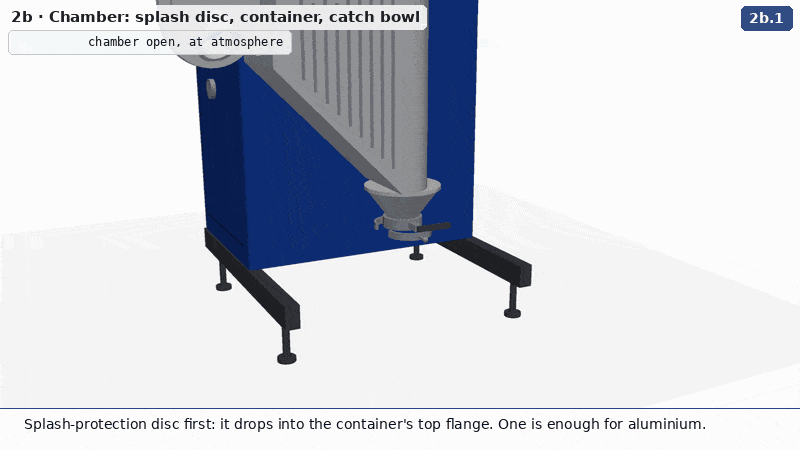 | **4 · Gas wash** — furnace pumped and back-filled while the chamber holds overpressure, then the chamber, then washes at 250 and 500 °C 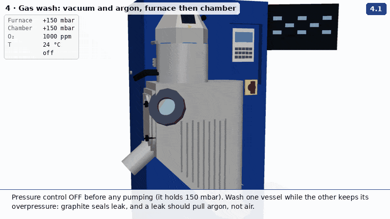 |
| **5 · Melt** — overshoot, melt cues, rods slump into a pool, setpoint down to ~800 °C, 2 min hold 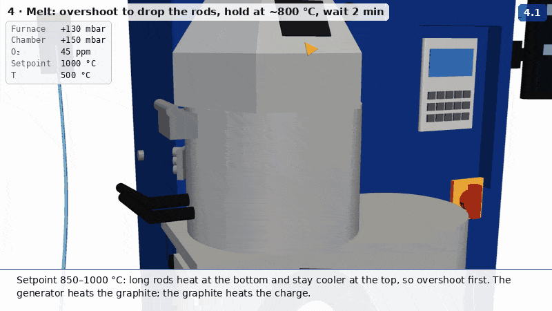 | **6 · Pour and atomize** — vibration, draining pressure, rod up, first drops bounce, turbo, spray off the plate, powder into the container 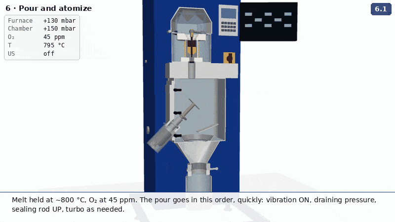 |
| **7 · End, cooldown, collect** — turbo, rod down, stops, cool to ≤400 °C, vent, door open, brush down, container off 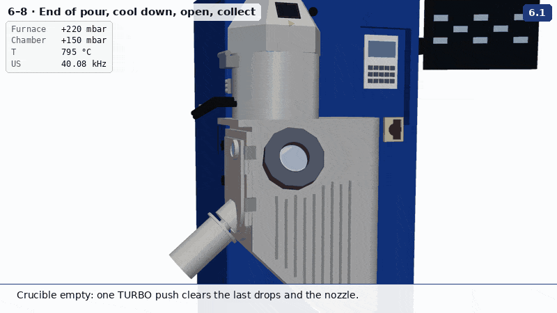 | **8 · Clean and reset** — brush, plate off, rod out, nozzle check, reassemble 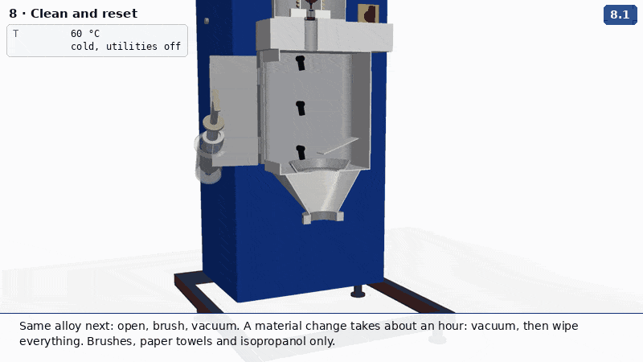 |

Heat is shown as colour, not physics: the charge goes grey → dull red → orange with the readout temperature, the coil
brightens while the generator runs, the melt is an emissive orange. The argon is a light-blue translucent volume that
fades out under vacuum. Droplets and powder are a small ballistic particle model in slow motion, kept to the back half
so they read against the cutaway. The plate's vibration is exaggerated (±1.2 mm) so it shows. Numbers in captions and
readouts are those used in training ([`../sop.md`](../sop.md)); they are illustrative, not a recipe.

## Measured vs. assumed

Nothing on this machine has been measured with a rule yet. What the geometry rests on:

| Part | Source | Status |
| --- | --- | --- |
| Crucible: Ø57.1 bore, 81 mm straight, 36° cone floor (20.5 mm), 9.1 mm wall, Ø6.9 pour hole; Ø12.6 ball-tipped sealing rod; adapter Ø21.7; holder arm 47 mm above the rim; coil r 47, Ø8 tube, 12.5 pitch | #222 `charge_cad.py`: Indutherm's GU500 section (Fig. 61) scaled to AMAZEMET's quoted 225 cm³; consistent with Bartosz's verbal 20 mm gap, 10–11 cm depth, 12 cm to the top of the insulation | Documented proportions, scaled: **estimate, measure** |
| Charge: 4 × Ø17 × 100 mm 6063 (≈245 g), placed clear of the adapter and arm | SOP limits (≤20 mm across, 250–300 g); #222's finding that a 3/4 in rod cannot pass the adapter straight down | Chosen to fit; not a recipe |
| Chamber 360 × 360 × 430 mm (57 L inside) | Chamber volume 57 L (vendor) | Volume documented; shape and proportions **assumed** from the videos |
| Footprint: feet at 714 × 600 mm; ~1.8 m tall | Facility guide (feet spacing; crate 1000 × 1010 × 1850 mm) | Feet documented; heights **assumed** |
| Ultrasonic stack: 40 kHz; plate 20 × 100 Ti; booster 1.5:1; torques 65 / 60 / 50 N·m | Quote, O&MM, SOP | Documented. Lengths are **assumed** (half-wave ~63 mm in Ti at 40 kHz); the 45° angle through the door is read off the side-view frames |
| Furnace body Ø270 × 195, faceted lid hinged on the left, window, HOT label, knob, blue O-ring | Training-video frames (`../keyframes`) | **Assumed** proportions |
| Insulation sizes, nozzle holder and nut | SOP order of parts (seal, bottom insulation, crucible, nut; side and top insulation; thermocouple) | Order documented; sizes **assumed** |
| Thermocouple route over the top insulation into the crucible wall | Photo of the open furnace (T5 76:16) and #222 §4.3 | **Assumed** route |
| Cabinet, panel, HMI, main switch, container, valves, cone, utilities and their hose routes | Video frames; the HMI is a 15.6 in Weintek cMT2166X | **Assumed**; the utility layout is schematic (the real lines enter the cabinet from the back) |

When anything is measured, change the constants at the top of `model.py`; every animation follows.

## Known issues

- The door is on the chamber's left wall with the stack at 45° through it, read off side-view frames. Check it against the
  machine.
- `02_stack` sub-step 2.4's caption says the door is locked open, but the animation builds the stack with the door closed
  and the chamber cut away.
- In `07_end_cooldown` 7.7 a few powder particles stay in mid-air after the container is carried off.
- No lettering on any part ("BLUE POWER", "GU 500 AMA"); the HMI screen is placeholder rectangles.
