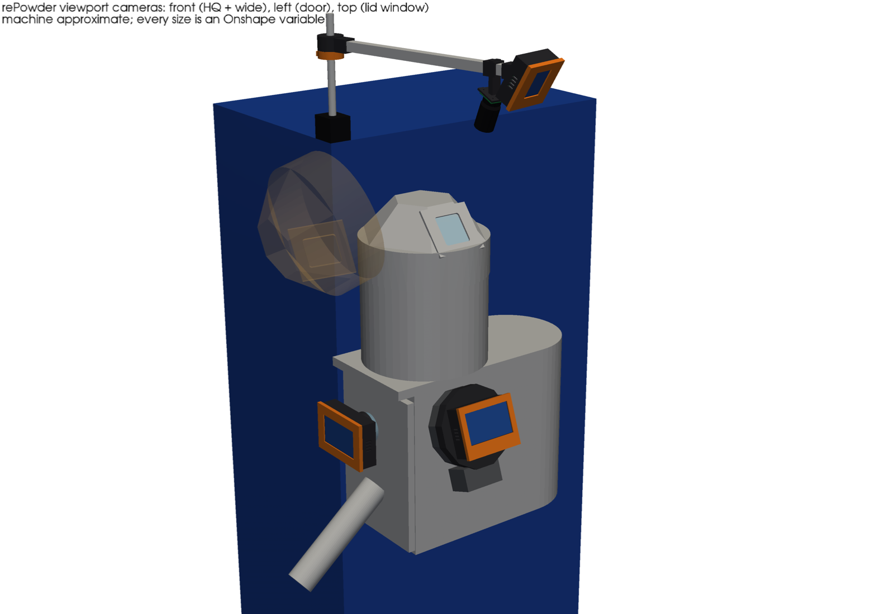
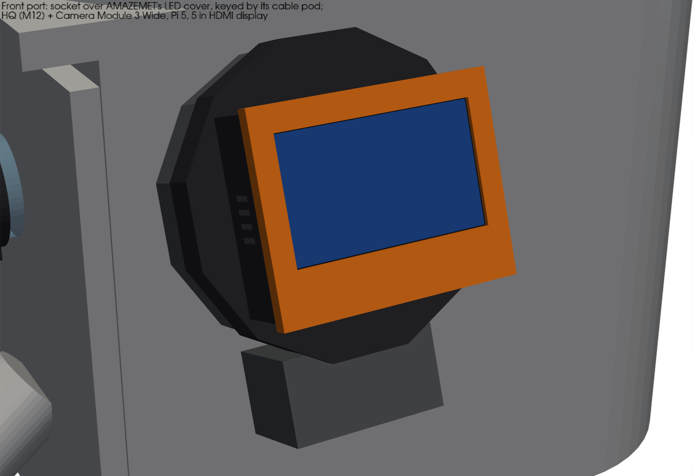
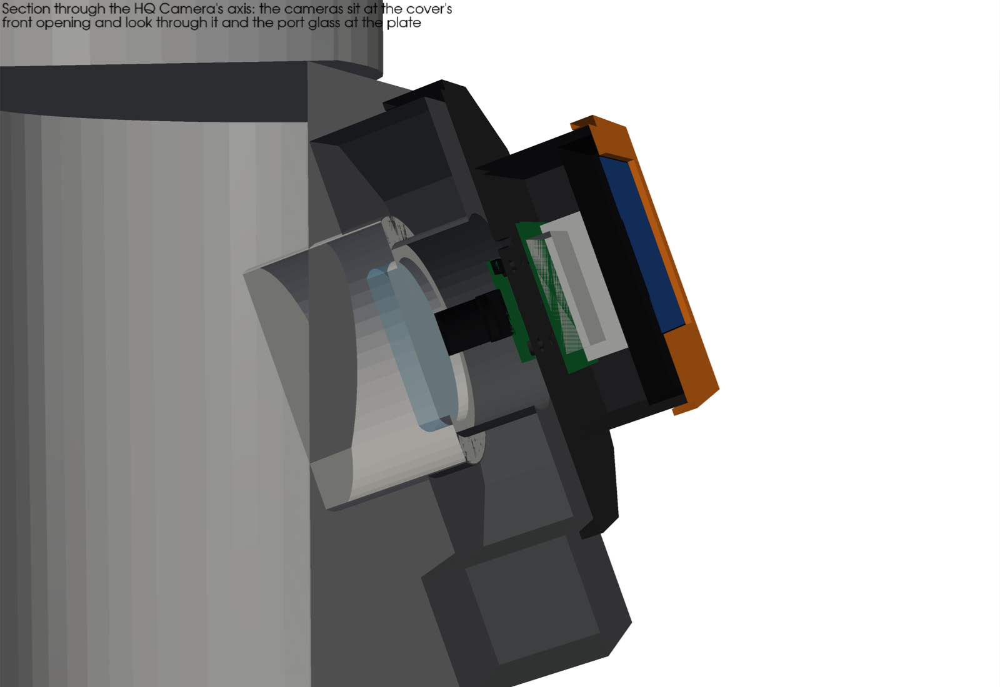
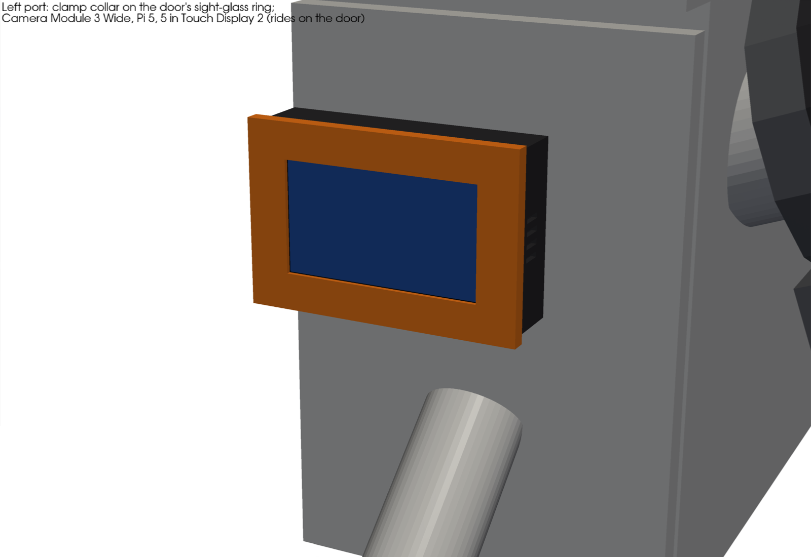
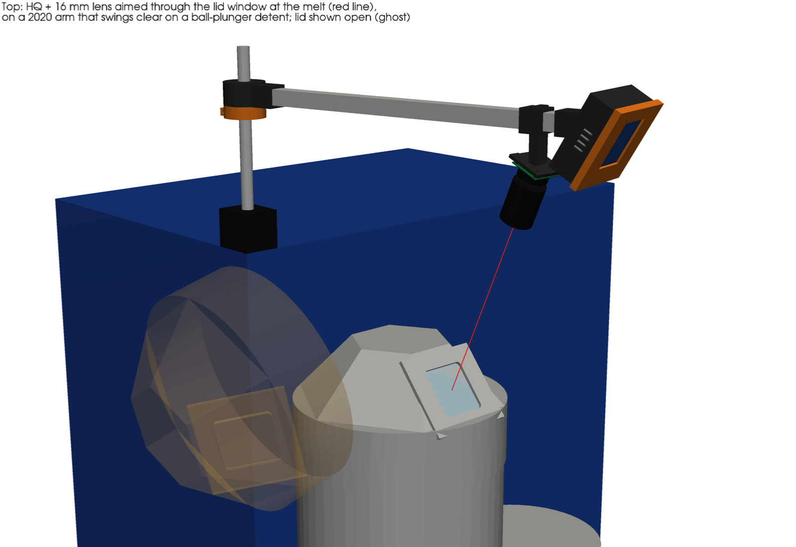
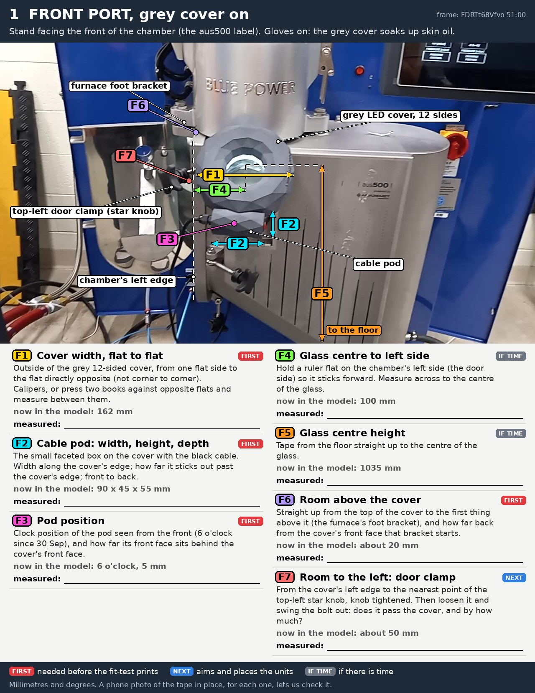
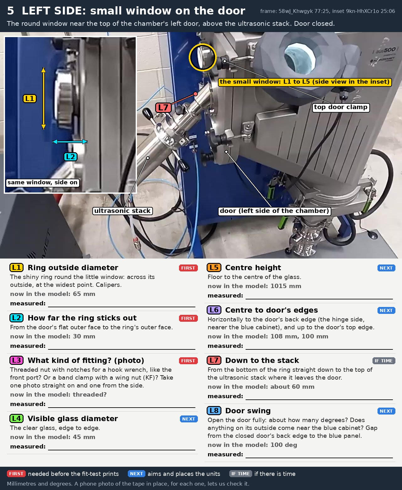

# rePowder viewport cameras

Three Raspberry Pi 5 camera units for the viewing windows of the AMAZEMET rePowder atomizer, each with its own small
display that shows the live picture next to the operator, as well as streaming it. Issue
[#198](https://github.com/vertical-cloud-lab/byu-vcl/issues/198); motivation in [#264](https://github.com/vertical-cloud-lab/byu-vcl/issues/264)
and [#261](https://github.com/vertical-cloud-lab/byu-vcl/issues/261): plate position is the hardest parameter to
control, and in the 6 October run the melt collected on the upper sonotrode for about three quarters of the run.

| Unit | Window | Cameras | Display | Attaches by |
|---|---|---|---|---|
| **Front** | the round view port on the chamber's front face (looks down at the plate) | HQ Camera (M12) + Camera Module 3 Wide | 5 in HDMI (both MIPI ports are taken by cameras) | a 12-sided socket that pushes onto AMAZEMET's LED cover, keyed by its cable pod, with a ball-plunger detent |
| **Left** | the small sight glass in the chamber door (side view of nozzle and plate) | Camera Module 3 Wide | 5 in Touch Display 2 (DSI) | a split clamp collar on the sight glass ring; rides on the door |
| **Top** | the glass-ceramic window on the furnace lid's front facet (the melt) | HQ Camera (C/CS) + 16 mm lens, hot mirror, ND | 2.8 in DSI | a 2020 extrusion arm on a post and magnetic base; swings clear for loading and clicks back onto a ball-plunger detent |

**Onshape:** [rePowder viewport cameras (byu-vcl #198)](https://cad.onshape.com/documents/f6b439dfa2a88fd1d41e85b7/w/30ec7826dedfab13d9c6d67b),
in the lab's vcl-shared folder. Every machine dimension that is a guess is a variable in its **Machine dimensions
(measure these)** tab, with where the number came from and how far off it may be. Change one there and everything
rebuilds. Nothing has been printed yet.

| Front unit | Section through the front port |
|---|---|
|  |  |

| Left unit | Top unit, with the line of sight through the lid window to the melt |
|---|---|
|  |  |

## What the videos showed

The machine was measured from 22 frames of the training videos (the stream-cam Pi's cache of 356 clips, plus two new
40 s windows fetched there; YouTube won't serve a CI runner). The scale comes from the furnace body, taken as Ø270
(#255's estimate), checked against the Ø57.1 crucible bore, and corrected for perspective. Expect ±15–25 %. The
frames, an annotated pair and the full table are in [`measure/`](measure/measurements.md). Three findings changed the
design, and two of them correct #255's model:

- **The dark-grey 12-sided ring on the front port is AMAZEMET's LED illuminator cover**, not a phone holder. It has
  "AMAZEMET" embossed on it, a white LED ring round the glass, and a faceted cable pod fixed to it. It pushes on by hand
  over the port's polished threaded nut, the part the hook wrench turns ([bare port, T4 7:58](https://www.youtube.com/embed/1F9_4ccwhss?start=478)).
  The cover turns freely: its pod was at 3 o'clock on 29 September and has been at 6 o'clock since. No phone holder
  shows up in the cached frames from 2 or 6 October.
- **The door is hinged on its back edge**, not the front (all three swing bolts anchor at the front; [T5 24:54](https://www.youtube.com/embed/58wJ_Khwgyk?start=1494)).
- **The lid window is on the lid's front facet, at about 50° from horizontal**, not on a flat top. It is a ≈60 × 64 mm
  glass-ceramic pane in a polished plate with 8 screws, centre ≈(y −94, z 1455). From there, the line to the melt runs
  about 66° below horizontal, so the "above" camera sits in front of and above the lid, on that line.

| | Front port | Left sight glass | Lid window |
|---|---|---|---|
| Glass | Ø63 ±12 | Ø45 ±12 | 60 × 64 ±12 |
| Around it | threaded nut Ø95 ±15; LED cover 162 across flats ±25, Ø75 opening, face ≈75 mm out (weak) | ring Ø65 ±15, 30 ±10 proud of the door | plate ≈112 × 105, 4 mm proud; facet ≈50° ±15 |
| Centre | x −15 ±25, z 1035 ±40 | y +20 ±50, z 1015 ±50 | x 0, z 1455 ±60 |
| Must clear | furnace foot bracket ≈20 mm above the cover; door swing bolt ≈50 mm to its left | the stack (≈130 mm below); the blue frame behind the hinge | the lid's swing (up and over to the left, ≈105°) |

The rePowder reference summary from #232 (`repowder-reference.zip`) agrees where it overlaps: module envelope
1000 × 800 × 1600 mm, feet at 714 × 600, 57 L chamber, HMI 400 × 263 mm, and the furnace's "bell window frame / glass"
(Indutherm C015/C016). Bartosz: the view ports are hardened glass, the furnace window glass-ceramic
([T5 25:10](https://www.youtube.com/embed/58wJ_Khwgyk?start=1510)). It does not dimension any window.

### What to measure (for @ronnie-guymon)

**[`measure/guide/HOW-TO-MEASURE.md`](measure/guide/HOW-TO-MEASURE.md)** has eight sheets, one per area of the
machine, with each measurement lettered on a photo. Each says where the tape goes, the tool, and the value the model
has now, with a blank for the measured one. They are also a [PDF for printing](measure/guide/rePowder-measuring-guide.pdf).
The 17 marked FIRST are the ones the fit-test prints need. [`field_sheet.csv`](measure/guide/field_sheet.csv) maps
each letter to the Onshape variable it replaces.

| | |
|---|---|
|  |  |

## Design

### Front port: HQ + wide, on AMAZEMET's LED cover

- **It clips onto the LED cover rather than replacing it.** That keeps AMAZEMET's lighting, which the cameras need,
  and never loads the glass nut. A 12-sided socket slides 15 mm over the cover's rim. The facets stop it turning.
  A notch takes the cable pod, so the unit goes on one way only. An M6 ball plunger on the right-hand flat holds it.
  The socket is closed by a 1.6 mm lid so room light can't reach the glass from behind the display.
- **Repeatability comes from the port.** The cover is concentric with the nut, and the socket with the cover, so
  the cameras' pointing doesn't depend on how the unit was put on. The cover can still turn on the nut. With the pod
  at 6 o'clock, as it has been since 30 September, the unit returns to the same place. If the pod moves, the
  picture rotates by a multiple of 30°.
- **Two cameras side by side at the cover's Ø75 opening**: the HQ Camera's lens 15 mm left of the axis and the
  Camera Module 3 Wide's 18.5 mm right. Their boards are 2 mm apart. The HQ is the **M12** version so that its lens
  (a 16 mm M12, about Ø16) fits beside the wide camera. With a 16 mm lens it sees about 65 × 49 mm at the plate, about
  165 mm away: the impact zone. The wide camera sees nozzle, plate and chamber.
  - On its outer side, the wide camera looks past the edge of the Ø63 glass at about 32°, against the ±51° it could
    use, so about a quarter of its picture, on that side, will show the edge of the port. That figure rests on the
    weakest number here, how deep the glass sits behind the cover face. A standard Camera Module 3 (±33°) would just
    about fit inside the port.
- **Display: 5 in HDMI** (Elecrow, 800 × 480, outline 121 × 95 mm). It faces out along the port axis, so it tilts up
  about 20° towards a standing operator. Both cameras use the Pi 5's two MIPI ports, so this one can't be DSI. It
  takes 5 V from a Pi USB port.

### Left port: one camera on the door

A split collar clamps the sight glass ring with one M4 screw. A Camera Module 3 Wide sits on its axis, with the Pi
behind it and a 5 in Touch Display 2 facing the operator. This is the side view of the nozzle and the plate: the
one that shows whether the stream lands on the plate or on the sonotrode, which was the 6 October failure. It goes
where the operator stands to adjust the stack, so it has the biggest picture (active area 110 × 62 mm). The unit
rides on the door. Its nearest point to the stack is 60 mm. In the model it ends about 30 mm short of the hinge
line, but the swing with the door open hasn't been checked against the blue frame (`showOpenDoor` in the feature
shows it).

### Top: the lid window, on a swing arm

- **Where the camera sits.** The window looks into a Ø57, 100 mm deep crucible with the sealing rod down its middle.
  You only see the melt looking down the line through the window to the crucible axis, about 66° below horizontal.
  The HQ Camera sits on that line, its lens 250 mm from the window (`cam_dist`). It aims at a point on the furnace
  axis at `aim_z` (the crucible datum plus about 20 mm of melt).
  - With the 16 mm lens it sees about 190 mm across at the melt. The lab's 8–50 mm zoom, at 35–50 mm, would fill the
    frame with the crucible.
- **Heat.** The furnace runs to 1300 °C, and Bartosz says it is too bright to watch by eye at that temperature
  ([T5 54:24](https://www.youtube.com/embed/58wJ_Khwgyk?start=3264)). The team has felt heat through the window
  ([Oct 2, 24:18](https://www.youtube.com/embed/of5-LhkX_VQ?start=1458)). So the lens gets a hot mirror and a
  variable ND. The camera stays 250 mm away and in front of the lid's edge, mostly out of the hot air rising off it.
- **The arm.**
  - A 5/8 in post stands on a switchable magnetic base on top of the blue frame (painted steel).
  - A printed hub turns on the post and carries a 2020 extrusion (about 470 mm, cut from a 500 mm length) out over the
    furnace to the camera pod.
  - A detent collar is clamped to the post under the hub. Its two dimples, "working" and "parked" (90° away), take an
    M6 ball plunger in the hub. Swing the arm clear to load the crucible, and it clicks back to the same place.
  - The arm runs at about z 1.8 m. The unit stays 152 mm clear of the closed lid and 118 mm clear of the fully open one.
- **The display box sits on the arm's tip,** facing the operator and tilted down 30°. It holds the Pi and a 2.8 in
  DSI display.

### Displays, and showing the feed as well as streaming it

| Unit | Display | Why that size |
|---|---|---|
| Front | Elecrow 5 in HDMI, 800 × 480 (outline 121 × 95, active 108 × 65) | Two feeds side by side; about the cover's size, so it adds nothing to the unit's outline; HDMI because both MIPI ports carry cameras |
| Left | Raspberry Pi Touch Display 2, 5 in, 720 × 1280 (outline 143.5 × 91.5, active 110.4 × 62.1) | The plate-position view, beside the operator's hands at the stack; official, Pi 5 cable in the box |
| Top | Waveshare 2.8 in DSI, 480 × 640 (active 43 × 58; outline not published as text, 62 × 86 assumed) | A glance at whether it has melted, from a box at the end of an arm |

The display shows the camera picture next to the window. The livestream to YouTube keeps running in parallel. This
is the single-process approach that streamingLambda's prototypes found works best ([streamingLambda#6](https://github.com/vertical-cloud-lab/streamingLambda/issues/6),
[borysgroup/streamingLambda#10](https://github.com/borysgroup/streamingLambda/pull/10), option A). One picamera2
process per camera configures a `main` stream for the YouTube encode and a `lores` stream for stills. The `lores`
frames can go to the display as well, with picamera2's DRM preview or a small full-screen viewer.

On the front unit, one process has to show both cameras' `lores` frames side by side, because the DRM preview only
shows one. The Pi 5 has no hardware H.264 encoder, so two YouTube streams plus the preview all run on the CPU. Option
A cost about one point of CPU over production on a Zero 2 W, so a 4 GB Pi 5 should have room. That hasn't been tested
here.

## The Onshape model

| Tab | What it is |
|---|---|
| **Viewport cameras** | The Part Studio: four custom features. *rePowder context (approximate)* is the machine round the windows, with the lid shown open as a ghost. Then *Front port viewfinder*, *Left port viewfinder* and *Top window camera (swing arm)*. Printed parts are named `FRONT …`, `LEFT …`, `TOP …` and end in "(print)"; bought parts start "(bought)"; machine parts "(machine)" |
| **Machine dimensions (measure these)** | Variable Studio: the 57 machine guesses. Each has its source (frame and time, or #255's model) and ± in its description. It is set to insert itself into every Part Studio of the document |
| **viewport_mounts.fs** | The FeatureScript behind the four features ([`onshape/viewport_mounts.fs`](onshape/viewport_mounts.fs)) |

- **To correct a dimension,** open *Machine dimensions (measure these)* and change the value. Every feature that
  uses it rebuilds.
- **Design choices** live in each feature's dialog: fits, walls, display outlines, lens sizes, camera offsets, socket
  length, arm hang, detent angle, display tilt. They are only defaults, not measurements.
  - The dialog also shows each machine dimension as `#name`. Change those in the Variable Studio, not in the dialog.
- **Fit checks:** the context feature can show the lid open (on by default) and the door open. The left unit's
  feature can show it on the open door, and the top unit's can show the arm parked.

The model was built entirely over the REST API, with no browser.
[`onshape/build.py`](onshape/build.py) writes the variables ([`variables.py`](onshape/variables.py)), uploads the
FeatureScript and adds or updates the four features. [`export.py`](onshape/export.py) exports the STEP and shaded
views, and [`evalfs.py`](onshape/evalfs.py) evaluates a FeatureScript snippet in the Part Studio.

The whole job took 50 API calls, out of the company's 2,500 a year. They are logged, without bodies, in
[`onshape/evidence/calls.jsonl`](onshape/evidence/calls.jsonl).

Two things worth knowing if you script Onshape:

- **FeatureScript won't let you go back to an Id prefix once you've used a sibling.** For example, `id + "sock" +
  "add" + …`, then `… "cut" …`, then `… "add" …` again fails. The error is a bare "Execution error". Build every
  `add` before every `cut`.
- **Errors inside a custom feature don't come back over the API.** All you get is the feature's status. A `DEBUG`
  switch in the FeatureScript catches the error and stores it, and the last step reached, as variables (`err_*`,
  `step_*`), which `evalfs.py` reads back. It is off now.

## Checks

[`cad/check.py`](cad/check.py) reads Onshape's own STEP export ([`exports/onshape_partstudio.step`](exports/onshape_partstudio.step)),
with part names, and writes [`exports/checks.json`](exports/checks.json) and the STLs in [`exports/stl/`](exports/stl/).
[`cad/render.py`](cad/render.py) makes the renders.

- **Interference: none.** Every printed part was checked against every machine part, every bought part and the
  other printed parts.
- **Clearances:**
  - front unit's top: 5.9 mm above the LED cover's top (the foot bracket is ≈20 mm above it);
  - top unit: 152 mm from the closed lid, 118 mm from the fully open one;
  - left unit: 60 mm from the stack.

| Printed part | Bounding box (mm) | cm³ | g (PETG) |
|---|---|---|---|
| FRONT socket + tray | 177 × 109 × 161 (as installed) | 153 | 195 |
| FRONT face plate | 134 × 45 × 104 | 25 | 32 |
| LEFT collar + tray | 67 × 150 × 98 | 137 | 173 |
| LEFT face plate | 8 × 156 × 104 | 30 | 38 |
| TOP hub | 54 × 84 × 30 | 72 | 92 |
| TOP detent collar | 54 × 64 × 16 | 33 | 42 |
| TOP camera pod | 46 × 44 × 77 | 27 | 34 |
| TOP display box | 111 × 104 × 100 | 88 | 112 |
| TOP face plate | 111 × 77 × 90 | 24 | 31 |

That is 589 cm³, or about 750 g of PETG. Everything fits the H2D's bed. The front socket (169 mm across flats) also
just fits an A1 mini. Use black PETG for the front and left units, and ASA (or the PA6-CF in the BOM) for the top
pod and display box above the furnace.

## Bill of materials

The priced list is in [`shopping/shopping_2026-10-07.md`](shopping/shopping_2026-10-07.md) and
[`.json`](shopping/shopping_2026-10-07.json). Amazon was searched through the CubXL Pi's campus connection, capped at
300 kB/s, with no bot checks. Raspberry Pi parts are from PiShop.us, where they cost much less than from Amazon
resellers (the HQ Camera $55 against $99.99). Prices are as of 7 October 2026, before tax and shipping.

| | Cost |
|---|---|
| Each station: Pi 5 4 GB, Active Cooler, 27 W PSU, 32 GB card | $153.85 |
| Front: + HQ Camera M12, 16 mm M12 lens, Camera Module 3 Wide, 2 cables, 5 in HDMI, micro-HDMI lead | $334.20 |
| Left: + Camera Module 3 Wide, cable, 5 in Touch Display 2 | $251.25 |
| Top: + HQ Camera, 16 mm C lens, hot mirror, variable ND, shade-5 plate, 500 mm cable, 2.8 in DSI, magnetic base, 5/8 in bar, 2020 extrusion, M5 T-nuts and screws, 5/8 in shaft collars | $484.85 |
| Shared: inserts, screws, ball plungers, dowels, flocking, VHB, PETG, ASA, PA6-CF | $147.31 |
| **All three** | **$1,217.61** |

- **Pi 5 prices have roughly doubled since late 2025.** The 4 GB board is $110 at list. Three 2 GB boards would
  save $97.50.
- **The M12 HQ Camera ships without a lens.** No seller gives the M12 lenses' minimum focus distance. Check that the
  16 mm focuses at about 165 mm before buying more.
- **Check the 16 mm C lens's front thread (37 mm?) before buying filters.** Each source gives a different size, and
  the 8–50 mm zoom's is said to be 37.5 mm.

## Assembly, briefly

- **Inserts.** Heat-set M2.5 inserts go into the Pi standoffs (Ø3.6 holes).
- **Cameras** hang under each back plate on four bosses. Screw them from inside the tray: M2.5 for the HQ, M2 for the
  Camera Module 3, with nuts on the lens side. Ribbons go up through the slots beside the bosses.
- **Front unit.** Screw the M6 ball plunger in until the socket goes onto the cover with a firm push, and comes off
  with one. Then fit the face plate over the display. It is a push fit with a skirt; add two small VHB pads if it
  is loose.
- **Top unit.**
  1. Tap one end of the 5/8 in bar M8 and screw it into the magnetic base.
  2. Clamp the detent collar to the post, M4, with the "working" dimple under the camera's position.
  3. Fit the hub with its M6 plunger, then a shaft collar above the hub.
  4. Slide the extrusion into the hub's socket, the camera pod's saddle and the display box's socket. Each has one
     M5 hole on top, for an M5 × 10 into a drop-in T-nut in the extrusion's top slot.
  5. Aim by loosening the collar, not by bending anything.
- **Image orientation** depends on how each ribbon is routed. Flip it in software (`--rotation 180` or picamera2's
  `Transform`).

## Not done yet

- **Nothing is printed or bench-tested,** including the fits.
  - The socket and collar fits use 0.4 mm a side on dimensions that are themselves ±15–25 %. Print a 5 mm ring of
    the socket and of the collar first, and check them on the machine.
- **Every machine dimension is a frame estimate** until it is measured. The weakest are the front port's tilt and
  stand-off, the glass depth inside the LED cover, the lid facet angle, and whether the door's sight glass is a KF
  flange.
- **The left unit swinging with the door** hasn't been checked against the blue frame. The model has no star knobs,
  swing bolts or furnace foot bracket, only the clearances quoted above.
- **The display outlines** are from the vendors' stated sizes. The 2.8 in DSI's outline is assumed. The face plates
  clamp the displays by their edges, and no display's mounting holes are modelled. Check each display's drawing
  before printing the face plate.
- **No software has been written.** The display and stream approach above is from the streamingLambda prototypes.
- **Not sliced.** The STLs are in machine orientation, not print orientation.
- **Bartosz's laser-fixture idea from #264** (a laser in the sealing-pin seat, shining through the nozzle onto the
  plate during setup) isn't part of this. It would complement the left camera: the laser sets the plate before the
  run, the camera confirms it during the run.
