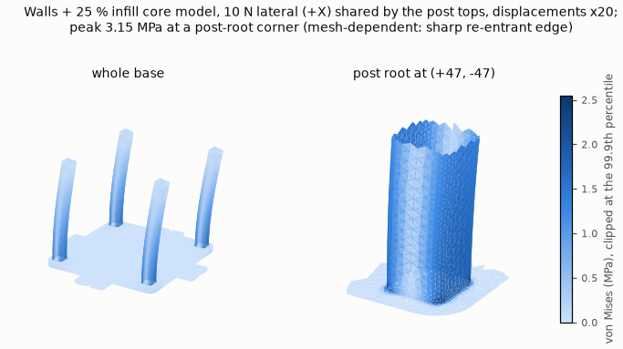

# Printing remotely on the lab's Bambu printers

A runbook for an agent (or a person) sending a print to the lab's **A1 mini** from CI. It is
written to be followed step by step, and most of it applies to the H2D too. Two scripts do
the work:

- [`bambu_lan.py`](bambu_lan.py) is **read-only**. It reaches the printer, checks it is the
  right one and fit to print, grabs a camera frame, lists the SD card, and checks a sliced
  3MF against the printer.
- [`bambu_print.py`](bambu_print.py) **changes printer state**: upload, start, pause, resume
  and stop. Its `watch` subcommand only reads.

> **Status (2026-09-27, 06:10 UTC).**
> - **Verified on the A1 mini:** read-only access through a Pi, end to end: status, camera,
>   SD card listing and TLS identity (§2). **Upload works too**: 2.44 MB with the MD5 read back.
> - **`start` over LAN is refused.** The first real one (plate 4, the fit coupon) got HMS
>   `0500-0500-0001-0007`, "MQTT Command verification failed". Nothing moved. See §2,
>   "Firmware and authorisation": with the printer on Bambu's cloud, it accepts control commands
>   only from Bambu's own apps.
> - **Bambu Studio on the runner works.** Logged in to the lab's Bambu account, it printed the
>   fit coupon at 05:57 UTC ([`studio/`](studio/README.md),
>   [evidence](evidence/2026-09-27/fit-coupon-studio/)). That is route 3 in §2. Each session
>   needs a person to pass on Bambu's e-mailed login code, and the GUI resets a CLI project's
>   changed settings, so read [`studio/README.md`](studio/README.md) first.
> - **Second print from Studio (2026-09-29):** the lid mount's drill template, plate 3. It
>   was sent at 18:44:46 UTC and finished at 19:37:42 with no error or HMS alert. The
>   [evidence](evidence/2026-09-29/drill-template-studio/) includes the file the printer ran,
>   its metadata and a [recording](https://www.youtube.com/watch?v=M6w4-SVw9tg).
> - **Third print from Studio (2026-10-01):** plate 2, the deck with its Pi 5 standoffs and
>   shims. It was sent at 00:32:54 UTC and finished at 01:43:12, 70 min later against Bambu's
>   69 min, with no error or HMS alert. It was asked for on PR #84, so its
>   [evidence](evidence/2026-10-01/deck-studio/) was first committed there and copied here.
>   [Recording](https://www.youtube.com/watch?v=1gatV4-JgIA).
> - **Fourth print from Studio (2026-10-02):** plate 1, the base with its four posts, in
>   black PLA. It was sent at 18:56:41 UTC and finished at 21:22:39, 146.0 min later against
>   Studio's 2 h 30 min, with no error or HMS alert. [Evidence](evidence/2026-10-02/base-studio/README.md),
>   [recording](https://www.youtube.com/watch?v=inpbxJkVpe8). All four of the lid mount's plates are now printed.
>   The deck's camera bosses lost 2.5 mm on 2026-10-08
>   ([why](../ot2-overhead-camera/lid-mount/README.md#the-camera-bosses-2026-10-08)), and the
>   new deck was printed that day on the H2D (next point).
> - **Fifth print, the first on the H2D (2026-10-08):** the new deck, in black PLA Basic. It was
>   sent from Studio at 19:57:42 UTC and finished at about 20:42:17, 44.6 min later against
>   Studio's 41 min, with no HMS alert. [Evidence](evidence/2026-10-08/deck-h2d-studio/README.md),
>   [recording](https://www.youtube.com/watch?v=nrGHKqr7TO0). Two things differ from the A1
>   mini, both in §11: the H2D refused `H2D_ACCESS_CODE` over LAN, so it was checked and watched
>   from Studio's Device page, and its nozzles are 0.6 mm.
> - **Its print command** is the payload that started this printer's first programmatic
>   print from a laptop (powder-doser PR #23, 2026-07-27), when the printer was set up for
>   Developer Mode.

## The rules

These come from what went wrong elsewhere, as referenced below. None of them is optional.

1. **A named person says go, every time, after seeing the pre-flight frame.** They confirm
   four things:
   - the plate is empty;
   - it is the plate type the file was sliced for;
   - the bed has room to travel front and back (the A1 mini moves its bed in Y; the
     "Safety Zone" label on its base shows the space it needs);
   - someone can get to the printer while it runs.

   `start` refuses without `--confirmed-by <who>`. This is the agreed rule until a hardware
   power interlock *and* an automatic camera check both exist
   ([powder-doser#23](https://github.com/vertical-cloud-lab/powder-doser/pull/23#issuecomment-5245817304)).
   On the X1E, the rule was ["have a look at the print chamber to make sure nothing is in it
   first"](https://github.com/AccelerationConsortium/ac-dev-lab/issues/15#issuecomment-2436362366).
2. **Only print a Bambu-sliced 3MF made for this printer, nozzle, plate and filament.**
   `preflight --3mf` checks this. Two "ghost prints" on this A1 mini came from files that were
   wrong in ways the printer never reported (§6).
3. **Only start on a printer that is idle, with no `print_error` and no HMS alert.** A latched
   error is cleared by a person at the touchscreen, not over MQTT.
4. **Watch the start and the first layers frame by frame, then keep watching** (§4). **Pause**
   if unsure; **stop** if something is wrong. A failed print costs filament. A print left to
   fail costs more.
5. **Print in working hours, with someone around.** After hours was "at your own risk" in the
   [ac-dev-lab A1 mini work](https://github.com/AccelerationConsortium/ac-dev-lab/issues/158#issuecomment-2686413184).
   The [lab SOP](../SOP/3d-printing-sop.md) doesn't allow long unattended prints without its
   remote-monitoring rule.
6. **Don't use MQTT for anything else:** no firmware updates, calibration runs, `gcode_line`
   motion or temperature changes. Don't loosen `watch`'s limits mid-print. Don't delete other
   people's files from the SD card.
7. **Know the session's clock** (§4.1). A CI session ends at 180 min, and plate 1 of the lid
   mount takes about 152. If the print can outlast the session, say so and arrange a human
   hand-off **before** starting.
8. **Record the session, and keep what reproduces the print**
   ([sgbaird, 2026-09-29](https://github.com/vertical-cloud-lab/byu-vcl/pull/234#issuecomment-5897039962)):
   - **The recording.** Start recording the screen before Studio opens, and keep it running
     to the end of the print ([`studio/README.md`](studio/README.md#recording-and-keeping-the-sent-file)).
     Cut out the login, where the e-mail address shows. Upload the video unlisted to the
     BYU VCL channel, with a link to the thread in its description, and post the video's
     link in the thread.
   - **The file.** Commit the exact file that was sent, next to the evidence. In Studio that's
     *File → Export → Export plate sliced file*.
   - **The metadata.** Commit a metadata JSON with it. It should record:
     - the source project and its commit;
     - the settings changed in the GUI;
     - the Send options;
     - Bambu's estimates;
     - the timeline;
     - who gave the go.

## 1. Reaching a printer

**The route.**
- The printers are on the lab LAN (the byu-devices Wi-Fi), not the tailnet, so everything
  goes through a Pi on that LAN.
- On 2026-09-27, all three Pis the CI runner can reach connected to the A1 mini on 8883
  (MQTT), 990 (FTPS) and 6000 (camera). They are `CUBXL_PI`, `RPI_STREAM_CAM` and
  `OT2_STREAM_CAM`. Port 322 (RTSP, the H2D's camera) is closed on the A1 mini, as expected.
- The default is `--via CUBXL_PI`, the idle Pi 5.
- The Zero 2 W (`OT2_STREAM_CAM`) has 415 MB of RAM and a live stream, so avoid it.

**How the scripts connect.**
- MQTT and the camera go through `ssh -L` forwards. Each FTPS connection, the control channel
  and every passive data channel, is opened from the Pi with `ssh -W`.
- TLS runs from the runner to the printer, and the Pi relays bytes only. So the access code
  never reaches the Pi, and nothing is installed on it.
- The scripts only ever open the printer's own ports. Unlike the SOCKS tunnel used for
  Onshape, nothing else is proxied.

**Credentials.**
- They come from `A1_MINI_IP`, `A1_MINI_ACCESS_CODE` and `A1_MINI_SERIAL` (`H2D_*` for the
  H2D), with `--printer A1_MINI`.
- The scripts never print them, and they redact them from every file they write.
- Install with `pip install -r requirements.txt` (paho-mqtt, Pillow, cryptography).

**Identity.**
- The printer's certificate is self-signed by "BBL CA", with CN = serial.
- `bambu_lan.py` doesn't validate the chain. It checks the CN against `A1_MINI_SERIAL`, which
  catches the wrong printer or a changed IP.

**Sharing.** The camera stream may serve only one client at a time, and the printer's MQTT
broker only a few. A failed frame may just mean someone is watching in Bambu Handy or Studio.
Bambu Studio and these scripts can drive the A1 mini side by side
([powder-doser#23](https://github.com/vertical-cloud-lab/powder-doser/pull/23#issuecomment-5124397504)).

## 2. Pre-flight

```bash
python bambu_lan.py preflight --printer A1_MINI --via CUBXL_PI \
    --3mf ../ot2-overhead-camera/lid-mount/slice/lid_mount_A1mini_PLA.3mf --plate 1 --out preflight
```

The script sends two requests, `pushall` and `get_version`. Both only make the printer send
data, and frequent `pushall` is known to make the A1/P1 series lag. It then grabs one
camera frame and writes a redacted JSON with a verdict:
- **NO-GO:** a check failed. Don't print.
- **HUMAN-DECISION:** only warnings remain. Someone has to look.
- **GO:** everything passed. It can't happen while the plate check is manual, so every print
  needs a person.

| Check | Why |
|---|---|
| TLS CN = serial | Catches the wrong printer, e.g. the H2D's IP in the A1 mini's variable |
| idle (`IDLE`/`FINISH`/`FAILED`), `print_error` 0, no HMS | Old errors stay latched and are resent to every new client ([powder-doser#23](https://github.com/vertical-cloud-lab/powder-doser/pull/23#issuecomment-5096456222)) |
| heaters off; nozzle 5–60 °C, bed 5–45 °C | Nothing heating unexpectedly. A thermistor fault reads far outside these ranges |
| SD card present | The print runs from it |
| plate G-code MD5 = the 3MF's stored MD5 | The file isn't truncated or edited |
| sliced for *Bambu Lab A1 mini*, nozzle matches (0.4) | A file for another printer or nozzle |
| max Z ≤ 180 mm | The A1 mini's build height |
| `M620 S<n>A` and `M412 S1` in the plate G-code | Bambu's real start sequence. Without it the printer moves and extrudes nothing (ghost print #2) |
| first-layer bed ≥ 45 °C | The command-line slicer's silent Cool Plate default gives 35 °C and nothing sticks (ghost print #1) |
| slicer warnings | Only `not_support_traditional_timelapse` is expected (timelapse stays off) |
| the sliced filament is in the AMS | Compares `tray_info_idx` (e.g. `GFA00`, Bambu PLA Basic) and gives the 0-based slot(s) |
| build plate is the sliced one | **Always a warning.** The printer can't be asked which plate is on it |
| Wi-Fi ≥ −75 dBm | Weak signal loses monitoring, not the print |
| last part removed | `FINISH`/`FAILED` mean the last part may still be there |
| frame bright enough, plate empty | **Always a warning.** See below |

**What the camera can and can't show.**
- The A1 mini's camera is a wide-angle 1680×1080 unit that rides on the gantry, so its view
  depends on Z. With the gantry low, as at the start of every print, it looks across the
  plate from its edge, with the Safety Zone sticker in the foreground. With the gantry parked
  high after a tall job, it looks down at the plate and also sees the counter and room behind
  the printer (2026-09-29, [frame](evidence/2026-09-29/drill-template-studio/20260929T182814Z_camera.jpg)).
- The chamber light (`lights_report`) is not enough on its own; the room's lights matter
  more. On 2026-10-01 at 00:04 UTC the chamber light was on but the lab was dark, and the
  frame came out black: mean luma 3.6/255, against 55–118 in every pre-flight with the room lit
  ([contrast-stretched](evidence/2026-10-01/deck-studio/20261001T000434Z_camera_stretched.jpg)).
  The pre-flight warns on a frame that dark. Wait for someone to be in the room with the
  lights on, then take a fresh frame.
- Anything standing on the plate would be obvious.
- It shows a flat or dark object poorly. The toolhead hides part of the back, and the
  toolhead's own shadow looks like a dark patch on the plate.
- So the frame supports a person's judgement; it doesn't replace it.
- Comparing against a reference frame of the empty plate was tried in powder-doser, and it
  reported "not clear" when the bed had simply moved. There is no automatic empty-plate
  check yet.
- Before asking for the go, read the frame yourself. Anything more than the plate, the
  shadow and the base sticker is a NO-GO until a person explains it. In the high view that
  includes whatever sits behind the bed: ask the person to confirm the bed's path is clear.

**The dry run on 2026-09-27** (03:05 and 03:25 UTC; [evidence](evidence/2026-09-27/)):

| | |
|---|---|
| Identity | CN matches the serial; `get_version` reports *Bambu Lab A1 mini* |
| Firmware | 01.08.00.00; 01.08.01.00 is offered (don't update remotely). AMS Lite 00.00.08.15 |
| State | `FINISH`, last job *PCB housing top*, `print_error` 0, no HMS, heaters off, nozzle 21.1 °C, bed 20.9 °C |
| Printer | 0.4 mm stainless nozzle, SD card present, Wi-Fi −45 dBm, chamber light on |
| AMS Lite (0-based slots) | 0: PLA Basic, dark blue `0A2989` · 1: PLA Basic, pink `F5547C` · 2: empty · 3: PETG Basic, white |
| SD card root | 21 entries, including 11 `.3mf` files from the powder-doser tests |
| Camera | 1680×1080, mean luma 98/255. The plate looks clear; the dark patch lines up with the toolhead's shadow |

**Firmware and authorisation: control is refused (2026-09-27).**
- Bambu's 2025 "authorization control" firmware makes third-party MQTT read-only unless
  LAN Only Mode and Developer Mode are both switched on.
- **The A1 mini is in that state now.** The first real `start` from CI (04:46:18 UTC,
  firmware 01.08.00.00, [evidence](evidence/2026-09-27/fit-coupon/)) was refused:
  - no ack and no state change; the printer stayed in `FINISH` with its heaters off;
  - one HMS entry, stamped the same second: `0500-0500-0001-0007`,
    ["MQTT Command verification failed, please update Studio or Handy"](https://wiki.bambulab.com/en/x1/troubleshooting/hmscode/0500_0500_0001_0007).
    It was still listed at 04:48 and had cleared by 04:53, with nobody at the printer.
    `start` now stops waiting as soon as it sees this code, and names it.
- **Why July worked.** powder-doser's setup (its Step 1) called for LAN Only and Developer
  Mode. The printer is back on Bambu's cloud now: its last job, *PCB housing top*, carries
  cloud task and project IDs.
- **What still works in this mode:** status, camera, SD-card listing and upload. So `watch`
  can follow a print that a person started.
- **What doesn't.** Pause, resume and stop are control commands too. They're untested, but
  expect them to be refused the same way. So `--auto-stop` and `stop` can't be counted on:
  only the printer's own protections, and a person with Bambu Handy, can stop a print.
- **Don't work around the refusal.** That rules out signing keys lifted from Bambu's apps.
  There are three legitimate routes, all the lab's decision:
  1. **A person starts it** from Bambu Studio or Handy. `upload` has usually put the 3MF on
     the SD card already. CI then watches, read-only.
  2. **LAN Only Mode plus Developer Mode** on the touchscreen. This takes the printer off
     Bambu's cloud, so there is no Handy, no cloud printing and no failure notifications.
     With it, this whole runbook works as written.
  3. **Drive Bambu Studio itself** from CI, logged in to the printer's Bambu account. It
     signs its commands. **This works** (2026-09-27): see [`studio/README.md`](studio/README.md).
     It needs `BAMBU_USERNAME`/`BAMBU_PASSWORD` and a person to pass on the e-mailed login
     code. It also gives the session a working **Stop**: the one on Studio's Device page.

## 3. Sending the print

```bash
python bambu_print.py upload FILE.3mf --printer A1_MINI --via CUBXL_PI
python bambu_print.py start  FILE.3mf --plate 1 --ams-slot 0 \
    --preflight preflight/<stamp>_preflight.json --confirmed-by <github-user>   # add --dry-run first
```

**`upload`.**
- It writes to the **SD card root**. On the A1 mini, `/cache` failed with 0500-4003.
- It refuses names that don't match `[A-Za-z0-9._-]+`. A space failed with 0500-C010.
- It then reads the file back over a fresh connection and compares MD5s. The printer drops
  the TLS shutdown at the end of a transfer, which leaves the connection out of step, so the
  read-back is the only proof the upload worked.

**`start` refuses** unless all of these hold:
- the pre-flight is under 15 min old, for the same file (MD5) and plate;
- its verdict isn't NO-GO;
- `--confirmed-by` is given;
- the AMS slot holds the sliced filament;
- the file is on the card at the right size;
- a fresh status read shows the printer idle and error-free.

It then sends:

```json
{"print": {"command": "project_file", "param": "Metadata/plate_1.gcode",
  "url": "ftp:///FILE.3mf", "file": "FILE.3mf", "md5": "", "subtask_name": "FILE",
  "project_id": "0", "profile_id": "0", "task_id": "0", "subtask_id": "0",
  "timelapse": false, "bed_type": "auto", "bed_levelling": true, "flow_cali": true,
  "vibration_cali": true, "layer_inspect": true, "use_ams": true, "ams_mapping": [0]}}
```

What the fields mean:
- **`param`** names the plate inside the 3MF. A G-code at any other path inside the archive
  gave 0500-4003 in ac-dev-lab.
- **`ams_mapping`** lists the 0-based AMS tray for each filament in the file. Omit
  `--ams-slot` for the external spool.
- **`timelapse`** is off: every A1 mini 3MF warns against traditional timelapse.
- **`bed_type: auto`** takes the plate type from the file.

**How success is judged.** "Sent" isn't "started". In ac-dev-lab, `start_print()` returned
`True` while the printer was showing an error
([#147](https://github.com/AccelerationConsortium/ac-dev-lab/issues/147#issuecomment-2671952659)).
So `start` succeeds only when `gcode_state` moves from idle to `PREPARE` or `RUNNING` within
90 s. An echo of the command with a result other than `success` ends the wait early, as a
failure. Whether this firmware echoes `project_file` at all is not yet known.

## 4. Watching

```bash
python bambu_print.py watch --printer A1_MINI --via CUBXL_PI --3mf FILE.3mf --plate 1 \
    --minutes 25 --frame-every 30 --out watch      # the start and the first layers
python bambu_print.py watch ... --minutes 50 --frame-every 120   # then, repeatedly
```

**What `watch` does.**
- It follows the printer's status messages and logs every sample to `watch.jsonl`.
- It saves a camera frame every `--frame-every` s, prints a line a minute, and exits on the
  first thing that needs a decision.
- It only reads, apart from `--auto-stop` below.

| Exit | Meaning | Do |
|---|---|---|
| 0 | `FINISH` after `RUNNING` | Post the last frame; the person removes the part once the bed is below ~35 °C |
| 10 | Time budget used, still printing | Look at the newest frame, post progress, and run `watch` again |
| 20 | Needs a decision. Triggers: a `print_error`; an HMS alert (decoded, with severity); `PAUSE` or `FAILED`; past layer 1, a heater more than 15 °C (nozzle) or 8 °C (bed) off its target for 90 s, or a target off the file's value; no new layer for 15 min; nothing printing | Look at the frame and the codes. `pause`, or `stop --yes-stop` if the part is lost, and tell the humans. If an HMS entry is harmless and stays (a maintenance reminder, say), re-run with `--ack-hms <code>` so it stops ending the watch, and say so in the thread |
| 30 | No status for 5 min | The print carries on without us. Tell the humans at once; we can't stop it |
| 40 | Hard limit: nozzle or its target over 260 °C, or bed or its target over 80 °C | With `--auto-stop`, `stop` has been sent and confirmed. Otherwise send it now |

**Use `--auto-stop` on every run.** It only acts on the hard limits:
- The A1 mini's bed tops out at 80 °C, and a PLA job never asks the nozzle for more than the
  250 °C AMS flush.
- The printer's firmware has its own thermal protection, and `--auto-stop` backs it up.
- **While the printer is on Bambu's cloud, expect `stop` to be refused** (§2, "Firmware and
  authorisation"). Then the only remote stops are a person with Bambu Handy, or Studio's own
  Stop button if the session started the print from Studio ([`studio/`](studio/README.md)).
  Name who holds the stop before the print starts.

**Look at the frames.**
- **During the start and the first layer:** look at every frame. This is where the lab's
  failures showed:
  - nothing coming out (ghost prints);
  - squares dragged off the bed (ac-dev-lab, 210 °C / 70 °C);
  - a part coming loose.
- **Afterwards:** look at the newest frame at every exit.
- **Stop at once for:**
  - spaghetti or loose strands;
  - a part that has shifted or come loose;
  - the nozzle printing in mid-air;
  - smoke, or anything melting that isn't filament.
- **Post** the first-layer frame, one mid-print frame and the last frame to the thread.

**What normal looks like on the A1 mini.**
- **The start takes about 6 min** by Bambu's estimate, all in `PREPARE`: heating, homing, a
  nozzle wipe on the plate's rear edge, build-plate detection, a vibration test, levelling
  over the first-layer area, flow calibration and a purge line.
- **Nozzle targets during the start** move between 140 and 220 °C. The 250 °C flush applies
  only to non-PLA. The file's own values (220 °C nozzle, 65 °C bed for plate 1) apply
  from layer 1.
- **The firmware watches for** filament runout (`M412`), AMS Lite tangles (`M620.3 W1`),
  clogs (`G392`) and heater faults, and pauses or stops on its own. `watch` reports any of
  these as exit 20.
- **Status messages** arrive every second or two while printing. The A1 mini sends only
  changes, so `watch` asks for a full `pushall` at most once a minute if the stream goes
  quiet.

### 4.1 The session's clock

- **Session and command limits.** A CI session ends 180 min after it starts. One Bash call
  lasts at most 60 min, so run `watch` with `--minutes` ≤ 55, in the foreground. Anything
  in the background dies with the session.
- **The GitHub token dies at minute 60.** Push and update the thread before then, then
  re-mint it (see CLAUDE.md). `sleep` is blocked in foreground Bash; Python's
  `time.sleep` isn't.
- **Waiting for a person's go.** Either the triggering comment already contains it (written
  within the last 30 min by someone who has looked at the printer), or post the frame and
  poll the thread. Use one foreground Bash call with a long timeout. `DEFAULT_WORKFLOW_TOKEN`
  still reads after the session token dies.
- **Ask for the go and the login code without `@claude`.** A comment that mentions
  `@claude` starts a new run. On 2026-10-01 "@claude plate clear" started one, and so did
  the login code, posted after "@claude". Both runs noticed the running session and stood
  down without touching the printer
  ([PR #84](https://github.com/vertical-cloud-lab/byu-vcl/pull/84#issuecomment-5922213756)),
  but two sessions on one printer, or on one e-mailed code, would collide. The running
  session polls the thread and finds plain replies.
- **Which thread.** Lid-mount printing belongs on PR #234
  ([sgbaird, 2026-10-01](https://github.com/vertical-cloud-lab/byu-vcl/pull/234#issuecomment-5924717073)),
  the thread that the snippet below and `studio/wait_code.py` poll. For a request from
  another thread, change the number in the snippet and set `PR_NUMBER` for `wait_code.py`.
- **Who can give the go.** Check the commenter's repo permission, not `author_association`.
  sgbaird's comments show as `CONTRIBUTOR` because org membership is private, so an
  association check would ignore him:

  ```bash
  GH_TOKEN=$DEFAULT_WORKFLOW_TOKEN python - <<'EOF'
  import json, subprocess, time
  gh = lambda path: json.loads(subprocess.run(["gh", "api", path], capture_output=True, text=True).stdout or "null")
  repo, since = "vertical-cloud-lab/byu-vcl", "2026-09-27T03:30:00Z"   # when the frame was posted
  deadline = time.time() + 30 * 60
  while time.time() < deadline:
      for c in gh(f"repos/{repo}/issues/234/comments?since={since}") or []:
          who = c["user"]["login"]
          if "plate clear" in c["body"].lower() and \
                  (gh(f"repos/{repo}/collaborators/{who}/permission") or {}).get("permission") in ("admin", "maintain", "write"):
              print("go from", who, c["html_url"]); raise SystemExit
      time.sleep(60)
  print("no go within 30 min: don't print")
  EOF
  ```
- **Order of work.** Start early in the session and write up while `watch` runs.
- **If the print will outlast the session:**
  - Say so before starting.
  - Name who takes over. The last job came through Bambu's cloud, so the printer is bound to
    an account, and that account's Bambu Handy app can get failure and finish notifications.
  - A later `@claude` session can pick monitoring up with `watch`.

## 5. After the print

- Let the bed cool below ~35 °C. PLA releases from textured PEI when cool: flex the plate.
- A person removes the part, clears the plate, and dismisses any dialog on the touchscreen.
- The next print needs a fresh pre-flight and a fresh go. `FINISH` doesn't mean the plate is
  empty.

## 6. Failure modes seen in the lab, and what catches them

| What happened | Where | Caught by |
|---|---|---|
| Ghost print: the command-line slicer defaulted to Cool Plate, bed 35 °C, nothing stuck | [powder-doser#23](https://github.com/vertical-cloud-lab/powder-doser/pull/23#issuecomment-5098119017) | pre-flight "bed ≥ 45 °C" |
| Ghost print: flattened presets dropped Bambu's start G-code, so there was no filament load and it printed air with no error | [powder-doser#23](https://github.com/vertical-cloud-lab/powder-doser/pull/23#issuecomment-5271652975) | pre-flight "M620/M412 present"; watching the first layer |
| 0500-4003 "unable to parse": upload to `/cache` (lab A1 mini); G-code not at `Metadata/plate_N.gcode` (ac-dev-lab) | [powder-doser#23](https://github.com/vertical-cloud-lab/powder-doser/pull/23#issuecomment-5096456222), [ac-dev-lab#147](https://github.com/AccelerationConsortium/ac-dev-lab/issues/147#issuecomment-2675262834) | root upload; `param` from the plate number |
| 0500-C010: a space in the file name | [powder-doser#23](https://github.com/vertical-cloud-lab/powder-doser/pull/23#issuecomment-5064650910) | name check |
| `start_print()` said `True`, printer showed an error | [ac-dev-lab#147](https://github.com/AccelerationConsortium/ac-dev-lab/issues/147#issuecomment-2671952659) | state-change confirmation |
| Old `FINISH`/`FAILED` and error codes resent to new clients; state `UNKNOWN` just after connecting | powder-doser#23, ac-dev-lab#147 | wait for data; judge by transitions |
| `use_ams` false for a job using slot ≥ 2 ran dry; AMS trays are 0-based | powder-doser#23 | slot must hold the sliced `tray_info_idx` |
| A slice for the High Temp Plate sent while another plate may have been on the printer (never settled) | [powder-doser#23](https://github.com/vertical-cloud-lab/powder-doser/pull/23#issuecomment-5199999496) | the person's go |
| First object of a batch didn't stick; at 210 °C / 70 °C parts were dragged off | [ac-dev-lab#156](https://github.com/AccelerationConsortium/ac-dev-lab/issues/156#issuecomment-2710740178) | watching the first layer |
| "Cutter is stuck" 0300-800B after hardware was added near the toolhead | [ac-dev-lab#161](https://github.com/AccelerationConsortium/ac-dev-lab/issues/161#issuecomment-2694655133) | HMS → exit 20 |
| H2D: extruder overload after an AMS runout switch; wobbling reel stopped a print twice | [tensegrity#96](https://github.com/vertical-cloud-lab/tensegrity-optimization/issues/96), [powder-doser#134](https://github.com/vertical-cloud-lab/powder-doser/issues/134#issuecomment-5183033746) | HMS → exit 20 |
| Printer off the network (the A1 mini was offline on 2026-09-25) | [powder-doser#23](https://github.com/vertical-cloud-lab/powder-doser/pull/23#issuecomment-5842644364) | pre-flight can't connect; exit 30 mid-print |
| `start` refused with HMS 0500-0500-0001-0007 and no ack: authorization control, with the printer on Bambu's cloud; nothing moved | [evidence](evidence/2026-09-27/fit-coupon/), 2026-09-27 | `start` reports it (§2, "Firmware and authorisation") |
| Studio's GUI opened the CLI-sliced project with Bambu's stock process preset: 2 walls, 15 % infill, circle compensation off, where the project has 3, 25 % and on. No dialog appeared | [studio/](studio/README.md#the-gui-resets-a-cli-projects-changed-settings), 2026-09-27 | comparing the GUI's G-code `CONFIG_BLOCK` with the committed plate before Send |

## 7. Plate 1 of the lid mount

From [`lid_mount_A1mini_PLA.3mf`](../ot2-overhead-camera/lid-mount/slice/lid_mount_A1mini_PLA.3mf)
itself:

| | |
|---|---|
| **Object** | the base: a 112 mm plate, 6 mm thick (144 mm across its tape tabs), with a light collar and four 10 × 10 mm posts standing 96 mm |
| **Height** | 102.2 mm |
| **Layers and time** | 511 layers at 0.2 mm; 2 h 26 min of model, 2 h 32 min in all |
| **Filament** | 81.1 g (26.8 m) of Bambu PLA Basic (`GFA00`) |
| **Temperatures** | nozzle 220 °C; bed 65 °C on **Textured PEI** (`G29.1 Z-0.02` offset present) |
| **Start G-code** | the real A1 mini sequence, dated 2026-05-13 |
| **Walls and infill** | 3 walls, 25 % infill |
| **Supports and brim** | no supports; no brim (auto brim chose none) |
| **File checks** | MD5 intact; warnings: timelapse only |

Things to decide or watch:
- **Colour.**
  - The lid mount's README asks for **black** PLA, to block light at the collar. Black PLA
    Basic was loaded in slot A3 (0-based 2) by 2026-10-02, and plate 1 was printed in it.
  - Slot 0 (dark blue PLA Basic) is the most opaque option, and fine for a fit test: `--ams-slot 0`.
  - For the final part, ask someone to load black PLA Basic and re-run the pre-flight.
  - Pink (slot 1) is likely to glow.
- **Circle compensation.** Hole sizes rely on Bambu's circle compensation, which has
  coefficients only for Bambu PLA Basic and a few other grades (see the
  [slice README](../ot2-overhead-camera/lid-mount/slice/README.md#will-it-fit-first-time)).
  The loaded PLA is PLA Basic, so it applies.
- **Tall posts on a bed-slinger.** The posts are 96 mm tall on a bed that moves in Y. Watch
  the top 3 cm for ringing and the nut-slot bridges near Z 97.6.
- **The first layer is the whole 112 mm plate**, so it takes about 7 min. That's the window
  to watch closely. Layer 26, where the plate turns solid under its top surface, is the
  longest at about 8 min, about half of `watch`'s 15 min stall limit.
- **Time.** Bambu estimates 152 min from `start` to `FINISH`, start sequence included. That
  leaves under 30 min of a 180 min session for pre-flight, the go and upload, with nothing
  spare for delays. Plan the hand-off.
- **The post roots are the weak plane** (FEA below). In the G-code, the plate's last layer
  under each post (z 6.0) is mostly sparse infill. The posts' first perimeters (z 6.2–6.4)
  print as *Floating vertical shell*, i.e. walls over sparse infill, at the plane of peak
  bending stress. Not a print-failure risk, but a strength one. A 2–3 mm root fillet, or a
  100 % infill modifier for z 4–10 mm around the posts, would fix it. It hasn't been
  changed yet.
- **The fit coupon first.** Plate 4 (16 min, 2.5 g) is the cheap first test of the whole
  path, and of the post-in-socket and nut fits
  ([slice README](../ot2-overhead-camera/lid-mount/slice/README.md#will-it-fit-first-time)).

## 8. Slicing, in brief

The lid mount's slice is documented in
[`slice/README.md`](../ot2-overhead-camera/lid-mount/slice/README.md). What the lab's three
slicing efforts have in common:
- **Use Bambu Studio's own command-line slicer and Bambu's system presets**, flattened
  (the command line ignores `inherits`).
- **Include the start G-code.** Bambu Studio 2.x keeps it in separate "template" files that an
  inherits-only flattener misses.
- **Pass `--curr-bed-type` explicitly.**
- **Pin part positions**; auto-arrange rotates parts.
- **Read `slice_info.config` for warnings**, and render the G-code to look at it.
- **For multi-material H2D jobs**, see
  [tensegrity-optimization#63](https://github.com/vertical-cloud-lab/tensegrity-optimization/issues/63)
  and [bambulab/BambuStudio#10912](https://github.com/bambulab/BambuStudio/pull/10912)
  (the "extruder 21842" bug, fixed upstream 2026-08-28).
- **Other hazards found:**
  - A committed H2D file in tensegrity-optimization (`cad/t3-prism/slices/t3-prism.H2D-PETG.gcode.3mf`)
    has generic start G-code with no filament load.
  - A PrusaSlicer "Marlin" G-code for the H2D sits on powder-doser's `main`.
  - Neither should be sent to a printer. `preflight --3mf` would refuse the first.

## 9. Stress checks before printing (FEA)

[`fea/fea_base.py`](../ot2-overhead-camera/lid-mount/fea/fea_base.py) runs CalculiX on plate 1
from its STEP in one command, in about 5 min on a 4-core runner. The pipeline:
- gmsh meshes `base.step` into 119k ten-node tets, refined to 0.6 mm at the post roots and
  nut slots.
- The script writes the `.inp` itself and runs `ccx`.
- It reads the `.frd` back, checks the reactions against the loads, and checks for stress
  spikes.

Install: `sudo apt-get install -y calculix-ccx libglu1-mesa libxcursor1 libxft2 libxinerama1`,
then `pip install gmsh numpy scipy matplotlib`. Results are in
[`fea/results.json`](../ot2-overhead-camera/lid-mount/fea/results.json).



**Materials.** Two models on one mesh:
- **bulk:** solid PLA, E 3.6 GPa.
- **printed:** each post is its three walls (1.32 mm, E 2.06 GPa, Bambu's Z modulus) around
  a 25 % infill core (E × 0.25). The plate is left solid, which is optimistic.

**Strengths.** Bambu's PLA Basic sheet gives 35 MPa in XY and 31 MPa in Z. The design value
across layers is taken as 15 MPa, an assumed half of the sheet value.

| Case | Result (printed model) | vs. beam theory |
|---|---|---|
| Deck + camera + lens + Pi, 0.57 kg × 3 = 16.9 N down | 0.07 MPa in the walls; buckling margin ×79 | matches |
| 10 N sideways at the deck, diagonal (worst) | 4.9 MPa σzz at a root corner: **×3.1** on 15 MPa, ×6.3 on 31 MPa. About 31 N reaches 15 MPa | root corner is mesh-dependent (sharp CAD corner); 2 mm up has converged |
| First bending mode, posts free as they print | 220 Hz (bulk 291 Hz) | within 2 % |

What this says about printing and using plate 1:
- **Nothing here threatens the print.** The posts' first mode is 220–291 Hz, far above the
  bed's motion. The posts' own inertia bends a tip by about 4 µm.
- **The installed part is the question.**
  - A knock at the deck of about 30 N could crack a post root, at the layer interface. The
    sparse-infill root above makes that likelier.
  - The loaded sway mode is estimated at 27–55 Hz by hand and hasn't been modelled. It could
    show up as camera shake.
- **The camera sits over a warm robot.** PLA's heat deflection temperature is about 55 °C.
  Sustained screw-clamp stress creeps, and this model has no screw preload.

**Pitfalls, so they aren't paid for twice.** Numbers 1 and 2 cost the most time:
1. **ccx 2.21's multithreaded solver silently gave corrupt stresses.** There were 99 MPa
   spikes where the true peak is 5 MPa, and the reactions still balanced. Run it with one
   thread and check for spikes, not just equilibrium.
2. **ccx can exit 0 after `*ERROR`.** Grep the log.
3. **`.frd` columns are fixed-width.** Negative numbers run together, so slice by column.
4. **gmsh's 10-node tet orders its last two nodes the other way from C3D10.** Swap them.
5. **Surface and volume tags change after booleans.** Find them again by bounding box.
6. **gmsh's high-order optimisation is needed.** Mid-side nodes snapped onto curved faces
   nearly invert tets.
7. **Serial meshing is reproducible; threaded meshing isn't.**
8. **Other tools.**
   - In tensegrity-optimization, ccx 2.21 `SECTION=CIRC` beams came out about 14× too
     compliant ([#66](https://github.com/vertical-cloud-lab/tensegrity-optimization/pull/66#issuecomment-5080376228)).
   - scikit-fem, SfePy and FEniCSx install in seconds to minutes, but you write the physics
     yourself.
   - There is no open-source FDM warping or residual-stress simulator worth using yet.

## 10. Security notes

- **No certificate chain check.** None of the lab's printer code verifies the certificate
  chain, this included. The CN check here is the only identity check.
- **The route.** The printer's access code lives only in the runner's environment and in
  memory. The Pi relays TLS it can't read.
- **Log hygiene.** Never print the IP, access code or serial, and never paste scripts that
  contain them into comments. That has already happened once in the lab's other repos.
  `bambu_lan.py` writes only redacted files.

## 11. The H2D

The first print on the H2D was the lid mount's new deck, on 2026-10-08
([evidence](evidence/2026-10-08/deck-h2d-studio/README.md)). It went by route 3, Bambu Studio
on the runner, where the printer shows as *BYU VCL H2D - Théoden*. What's different from the
A1 mini:

- **The LAN route is shut until `H2D_ACCESS_CODE` is updated.** On 2026-10-08 at 19:36 UTC the
  printer's TLS certificate matched `H2D_SERIAL`, but its MQTT broker answered the secret's
  access code with "Not authorized". The code was most likely rotated on the printer after the
  2026-09-27 leak, and the secret wasn't updated. Until it is, `bambu_lan.py` and
  `bambu_print.py` can't reach the H2D. Don't retry the login in a loop.
- **So the pre-flight and the watching happen in Studio.**
  - **What the Device page shows:** state, the four temperatures (left and right nozzle, bed,
    chamber), the AMS contents and the chamber camera. HMS alerts are under *Assistant (HMS)*.
  - **[`studio/watch_studio.py`](studio/watch_studio.py)** screenshots that page every 10 s
    and reads the temperatures and layer with tesseract. It saves a camera frame every N s, and
    stops on a new dialog window, a hard temperature limit, a stalled layer or a blank camera.
  - **The OCR is noisy.** It read a 140 °C target as 114, for example. Treat it as a prompt to
    look at the frames, not as a replacement for `watch`.
- **The nozzles are 0.6 mm**: the left is standard flow, the right TPU high flow (2026-10-08).
  *Sync info* on Studio's Prepare tab reads them from the printer. Slice for what is fitted,
  or ask someone to swap the nozzle.
- **AMS layout (2026-10-08).** An AMS 2 Pro feeds the left nozzle: black PLA in A2,
  light-blue PLA in A4. The right nozzle has an empty AMS HT and TPU on the external spool.
- **Filament grouping.** At the first slice, Studio asks how to spread the filaments over the
  two nozzles. *Convenience mode* (`filament_map_mode = Auto For Match`) puts each filament on
  the nozzle whose AMS holds it, which is what you want.
- **PLA on Textured PEI is 55 °C** in Bambu's H2D presets (65 °C on the A1 mini). That still
  passes the pre-flight's ≥ 45 °C check.
- **No `M412` in the H2D's start G-code.** Bambu's H2D template (dated 2026-06-05) loads
  filament with `M620 S…A` but never sends `M412`, the A1 mini's runout command. So
  `preflight --3mf` would wrongly fail an H2D file on that check.
- **The start takes about 7.5 min** from Send to layer 1:
  - homing;
  - a camera check of the bed for foreign objects;
  - filament change and flow calibration;
  - nozzle cleaning;
  - bed levelling.
- **The camera** is fixed at the top front left of the chamber. For the first layers the bed
  comes up to just under the nozzle, so the view is a low, grazing one. Frames can show the
  room, so look for people before publishing them.
- **The Device page's *Update* tab shows the serial numbers** of the printer and both AMS
  units. Don't open it while recording, or cut it from the video.
- **Firmware (2026-10-08):** printer 01.03.00.00, with 01.04.00.00 offered (not updated
  remotely); AMS 2 Pro 04.00.21.87; AMS HT 04.00.21.86.

## Files

| File | What |
|---|---|
| [`bambu_lan.py`](bambu_lan.py) | read-only: `status`, `snapshot`, `preflight`, `ls` |
| [`bambu_print.py`](bambu_print.py) | `upload`, `start`, `watch`, `pause`, `resume`, `stop` |
| [`test/`](test/README.md) | a stand-in printer (MQTT, camera) and FTPS server for testing the tooling without a printer |
| [`evidence/2026-09-27/`](evidence/2026-09-27/) | the read-only dry run: redacted status, pre-flight and camera frame |
| [`evidence/2026-09-27/fit-coupon/`](evidence/2026-09-27/fit-coupon/) | the refused start of plate 4: pre-flight, `start` output, status and frame afterwards |
| [`studio/`](studio/README.md) | Bambu Studio's GUI on the runner's virtual display: launcher, pointer and keyboard helpers, the login-code relay, and what to check before Send |
| [`evidence/2026-09-27/fit-coupon-studio/`](evidence/2026-09-27/fit-coupon-studio/) | plate 4 printed from Studio: two pre-flights, then `watch`'s status log and frames |
| [`evidence/2026-09-29/drill-template-studio/`](evidence/2026-09-29/drill-template-studio/) | plate 3 printed from Studio: two pre-flights, the file the printer ran (`sent/`), `print.json` (settings, timeline, the go, the recording), `watch`'s log and key frames |
| [`evidence/2026-10-02/base-studio/`](evidence/2026-10-02/base-studio/README.md) | plate 1, the base, printed from Studio in black PLA: two pre-flights, the file Studio sent (exported mid-print), `print.json`, `watch`'s log and key frames |
| [`evidence/2026-10-01/deck-studio/`](evidence/2026-10-01/deck-studio/README.md) | plate 2 printed from Studio, asked for on PR #84: two pre-flights (the first in a dark lab), the file the printer ran, `print.json`, `watch`'s log and key frames. Copied from that PR's branch (`cad7af2`) |
| [`evidence/2026-10-08/deck-h2d-studio/`](evidence/2026-10-08/deck-h2d-studio/README.md) | the new deck printed on the H2D from Studio: the frames before Send, the file Studio uploaded, `print.json`, the Device-page monitor's log and key frames |
