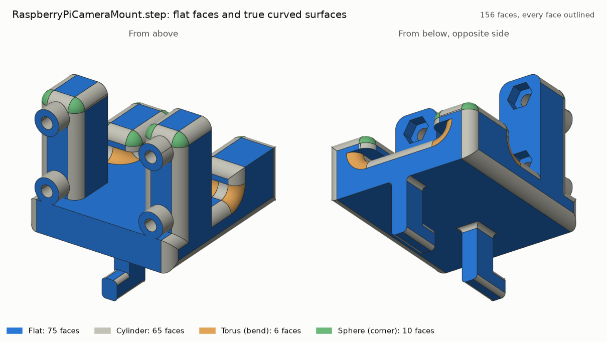

# Raspberry Pi camera mount, as STEP

`RaspberryPiCameraMount.step.zip` holds a STEP version of Ursa Laboratories'
[`RaspberryPiCameraMount.stl`](https://github.com/Ursa-Laboratories/Cubware/blob/8f0f0ed/cubxl_plus/instrument_mounts/raspberry_pi_mount/RaspberryPiCameraMount.stl)
from Cubware (commit `8f0f0ed`), made so the part can be edited in Onshape
([#165](https://github.com/vertical-cloud-lab/byu-vcl/issues/165)). Cubware's folder for this
part has only the STL, a PNG and a README.



## What is in the file

It is a direct conversion. Nothing was remodelled, smoothed or moved.

- One closed solid, 28.8 × 31.04 × 34.0 mm and 8,760.9 mm³, the same as the STL.
- Every vertex is an STL vertex at its exact coordinates, and every edge is a straight edge of
  the STL.
- **The part's 71 flat faces are one face each** (blue above). Where the STL had split a flat
  face into triangles, those triangles were merged back into one face.
- **The curved surfaces stay faceted, exactly as in the STL** (gray above): the fillets, the
  holes and the bosses. They are the other 26,930 faces, each a thin flat facet under 0.2 mm
  wide.

## Importing it into Onshape

1. Download `RaspberryPiCameraMount.step.zip` and unzip it. Onshape refuses a zipped STEP file
   ("Translation is not supported for zipped STEP files").
2. Import `RaspberryPiCameraMount.step` into an Onshape document, with the **+** button at the
   bottom left → **Import**. The units are millimetres.
3. Wait for it: Onshape took about 2.5 minutes to import this file.

## Editing it

- The flat faces work like any Onshape face. You can sketch on them, measure between them,
  extrude from them, and move or offset them.
- Distances between flat faces and straight edges are the STL's exact values.
- A faceted hole or fillet can't be resized as a feature, because it isn't one. To change a
  hole, cut a new round hole at the same centre, at least as wide as the old one: that removes
  all of the old hole's facets. To change a fillet, cut it away and model a new one.

## How it was made

[`tools/stl_to_step.py`](tools/stl_to_step.py) uses OpenCascade 8.0, from the `cadquery-ocp`
Python package. It:

1. reads the binary STL and joins vertices with identical coordinates.
2. groups neighbouring triangles that lie in one plane. Every vertex of a group lies within
   0.000002 mm of the plane of its largest triangle, which is about the rounding of the STL's
   32-bit numbers.
3. builds one planar face per group, bounded by the group's outline. Each edge is a straight
   line between two STL vertices and is shared by the faces on both sides, so the solid is
   closed by construction, with no sewing or gap tolerance.
4. writes AP214 STEP in millimetres. It leaves out the optional 2D copy of each edge on each
   face (pcurves), which more than doubled the file size. It also merges repeated entries, such
   as the same point written again for each edge that starts at it.

Building and checking the solid takes about 10 s. Merging the repeated entries in the STEP
takes about 3 minutes more.

```bash
pip install cadquery-ocp numpy matplotlib
python tools/stl_to_step.py RaspberryPiCameraMount.stl RaspberryPiCameraMount.step \
    --name RaspberryPiCameraMount --regions regions.npz
python tools/check_step.py RaspberryPiCameraMount.step RaspberryPiCameraMount.stl
python tools/preview.py regions.npz preview.png
```

## Checks

[`check.txt`](check.txt) is the output of [`tools/check_step.py`](tools/check_step.py), which
reads the STEP back and compares it with the STL.

| | STL | STEP read back |
| --- | --- | --- |
| Shape | One closed mesh: every edge is shared by exactly 2 triangles, all facing outwards | One valid solid (OpenCascade's `BRepCheck`), every edge shared by exactly 2 faces |
| Vertices | 26,563 | 26,563, each within 0.00000000001 mm of an STL vertex |
| Volume | 8,760.8914 mm³ | 8,760.8915 mm³ |
| Surface area | 4,768.6811 mm² | 4,768.6811 mm² |
| Bounding box | x −14.4 to 14.4, y −7.27 to 23.77, z −10 to 24 mm | identical |
| Largest tolerance | | 0.000001 mm |

On 2026-10-07 the STEP was also imported into Onshape through its API. Onshape made one part
with 27,001 planar faces, 53,557 edges and 26,563 vertices, the same as the STEP, and reports
8,760.8916 mm³ and 4,768.6811 mm².

## License

Cubware has no license file, so this conversion carries whatever terms Ursa Laboratories sets
for the original. Check with them before using it outside the lab. Until Cubware commit
`2a8d621` the STL was called `PAW-V2 - Raspberry Pi Camera Module 3 Mount_REV. 0 Copy 1 - Part 1.stl`,
so it may derive from the PAW-V2 design, whose files in this repo are GPL-2.0 (see
[`modules/electromagnetic-capper/cad/NOTICE.txt`](../../../modules/electromagnetic-capper/cad/NOTICE.txt)).
