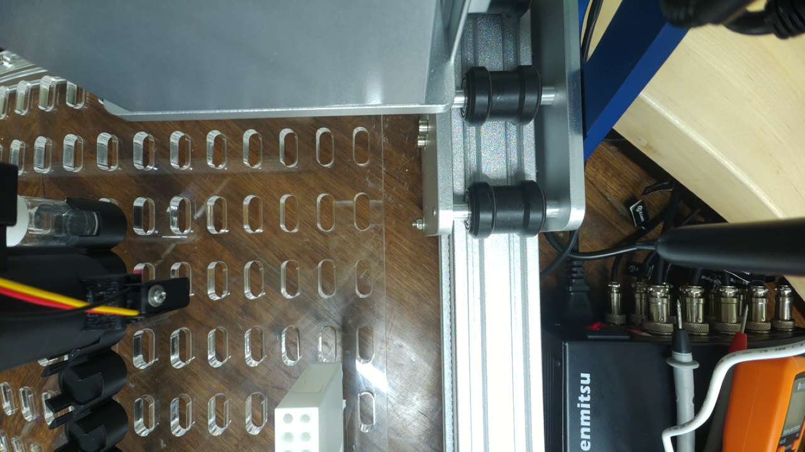
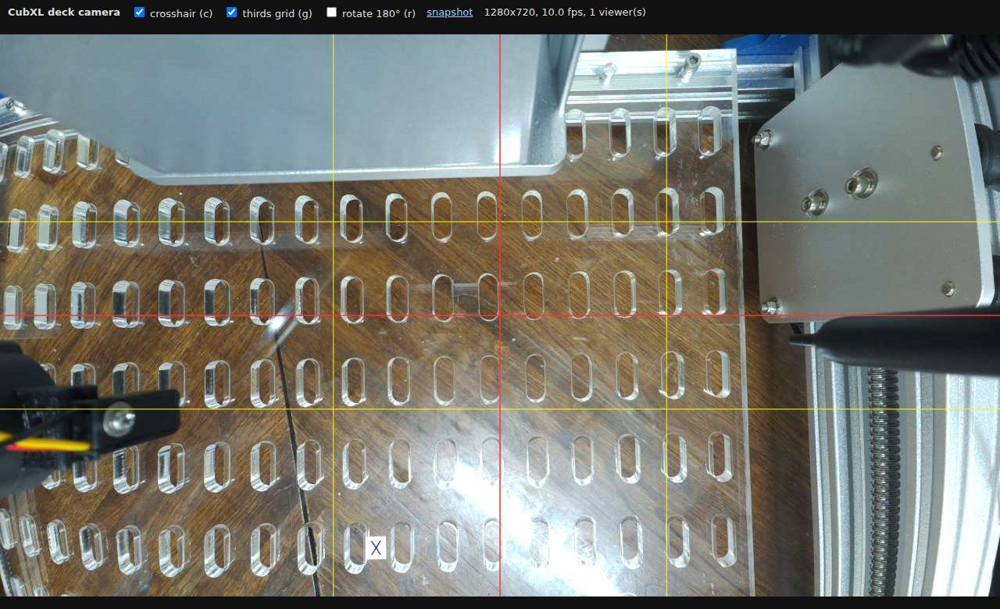
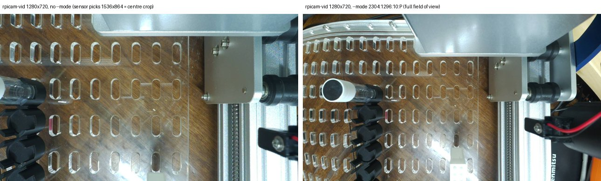

# CubXL deck camera

A fixed, top-down view of the CubXL deck from the Raspberry Pi 5 that drives the
gantry. Added 2026-10-01 ([#165](https://github.com/vertical-cloud-lab/byu-vcl/issues/165)).

| | |
| --- | --- |
| Camera | Raspberry Pi **Camera Module 3 Wide** (`imx708_wide`, autofocus), on the Pi 5's ribbon-cable connector |
| Field of view | 102° × 67° (datasheet); 99° × 67° rectilinear, from the 2.75 mm focal length |
| Live view | `deckcam.service` on the Pi: MJPEG on `127.0.0.1:8743`, reached over an SSH tunnel |
| Software | `rpicam-vid` from rpicam-apps 1.12 (already in Raspberry Pi OS) and Python's standard library; nothing was installed with apt or pip |



## Watching it

From your laptop, the same way as the CubOS Operator UI:

```bash
ssh -N -L 8743:127.0.0.1:8743 <pi-user>@<pi-host>
```

Then open **http://localhost:8743**. The terminal will appear to hang; that is
the tunnel staying open, so leave it until you are done and then press Ctrl+C. To get
the Operator UI and the camera through one connection, give both forwards:
`ssh -N -L 8742:127.0.0.1:8742 -L 8743:127.0.0.1:8743 <pi-user>@<pi-host>`.

The page draws a red crosshair on the centre of the frame and a yellow
rule-of-thirds grid (toggle with `c` and `g`), plus a 180° rotation (`r`) for a
camera mounted upside down. There is also a snapshot link. The status line shows the frame rate and
any camera error. It reads 0 fps for the first few seconds, until it has
counted some frames.



- **The camera runs only while someone is watching.** `rpicam-vid` starts with
  the first viewer and stops 10 s after the last one leaves. It takes about 2 s
  to get a picture, then runs at about 10 fps and 6 to 7 Mbit/s over the Pi's
  Wi-Fi. If the Wi-Fi struggles, lower `DECKCAM_QUALITY` (default 60) or
  `DECKCAM_FPS` (default 10).
- **While someone is watching, nothing else can use the camera.** `rpicam-still`
  and `rpicam-hello` fail with *Pipeline handler in use by another process*.
  Close the tab, or run `sudo systemctl stop deckcam`. The reverse also holds: if
  another program has the camera, the page says *camera busy* and picks the
  stream back up by itself once the camera is free.
- **Grabbing a frame from a script on the Pi** needs no tunnel:
  `curl -s -o deck.jpg http://127.0.0.1:8743/snapshot.jpg` returns a
  1280×720 frame, captured after exposure has settled.

## Where to put it

**Height is not the hard constraint with this lens. Clearance is.** The wide lens
covers roughly **2.35 h × 1.32 h** at a height *h* above the deck, so the
CubXL's 388 × 234 mm working volume (`cub_xl_ben_pipette_capper.yaml`) fits
in the frame from about 18 cm up. Allowing for the pipette's reach (deck x up to
442 mm) and a margin, that becomes about 23 cm:

| Lens height above deck | Area seen at deck level | 388 × 234 mm deck fills | mm per pixel, live view (1280 px) | mm per pixel, full-res still (4608 px) |
| --- | --- | --- | --- | --- |
| 20 cm | 47 × 26 cm | 83% × 89% (too tight) | 0.37 | 0.10 |
| 25 cm | 59 × 33 cm | 66% × 71% | 0.46 | 0.13 |
| 30 cm | 70 × 40 cm | 55% × 59% | 0.55 | 0.15 |
| 40 cm | 94 × 53 cm | 41% × 44% | 0.73 | 0.20 |
| 50 cm | 117 × 66 cm | 33% × 35% | 0.92 | 0.25 |

These are pinhole numbers, so they are conservative: barrel distortion makes the
real view slightly wider, mostly in the corners.

1. **Mount it to something that does not move.** On the CubXL, the head moves in
   Y as well as X (`y_axis_motion: head`). That means the beam, the head and the
   pipette all sweep the space above the deck. Attach the camera to the frame, the
   bench or an overhead arm, high enough to clear the top of the head *and
   pipette* at full Z (`z_max` 121) everywhere in the working volume. Check that
   before you tighten anything: jog the head to all four corners at full Z
   while you watch the live view.
2. **Long side of the frame along the deck's long side (X).** The frame is
   16:9 and the deck is 388 × 234 mm, about 5:3, so the deck only fills the frame
   well this way round.
3. **Centre it.** Put the crosshair on the middle of the deck, at deck
   coordinates of about (194, 117) mm.
4. **Square it.** Rotate the camera until the deck edges run parallel to the
   grid lines. If opposite edges of the deck come out different lengths (a
   trapezoid), the camera is tilted, not level.
5. **Leave some margin.** Keeping the deck inside the central ~70% of the frame
   avoids the worst of the wide lens's edge distortion. That argues for 30 to 40
   cm rather than the bare minimum, and it is likely where clearance puts the
   camera anyway.
6. **Lock the focus once it is mounted.** Continuous autofocus will refocus on
   the head whenever the head passes underneath. Fixed focus is set in
   dioptres, which is 1 / distance in metres: at 40 cm, `DECKCAM_LENS_POSITION=2.5`
   keeps everything from about 30 to 59 cm away from the lens sharp. That covers
   the deck up to the vial caps. To set it, run `sudo systemctl edit deckcam`,
   add the two lines below, then run `sudo systemctl restart deckcam`:

   ```ini
   [Service]
   Environment=DECKCAM_LENS_POSITION=2.5
   ```

The head will always hide part of a top-down view. For a full-deck picture, park
the head in a corner first.

**Two things to expect.** The acrylic deck mirrors the ceiling lights, so move
the camera or the lights if a reflection lands on something you care about. The
room is also dim: on 2026-10-01 the camera needed 50 ms exposures at 4× gain,
which blurs the head by about 2.5 mm at CubOS's 3000 mm/min. More light on the
deck sharpens anything that moves.

**The Pi 5 camera cable comes in 200, 300 and 500 mm lengths.** If the mounting
spot is out of reach, a longer cable is easier than moving the Pi.

## What is installed on the Pi

Installed 2026-10-01 with `sudo ./install.sh` from this directory:

- `~/deckcam/deckcam.py`, a copy of [`deckcam.py`](deckcam.py)
- `/etc/systemd/system/deckcam.service`, rendered from
  [`deckcam.service`](deckcam.service). It is enabled at boot, runs as the
  Pi's login user, and listens on `127.0.0.1:8743` only.

```bash
systemctl status deckcam          # is it up?
journalctl -u deckcam -f          # its log: camera starts/stops and errors
sudo ./install.sh                 # update after changing deckcam.py
sudo systemctl disable --now deckcam && sudo rm /etc/systemd/system/deckcam.service   # remove
```

The listener is on loopback on purpose. The tailnet grant to this Pi is
`tcp:22` only, so a port bound to `0.0.0.0` would still be unreachable from
other devices. Binding to loopback also keeps an unauthenticated camera off the
campus Wi-Fi.

## Gotchas found while setting this up

- **Below 2304×1296, `rpicam-vid` picks a cropped sensor mode unless told
  otherwise.** Asked for 1280×720, it chooses the IMX708's 1536×864 mode, which
  is a centre crop that shows only the middle two thirds of the field of view.
  For placing a camera, that is exactly the wrong thing to see. `deckcam.py`
  pins `--mode 2304:1296:10:P`, the full field, 2×2 binned. Left: the default.
  Right: pinned. Same camera, seconds apart:

  

- **CubOS has camera instruments, but they are for cameras the gantry carries.**
  Its `raspberry_pi` camera vendor positions a camera through the usual
  `offset_x`/`offset_y`/`depth` mount fields. Its `capture()` raises
  `NotImplementedError` (CubOS `934b606`, 2026-09-30). The Operator UI's camera
  preview only appears inside the calibration wizard. A fixed overhead camera
  therefore lives outside CubOS for now.
- **With a monitor plugged into the Pi**, `rpicam-hello -t 0` should show a
  full-screen preview: rpicam-apps-lite ships the DRM preview. This was not tried
  on 2026-10-01. As above, it cannot open the camera while a browser is watching.
