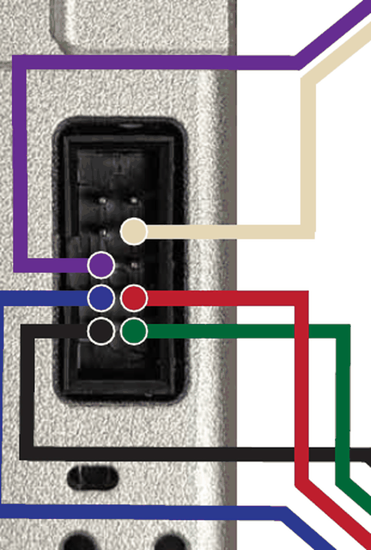

# Opentrons pipette → TMC2209 → Arduino wiring, checked against the firmware

Written 2026-09-01 while diagnosing "nothing happens on the pipette — no buzzing,
the plunger never moves" on the CubXL. Revised 2026-09-08: §3 corrected (pin 6 →
GND *is* on the Cubware diagram) and extended with the connector-orientation
check, and §4 added.

**Where the Ursa documentation lives.** There is exactly one Ursa-authored
pipette wiring source —
[`Cubware/documentation/opentrons-pipette-setup.md`](https://github.com/Ursa-Laboratories/Cubware/blob/main/documentation/opentrons-pipette-setup.md)
and its `images/PipetteControl.png`. (`images/ArduinoCircuitDiagram_v3.png` in the
same folder is the capper/lights circuit, referenced from
`vial-capper-decapper-build.md`; it has nothing to do with the pipette. Nothing in
CubOS, PANDA-CUB, Zoo or BU-Configs documents this wiring.) That page delegates
onward: *"The legacy PANDA-BEAR wiring docs point to the external
BU-KABlab/PANDA_Arduino repository for firmware source, pin assignments, and
installation instructions."* `PANDA_Arduino` in turn carries a vendored copy of
the science-jubilee OT2 pipette tool doc at `src/pipette_tool.md`, and *that*
project is where the authoritative 10-pin material actually is.

The wiring diagram in Cubware
([`documentation/opentrons-pipette-setup.md`](https://github.com/Ursa-Laboratories/Cubware/blob/main/documentation/opentrons-pipette-setup.md)
→ `images/PipetteControl.png`) does **not** match the pin map in the firmware that
Arduino is running. The pipette side of the diagram is right; the Arduino side is
shifted by one analog pin on all four driver-control lines, and the pin the
firmware actually drives as ENABLE is not connected to anything.

Everything below is read out of source, not inferred from behaviour. Sources:

| what | where |
|---|---|
| firmware pin map + constants | [`BU-KABlab/PANDA_Arduino` `include/Pipette.h`](https://github.com/BU-KABlab/PANDA_Arduino/blob/main/include/Pipette.h) |
| firmware step/home/aspirate logic | [`src/Pipette.cpp`](https://github.com/BU-KABlab/PANDA_Arduino/blob/main/src/Pipette.cpp) |
| driver library | [`janelia-arduino/TMC2209`](https://github.com/janelia-arduino/TMC2209) `@^10.1.0`, pinned in `platformio.ini` |
| OT-2 10-pin ribbon pinout | the Jubilee OT2 pipette tool doc, [`src/pipette_tool.md`](https://github.com/BU-KABlab/PANDA_Arduino/blob/main/src/pipette_tool.md) §"Wiring Harness Assembly" |
| **which physical hole is pin 1** | [`science-jubilee` `tool_library/OT2_pipette/assembly_docs/OT2_Wiring_Diagram.pdf`](https://github.com/machineagency/science-jubilee/blob/main/tool_library/OT2_pipette/assembly_docs/OT2_Wiring_Diagram.pdf) — a photograph of the pipette's own header with each wire on its hole |
| ribbon conductor numbering | [`_static/ribbon_to_hookup_wiring.png`](https://github.com/machineagency/science-jubilee/blob/main/docs/building/_static/ribbon_to_hookup_wiring.png) |
| breakout | [Adafruit 6121](https://www.adafruit.com/product/6121) — motor supply 5–29 VDC, VDD 3–5 V, **current set by an onboard potentiometer** |

Cubware's own text flags the whole page as provisional: *"the OT2 pipette hardware
path has not yet been validated on the physical machine in this checkout. Treat
every position, model constant, and serial command as a commissioning value."*

## 1. The firmware's pin map

```c
// include/Pipette.h
#define PIPETTE_LIMIT_PIN 9 // Limit switch for homing
#define RX_PIN 14           // SoftwareSerial RX pin (not connected but required)
#define TX_PIN 15           // SoftwareSerial TX pin to TMC2209 RX
#define STEP_PIN 16         // Step pin
#define DIR_PIN 17          // Direction pin
#define ENABLE_PIN 18       // Enable pin (optional)
```

On an Arduino Uno the analog pins carry digital numbers 14–19, so
`A0=14, A1=15, A2=16, A3=17, A4=18, A5=19`. Substituting:

| firmware symbol | value | Uno pin | goes to |
|---|---|---|---|
| `RX_PIN` | 14 | **A0** | nothing — SoftwareSerial RX, "not connected but required" |
| `TX_PIN` | 15 | **A1** | TMC2209 **UART** (PDN_UART) |
| `STEP_PIN` | 16 | **A2** | TMC2209 **STEP** |
| `DIR_PIN` | 17 | **A3** | TMC2209 **DIR** |
| `ENABLE_PIN` | 18 | **A4** | TMC2209 **EN** |
| `PIPETTE_LIMIT_PIN` | 9 | **D9** | pipette limit switch |

No other module in the firmware claims any of these — the capper/lights use
D3 (`NEOPIXEL_RING_PIN`), D4 (`LINEBREAK_SENSOR_PIN`), D5 and D6. There is no pin
conflict.

## 2. The diagram vs. the firmware

| signal | **firmware wants** | **diagram shows** | |
|---|---|---|---|
| TMC2209 `UART` | **A1** | A0 | ❌ A0 is the SoftwareSerial **RX** — the firmware never transmits on it |
| TMC2209 `STEP` | **A2** | A1 | ❌ A1 is the UART **TX** |
| TMC2209 `DIR` | **A3** | A2 | ❌ A2 is **STEP** |
| TMC2209 `EN` | **A4** | A3 | ❌ A3 is **DIR** |
| TMC2209 `GND` | GND | GND | ✅ |
| TMC2209 `VDD` | 5 V | 5 V | ✅ |
| limit switch signal | **D9** | D9 | ✅ |

Every driver-control line is one analog pin low, and **A4 appears nowhere in the
diagram**. What each one does if you build it as drawn:

**`EN` on A3 ⇒ the direction bit switches the driver on and off.** TMC2209 `EN`
is active-low. `moveTo()` does `digitalWrite(DIR_PIN, isMovingDown ? HIGH : LOW)`,
so the driver would be energised for one direction of travel and completely dead
for the other.

> **Correction, 2026-09-01.** Earlier revisions of this document, and the PR
> comments of 2026-08-31 and 2026-09-01, offered this as the explanation for the
> plunger only moving one way. **It is not.** The one-way behaviour is a
> *firmware* gate on the limit-switch reading — see §3 below, which quotes the
> line — and it is visible at the serial port as a flat ~0.11 s refusal, which an
> `EN` fault could never produce (the firmware does not read `EN` back). `EN` on
> A3 is still wrong and still needs moving to A4; it just is not what caused the
> one-way symptom.

**`UART` on A0 ⇒ the driver is never configured.** The firmware's
`setupMotor()` calls `setRunCurrent(50)`, `setHoldCurrent(30)`,
`setMicrostepsPerStep(16)`, `enableStealthChop()`, `enableCoolStep()` and
`enable()` — all of which are UART register writes. It never calls
`setHardwareEnablePin()`, so in the library `enable()` is UART-only:

```cpp
void TMC2209::enable() {
  if (hardware_enable_pin_ >= 0) { digitalWrite(hardware_enable_pin_, LOW); }  // never: default -1
  chopper_config_.toff = toff_;
  writeStoredChopperConfig();                                                  // UART
}
```

With UART on the wrong pin none of that lands, and the chip runs on its power-on
defaults: microstepping from the MS1/MS2 straps and **current from the VREF
potentiometer only**.

**`STEP` on A1 and `DIR` on A2 ⇒ they are swapped in effect.** The driver's STEP
input sees UART frames (edges only while the firmware transmits, i.e. at boot),
and its DIR input sees the step pulse train.

### Corrected Arduino ↔ TMC2209 wiring

```
TMC2209 EN    -> Arduino A4      (was A3)
TMC2209 UART  -> Arduino A1      (was A0)
TMC2209 STEP  -> Arduino A2      (was A1)
TMC2209 DIR   -> Arduino A3      (was A2)
TMC2209 GND   -> Arduino GND     (unchanged)
TMC2209 VDD   -> Arduino 5V      (unchanged)
Arduino A0    -> leave unconnected
```

## 3. The 10 pins on the pipette — this half of the diagram is correct

The OT-2 pipette's FC-10P connector, per the Jubilee tool doc's ribbon table and
the JST housing order `[Blue/4, Red/3, Green/1, Black/2]` (so coil 1 = ribbon 3+4,
coil 2 = ribbon 1+2):

| pipette pin | function | diagram | verdict |
|---|---|---|---|
| 1 | stepper coil B | → TMC `2B` | ✅ |
| 2 | stepper coil B | → TMC `2A` | ✅ |
| 3 | stepper coil A | → TMC `1B` | ✅ |
| 4 | stepper coil A | → TMC `1A` | ✅ |
| 5 | unused | — | ✅ |
| 6 | limit switch **return (GND)** | labelled `Limit switch GND` | ✅ |
| 7 | limit switch signal | → Arduino D9 | ✅ |
| 8, 9, 10 | unused | — | ✅ |

The coil grouping matters and it is right: 3+4 together and 1+2 together. Swapping
the two wires *within* a pair only reverses the direction of travel; **mixing the
pairs** (e.g. 1 with 3) makes the motor buzz and vibrate without turning. Since
there is no buzzing at all, the coil wiring is not the current fault.

### Which physical hole is pin 1 — the thing neither Ursa source states

Both Ursa-side sources give the *logical* pinout and neither says which end of
the connector is pin 1. The only source that does is science-jubilee's
[`OT2_Wiring_Diagram.pdf`](https://github.com/machineagency/science-jubilee/blob/main/tool_library/OT2_pipette/assembly_docs/OT2_Wiring_Diagram.pdf),
which is a **photograph of the pipette's own 10-pin header** with a coloured dot
on each populated hole. Read off it:

- the **top row of the header (9, 10) is empty**, and the two motor coils occupy
  the **bottom two rows** — `1|2` bottom, `3|4` above it;
- each coil is a **left-right pair within one row** (blue+red on `3|4`,
  black+green on `1|2`), matching the JST housing order `[Blue/4, Red/3,
  Green/1, Black/2]`;
- the limit-switch pair is **7 and 6 — diagonal**, one hole in each of two
  adjacent rows, not a same-row pair. Wiring it to 7+8 or 5+6 is the easy
  mistake.

If the populated rows are at the *other* end of the connector, the FC-10P is
crimped 180° out and every pin maps `n → 11 − n`: all four coil wires land on
unused pins 7–10 (silent motor, no buzzing) and the limit-switch pair lands on
pin 4 (a coil) and pin 5 (no connect). That case is testable without a
multimeter — see the D9 table below — and it is *excluded* on this machine,
because D9 has read LOW (loop closed) in three of the five wiring passes, which
a rotated connector could never produce.

Two-minute meter check, ribbon off the driver's screw terminals, everything
powered down: **blue–red** and **black–green** should each read a few to a few
tens of ohms; **blue–black** should read open, because the two coils of a
bipolar stepper are isolated. If both pairs read open, the fault is in the
crimps or the solder joints, not in the pinout.

### The limit-switch return, pin 6 → Arduino GND

`setupPipette()` does `pinMode(PIPETTE_LIMIT_PIN, INPUT_PULLUP)`, and D9 **HIGH
means "at the limit"** — so an open switch circuit reads *asserted*.

**This one pin explains both plunger symptoms.** `stepMotor()` gates the upward
direction on it:

```c
// Check for limit switch when moving UP (DIR_PIN is LOW for UP)
if (digitalRead(PIPETTE_LIMIT_PIN) == HIGH && digitalRead(DIR_PIN) == LOW)
{
    delay(DEBOUNCE_TIME);
    if (digitalRead(PIPETTE_LIMIT_PIN) == HIGH) { errorOccurred = true; break; }
}
```

and `homePipette()` checks it *before* its first step, so an asserted switch is
an instant "success" that runs only the 796-step back-off:

```c
digitalWrite(DIR_PIN, LOW);            // seek upward
while (!homingSuccessful && ...) {
    if (digitalRead(PIPETTE_LIMIT_PIN) == HIGH) { ... homingSuccessful = true; break; }
    ... step ...
    if (stepsCount > 50000) return false;      // ~26 s of seek
}
digitalWrite(DIR_PIN, HIGH);           // back off 796 steps @ 510 us = 0.406 s
```

| D9 reads | `HOME` | UP / retract moves | DOWN / forward moves |
|---|---|---|---|
| **HIGH (asserted)** | "success" in **0.52 s** — back-off only, no seek | aborted after 1 step + 100 ms debounce → **~0.11 s** | unaffected |
| **LOW (clear)** | full 50000-step budget, then `false` → **26.35 s** ERR | normal, scales with distance | unaffected |

Both constants are exact: 796 × 510 µs + `DEBOUNCE_TIME 100` = **0.506 s** vs.
0.52 s measured; 1 step + 100 ms = **~0.1 s** vs. 0.11 s measured.

Consequences for the wiring:

- **Pin 6 must reach Arduino GND**, which is what the diagram's
  `Limit switch GND` label means. Anywhere that loop is open — pin 6, pin 7, the
  switch itself, a crimp — D9 idles HIGH through the pull-up and you get the
  whole "HIGH" row above: a fake home *and* a plunger that refuses to retract.
- The contact must be **normally closed**: LOW (closed to GND) at rest, opening
  as the plunger reaches the limit. A normally-open contact gives the HIGH row.

Observed history on this machine, all four rewiring passes:

| date / pass | `HOME` | backward | ⇒ D9 |
|---|---|---|---|
| 2026-08-31, before any rewiring | 0.52 s | refused | HIGH |
| 2026-09-01 18:33, rewire #1 | 26.35 s ERR | moves | LOW |
| 2026-09-01 18:56, rewire #2 | 26.35 s ERR | moves | LOW |
| 2026-09-01 19:13, rewire #3 | 26.35 s ERR | moves | LOW |
| 2026-09-01 19:46, rewire #4 | 0.52 s | refused | HIGH |
| 2026-09-08, rewire #5 (Arduino pins corrected) | not measurable — hardware off the Pi | — | — |

Nothing else in the plunger's behaviour changed across those passes. Treat this
pin as the first thing to measure whenever the plunger misbehaves.

## 4. Fixing the UART pin opens a new way for the driver to be switched off

Added 2026-09-08, after the Arduino-side pins were corrected and the plunger
still did not move. This is a *software* failure mode, and it was not reachable
while UART was on the wrong pin.

`setupPipette()` → `setupMotor()` → `stepperDriver.setup(softSerial)` →
[`TMC2209::initialize()`](https://github.com/janelia-arduino/TMC2209/blob/main/src/TMC2209/TMC2209.cpp):

```cpp
void TMC2209::initialize(long serial_baud_rate, SerialAddress serial_address)
{
  serial_baud_rate_ = serial_baud_rate;
  setOperationModeToSerial(serial_address);   // i_scale_analog = 0  <- VREF pot out of circuit
                                              // pdn_disable = 1, mstep_reg_select = 1
  setRegistersToDefaults();
  clearDriveError();
  minimizeMotorCurrent();                     // IRUN / IHOLD -> minimum
  disable();                                  // CHOPCONF.toff = 0 -> output stage OFF
  disableAutomaticCurrentScaling();
  disableAutomaticGradientAdaptation();
}
```

`setupMotor()` then calls `setRunCurrent(50)`, `setHoldCurrent(30)`,
`setMicrostepsPerStep(16)`, `enableStealthChop()`, `enableCoolStep()` and
`enable()` to undo the last two lines.

**Every one of those is a UART write, and the link is write-only.**
`SoftwareSerial softSerial(RX_PIN, TX_PIN)` is `(A0, A1)`, and `Pipette.h` says of
A0: *"SoftwareSerial RX pin (not connected but required)"*. The TMC2209's UART is
single-wire half-duplex (PDN_UART); with only TX attached the Arduino can never
read the driver back, and `setupMotor()` never calls
`stepperDriver.isSetupAndCommunicating()`. Nothing anywhere verifies that a
single register write landed.

So the two wiring states behave very differently:

| UART wire on | what the driver does |
|---|---|
| **A0** (the RX pin — the Cubware diagram) | nothing is ever transmitted. Chip stays in **standalone mode**: VREF pot sets current, MS1/MS2 straps set 1/8 microstepping, `CHOPCONF.toff` at its power-on default of 3 → **output stage enabled** |
| **A1** (the TX pin — correct) | the first thing that lands is `i_scale_analog = 0`, **taking the current pot out of the circuit**, followed by `minimizeMotorCurrent()` and `disable()`. If any later write is dropped or garbled, the driver sits at **minimum current with its output stage off** — silent, no holding torque — while the Arduino happily bit-bangs STEP into it |

### Two ways this could have failed that are now ruled out

Measured against the pinned library on 2026-09-08 rather than assumed:

- **SoftwareSerial baud is not marginal.** The `setup(SoftwareSerial &)` overload
  defaults to **9600** (`TMC2209.h:67`), not the 115200 the `HardwareSerial`
  overloads use. `setupMotor()` passes no baud, so 9600 is what runs — comfortable
  on a 16 MHz ATmega328P.
- **`enable()` does not write another zero.** `toff_` is initialised to
  `TOFF_DEFAULT = 3` (`TMC2209.h:508-510`), so `enable()` restores a live chopper
  config.

So the UART path only strands the driver if the register writes **partially**
land — `setOperationModeToSerial` + `minimizeMotorCurrent` + `disable` arriving
while the later `setRunCurrent`/`enable` do not. That is a narrower failure than
"UART is misrouted", and it needs a marginal connection rather than a wrong one.
Worth keeping on the list, no longer at the top of it.

### The bisect: pull the UART wire off A1

Nothing else changes. With the wire off, `setup()`'s writes go nowhere, the chip
never enters serial mode, and it runs on its power-on defaults with the pot back
in charge of current.

- **Plunger moves** → the fault is in the UART configuration path. (Distances will
  come out 2× — standalone MS1/MS2 default to 1/8, not the 1/16 the firmware
  assumes; see §6.)
- **Plunger still silent** → it is power, current, or the coil circuit. §5 and the
  meter check in §3.

Either way, turn the VREF pot up before running the test.

If you would rather instrument than unplug: tie A0 to the same PDN_UART line
through a 1 kΩ resistor — that is how the janelia library's single-wire mode is
meant to be wired — and then `isSetupAndCommunicating()` becomes meaningful and
can be checked after `setup()`.

### ⚠️ Turn the run current down before it works

`RUN_CURRENT_PERCENT 50` maps to `IRUN = 15` of 31, with `CHOPPER_CONFIG_DEFAULT
= 0x10000053` leaving `vsense = 0` (the high-current range) and the firmware never
calling `enableVSense()`. On a breakout Adafruit rates to 2 A that is on the order
of **0.9 A RMS / 1.2 A peak**.

The same science-jubilee source this harness comes from specifies **350 mA peak
for a gen1 OT-2 pipette motor and 500 mA for a gen2** (`M906 V350` / `M906 V500`).
So the firmware asks for roughly 2–3× the motor's rating — and *that only starts
mattering once the UART wire works*, because until then the pot was in charge.
Drop `RUN_CURRENT_PERCENT` to ~20 and `HOLD_CURRENT_PERCENT` to ~10 before the
first successful move, and fit the Adafruit `1515` heat sink to the driver
(Cubware's setup page has a section on it).

## 5. Two more things on that page

**"120V/2A Power Supply" is a typo for 12 V.** The Adafruit 6121 breakout takes
5–29 VDC on the motor terminal. Do not connect mains.

**12 V at 2 A into the driver's VM terminal is the right supply, and 2 A is a
ceiling rather than a setting.** A stepper driver is a current source: the coil
current is whatever IRUN/VREF asks for, and the supply's amp rating only has to
be at least that. It is the driver's *current setting* that needs to come down to
the motor's 350–500 mA, not the supply. Two things to keep in mind: the supply
must land on the driver's VM/GND screw terminal, not on VDD (VDD is logic only,
and the board enumerates and acks every command happily with VM absent — silently);
and 12 V into a 350 mA motor is a lot of headroom, so fit the heat sink and keep
the current setting low.

**The motor supply is separate from VDD.** The Arduino's 5 V on `VDD` powers the
driver's logic only. With no voltage on the `+`/`-` terminal the board still
accepts STEP/DIR and acknowledges everything, with zero coil current and total
silence — indistinguishable at the serial port from a healthy run.

## 6. What the 2026-09-08 measurements narrowed it to

Both readings came from `cubos/tools/pipette_driver_probe.py`, which drives the
firmware's `CMD_MOVE_RELATIVE` (code 16) in raw steps. That command reports an
aborted move **explicitly** (`ERR:{"error":"Failed to move relative"}`) instead of
leaving it to be inferred from a round-trip time, and its DOWN direction is not
gated by the limit switch at all.

```
limit switch   ASSERTED (D9 HIGH, loop OPEN)   dt=0.11s  ERR:{"error":"Failed to move relative"}
motor          DOWN 1.0 mm at 400 steps/s      dt=4.04s  expected 4.00s  OK
```

### The Arduino is not the problem

1592 steps at exactly the commanded rate, deliberately slow so the motor makes
its most torque and most noise. Everything upstream of the STEP pin works. The
fault is between the Arduino header and the motor windings.

### The one hypothesis that explains both symptoms at once

D9 reading HIGH means the **switch loop is open**, and total silence with no
buzzing means **no coil current** (a swapped coil *pair* buzzes and vibrates;
open coils are silent). Both the switch loop and both coils arrive on the same
FC-10P connector at the pipette. A connector that is not fully seated, or a bad
crimp row, opens all of them together.

The switch reading has also flipped between passes — asserted before 2026-09-01,
clear for three passes on 2026-09-01, asserted again since — while the Arduino
end was being rewired. An intermittent contact behaves exactly like that; a wrong
pinout does not.

So the meter check in §3 is now the first thing to do, not the last:

```
ribbon unplugged from the driver terminals, everything powered down

blue–red     a few to a few tens of ohms      coil A
black–green  a few to a few tens of ohms      coil B
blue–black   open                             the coils are isolated from each other
pin 6–pin 7  CLOSED at rest                   the limit switch, normally-closed
```

Both coil pairs open ⇒ the connector or the crimps, not the pinout. Pin 6–7 open
at rest ⇒ the same loop, or a normally-*open* switch, which the firmware cannot
use.

### Holding torque is the test that ignores the mechanical stop

`--motor-test` cannot tell "no coil current" from "the plunger is already against
its stop" — and the plunger *is* being ratcheted outward, see below. Holding
torque can: with the driver idle and powered, grab the plunger and try to turn or
push it. Energized coils resist noticeably (`HOLD_CURRENT_PERCENT 30`). No
resistance at all means no coil current, whatever position it is in.

### ⚠️ While the switch reads asserted, the plunger only travels one way

Every upward command is refused by the gate in `stepMotor()`, `HOME` only zeroes
the counter, and there is no other retract path in the command set. So each run
that reaches `aspirate` drives the plunger further out and nothing brings it
back. Fixing the switch loop is what restores the ability to retract at all — it
is not only a homing problem.

### `ASPIRATE`'s reported positions, explained

`aspirate()` clamps to `MIN_VOLUME 5.0`, moves **down to `PRIME_POSITION 36.0`
first**, then up to `36.0 - volume * UL_TO_MM`. The second leg is upward, so the
gate applies:

- switch clear → both legs run → reports 35.45
- switch asserted → second leg refused → reports 36.00

Every value seen in the logs is one of those two. It also means aspirate is never
a small move: it drives to 36.0 whatever volume is asked for. (`dispense()`
ignores its volume argument entirely and moves to `BLOWOUT_POSITION 44.0`.)

### Where 0.673 s/mm comes from

`stepMotor()` sets `stepDelay = 1000000 / velocity` clamped to [100, 10000] µs.
At `MOVEMENT_VELOCITY = 2500` steps/s that is 400 µs, plus ~23 µs of
`digitalWrite`/`digitalRead`/loop overhead → ~423 µs per step, and at
`STEPS_PER_MM 1592` that is **0.673 s/mm**. Arithmetic, not a fit — which is why
a round trip that fails to scale with distance is conclusive.

## 7. Consequences that outlive the wiring fix

**Microstepping is almost certainly 1/8, not the 1/16 the firmware assumes.**
`setMicrostepsPerStep(16)` is a UART write, so with UART unconfigured the chip
uses its MS1/MS2 straps, which default to 1/8. The firmware's own numbers admit
it: `STEPS_PER_MM 1592.0`, but the homing back-off says
`int backOffSteps = 796; // this is equal to 1mm` — exactly half. Same factor in
`if (stepsCount > 50000) // About 62mm of travel`: 50000 steps is 31 mm at 1592
steps/mm and 62 mm at 796. **Expect commanded millimetres to come out 2× on the
plunger** until either the UART wire is fixed or MS1/MS2 are strapped for 1/16.
Check it with a ruler on the first successful move.

**Volumes are double-converted, then clamped.** CubOS computes
`mm_travel = volume_ul * mm_to_ul` and sends that as the `ASPIRATE` argument, but
the firmware's `aspirate(float volume, ...)` takes **microlitres** and does its own
`volume * UL_TO_MM` internally. It also clamps to `MIN_VOLUME 5.0` /
`MAX_VOLUME 300.0` first. So a protocol asking for 20 µL sends `ASPIRATE 0.5`, the
firmware clamps 0.5 → 5 µL, and the plunger targets
`PRIME_POSITION 36.0 − 5×0.1098 = 35.45` — the exact value in every trace. To pass
real microlitres through, `mm_to_ul` would have to be **1.0**.

**`aspirate` always primes first.** `aspirate()` runs `moveTo(PRIME_POSITION)`
before anything else, so the plunger travels to 36.0 mm regardless of the
requested volume. `dispense()` ignores its volume argument entirely and just moves
to `BLOWOUT_POSITION 44.0`.

**The firmware is built for a P300.** `MAX_VOLUME 300.0`, `UL_TO_MM 0.1098`,
`PRIME 36.0`, `BLOWOUT 44.0`, `DROP_TIP 55.0`, and a `P300.json` beside it. That is
why `STATUS` reports `max_vol: 300.00` with a p20 on the head. CubOS's
`p20_single_gen2` entry in `instruments/pipette/models.py` is all
`# placeholder` values and does not correspond to this firmware at all.

**Timing at the serial port cannot see the motor.** `stepMotor()` bit-bangs STEP
and counts loop iterations; there is no encoder, no current sense, no feedback.
A move that takes the expected `0.673 s/mm` proves the *Arduino* stepped and
nothing more. (0.673 s/mm is itself just the firmware's arithmetic:
`MOVEMENT_VELOCITY 2500` → 400 µs/step, × `STEPS_PER_MM 1592` ≈ 0.67 s/mm.)
Likewise `HOME` failing after 26.35 s is the 50000-step budget in
`homePipette()`, not the 60 s timeout.

---

## 8. The science-jubilee prior art

`machineagency/science-jubilee` is the upstream of this whole pipette harness —
`BU-KABlab/PANDA_Arduino` vendors a copy of its tool doc at `src/pipette_tool.md`,
and Ursa's `Cubware/documentation/opentrons-pipette-setup.md` delegates to PANDA.
It drives the same OT-2 pipette from a **Duet 3 / RepRapFirmware** V axis instead of
an Arduino + TMC2209, so it is an independent implementation of the same mechanism —
which makes it usable as a cross-check on every constant PANDA carries.

Sources (MIT licensed):

| what | where |
| --- | --- |
| Duet `config.g` recipe | [`tool_library/OT2_pipette/duet_configs/OT2_Pipette_Configuration.md`](https://github.com/machineagency/science-jubilee/blob/main/tool_library/OT2_pipette/duet_configs/OT2_Pipette_Configuration.md) |
| Python driver | [`src/science_jubilee/tools/Pipette.py`](https://github.com/machineagency/science-jubilee/blob/main/src/science_jubilee/tools/Pipette.py) |
| Per-model constants | [`src/science_jubilee/tools/configs/P20_config.json`](https://github.com/machineagency/science-jubilee/blob/main/src/science_jubilee/tools/configs/P20_config.json) (also P300, P1000) |
| Header photo | [`tool_library/OT2_pipette/assembly_docs/OT2_Wiring_Diagram.pdf`](https://github.com/machineagency/science-jubilee/blob/main/tool_library/OT2_pipette/assembly_docs/OT2_Wiring_Diagram.pdf) |
| Tip-sensor holders | `tool_library/OT2_pipette/designs/3D_only/PipetteTool_Holder_{Mechanical,Dust-Proof}_Limit_Switch.stl` |

### 8.1 The two systems agree on the pipette, and that validates PANDA's numbers

RRF sets steps per axis unit with `M92`; the doc gives **48 (Gen1) / 200 (Gen2)** at
`M350 V16 I1`. PANDA uses `STEPS_PER_MM 1592.0`, also at 16x. Those are not the same
unit — the ratio is `1592 / 200 = 7.96`.

Which one is a millimetre falls out of the motor arithmetic. At 16x on a 200-step
motor:

```
PANDA  1592 / 16 =  99.5 full steps per unit  ->  2.01 mm of lead per revolution
SJ      200 / 16 =  12.5 full steps per unit  ->  16.0 mm of lead per revolution
```

2 mm is an ordinary leadscrew lead; 16 mm is not. **PANDA's "mm" are real
millimetres and science-jubilee's V units are ~7.96 mm each** — their `M92 V200`
is steps-per-V-unit, and nothing in their stack ever needs it to be a millimetre
because every position and volume constant is calibrated in those same units.

That in turn makes PANDA's plunger constants physically sensible: `PRIME 36.0`,
`BLOWOUT 44.0`, `DROP_TIP 55.0` mm, with `homePipette()`'s 50000-step budget being
31.4 mm — i.e. a ~55 mm plunger stroke, which is what an OT-2 pipette has.

The volume calibration cross-checks too. Converted to steps per microlitre — a
property of the piston alone, independent of how either project mounts the tool:

```
science-jubilee P300:  0.91   units/uL x  200 steps/unit = 182.0 steps/uL
PANDA           P300:  0.1098 mm/uL    x 1592 steps/mm   = 174.8 steps/uL
                                                    agree to within 4%
```

Two independent projects, two different controllers, same answer. **PANDA's
`UL_TO_MM 0.1098` is a real P300 calibration, not a placeholder.**

### 8.2 ...which is exactly why the P20 numbers are not trustworthy on either side

Upstream ships a `P20_config.json` for a "P20 Gen 2". Running the same consistency
check on all three of their configs — full-scale volume against the axis travel that
`zero_position` makes available:

| model | `zero_position` | `mm_to_ul` | full-scale stroke | % of available travel |
| --- | ---: | ---: | ---: | ---: |
| P1000 | 310 | 0.31 | 310.0 | **100%** |
| P300 | 310 | 0.91 | 273.0 | **88%** |
| **P20** | 250 | **0.8531** | **17.1** | **6.8%** |

P1000's value is exactly `zero_position / max_volume`; P300's sits 12% under it, which
is what a gravimetric trim looks like. P20's is neither — a P20 whose full 20 µL used
under 7% of the plunger travel would be a pipette that is 93% dead band. `0.8531` is
within 6% of the P300's `0.91`, which is what a copied line looks like, not a
calibration.

Self-consistent values, for anyone picking this up:

```
science-jubilee units:   mm_to_ul ~ 250 / 20 = 12.5   (vs the shipped 0.8531)
PANDA millimetres:       UL_TO_MM ~  36 / 20 =  1.8   (vs P300's 0.1098)
CubOS p20_single_gen2:   mm_to_ul   0.025 is ~72x too small
```

All three are estimates from "full volume uses the full stroke" and need a
gravimetric calibration before any number is a microlitre. The point is only that
the shipped values are wrong by one to two orders of magnitude, not by a few percent.

Also from that table: **`MIN_VOLUME`/`MAX_VOLUME` in the firmware are P300 values**
(`5.0` / `300.0`); upstream's P20 entry is `min_volume: 1, max_volume: 20`. The
firmware's `constrain(volume, MIN_VOLUME, MAX_VOLUME)` is why `ASPIRATE 0.5` has
always landed at 35.45 — 0.5 clamps up to 5, and `36.0 - 5 x 0.1098 = 35.451`.

### 8.3 Gen1 and Gen2 are 4.17x apart, and PANDA hardcodes one number

`M92 V48` vs `M92 V200` — the two generations do not share a drive ratio. `M906`
differs too: **350 mA peak for Gen1, 500 mA for Gen2**. PANDA has a single
`STEPS_PER_MM` and a single current, so the generation printed on the pipette body
(the diagram's own pipette reads `P300 GEN2`) has to be checked before any of these
constants mean anything.

### 8.4 Run current: PANDA asks for roughly 2.5x the motor's rating

`M906 V500` is the Gen2 spec. `RUN_CURRENT_PERCENT 50` in the janelia library maps
to `IRUN ~ 15/31`, and with `CHOPPER_CONFIG_DEFAULT = 0x10000053` leaving `vsense = 0`
(and `enableVSense()` never called):

```
I_rms = ((CS+1)/32) x (0.325 / (R_sense + 0.02)) / sqrt(2)
CS=15, R_sense=0.11:  884 mA rms = 1.25 A peak     vs. the 500 mA peak spec
```

Working backwards for the spec values (same assumptions):

| target | CS | `RUN_CURRENT_PERCENT` |
| --- | ---: | ---: |
| 350 mA peak (Gen1) | ~4 | **~11** |
| 500 mA peak (Gen2) | ~5 | **~17** |

Scale if the Adafruit 6121's sense resistor is not 0.11 Ω, and prefer
`enableVSense()` (0.18 V full scale) for usable resolution down here. Fit the
Adafruit 1515 heat sink either way.

### 8.5 The Duet can see why a driver isn't driving. This port cannot

RRF reports `open_load_a/b`, `short_to_ground_a/b` and over-temperature per driver
through `M122`. The same flags are on the TMC2209 and the janelia library exposes
them — `getStatus()` returns a struct with `open_load_a`, `open_load_b`,
`short_to_ground_a`, `short_to_ground_b`, `over_temperature_shutdown`, plus
`isSetupAndCommunicating()`.

**None of it is reachable here, because PANDA wires the UART one-way.**
`SoftwareSerial softSerial(RX_PIN, TX_PIN)` with `RX_PIN 14` documented as
"not connected but required". So the driver cannot report a fault, and
`setupMotor()` never asks whether a single register write landed.

The library's README gives the fix directly: *"the simplest way to connect the
single TMC2209 serial signal to both the microcontroller TX pin and RX pin is to use
a 1k resistor between the TX pin and the RX pin to separate them."* One resistor
between **A0 and A1** turns the link bidirectional.

That is worth doing before any more wiring passes. `open_load_a` / `open_load_b`
answer "are the coils actually connected to the driver" without a meter, and
`over_temperature_shutdown` and `short_to_ground_*` are both latching states that
present as a silent motor and are invisible today.

### 8.6 The header photo, and the check it supports



*Crop of `OT2_Wiring_Diagram.pdf`, machineagency/science-jubilee, MIT. Coloured dots
mark the populated holes; tan and purple are the limit switch, blue/red/green/black
are the motor.*

This is the only source anywhere that shows which physical hole is which. Reading it
against the ribbon table (`1` Green, `2` Black, `3` Red, `4` Blue on the motor;
`6` Black, `7` Red on the switch; `5`, `8`, `9`, `10` unused) resolves the numbering
completely and self-consistently:

| row, from the pipette-tip end | left column | right column |
| --- | --- | --- |
| 1 (closest to the tip) | **2** black, coil B | **1** green, coil B |
| 2 | **4** blue, coil A | **3** red, coil A |
| 3 | **6** black, switch return | 5 — empty |
| 4 | 8 — empty | **7** red, switch signal |
| 5 (farthest from the tip) | 10 — empty | 9 — empty |

Odd pins in one column, even in the other, pin 1 at the tip end. The
viewing-independent form, which is what to check by eye:

> **The two fully-populated rows are the two nearest the pipette tip. The four empty
> holes are the far row plus one hole in each of the two rows next to it.**

### 8.7 What a 180-degree connector flip would actually look like

Worth writing down precisely, because the mapping is not intuitive. Under a flipped
FC-10P, conductor `c` lands on header pin `11 - c`:

```
conductor 1 (green, coil B) -> header pin 10   unused inside the pipette
conductor 2 (black, coil B) -> header pin  9   unused
conductor 3 (red,   coil A) -> header pin  8   unused
conductor 4 (blue,  coil A) -> header pin  7   the switch SIGNAL
conductor 6 (switch return) -> header pin  5   unused
conductor 7 (switch signal) -> header pin  4   one end of coil A
```

Both coils end up with at least one terminal on an unused pin, so **no coil current
and no buzzing**. And D9 lands on coil A, whose other end is header pin 3, fed by
conductor 8 — which is unconnected at the machine end. So D9 dead-ends and floats,
and the pullup makes it **read asserted, permanently**.

That "permanently" is the discriminator. A flip cannot produce the 2026-09-01
sessions where `HOME` ran its full 26.35 s budget and retractions worked — those
require D9 LOW. So a flip only explains the record if the FC-10P has been
re-terminated since, which it has not. The **machine-end junction**, where four
motor wires and two switch wires are soldered onto ten ribbon conductors, remains
the better suspect: it is the one place a persistent coil fault and a
rework-sensitive switch fault can coexist, and it is the least keyed, least
documented joint in the chain.

### 8.8 Two things upstream does that would close open items here

**Homing has a direction check with a named failure mode.** `homev.g` is a coarse
seek, a back-off, then a slow re-seek:

```gcode
G91
G1 V-200 F800 H1   ; coarse seek toward the endstop
G1 V1    F600      ; back off
G1 V-10  F600 H1   ; slow re-seek
G90
G1 V0.5  F600
```

and the doc says to watch the drive shaft the first time: it must move *toward* the
endstop, and **"if you notice the pipette tip ejector starts to engage"** the
direction is inverted — stop it by pressing the endstop by hand (twice, once per
seek) and flip `M569 S`. On this machine the equivalent knob is `DIR_PIN` polarity in
`homePipette()`, which currently seeks with DIR LOW. The endstop convention matches
PANDA's exactly: `M574 V1 S1 P"^pin"` enables the pullup and treats HIGH as
triggered, so both projects expect a **normally-closed** switch to ground.

**Tip pickup is sensed, not a friction press.** Upstream fits a *second*, external
limit switch that trips when the nozzle seats into a tip, wires it as the machine's
Z endstop, and picks up tips with `G1 ... H4` — move until the endstop trips, no
error:

```python
self._machine.move_to(z=z, s=800, param="H4")
```

That is the open item on this branch: `pick_up_tip` here is an unsensed press, so
`pickup_z` cannot be verified in software and a missed tip is silent. Printable
holders for the switch are in `designs/3D_only/`
(`PipetteTool_Holder_Mechanical_Limit_Switch.stl`, and a dust-proof variant), plus
`endstop_attachment.STL` in the laser-cut set.

### 8.9 The command semantics are the same, which is reassuring

`Pipette.py` orders the plunger `aspirate < zero_position < blowout_position <
drop_tip_position`, with `_aspirate` moving negative from `prime()` and `blowout()`
returning to prime afterwards. PANDA is the same scheme (`ZERO 0 < PRIME 36 <
BLOWOUT 44 < DROP_TIP 55`, `aspirate()` subtracting from `PRIME_POSITION`), so the
port is faithful. Two divergences worth knowing:

- PANDA's `dispense(float /*volume*/, ...)` **ignores its volume argument** and moves
  to `BLOWOUT_POSITION`. Upstream's `_dispense` is a true relative move of
  `vol * mm_to_ul`. PANDA does have relative equivalents — `aspirateRelative`,
  `dispenseRelative`, `plungerMoveRelative` — which CubOS never calls.
- CubOS's `drop_tip_position` for the p300 is `60.0`; the firmware's is `55.0`.
  The firmware sets `maxPosition = DROP_TIP_POSITION` and `moveTo()` runs
  `constrain(positionMM, minPosition, maxPosition)`, so a commanded `60.0` is
  silently clamped to `55.0`. It lands on the real eject stop, but the CubOS
  constant is fiction.
- CubOS's `p300_single_gen2` carries `max_volume=200.0`. A P300 is 300 µL, and the
  firmware agrees (`MAX_VOLUME 300.0`). Upstream's P300 config also says 300.

### 8.10 Order of operations, given all of the above

1. **The 1k resistor from A0 to A1**, and read `getStatus()`. `open_load_a/b` answers
   the coil question without a meter, and `over_temperature_shutdown` /
   `short_to_ground_*` are latching failures that look exactly like this one.
2. **Check the generation** printed on the pipette body. Gen1 and Gen2 differ 4.17x
   in steps per unit and 350 vs 500 mA in current.
3. **Drop `RUN_CURRENT_PERCENT` to ~17** (Gen2) or ~11 (Gen1) before the first
   successful move, and fit the heat sink.
4. **Then** the volume constants: `MAX_VOLUME`/`MIN_VOLUME` for a p20 (20 / 1),
   `UL_TO_MM` from a gravimetric calibration (~1.8 mm/µL as a starting estimate),
   and `mm_to_ul: 1.0` on the CubOS side so `volume_ul` passes through as
   microlitres instead of being converted twice.
5. **The sensed tip pickup** (§8.8) whenever the tip-seating question comes back.
