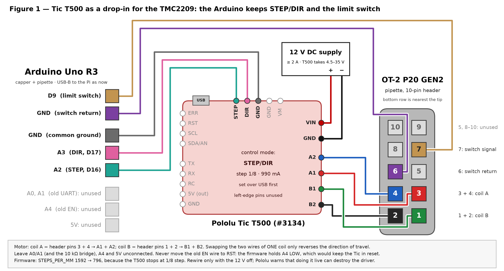
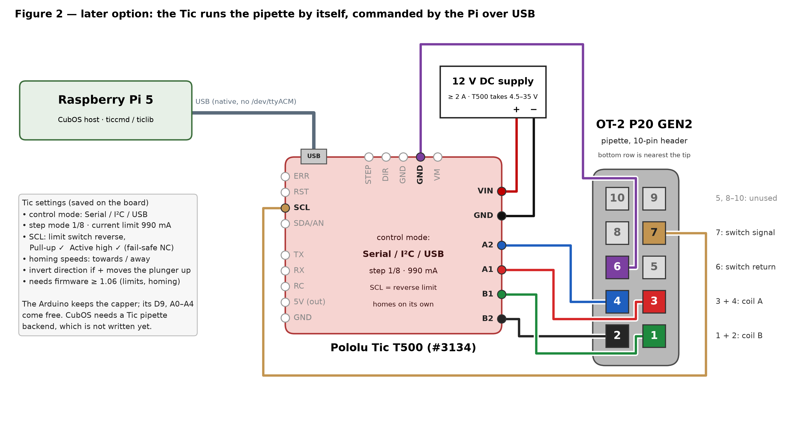

# Driving the P20 GEN2 with a Pololu Tic T500

Written 2026-09-29, as a candidate replacement for the condemned Adafruit 6121
TMC2209 board (§22 of [`opentrons-pipette-wiring.md`](./opentrons-pipette-wiring.md)).
**Status, 2026-09-30: the pipette works on the Tic.** With `STEPS_PER_MM 796`
flashed, the trio ran 12/12 (campaign 68), and Ben saw it aspirate, dispense and
drop the tip ([record](../results/pipette_test_20260930b/README.md)). The ruler
or balance check of the 796 scale is still open.
**Earlier, 2026-09-29 18:10: the plunger moves.** Bring-up steps 1, 3 and 5 are
done. Driven through the Arduino, the plunger went up about 28.7 mm and opened
the limit switch. It went down and closed it again, then reopened it after the
same 2 mm at every rate from 200 to 2,500 microsteps/s. The firmware's own
`HOME` then succeeded in 1.36 s. The polarity is right: direction 0 goes toward
the switch, so no `A1`↔`A2` swap is needed. What remains is steps 6 and 7:
confirm 796 microsteps/mm, then flash it. **Don't connect CubOS before step 7.**
Records: [switch test](../results/pipette_switch_search_20260929/README.md),
[first moves](../results/tic_t500_first_moves_20260929/README.md),
[settings](../results/tic_t500_settings_20260929/README.md). The Tic was left
**de-energized**; run `ticcmd --energize` before the next test. Every number
comes from the sources listed at the end.

The layout follows Cubware's
[`opentrons-pipette-setup.md`](https://github.com/Ursa-Laboratories/Cubware/blob/main/documentation/opentrons-pipette-setup.md)
diagram, with the TMC2209 swapped for a
[Tic T500](https://www.pololu.com/product/3134). The diagrams are generated by
[`_static/tic_t500_wiring.py`](./_static/tic_t500_wiring.py); edit the script
rather than the PNGs.

## Will the T500 do everything the pipette needs?

Yes, with one firmware constant to change. Nothing in the pipette's requirements
is outside the T500's specification.

| requirement | P20 GEN2 / this build | Tic T500 | |
| --- | --- | --- | --- |
| motor supply | 12–13 V (measured 13 V at the old terminals) | 4.5–35 V | ✅ |
| run current | Opentrons `plungerCurrent` **1.0 A** | current limit code 8 = **990 mA**; 1.5 A/phase continuous without a heat sink | ✅ |
| tip-eject current | Opentrons `dropTipCurrent` **1.0 A** for the P20 GEN2 | same setting | ✅ |
| idle current | Opentrons `idleCurrent` **0.3 A** | one current limit and no automatic hold reduction; it can be lowered on the fly over USB | ⚠️ needs host code (see below) |
| windings | 4.3 Ω and 3.7 Ω, measured 2026-09-23 | chopper current limiting, fine at 12 V | ✅ |
| microstepping | PANDA assumes 1/16 (`STEPS_PER_MM 1592`) | full, 1/2, 1/4, **1/8 max** | ⚠️ `STEPS_PER_MM` → **796** |
| speed | PANDA runs 2500 steps/s | up to 50,000 steps/s | ✅ |
| limit switch + homing | normally-closed switch to GND on header pins 6/7 | Figure 1: stays on Arduino D9, unchanged. Figure 2: the Tic's own limit-switch input and "Go home" (firmware ≥ 1.06) | ✅ |
| fault reporting | the TMC2209's UART readback never worked here (`comm = 0` in every session) | "Motor driver error" (over-current, over-temperature, over-voltage), "Low VIN" and the live VIN voltage, all readable over USB with `ticcmd --status` | ✅ better than before |
| safe out of the box | the 6121's current trimmer had been turned to full scale | the default current limit is **174 mA**, and it is set in software before 12 V goes on | ✅ |

What it does not do, none of which this build uses: encoder feedback (the Tic's
encoder input is for a hand-turned dial), stall detection, or finer than 1/8 step.
At 1/8 step one microstep is about 1.3 µm of plunger, about 0.001 µL on a P20.

### The UART question

The T500 has no pin that does what the TMC2209's `UART` pin did, and it does not
need one. On the TMC2209 that pin carried register writes (run current,
microstepping) and fault readback. On this machine the readback never worked:
`CMD 29` read `comm = 0` in every session, so nobody could confirm whether the
writes landed (§22.5 of the wiring doc).

The Tic is configured over **USB**, in the Tic Control Center or with `ticcmd`,
and it keeps those settings in its own memory. It also reports its state over
USB. Its `TX`/`RX` pins are a 5 V TTL serial port, which is a UART, but they are
for sending motion commands from a microcontroller. Neither figure below needs
them.

## Figure 1 — drop-in for the TMC2209 (do this first)

The Tic runs in **STEP/DIR mode** and takes the TMC2209's place. Everything
already proven stays as it is: the Arduino's `STEP`/`DIR` output, the limit
switch on D9, the PANDA command set, CubOS, and the capper on the same Arduino.
If the plunger turns, the old driver was the whole problem. If it doesn't,
`ticcmd --status` says why.

| from | to | wire | notes |
| --- | --- | --- | --- |
| header pin 3 | Tic `A1` | red | was TMC `1A` |
| header pin 4 | Tic `A2` | blue | was TMC `1B` |
| header pin 1 | Tic `B1` | green | was TMC `2A` |
| header pin 2 | Tic `B2` | black | was TMC `2B` |
| header pin 7 | Arduino `D9` | tan | unchanged |
| header pin 6 | Arduino `GND` | purple | unchanged |
| Arduino `A2` (D16) | Tic `STEP` (top edge) | | was TMC `STEP` |
| Arduino `A3` (D17) | Tic `DIR` (top edge) | | was TMC `DIR` |
| Arduino `GND` | Tic `GND` (top edge) | | common ground; `STEP`/`DIR` need it |
| 12 V supply `+` | Tic `VIN` | | the big terminal next to `GND` |
| 12 V supply `−` | Tic `GND` (terminal side) | | |
| Tic USB Micro-B | Raspberry Pi | data cable | for settings and status |

Leave these **unconnected**:

- **Arduino `A0`/`A1`** (the old UART pair). Remove the 10 kΩ bridge.
- **Arduino `A4`** (the old `EN`). Never move this wire to the Tic's `RST`: the
  firmware holds `A4` LOW, and `RST` LOW holds the Tic in reset.
- **Arduino `5V`**. The Tic makes its own 5 V, from USB or from `VIN`; joining
  the two 5 V rails would short two supplies together.
- **Every pin on the Tic's left edge.**

In STEP/DIR mode the pulses go straight through protection resistors to the
MP6500 driver IC. Pololu notes that this bypasses the Tic's speed and
acceleration limits and that the Tic then does not know the plunger's position.
Its limit-switch feature has nothing to act on either, since the pulses never pass
through its microcontroller. That is why the switch stays on D9, where the
firmware already stops upward moves on it.

**Coil wiring.** Coil A is header pins 3 + 4 and goes to `A1` + `A2`; coil B is
pins 1 + 2 and goes to `B1` + `B2`. Swapping the two wires of *one* coil only
reverses the direction of travel. Never split one coil across `A` and `B`:
that leaves the motor silent, with no buzzing (§16.3 of the wiring doc).

### Tic settings (Tic Control Center → Apply settings)

| setting | value | why |
| --- | --- | --- |
| Control mode | **STEP/DIR** | the default is Serial / I²C / USB |
| Step mode | **1/8** | the T500's finest |
| Current limit | **990 mA** | code 8, the nearest step at or below Opentrons' 1.0 A |

**Applied 2026-09-29** to the lab's T500 (serial `00510573`, firmware 1.09) and
read back byte-for-byte. Every other setting is the factory default. The
read-back is [`tic_p20.txt`](./tic_p20.txt), and
`ticcmd --settings tic_p20.txt` loads the same configuration onto another T500.

### Firmware: one constant, plus the bench tools

| where | change | why |
| --- | --- | --- |
| PANDA `include/Pipette.h` | `STEPS_PER_MM 1592.0` → **`796.0`** | 1592 assumed 1/16 step; the T500 stops at 1/8. Without this, every commanded millimetre travels two |
| same | `MICROSTEPPING 16` → `8` | only feeds the TMC2209 setup call, which now writes to nothing. Change it so the file isn't misleading |
| `cubos/tools/pipette_driver_probe.py`, `pipette_driver_measure.py` | `STEPS_PER_MM = 1592.0` → `796.0` | they send raw steps, so their labelled distances would double |

Two constants in `src/Pipette.cpp` already assumed 1/8 step:

- `backOffSteps = 796; // this is equal to 1mm`
- `stepsCount > 50000 // About 62mm of travel`

That 62.8 mm homing budget now covers the whole 46.5 mm stroke in one leg.

Each step is now twice as long, so the same step rates move the plunger twice as
fast. From the measured timings, moves go from 0.67 s/mm to about 0.34 s/mm
(≈ 3 mm/s), and the homing seek from ≈ 1.2 to ≈ 2.4 mm/s. Both are still well
under Opentrons' own P20 `dropTipSpeed` of 15 mm/s.

`CMD 29` (driver status) will keep returning `comm = 0`, which is meaningless
now. Read the driver with `ticcmd --status` instead.

### Bring-up, in this order

1. **USB only, no 12 V.** Connect the Tic to a laptop or the Pi and run
   `ticcmd --list`. Check the firmware version on the Status tab. Apply the three
   settings above. Until 12 V is connected the Tic reports "Low VIN" and won't
   energize. ✅ *Done on 2026-09-29 from the CubXL Pi, with VIN at 0.05 V
   ([record](../results/tic_t500_settings_20260929/README.md)).*
2. **Everything powered down** (the 12 V *and* the Arduino's USB). Wire it per
   the table. Pololu: *"Connecting or disconnecting a stepper motor while the
   Tic's motor power supply (VIN) is powered can destroy the motor driver."*
3. **Switch on 12 V at the supply**, not by pushing a live lead into the terminal.
   Run `ticcmd --status`: VIN should read about 12–13 V, with no errors and the
   operation state Normal. On the CubXL Pi that is
   `sudo ~/.local/opt/pololu-tic-1.8.1-linux-rpi/ticcmd --status`. In STEP/DIR
   mode, Low VIN was the only error left on the list after the settings went in,
   so the driver energizes and holds at 990 mA the moment VIN comes up. Switch
   the 12 V off between tests (or send `ticcmd --deenergize`) rather than leave
   it holding; see "Idle current" below.
   ✅ *2026-09-29 17:47: energized, Normal, no errors. VIN is 12.4 V
   de-energized and sags to about 10.5 V holding at 990 mA, so the supply is
   soft ([record](../results/tic_t500_first_moves_20260929/README.md)).*
4. **Holding torque.** Push the plunger gently by hand. It should now resist,
   which it never did on the 6121.
5. **1 mm down and back, before CubOS is involved.** In the Arduino IDE Serial
   Monitor (115200 baud, Newline), send `16,1,796,400` (1 mm down at 1/8 step,
   2 s), then `16,0,796,400` (back up). **If direction 1 moves the plunger up,
   power off and swap `A1`↔`A2`.** Homing seeks with `DIR` LOW, so on a reversed
   motor it would drive into the tip ejector instead of the switch.
   ⏳ *2026-09-29 17:52: all four moves (1 mm and 5 mm each way) returned `OK` at
   the commanded rate. At 17:57 the Tic stepped the same moves itself over USB.
   Neither run shows whether the shaft turned; see the record's decision table.*
   ✅ *2026-09-29 18:05–18:10: the limit switch settles it. UP opened the switch
   after about 28.7 mm, and 2 mm DOWN closed it again. It then reopened after
   2 mm at 200, 400, 800, 1,600 and 2,500 microsteps/s, so there was no stall
   at any firmware rate despite the abrupt starts. Direction 0 is UP, so no swap
   ([record](../results/pipette_switch_search_20260929/README.md)). The vibration
   Ben felt at 17:52 was the motor stepping at 50–100 full steps/s.*
6. **Ruler check.** Send `16,1,7960,800` and measure: 10 mm means 796 is right.
   Then send `16,0,7960,800` to come back. If the plunger can't be seen, the
   raw-step gravimetric check in the
   [switch-test record](../results/pipette_switch_search_20260929/README.md)
   separates 796 from 1592 by weight, about 7.5 mg against 3.7 mg of water.
7. **Flash the firmware with `STEPS_PER_MM 796`**, confirm `HOME` stops on the
   switch, and only then run a protocol. (`HOME` already stops on the switch on
   the current image. It doesn't use `STEPS_PER_MM`, and its 796-step back-off is
   1 mm at 1/8 step. What the flash fixes is every `MOVE_TO`, `ASPIRATE` and
   prime distance. Until then, if 796 holds, those are about twice as long as
   commanded.)
   ✅ *2026-09-30: flashed `panda_vcl_p20gen2_tic796_20260930.hex` (the GEN2
   image with 796, 5 bytes different, verified before and after), and `HOME`
   stopped on the switch in 0.94 s. The ruler check (step 6) is still open; 796
   is the value that cannot overshoot whichever scale is right. The first trio
   then stopped on a USB over-current trip
   ([record](../results/pipette_test_20260930/README.md)); Ben traced it to
   the `A2` motor lead coming loose. With it re-secured the trio ran **12/12**,
   every plunger command executed, and a before/after `HOME` (12.687 s /
   12.680 s) shows no lost steps
   ([record](../results/pipette_test_20260930b/README.md)).*

### Idle current: what to add once it moves

The Tic holds at its full current limit, so a stationary plunger dissipates about
4 W in the pipette body (0.99² A² × ~4 Ω). At Opentrons' 0.3 A idle current it
would be about 0.4 W. Warming the pipette is a volume error in an
air-displacement pipette, so this matters once accuracy does.

Pololu's own suggestion is to raise the limit for moves and drop it while
holding. Commands sent over USB still work in STEP/DIR mode, so CubOS can wrap
each plunger command with `ticcmd --current 990` / `ticcmd --current 343`. 343 mA
is code 3; 174 mA (code 2) is the next step down. `ticcmd --deenergize` is the
blunter option. None of this blocks the first tests.

## Figure 2 — the Tic on its own, over USB (later option)

Here the Arduino drops out of the pipette path and keeps only the capper. The Tic
does the homing, the limit, the motion profile, the position count and the fault
reporting itself, and the Pi commands it directly.

- **Wiring:** the coils and 12 V are the same as Figure 1.
- **Limit switch:** header pin 7 goes to Tic `SCL` and pin 6 to Tic `GND`.
- **USB:** the Tic's USB goes to the Pi.

| setting | value |
| --- | --- |
| Control mode | Serial / I²C / USB |
| Step mode / current limit | 1/8 / 990 mA |
| `SCL` pin | **Limit switch reverse**, **Pull-up ✓**, **Active high ✓** |
| Homing speed towards / away | e.g. 7,960,000 / 3,980,000 in Tic units (µsteps per 10,000 s), i.e. ≈ 1 / 0.5 mm/s at 1/8 step |
| Invert motor direction | tick it if positive moves drive the plunger *up* |
| Command timeout | disable it, or have the backend send `--reset-command-timeout` at least once a second. It defaults to 1 s in this mode, which would stop a multi-second plunger move partway |

In this mode the Tic also starts in **safe start**. After power-up or an error,
the backend has to send `ticcmd --resume` (energize plus exit safe start) before
anything moves.

`SCL` with pull-up and active-high is Pololu's recommended **fail-safe**
configuration for a normally-closed switch to GND, which is what this pipette
has. The pin reads LOW at rest, goes HIGH at the limit, and a broken wire reads
as "at the limit" rather than "clear". Limit switches and homing need Tic
firmware ≥ 1.06; the T500 has been supported since 1.04.

**What it costs:**

- **A new CubOS pipette backend.** Today's `OpentronsPipette` speaks the PANDA
  serial protocol. The backend would home with `ticcmd --home rev` and move with
  `--position` in microsteps, or use the `ticlib` Python package.
- **Non-root access on the Pi.** `ticcmd` has been on the Pi since 2026-09-29, in
  `~/.local/opt/pololu-tic-1.8.1-linux-rpi/` with nothing installed
  system-wide. Without Pololu's udev rule it needs `sudo`, though. A backend
  running as the login user needs that rule
  (`/etc/udev/rules.d/99-pololu.rules`); record it in the SOP when it goes in.

The Tic talks native USB (Pololu vendor ID `1ffb`, one vendor-specific
interface) rather than a USB serial port. This was confirmed on 2026-09-29: it
adds no `/dev/ttyACM*` device, and after a boot with the Tic already plugged in
the Arduino still came up as `/dev/ttyACM0`. Moving the configs to the `by-id`
paths is still worth doing first.

**What it buys:**

- The pipette no longer shares a serial link with the capper.
- A real homing routine.
- A position counter with a "position uncertain" flag.

It is the better long-term architecture, but it is new software. Figure 1 answers
the hardware question first with no new code.

## Sources

- Tic user's guide, [Pololu 0J71](https://www.pololu.com/docs/0J71), sections used:
  - §1: T500, MP6500, 4.5–35 V, 1.5 A continuous / 2.5 A peak, up to 1/8 step
  - §4.1–4.3: Low VIN 3.0 V; the warning about wiring while powered; the
    continuous-current table
  - §4.13: STEP/DIR mode
  - §4.14 and §5.5–5.6: limit switches, "Active high", fail-safe NC wiring,
    homing, and which pins are always pulled up or down
  - §5.4: MP6500 driver errors
  - §6: the T500 current-limit codes, 0–3093 mA, default 174 mA
- [Tic T500 pinout (tic03b)](https://www.pololu.com/product/3134), and the
  `ticcmd` options from
  [pololu-tic-software `cli/cli.cpp`](https://github.com/pololu/pololu-tic-software/blob/master/cli/cli.cpp).
- Tic software 1.8.1,
  [Linux (Raspberry Pi) build](https://www.pololu.com/docs/0J71/3.2): the
  `ticcmd` used on the CubXL Pi.
- Opentrons
  [`pipetteModelSpecs.json`](https://github.com/Opentrons/opentrons/blob/edge/shared-data/pipette/definitions/1/pipetteModelSpecs.json),
  `p20_single_v2.0`–`v2.2`: `plungerCurrent` 1.0, `dropTipCurrent` 1.0,
  `idleCurrent` 0.3 (v2.1 and v2.2).
- Header pin layout: [`_static/ot2-pipette-header-pinout.png`](./_static/ot2-pipette-header-pinout.png)
  (science-jubilee, MIT), read in §8.6 of the wiring doc. Coil resistances and
  the switch polarity: §3, §18 and §20.3 of the same doc.
