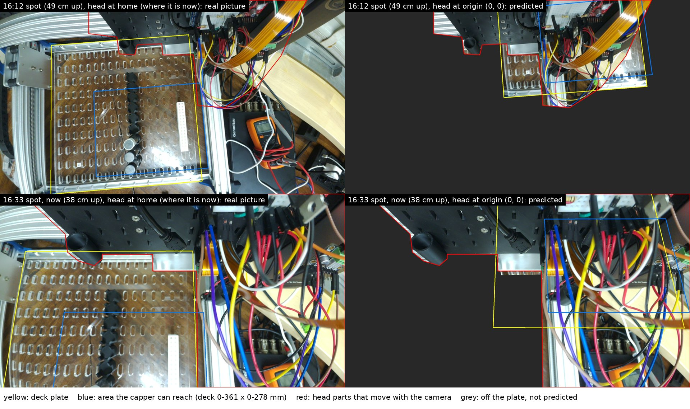

# 2026-10-07: can camera 0 see the whole deck with the head at the origin?

Asked on [#165](https://github.com/vertical-cloud-lab/byu-vcl/issues/165) at 16:16 MDT:
*"you know the distance between the vials and the vial tips seen in the camera (I want to
focus on the camera that has a bigger field of view). Is this camera in a place where it
will be able to see the whole deck if the gantry moved to the origin?"*

**No.** Camera 0 rides on the head. Moving the head from home to the origin (0, 0) carries
the camera 361 mm left (−X) and 278 mm toward the front (−Y). The deck then shows up at the
top right of the picture. That is where the head's own backboard and wiring hang in front
of the lens. From the spot camera 0 was in at 16:12, only about 15% of the deck plate would
be visible. From the spot it is in now (16:33), about 8% would be visible. With the head at
home, the 16:12 spot sees the whole plate.

Nothing was moved for this. The gantry, pipette and capper were not touched, and the only
thing run on the Pi was `rpicam-still`.

## Which camera, and where

- Both cameras are Camera Module 3 Wide (`imx708_wide`), so both lenses see the same angle.
  Camera 0 (CAM/DISP 0) is the one that sees the whole deck.
- Camera 0 rides on the head. It did on 2026-10-02 ([jog test](../jog_test_20261002/README.md)),
  and `camera_3` in `cub_xl_ben_3_instrument.yaml` is a head-mounted camera. So moving the
  head moves the camera. The backboard, the black tube, the silver plate and the wires
  hanging from the electronics stay in the same place in its picture.
- The head was at home the whole time. The last gantry command on the Pi was campaign
  112's `$H` at 12:57 MDT, and nothing has opened `/dev/ttyUSB0` since. The CH340
  re-enumerated at 15:03:22 MDT after being unplugged for 5 s. That resets GRBL but does not
  move the head.
- Camera 0 was moved by hand during the afternoon. Two spots are analysed:
  - **16:12 spot**: frame 6 of the [2026-10-07 burst](../cameras_20261007/README.md), the
    last whole-deck picture before the question (`frames/cam0_161211_burst.jpg`).
  - **16:33 spot**: the camera did not move between 16:25 and 16:33, so it has settled here
    (`frames/cam0_163350.jpg`). At 16:18 it was somewhere in between.
  - Someone was handling camera 1 at 16:18 and 16:25. Its pictures show a hand, then a
    finger over the lens.

## How

1. **The deck plate is Cubware's `PandaDeck`**
   ([`cubxl_plus/deck/polycarbonate_deck`](https://github.com/Ursa-Laboratories/Cubware/tree/8f0f0ed/cubxl_plus/deck/polycarbonate_deck)):
   480 × 490 mm, with 18 × 10 slots of 10 × 25 mm on a 25 mm (X) × 45 mm (Y) grid.
   [`tools/deck_geom.py`](tools/deck_geom.py) reads these from the STL. The plate on the
   CubXL has the same 18 × 10 slots.
2. **Camera position and aim from the slot grid.** Slot centres were found in each picture
   and matched to the grid. The camera's position and aim were then solved from them with
   OpenCV. The focal length is the lens's nominal 2.75 mm (1.4 µm pixels), and the radial
   distortion is fitted from the grid. Residuals: 0.7 px RMS from 42 slots at 16:12, and
   2.0 px from 36 slots at 16:33. The check images are `fits/spot1612_grid.jpg` and
   `fits/spot1633_grid.jpg`.
3. **Check against the deck file**, as suggested. These are from the 16:12 picture and
   `ben_2vials_tiprack.yaml` (`fits/spot1612_labware.json`):

   | | measured | file |
   | --- | --- | --- |
   | vial column (x 136.668) to tip-rack centre line (x 287.082) | 150.3 mm | 150.4 mm |
   | tip-rack top height, from its 8.5 mm hole pitch | 68 mm | `height: 66` |
   | vial-top height, from their 33 mm spacing | 86 mm | `height: 83` |

   This also puts the deck's (0, 0) at plate (142, 38) mm. In X, the vials and the tip rack
   agree to 0.1 mm. The Y value comes from the vials, taking the front two silver-topped vials
   as `vial_1` and `vial_2`. The back end of the tip rack agrees with it to 3 mm.
4. **The origin view.** The camera moves by (−361, −278) mm with the head and keeps its aim.
   The plate was projected into that view ([`tools/origin_view.py`](tools/origin_view.py)).
   The head's parts were outlined by hand in each home picture
   (`fits/*_head_parts.json`). Any part of the deck behind them counts as blocked.

## Results

| | 16:12 spot | 16:33 spot (now) |
| --- | --- | --- |
| Camera height above the plate | 49 cm, 5° from vertical | 38 cm, tilted 13° toward the back |
| Camera position relative to the capper | 96 mm −X, 83 mm −Y | 77 mm −X, 30 mm −Y |
| Head at home: plate in frame / not blocked | 100% / 95% | 71% / 66% |
| Head at home: reachable area not blocked | 100% | 62% |
| **Head at origin: plate in frame / not blocked** | **68% / 15%** | **83% / 8%** |
| Head at origin: reachable area not blocked | 9% | 0% |
| Head at (0, 0, 0), so the camera is also 122 mm lower: plate not blocked | 17% | 5% |

The "reachable area" is the capper's working volume, deck X 0–361 mm and Y 0–278 mm. On
the plate that is X 142–503 mm and Y 38–317 mm, so it overhangs the plate's right edge by
23 mm.

At the origin, the deck appears at the top right of the picture, behind the backboard and
the wiring. The back of the plate is also beyond the top edge of the frame: past plate Y
350 mm from the 16:12 spot, and past 408 mm from the 16:33 spot.

## What would work

- **Take whole-deck pictures with the head at home**, where every protocol ends. The 16:12
  spot was right for that. The whole plate is in frame, only the back-right corner is behind
  the head, and all of the reachable area is clear.
- **The 16:33 spot is too low and tilted toward the back.** Even with the head at home, the
  front third of the deck is below the bottom of the picture, and that is where the vials
  are. Raising the camera about 10 cm and pointing it straight down gets back the 16:12 view.
- **Tie back the wires hanging in front of camera 0.** At 16:33 they cover the right third of
  its picture, wherever the head is.
- **From the origin, a camera on the head can't see the whole deck.** It would have to look
  back and to the right, past the backboard, and then from home it would look off the deck.
  A camera fixed to the frame, above the middle of the deck, sees the whole deck wherever the
  head is, except where the head itself is in the way. See
  [`cubos/deck-camera/README.md`](https://github.com/vertical-cloud-lab/byu-vcl/blob/e40753a/cubos/deck-camera/README.md).

## Caveats

- The focal length is the nominal value. If it is a few percent off, the heights change by
  the same few percent. The answer does not change.
- The head-part outlines are drawn by hand, and the wires can swing. The percentages are
  approximate. The conclusion is not.
- If camera 0 is actually fixed to the frame rather than the head: from the 16:33 spot it
  misses the front third of the deck wherever the head is. From the 16:12 spot the whole
  plate is in frame.

## Files

- `origin_views.jpg`: the figure above. Each home view is the real picture. Each origin view
  is the plate taken from that picture and re-projected for the camera's position at the
  origin.
- `frames/`: camera 0 at 16:12 (copied from the burst), 16:18 (full 4608 × 2592), 16:25 and
  16:33, and camera 1 at 16:18 and 16:25. Each has its `rpicam-still --metadata` file.
- `fits/`: grid-fit check images, the camera poses, the labware check, the origin results and
  the head-part outlines, all as JSON.
- `tools/`: the scripts, in the order they run: `deck_geom.py`, `slots.py` (16:12) or
  `slots_tm.py` (16:33, template matching), `gridfit.py`, `pose.py`, `labware_check.py`,
  `origin_view.py` and `compose.py`.
