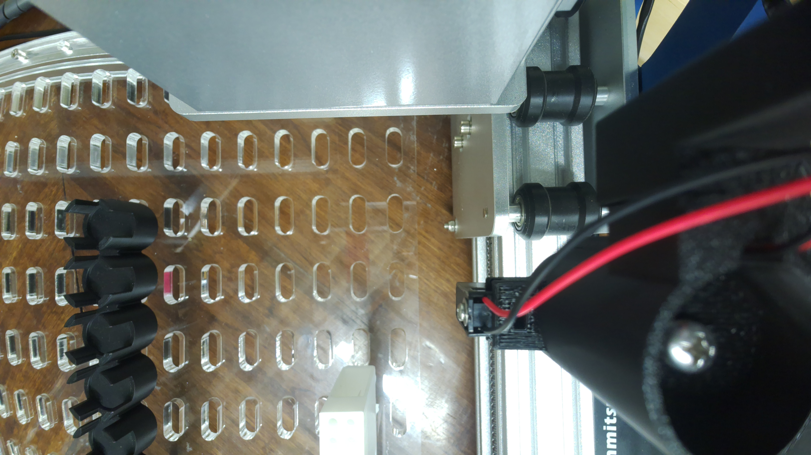

# 2026-10-02: a picture from each camera on the CubXL Pi

CubXL Pi, lab-local time (MDT, UTC−6). Requested in
[#165](https://github.com/vertical-cloud-lab/byu-vcl/issues/165): *"post a picture
from each camera connected to the pi."* Everything here was read-only apart from taking the
picture. The gantry, the pipette and their serial ports were not touched.

## There is one camera

| Connector | What the Pi found |
| --- | --- |
| Ribbon, **CAM/DISP 1** (`csi1`, I²C bus 11) | Camera Module 3 Wide: `imx708_wide` at `0x1a`, with its `dw9807` focus motor at `0x0c` |
| Ribbon, **CAM/DISP 0** (`csi0`) | Nothing. The controller is left `disabled`, which happens when no camera is detected there at boot |
| USB | No camera. The three USB devices are the Tic T500, the Arduino Uno and the gantry's CH340 |

`rpicam-hello --list-cameras` lists only camera 0. `/dev/video0` to `video7` and
`video19` to `video35` exist, but they are not extra cameras. `video0` to `video7`
are this camera's CSI front end, and the rest belong to the image signal processor
and the HEVC decoder (`v4l2-ctl --list-devices`).

**The ribbon connectors are only checked at boot** (`camera_auto_detect=1` in
`/boot/firmware/config.txt`), and the Pi has been running since 2026-09-30. A camera
plugged into CAM/DISP 0 after that will not show up until the Pi restarts. Only connect
or disconnect a ribbon cable with the Pi powered off.

## The picture, 15:26:39



This is the full-resolution image (4608 × 2592), unedited, taken with:

```bash
rpicam-still --nopreview -t 4000 -o deck-camera-2026-10-02.jpg
```

Its capture metadata is in [`deck-camera-2026-10-02.json`](deck-camera-2026-10-02.json).
Nobody was watching the
[`deckcam`](https://github.com/vertical-cloud-lab/byu-vcl/tree/e40753a/cubos/deck-camera)
live view, so the camera was free and no stream was interrupted.

- The exposure was 62.5 ms at 4× analogue gain, at about 3,200 K. The room is still dim.
- Autofocus settled at a lens position of 2.8 dioptres, which means a focus distance of
  about 36 cm.
- A black part with a red and black lead sits close to the lens. It blocks the
  right-hand third of the frame.
