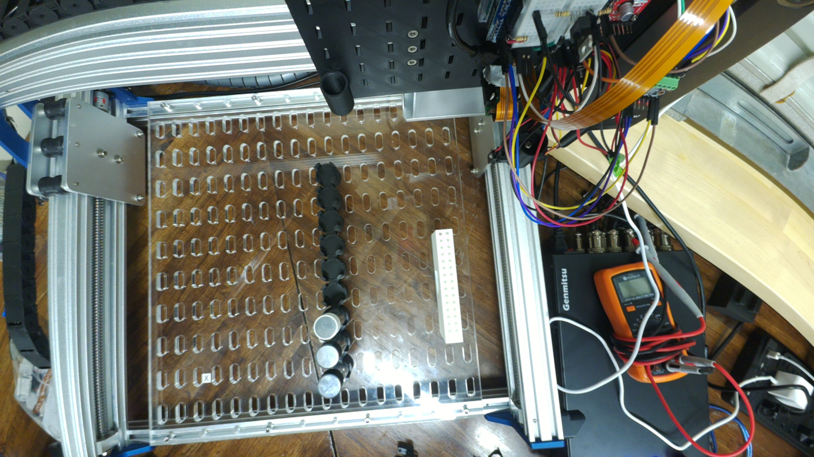
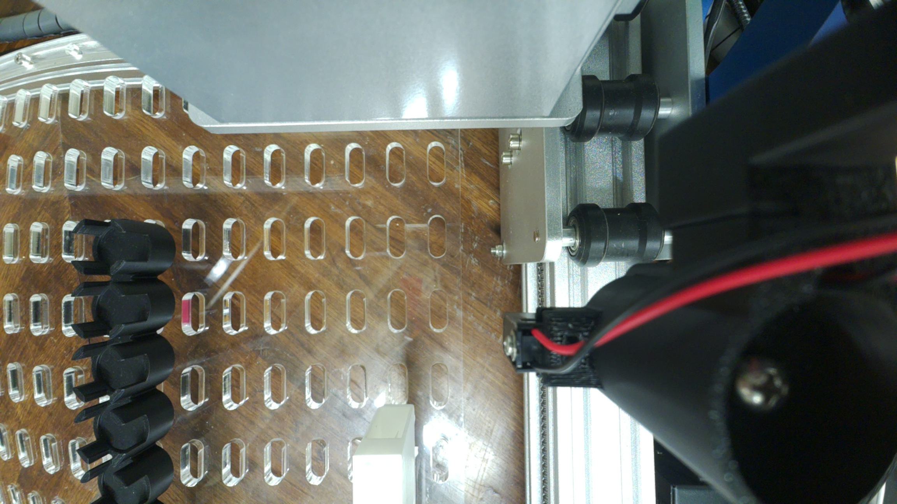
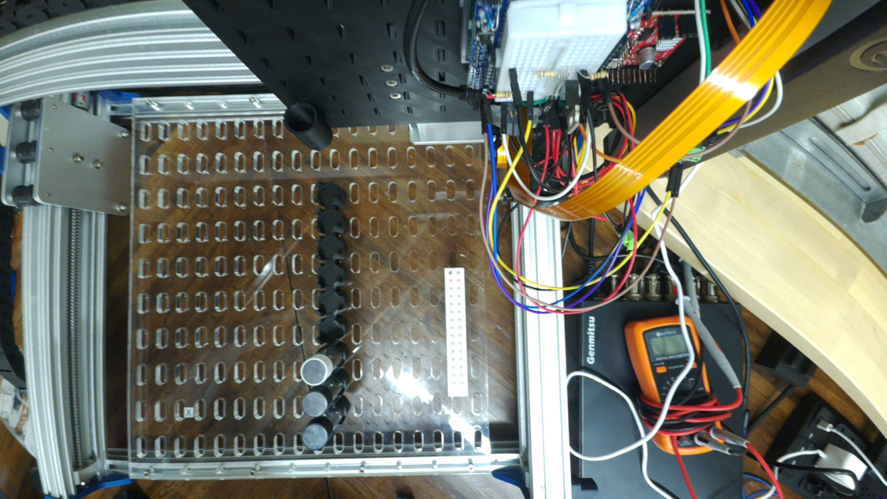
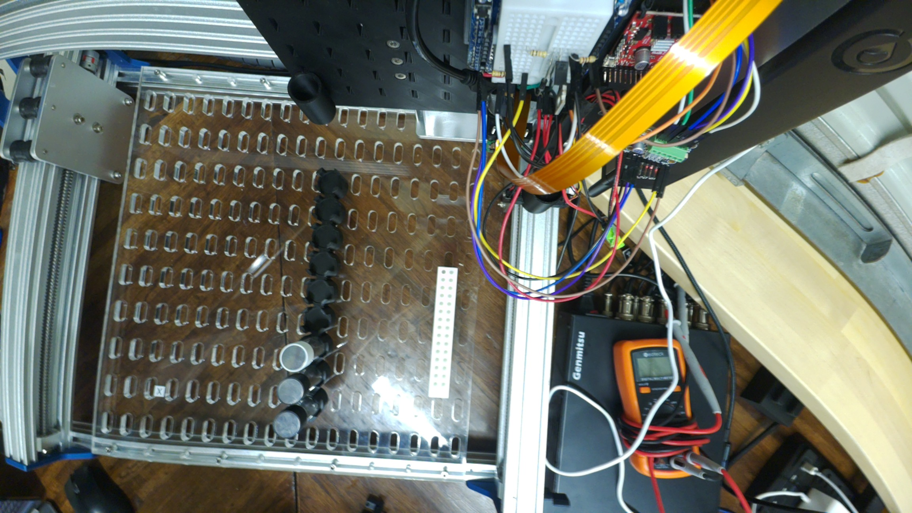
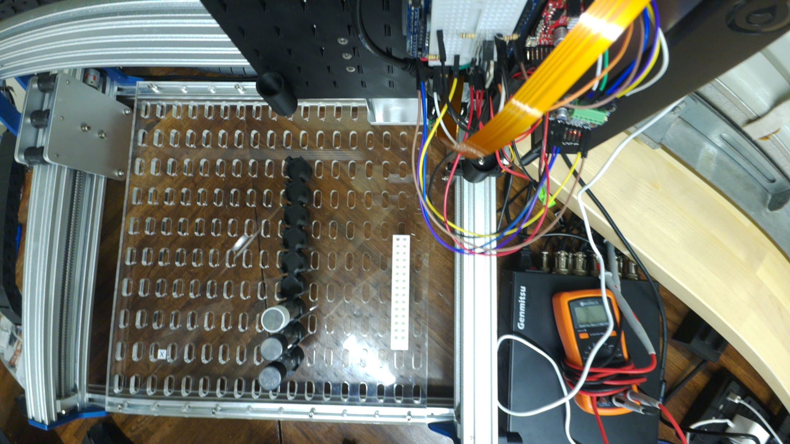
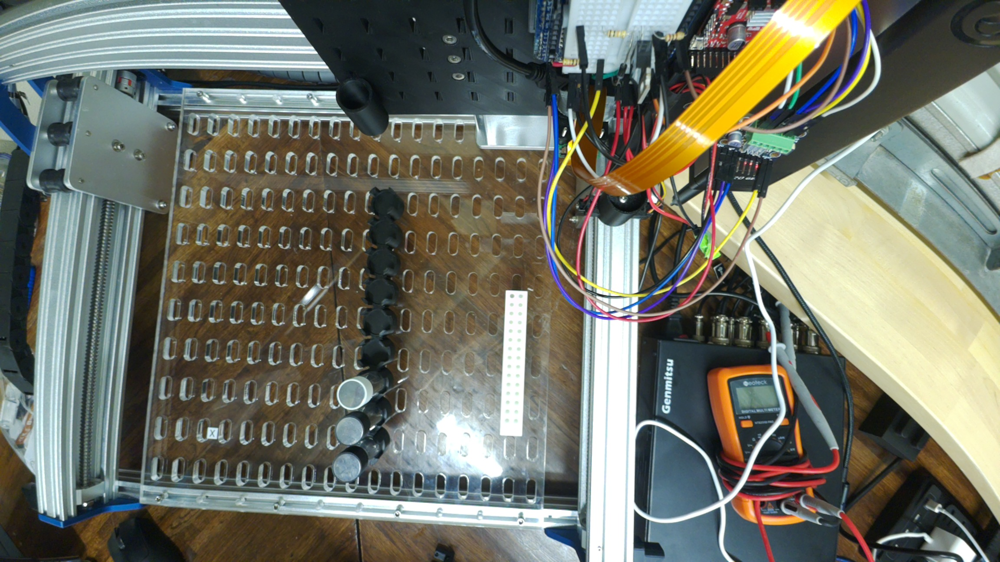
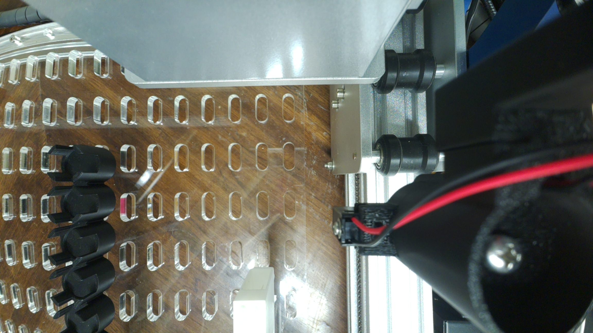
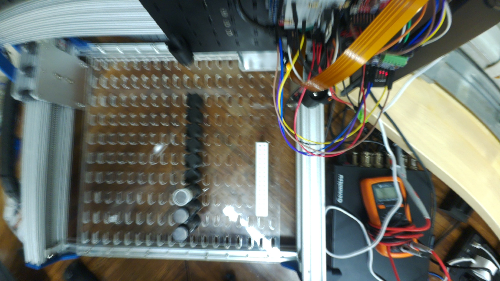
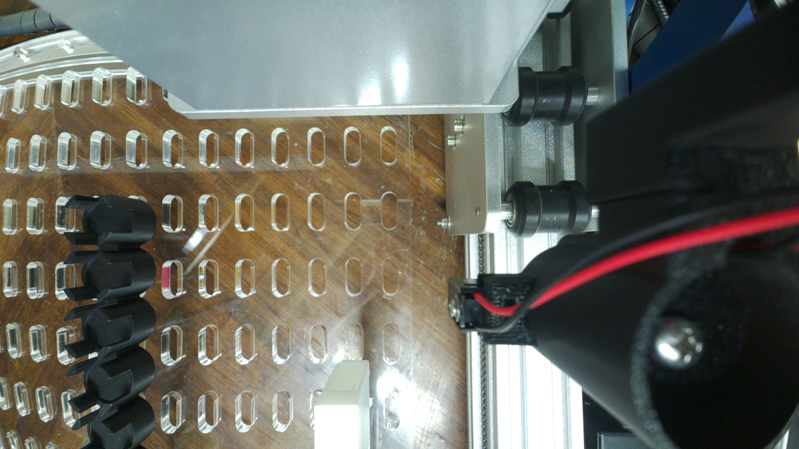
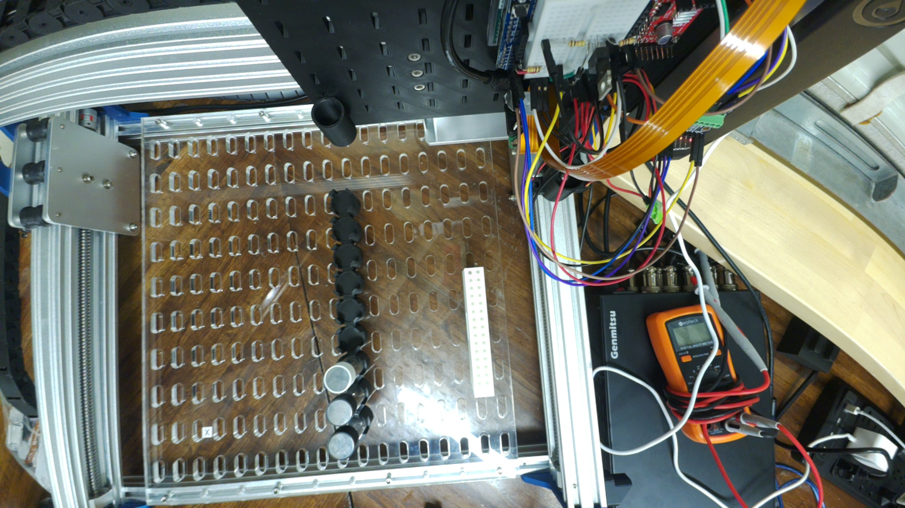

# 2026-10-07: both CubXL Pi cameras, every 10 s for a minute

CubXL Pi, lab-local time (MDT, UTC−6). Requested in
[#165](https://github.com/vertical-cloud-lab/byu-vcl/issues/165) at 16:07:57: *"send me a
picture from both cameras (1 every ten seconds start in 1 minute and take pictures for 1
minute)."* Only pictures were taken. The gantry, the pipette and their serial ports were
not touched.

## Timing

The requested window was 16:08:57 to 16:09:57. The job that took the pictures only reached
the Pi at about 16:11, so they ran from **16:11:11 to 16:12:11**, about 2¼ minutes late.
There are seven pairs, at 0, 10, ... 60 s. The two pictures in each pair were taken within
0.01 s of each other. The times below are each frame's own `FrameWallClock`.

## Pictures

Camera 0 is on ribbon connector CAM/DISP 0 and sees the whole deck. Camera 1 is on
CAM/DISP 1, beside the capper. Both are Camera Module 3 Wide.

| # | Time | Camera 0 (CAM/DISP 0) | Camera 1 (CAM/DISP 1) |
| --- | --- | --- | --- |
| 0 | 16:11:11 |  |  |
| 1 | 16:11:21 |  |  |
| 2 | 16:11:31 |  |  |
| 3 | 16:11:41 |  |  |
| 4 | 16:11:51 |  |  |
| 5 | 16:12:01 |  |  |
| 6 | 16:12:11 |  |  |

Each picture's capture metadata (exposure, gain, focus) is in the `.json` file with the
same name.

## What moved

- **Camera 1 did not move.** Each of its pictures lines up with the one before to the
  pixel (phase correlation: zero shift, peak about 0.9). The gantry carriage at the right
  of its view stays put too, so the gantry did not move.
- **Camera 0 moved throughout the minute.** Its view changes between every pair of
  pictures, and not by a simple shift (correlation peak 0.03 or less). Picture 5 is
  blurred with double edges, so it was moving during that 50 ms exposure.

## Focus

Autofocus ran from scratch for every picture. Camera 1 settled at 1.4–1.6 dioptres (about
65 cm) every time. Camera 0 settled anywhere from 0 to 0.8 dioptres, partly because it was
moving. Once camera 0 is in its final place, lock its focus as described in
[`cubos/deck-camera/README.md`](https://github.com/vertical-cloud-lab/byu-vcl/blob/e40753a/cubos/deck-camera/README.md).

## How

[`tools/burst.py`](tools/burst.py), piped to `python3` on the Pi over SSH. At each tick it
starts one `rpicam-still` per camera, in parallel. Each runs 2.5 s of preview so that
exposure, white balance and focus can settle, then takes a 2304 × 1296 still. That is the
sensor's 2 × 2 binned mode, which keeps the full field of view: every frame's `ScalerCrop`
is the whole 4608 × 2592 sensor. Apart from its usual hint about `--zsl` and its
mode-selection report, `rpicam-still` printed nothing. [`burst.log`](burst.log) is the
script's own log, in UTC.

No `rpicam` process was running beforehand, so nobody had the `deckcam` live view open and
nothing was interrupted. Nothing on the Pi was changed. The script's temporary folder
(`/tmp/burst_20261007`) was deleted afterwards.
