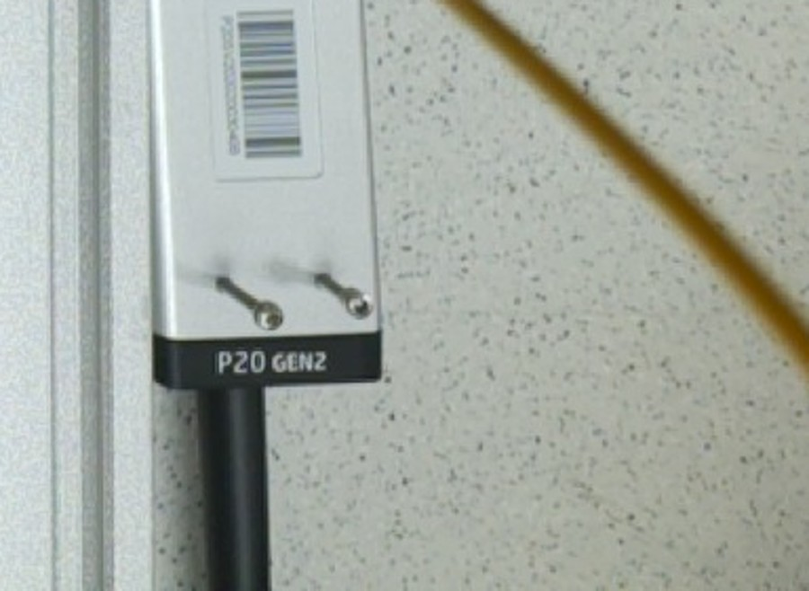

# CubOS provisioned on the new CubXL Pi (`rpi-5-des4`) — 2026-09-14

Requested by @jarrettshupe: *"install CubOS on the Pi, but wait to run the trio. Just get
it ready for someone else to run."*

**No protocol was run and no motion was commanded.** Both serial ports were opened
read-only (GRBL `$$`/`?`, Arduino status queries) and the two cameras each took one test
frame. Nothing was written to the GRBL controller, and the electromagnet was explicitly
de-energized at the end of the Arduino read.

---

## What is now on the Pi

| | |
| --- | --- |
| Host | `rpi-5-des4` — Raspberry Pi 5 Model B Rev 1.1, **1 GB RAM** + 989 MiB swap |
| OS | Debian 13 (trixie), kernel 6.18.34, arm64 |
| Python | 3.13.5 (system), CubOS venv at `~/CubOS/.venv` |
| CubOS | `~/CubOS` @ **`cbc33dc`** + **all four** local patches |
| This repo | `~/byu-vcl` on branch `claude/issue-165-20260730-2304` |
| Network | **wlan0 only** (`eth0` down) — rate-cap any large transfer |
| Disk | 3.2 G used of 29 G. CubOS 132 M, byu-vcl 14 M |

### The one package that had to be installed

`git` was missing (so were `pip` and `ffmpeg`; `python3 -m venv` already bundles pip, and
`patch`, `curl`, `wget`, `gcc`, `make`, `v4l2-ctl` and `rpicam-still` were all present).

```bash
sudo apt-get install -y --no-install-recommends git   # git, git-man, liberror-perl
```

`apt upgrade` was **deliberately not run** — 109 packages are upgradable on this device and
that is not a change to make unattended on lab hardware.

`ffmpeg` is absent and **not needed**: both cameras are CSI, so the capture harness uses
`rpicam-still`. It would only be needed for a USB UVC camera.

### Install recipe, as executed

```bash
# CubOS at the validated commit. Blobless clone keeps the wifi transfer small.
cd ~ && git clone --filter=blob:none https://github.com/Ursa-Laboratories/CubOS.git
cd ~/CubOS && git checkout cbc33dc
export PIP_TIMEOUT=600 PIP_RETRIES=2
python3 -m venv .venv
.venv/bin/python -m pip install --upgrade pip
.venv/bin/python -m pip install -e packages/core        # pyserial, pyyaml, pydantic
.venv/bin/python -m pip install pytest                  # for the regression check below

# This repo, single branch, blobless
cd ~ && git clone --filter=blob:none --single-branch \
  --branch claude/issue-165-20260730-2304 \
  https://github.com/vertical-cloud-lab/byu-vcl.git

# The four local patches, in the order cubos/patches/README.md documents
cd ~/CubOS
for p in pawduino-connect-boot-banner \
         cap-release-confirm-after-retract \
         tipped-hover-clamp-and-ceiling-travel \
         pipette-connect-tolerate-failed-home; do
  git apply ~/byu-vcl/cubos/patches/$p.patch
done
git diff --stat      # 9 files changed, 173 insertions(+), 19 deletions(-)
```

All four applied cleanly. No manual conflict resolution was needed.

**Why `cbc33dc` and not CubOS `main`:** every geometry number, trace and campaign on this
branch was validated against `cbc33dc`, and the four patches are written against that tree.
Upgrading is a separate, deliberate step — see *Known upgrade available* below.

---

## Verification — five gates, all against the committed trio

Trio: [`cub_xl_ben_pipette_capper.yaml`](../../configs/gantry/cub_xl_ben_pipette_capper.yaml) ·
[`ben_6vials_tiprack.yaml`](../../configs/deck/ben_6vials_tiprack.yaml) ·
[`pipette_test.yaml`](../../configs/protocol/vcl/pipette_test.yaml)

| gate | result | log |
| --- | --- | --- |
| `validate_setup` | **PASS** | [`validate_setup.log`](validate_setup.log) |
| `run_protocol --mock` | **12/12 steps** | [`mock.log`](mock.log) |
| `passive_shadow` | **0 interferences** (28 poses, 36 obstacles) | [`shadow_nominal.log`](shadow_nominal.log) |
| `passive_shadow --tip-stuck` | **0 interferences** | [`shadow_tipstuck.log`](shadow_tipstuck.log) |
| upstream test suite | **2020 passed, 3 failed, 17 skipped** | [`pytest.log`](pytest.log) |

### The 3 test failures are expected, and that was proved rather than assumed

They are the upstream tests for the three patches that deliberately change behaviour:

| failing test | the patch that changes it |
| --- | --- |
| `test_connect_sends_line_break_handshake` | `pawduino-connect-boot-banner` |
| `test_exact_action_order` | `cap-release-confirm-after-retract` |
| `test_connect_raises_when_homing_fails` | `pipette-connect-tolerate-failed-home` |

To confirm they are patch-induced and not an artefact of Python 3.13 or this install, the
same three tests were run in a **pristine `cbc33dc` worktree** with `PYTHONPATH` pointed at
its own `src` (import path verified in the log):

```
3 passed in 0.58s
```

The worktree was removed afterwards; `git diff --stat` on `~/CubOS` is unchanged.

---

## Hardware read, read-only

### GRBL controller — matches the gantry config exactly

```
$20=1  $21=0  $22=1  $23=0  $27=3.000  $100=$101=$102=400.000
$130=409.000  $131=309.000  $132=124.000
<Alarm|WPos:409.000,309.000,124.000|FS:0,0|WCO:-409.000,-309.000,-124.000>
```

`$130/$131/$132` are in `Gantry._validate_grbl_settings`' critical set and are compared at
0.001 mm. They match the gantry file's `max_travel_x/y/z` (409 / 309 / 124) exactly, and
`$20=1` matches `soft_limits: true`. **So the next run will not abort at connect with
"Critical GRBL settings mismatch"** — the failure that blocked 2026-08-26 and 2026-08-31.

`Alarm` is normal: the board resets when the port is opened. Re-home before any run.

### Capper + pipette Arduino

```
boot banner   3.76s  'OK:Ready'
cmd 7   capper line-break sensor     OK:{"value1":0}
cmd 14  pipette STATUS               OK:{"homed":0,"pos":0.00,"max_vol":300.00}
cmd 6   electromagnet OFF            OK:{"msg":"Electromagnet off"}
```

The banner lands at **3.76 s**, identical to the old Pi and well past the stock
`_ARDUINO_SETTLE_TIME = 2.0` — so `pawduino-connect-boot-banner` is required on this Pi
too, and it is applied. Nothing is held at the capper head, and the magnet was left off.

`max_vol: 300.00` is the firmware's `MAX_VOLUME`: the Arduino is still running P300
firmware. See the pipette note below.

### Serial devices — address them by `by-id`, not `ttyUSB0`/`ttyACM0`

```
/dev/serial/by-id/usb-1a86_USB_Serial-if00-port0                               -> ttyUSB0  GRBL gantry
/dev/serial/by-id/usb-Arduino__www.arduino.cc__0043_03535343335351018130-if00  -> ttyACM0  capper + pipette
```

The Arduino's serial (`…8130`) is the same board that was on the old Pi. Both ports were
free before and after this session. The gantry config's `/dev/ttyUSB0` and `/dev/ttyACM0`
happen to be correct today, but those names are assigned in enumeration order and swap on
replug — the `by-id` paths above are the safe thing to name if a third serial device ever
appears.

### Nothing new listens on the tailnet

`ss -tulnH` shows only `sshd` (and tailscaled's own sockets) bound to a tailnet-facing
address, which is what the `tag:rpi-5-des4` grant allows (`tcp:22` only). CubOS was
installed as a venv and **no service, unit file or cron entry was created** — nothing
starts on boot, and the API server was not configured.

---

## 📷 Cameras — both work, but only one is usefully aimed

Both are Camera Module 3 Wide (`imx708_wide`, 4608×2592) on CSI, detected as `cam0_csi0`
and `cam1_csi1`, and both captured a test frame in well under a second.

| camera | test frame | what it sees |
| --- | --- | --- |
| `cam0_csi0` | [`testshot_cam0_csi0.jpg`](testshot_cam0_csi0.jpg) | Overhead-ish view of part of the deck: perforated deck plate, the gantry rail, the cable drag chain, and the pipette assembly |
| `cam1_csi1` | [`testshot_cam1_csi1.jpg`](testshot_cam1_csi1.jpg) | **Rotated 90°**, and the frame is dominated by the machine's side panel and the room behind it — only a corner of the deck is in view |

🔴 **As aimed today, the eight run frames would not answer the questions the harness was
written for.** Its four default capture points are `decap vial_1`, `aspirate`,
`decap vial_2` and `drop_tip` — i.e. *did the cap come off*, *did the tip seat and enter
the vial*, *where did the tip go*. Neither test frame clearly shows the vial holder or the
tip rack. Before the run is worth photographing:

- **Aim `cam1` at the deck** and correct its rotation (it is mounted portrait against a
  landscape sensor). `rpicam-still` takes `--rotation 90`/`270`; the harness does not pass
  one yet, so the simplest fix is physical.
- **Point one camera at the vial column** (deck x ≈ 192–220, y ≈ 13–200) and the other at
  the tip rack (deck x ≈ 336, y ≈ 37).

Check the framing without moving anything:

```bash
~/CubOS/.venv/bin/python ~/byu-vcl/cubos/tools/run_with_camera_capture.py \
    --test-shot --outdir /tmp/camtest
```

### ✅ One thing the test frame did settle: the pipette is a **P20 GEN2**



`cam0`'s frame carries a legible `P20 GEN2` stamp on the pipette body. That closes the
question left open on 2026-09-09 ("whether your pipette is Gen1 or Gen2 — that one's a
label on the body"), and it fixes two numbers that were previously a range:

| | Gen1 | **Gen2 — this machine** |
| --- | --- | --- |
| science-jubilee `M906` current | 350 mA peak | **500 mA peak** |
| science-jubilee `M92` steps/unit | 48 | **200** |
| ⇒ PANDA `RUN_CURRENT_PERCENT` | ~11 | **~17** |

The firmware currently runs `RUN_CURRENT_PERCENT 50`, on the order of **1.25 A peak** —
about **2.5× the Gen2 motor's rating**. That is worth fixing before the first move that
actually turns the motor, together with fitting the Adafruit 1515 heat sink. See
[`cubos/docs/opentrons-pipette-wiring.md`](../../docs/opentrons-pipette-wiring.md) §8.

---

## Runbook — for whoever runs it

Run from a **foreground** SSH session, not `nohup` and not the API server: any `breakpoint:`
in a protocol is skipped in a non-interactive run (CubOS logs *"Breakpoint skipped because
stdin is not interactive"* and **continues**).

```bash
cd ~/byu-vcl && git fetch origin && git checkout claude/issue-165-20260730-2304 && git pull

C=~/byu-vcl/cubos/configs
G=$C/gantry/cub_xl_ben_pipette_capper.yaml
D=$C/deck/ben_6vials_tiprack.yaml
P=$C/protocol/vcl/pipette_test.yaml
PY=~/CubOS/.venv/bin/python

# 1. offline gates (no ports opened, nothing moves)
$PY -m cubos.tools.validate_setup      $G $D $P
$PY -m cubos.tools.run_protocol --mock $G $D $P
$PY ~/byu-vcl/cubos/tools/passive_shadow.py $G $D $P
$PY ~/byu-vcl/cubos/tools/passive_shadow.py $G $D $P --tip-stuck

# 2. cameras, with nothing moving
$PY ~/byu-vcl/cubos/tools/run_with_camera_capture.py --list
$PY ~/byu-vcl/cubos/tools/run_with_camera_capture.py --test-shot --outdir /tmp/camtest

# 3a. the run, plain
$PY -m cubos.tools.run_protocol $G $D $P

# 3b. or the run with 4 frames per camera at the step boundaries
$PY ~/byu-vcl/cubos/tools/run_with_camera_capture.py --outdir /tmp/run_frames -- $G $D $P

# 3c. or the run with every plunger command timed
$PY ~/byu-vcl/cubos/tools/run_with_plunger_trace.py $G $D $P
```

**Note the invocation difference.** `validate_setup` and `run_protocol` are CubOS modules
(`-m cubos.tools.X`). The tools in *this* repo are run **by path** — they were deliberately
not copied into the CubOS tree, so `cd ~/CubOS && git diff --stat` stays a truthful report
of exactly which patches are applied and nothing else.

### Expected behaviour on the first run

- **Re-home first.** GRBL sits in `Alarm` because the board resets when the port opens.
- **The plunger will not move the pipette.** The limit switch reads asserted, so every
  retract (`pick_up_tip`, `blowout`, both `drop_tip` legs) is refused by the firmware in
  ~0.11 s; only the forward `prime` and `aspirate` emit steps, and the motor is not
  drawing coil current at all. Unchanged from campaign 83 — this is a wiring question,
  not a software one.
- **Campaign numbering restarts at 1 on this Pi.** The old Pi ended at campaign 83; this
  one has a fresh `~/.cubos/panda_data.db`, and the offline gates above already consumed
  campaigns 1–3 (mock runs write campaign rows too). Don't correlate campaign numbers
  across the two Pis.

---

## ⚠️ One patch that is not a bug fix

`pipette-connect-tolerate-failed-home.patch` was applied to reproduce the old Pi's
validated tree exactly, but it is the only one of the four that isn't fixing a defect: it
downgrades CubOS's refusal to start with an unreferenced plunger into a warning.

Upstream is right to refuse — without a home the firmware's counter is meaningless and an
absolute `MOVE_TO` lands somewhere unknown. It is applied here because with the limit
switch broken it is the difference between a run starting and a run aborting at connect
after ~53 s of homing seek, and because the plunger is not physically moving anyway. It
is **inert** whenever `HOME` succeeds.

**Take it off once the limit switch is fixed:**

```bash
cd ~/CubOS && git apply -R ~/byu-vcl/cubos/patches/pipette-connect-tolerate-failed-home.patch
```

The other three are load-bearing. In particular, reverting
`tipped-hover-clamp-and-ceiling-travel` means `cnc.safe_z` **must** drop from 115 to ≤ 89,
or nothing validates — that coupling is documented in
[`cubos/patches/README.md`](../../patches/README.md).

## Known upgrade available, deliberately not taken

CubOS `main` has moved on since `cbc33dc`. The upgrade worth planning is `1a9987f`
(2026-08-20), which introduced `PawduinoLink.acquire(port, baud)` so the capper and the
pipette share one arbitrated handle on `/dev/ttyACM0`. At `cbc33dc` each driver opens its
own `serial.Serial` on the same board: a second open can re-toggle DTR and reset it
mid-session, and both read one reply stream. It has not caused an observed failure here —
the Arduino has answered every command in every run — but it is real fragility.

Upgrading means re-validating every geometry number on this branch and re-basing the four
patches, so it is a deliberate exercise, not a `git pull`.

## Not done

- **The trio was not run** — that was the explicit instruction. No homing, no G-code, no
  motion of any kind was commanded.
- No systemd unit, no cron entry, no API server, nothing configured to start on boot.
- The cameras were not re-aimed or physically adjusted — that needs hands on the machine.
- No firmware was flashed, no wiring was touched, and `RUN_CURRENT_PERCENT` was left at 50.
- `apt upgrade` was not run (109 packages pending).
