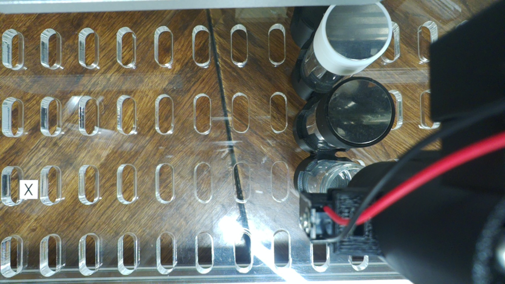
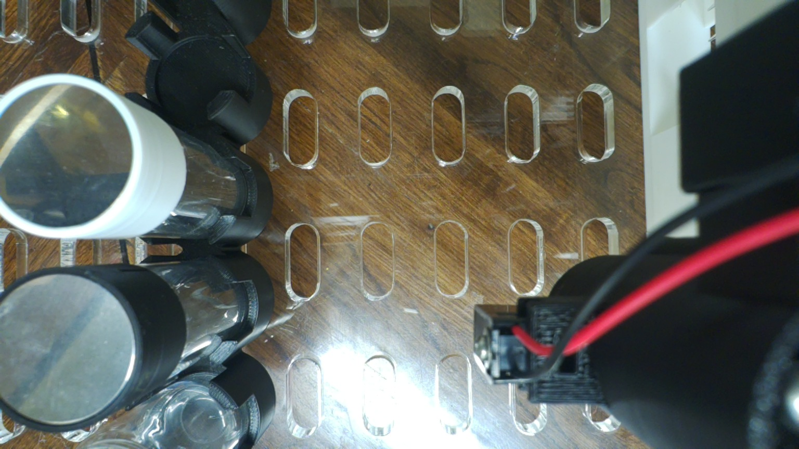
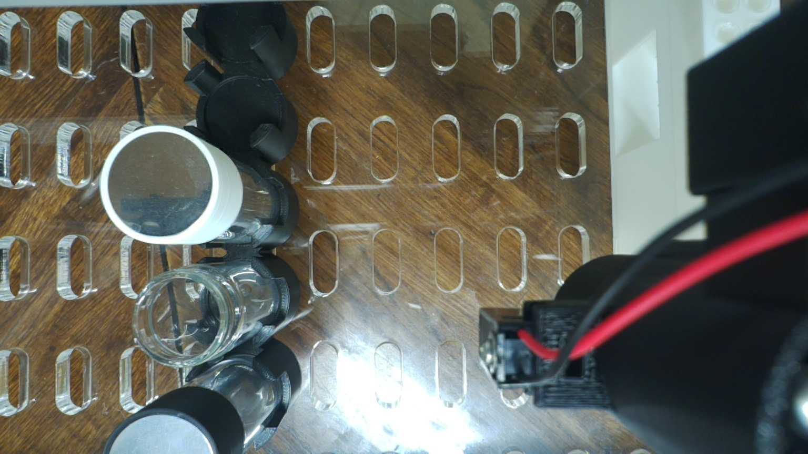
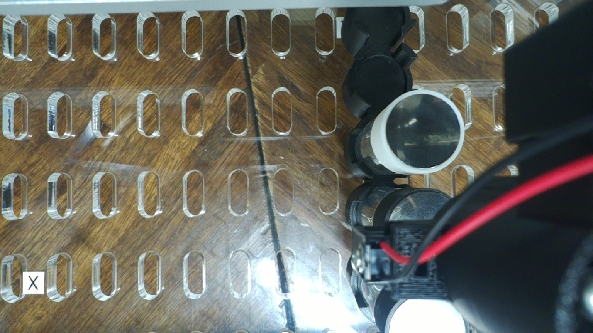

# pipette_test_20261002c: 12/12 on Ben's 2026-10-02 recalibration

**✅ 12/12 steps, protocol complete.** Run 2026-10-02 20:04:59Z → 20:07:39Z
(14:04:59–14:07:39 lab), 160 s wall, steps 129 s. Campaign 98. Issue #169.

| | |
|---|---|
| Gantry | [`cub_xl_ben_3_instrument.yaml`](../../configs/gantry/cub_xl_ben_3_instrument.yaml), Ben's 19:54Z attachment, verbatim |
| Deck | [`ben_2vials_tiprack.yaml`](../../configs/deck/ben_2vials_tiprack.yaml), Ben's 19:54Z attachment, verbatim |
| Protocol | [`pipette_test.yaml`](../../configs/protocol/vcl/pipette_test.yaml), unchanged |
| Code | byu-vcl `021ad70`, CubOS `496819c` + the four local patches |
| Command | `cubxl_run.py --name pipette_test_20261002c --gantry … --deck … --home-check --frames-at 2,3,4,8,9,10` |

[`SUMMARY.md`](SUMMARY.md) is the runner's own one-screen summary; `runner.log` has
everything. `checks_20261002b/` is the checks-only pass three minutes earlier
(same files, nothing moved).

## Frames (head camera, after the step named)

| step 2 decap vial_1 | step 3 pick_up_tip | step 9 drop_tip | step 10 cap vial_2 |
|---|---|---|---|
|  |  |  |  |

Vial_1 is open in steps 2–3, recapped by step 9, when vial_2 is open; all caps are on
after step 10. The camera sees the deck, not the tip end, so the frames show where the
head went, not whether a tip was seated.

## Gantry targets (traced mock run, same files)

CubOS commands gantry = deck − instrument offset. The capper offset is (0, 0), depth −16;
the pipette offset is (55, 11).

| move | gantry X, Y, Z |
|---|---|
| capper → vial_1 / vial_2, transit | (136.668, 45 / 78, 99) |
| capper engage (rim 56 + 15) | Z 55 |
| pipette → tip_rack A1, pick-up | (236.332, 78, 59) |
| pipette → vial_1 aspirate / vial_2 blowout (tip end at deck 21) | (81.668, 34 / 67, 56) |
| tipped hover, clamped to the ceiling | Z 122 |
| pipette_park | (203, 14, 121) |
| drop_tip A1 | (236.332, 78, 94) |

All inside working_volume 361 / 278 / 122. Validate, mock 12/12, passive_shadow and
passive_shadow `--tip-stuck` all passed. The G-code the run actually sent
(`gantry_mill_control.log`, 45 `G01` + 2 `$H`) hits exactly these coordinates, and its
only `Alarm` is the expected one at connect, before step 0's `$H`.

## Two things to look at

**The Tic's VIN now sags with gantry motion.** It fell to **7.4 V** during the final
`home`, when only the gantry moves. Medians per step were 8.3–9.5 V. The Tic reported no
errors, and the plunger HOME check came back within +0.04 mm. But the minimum on
2026-10-01 was 9.0 V. In the killed run below, 7 minutes earlier, the same step-1 moves
(Z99, X206, Y25) left VIN at 10.7–11.0 V; here they gave 8.7–9.3 V. So something
about the supply changed between 19:59 and 20:04Z.

**GRBL went silent at 19:58:58Z** in the previous session's run (below). That was 0.3 s
into a `G01 Z99` at transit height. Every status query came back empty, and the Pi
logged no USB disconnect and no under-voltage. GRBL answered normally once the port
was reopened at 20:01:09, and there was no repeat in this run (0 kernel USB lines).

## The previous session's runs (Actions run 37055099634)

Ben asked for that session to be stopped. Neither GitHub (403 on `gh run cancel`) nor the
Tailscale OAuth client (`auth_keys` scope only) could stop it. Instead, `cubxl_run.py`
now refuses to start while `~/cubxl_runs/HOLD` names another session; the file is in
[`previous_session/HOLD.txt`](previous_session/HOLD.txt). That session read it, stopped,
and left [a note](previous_session/NOTE_from_run_37055099634.txt). Its runs, from that
note and [the gantry log](previous_session/attempt2_mill_control_excerpt.log):

- **19:42:49Z, `pipette_test_20261002`:** the gantry USB was unplugged 10 s in. No
  G-code was sent.
- **19:58:23Z, `pipette_test_20261002b`, with the 19:35Z deck file Ben had replaced:**
  its motion stage started 44 s before the HOLD file existed (19:59:07Z). `home` and the capper's park move
  completed. `decap vial_1` went to the old position, gantry (115, 45.08, 122), and
  GRBL went silent on the next move, as above. The session SIGKILLed the run at
  20:00:07Z and de-energized the Tic at 20:01:33Z. No tip was picked up, and the magnet
  was never switched on (the cap sensor read 0 at 20:01 and 20:04).

Both run folders are still on the CubXL Pi under `~/cubxl_runs/`.
