# pipette_test_20261006: 12/12 on the Tic T500 after the 10-05 rewire

**✅ 12/12 steps, protocol complete.** Run 2026-10-06 21:20:03Z → 21:22:24Z
(15:20:03–15:22:24 lab), 141 s wall, steps 117 s. Campaign 108. Issue #169. Ben:
*"run the pipette test again. I want to make sure everything is working with the Tic T500.
post pictures from both cameras."*

This is the first run since Ben moved the P20 back from the TMC2209 board to the Tic T500
and rewired it on 2026-10-05 ([`tmc2209_probe_20261005`](https://github.com/vertical-cloud-lab/byu-vcl/blob/d8d639f/cubos/results/tmc2209_probe_20261005/README.md)).

| | |
|---|---|
| Gantry | [`configs/cub_xl_ben_3_instrument.yaml`](configs/cub_xl_ben_3_instrument.yaml), Ben's 2026-10-02 19:54Z file ([`bc31857`](https://github.com/vertical-cloud-lab/byu-vcl/blob/bc31857/cubos/configs/gantry/cub_xl_ben_3_instrument.yaml)) |
| Deck | [`configs/ben_2vials_tiprack.yaml`](configs/ben_2vials_tiprack.yaml), Ben's 2026-10-02 19:54Z file ([`bc31857`](https://github.com/vertical-cloud-lab/byu-vcl/blob/bc31857/cubos/configs/deck/ben_2vials_tiprack.yaml)) |
| Protocol | [`configs/pipette_test.yaml`](configs/pipette_test.yaml), unchanged |
| Code | byu-vcl `021ad70`, CubOS `496819c` + the four local patches |
| Command | `cubxl_run.py --name pipette_test_20261006 --gantry … --deck … --home-check --frames-at 2,3,4,8,9,10` |

All three configs are byte-identical to the ones
[`pipette_test_20261002c`](https://github.com/vertical-cloud-lab/byu-vcl/blob/d921c64/cubos/results/pipette_test_20261002c/README.md)
ran (sha256 `996da208d8d7`, `6c0502f1f18a`, `16eb7f2c5376`), so that run is the baseline.
[`SUMMARY.md`](SUMMARY.md) is the runner's own summary, and `runner.log` has everything.

## Before anything moved

- **The Pi was offline from 20:32Z** and came back at 21:15Z, freshly rebooted.
- **The 10-05 session's `~/cubxl_runs/HOLD` was still there.** It named Actions run
  37379090191, which completed at 2026-10-05 22:37:56Z. It is kept as
  [`preflight/HOLD_from_run_37379090191.txt`](preflight/HOLD_from_run_37379090191.txt). It
  was replaced by a hold for this run (37531888277), which was deleted at 21:23Z, after the run.
- **Tic:** settings equal [`tic_p20.txt`](https://github.com/vertical-cloud-lab/byu-vcl/blob/021ad70/cubos/docs/tic_p20.txt)
  ([`preflight/tic_settings_now.txt`](preflight/tic_settings_now.txt)). It was energized from
  power-on, VIN 11.3 V, with no errors.
- **Cameras:** both answered a test shot ([`preflight/preflight_frames/`](preflight/preflight_frames)).
- **Limit-switch probe, 21:18Z** ([`preflight/tic_probe.log`](preflight/tic_probe.log)). This is
  the 10-05 [`tmc2209_probe.py`](preflight/tmc2209_probe.py), unchanged. It only talks to the
  Arduino, so it works on the Tic as long as the Tic is energized. It ran first because a
  rewire can reverse the motor, and CubOS's connect-time `HOME` seeks blind.

  | | result |
  |---|---|
  | start | switch closed: plunger below the top, where the 10-02 `HOME` left it |
  | UP search, 0.5 mm chunks at 400/s | switch opened after **~0.95 mm**, so DIR LOW is up and the motor turns |
  | DOWN 2 mm, then UP 4 mm at 1,000 / 2,500 / 10,000 steps/s | switch opened after ~2.05 / 2.10 / 2.13 mm: no lost steps at any rate, including the `MOVE_TO`/`ASPIRATE` rate |
  | DOWN 2 mm, firmware `HOME` | `OK` in 1.351 s. The [runner's calibration](https://github.com/vertical-cloud-lab/byu-vcl/blob/021ad70/cubos/tools/cubxl_run.py#L80-L84) predicts 1.41 s for 2 mm |

  `CMD 29` reads `comm = 0`, as it should: it queries a TMC2209 over UART, and the Tic has
  no UART.
- **Checks-only pass, 21:19Z** ([`checks_20261006/`](checks_20261006/SUMMARY.md)): GRBL
  matches the gantry file (travel 364 / 281 / 125, `G54` = −travel, `$20=1`, `$21=1`), the
  Arduino answers, the cap sensor reads 0, and the validate, mock and both collision-shadow
  gates pass.

The run's own stage 1 and 2 repeated all of this at 21:19:41Z, and everything passed again.

## The run, against 10-02c

| step | command | 10-02c s | today s | |
|---:|---|---:|---:|---|
| 0 | home | 23.5 | 7.9 | shorter, presumably because the gantry was still at the home corner where 10-02c's final `home` left it |
| 1 | move | 9.5 | 9.5 | |
| 2 | decap vial_1 | 7.3 | **10.9** | **took its second attempt** (below) |
| 3 | pick_up_tip | 8.4 | 8.4 | |
| 4 | aspirate | 12.8 | 12.8 | |
| 5 | move | 5.0 | 5.0 | |
| 6 | cap vial_1 | 7.0 | 7.0 | |
| 7 | decap vial_2 | 5.9 | 5.9 | |
| 8 | blowout | 7.2 | 7.2 | |
| 9 | drop_tip | 12.8 | 12.8 | |
| 10 | cap vial_2 | 7.4 | 7.4 | |
| 11 | home | 22.3 | 22.3 | |

- **G-code:** identical to 10-02c (`gantry_command.log`), apart from one extra
  `Z55` / `Z99` pair in step 2. There were no alarms except the expected one at connect,
  before step 0's `$H`, and no USB events (`kernel_during_run.log` has only camera lines).
- **Step 2's retry.** The capper's first engage on vial_1 (Z55 at 15:20:38.7 lab) retracted
  to Z99 without the cap sensor confirming a held cap. CubOS re-engaged
  (`capture_retries: 2` in the gantry file allows two retries), and the second attempt
  (15:20:42.2) confirmed. This is the capper, not the pipette, and the retry is built in.
  On 10-02c both decaps went through on the first attempt. If retries keep happening,
  the vial_1 position or how its cap sits is worth a look.
- **Plunger:** every command returned `OK` (`plunger_trace.json`). The post-run `HOME`
  took 12.679 s from the firmware's 28.0 mm, which implies 28.00 mm: **−0.00 mm**, so
  no lost steps across the whole run (10-02c: +0.04 mm).
- **Tic VIN:** 267 polls, 8.1–11.4 V, median 10.0 V, and no errors at any point.
  It still sags with gantry motion, but less than on 10-02c (7.4–11.1 V, median 9.3 V).
  The lowest reading was 8.1 V during step 10 (cap vial_2). At rest it was 12.6 V
  de-energized and 11.1 V energized.

## Frames (after the step named)

`cam0_csi0` is the wide camera and `cam1_csi1` the close-up. On 10-02 the close-up was the
only camera and was labelled `cam0_csi0`. The cameras show where the head went, not whether a tip seated
or liquid moved.

| step | `cam0_csi0` | `cam1_csi1` |
|---|---|---|
| 2 decap vial_1 | 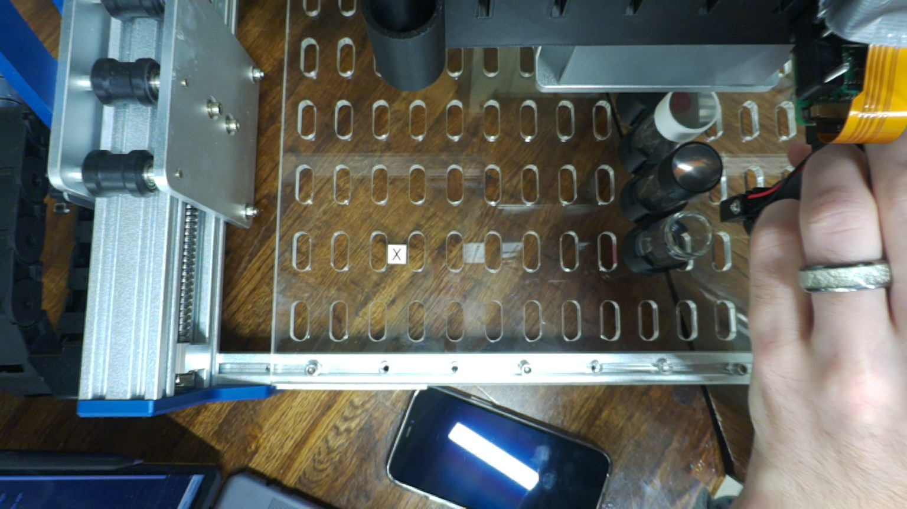 | 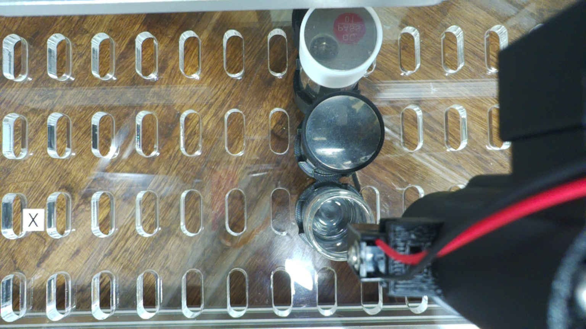 |
| 3 pick_up_tip | 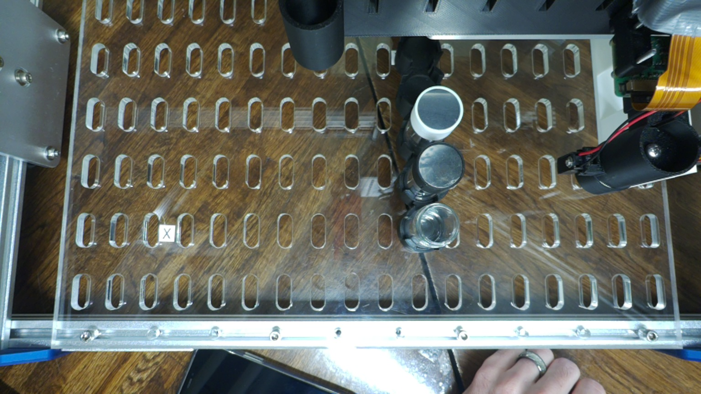 | 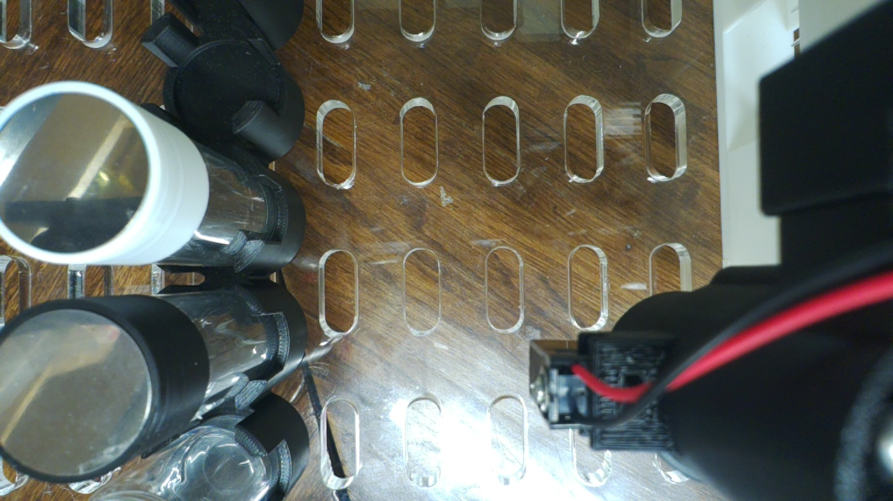 |
| 4 aspirate | 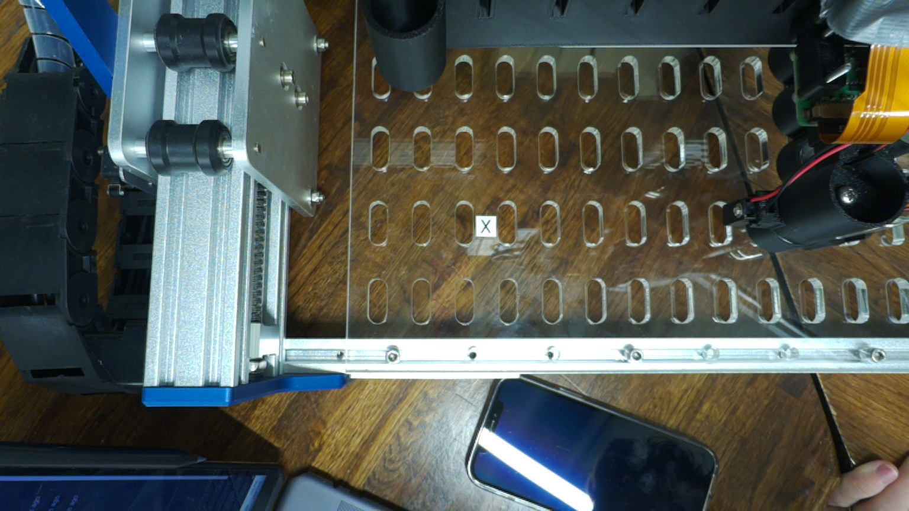 | 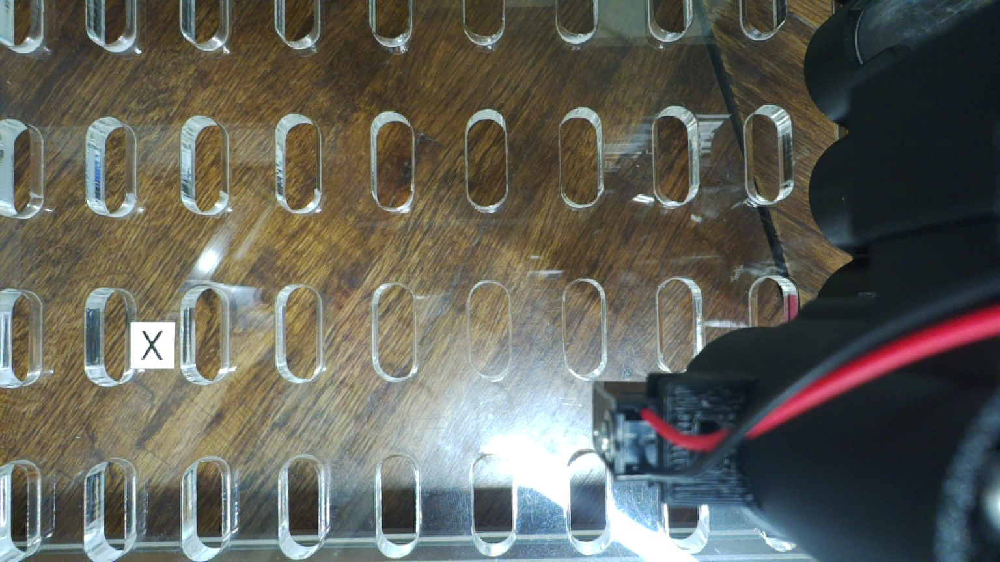 |
| 8 blowout | 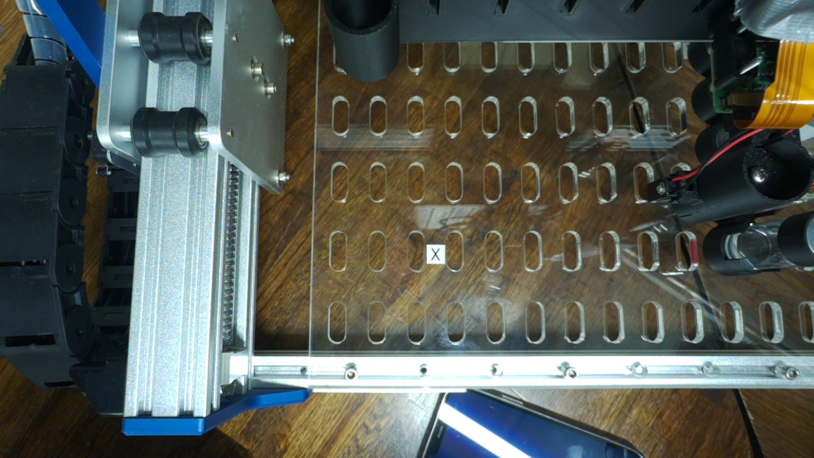 | 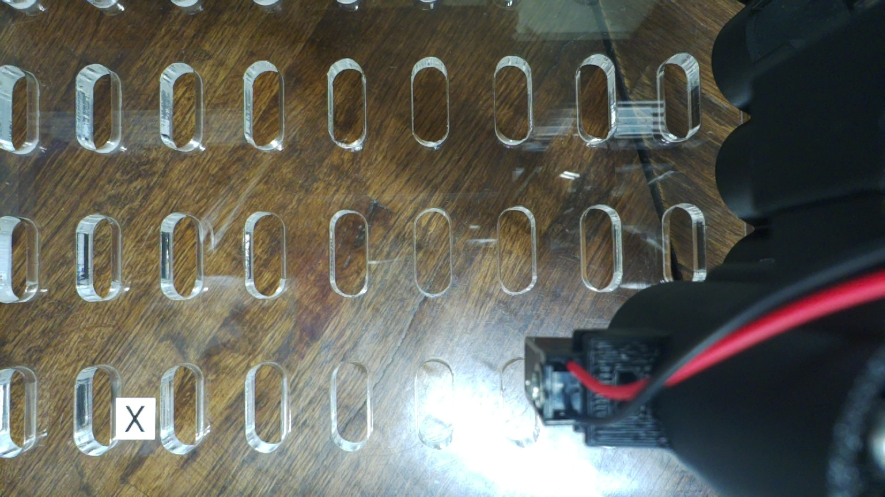 |
| 9 drop_tip | 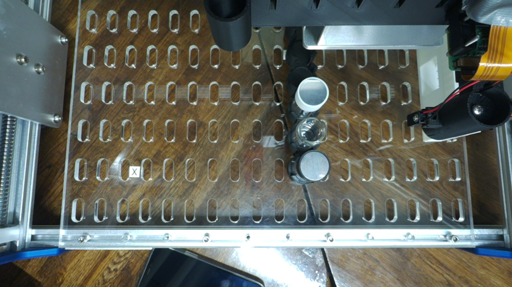 | 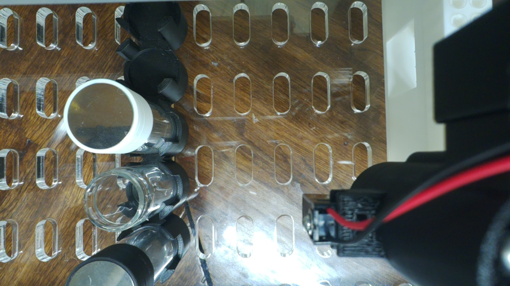 |
| 10 cap vial_2 | 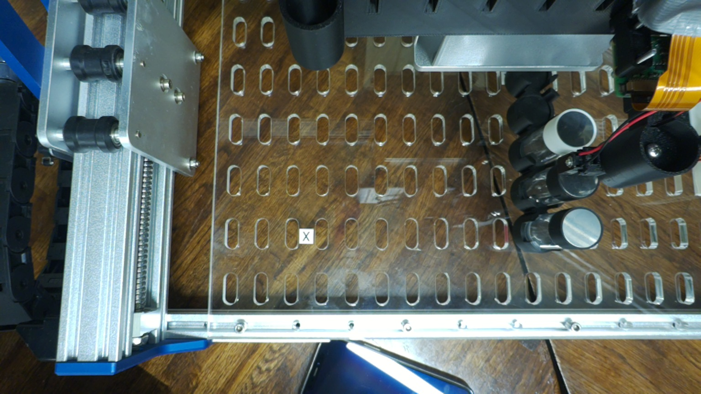 | 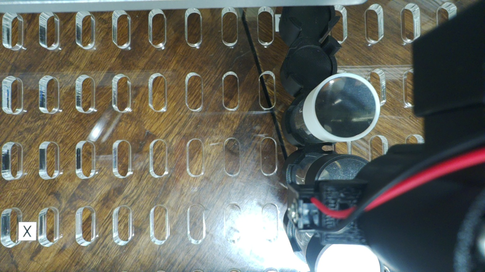 |

## State left (21:23Z)

| | |
|---|---|
| gantry | homed by step 11, idle |
| magnet | off; the cap sensor reads 0 |
| plunger | homed by the post-run check |
| Tic | de-energized by the runner, VIN 12.3 V |
| Pi | `HOLD` removed; no run processes left |

The Pi's hostname is replaced with `<cubxl-pi>` in `kernel_during_run.log`.
