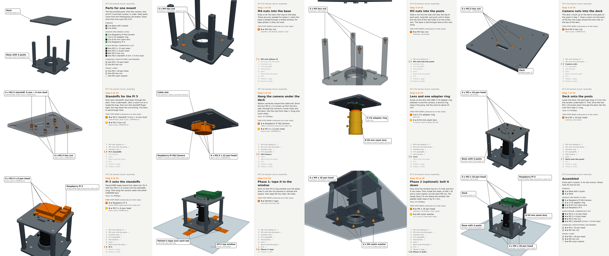

# Assembly instructions as a labelled MP4

When someone asks for assembly instructions, or asks for a design that people will have to put
together from several parts, make a step-by-step MP4 in the style of the OT-2 lid camera
mount's ([YouTube](https://www.youtube.com/watch?v=YWsTg3aCP50),
[file](../ot2-overhead-camera/lid-mount/renders/assembly_steps.mp4),
[the comment that introduced it](https://github.com/vertical-cloud-lab/byu-vcl/pull/234#issuecomment-6066624402)).
@timothy-commins [asked for this](https://github.com/vertical-cloud-lab/byu-vcl/pull/234#issuecomment-6067568339)
on PR #234.
The video goes alongside the numbered written steps, not in place of them.



## What to deliver

| Deliverable | Notes |
| --- | --- |
| `renders/assembly_steps.mp4`, next to the design | 1920 × 1080, 30 fps, H.264, with a chapter per step. The lid mount's is 2 min 15 s and 17 MB |
| An unlisted upload to the BYU Vertical Cloud Lab channel | The chapters go in the description, along with a link back to the comment that asked for it |
| `renders/assembly_steps_sheet.png` | Where each step ends, four across, to embed in the reply and the README |
| Numbered steps in the design's README | The video's side panel gives the same instruction for each step, so update both when either changes |

The reply should have:
- the YouTube link, for pausing (`,` and `.` step back and forward a frame);
- the MP4 link, for downloading;
- the contact sheet, embedded;
- a few lines on how to read the video;
- the chapter list.

## The style

These are the things that made the lid mount's video easy to follow, so keep them:

- **One chapter per step,** plus a first chapter with every part laid out and a last one with
  everything assembled. Both of those list all the parts, grouped by where they come from
  (printed, bought, a kit, a lab drawer, optional).
- **Each step holds twice.**
  1. The step's parts sit beside where they go, with a dashed orange line from each copy to its
     place, for about 2.5 s.
  2. They move in, eased, over about 2 s.
  3. The finished step holds for at least 5 s.

  YouTube ignores chapters shorter than 10 s, so each step lasts at least 11 s.
- **Colour shows what's new.** The parts a step adds are orange. A second kind of part in the
  same step, such as the screws for a board, is amber. At the next step both go back to their
  real colours (the print colour, steel grey, black nylon).
- **Every new part is labelled.** A box gives the count and name in bold
  (`4 x M2.5 x 12 pan head`) and a grey line for material and source
  (`black nylon, COMRUN kit`), with a leader line to every copy.
- **See-through where it matters.** When a part goes inside another, such as nuts into traps,
  the outer part is drawn translucent for that step only.
- **A side panel on the right** (630 of the 1920 px) shows:
  - "Step N of M" in orange, and the step's title;
  - the step's instruction, as in the README, and the tool it needs;
  - the parts it adds, with swatches in the view's colours;
  - every step, with the current one marked and the finished ones ticked.
- **A camera angle for each step** that shows where its parts go. The camera moves between
  steps over about 1 s. A sub-assembly built on the bench is shown on its own, then joins the
  rest.
- **The hardware people will actually use.** Draw the screws and nuts that are on hand (the lab
  drawer's, the kit's), from vendor CAD where it exists. Keep the counts the same as the
  shopping list.
- **Readable when paused at 1080p.** Labels use 20–25 px text and the panel 19–34 px, on a white
  background. Labels are drawn at 2× and scaled down, so the lines stay smooth.

## Building one

Start from [`ot2-overhead-camera/lid-mount/cad/assembly_video.py`](../ot2-overhead-camera/lid-mount/cad/assembly_video.py).
It renders the 3D view with PyVista off-screen, draws the labels and panel with Pillow, and pipes
the frames to ffmpeg:

```bash
xvfb-run -a -s "-screen 0 1920x1080x24" python assembly_video.py --stills   # held frames only, ~20 s
xvfb-run -a -s "-screen 0 1920x1080x24" python assembly_video.py            # the MP4, ~5 min
```

Copy it next to the new design's CAD and change only the content:

| Keep as it is | Replace |
| --- | --- |
| `Video`, `dashed`, `panel`, `part_rows`, `sheet`, and the step loop at the end of `run` | `PARTS` (each part's name and detail line), `scene_meshes` (every part as a mesh in its assembled place), `make_steps` (one `Step` per instruction, with its `Move`s and `Label`s), the actors and the full parts list at the top of `run`, and the title (drawn by `panel`, and passed to `close` by `run`) |

- **A `Move`** gives where its parts start, relative to where they end up, so the dashed lines
  come for free.
- **A `Label`** is placed by fractions of the 3D view. Put each one where it doesn't cover the
  parts it names.
- **Check the stills first.** `--stills` writes each held frame to
  `/tmp/assembly_video_stills/`, and the contact sheet. Look at every one: no label over the
  part it names, a leader on every copy, nothing hidden behind another part.
- **Check the MP4** with `ffprobe`: 1920 × 1080, the length, and the chapters. Keep it well under
  GitHub's 100 MB file limit.
- **Vendor CAD isn't committed.** McMaster's STEP files are fetched at run time, as the lid
  mount's [`hardware/README.md`](../ot2-overhead-camera/lid-mount/hardware/README.md)
  describes, with ISO-sized stand-ins when they're missing.

When a second design gets a video, move the "keep" column into a shared module rather than
copying it again.

## Uploading

[`youtube/yt_service.py`](../youtube/yt_service.py) uploads with the upload-only token:
`python youtube/yt_service.py upload FILE --title ... --description ... --privacy unlisted`.
- **Chapters:** one per line in the description, as `m:ss Title`, starting at `0:00`. YouTube
  needs at least three.
- **Limits:** the title is at most 100 characters, and the description at most 5000 bytes.
  Neither may contain `<` or `>`. A title over the limit fails the upload.
- **Get it right first time.** The upload-only token can't edit or delete a video, so a wrong
  upload has to be removed by sgbaird or with `@claude-youtube`.

When the design changes, re-render the MP4 and the contact sheet in the same commit. If the
YouTube copy is then out of date, say so in the README until a new one is uploaded.
