# Manuscript revision walkthrough: AC BO Hackathon main article, part 2 of 2

Continuation of the working session between **Sterling Baird** and **Gage** on the AC BO
Hackathon main article latexdiff. [Part 1](bo-hackathon-main-article-review.md) ended at
the words "cross project synthesis... there's a lot of new here"; this video starts
exactly there, at Section IV, and runs through the tables, the supplementary information
question, and a long back and forth about where the rankings table belongs. The
[response to reviewers walkthrough](bo-hackathon-manuscript-review.md) covers the earlier
session on `RESPONSE_TO_REVIEWERS.md`.

| | |
|---|---|
| Video | [Manuscript review with Gage and Sterling (AC BO Hackathon), main article (II)](https://youtu.be/xClOSVH1Ero) (unlisted) |
| Channel | BYU Vertical Cloud Lab |
| Uploaded | 2026-08-19 |
| Duration | 16:54 (1014 s) |
| Document under review | `copilot-main-diff.pdf`, the flattened latexdiff of `main.tex` (26 pages, viewed at 200% in Foxit) |
| Pull request | [AC-BO-Hackathon/ac-bo-hackathon.github.io#171](https://github.com/AC-BO-Hackathon/ac-bo-hackathon.github.io/pull/171), whose description is read on camera at [10:51](https://youtu.be/xClOSVH1Ero?t=651) |
| Also on screen | [`RESPONSE_TO_REVIEWERS.md` @ `780cdd1`](https://github.com/AC-BO-Hackathon/ac-bo-hackathon.github.io/blob/780cdd1/RESPONSE_TO_REVIEWERS.md), the [hackathon submission page](https://ac-bo-hackathon.github.io/submission/) |

Screenshots live in
[`bo-hackathon-main-article-review-2/`](bo-hackathon-main-article-review-2).
Every timestamp below is a link that opens the video at that moment.

---

## Video comments

**The video has no comments.** It is unlisted and had zero views and a comment count of
zero when checked at capture time (2026-08-20, roughly nine hours after upload), so there
is nothing to inlay into the timeline. If comments appear later, they can be slotted into
the walkthrough at the timestamps they refer to.

## How this document was produced

The method matches [part 1](bo-hackathon-main-article-review.md#how-this-document-was-produced):
YouTube's word level automatic captions (1538 words) as the base transcript, Whisper
large-v3-turbo re-transcription of every quoted passage, screen text as ground truth for
read aloud passages, and 200 ms screenshot bursts around each anchor word with only the
informative frames kept. Frames are downscaled to 1760 px wide from the 2560x1396 source.
All corrections are listed in [Transcript corrections](#transcript-corrections). No
"thank you", no em or en dashes, except inside quoted manuscript text at items 6 and 10,
where the dash is the thing being criticized.

One capture note: the final roughly ten seconds of the video show the screen switching
away from the manuscript to a private Slack conversation as the session winds down. No
screenshot of that portion is included here, deliberately; see item 27.

---

## Recurring themes

1. **Where should the rankings table live?** The single longest thread of the session
   (items 16 to 26): the old Table 2 became Table 3, moved to the back, shows as all new
   in the diff, and may not even be referenced in the text. Final decision: reference it
   right after the Gavel sentence in the introduction.
2. **Trim the synthesis prose.** Caveats and disclaimers get rewritten in plain language
   (item 2), and sections IV.A and IV.B get collapsed and cut to a few hundred characters
   each (items 11 and 12).
3. **Tables should account for all 45 projects and stay narrow.** The "40 distinct
   repositories" framing and the wide project numbers column both go (items 13 to 18).
4. **The latexdiff keeps misleading.** A moved table renders as wholly new, echoing part
   1's caption problem (items 19, 20, 22).

## All notes for Claude in this session

- [ ] Rewrite the Section IV caveat sentences as: "Given that the synchronous hackathon
  spanned two days, many of these projects did not undergo the same rigor and fleshing out
  as what might be expected of a peer-reviewed manuscript." then "However, we report
  qualitative trends and examples." Drop "These observations carry an important caveat".
  ([01:01](https://youtu.be/xClOSVH1Ero?t=61), item 2)
- [ ] Record the organizer lesson from Sterling somewhere: he was surprised how many
  submissions did not fall cleanly into the published special topics, and a topic like
  "large language models applied to Bayesian optimization" would likely have been among
  the largest had it existed. ([02:13](https://youtu.be/xClOSVH1Ero?t=133) to
  [03:19](https://youtu.be/xClOSVH1Ero?t=199), items 4 to 6)
- [ ] Show the distribution of submitted projects across the five special topics, in words
  or a really small inline table, alongside the existing reclassification by deliverable.
  ([03:19](https://youtu.be/xClOSVH1Ero?t=199), item 7)
- [ ] Cut "a pattern consistent with a short event in which most teams probed feasibility
  rather than completing and validating a finished artifact."
  ([05:49](https://youtu.be/xClOSVH1Ero?t=349), item 10)
- [ ] Collapse sections IV.A and IV.B into one; hold what was IV.A to roughly 300 to 500
  characters and what was IV.B to roughly 200 to 300.
  ([06:15](https://youtu.be/xClOSVH1Ero?t=375), items 11 and 12)
- [ ] Fix Table V so all 45 projects are accounted for: keep the license rows, add a final
  category for the projects that stayed at the proposal stage, and stop leading with "the
  40 distinct project repositories". ([06:52](https://youtu.be/xClOSVH1Ero?t=412), item 13)
- [ ] Figure out what "Other / unspecified terms" refers to; it most likely just gets
  lumped into "No license file". ([07:29](https://youtu.be/xClOSVH1Ero?t=449), item 14)
- [ ] Table IV: remove the project numbers column and put the numbers in the supporting
  information; keep a very small, half width table like Table V.
  ([09:14](https://youtu.be/xClOSVH1Ero?t=554), items 15 to 18)
- [ ] In the response letter, note that the table of project rankings and prizes was
  moved. ([11:29](https://youtu.be/xClOSVH1Ero?t=689), item 20)
- [ ] Move Table III back up: keep everything in the introduction, and put the reference
  right after the community judging sentence that ends "enhance transparency and
  credibility": see that table for rankings of the top 10 projects and the awarded prizes.
  The number may change with the move. ([13:04](https://youtu.be/xClOSVH1Ero?t=784) to
  [15:44](https://youtu.be/xClOSVH1Ero?t=944), items 23 to 26; supersedes the ideas
  scratched at items 24 and 25)

---

## Walkthrough

### 1. [00:00](https://youtu.be/xClOSVH1Ero?t=0) Section IV opens: on the edge of AI wording, but tolerable

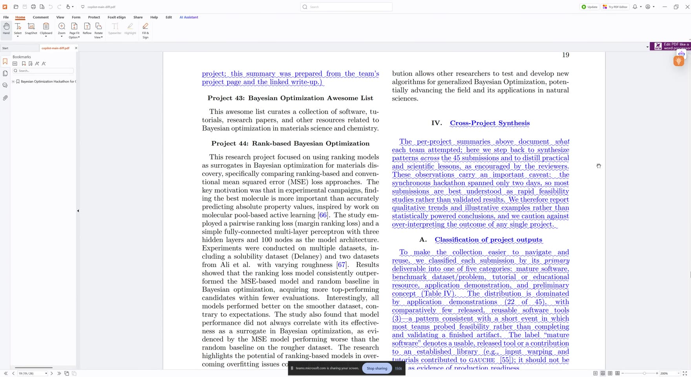

> "Okay, so just getting through the rest of the document. Starting at section four, cross
> project synthesis. 'The per project summaries above document what each team attempted.
> Here we step back to synthesize patterns across the 45 submissions and to distill
> practical and scientific lessons, as encouraged by the reviewers.' Uh, it's a little...
> it's, like, on the edge of obviously AI wording, but it's sort of okay. Just whatever."

**Status:** tolerated as is. The bar being applied is the part 0 rule about not sounding
AI written.

---

### 2. [00:35](https://youtu.be/xClOSVH1Ero?t=35) The caveat gets rewritten in plain language, dictated verbatim

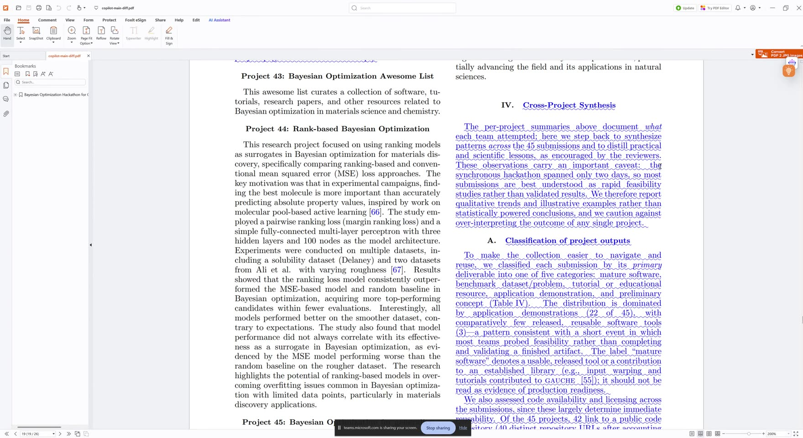

> "'These observations carry an important caveat: the synchronous hackathon spanned only
> two days, so most submissions are best understood as rapid feasibility studies rather
> than validated results.'" "More disclaimers." "Yeah, it's okay to mention this, but this
> is too much of a fluffy disclaimer."
>
> "I think we can address the readers. Let's see. Yeah, we don't need to say 'these
> observations carry an important caveat.' We'll just say: 'Given that the synchronous
> hackathon spanned two days, many of these projects did not undergo the same rigor and
> fleshing out as what might be expected of a peer-reviewed manuscript.' Period. 'However,
> we report qualitative trends and examples.' Period."

The replacement text is dictated word for word (the Whisper pass confirms it cleanly), so
it can be applied directly. The current on screen text continues "...We therefore report
qualitative trends and illustrative examples rather than statistically powered
conclusions, and we caution against over-interpreting the outcome of any single project,"
all of which collapses into the two dictated sentences.

**Action for Claude:** apply the dictated rewrite. The "More disclaimers" interjection is
not confidently attributable between the two speakers.

---

### 3. [01:46](https://youtu.be/xClOSVH1Ero?t=106) Reading the five deliverable categories

> "'To make the collection easier to navigate and reuse, we classified each submission by
> its primary deliverable into one of five categories: mature software, benchmark data
> set, tutorial or educational resource, uh, application demonstration, and preliminary
> concept.' Uh, 'the distribution is dominated by application demonstrations, with
> comparatively few released, reusable software tools.'"

Read through without objection; the passage is visible in the screenshots at items 1
and 2. It sets up the special topics tangent that follows.

---

### 4. [02:06](https://youtu.be/xClOSVH1Ero?t=126) Organizer lesson: submissions did not fit the published special topics

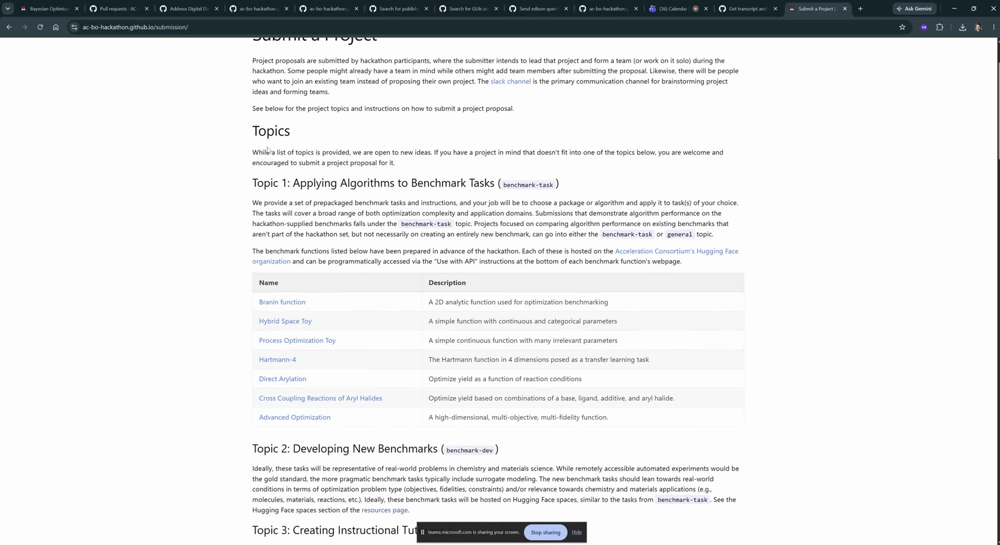

> "One thing I'll make note of here, that was an organizer lesson from me, is that I was
> surprised that so many of the submissions did not fall cleanly within one of the
> published special topics. So if I go here to projects, or, no, submission... we have
> these special topics here: applying algorithms to benchmark tasks, developing new
> benchmarks, creating instructional tutorials, real world chemistry materials tasks, and
> then topic five, general, kind of a miscellaneous category."

He switches to the live submission page and scrolls the five topics (Topic 1
benchmark-task with its table of prepared benchmark functions, Topic 2 benchmark-dev,
Topic 3 tutorial, Topic 4 real-world, Topic 5 general).

---

### 5. [02:45](https://youtu.be/xClOSVH1Ero?t=165) The miscellaneous category won, and an LLM topic would have been huge

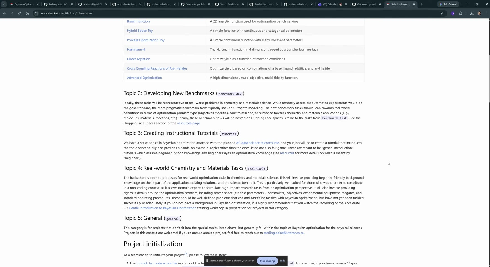

> "I was surprised at how many fit into the miscellaneous category, and I wouldn't
> necessarily have known in advance how to best segment out these topics. For example, if
> I had had to put... special topic 'large language models applied to Bayesian
> optimization', that would have probably been one of the largest uh special topics, had I
> done that."

This connects to the manuscript's own finding (visible at item 13's screenshot area) that
roughly one in six projects incorporated LLMs.

---

### 6. [03:11](https://youtu.be/xClOSVH1Ero?t=191) Note for Claude: record the surprising distribution

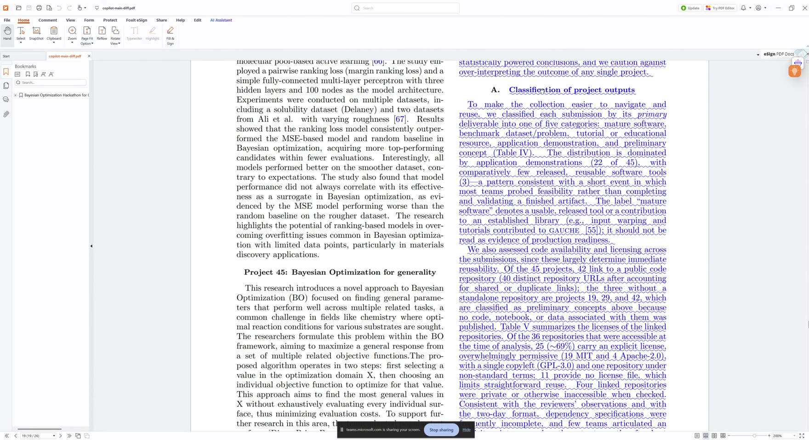

> "So, uh, Claude, note for you: uh, you need to make that note from me somewhere about
> kind of the surprising distribution of the categories."

**Action for Claude:** work Sterling's organizer lesson (items 4 and 5) into the
manuscript, most naturally near the classification discussion or the organizational
lessons. The passage on screen here contains "(3)—a pattern consistent with a short
event..." with the em dash, which item 10 deals with.

---

### 7. [03:19](https://youtu.be/xClOSVH1Ero?t=199) Show the topic distribution, in words or a really small inline table

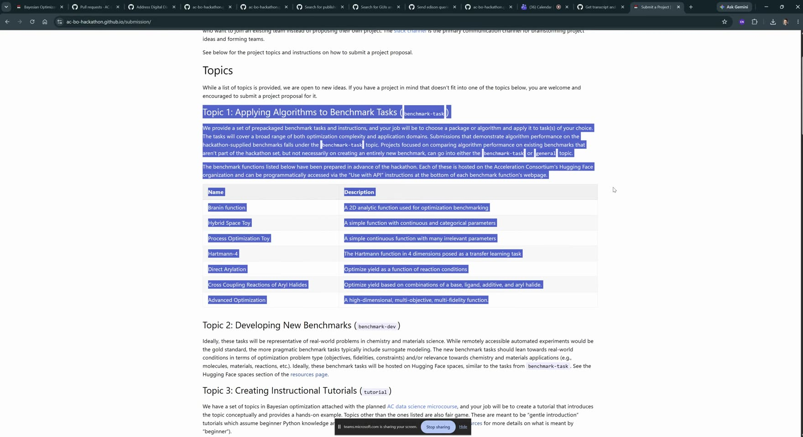

> "From here, I need you to actually go in and show, um, maybe just in words, or it could
> be in, like, a really small inline table, what the distribution of submitted projects
> were across the five topics, and then show this kind of reclassification, um, according
> to some other, uh, deliverable here."

The burst catches him sweeping a selection across the Topic 1 text as he says it.

**Action for Claude:** add the five topic distribution (words or a really small inline
table) next to the existing five category deliverable classification, so both groupings
are visible.

---

### 8. [04:25](https://youtu.be/xClOSVH1Ero?t=265) "Categories such as" does not bind the choice

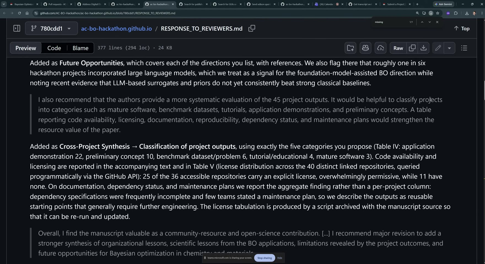

> "Okay, the reviewer is saying, 'it would be helpful to classify projects into categories
> such as mature software, benchmark data sets, tutorials, application demonstrations, and
> preliminary concepts.' Uh, 'categories such as': it doesn't have to be these
> specifically. Uh, we can leave it as that for now. Um, we'll come back to that a little
> bit."

The response letter on screen records that the five categories used are exactly the ones
the reviewer proposed (Table IV: application demonstration 22, preliminary concept 10,
benchmark dataset/problem 6, tutorial/educational 4, mature software 3). The point stands
as a soft note: the phrasing "such as" left room to choose better categories.

**Status:** noted, deliberately deferred.

---

### 9. [04:48](https://youtu.be/xClOSVH1Ero?t=288) Why reusable tools were never realistic in two days

> **Sterling:** "Anyway. Yeah, sorry, just making you sit here and listen to me yell."
> **Gage:** "I wish I could help more."
>
> **Sterling:** "Well, the... there's not going to be released reusable software tools, in
> general, from a two-day hackathon, where most people don't know how to... like,
> delivering a pip installable Python package is probably not... like, somebody might need
> to take a day or two just to learn how to do that, in an audience of mostly, like,
> material science... like, chemists and material scientists. Uh, okay, I guess it's
> mentioned there. Uh, 'pattern consistent with a short event in which most teams probed
> feasibility rather than completing and validating a finished artifact.'"

Context for the classification numbers rather than a change request; the manuscript, he
concedes, already says it. The exchange at the top is reconstructed from the two
transcription passes (the captions garbled it; Whisper catches Gage's reply).

---

### 10. [05:49](https://youtu.be/xClOSVH1Ero?t=349) Cut the "pattern consistent with a short event" clause

> "Okay, that doesn't need to be stated. Uh, you're getting my unfiltered, uh..."

The clause on screen (item 6's screenshot): "with comparatively few released, reusable
software tools (3)—a pattern consistent with a short event in which most teams probed
feasibility rather than completing and validating a finished artifact." The em dash there
is quoted as found.

**Action for Claude:** delete the clause after "(3)"; the sentence ends at the count.

---

### 11. [05:54](https://youtu.be/xClOSVH1Ero?t=354) Code availability and licensing: 300 to 500 characters

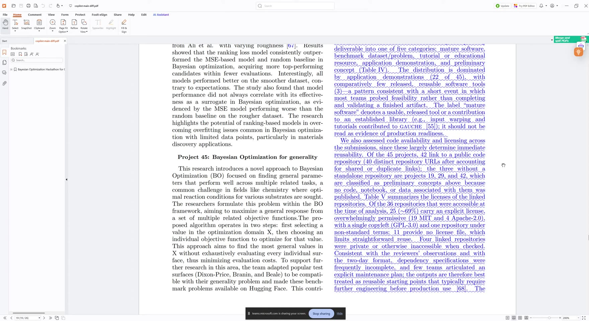

> "Uh, okay. Code availability and licensing. Like, some of this is good, for the project
> outputs, but really there should probably be no more than 3[00] to 500 characters for
> this section."

The licensing prose on screen runs a full column ("We also assessed code availability and
licensing... 42 link to a public code repository (40 distinct repository URLs...)... 25
(~69%) carry an explicit license... 11 provide no license file... Four linked repositories
were private or otherwise inaccessible when checked...").

**Action for Claude:** compress the licensing prose to roughly 300 to 500 characters; the
tables carry the detail.

---

### 12. [06:15](https://youtu.be/xClOSVH1Ero?t=375) Collapse sections IV.A and IV.B, trim both

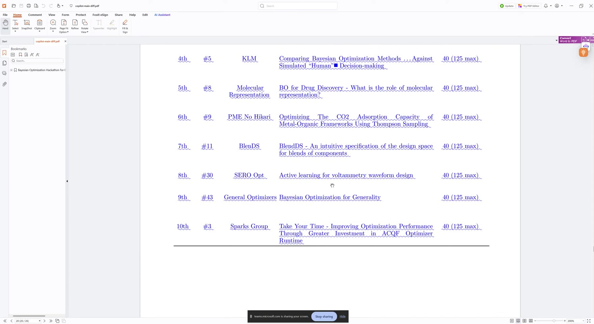

> "And I'm not even sure we need, like, 4A and then 4B. It just... yeah, collapse 4A and 4B
> together. Trim them. So the... what was originally 4A is no more than 3[00] to 500
> characters. And then, uh, for 4B, again, that one probably more like 200 to 300
> characters."

"4A" and "4B" are the subsections of Section IV: "A. Classification of project outputs"
and "B. Commonalities, differences, and participant expertise". The screen is mid scroll
across the inserted rankings table (which becomes the story of items 16 to 26).

**Action for Claude:** merge IV.A and IV.B into a single subsection at the dictated
lengths.

---

### 13. [06:52](https://youtu.be/xClOSVH1Ero?t=412) "40 distinct repositories" will confuse people; account for all 45

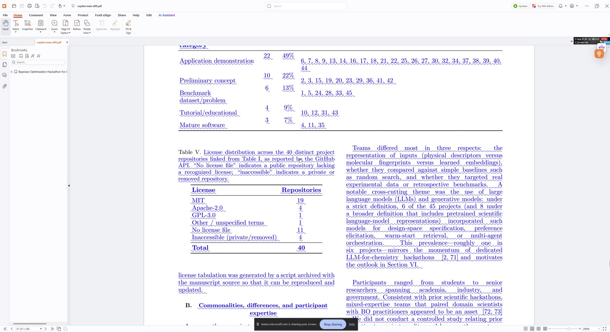

> "Uh, for that one, the table, that's fine. Wait: 'license distribution across the 40
> distinct project repositories linked from table one.' That's just going to confuse
> people, of why we're saying 40 instead of 45. So instead, um, just make that final
> category, that is maybe for the, uh, the projects that stayed at the proposal stage, but
> all 45 should be kind of accounted for here."

Table V's caption on screen leads with the 40 repositories (42 projects link to
repositories, 40 distinct URLs after deduplication, and the proposal stage projects have
none). The instruction: make the table resolve to 45 with an explicit row for the
proposal stage projects rather than making the reader do repository arithmetic.

**Action for Claude:** restructure Table V (or its caption) so the 45 projects are fully
accounted for, with a final proposal stage category.

---

### 14. [07:29](https://youtu.be/xClOSVH1Ero?t=449) "Other / unspecified" probably folds into "No license file"

> "Also, 'other slash unspecified', uh... you got to figure out what that is referring to.
> That's just going to confuse people if they see this. It naturally brings up the
> question, well, in what way was it unspecified? How is that different than just 'no
> license file' being there? Uh, so probably that one would just get lumped to 'no license
> file' would be my guess there."

Table V (item 13's screenshot) shows "Other / unspecified terms: 1" next to "No license
file: 11".

**Action for Claude:** determine what the one "Other / unspecified terms" repository is;
unless it is genuinely different, merge it into "No license file".

---

### 15. [07:56](https://youtu.be/xClOSVH1Ero?t=476) Table IV is a really wide table for very little

> "Uh, project classification. We don't need the, uh... it's a really long, like, a really
> wide table just to say what the project numbers were."

Table IV (item 13's screenshot) spans the full page width almost entirely because of its
"project numbers" column listing every project id per category.

**Action for Claude:** see items 17 and 18 for the resolution.

---

### 16. [08:15](https://youtu.be/xClOSVH1Ero?t=495) Is there a supplementary information? There is

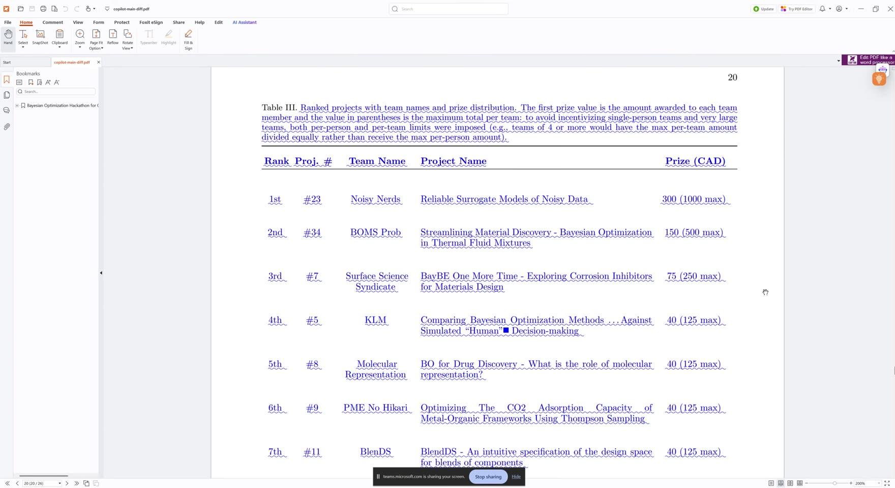

> **Sterling:** "Uh, I don't think we had a supplementary information, right?"
> **Gage:** "Well, maybe we did."
> **Sterling:** "Um, yeah, if you check on that... let me check that."
> **Gage:** "We do have supplement."
> **Sterling:** "Okay."

The check happens off the shared screen (which idles on the rankings table page); Gage
confirms the SI exists.

---

### 17. [09:14](https://youtu.be/xClOSVH1Ero?t=554) Note for Claude: move the project numbers to the SI

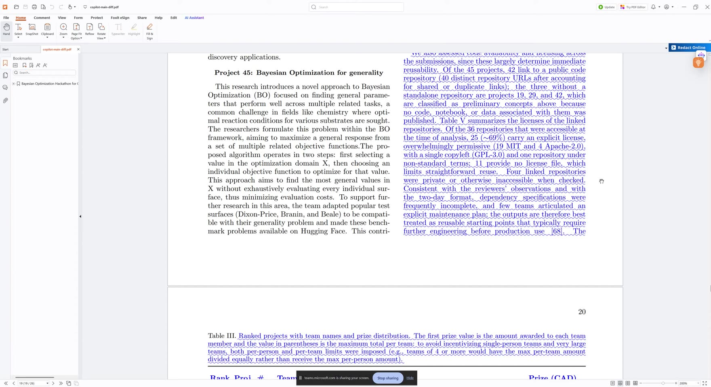

> "In that case, uh... so, note for Claude: in table 4, remove the project numbers column
> and put those in the supporting information instead." **Gage:** "It's just a detail."
> **Sterling:** "Yeah. So, uh, in fact, it's titled 'Electronic Supplementary Information:
> AC-BO Hackathon 2024, em [dash], All Projects'. Yeah, you can leave, like, a very small
> table in there, but take the project numbers and put those in the supplementary
> information."

A small irony preserved for the record: the SI's own title contains an em dash, and
Sterling reads it aloud as "em". The Table IV project numbers column is visible in item
13's screenshot.

**Action for Claude:** remove the project numbers column from Table IV, land the numbers
in the SI, keep a very small Table IV.

---

### 18. [10:01](https://youtu.be/xClOSVH1Ero?t=601) Table 4 becomes half width, like Table 5

> "Uh, table four should be a half width table, similar to table five."

Item 13's screenshot shows the contrast: Table IV spanning the page, Table V sitting
neatly in one column.

**Action for Claude:** with the numbers column gone, set Table IV at column width.

---

### 19. [10:06](https://youtu.be/xClOSVH1Ero?t=606) Is Table 3 new? No, the diff renders the move as all blue

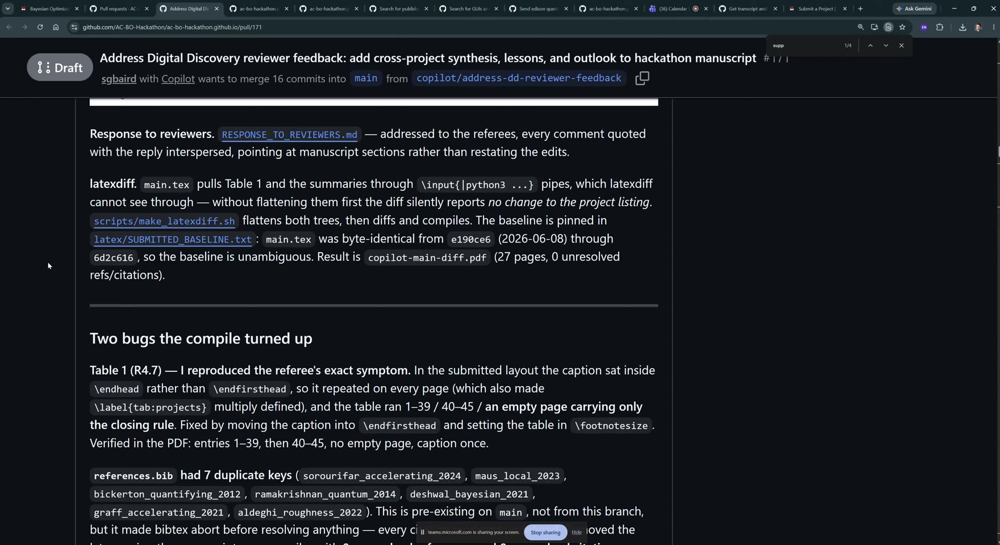

> "Uh, I'm a little confused. Is table three being added? Was table 3 not in there
> before? Uh, I guess taking a quick look back at, uh... how are we going to get... I
> don't [know] if you have the original submission." **Gage:** "I do." **Sterling:**
> "Okay, cool. Could you check to see if..." **Gage:** "What page was that?" **Sterling:**
> "Um, if you just scroll up, it, like... project prizes, project prizes table, or
> something... ranked projects. Okay. So, for whatever reason, it was just turning that
> all blue right here." **Gage:** "I think it's cuz I asked it to move it." **Sterling:**
> "Maybe. Okay. Ah, there it is."

The rankings table (old Table 2, new Table III) moved from the introduction to after the
per project summaries, and latexdiff renders a moved table as a full deletion plus a full
insertion, so it shows up "all blue" as if new. Mid investigation the screen lands on PR
#171's own description, which documents the diff pipeline (flattening the `\input{|python3
...}` pipes before diffing, the pinned baseline, the two compile bugs it caught). Gage
confirms the move was his request to the agent.

**Status:** mystery solved on camera; the moved table itself is visible at items 12, 16,
and 23.

---

### 20. [11:07](https://youtu.be/xClOSVH1Ero?t=667) Another latexdiff note, and mention the move in the response letter

> "Okay. So, this, uh... that's another note about the latexdiff. It's very confusing that
> we have the table being moved looking like this, where this doesn't look like a table,
> really, or... anyway. We can probably make note in the response to reviewer that we
> moved the table of project rankings and prizes to a later spot."

(The part of the diff where the table's old position was deleted renders as run on struck
through text that "doesn't look like a table", visible in part 1's item 6 screenshot.)

**Action for Claude:** add a sentence to the response letter noting the rankings and
prizes table was moved. If the final decision (item 26) returns it to the introduction,
note where it ends up instead.

---

### 21. [11:41](https://youtu.be/xClOSVH1Ero?t=701) Gage's reasoning for the move

> **Sterling:** "Is that something you..." **Gage:** "That's something I asked it to do. I
> don't know if you have a preference on that, but..." **Sterling:** "What were your
> thoughts there?" **Gage:** "Um, I just thought it made more sense that after... after
> you read through the, uh, all the projects, to know, okay, now this is what the ranking
> was on." **Sterling:** "Okay, gotcha." **Gage:** "Um, sorry, go ahead."

**Status:** context for the decision at items 23 to 26.

---

### 22. [12:07](https://youtu.be/xClOSVH1Ero?t=727) But is the table even referenced anymore?

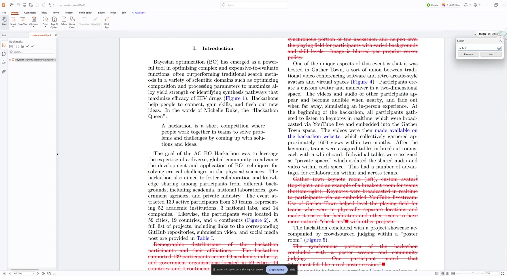

> "Um, but maybe there's a good reason to put it before them. So, I don't know. Then,
> given that... did it move? Okay, it looks like it might not even... might not be
> mentioned in the manuscript itself. I could be wrong."

He opens the PDF search box and hunts for "table II..." references to see whether the
moved table is cited anywhere in the text. That doubt drives the final placement decision.

---

### 23. [12:56](https://youtu.be/xClOSVH1Ero?t=776) Note for Claude: bring Table 3 back up

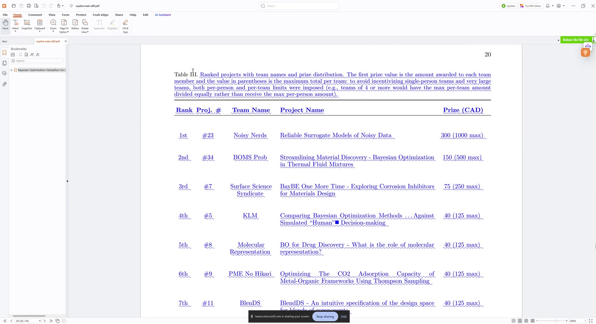

> **Sterling:** "Are you okay if we bring it back up top?" **Gage:** "Yeah." **Sterling:**
> "Okay. Yeah. Uh, note for Claude: take table three and move it back to, uh... uh,
> section... let's see... section three or section two."

Both transcription passes garbled "up top" into a name ("Bob" and "Tom" respectively);
the instruction that follows makes the meaning unambiguous. The first placement idea
(section two or three) gets refined twice before landing; see items 24 to 26.

---

### 24. [13:45](https://youtu.be/xClOSVH1Ero?t=825) First iteration, then: keep all of it in the introduction

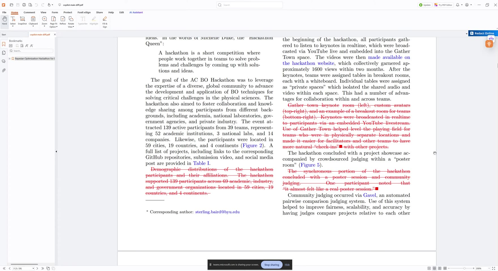

> "How about this: move it to section three, but have it at the beginning, before all of
> the project description. So it'll be within the projects' key findings. Uh, that's where
> it'll be mentioned. So table one and table two, I think, can be, uh, mentioned there.
> Nope, never mind. Keep all... scratch that. Keep all of it within the introduction."

**Action for Claude:** disregard the section three idea; the tables stay referenced from
the introduction.

---

### 25. [14:08](https://youtu.be/xClOSVH1Ero?t=848) Not right after Table 1 either

> "Uh, and then just right after where it says 'a full list of projects, blah blah blah,
> are provided in table one', uh, just put another sentence there that says, uh, 'a list
> of the top ranked...' um... no, scratch that. Don't... don't put the ranking table right
> there. Instead, put it right after talking about the community judging."

The sentence he is pointing at ("A full list of projects, including links to the
corresponding GitHub repositories, submission video, and social media post are provided in
Table I.") is visible in item 24's screenshot.

**Action for Claude:** superseded mid sentence; the final form is item 26.

---

### 26. [15:06](https://youtu.be/xClOSVH1Ero?t=906) Final decision: reference Table 3 right after the Gavel sentence

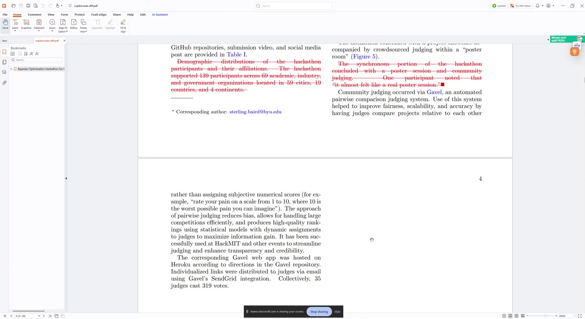

> "So that would be, uh... how about after this: so, 'community judging occurred via
> Gavel, an automated pairwise comparison judging system'... after 'enhanced transparency
> and credibility', put the reference to table three. Say 'see table three for', um, that
> ranking table... I guess it won't be table three, it'll be 'see table...' and then, I
> guess, the... the numbering might change. But 'see that table for rankings of the top 10
> projects and the awarded prizes'."

The paragraph on screen ends "...It has been successfully used at HackMIT and other events
to streamline judging and enhance transparency and credibility," which is the anchor
point.

**Action for Claude:** place the rankings table reference immediately after that
sentence, worded as "see Table N for rankings of the top 10 projects and the awarded
prizes", with N renumbered as needed once the table moves back up.

---

### 27. [16:32](https://youtu.be/xClOSVH1Ero?t=992) Wrap up

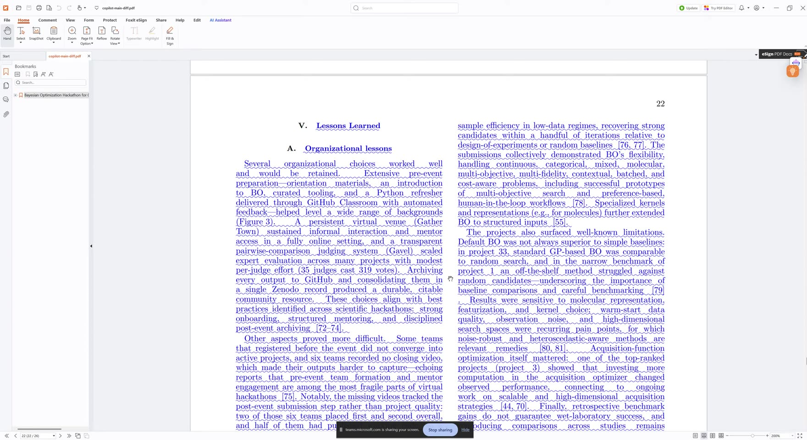

> "This some problems. Okay." "This was coming right now, I think." "So, yeah, but it's...
> I just didn't, uh, didn't want him to be potentially, uh, waiting."

After a quiet stretch of scrolling through the Lessons Learned section, the session winds
down; the closing fragments are conversational and only partly intelligible in both
transcription passes. In the final seconds the screen switches away from the manuscript
to a private Slack conversation; that portion is deliberately not screenshotted here, and
the review content ends at the frame above.

---

## Full corrected transcript

Corrections applied for intent; every change is listed in
[Transcript corrections](#transcript-corrections). Speaker labels appear only where the
attribution is confident. Long silent stretches (reading or scrolling) are marked.

[00:00](https://youtu.be/xClOSVH1Ero?t=0) **Sterling:** Okay, so just getting through the
rest of the document. Starting at section four, cross project synthesis. "The per project
summaries above document what each team attempted. Here we step back to synthesize
patterns across the 45 submissions and to distill practical and scientific lessons, as
encouraged by the reviewers." Uh, it's a little... it's, like, on the edge of obviously AI
wording, but it's sort of okay. Just whatever.

[00:35](https://youtu.be/xClOSVH1Ero?t=35) "These observations carry an important caveat:
the synchronous hackathon spanned only two days, so most submissions are best understood
as rapid feasibility studies rather than validated results." More disclaimers. Yeah, it's
okay to mention this, but this is too much of a fluffy disclaimer. (Attribution of "More
disclaimers" between the two speakers is uncertain.)

[01:01](https://youtu.be/xClOSVH1Ero?t=61) **Sterling:** I think we can address the
readers. Let's see. Yeah, we don't need to say "these observations carry an important
caveat." We'll just say: "Given that the synchronous hackathon spanned two days, many of
these projects did not undergo the same rigor and fleshing out as what might be expected
of a peer-reviewed manuscript." Period. Uh, "however, we report qualitative trends and
examples." Period.

[01:40](https://youtu.be/xClOSVH1Ero?t=100) Um, "to make the collection easier to navigate
and reuse, we classified each submission by its primary deliverable into one of five
categories: mature software, benchmark data set, tutorial or educational resource, uh,
application demonstration, and preliminary concept." Uh, "the distribution is dominated by
application demonstrations, with comparatively few released, reusable software tools."

[02:06](https://youtu.be/xClOSVH1Ero?t=126) One thing I'll make note of here, that was an
organizer lesson from me, is that I was surprised that so many of the submissions did not
fall cleanly within one of the published special topics. So if I go here to projects...
or, no, submission... submission... we have these special topics here: applying algorithms
to benchmark tasks, developing new benchmarks, creating instructional tutorials, real
world chemistry materials tasks, and then topic five, general, kind of a miscellaneous
category. I was surprised at how many fit into the miscellaneous category, and I wouldn't
necessarily have known in advance how to best segment out these topics. For example, if I
had... had to put... special topic "large language models applied to Bayesian
optimization", that would have probably been one of the largest, uh, special topics, had
I... had I done that.

[03:11](https://youtu.be/xClOSVH1Ero?t=191) So, uh, Claude, note for you: uh, you need to
make that note from me somewhere about kind of the surprising distribution of the
categories. From here, I need you to actually go in and show, um, maybe just in words, or
it could be in, like, a really small inline table, what the distribution of submitted
projects were across the five topics, and then show this kind of reclassification, um,
according to some other, uh, deliverable here. And this, I think, uh... response to
reviewers...

*(Reading quietly from 03:43 to 04:25.)*

[04:25](https://youtu.be/xClOSVH1Ero?t=265) That was... okay, the reviewer is saying "it
would be helpful to classify projects into categories such as mature software, benchmark
data sets, tutorials, application demonstrations, and preliminary concepts." Uh,
"categories such as": it doesn't have to be these specifically. Uh, we can leave it as
that for now. Um, we'll come back to that a little bit.

[04:48](https://youtu.be/xClOSVH1Ero?t=288) Anyway. Yeah, sorry, just making you sit here
and listen to me yell. **Gage:** I wish I could help more.

[05:03](https://youtu.be/xClOSVH1Ero?t=303) **Sterling:** Well, the... there's not going
to be released reusable software tools, in general, from a two-day hackathon, where most
people don't know how to... like, delivering a pip installable Python package is probably
not... like, somebody might need to take a day or two just to learn how to do that, in an
audience of mostly, like, material science... like, chemists and material scientists. Uh,
okay, I guess it's mentioned there. Uh, "pattern consistent with a short event in which
most teams probed feasibility rather than completing and validating a finished artifact."
Okay, that doesn't need to be stated. Uh, you're getting my unfiltered, uh...

[05:54](https://youtu.be/xClOSVH1Ero?t=354) Uh, okay. Code availability and licensing.
Like, some of this is good, for the project outputs, but really there should probably be
no more than 3[00] to 500 characters for this section. And I'm not even sure we need,
like, 4A and then 4B. It just... yeah, collapse 4A and 4B together. Trim them. So the...
what was originally 4A is no more than 3[00] to 500 characters. And then, uh, for 4B,
again, that one probably more like 200 to 300 characters.

[06:45](https://youtu.be/xClOSVH1Ero?t=405) Uh, for that one, the table, that's fine.
Wait: "license distribution across the 40 distinct project repositories linked from table
one." That's just going to confuse people, of why we're saying 40 instead of 45. So
instead, um, just make that final category, that is maybe for the, uh, the projects that
stayed at the proposal stage, but all 45 should be kind of accounted for here. Also,
"other slash unspecified", uh... you got to figure out what that is referring to. That's
just going to confuse people if they see this. They're going to... it naturally brings up
the question, well, in what way was it unspecified? How is that different than just "no
license file" being there? Uh, so probably that one would just get lumped to "no license
file" would be my guess there.

[07:56](https://youtu.be/xClOSVH1Ero?t=476) Uh, project classification. We don't need
the, uh... it's a really long, like, a really wide table just to say what the project
numbers were. Uh, I don't think we had a supplementary information, right? **Gage:** Well,
maybe we did. **Sterling:** Um, yeah, if you check on that... let me check that.
**Gage:** We do have supplement. **Sterling:** Okay.

*(Checking from 08:33 to 09:14.)*

[09:14](https://youtu.be/xClOSVH1Ero?t=554) In that case, uh... so, note for Claude: in
table 4, remove the project numbers column and put those in the supporting information
instead. **Gage:** It's just a detail. **Sterling:** Yeah. Yeah. So, uh, in fact, it's
titled "Electronic Supplementary Information: AC-BO Hackathon 2024, em [dash], All
Projects." Yeah, you can leave, like, a very small table in there, but take the project
numbers and put those in the supplementary information. Uh, table four should be a half
width table, similar to table five.

[10:06](https://youtu.be/xClOSVH1Ero?t=606) Uh, I'm a little confused. Is table three
being added? Was table 3 not in there before? Uh, I guess taking a quick look back at,
uh... how are we going to get... I don't [know] if you have the original submission.
**Gage:** I do. **Sterling:** Okay, cool. Could you check to see if... **Gage:** What page
was that? **Sterling:** Um, if you just scroll up, it, like... project prizes... project
prizes table, or something... ranked projects. Okay. So, for whatever reason, it was just
turning that all blue right here. **Gage:** I think it's cuz I asked it to move it.
**Sterling:** Maybe. Okay. Ah, there it is.

[11:07](https://youtu.be/xClOSVH1Ero?t=667) Okay. So, this, uh... that's another note
about the latexdiff. It's very confusing that we have the table being moved looking like
this, where this doesn't look like a table, really, or... anyway. We can probably make
note in the response to reviewer that we moved the table of project rankings and prizes to
a later spot. Is that something you... **Gage:** That's something I asked it to do. I
don't know if you have a preference on that, but... **Sterling:** What were your thoughts
there? **Gage:** Um, I just thought it made more sense that after... after you read
through the, uh, all the projects, to know, okay, now this is what the ranking was on.
**Sterling:** Okay, gotcha. **Gage:** Um, sorry, go ahead.

[12:07](https://youtu.be/xClOSVH1Ero?t=727) **Sterling:** Um, but maybe there's a good
reason to put it before them. So, I don't know. Then, given that... did it move? Okay, it
looks like it might not even... might not be mentioned in the manuscript itself. I could
be wrong.

*(Searching the PDF from 12:23 to 12:56.)*

[12:56](https://youtu.be/xClOSVH1Ero?t=776) Are you okay if we bring it back up top?
**Gage:** Yeah. **Sterling:** Okay. Yeah. Uh, note for Claude: take table three and move
it back to, uh... uh, section... let's see... section three or section two. Uh, move it...

[13:45](https://youtu.be/xClOSVH1Ero?t=825) How about this: move it to section three, but
have it at the beginning, before all of the project description. So it'll be within the
projects' key findings. Uh, that's where it'll be mentioned. So table one and table two, I
think, can be, uh, mentioned there. Nope, never mind. Keep all... scratch that. Keep all
of it within the introduction. Uh, and then just right after where it says "a full list of
projects, blah blah blah, are provided in table one", uh, just put another sentence there
that says, uh, "a list of the top ranked..." um... no, scratch that. Don't... don't put
the ranking table right there. Instead, put it right after talking about the community
judging.

[15:06](https://youtu.be/xClOSVH1Ero?t=906) So that would be, uh... how about after this:
so, "community judging occurred via Gavel, an automated pairwise comparison judging
system"... after "enhanced transparency and credibility", put the reference to table
three. Say "see table three for", um, that ranking table... I guess it won't be table
three, it'll be "see table..." and then, I guess, the... the numbering might change. But
"see that table for rankings of the top 10 projects and the awarded prizes."

*(Quiet scrolling from 15:44 to 16:32.)*

[16:32](https://youtu.be/xClOSVH1Ero?t=992) This some problems. Okay. "This was coming
right now, I think." So, yeah, but it's... I just didn't, uh, didn't want him to be
potentially, uh, waiting. *(Closing fragments; attribution and wording only partly
recoverable. The screen switches to Slack and the video ends at 16:54.)*

---

## Transcript corrections

| Time | Captions heard | Corrected to | Evidence |
|---|---|---|---|
| [01:01](https://youtu.be/xClOSVH1Ero?t=61) | "address the readers uh see" | "address the readers. Let's see." | Whisper pass |
| [03:00](https://youtu.be/xClOSVH1Ero?t=180) | "Beijian optimization" | "Bayesian optimization" | Domain term; screen shows the phrase context |
| [04:48](https://youtu.be/xClOSVH1Ero?t=288) | "Any just make you sit here and listen to me >> yell at um" | "Anyway. Yeah, sorry, just making you sit here and listen to me yell." with Gage replying "I wish I could help more." | Reconstructed from both passes; Whisper catches Gage's reply that the captions dropped |
| [05:54](https://youtu.be/xClOSVH1Ero?t=354) | "code available availability" | "code availability" | Disfluency; the section title is on screen |
| [06:11](https://youtu.be/xClOSVH1Ero?t=371) | "3 to 500 characters" | "3[00] to 500 characters" | Spoken shorthand; the paired "200 to 300" at 06:45 confirms the scale |
| [09:32](https://youtu.be/xClOSVH1Ero?t=572) | "supplementary information information" | "supplementary information" | Disfluency |
| [09:45](https://youtu.be/xClOSVH1Ero?t=585) | "AC-BO hackathon 2024 M- all projects" | "AC-BO Hackathon 2024, em [dash], All Projects" | He reads the SI title's em dash aloud as "em"; Whisper hears "2024 M-All Projects" |
| [11:07](https://youtu.be/xClOSVH1Ero?t=667) | "the latiff" | "the latexdiff" | Same recurring mishearing as part 1 |
| [12:07](https://youtu.be/xClOSVH1Ero?t=727) | "to put before him" | "to put it before them" | Both passes heard "him"; the referent is the per project summaries |
| [12:56](https://youtu.be/xClOSVH1Ero?t=776) | "bring it back up, Bob" | "bring it back up top" | Whisper hears "Tom"; the instruction that follows (move table three back up) settles it |
| [13:04](https://youtu.be/xClOSVH1Ero?t=784) | "no. for cloud" | "note for Claude" | The note-for-Claude pattern; Whisper hears "Note for Cloud" |
| [15:06](https://youtu.be/xClOSVH1Ero?t=906) | "GAVL" / "gavel and automated" | "Gavel, an automated" | The manuscript text on screen reads "via Gavel, an automated pairwise comparison judging system" |
| [15:12](https://youtu.be/xClOSVH1Ero?t=912) | "after enhanced transparency and credibility" | kept, clarified | The on screen sentence ends "enhance transparency and credibility"; the instruction is to insert the reference after that sentence |

One Whisper artifact is worth flagging so nobody trusts it later: on a silent stretch at
the end of the 12:56 segment, Whisper emitted a spurious "Thank you." No such words are
spoken there, and it appears nowhere in this document's transcript.
