# Manuscript revision walkthrough: AC BO Hackathon main article, part 1 of 2

Working session between **Sterling Baird** and **Gage** reviewing the latexdiff of the AC BO
Hackathon main article (the Digital Discovery revision produced on the
`copilot/address-dd-reviewer-feedback` branch). Sterling drives the screen, narrates the
diff, and dictates notes for Claude; Gage listens and weighs in. This session covers the
front matter through the end of the per project summaries (Section III). The
[part 2 document](bo-hackathon-main-article-review-2.md) picks up at Section IV, and the
[response to reviewers walkthrough](bo-hackathon-manuscript-review.md) covers the earlier
session on `RESPONSE_TO_REVIEWERS.md`.

| | |
|---|---|
| Video | [Manuscript review with Gage and Sterling (AC BO Hackathon), main article](https://youtu.be/yZTxWYVH3bA) (unlisted) |
| Channel | BYU Vertical Cloud Lab |
| Uploaded | 2026-08-19 |
| Duration | 13:45 (825 s) |
| Document under review | `copilot-main-diff.pdf`, the flattened latexdiff of `main.tex` (26 pages, viewed at 200% in Foxit) |
| Pull request | [AC-BO-Hackathon/ac-bo-hackathon.github.io#171](https://github.com/AC-BO-Hackathon/ac-bo-hackathon.github.io/pull/171) |
| Companion file | [`RESPONSE_TO_REVIEWERS.md` @ `780cdd1`](https://github.com/AC-BO-Hackathon/ac-bo-hackathon.github.io/blob/780cdd1/RESPONSE_TO_REVIEWERS.md), consulted twice on camera |

Screenshots live in [`bo-hackathon-main-article-review/`](bo-hackathon-main-article-review).
Every timestamp below is a link that opens the video at that moment.

---

## Video comments

**The video has no comments.** It is unlisted and had zero views and a comment count of
zero when checked at capture time (2026-08-20, roughly nine hours after upload), so there
is nothing to inlay into the timeline. If comments appear later, they can be slotted into
the walkthrough at the timestamps they refer to.

## How this document was produced

* **The transcript comes from YouTube's word level automatic captions** (json3 track,
  1139 words), unlike the part 0 session where no captions existed and Whisper had to be
  used. Every quoted passage was additionally re-transcribed from the opus audio with
  Whisper large-v3-turbo to cross check wording, and the screen text was used as ground
  truth wherever the speech reads a passage aloud.
* **The transcript has been corrected for intent.** Speech to text mangled model names,
  tool names, and several short words that change the meaning. All corrections are listed
  in [Transcript corrections](#transcript-corrections), including two words that both
  transcription passes got wrong the same way and that only the on screen selection
  disambiguates.
* **Screenshots were captured in 200 ms bursts.** For each feedback point, frames were
  taken at the anchor word and at 200 ms and 400 ms on either side (plus a frame 1.5 s
  after, where an edit or scroll lands), because Sterling gives quick feedback and several
  remarks refer to whatever is selected at exactly that instant. Frames that added nothing
  over the kept frame were dropped; where the selection or highlight is the evidence, that
  frame is the one kept.
* **Resolution.** Frames come from the 2560x1396 source and are downscaled to 1760 px wide
  for this repository.
* **This document follows the session's own rules.** No "thank you", no em or en dashes.
  The em dashes that appear inside quoted manuscript text at items 8, 20, and 27 are the
  defect being pointed at. Please leave those alone.

A recurring theme worth stating up front: they are reviewing a **diff**, so several
remarks narrate changes that were already made (approvingly or not) rather than request
new ones. The walkthrough marks which is which.

---

## Recurring themes

1. **The latexdiff renders figure caption changes misleadingly.** Original captions show
   up as struck through body text at the wrong location, and the session's biggest note
   for Claude is to fix that rendering. ([02:08](https://youtu.be/yZTxWYVH3bA?t=128),
   [03:01](https://youtu.be/yZTxWYVH3bA?t=181), [05:17](https://youtu.be/yZTxWYVH3bA?t=317))
2. **No em dashes.** The new Table 1 caption uses them; they get called out on sight.
   ([04:04](https://youtu.be/yZTxWYVH3bA?t=244))
3. **Cut disclaimers and fluff.** "A lot of disclosures, a lot of fluff... that can all be
   removed." ([05:41](https://youtu.be/yZTxWYVH3bA?t=341),
   [05:56](https://youtu.be/yZTxWYVH3bA?t=356))
4. **Proposal stage projects stay in, but small.** Entries for projects that never went
   anywhere should be about 150 characters, three or four lines at most, and should not
   rival the completed projects for space. ([09:16](https://youtu.be/yZTxWYVH3bA?t=556),
   [10:12](https://youtu.be/yZTxWYVH3bA?t=612))
5. **Provenance parentheticals are too long.** The repeated "(No recorded video was
   submitted...)" notes should shrink. ([07:25](https://youtu.be/yZTxWYVH3bA?t=445),
   [11:15](https://youtu.be/yZTxWYVH3bA?t=675))

## All notes for Claude in this session

Collected here so they can be actioned without scrubbing through the video. Timestamps
link to the walkthrough items with the screen evidence.

- [ ] Fix the latexdiff rendering of figure captions: the deletions and insertions should
  appear at the figure captions themselves, not as phantom body text deletions. Applies to
  Figures 2 through 5. ([02:30](https://youtu.be/yZTxWYVH3bA?t=150), item 4;
  [03:01](https://youtu.be/yZTxWYVH3bA?t=181), item 5)
- [ ] Table 1 caption: say the six summaries were "prepared from the corresponding project
  pages", not "prepared manually". ([03:57](https://youtu.be/yZTxWYVH3bA?t=237), item 7)
- [ ] Remove the em dashes. ([04:04](https://youtu.be/yZTxWYVH3bA?t=244), item 8)
- [ ] Shrink the Table 1 caption drastically; drop the long explanation about abandoned
  projects. ([04:13](https://youtu.be/yZTxWYVH3bA?t=253), item 9)
- [ ] Section III preamble: say the drafts were "reviewed and edited by the organizers to
  correct errors and ensure a faithful description", dropping "manually" and the fluff
  around it. ([05:34](https://youtu.be/yZTxWYVH3bA?t=334), item 11)
- [ ] Delete the disclosure sentences ("We emphasize that these summaries are intended as
  concise, uniformly generated descriptions..."). Pretty much none of that stretch needs
  to be there. ([05:41](https://youtu.be/yZTxWYVH3bA?t=341), item 12)
- [ ] Project 19: cut the "(No recorded video was submitted...)" parenthetical, state
  plainly at the end that the submission was never carried out, and cap the entry near 150
  characters. ([07:25](https://youtu.be/yZTxWYVH3bA?t=445) and
  [09:16](https://youtu.be/yZTxWYVH3bA?t=556), items 14 and 17)
- [ ] Make sure the reviewer point "the main text skips project 14, 19, 23, 29, 34, and
  42... indicate why these were withheld" is addressed.
  ([08:30](https://youtu.be/yZTxWYVH3bA?t=510), item 16)
- [ ] Keep every proposal stage entry to three or four lines.
  ([10:12](https://youtu.be/yZTxWYVH3bA?t=612), item 19)
- [ ] Shorten the provenance sentences, for example project 34's.
  ([11:21](https://youtu.be/yZTxWYVH3bA?t=681), item 22)
- [ ] Project 42: remove the sentence saying the repository turned out to be a fork of the
  hackathon website. ([11:51](https://youtu.be/yZTxWYVH3bA?t=711), items 23 and 24)
- [ ] Send a link to project 42's public write-up.
  ([12:31](https://youtu.be/yZTxWYVH3bA?t=751), item 25)
- [ ] Figure out how involved the project 42 team was and whether any of them are
  co-authors. ([12:56](https://youtu.be/yZTxWYVH3bA?t=776), item 26)

---

## Walkthrough

### 1. [00:07](https://youtu.be/yZTxWYVH3bA?t=7) Opening: reviewing the changes; the "snapshot of resources" passage is gone

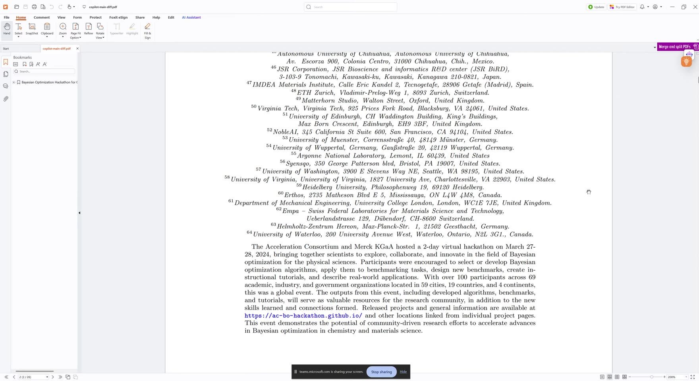

> "So, take a look at the changes. Removed this saying 'a snapshot of resources listed on
> the hackathon webpage'."

The session opens on the diff PDF. By 00:19 the view is on page 3, where a whole passage
beginning "A snapshot of resources listed on the hackathon webpage such as hackathon
orientation, intro to BO, and a Python refresher assignment..." is struck through in red,
ending with the sentence "Image is blurred per preprint server policy."

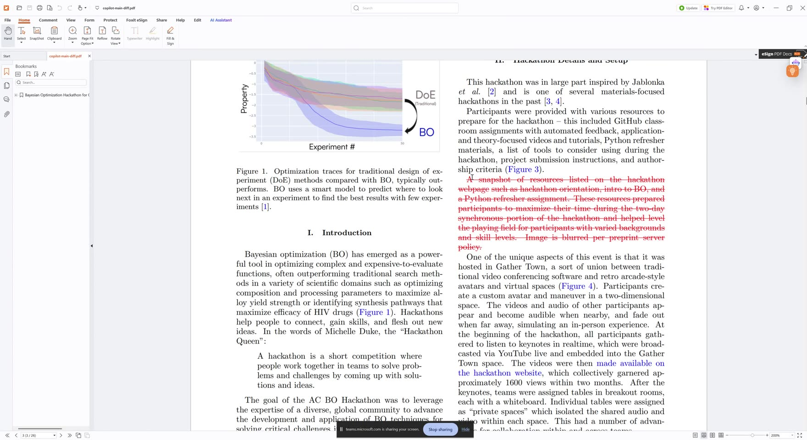

Both transcription passes are ambiguous between "Remove" and "Removed", but the passage is
already deleted on screen, so this is narration of an applied change, not a new request.

**Status:** change already applied; Sterling is reviewing it. Its fate is settled at
item 3.

---

### 2. [00:37](https://youtu.be/yZTxWYVH3bA?t=37) Preprint server policy, and why the faces are blurred

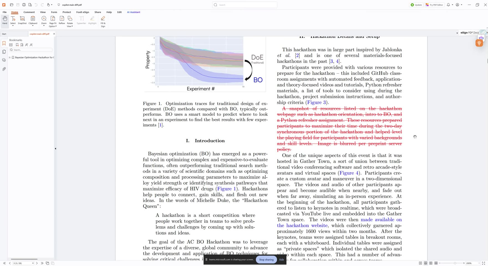

> "Uh, okay. Preprint server policy. Oh, that's right. That's right. I blurred the faces
> here for that. That makes more sense."

At 00:46 the view jumps to page 5, where Figure 3 (the screenshot of the hackathon
resources webpage) visibly has blurred faces in its video thumbnails. The figure's new
caption is inserted in blue and now ends "Portions of the screenshot have been blurred to
protect potentially identifying information," replacing the old policy wording. "That
makes more sense" refers to the new phrasing.

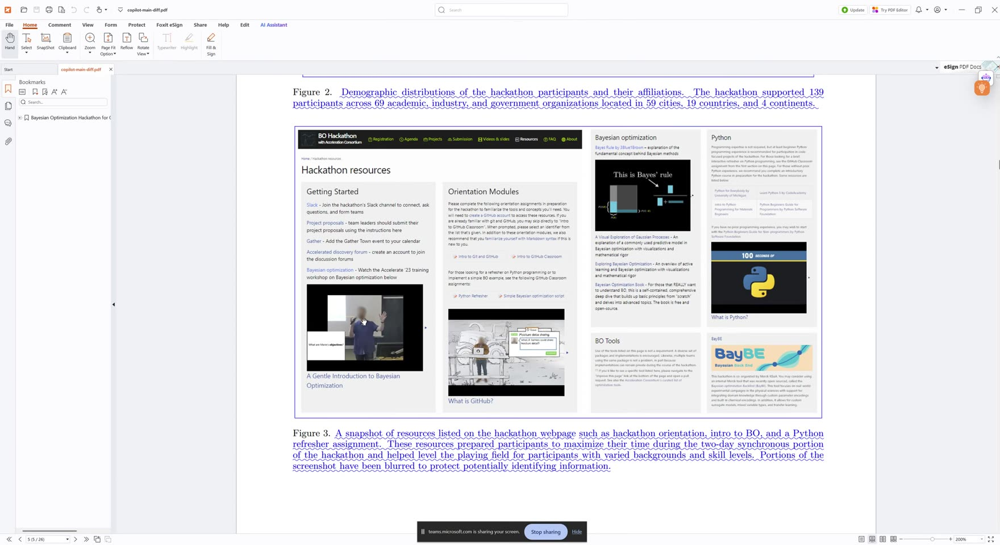

**Status:** change already applied and approved.

---

### 3. [01:03](https://youtu.be/yZTxWYVH3bA?t=63) The reviewer's preprint policy point, and the deletion is approved as redundant

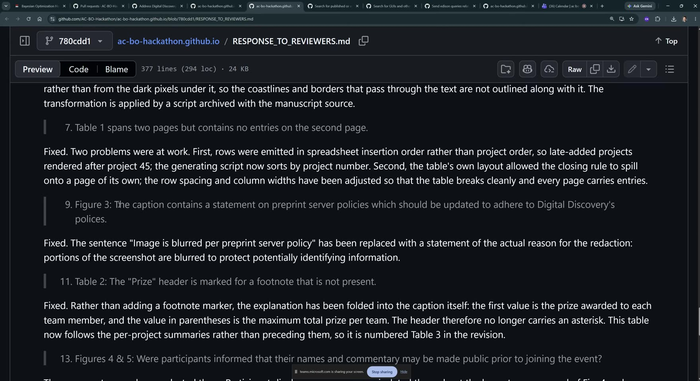

> "And in the response for reviewers. Okay. 'The caption contains a statement on preprint
> server policies which should be updated to adhere to Digital Discovery's policies.' Oh,
> I guess that's fine. I'm okay with removing that. That seems kind of redundant relative
> to the paragraph before it."

Sterling flips to `RESPONSE_TO_REVIEWERS.md` and reads reviewer point 9, whose recorded
response is: "Fixed. The sentence 'Image is blurred per preprint server policy' has been
replaced with a statement of the actual reason for the redaction." Back on the PDF, he
approves the removal of the body text passage from item 1 because the paragraph before it
("Participants were provided with various resources... (Figure 3)") already says the same
thing.

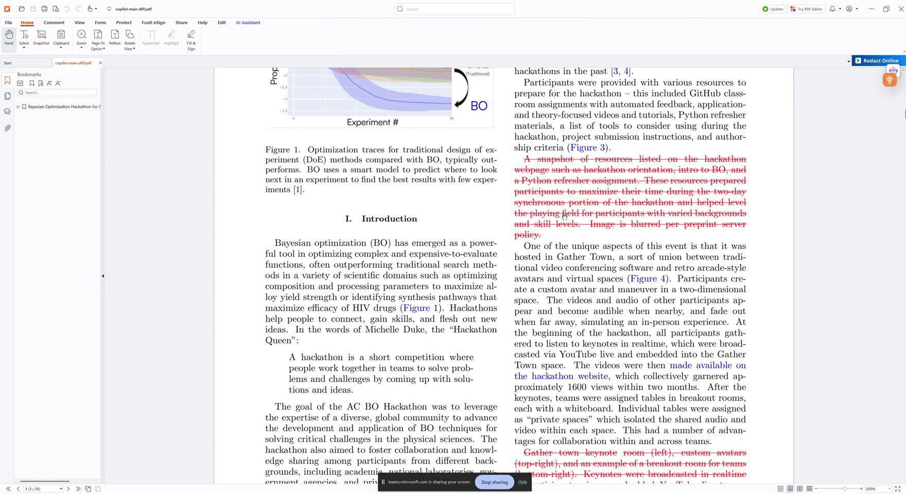

**Status:** approved as done. Note that both transcription passes heard "the program
before it"; the referent on screen is the preceding paragraph.

---

### 4. [02:08](https://youtu.be/yZTxWYVH3bA?t=128) Note for Claude: the diff renders the original Figure 3 caption as deleted body text

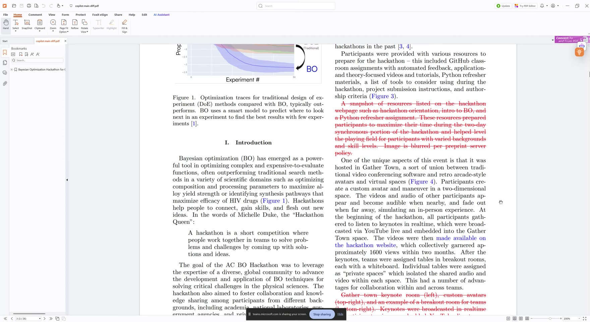

> "These are... This is just a weird latexdiff thing. I think this is the caption saying
> it got rid of this caption here associated with figure three. So, this is a note for
> Claude. This would confuse reviewers, making them think that this was originally here in
> this exact location when this is actually the original figure 3 caption. And so that
> should definitely be changed so that down here, where there's the figure three caption
> added, that it has the deletions and insertions here."

The struck through passage from item 1 is not deleted body text at all: it is the
**original Figure 3 caption**, which latexdiff has rendered as a deletion in the middle of
Section II. At 02:35 Sterling selects the whole struck passage while explaining the
confusion:

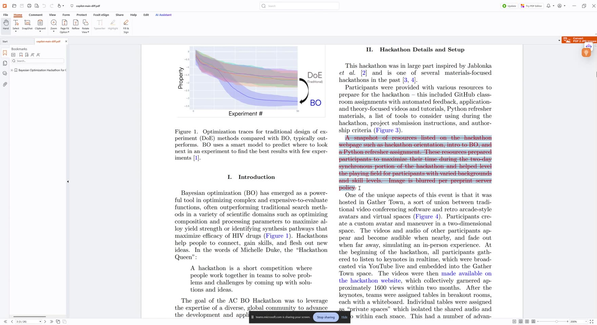

At 02:53 he scrolls to where the diff should have put the markup: Figure 3's caption,
which currently shows as a pure blue insertion.

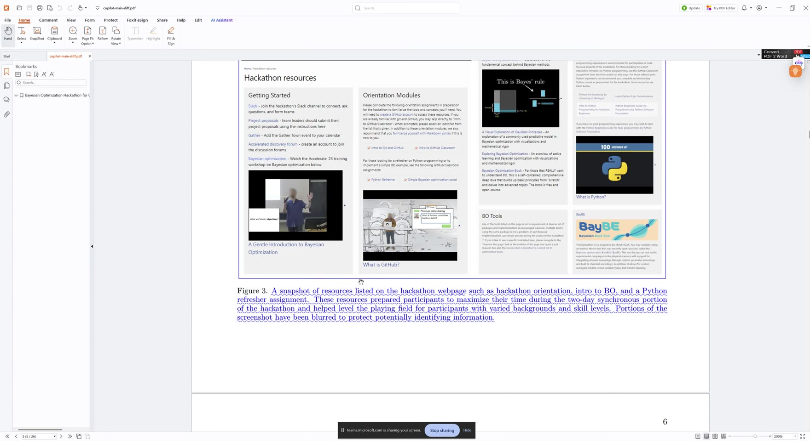

**Action for Claude:** make the diff attribute caption changes to the captions. A reviewer
must not conclude the text sat in the body at that location. Both transcription passes
heard "detective thing"; the same mishearing of "latexdiff" occurred in the part 0 video
and the on screen context settles it.

---

### 5. [03:10](https://youtu.be/yZTxWYVH3bA?t=190) Every figure has the same caption problem

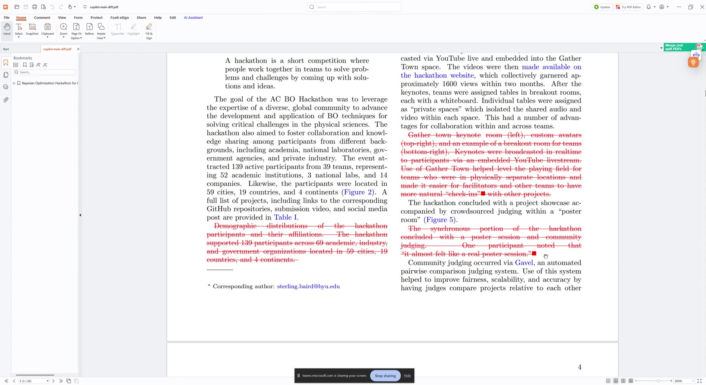

> "That was very strange. Uh, so that seems to be the case for uh this one as well. So
> basically all the figures had something weird going on with the caption here."

On screen: the original Figure 4 caption ("Gather town keynote room (left), custom
avatars (top-right)...") and Figure 5 caption ("The synchronous portion of the hackathon
concluded with a poster session and community judging...") both appear as struck through
body text, exactly like Figure 3's did, along with Figure 2's demographics caption in the
left column.

**Action for Claude:** the caption diff fix applies to all figures, not just Figure 3.

---

### 6. [03:24](https://youtu.be/yZTxWYVH3bA?t=204) Table 1 gained the missing projects, and a very long caption

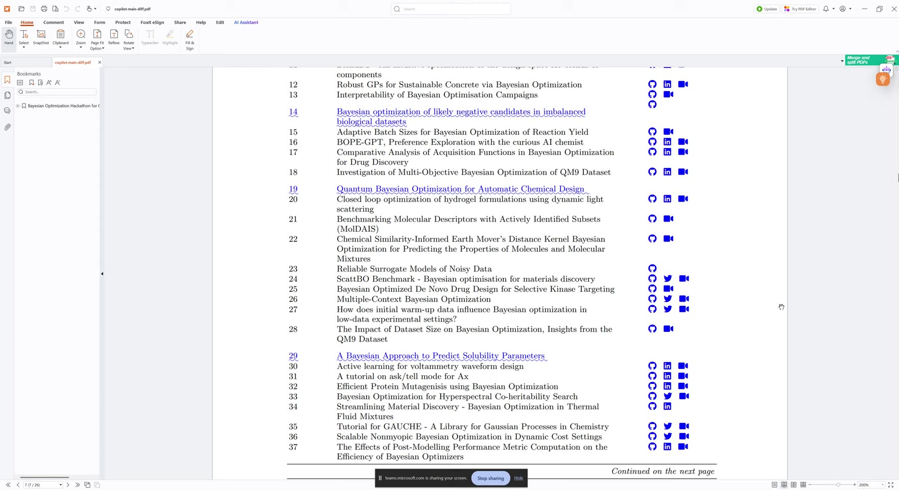

> "There were some changes made. Okay. In this table looks like we got some of these other
> ones added in. Nice long caption for that."

Projects 14 ("Bayesian optimization of likely negative candidates in imbalanced biological
datasets"), 19 ("Quantum Bayesian Optimization for Automatic Chemical Design"), and 29 ("A
Bayesian Approach to Predict Solubility Parameters") appear as blue insertions in Table 1,
which previously skipped them. "Nice long caption" is dry: the caption has grown a long
inserted passage, visible on the next page.

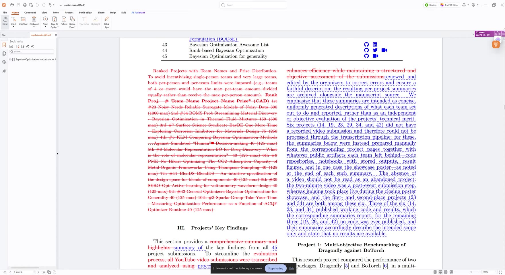

**Status:** the additions are welcome; the caption length is dealt with in items 7 to 12.

---

### 7. [03:50](https://youtu.be/yZTxWYVH3bA?t=230) Say "prepared from the corresponding project pages", not "prepared manually"

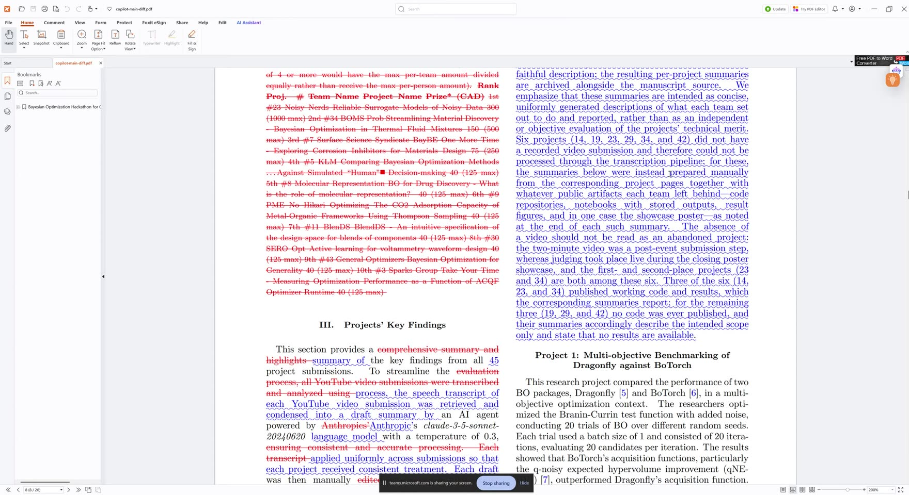

> "'Six projects did not have a recorded video submission and could not be processed.'
> Uh, again, not sure saying 'prepared manually' makes sense. So let's just say 'prepared
> from the corresponding project pages'."

The caption sentence on screen reads "...for these, the summaries below were instead
prepared manually from the corresponding project pages together with whatever public
artifacts each team left behind..." The instruction drops "manually".

This screenshot also captures the Section III preamble diff in the left column, including
"powered by Anthropic's claude-3-5-sonnet-20240620 language model with a temperature of
0.3", which is what the captions garbled as "claw 35 sonnet" (see items 10 and 18 and the
corrections table).

**Action for Claude:** reword to "prepared from the corresponding project pages".

---

### 8. [04:04](https://youtu.be/yZTxWYVH3bA?t=244) Do not use em dashes, and one is selected as he says it

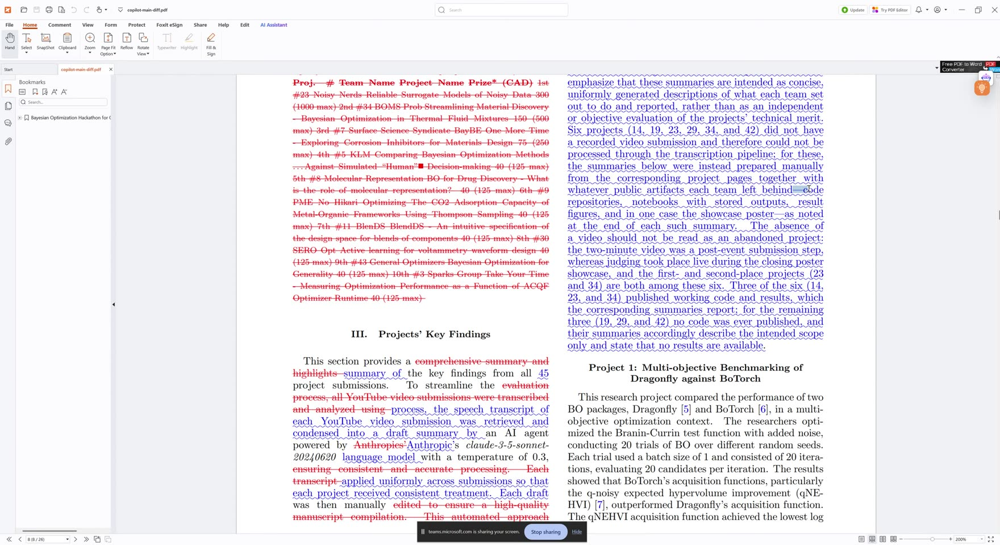

> "Uh, don't use em dashes."

The burst capture catches the selection sitting on the em dash in the caption's phrase
"...each team left behind—code repositories, notebooks with stored outputs, result
figures, and in one case the showcase poster—as noted at the end of each such summary."
The two em dashes quoted here are the defect being pointed at; they are quoted verbatim on
purpose.

**Action for Claude:** strip em dashes throughout. Same rule as the part 0 session, where
it was also written into `CLAUDE.md`.

---

### 9. [04:09](https://youtu.be/yZTxWYVH3bA?t=249) The abandoned projects explanation is far too much

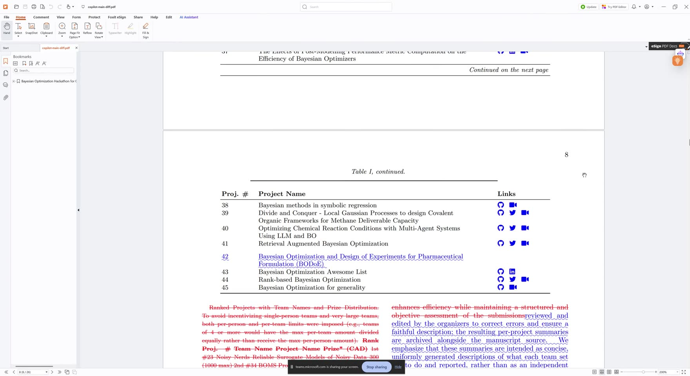

> "Uh, this is way too much explanation uh about abandoned projects. Uh, just overall this
> is far too big of a far too big of a caption for the table."

The caption's long stretch ("The absence of a video should not be read as an abandoned
project: the two-minute video was a post-event submission step, whereas judging took place
live during the closing poster showcase, and the first- and second-place projects (23 and
34) are both among these six. Three of the six...") is the target.

**Action for Claude:** cut the caption down hard. State the essentials and stop.

---

### 10. [04:47](https://youtu.be/yZTxWYVH3bA?t=287) Reading the Section III preamble through the diff is confusing

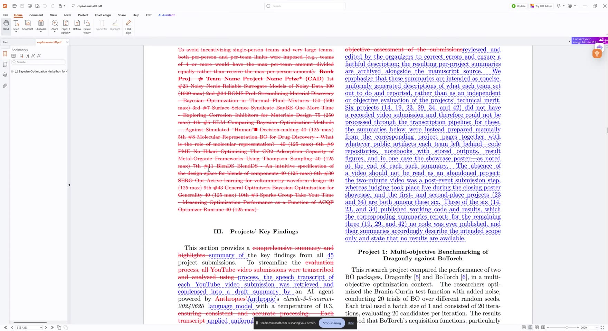

> "'...video submission was retrieved and condensed into a draft summary by an AI agent
> powered by Anthropic's claude-3-5-sonnet language model' ... 'applied uniformly.' 'Each
> draft was then manually...' Oh, this is so confusing. Okay, this latexdiff is really
> weird, uh, how this is getting formatted. So, something with the two column formatting
> and the captions, very strange going on here."

Struck out old text, inserted new text, the relocated ranked projects caption, and the
Table 1 caption all interleave across the two columns, so reading the preamble start to
finish through the diff is genuinely hard.

**Action for Claude:** part of the same latexdiff rendering fix as items 4 and 5. The
manuscript text itself is dealt with next.

---

### 11. [05:28](https://youtu.be/yZTxWYVH3bA?t=328) "Reviewed and edited by the organizers to correct errors and ensure a faithful description"

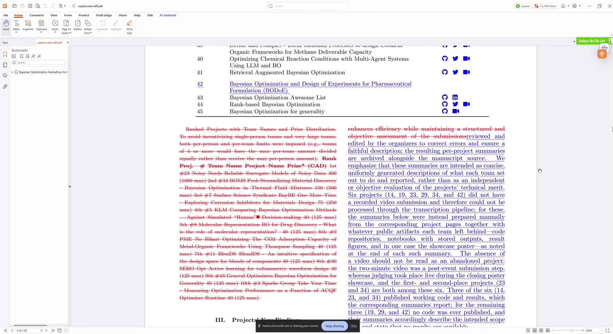

> "So, 'each draft was then manually reviewed and edited.' We just say... just say it was
> uh then reviewed and edited by the organizers to correct errors and ensure faithful
> description."

**Action for Claude:** in the Section III preamble, the sentence about the drafts becomes
"...then reviewed and edited by the organizers to correct errors and ensure a faithful
description." No "manually", nothing more.

---

### 12. [05:41](https://youtu.be/yZTxWYVH3bA?t=341) Disclosures and fluff, all of it can go

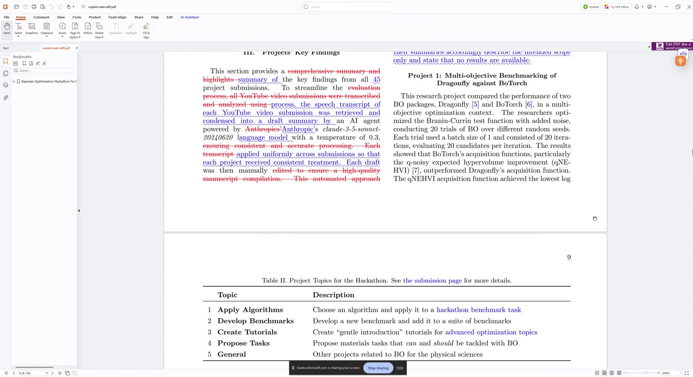

> "Uh, 'this is too much. We don't need to say 'we emphasize that these are intended as
> concise uniformly generated descriptions'..." "A lot of, lot of disclosures, a lot of
> fluff." "Yeah. Like basically nothing here needs to... pretty much nothing from here
> needs to be there. Um, yeah, fluff, disclosures and fluff, that can all be removed."

The sentence on screen (visible in item 6's second screenshot) is "We emphasize that these
summaries are intended as concise, uniformly generated descriptions of what each team set
out to do and reported, rather than as an independent or objective evaluation of the
projects' technical merit." One voice observes "a lot of disclosures, a lot of fluff" and
the other agrees; the caption attribution between Sterling and Gage is not certain from
the audio.

**Action for Claude:** delete the disclosure and emphasis sentences from the caption and
preamble.

---

### 13. [06:13](https://youtu.be/yZTxWYVH3bA?t=373) Project 14 is back in, and after a read, it is fine

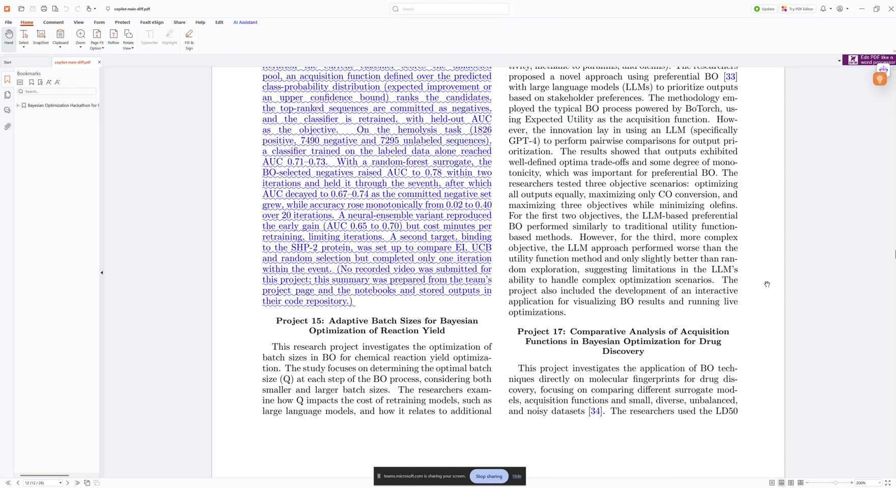

> "Um, see what else we got. Okay, so added project 14 back in. Let's do a quick read of
> this. ... I think it's probably fine to leave this. 'No recorded video' being there.
> It's not really that... Nah, it's probably fine."

He reads project 14's new summary (the hemolysis imbalanced datasets project) including
its closing parenthetical "(No recorded video was submitted for this project; this summary
was prepared from the team's project page and the notebooks and stored outputs in their
code repository.)" and decides it can stay as is for this one.

**Status:** reviewed and accepted.

---

### 14. [07:00](https://youtu.be/yZTxWYVH3bA?t=420) Project 19: the "no recorded video" sentence is redundant here

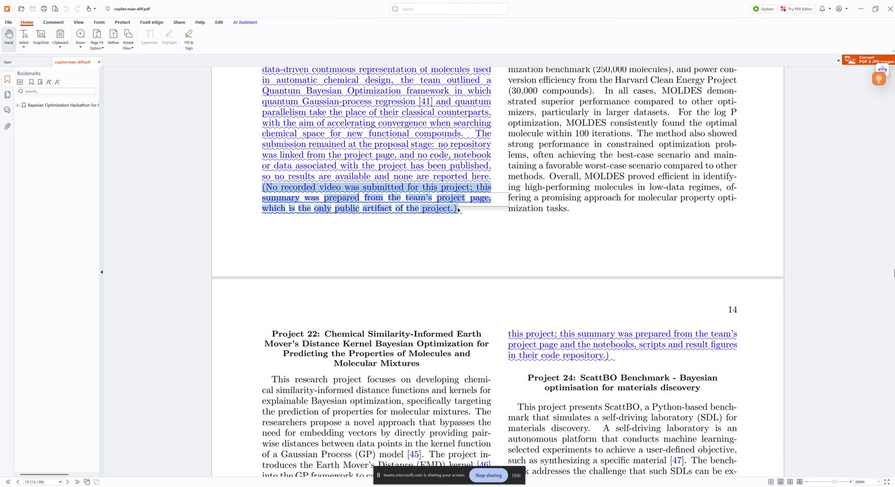

> "Uh, project 19. For this one specifically, you don't have to say there was no recorded
> video, because everything before it clarifies this was just the proposal, basically."

At 07:25 the parenthetical "(No recorded video was submitted for this project; this
summary was prepared from the team's project page, which is the only public artifact of
the project.)" is selected on screen. The summary already says "The submission remained at
the proposal stage: no repository was linked from the project page, and no code, notebook
or data associated with the project has been published," which makes the parenthetical
redundant.

**Action for Claude:** drop the parenthetical from project 19's entry.

---

### 15. [07:34](https://youtu.be/yZTxWYVH3bA?t=454) Should proposal-only projects stay in at all?

> **Sterling:** "I'm still a little back and forth on whether we actually include
> something that was just proposed and not actually carried out, but I don't know. What do
> you think, Gage?"
>
> "So, some of these projects weren't actually done. They just proposed them and nothing
> actually happened with them." "Like the people didn't show up, or they didn't really
> take it to fruition."
>
> "I think... this whole manuscript is about the results of the hackathon, right?"
> "Yeah." "For completeness it's nice to have those in, but if they didn't contribute
> anything, then there's probably no point." "Yeah."

A genuine open discussion rather than a directive; the screen stays on project 19 (item
14's screenshot). The resolution lands at item 17: keep them, but make them small. Speaker
attribution inside this exchange is only partly certain from the audio, so most lines are
left unattributed.

---

### 16. [08:13](https://youtu.be/yZTxWYVH3bA?t=493) The reviewer's "why were these withheld" point must be addressed

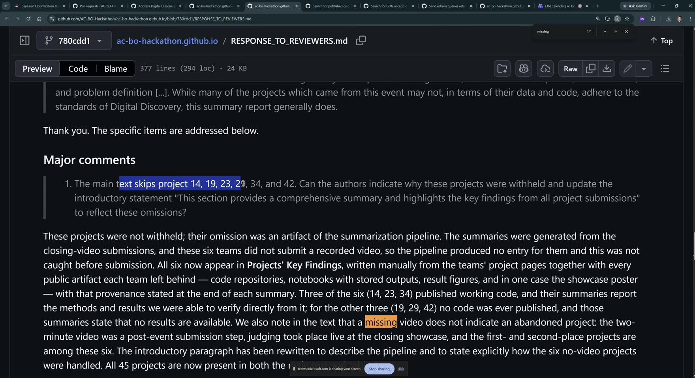

> "And then going back to maybe the reviewer comments about missing... oh: 'main text
> skips these projects... indicate why these were withheld.' Uh, yeah. So, yeah, this part
> definitely needs to be addressed. ... And I think that was changed in the... yeah, it's
> just like a bajillion other things."

He searches the response letter (the browser find bar shows "missing") and lands on Major
comment 1: "The main text skips project 14, 19, 23, 29, 34, and 42. Can the authors
indicate why these projects were withheld and update the introductory statement...?" Part
of the reviewer's sentence is selected on screen. The recorded response says the omission
was a summarization pipeline artifact, not withholding; the closing remark is that
verifying it in the diff is hard because the diff contains a bajillion other changes.

**Action for Claude:** confirm this reviewer point is fully addressed once the diff is
readable.

---

### 17. [09:16](https://youtu.be/yZTxWYVH3bA?t=556) Keep project 19, but cap it near 150 characters

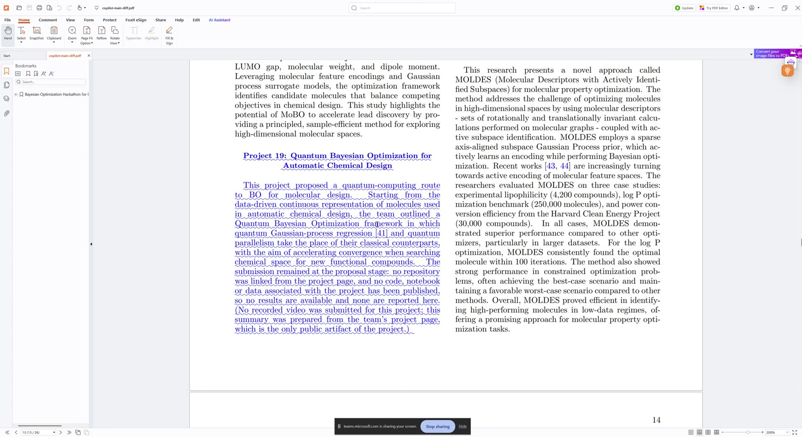

> "How about we just make... we can leave it in, but we'll just make this much simpler. So
> for project 19, just make it really clear at the end: the submission was never carried
> out. But this should be really small. It shouldn't be taking, like, probably max 150
> characters for this section. Uh, because if it's getting just about as much space as a
> section where they actually did take it to completion, that doesn't seem quite right."

**Action for Claude:** shrink project 19's entry to roughly 150 characters, ending with a
plain statement that the submission was never carried out.

---

### 18. [09:49](https://youtu.be/yZTxWYVH3bA?t=589) Claude already changed the Section III opening line

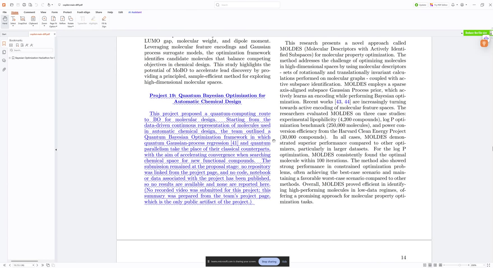

> "Uh, right underneath part three, um, Claude changed it. So, 'this section provides a
> summary of the key findings from all 45 project submissions.' So changed it from 'a
> comprehensive summary' of all product submissions."

The line itself is visible in item 7's screenshot: "This section provides a
~~comprehensive summary and highlights~~ summary of the key findings from all 45 project
submissions." This matches what the reviewer asked for in Major comment 1 (item 16). The
captions rendered the words as "pod changed it"; the Whisper pass hears "Claude changed
it," and the remark is made while scrolling, so the screen shows the project pages rather
than the line being described.

**Status:** narrated, approved.

---

### 19. [10:12](https://youtu.be/yZTxWYVH3bA?t=612) Proposal stage entries: three or four lines, then move on

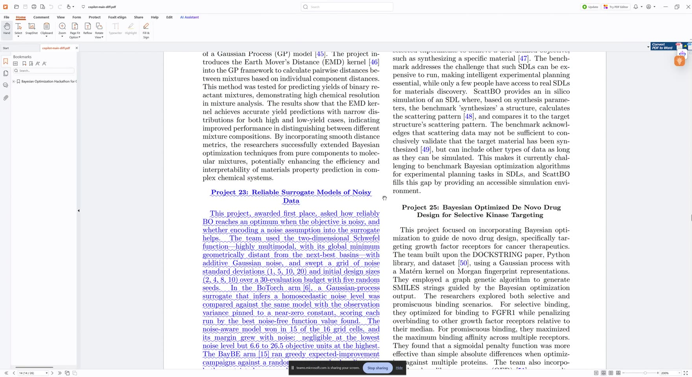

> "So we can leave it in there and just... yeah. This really shouldn't span more than,
> like, maybe three, three or four lines, these ones, and we can take another look at it
> afterwards."

"These ones" are the proposal stage entries discussed in items 14 to 17. The screen is mid
scroll across project 23 ("This project, awarded first place...") on the way to project
34.

**Action for Claude:** three or four lines for each proposal stage entry.

---

### 20. [10:37](https://youtu.be/yZTxWYVH3bA?t=637) Project 34's in-house library is fine

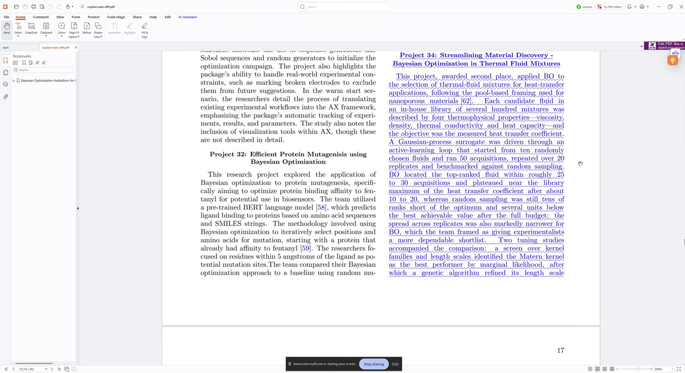

> "Um, project 34. Oh yeah, they used an in-house library. That's okay."

On screen: "Each candidate fluid in an in-house library of several hundred mixtures was
described by four thermophysical properties—viscosity, density, thermal conductivity and
heat capacity—and the objective was the measured heat transfer coefficient." (The em
dashes quoted there are in the manuscript text and are covered by item 8's rule.)

**Status:** accepted; no change requested here.

---

### 21. [11:08](https://youtu.be/yZTxWYVH3bA?t=668) Good that a winner gets a long section

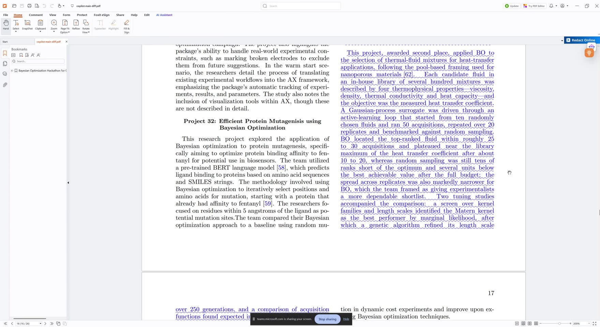

> "It's good that one of the project winners has a relatively long section."

Project 34 took second place overall, so its relatively long summary is proportionate,
unlike the proposal stage entries from item 19.

**Status:** observation, no action.

---

### 22. [11:15](https://youtu.be/yZTxWYVH3bA?t=675) The provenance sentence could be a lot briefer

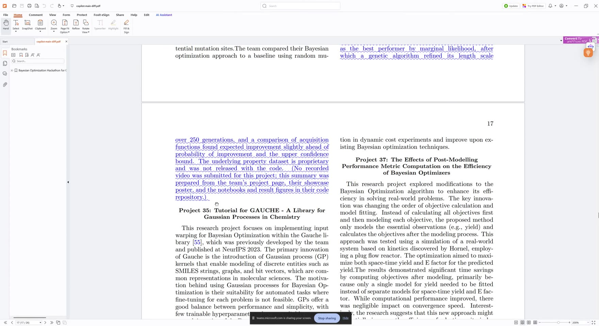

> "And then this is too long, saying 'no recorded video was submitted for this project.
> The summary was prepared from the team's project page, their showcase poster, and the
> notebooks and result figures in their code repository.' I think that could just be a lot
> briefer."

**Action for Claude:** compress the provenance parentheticals throughout (project 34's is
the example).

---

### 23. [11:44](https://youtu.be/yZTxWYVH3bA?t=704) Project 42: the fork remark is silly, cut it

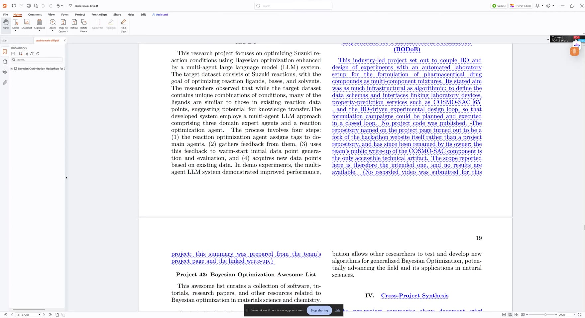

> "Um, project 42. 'No project code was published.' Okay, this is silly. There's no reason
> to mention that the project page turned out to be a fork of the hackathon."

The sentence on screen: "The repository named on the project page turned out to be a fork
of the hackathon website itself rather than a project repository, and has since been
renamed by its owner; the team's public write-up of the COSMO-SAC component is the only
accessible technical artifact."

**Action for Claude:** delete the fork remark from project 42's entry.

---

### 24. [12:03](https://youtu.be/yZTxWYVH3bA?t=723) That wording came from the agent itself, not the write-up

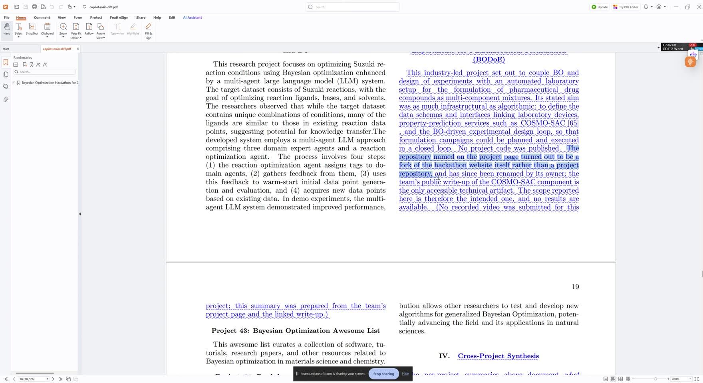

> "That's just wording from yourself, not Claude, not from uh the linked write-up, the
> team's project page, and the linked write-up."

The burst catches the exact sentence selected. The point: the fork observation is the
drafting agent's own editorial commentary, not something taken from the team's project
page or write-up, which is why it does not belong. The captions heard "not caught" where
Whisper hears "not Claude"; the intended contrast (the sentence's author versus its
claimed sources) is clear from the selection either way.

**Action for Claude:** same deletion as item 23; more generally, do not editorialize
beyond the sources.

---

### 25. [12:31](https://youtu.be/yZTxWYVH3bA?t=751) Send a link to this so-called write-up

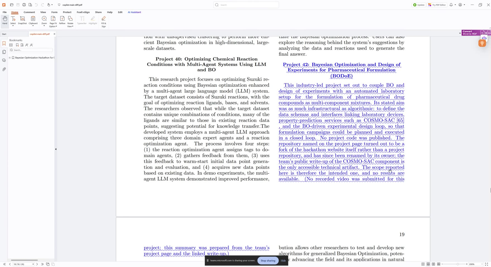

> "Uh, that gets me wondering if this one just had, like, all of the results redacted,
> basically, and they just gave a write-up. So send, send us a link of this so-called
> write-up that's there."

**Action for Claude:** provide the link to project 42's public COSMO-SAC write-up so the
authors can evaluate it directly.

---

### 26. [12:38](https://youtu.be/yZTxWYVH3bA?t=758) Project 42: proposal stage treatment, and are they co-authors?

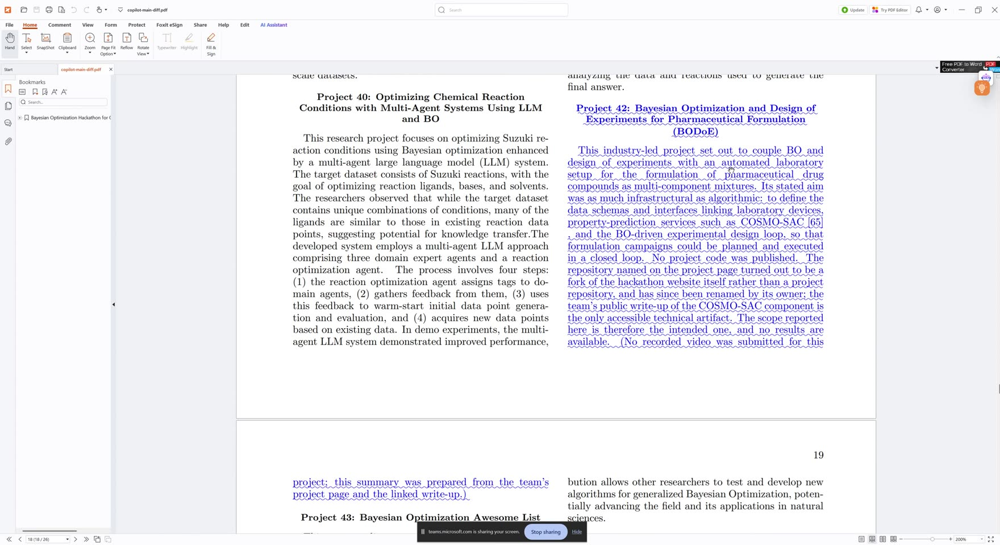

> "And, uh, this might be one of those where we just take a few lines to say... it stayed
> at the proposal stage. Basically, we need to figure out if the people from project 42,
> like, how involved they were. Are they... are there co-authors from project 42? Um,
> let's figure that out."

**Action for Claude:** check the author list against the project 42 team, then give the
entry the few-line proposal stage treatment from item 19.

---

### 27. [13:14](https://youtu.be/yZTxWYVH3bA?t=794) Ending at Cross-Project Synthesis: "there's a lot of new here"

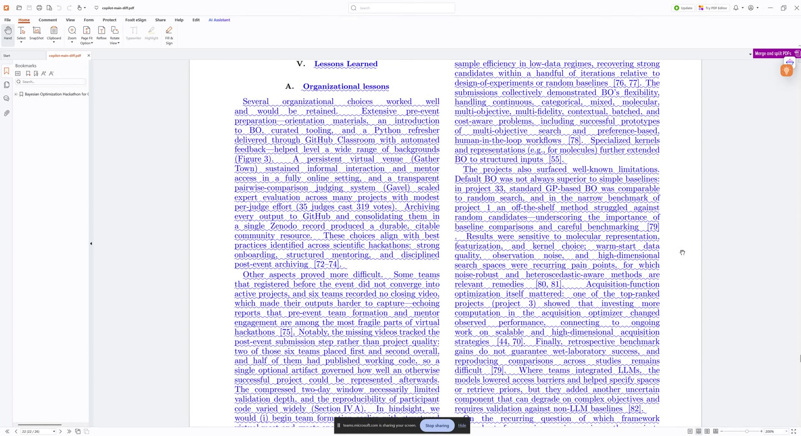

> "Cross project synthesis. Uh oh. Same. Okay. There's a lot of new here."

The video ends as the scroll reaches the entirely new material: the inserted "IV.
Cross-Project Synthesis" heading and then "V. Lessons Learned", whole pages of blue. (The
inserted text visible here contains several more em dashes, "preparation—orientation
materials," "feedback—helped level", which fall under item 8's rule.) The
[part 2 session](bo-hackathon-main-article-review-2.md) begins exactly here, at Section
IV.

---

## Full corrected transcript

Corrections applied for intent; every change is listed in
[Transcript corrections](#transcript-corrections). Speaker labels appear only where the
attribution is confident. Bracketed text marks reconstructions that remain uncertain after
both transcription passes.

[00:06](https://youtu.be/yZTxWYVH3bA?t=6) **Sterling:** So, take a look at the changes.
Removed this saying "a snapshot of resources listed on the hackathon webpage". Uh, okay.
Preprint server policy. Oh, that's right. That's right. I blurred the faces here for that.
That makes more sense.

[00:49](https://youtu.be/yZTxWYVH3bA?t=49) And in the... in the response for reviewers.
Okay. "The caption contains a statement on preprint server policies which should be
updated to adhere to Digital Discovery's policies." Oh, I guess that's fine. I'm okay with
removing that. That seems kind of redundant relative to the paragraph before it.

[01:57](https://youtu.be/yZTxWYVH3bA?t=117) **Gage:** Oh, gotcha.

[01:58](https://youtu.be/yZTxWYVH3bA?t=118) **Sterling:** These are... This is just a
weird latexdiff thing. I think this is the caption saying it got rid of this caption here
associated with figure three. So, it just did something weird with the caption, and that's
probably going to need to change for uh the diff version. So, this is a note for Claude.
This would confuse reviewers, making them think that this was originally here in this
exact location, when this is actually the original figure 3 caption. And so that should
definitely be changed, so that down here, where there's the figure three caption added,
that it has the deletions and insertions here.

[02:53](https://youtu.be/yZTxWYVH3bA?t=173) **Gage:** That's so weird.

[02:56](https://youtu.be/yZTxWYVH3bA?t=176) **Sterling:** That was very... that was very
strange. Uh, so that seems to be the case for uh this one as well. So basically all the...
all the figures had something weird going on with the... with the caption here. There were
some changes made. Okay. In this table, looks like we got some of these other ones added
in. Nice long caption for that.

[03:44](https://youtu.be/yZTxWYVH3bA?t=224) "Six projects did not have a recorded video
submission and could not be processed." Uh, again, not sure saying "prepared manually"
makes sense. So let's just say "prepared from the corresponding project pages". Uh, don't
use em dashes. Uh, this is way too much explanation uh about abandoned projects. Uh, just
overall, this is far too big of a... far too big of a caption for the table.

[04:36](https://youtu.be/yZTxWYVH3bA?t=276) "Section provides a summary of key findings
from 45 project submissions." Uh, "video submission was retrieved and condensed into a
draft summary by an AI agent powered by Anthropic's claude-3-5-sonnet language model,"
"applied uniformly," "each draft was then manually..." Oh, this is so confusing. Okay,
this latexdiff is really weird, uh, how this is getting formatted. So, something with the
two column formatting and the captions, very strange going on here.

[05:28](https://youtu.be/yZTxWYVH3bA?t=328) Uh, so "each draft was then manually reviewed
and edited." We just say... we say manually... just say it was uh then reviewed and edited
by the organizers to correct errors and ensure faithful description. Uh, this is too much.
We don't need to say "we emphasize that these are intended as concise, uniformly generated
descriptions." Um...

[05:56](https://youtu.be/yZTxWYVH3bA?t=356) A lot of... lot of disclosures, a lot of
fluff. Yeah. Like, basically nothing here needs to... like, pretty much nothing from here
needs to be there. Um, yeah, fluff... disclosures and fluff, that can all be removed.
(The two voices here are not confidently attributable.)

[06:13](https://youtu.be/yZTxWYVH3bA?t=373) **Sterling:** Um, see what else we got. Okay,
so added project 14 back in. Let's do a quick read of this. I think it's probably fine to
leave this. "No recorded video" being there. It's not really that... Nah, it's probably
fine. Uh, project 19. For this one specifically, you don't have to say there was no
recorded video, because everything before it clarifies this was just the proposal,
basically.

[07:34](https://youtu.be/yZTxWYVH3bA?t=454) I'm still a little back and forth on whether
we actually include something that was just proposed and not actually carried out, but I
don't know. What do you think, Gage?

[07:42](https://youtu.be/yZTxWYVH3bA?t=462) So, some of these... some of these projects
weren't actually done. They just proposed them, and nothing actually happened with them.
Like the people didn't show up, or they didn't really, like, take it to fruition. Um, I
think... I mean, this... this whole journal, or this whole entry manuscript, is about the
results of the hackathon going on, right? So... yeah... if, I mean, for completeness it's
nice to have those in, but if they don't... if they didn't contribute anything, then
there's probably no point. Yeah. (Sterling and Gage talking it through; individual lines
not confidently attributable.)

[08:13](https://youtu.be/yZTxWYVH3bA?t=493) **Sterling:** And then going back to maybe the
reviewer comments about missing... oh: "main text skips these projects... indicate why
these were withheld." Uh, yeah. So... yeah, this part definitely needs to be addressed.
Mhm. And I think that was changed in the... Yeah, it's just, like, a bajillion other
things.

[08:45](https://youtu.be/yZTxWYVH3bA?t=525) How about we just make... we can leave it in,
but we'll just make this much simpler. So for project 19, just make it really clear at the
end: uh, the submission was never carried out. But this should be really small. It
shouldn't be taking, like, probably max 150 characters for this section. Uh, because if
it's getting just about as much space as a section where they actually did take it to
completion, that doesn't seem quite right.

[09:49](https://youtu.be/yZTxWYVH3bA?t=589) Uh, right underneath part three, um, Claude
changed it. So, "this section provides a summary of the key findings from all 45
[project] submissions." So changed it from "a comprehensive summary" of all [the]
submissions. So a little bit different, appropriate for that. Yeah. So we can leave it in
there and just... yeah. This really shouldn't span more than, like, maybe three... three
or four lines, these ones, and we can take another look at it afterwards.

[10:21](https://youtu.be/yZTxWYVH3bA?t=621) Um, project 34. Oh yeah, they used an in-house
library. That's okay. It's good that one of the project winners has a relatively long
section. And then this is too long, saying "no recorded video was submitted for this
project. The summary was prepared from the team's project page, their showcase poster,
and the notebooks and result figures in their code repository." I think that could just be
a lot briefer.

[11:24](https://youtu.be/yZTxWYVH3bA?t=684) Um, project 42. "No project code was
published." Okay, this is silly. There's no reason to mention that the project page turned
out to be a fork of the hackathon. That's... that's just wording from yourself, not
Claude, not from uh the linked write-up... the team's project page, and the linked
write-up. Uh, that gets me wondering if this one just had, like, all of the results
redacted, basically, and they just gave a write-up. So send... send us a link of this
so-called write-up that's there.

[12:38](https://youtu.be/yZTxWYVH3bA?t=758) And uh... and this might be one of those where
we just take a few lines to say... there were no... like, this stayed at the proposal
stage. Basically, we need to figure out if the people from project 42, like, how involved
they were. Are they... are there co-authors from project 42? Um, let's figure that out.

[13:14](https://youtu.be/yZTxWYVH3bA?t=794) Cross project synthesis. Uh oh. Same. Okay.
There's a lot of new here.

*(The video ends at 13:32, mid review; the part 2 session picks up at Section IV.)*

---

## Transcript corrections

| Time | Captions heard | Corrected to | Evidence |
|---|---|---|---|
| [00:07](https://youtu.be/yZTxWYVH3bA?t=7) | "Remove this saying" | "Removed this saying" (narration) | The passage is already struck through on screen; both audio passes ambiguous |
| [01:00](https://youtu.be/yZTxWYVH3bA?t=60) | "in a response for viewers" | "in the response for reviewers" | Whisper pass; `RESPONSE_TO_REVIEWERS.md` is on screen seconds later |
| [01:24](https://youtu.be/yZTxWYVH3bA?t=84) | "Oh, I guess that's Find" | "Oh, I guess that's fine" | Whisper pass |
| [01:57](https://youtu.be/yZTxWYVH3bA?t=117) | "relative to the program before it" | "relative to the paragraph before it" | Both passes heard "program"; the referent on screen is the preceding paragraph, and "program" has no referent |
| [02:08](https://youtu.be/yZTxWYVH3bA?t=128) | "a weird detective thing" | "a weird latexdiff thing" | Both passes heard "detective"; identical mishearing resolved in the part 0 video, and the screen shows the latexdiff artifact being discussed |
| [02:30](https://youtu.be/yZTxWYVH3bA?t=150) | "this is a no for claude" | "this is a note for Claude" | The note-for-Claude pattern used throughout the sessions |
| [04:04](https://youtu.be/yZTxWYVH3bA?t=244) | "m dashes" | "em dashes" | Selection sits on an em dash on screen |
| [04:47](https://youtu.be/yZTxWYVH3bA?t=287) | "anthropics claw 35 sonnet" | "Anthropic's claude-3-5-sonnet" | Screen shows "Anthropic's claude-3-5-sonnet-20240620"; Whisper hears "Claude 3.5 Sonnet" |
| [05:17](https://youtu.be/yZTxWYVH3bA?t=317) | "this latiff is really weird" | "this latexdiff is really weird" | Screen context; same correction as 02:08 |
| [08:23](https://youtu.be/yZTxWYVH3bA?t=503) | "main tech skips these projects" | "main text skips these projects" | The reviewer sentence is selected on screen; Whisper agrees |
| [09:49](https://youtu.be/yZTxWYVH3bA?t=589) | "um pod changed it" | "um, Claude changed it" | Whisper hears "Cloud changed it"; the diff of the changed line is on screen earlier (item 7 screenshot) |
| [09:58](https://youtu.be/yZTxWYVH3bA?t=598) | "of all other submissions" | "of all [the] submissions" | The struck text on screen reads "a comprehensive summary and highlights"; the spoken tail is indistinct in both passes |
| [10:16](https://youtu.be/yZTxWYVH3bA?t=616) | "after words" | "afterwards" | Sense |
| [12:03](https://youtu.be/yZTxWYVH3bA?t=723) | "not caught, not from uh the linked write up" | "not Claude, not from uh the linked write-up" | Whisper pass hears "not Claude"; the criticized sentence is selected on screen |
| [13:19](https://youtu.be/yZTxWYVH3bA?t=799) | "Uh oh. Same." | left as heard, low confidence | Whisper skips the filler; possibly "uh, oh, same [thing]" about the diff rendering |

Words in brackets in the transcript are supplied for readability where both passes were
indistinct. Disfluencies ("ex explanation", repeated words) are lightly smoothed in the
walkthrough quotes and preserved in the full transcript where they carry timing.
