# Manuscript revision walkthrough: AC BO Hackathon response to reviewers

Working session between **Sterling Baird** and **Gage** reviewing the Digital Discovery
response to reviewers for the AC BO Hackathon manuscript. Sterling drives the screen and
gives feedback; Gage listens and asks questions.

| | |
|---|---|
| Video | [Manuscript revisions with Gage and Sterling (AC BO Hackathon)](https://youtu.be/B-b4jGhzsD4) (unlisted) |
| Channel | BYU Vertical Cloud Lab |
| Uploaded | 2026-08-19 |
| Duration | 27:31 (1651 s) |
| Document under review | [`RESPONSE_TO_REVIEWERS.md` @ `780cdd1`](https://github.com/AC-BO-Hackathon/ac-bo-hackathon.github.io/blob/780cdd1/RESPONSE_TO_REVIEWERS.md) (377 lines, 24 KB) |
| Pull request | [AC-BO-Hackathon/ac-bo-hackathon.github.io#171](https://github.com/AC-BO-Hackathon/ac-bo-hackathon.github.io/pull/171) |
| Follow-up issue raised on camera | [AC-BO-Hackathon/ac-bo-hackathon.github.io#172](https://github.com/AC-BO-Hackathon/ac-bo-hackathon.github.io/issues/172) |

Screenshots live in [`bo-hackathon-manuscript-review/`](bo-hackathon-manuscript-review).
Every timestamp below is a link that opens the video at that moment.

---

## Video comments

**The video has no comments.** It is unlisted, was uploaded the same day this document was
produced, and had zero views at the time of capture. The comment count returned by the
YouTube API is `0` and the comment list is empty, so there is nothing to inlay into the
timeline. If comments are added later, they can be slotted into the walkthrough below at
the timestamp they refer to.

## How this document was produced

Worth stating plainly, because it affects how much you should trust the quotes:

* **No YouTube transcript existed.** The video had no automatic captions and no uploaded
  subtitles (it was only hours old). Rather than wait, the audio was transcribed locally
  with Whisper `large-v3-turbo` using word level timestamps, then every passage quoted
  below was re-transcribed a second time with the larger `large-v3` model to check
  wording.
* **The transcript has been corrected for intent.** Speech to text mangled names, jargon,
  and at least one word that only the screen could disambiguate. All corrections are
  listed in [Transcript corrections](#transcript-corrections) so you can see exactly what
  was changed and why.
* **Screenshots were captured in bursts.** For each feedback point, frames were taken at
  the moment of the statement and at 1.5 s before and after it, because several remarks
  refer to whatever the mouse was hovering over or had just selected. Where the burst
  frames add information, they are included and labelled `before` and `after`. Where they
  were visually identical, only the main frame is kept.
* **Resolution.** Frames come from the 1440p (2560x1392) source so the document text stays
  legible, downscaled to 1760 px wide for this repository.
* **This document follows the rules it describes.** No "thank you", no em or en dashes. The
  four em dashes that remain are inside quotations of the reviewed text at items 4 and 29,
  where the dash is the thing being criticised. Please leave those alone.

A useful consequence of the burst capture: several of Sterling's remarks are only
interpretable from the selection highlight. At [00:24](https://youtu.be/B-b4jGhzsD4?t=24)
the words "latexdiff PDF" are selected on screen, which is the only reason we know the
garbled audio was "latexdiff" and not the "detective" the speech to text produced.

---

## The recurring rules

Nine directives account for most of the session. They are collected here because they
apply to nearly every reviewer response, not just the ones where Sterling happened to say
them out loud.

1. **Never write "thank you".** Not at the top, not per reviewer, not per point.
   ([00:46](https://youtu.be/B-b4jGhzsD4?t=46), [08:59](https://youtu.be/B-b4jGhzsD4?t=539), [18:01](https://youtu.be/B-b4jGhzsD4?t=1081))
2. **Never use em dashes or en dashes.** They are treated as a giveaway that text was
   machine written. ([00:47](https://youtu.be/B-b4jGhzsD4?t=47), [07:46](https://youtu.be/B-b4jGhzsD4?t=466), [22:19](https://youtu.be/B-b4jGhzsD4?t=1339))
3. **Keep each response to exactly what changed**, targeting about 100 characters.
   ([00:35](https://youtu.be/B-b4jGhzsD4?t=35))
4. **Point at the manuscript section** rather than restating the change: "see the
   manuscript, section X". ([01:10](https://youtu.be/B-b4jGhzsD4?t=70), [25:06](https://youtu.be/B-b4jGhzsD4?t=1506), [25:14](https://youtu.be/B-b4jGhzsD4?t=1514))
5. **Let the manuscript update speak for itself.** Do not argue the case in the response
   letter. ([01:37](https://youtu.be/B-b4jGhzsD4?t=97))
6. **Every reviewer point should produce some change.** Flatly refusing a point is rare;
   find a compromise. ([02:00](https://youtu.be/B-b4jGhzsD4?t=120))
7. **Do not write "Agreed".** State what was done instead.
   ([18:21](https://youtu.be/B-b4jGhzsD4?t=1101))
8. **Prefer "Fixed", "Addressed", or "Corrected"** followed by a section pointer.
   ([25:38](https://youtu.be/B-b4jGhzsD4?t=1538), [27:16](https://youtu.be/B-b4jGhzsD4?t=1636))
9. **Do not sound AI written.** This is the through line of the whole session.
   ([00:12](https://youtu.be/B-b4jGhzsD4?t=12), [25:20](https://youtu.be/B-b4jGhzsD4?t=1520))

Mid session, Sterling stops reviewing and encodes rules 2 and 9 directly into the
repository's `CLAUDE.md` so they apply to future automated edits. See
[07:42](#1842--writing-the-anti-slop-writing-style-rule-into-claudemd).

---

## Walkthrough

### 1. [00:15](https://youtu.be/B-b4jGhzsD4?t=15) The opening preamble sounds AI written and will be wiped

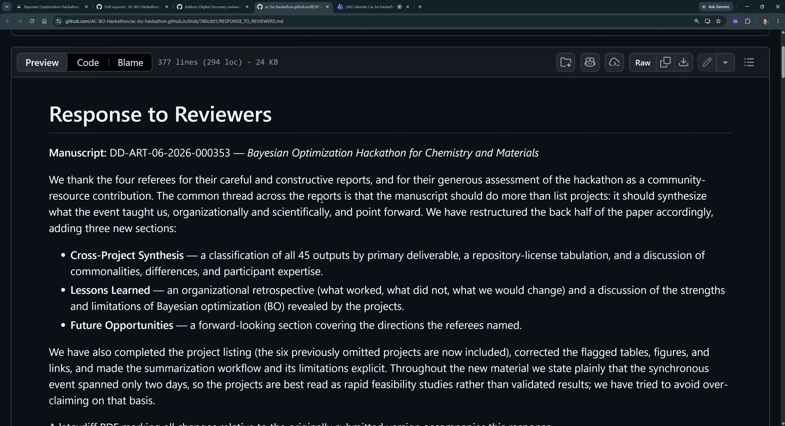

> "Then I'll kind of shift in and out between an annotation for Claude to do things, and
> that's with you. So this sounds kind of AI written, a lot of this beginning. So most of
> this beginning is just going to get wiped."

**Action:** delete most of the opening preamble. It reads as machine generated.

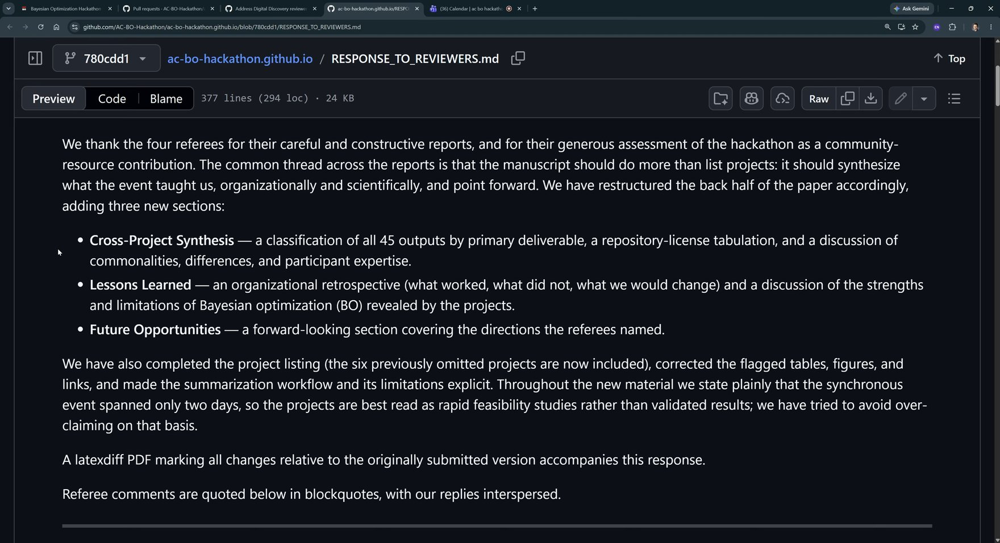

---

### 2. [00:24](https://youtu.be/B-b4jGhzsD4?t=24) Drop the latexdiff sentence, reviewers do not care

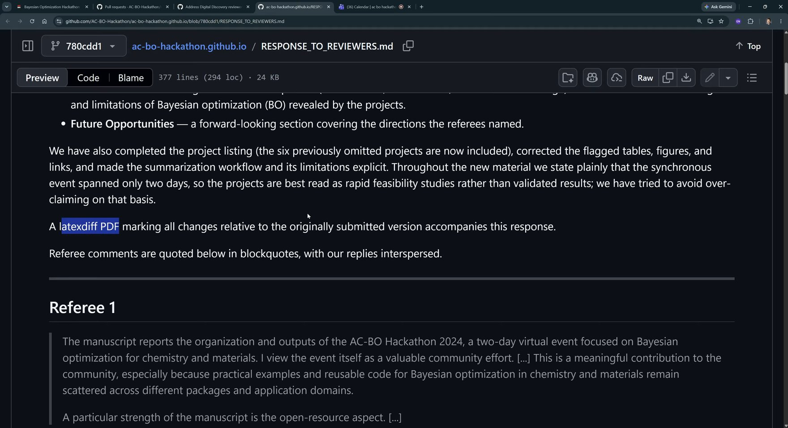

> "Don't need to say latexdiff. Reviewers don't care about that."

The selection highlight is the evidence here. The sentence under discussion is "A
latexdiff PDF marking all changes relative to the originally submitted version accompanies
this response."

**Action:** remove the latexdiff sentence from the preamble.

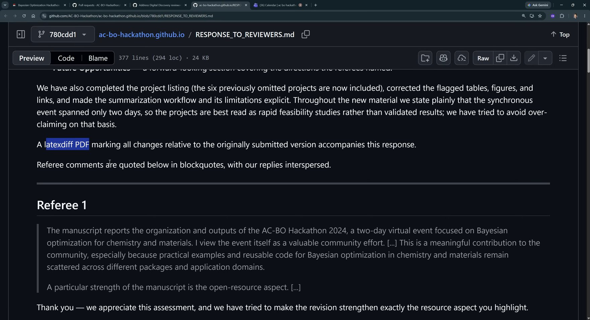

---

### 3. [00:35](https://youtu.be/B-b4jGhzsD4?t=35) Note for Claude: rewrite in no more than 100 characters

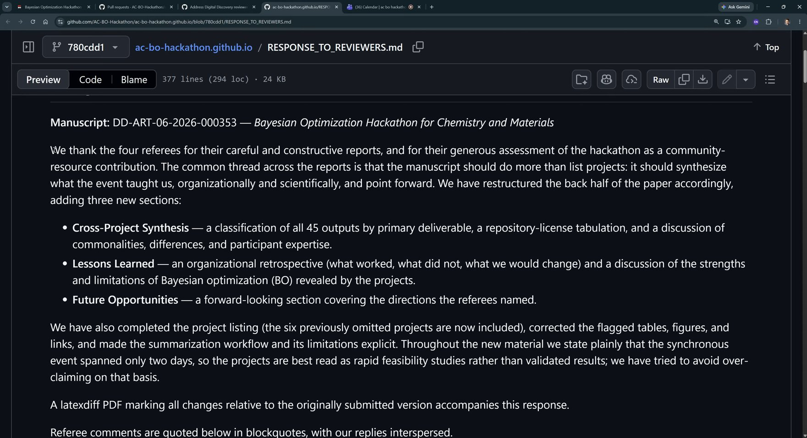

> "So I guess, note for Claude: rewrite this with no more than a hundred characters, and
> we'll probably do some edits ourselves on that."

Both transcription passes independently produced "characters", not "words". Taken with
rule 3 and the surrounding instruction to state only what changed, a roughly one line
response is the intent. A response such as "Added as Lessons Learned, Organizational
lessons." is about 50 characters.

**Action:** each response gets rewritten to roughly 100 characters, then hand edited.

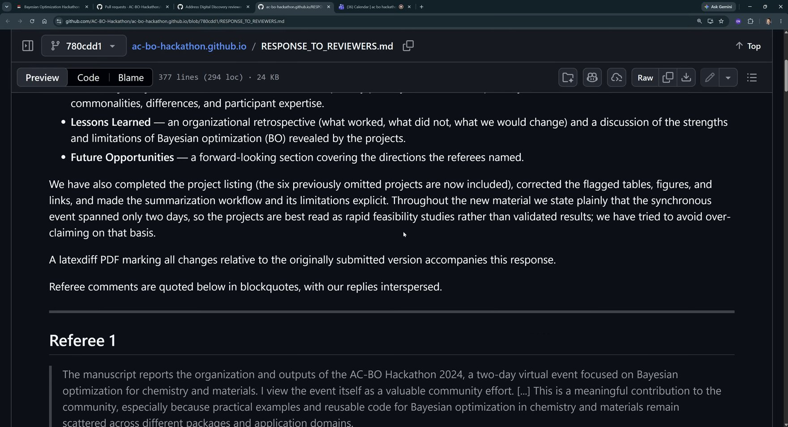

---

### 4. [00:47](https://youtu.be/B-b4jGhzsD4?t=47) No thank yous, no en or em dashes

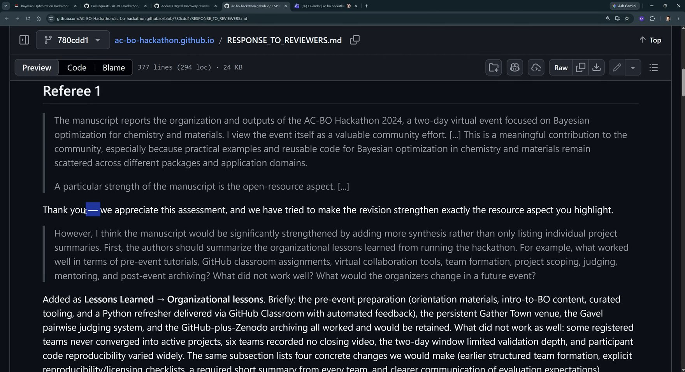

> "Don't put thank you anywhere. Don't use any en or em dashes."

The burst capture pays off again: at this exact moment the selection sits on the em dash
inside "Thank you — we appreciate this assessment", so the instruction and its example are
on screen together.

**Action:** strip every "thank you" and every en or em dash from the response document.

---

### 5. [00:56](https://youtu.be/B-b4jGhzsD4?t=56) Keep the comment to exactly what you changed

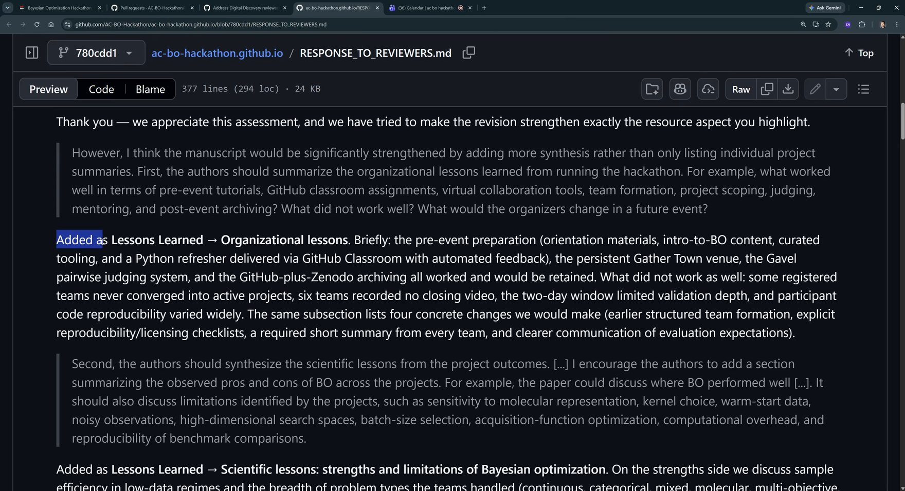

> "Just keep the comments to what exactly you changed."

**Action:** responses state the change and nothing else.

---

### 6. [01:00](https://youtu.be/B-b4jGhzsD4?t=60) The "Added as Lessons Learned, Organizational lessons" pattern

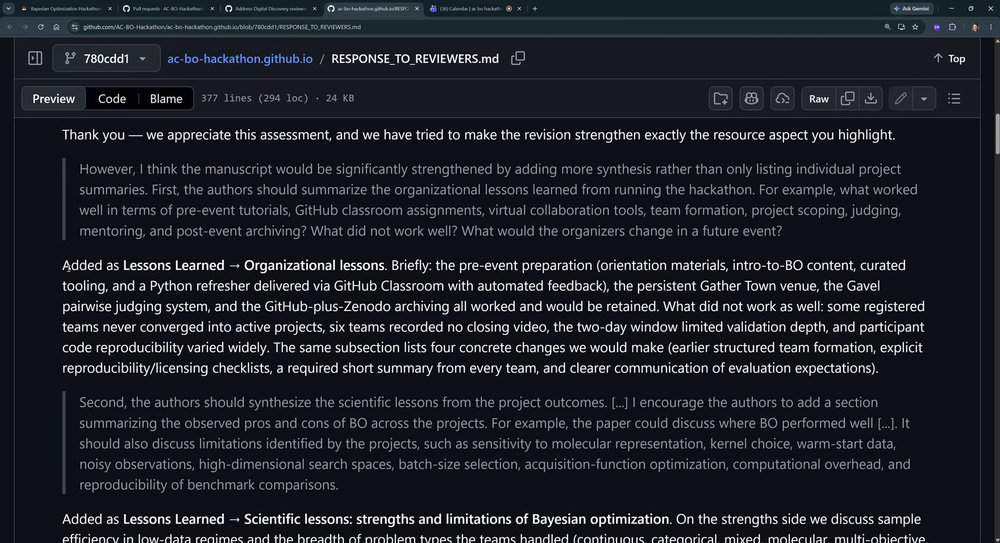

> "So right here, 'Added as Lessons Learned, Organizational lessons.'"

Sterling reads out the existing line as the shape a good response should take.

**Action:** use this as the template. Name the section the change landed in.

---

### 7. [01:15](https://youtu.be/B-b4jGhzsD4?t=75) Point directly at the manuscript section

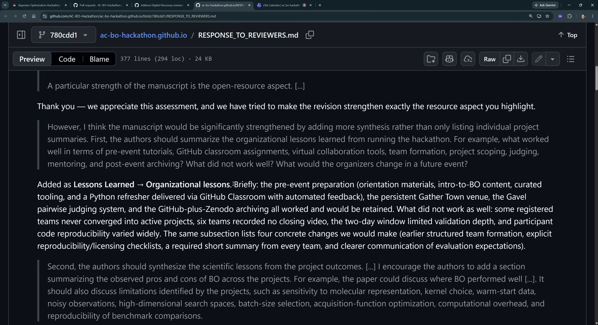
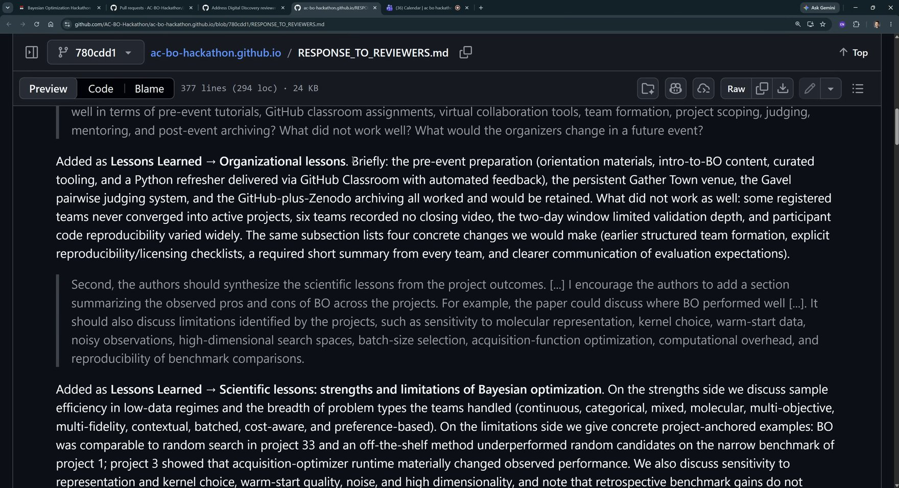
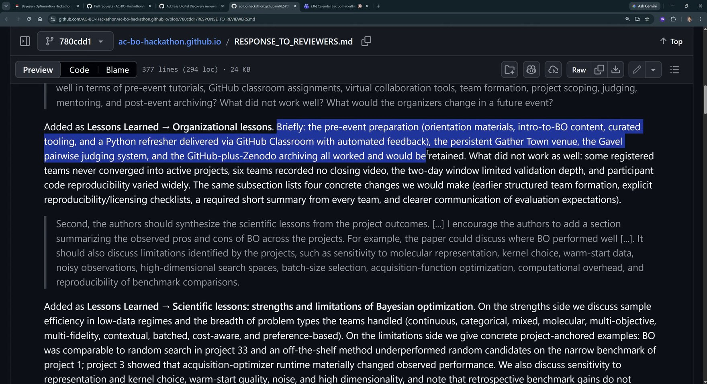

> "We should just be pointing directly to the section in the manuscript, saying like 'see
> this edit in the manuscript.'"

**Action:** replace restated content with an explicit pointer to the manuscript section.

---

### 8. [01:28](https://youtu.be/B-b4jGhzsD4?t=88) Note to Gage: resist the long response letter

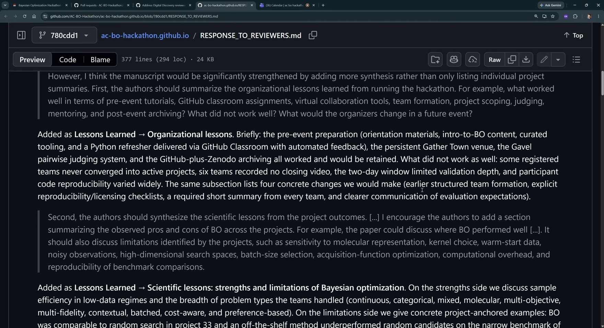
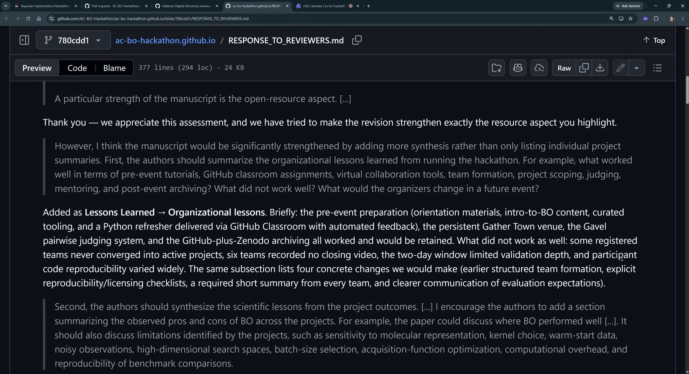
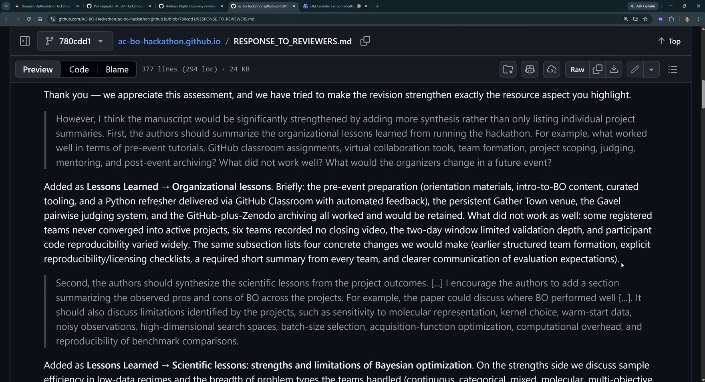

> "Just kind of note to Gage: in these revisions that we do for articles, it's really
> tempting to try to put this big long response in the response to reviewers rather than
> just making the update in the manuscript."

This is the one explicitly flagged as teaching, addressed to Gage by name.

**Action:** put the work in the manuscript, not in the letter.

---

### 9. [01:50](https://youtu.be/B-b4jGhzsD4?t=110) Let the update speak for itself

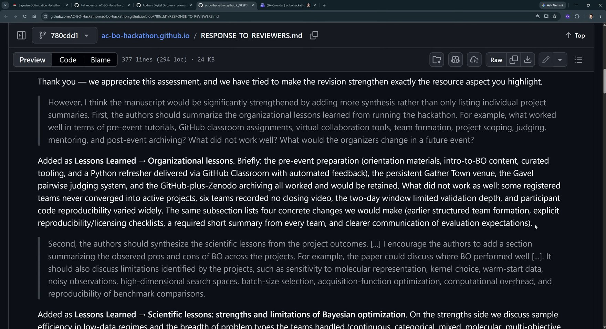
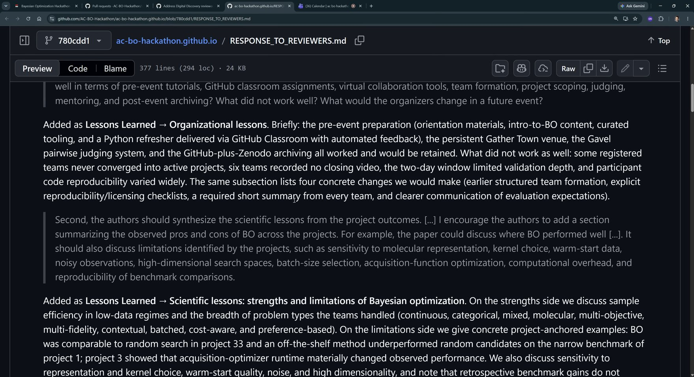

> "Letting that update speak for itself. So just pointing reviewers over to the manuscript,
> and then they can look at it and say, yes, this addresses my feedback and concerns."

**Action:** trust the reviewer to read the manuscript.

---

### 10. [02:00](https://youtu.be/B-b4jGhzsD4?t=120) Every point should get some change

> "There's still some things we might clarify here, especially if we decide not to
> implement something. Every single point, generally we should make some change to it.
> It's pretty rare for you to go in and say we refuse to do anything for this point. There's
> usually some compromise that we can make."

**Action:** no point gets a flat refusal. Find the compromise and make a change.

---

### 11. [02:20](https://youtu.be/B-b4jGhzsD4?t=140) This whole section needs rewriting

> "Basically, I'm going to have to probably rewrite this entire section."

**Action:** full rewrite of the Referee 1 synthesis response.

---

### 12. [02:30](https://youtu.be/B-b4jGhzsD4?t=150) The arrow notation is unclear

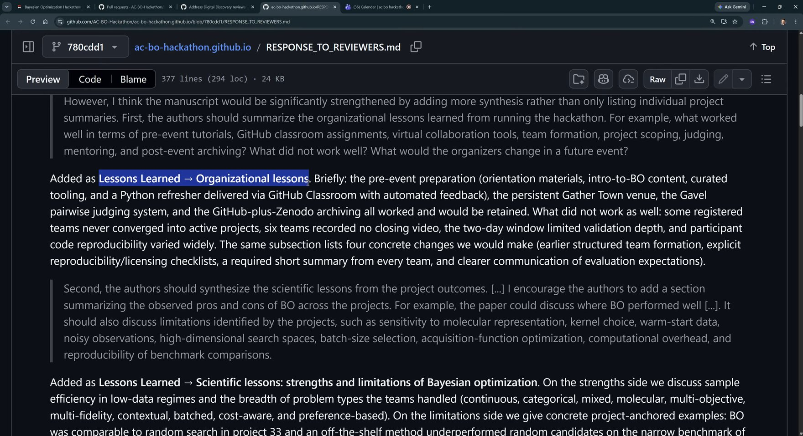
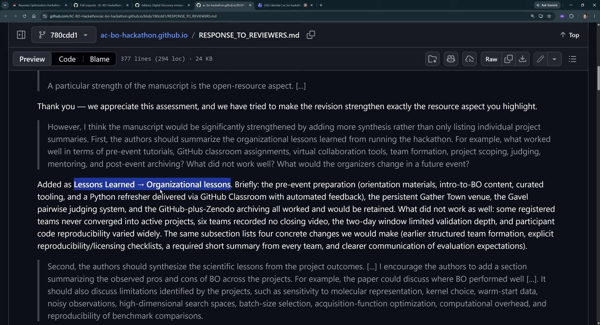

> "I don't really know what's meant by this arrow, 'Lessons Learned' arrow 'Organizational
> lessons.'"

The selection makes the referent unambiguous: the `→` separator used throughout the
document to denote section and subsection.

**Action:** make the section and subsection reference readable instead of using a bare
arrow, or define the notation.

---

### 13. [02:38](https://youtu.be/B-b4jGhzsD4?t=158) The "more synthesis" feedback is good feedback

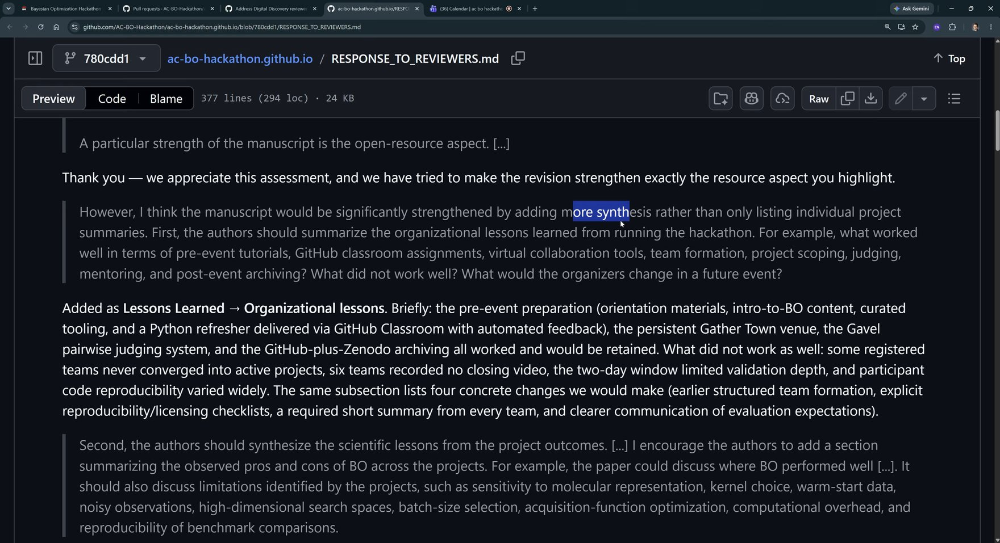

> "But I do really like this point of feedback of more synthesis. Like, what are the
> lessons learned?"

**Action:** treat the synthesis request as the most valuable reviewer comment and invest
in it.

---

### 14. [02:55](https://youtu.be/B-b4jGhzsD4?t=175) Scientific lessons are hard given how condensed the event was

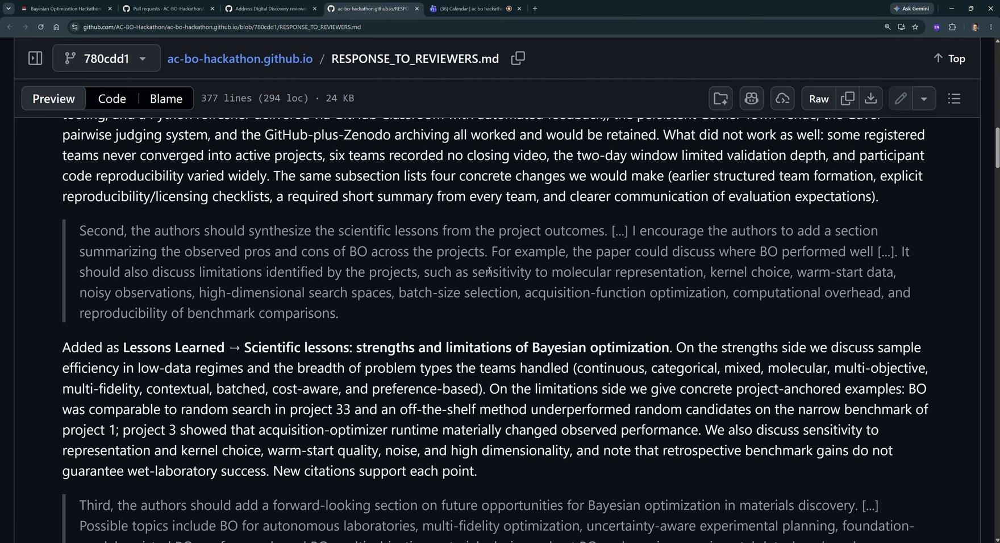
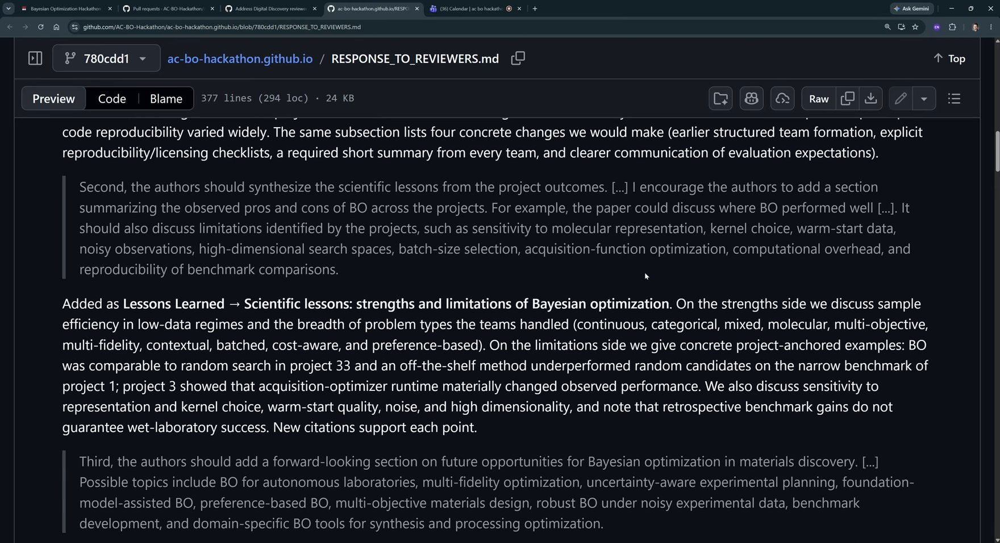
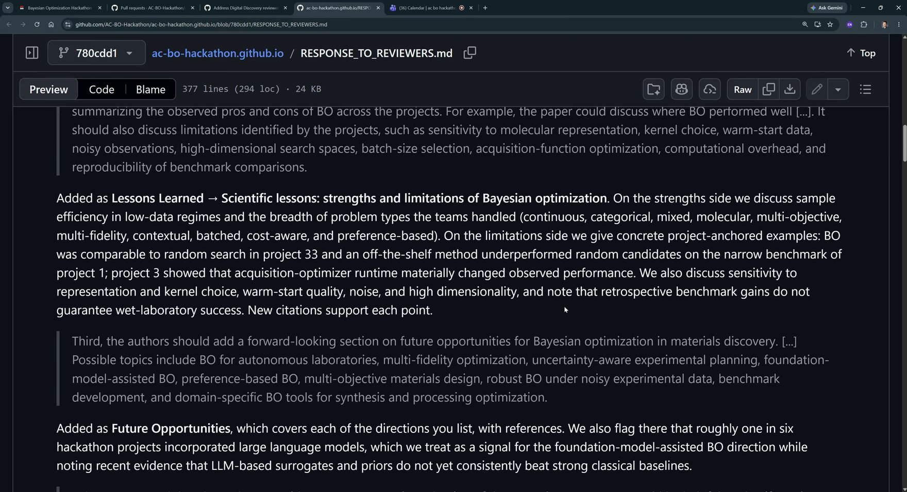

> "This one will be tricky because of how condensed the hackathon was. It's not like these
> were six month projects. And so we can't really just say, hey, here are our findings
> about Bayesian optimization. The focus was more on kicking off certain projects."

**Action:** scope the scientific lessons claim honestly. The event kicked off projects
rather than producing six month results.

---

### 15. [03:20](https://youtu.be/B-b4jGhzsD4?t=200) File this as a new issue

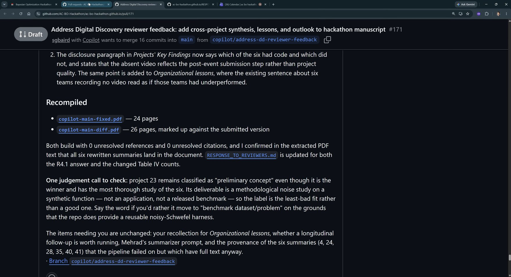

> "And maybe I'll put this here as a new issue."

On screen he is typing into PR #171: "Noting for claude in a later session to consider
https://github.com/AC-BO-Hackathon/ac-bo-hackathon.github.io/issues/172 in the context
of...". The stretch from 03:24 to 04:47 is mostly silence while he writes it.

**Action:** track the synthesis rework as
[issue #172](https://github.com/AC-BO-Hackathon/ac-bo-hackathon.github.io/issues/172)
rather than solving it inline.

---

### 16. [05:10](https://youtu.be/B-b4jGhzsD4?t=310) The generated synthesis is disclaimers and fluff

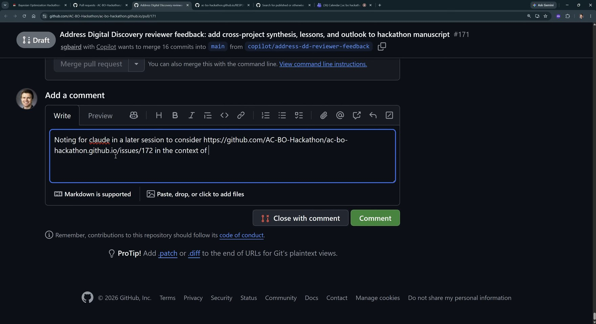

> "From what I read of the synthesis that Claude created for the end of the paper, a lot of
> it felt like disclaimers and fluff, but I didn't pull out any real conclusions."

**Action:** the synthesis section needs actual conclusions, not hedging.

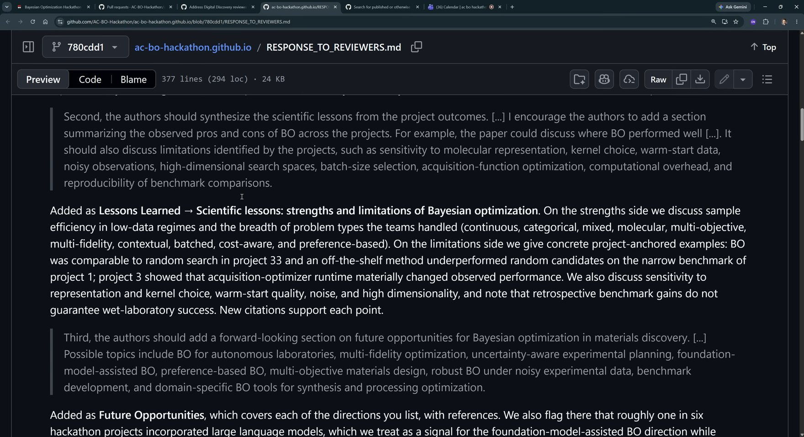

---

### 17. [05:55](https://youtu.be/B-b4jGhzsD4?t=355) Switch the model back to Fable

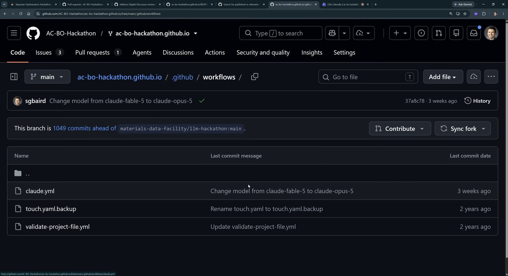

> "It seems like maybe all of this was [Opus] for some of these changes. And then I'll go
> ahead, I think I'll switch us back to Fable."

The screen confirms the intent: the `claude.yml` workflow's most recent commit is "Change
model from claude-fable-5 to claude-opus-5", and Sterling is about to reverse it. This is
also the clue for the preceding sentence, where the audio is genuinely unclear (see
[Transcript corrections](#transcript-corrections)).

**Action:** revert the workflow model from `claude-opus-5` back to `claude-fable-5`.

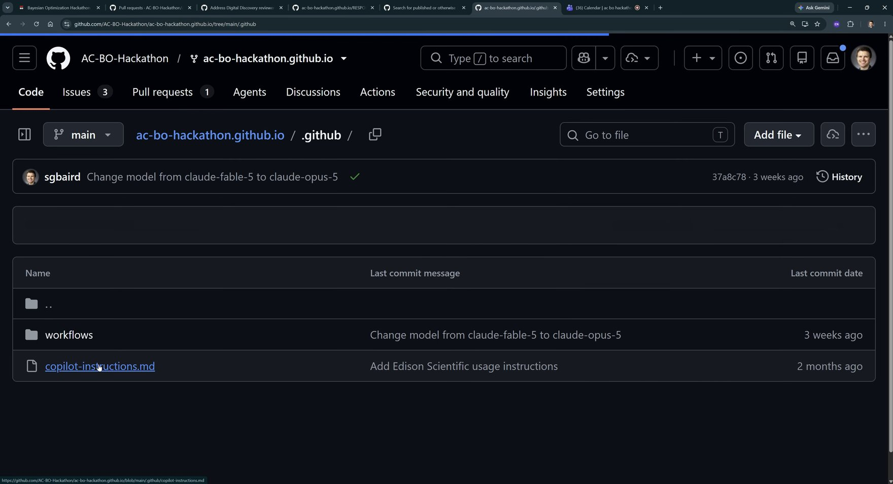
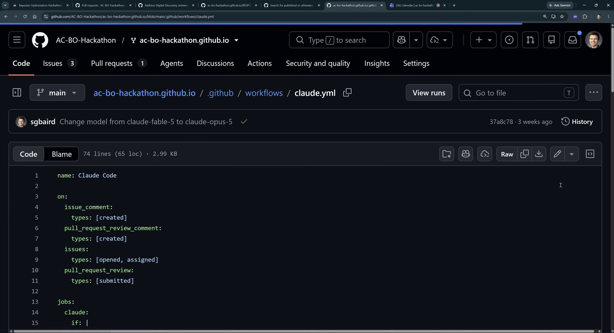

---

### 18. [07:42](https://youtu.be/B-b4jGhzsD4?t=462) Writing the anti-slop style rule into CLAUDE.md

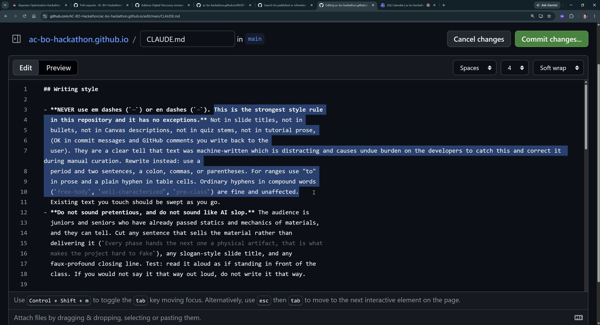

> "You get a specialized prompt for making it write more humanly."

This is the most consequential screen of the session. Sterling is editing `CLAUDE.md` on
`main` and adding a `## Writing style` section. The two rules being written are:

* **"NEVER use em dashes or en dashes. This is the strongest style rule in this repository
  and it has no exceptions."** Not in slide titles, bullets, Canvas descriptions, quiz
  stems, or tutorial prose. Acceptable only in commit messages and GitHub comments written
  back to the user. Rationale given in the text: "They are a clear tell that text was
  machine-written which is distracting and causes undue burden on the developers to catch
  this and correct it during manual curation." Replacements: a period and two sentences, a
  colon, commas, or parentheses. For ranges use "to" in prose and a plain hyphen in table
  cells. Ordinary hyphens in compound words are unaffected. Existing text you touch should
  be swept as you go.
* **"Do not sound pretentious, and do not sound like AI slop."** Cut any sentence that
  sells the material rather than delivering it, any slogan style title, and any
  faux profound closing line. The stated test: "read it aloud as if standing in front of
  the class. If you would not say it that way out loud, do not write it that way."

**Action:** these rules are now repository policy, not just review feedback.

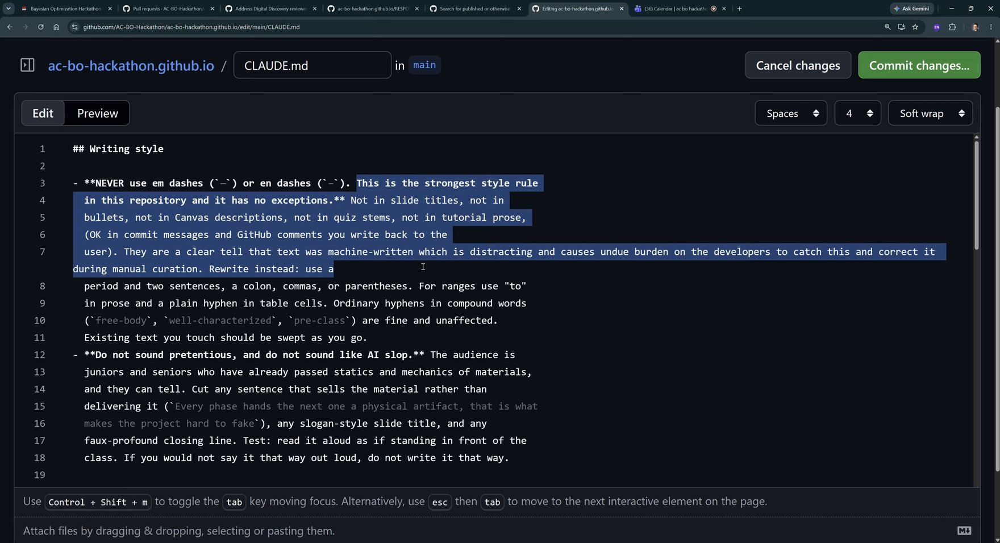

---

### 19. [07:50](https://youtu.be/B-b4jGhzsD4?t=470) Dashes are a giveaway

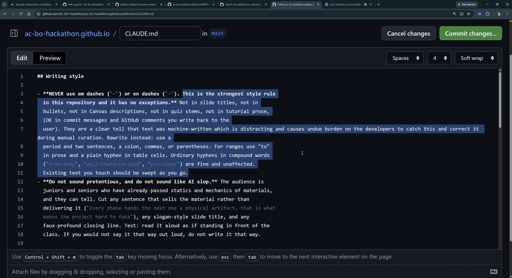

> "I love how em dashes and en dashes are like a total giveaway for AI work."
> "Yeah, it really is."
> "I used to love using them. Like six years ago, ten years ago, I've used them and I like
> using them. I never use them now. I want to, but now everyone just assumes."
> "Have you stopped using them?"
> "I stopped using them because of that. It's kind of sad for me. It's like it's been
> blacklisted."

A rare aside where both speakers agree the convention is a loss, and follow it anyway.

---

### 20. [08:50](https://youtu.be/B-b4jGhzsD4?t=530) Future Opportunities needs bringing in

> "Okay, future opportunities. This I'll also need to bring in."

**Action:** rework the Future Opportunities response alongside the synthesis rewrite.

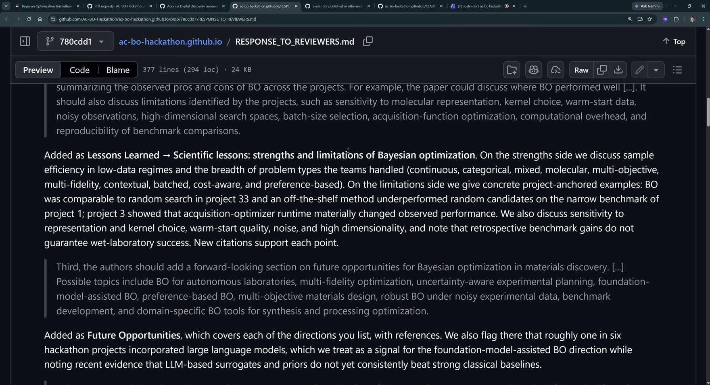
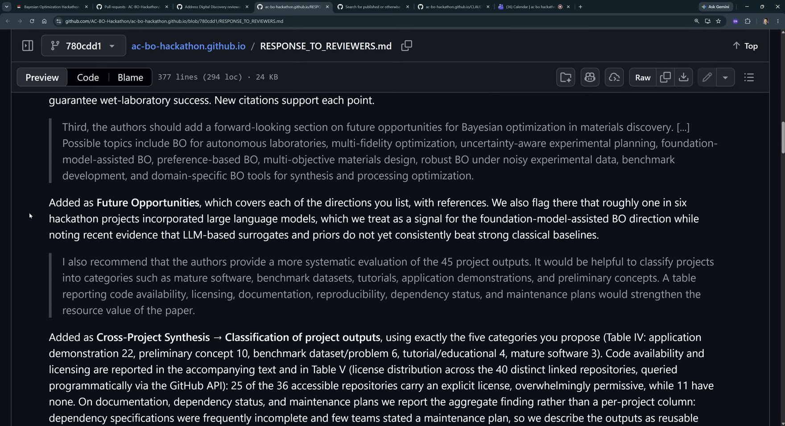

---

### 21. [09:05](https://youtu.be/B-b4jGhzsD4?t=545) No thank yous here either

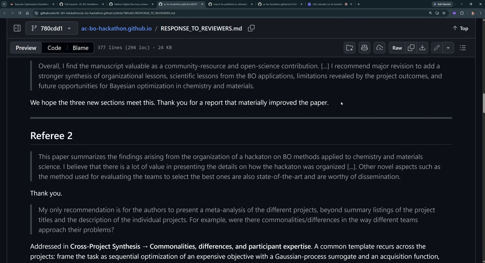

> "Again, we don't need thank yous here. Don't need thank you."

**Action:** same rule, applied again. This repeats often enough that it is worth a global
find and replace.

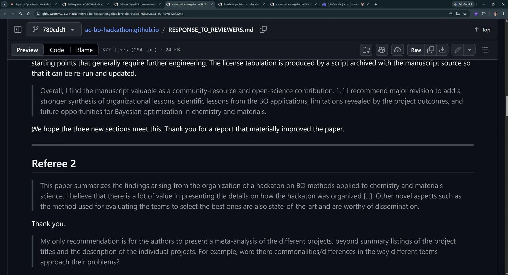

---

### 22. [09:25](https://youtu.be/B-b4jGhzsD4?t=565) Consistent with another reviewer

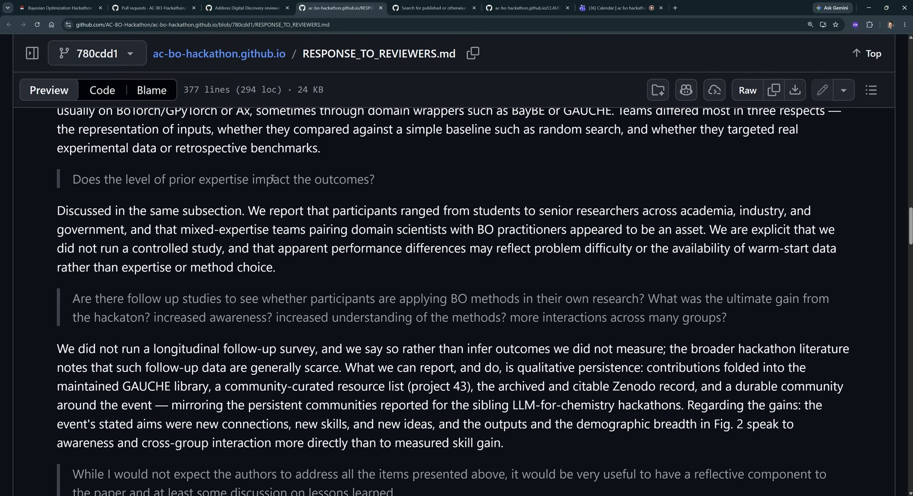

> "Yeah, this is kind of consistent with one of the other reviewers."

**Action:** where two referees raise the same point, answer them consistently.

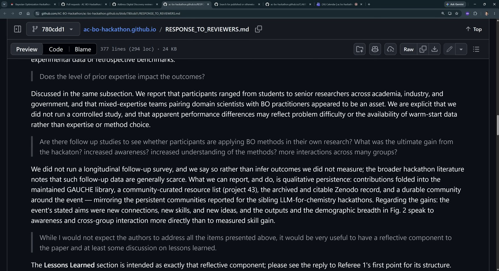

---

### 23. [09:35](https://youtu.be/B-b4jGhzsD4?t=575) Expertise comparisons are awkward when participants are authors

> "I think this would be hard to say, also just given that all the participants are
> authors. It feels a little weird to be like, well, the junior researchers, the students
> who worked on this, did better than the senior researchers, or vice versa. So, awkward."

**Action:** do not rank participant subgroups by performance. Every participant is a
co-author of the paper making the claim.

---

### 24. [10:30](https://youtu.be/B-b4jGhzsD4?t=630) Follow up studies

> "Okay, follow up studies. That's basically what I did. I got tripped up in this part."

**Action:** revisit the follow up studies response.

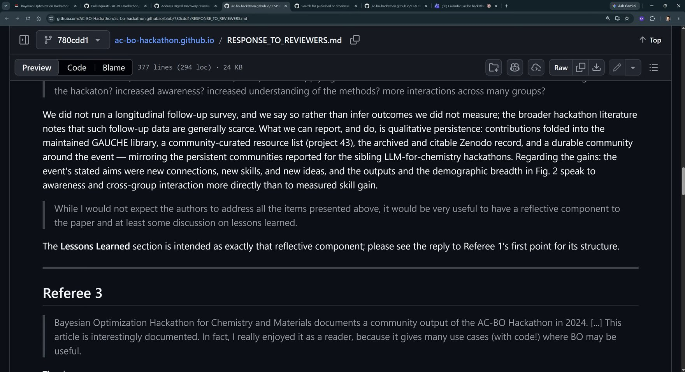
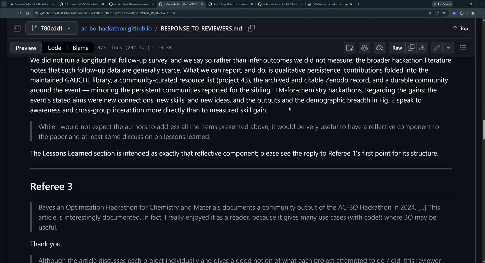

---

### 25. [10:45](https://youtu.be/B-b4jGhzsD4?t=645) Participant career trajectories as a possible addition

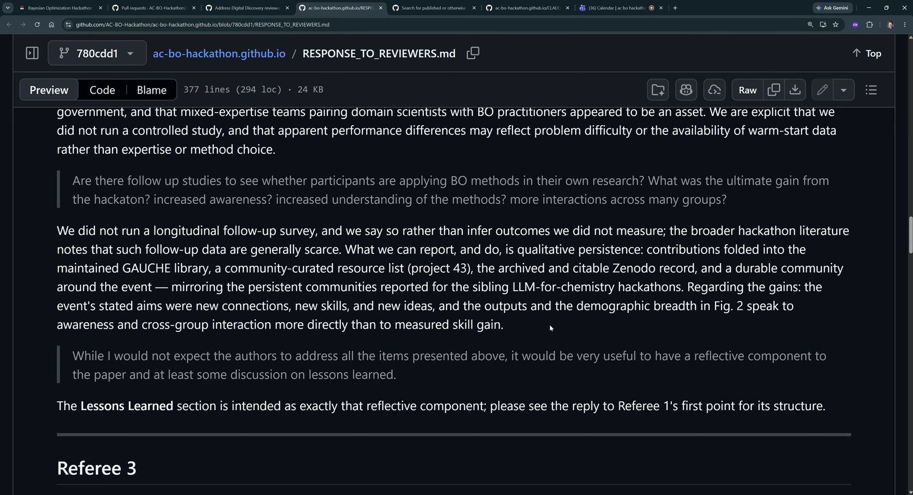

> "Maybe here's another thing we could look at as well: just the trajectories of the
> participants, especially earlier career ones. Did their trajectories kind of lead them
> into that field, even if they didn't do... was there some before and after?"

**Action:** consider reporting participant career trajectories as evidence of impact. Note
this stays a suggestion, and item 32 later concludes the data to support it does not exist.

---

### 26. [12:55](https://youtu.be/B-b4jGhzsD4?t=775) Locating the LLM surrogates claim

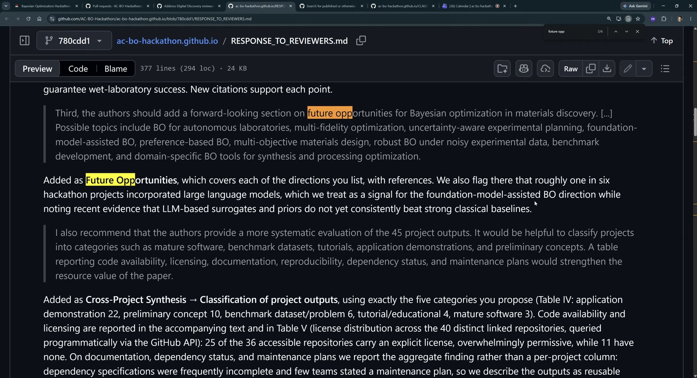

> "This is the line I was... it's not in Future Opportunities, it's underneath the first...
> yeah, this last line here."

The find bar shows the search term `future opp` at match 2 of 6.

---

### 27. [13:20](https://youtu.be/B-b4jGhzsD4?t=800) Is the LLM surrogates claim actually true?

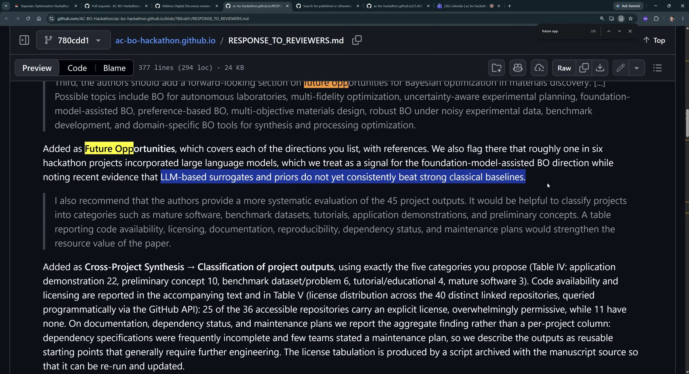

> "'Noting recent evidence that LLM-based surrogates and priors do not yet consistently
> beat strong classical baselines.' Is that right? Is that true? That seems kind of the
> opposite of what we've been..."

> "This is just such a big question mark. It goes both ways. You can pretty much come up
> with a project to support either option right now."

> "Benchmarking with LLMs is an absolute mess and nightmare to deal with, because you have
> to try to say, well, was this LLM just regurgitating the answers, something that's known?
> Maybe that's okay, because it's showing that the LLM has that embedded within itself. But
> can we say that this kind of behavior is going to extrapolate to the case where it's not
> regurgitating, it's not hidden within its pre-trained weights, to say this will work on a
> real world problem? And basically the only way to do that is to spend a ton of money to
> run enough repeat campaigns of comparing these two things head to head. At which point it
> wouldn't be a benchmark. You can't benchmark a real world problem because it would be too
> expensive to run lots of repeats on. That's kind of the point of the real world problem.
> So the benchmarks are almost always less expensive than the real thing."

> "I have very strong feelings and opinions on the benchmarking of LLMs, and I've seen
> occasionally people do a pretty decent job of that. I just thought it was funny for that
> to be included there."

**Action:** re-examine the "LLM-based surrogates and priors do not yet consistently beat
strong classical baselines" claim. The evidence is contested in both directions and the
citation may not support a confident statement.

---

### 28. [18:05](https://youtu.be/B-b4jGhzsD4?t=1085) Cut "we hope this meets" and the closing thank you

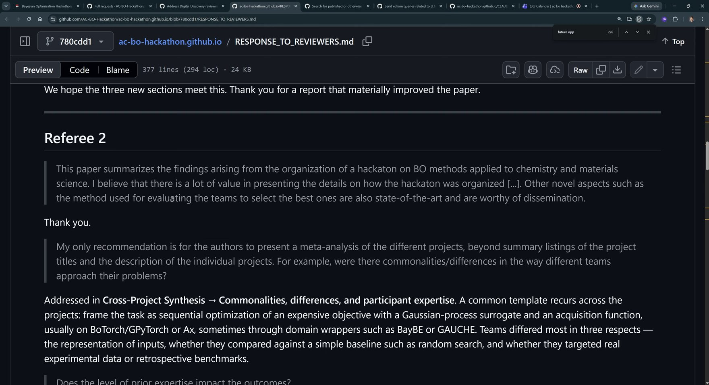

> "We don't need a 'we hope this meets it.' Don't need to thank you again."

**Action:** delete "We hope the three new sections meet this" and the closing thank you.

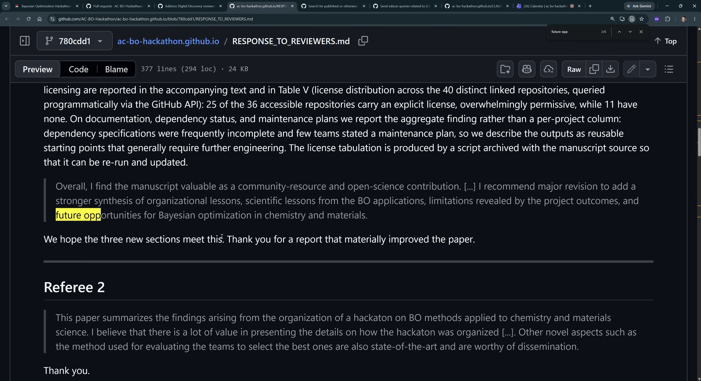
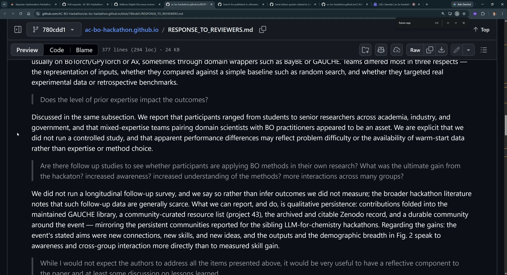

---

### 29. [18:25](https://youtu.be/B-b4jGhzsD4?t=1105) Do not say "Agreed", say what was done

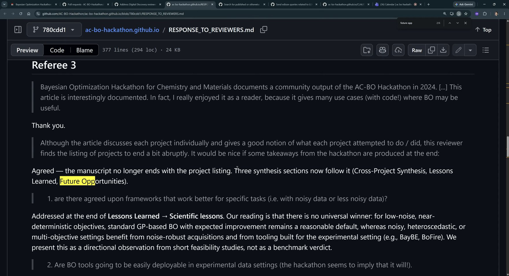

> "Thank you, em dash. We don't need to say 'agreed.' We just need to say that we did the
> thing that was asked for."

The line on screen contains both offences at once: it opens with "Agreed" and uses an em
dash immediately after.

**Action:** rewrite "Agreed — the manuscript no longer ends with the project listing" as a
plain statement of the change.

---

### 30. [18:45](https://youtu.be/B-b4jGhzsD4?t=1125) No basis to comment, and out of scope

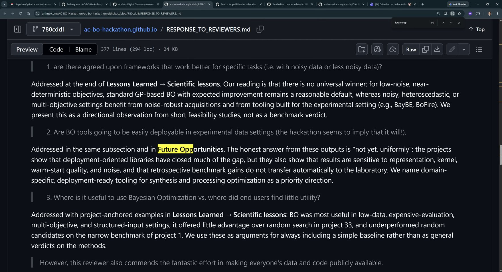

> "This one, I don't think we can even make any commentary on. I don't think we even have
> the basis to comment on that. We could go and try to look for articles related to this
> question, but that seems a lot out of scope for this paper on the hackathon."

**Action:** decline this point on scope grounds, but per rule 6 still make some change
rather than refusing outright.

---

### 31. [19:20](https://youtu.be/B-b4jGhzsD4?t=1160) Cite some of the Bayesian optimization GUIs

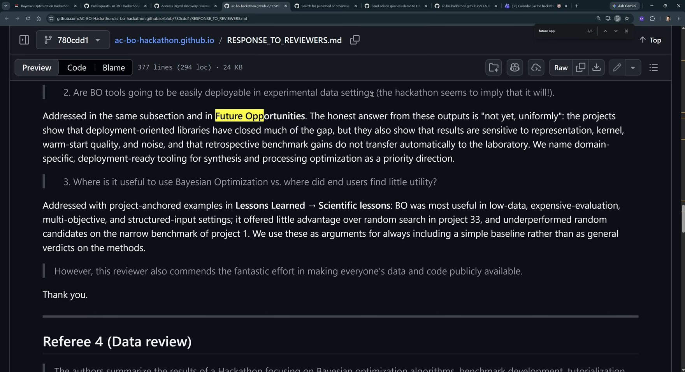

> "There has been quite an explosion of GUIs for Bayesian optimization. We could at least
> include some of those."

A new browser tab titled "Search for GUIs and other acc..." appears in the tab bar around
this point, so the search was run live.

**Action:** add citations for existing Bayesian optimization GUIs.

---

### 32. [21:35](https://youtu.be/B-b4jGhzsD4?t=1295) This would need a participant survey

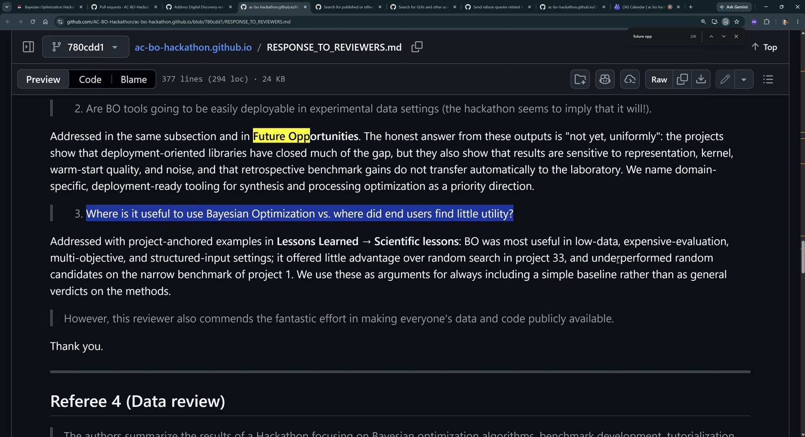

> "This is something where we'd probably have to run a survey across all the participants.
> I don't think we have enough to make any comments here, unless there were specific clips
> from a video or some outcome from one of the projects that talked about this
> specifically."

**Action:** do not answer beyond the evidence. A survey was never run.

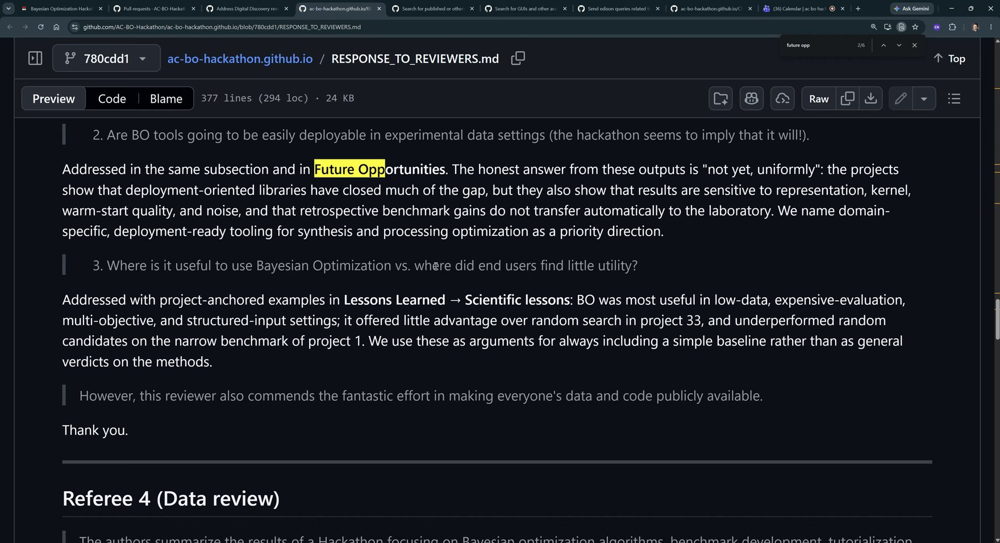

---

### 33. [22:05](https://youtu.be/B-b4jGhzsD4?t=1325) The project 33 and project 1 examples are shaky

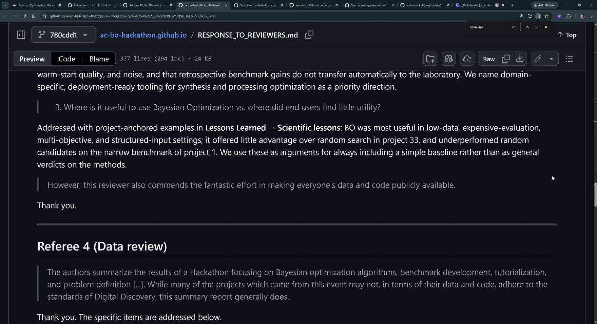

> "Like cases where it didn't work. Maybe that's a little bit here, like 'advantage over
> random search in project 33', project one. But that would depend on how rigorous those
> projects are. So even just a mention of that may not be very good. We'll come back to
> that."

**Action:** flag the project 33 and project 1 comparisons. Citing them depends on how
rigorous those individual projects were.

---

### 34. [22:25](https://youtu.be/B-b4jGhzsD4?t=1345) Data review: remove the em dashes

> "For the data review, this might be okay. Of course, removing the em dashes."

**Action:** strip em dashes from the data review responses.

---

### 35. [22:45](https://youtu.be/B-b4jGhzsD4?t=1365) Too verbose overall

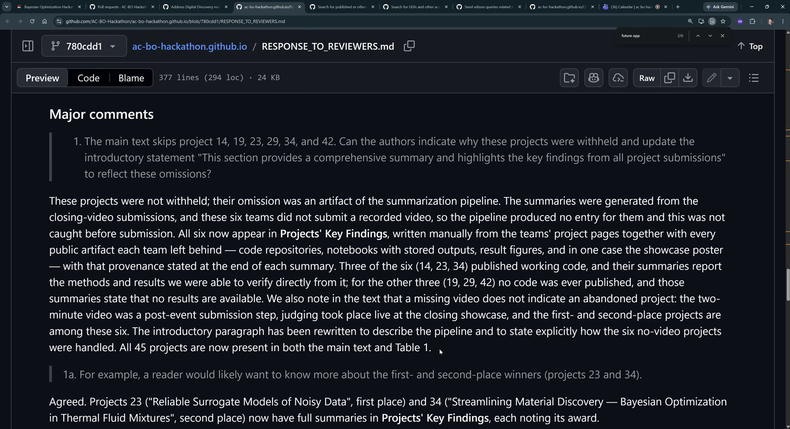

> "Overall, this is just too verbose though."

The paragraph on screen is a good example of the problem: a single response running eleven
lines, with an em dash delimited aside in the middle of it.

**Action:** cut the length substantially.

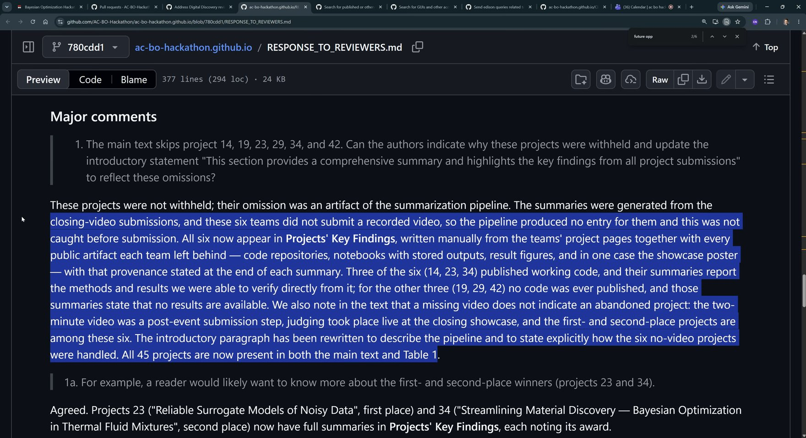

---

### 36. [23:05](https://youtu.be/B-b4jGhzsD4?t=1385) Say it was completeness, not consistency

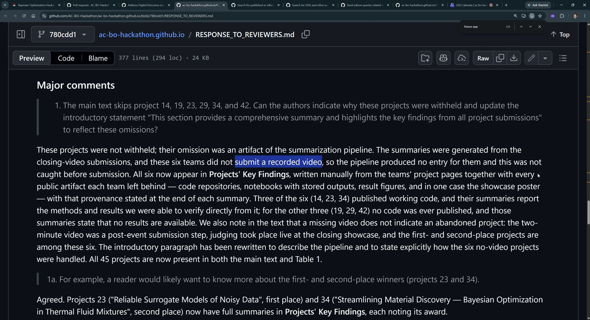

> "I think you could say that it gets added back in, just that it wasn't added because of a
> lack of a submitted video, but that they were written from the team's project pages
> instead. Not for consistency, for completeness. They were added back in for completeness,
> and also based on the kind of project outputs from it."

The selection lands exactly on "submit a recorded video", which is the fact being
restated.

**Action:** compress this to the causal chain: no video submitted, so summaries were
written from project pages, and they were added back for completeness.

---

### 37. [23:40](https://youtu.be/B-b4jGhzsD4?t=1420) Shorter overall

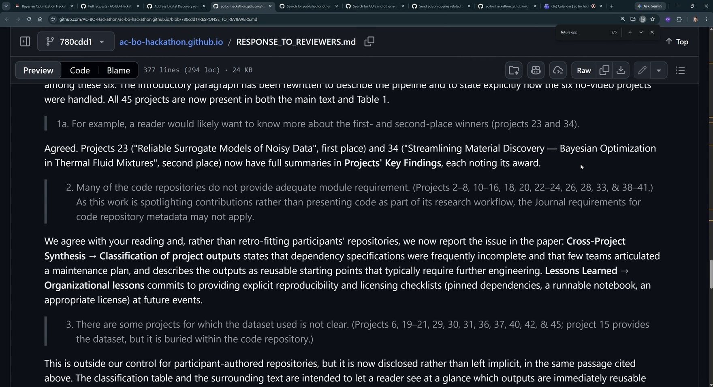

> "Then we have... anyway, this needs to be shorter overall."

**Action:** apply the length cut across the data review section.

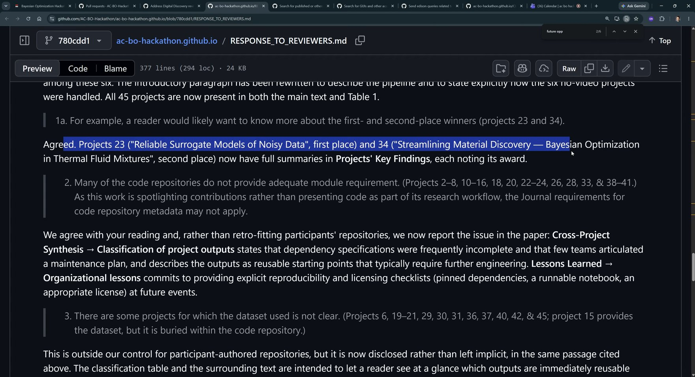

---

### 38. [24:05](https://youtu.be/B-b4jGhzsD4?t=1445) Change this one to "Noted"

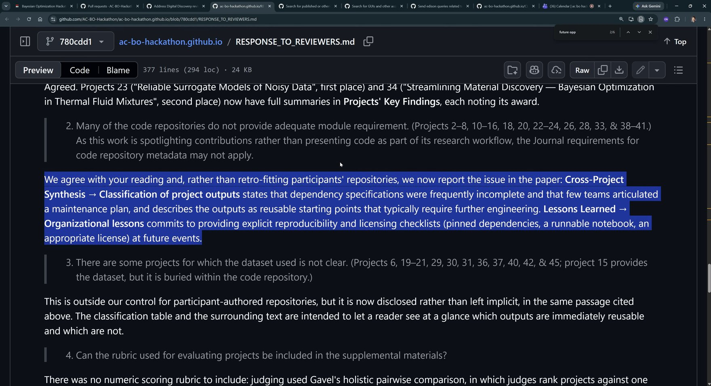

> "I'm forgetting why these weren't included. So you can just change this to 'noted.' A lot
> of these in the data review section are just kind of noted, because it's basically what
> they mentioned, kind of unique circumstances for some of these projects."

**Action:** replace the selected paragraph with "Noted." Several data review items only
acknowledge circumstances and need nothing more.

---

### 39. [24:35](https://youtu.be/B-b4jGhzsD4?t=1475) Include the actual Gavel instructions

> "I guess here we could at least put what the instructions from Gavel were. I think it
> just asked basically 'which one do you prefer' or 'which one is better.'"

**Action:** quote the actual judging prompt. There was no numeric rubric, but the pairwise
question itself can be stated.

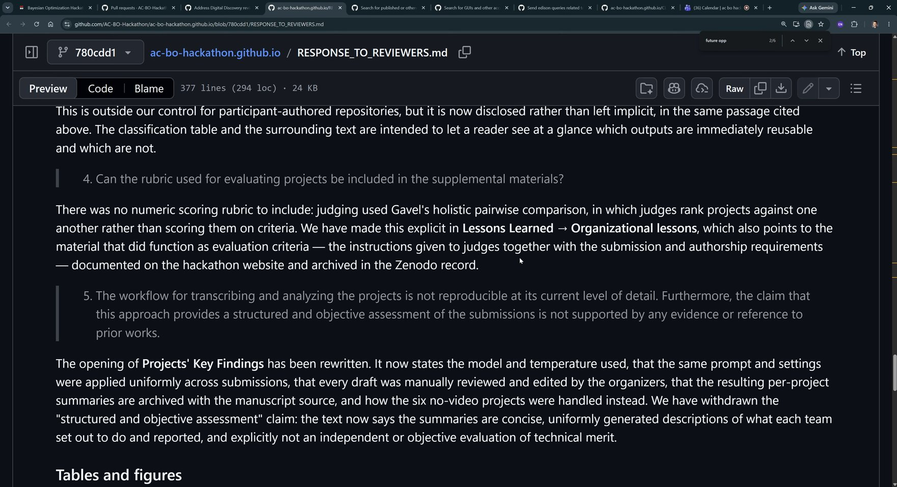
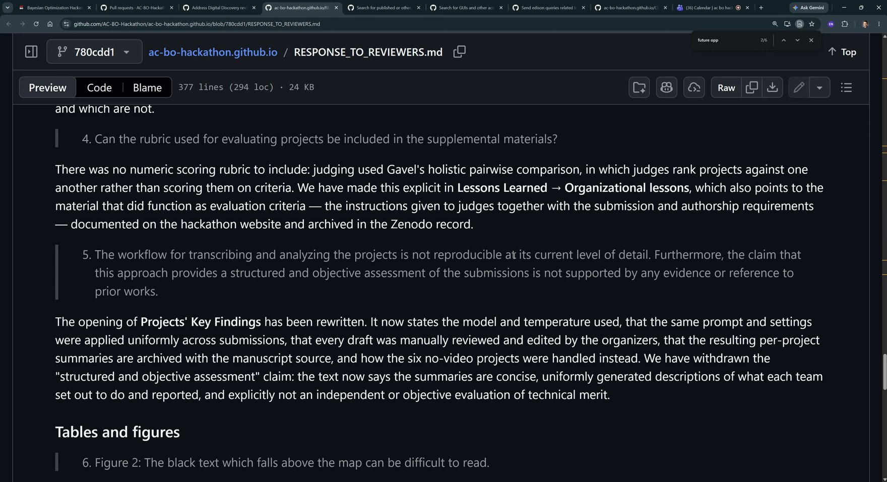

---

### 40. [25:05](https://youtu.be/B-b4jGhzsD4?t=1505) Point at the section instead of being verbose

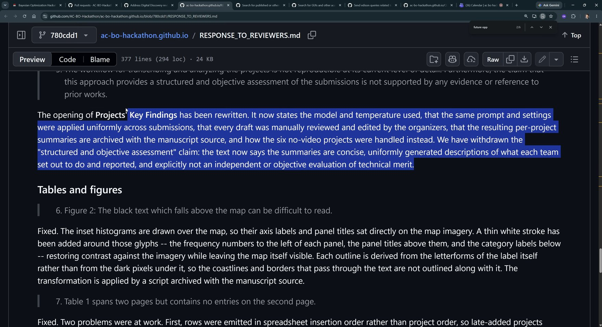

> "Instead of being really verbose about what we did here, you just point them to the right
> section saying 'see the manuscript.'"

**Action:** replace the selected paragraph with a pointer.

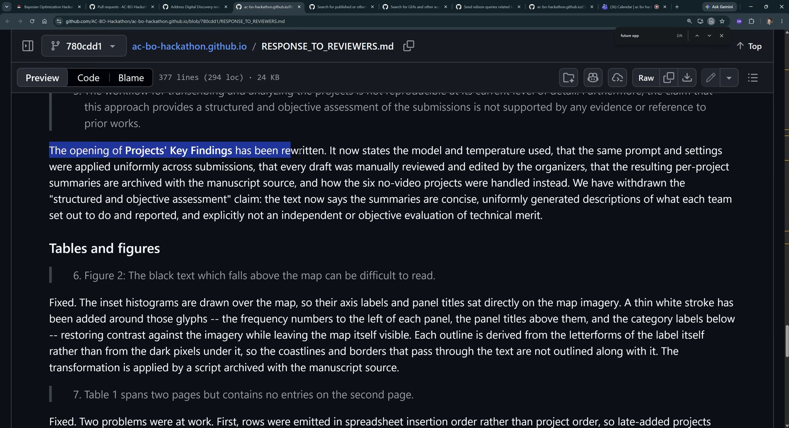
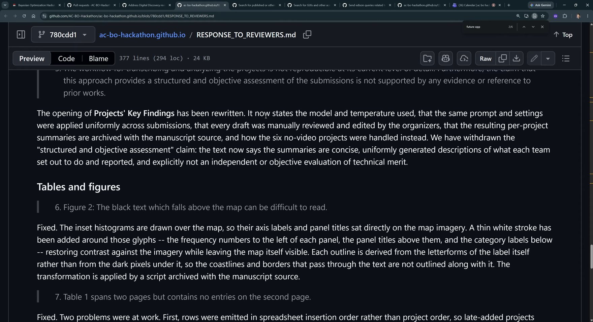

---

### 41. [25:20](https://youtu.be/B-b4jGhzsD4?t=1520) Everything needs "see the manuscript" plus a section

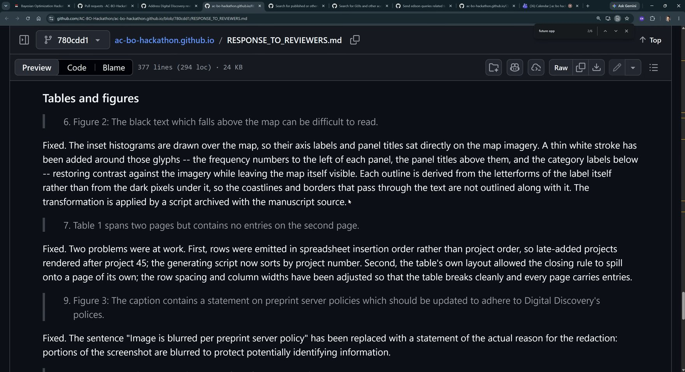

> "Basically everything here should have a 'see the manuscript' and then a specific section
> where they can find the changes that were made."

**Action:** every response in this section gets a specific section pointer, not a general
one.

---

### 42. [25:35](https://youtu.be/B-b4jGhzsD4?t=1535) "Two problems were at work" sounds like AI

> "'Two problems were at work' just sounds like AI. We can just say 'fixed', like
> 'addressed' or 'corrected', and then 'see manuscript' for these ones."

The exact offending phrase is visible on screen, which is how the wording was confirmed.

**Action:** replace narrative explanations with "Fixed", "Addressed", or "Corrected" plus
a pointer.

---

### 43. [26:10](https://youtu.be/B-b4jGhzsD4?t=1570) The preprint policy note in Figure 3

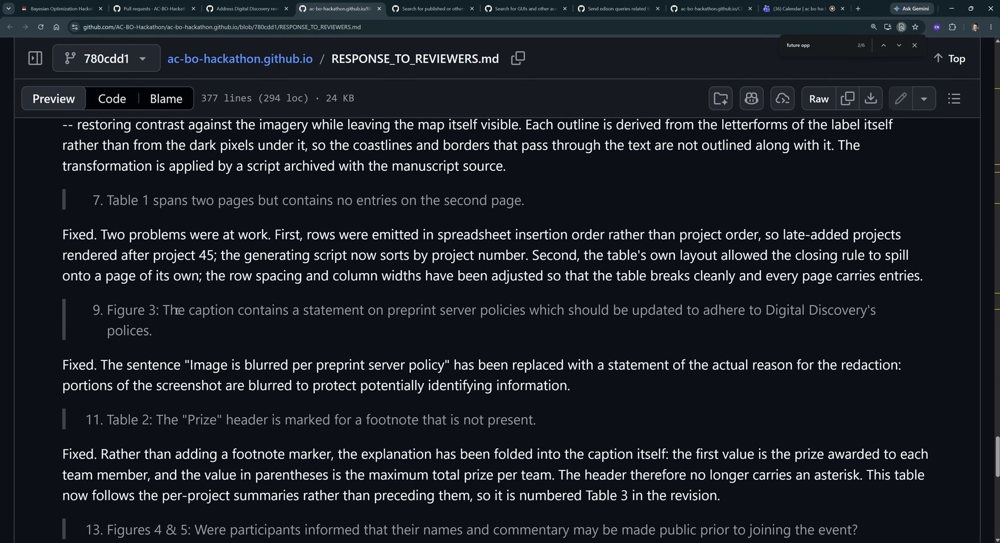

> "That's interesting. I didn't even think that was... I guess somehow that made it in
> there, like some note about preprints or policies into Figure 3."

The item on screen reads "Figure 3: The caption contains a statement on preprint server
policies which should be updated to adhere to Digital Discovery's polices."

**Action:** confirm why the preprint server policy sentence was in the Figure 3 caption at
all.

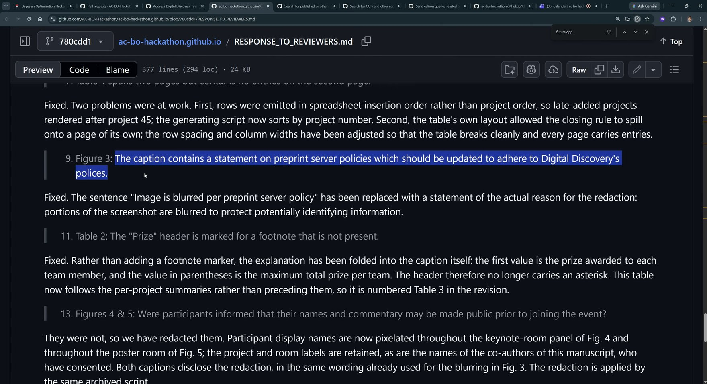

---

### 44. [26:30](https://youtu.be/B-b4jGhzsD4?t=1590) Answer the question, do not explain what you did not do

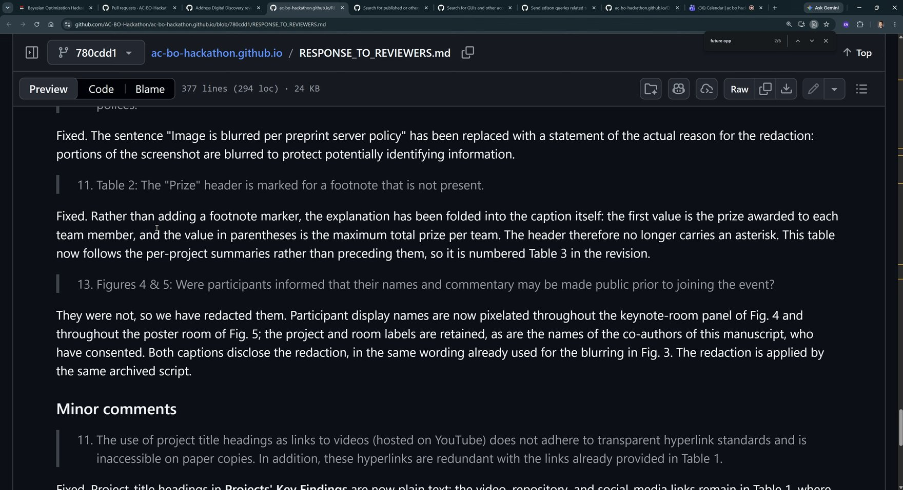

> "Again, see manuscript with the specific sections. You don't have to say that they
> weren't. So we just want to answer the questions."

**Action:** drop the explanatory negatives. Answer what was asked.

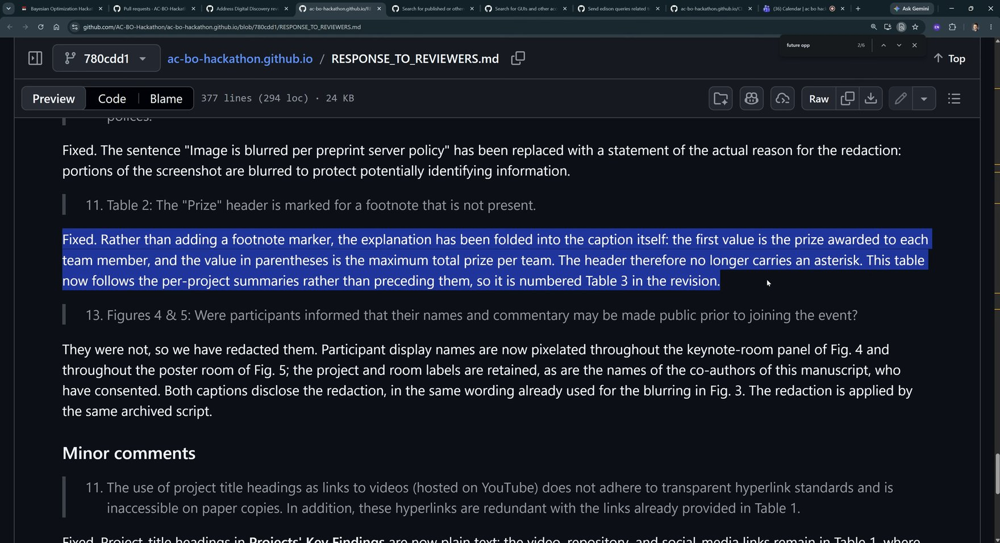

---

### 45. [26:50](https://youtu.be/B-b4jGhzsD4?t=1610) The Figure 4 pixelation answer, stated plainly

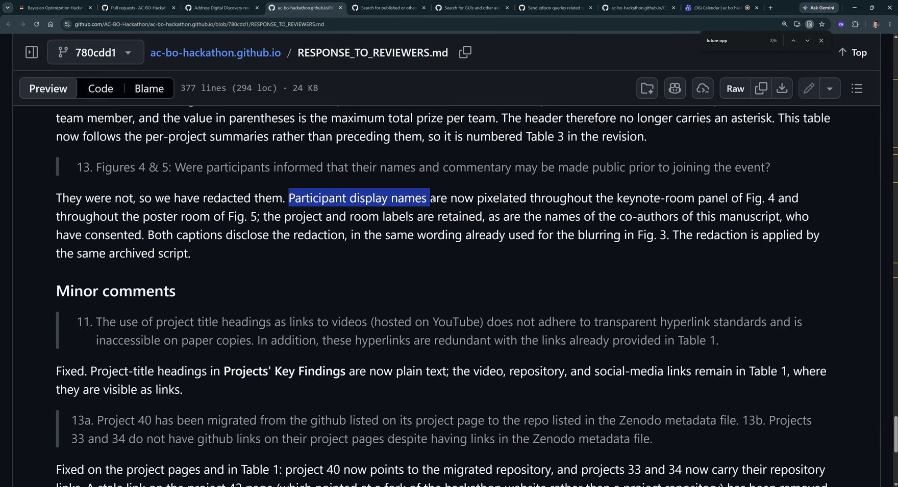

> "Let's say 'participant display names are pixelated throughout the keynote room panel in
> Figure 4.' You don't need to mention any of that other stuff here."

The selection sits on exactly the phrase he wants kept, and the surrounding sentence is
what he wants cut.

**Action:** reduce this response to the single factual sentence about pixelation.

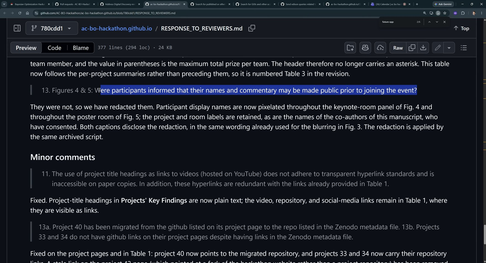

---

### 46. [27:10](https://youtu.be/B-b4jGhzsD4?t=1630) Changed it to plain text

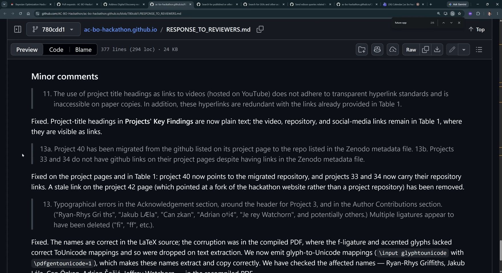

> "Sure. Changed it to plain text."

This is Sterling modelling the target response length: four words.

**Action:** keep this one as is. It is already the right shape.

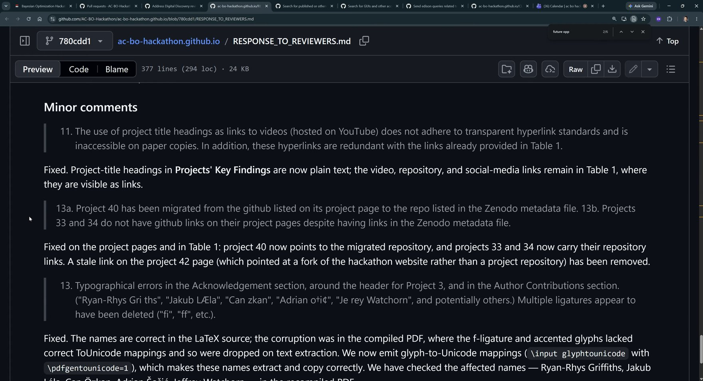
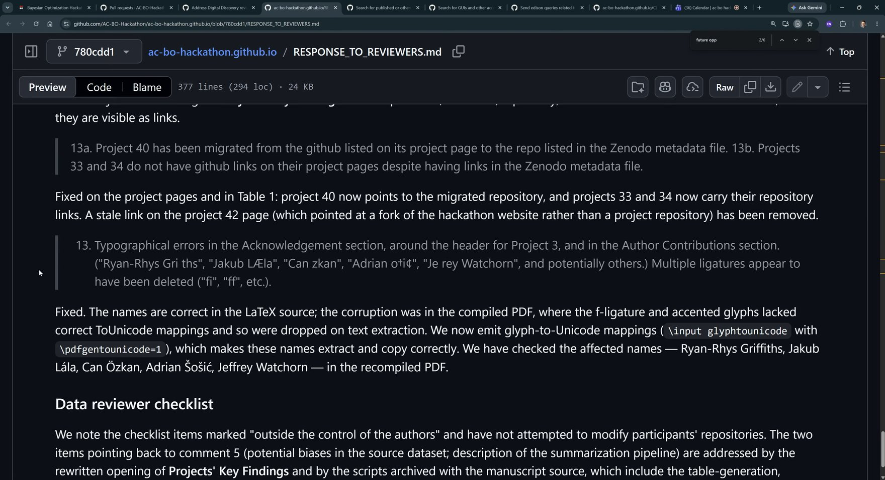

---

### 47. [27:20](https://youtu.be/B-b4jGhzsD4?t=1640) Same treatment for the rest

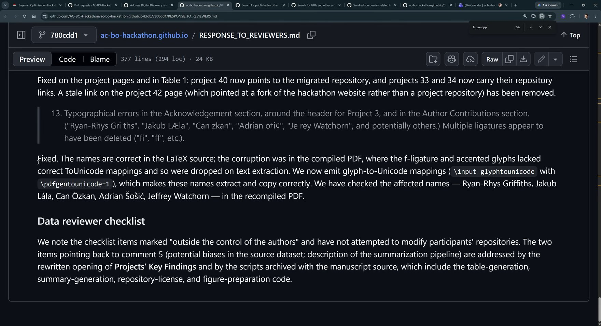

> "Yeah, again, just 'fixed' and then 'see the section' for it. So now we can... I'll go
> ahead and stop this."

**Action:** apply the same pattern to the remaining typography and checklist items. End of
session.

---

## Full corrected transcript

Timestamps are the start of each passage. Corrections are applied silently here; see
[Transcript corrections](#transcript-corrections) for the list. Bracketed text marks
uncertain audio.

**[00:02]** Then I'll kind of shift in and out between an annotation for Claude to do
things, and that's with you. So this sounds kind of AI written, a lot of this beginning. So
most of this beginning is just going to get wiped. Don't need to say latexdiff. Reviewers
don't care about that. So this is something that probably...

**[00:33]** So I guess, note for Claude: rewrite this with no more than a hundred
characters, and we'll probably do some edits ourselves on that. Don't put thank you
anywhere. Don't use any en or em dashes. Just keep the comments to what exactly you
changed. So right here, "Added as Lessons Learned, Organizational lessons."

**[01:05]** Yeah, so that's good. And that we should just be pointing directly to the
section in the manuscript, saying like "see this edit in the manuscript." And then just
kind of note to Gage: in these revisions that we do for articles, it's really tempting to
try to put this big long response in the response to reviewers rather than just...

**[01:37]** ...making the update in the manuscript and letting that update speak for
itself. So just pointing reviewers over to the manuscript, and then they can look at it and
say, yes, this addresses my feedback and concerns. That makes sense to me. There's still
some things we might clarify here, especially if we decide not to implement something.
Every single point, generally we should make some change to it. It's pretty rare for you to
go in and say we refuse to do anything for this point.

**[02:08]** Yeah, there's usually some compromise that we can make. And basically, I'm
going to have to probably rewrite this entire section. It isn't there. I don't really know
what's meant by this arrow, "Lessons Learned" arrow "Organizational lessons." I guess we'll
see that in the... but I do really like this point of feedback of more synthesis. Like,
what are the lessons learned?

**[02:43]** Yeah. Then synthesizing scientific lessons from here.

**[02:52]** This one will be tricky because of how condensed the hackathon was. It's not
like these were six month projects. And so we can't really just say, hey, here are our
findings about Bayesian optimization. The focus was more on kicking off certain projects.
And so if we did find one or two that had...

**[03:17]** And maybe I'll put this here as a new issue.

**[03:24]** *(Sterling types a comment on PR #171 referencing issue #172. Mostly silence
with filler words through 04:47.)*

**[04:49]** Maybe something comes from that one.

**[05:02]** From what I read of the synthesis that Claude created for the end of the paper,
a lot of it felt like disclaimers and fluff, but I didn't pull out any real conclusions.

**[05:41]** Okay. Yeah.

**[05:48]** It seems like maybe all of this was [Opus] for some of these changes. And then
I'll go ahead, I think I'll switch us back to Fable.

**[07:41]** You get a specialized prompt for making it write more humanly.

**[07:46]** I love how em dashes and en dashes are like a total giveaway for AI work.

**[07:53]** Yeah, it really is.

**[07:54]** I used to love using them. Like, you know, I think they're awesome.

**[08:00]** Like six years ago, ten years ago, I've used them and I like using them. I
never use them now, but I wish... I want to now, but now everyone just assumes.

**[08:15]** Have you stopped using them? I stopped using them because of that. It's kind of
sad for me. It's like it's been blacklisted.

**[08:21]** And actually, I guess these are really the only two.

**[08:29]** See how much it respects that. Okay, future opportunities. This I'll also need
to bring in.

**[08:59]** Again, we don't need thank yous here. Don't need thank you.

**[09:17]** Yeah, this is kind of consistent with one of the other reviewers.

**[09:23]** Yeah, I think this would be hard to say, also just given that all the
participants are authors. It feels a little weird to be like, well, the junior researchers
of this, the students who worked on this, did better than the senior researchers, or vice
versa. So, awkward.

**[09:49]** But yeah, on that last section, that last sentence, or the one right before...
sorry, the paragraph before it on this one.

**[09:55]** Yeah, the last sentences. No, this is not it, sorry. There's another one. I
wanted to ask something.

**[10:05]** Maybe we'll come to it now. So yeah, when I was reading, I'll find it. Okay,
follow up studies. Okay, yeah, that's basically what I did. I got tripped up in this part.
Let's see if anything pops up.

**[10:22]** Maybe here's another thing we could look at as well, just the trajectories of
the participants, especially earlier career ones. Did their trajectories kind of lead them
into that field, even if they didn't do... was there some before and after?

**[12:48]** This is the line I was... it's not in Future Opportunities, it's underneath the
first... yeah, this last line here, "noting recent evidence that LLM-based surrogates and
priors do not yet consistently beat strong classical baselines." Is that right? Is that
true? That seems kind of the opposite of what we've been...

**[13:09]** This is just such a big question mark. It goes both ways. You can pretty much
come up with a project to support either option right now.

**[13:24]** And benchmarking with LLMs is an absolute mess and nightmare to deal with,
because you have to try to say, well, was this LLM just regurgitating the answers,
something that's known? Well, maybe that's okay, because it's showing that the LLM has that
embedded within itself. But can we say that this kind of behavior is going to extrapolate
to the case where it's not regurgitating, it's not hidden within its pre-trained weights,
to say this will work on a real world problem? And basically the only way to do that is to
spend a ton of money to run enough repeat campaigns of comparing these two things head to
head.

**[14:14]** At which point it wouldn't be a benchmark. You can't benchmark a real world
problem because it would be too expensive to run lots of repeats on. That's kind of the
point of the real world problem. So the benchmarks are almost always less expensive than
the real thing. I butchered that a little bit, but I have very strong feelings and opinions
on the benchmarking of LLMs, and I've seen occasionally people do a pretty decent job of
that. I just thought it was funny for that to be included there.

**[15:05]** Yeah, I didn't see it. Maybe it is, but I don't know. Yeah, this one I think
also probably had a follow-up here.

**[16:29]** *(Long pause while searching the document.)*

**[18:01]** Yeah, basically, I think we don't need a "we hope this meets it." Don't need to
thank you again.

**[18:21]** Thank you, em dash. We don't need to say "agreed." We just need to say that we
did the thing that was asked for.

**[18:40]** This one, I don't think we can even make any commentary on. Yeah, I don't think
we even have the basis to comment on that. We could go and try to look for articles related
to this question, but that seems a lot out of scope for this paper on the hackathon.

**[19:15]** There has been quite an explosion of GUIs for Bayesian optimization. We could
at least include some of those.

**[19:30]** *(Long pause.)*

**[21:31]** I think we needed... this is something where we'd probably have to run a survey
across all the participants. I don't think we have enough to make any comments here, unless
there were specific clips from a video or some outcome from one of the projects that talked
about this specifically.

**[21:48]** Like cases where it didn't work. Maybe that's a little bit here, like
"advantage over random search in project 33", project one. But that would depend on how
rigorous those projects are. So even just a mention of that may not be very good. We'll
come back to that.

**[22:19]** For the data review, this might be okay. Of course, removing the em dashes.

**[22:40]** Overall, this is just too verbose though. I think you could say that it gets
added back in, just that it wasn't added because of a lack of a submitted video, but that
they were written from the team's project pages instead. Not for consistency, for
completeness. They were added back in for completeness, and also based on the kind of
project outputs from it.

**[23:32]** Then we have... anyway, this needs to be shorter overall.

**[24:00]** Yeah, I'm forgetting why these weren't included. So you can just change this to
"noted." A lot of these in the data review section are just kind of noted, because it's
basically what they mentioned, kind of unique circumstances for some of these projects.

**[24:23]** I guess here we could at least put what the instructions from Gavel were. I
think it just asked basically "which one do you prefer" or "which one is better."

**[24:45]** Okay, that's good. Looks like we have this here, and we can just, instead of
being really verbose about what we did here, you just point them to the right section saying
"see the manuscript."

**[25:14]** Basically everything here should have a "see the manuscript" and then a
specific section where they can find the changes that were made.

**[25:20]** "Two problems were at work" just sounds like AI. And we can just say "fixed",
like "addressed" or "corrected", and then "see manuscript" for these ones.

**[25:56]** Yeah, but that's interesting. I didn't even think that was... I guess somehow
that made it in there, like some note about preprints or policies into Figure 3.

**[26:18]** Again, see manuscript with the specific sections. You don't have to say that
they weren't. So we just want to answer the questions. Let's say "participant display names
are pixelated throughout the keynote room panel in Figure 4."

**[26:51]** Yeah, you don't need to mention any of that stuff here.

**[27:09]** Sure. Changed it to plain text.

**[27:16]** Yeah, again, just "fixed" and then "see the section" for it. So now we can...
I'll go ahead and stop this.

---

## Transcript corrections

Speech to text errors corrected above, with the evidence used. Screen evidence beats audio
in every case where they disagree.

| Time | Heard as | Corrected to | Evidence |
|---|---|---|---|
| 00:07 | "annotation for clob" | annotation for **Claude** | Context, and Sterling says "note for Claude" at 00:35 |
| 00:24 | "letectif" / "detective" | **latexdiff** | The words "latexdiff PDF" are selected on screen at that instant |
| 00:25 | "Yours don't care" | **Reviewers** don't care | Context |
| 00:48 | "any N or M dashes" | any **en or em** dashes | Standard typography, and `CLAUDE.md` at 07:42 spells it out |
| 01:22 | "note to gauge" | note to **Gage** | Gage is the other participant, named in the video title |
| 01:25 | "see this edition" | see this **edit** | Context |
| 05:10 | "synthesis that plot created" / "that Flock created" | synthesis that **Claude** created | Context, and the PR comment being typed names Claude |
| 05:52 | "switch this back to fable" | switch us back to **Fable** | `claude.yml` on screen shows the commit "Change model from claude-fable-5 to claude-opus-5" |
| 05:50 | "all of this was blocked" | all of this was **[Opus]** | Uncertain. Both models heard "blocked". The `claude.yml` model swap makes "Opus" the sensible reading, so it is bracketed rather than asserted |
| 07:48 | "giveaway for, yeah, work" | giveaway for **AI** work | Context |
| 10:14 | "I got triggered in this form" | I got **tripped up in this part** | Context |
| 12:57 | "lom-based surrogates" | **LLM**-based surrogates | The sentence is selected on screen |
| 13:02 | "strong castell baselines" | strong **classical** baselines | The sentence is selected on screen |
| 13:25 | "benchmarking with lom" | benchmarking with **LLMs** | Context |
| 16:40 | "like bocci ball or something" | *(removed)* | Hallucination over a silent stretch. Re-transcription of 16:25 to 17:00 returns only "here we go, of course" |
| 19:20 | "provision optimization" | **Bayesian** optimization | Context, and the topic of the paper |
| 21:45 | "specific clauses from a video" | specific **clips** from a video | Context |
| 24:30 | "instructions from gavel/Gable" | instructions from **Gavel** | The document on screen names "Gavel's holistic pairwise comparison" |
| 25:22 | "two problems were at work" | *(correct as heard)* | Confirmed. The phrase appears verbatim on screen |
| 26:14 | "note about reprints" | note about **preprints** | The document reads "preprint server policies" |
| 26:48 | "keynote room panel" | *(correct as heard)* | Confirmed. The document reads "keynote-room panel of Fig. 4" |
| 23:10 | "for not consistency for completeness" | **not for** consistency, **for** completeness | Re-transcription and context |

Two further notes:

* **"a hundred characters"** at 00:35 is preserved as spoken. Both the `large-v3-turbo` and
  `large-v3` passes independently produced "characters" rather than "words", and a roughly
  one line response is consistent with the surrounding instruction to state only what
  changed.
* The stretches at **03:24 to 04:47**, **16:29 to 18:01**, and **19:30 to 21:31** are
  largely silence while Sterling types or searches. Whisper produced filler tokens and, in
  one case, an invented phrase there. Those have been replaced with pause markers.
