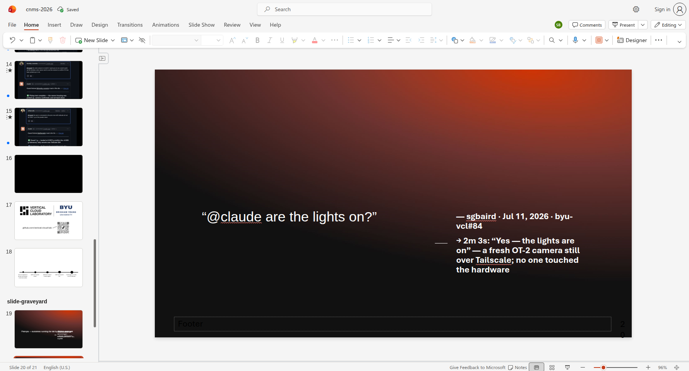

# CNMS 2026 deck — quote slides added via headless-browser co-authoring

On 2026-08-12 (PR #176 follow-up), 14 slides were built live inside
`cnms-2026.pptx` on OneDrive using the headless-browser co-authoring method
from issue #175 (Playwright + system Chrome driving PowerPoint for the web
through the password-gated sharing link, FedAuth cookie injected from the
`guestaccess.aspx` unlock). The deck owner was co-editing the whole time; no
REST upload was attempted, so no 423-lock issues.

All slides use the deck's own **`2_Quote_Long`** layout (dark gradient, title
placeholder for the quote, small body placeholder next to the em dash for
attribution). They were appended after the last slide and live in a section
renamed from `slide-graveyard` to **"Prompts → outcomes (added by Claude)"**.
Every slide's text was verified verbatim against the re-downloaded stored
file (not just the editor's "Saved" indicator).

## Slide map (deck position at time of writing → source)

Sources are the entries in [`cnms-2026-quotes.md`](cnms-2026-quotes.md).

| Deck slide | Content | Source entry |
|---|---|---|
| 19 | Section intro: "Prompts → outcomes" + corpus stats | Headline numbers |
| 20 | "@claude are the lights on?" | #1 |
| 21 | Student steers the OT-2 (color sensor pickup) | #2 |
| 22 | Double-blind test on the AI, 18/18 | #3 |
| 23 | Napkin sketch → parametric CAD | #5 |
| 24 | "weve loaded salt…" glovebox dose, 0.9956 g | #10 |
| 25 | The agent as detective (dead solenoid forensics) | #11 |
| 26 | Dictating a BO campaign in plain English | #13 |
| 27 | "aghh.. abstract limit is 150 words" → 147 words | #15 |
| 28 | Agents launching agents (@copilot stacked PR) | #17 |
| 29 | Edison hypothesis → hardware confirmation | #20 |
| 30 | Students overrule the AI scientist | #19 |
| 31 | HPC 2FA constraint → mini-PC gateway redesign | #25 |
| 32 | Failure → guardrails ("kind of scary" → CLAUDE.md rules) | Failure beats |

Quotes are verbatim (typos like "weve"/"aghh.." preserved). Slide numbers
will drift as the deck is edited — find the section by name.

## Technique notes (additions to the co-authoring recipe)

- **New slide with a specific layout**: Home → New Slide dropdown arrow opens
  the layout gallery; gallery items are clickable by position. Placeholders on
  the fresh slide accept a single click + typing.
- **Autocorrect fights verbatim quotes.** PowerPoint web autocapitalizes the
  first word of a paragraph and any word following `..`. Prefixing a paragraph
  with `— ` or an opening curly quote suppresses the paragraph-start rule, but
  nothing suppresses the after-`..` rule during typing.
- **Clipboard paste bypasses autocorrect entirely** and is the right way to
  enter verbatim text: `ctx.grant_permissions(["clipboard-read",
  "clipboard-write"], origin=...)`, `navigator.clipboard.writeText(...)` via
  `page.evaluate`, then click into the placeholder, `Ctrl+A`, `Ctrl+V`.
  Prefer this over `keyboard.type` for all future quote/text work.
- **Word fix-ups**: double-click selects a word *plus its trailing space*;
  retyping over it re-triggers autocorrect. Paste-over-selection avoids both
  problems.
- **Sections**: right-click a section header in the thumbnail pane →
  Rename/Remove/Move. New slides inserted after the last slide of the deck
  land in whatever section contains the insertion point — including empty
  trailing sections.
