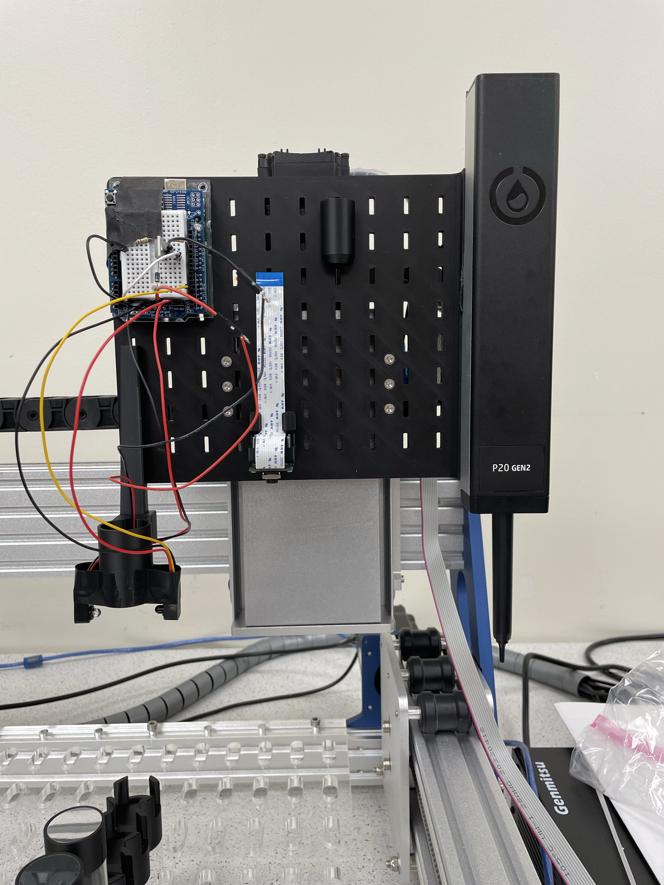
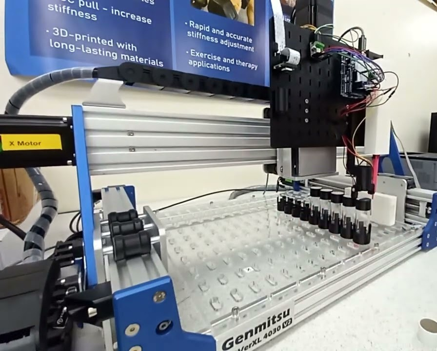

# CubXL — shareable photo and demo video

A short, curated index of CubXL media that can be handed to someone outside the lab with a
single link. Everything listed under "Our own media" was produced by the VCL and lives either
in this repo, in a public issue on this repo, or on the lab's YouTube channel.

The CubXL is the [Ursa Laboratories](https://www.ursalabs.ai/) automated liquid-handling
workcell — a modified Genmitsu **PROVerXL 4030 V2** Cartesian gantry with swappable instrument
mounts, driven by **CubOS**. Ours was unboxed and commissioned in
[issue #133](https://github.com/vertical-cloud-lab/byu-vcl/issues/133).

## The two picks

| | Pick | Link |
|---|---|---|
| **Picture** | CubXL tool head with the Opentrons **P20 GEN2** pipette over the vial deck — 3024×4032, our own photo | [`docs/img/cubxl-pipette-head.jpg`](img/cubxl-pipette-head.jpg) ([web-sized](img/cubxl-pipette-head-web.jpg)) |
| **Demo video** | *First Test Protocol Run on CubXL* — the gantry running a protocol end to end | <https://youtube.com/shorts/vPCfPpj7zpE> |

The video is a YouTube **Short**, so it is short by construction and plays inline on essentially
any platform — one link, no download, nothing to host.

### Picture — primary

Posted by @benwhitney5463 in
[issue #133, 2026-07-29](https://github.com/vertical-cloud-lab/byu-vcl/issues/133#issuecomment-5121701796)
("our current barebones gantry setup"). Sharpest CubXL photo we have, and the one that most
clearly reads as *automated liquid handling*: the printed backboard, the Arduino/TMC2209 stack
that drives the pipette, the P20 GEN2 itself, and the vial deck below.

### Picture — whole machine in context

Frame from *Pipette test on CubXL* (below). Lower resolution (896×720, it is a video frame), but
it is the only shot that shows the **entire** machine: gantry, deck, loaded tip rack and the
Genmitsu PROVerXL 4030 V2 base. Use this one when the audience needs to see the whole workcell;
use the primary photo when they need to see what it actually does.

## Our own media — full inventory

All on the lab's **BYU Vertical Cloud Lab** channel
([`UCKC7WzMu6QEh7O55zZlT2lw`](https://www.youtube.com/@BYUVerticalCloudLab)) — note this is a
*different* channel from **BYU VCL Hardware Streams** (`UCZ5KNGkEEqDsRVn0Nlfn0IA`), which carries
the automated hourly camera streams.

| Video | Date | What it shows |
|---|---|---|
| [First Test Protocol Run on CubXL](https://youtube.com/shorts/vPCfPpj7zpE) | 2026-07-23 | **The demo pick.** First full protocol run — gantry moves, picks up and repositions a vial. |
| [Pipette test on CubXL (pipette handheld)](https://youtu.be/lmQbUWNqTmM) | 2026-08-31 | Newest CubXL clip; best *wide* framing of the whole machine with tip rack loaded. |
| [E-stop testing](https://youtu.be/KR_h3ghReJw) | 2026-08-30 | E-stop behaviour ([issue #182](https://github.com/vertical-cloud-lab/byu-vcl/issues/182)). Mostly a dim screen recording — not for sharing. |
| [CubXL Setup full (1.5× speed)](https://youtu.be/XUobYYZ1vzQ) | 2026-06-26 | Chest-cam of the full hardware build. Long — a build log, not a demo. |
| [CubOS setup and CubXL Calibration](https://youtu.be/Kr37dRIVfqo) | 2026-07-01 | Software install + calibration walkthrough. |
| [Calibration bug fixes on CubXL using web interface from CubOS](https://youtu.be/Gi3pt3BvIug) | 2026-07 | Troubleshooting via the CubOS web UI. |
| [calibrating with CubOS UI](https://youtu.be/QKO2XJMX-oM) | 2026-07 | Calibration via the CubOS UI. |

**Bonus clip — the self-driving-lab story.** A 44 s screen-and-bench recording of a protocol
triggered *remotely from a GitHub issue* (comment → Claude → Raspberry Pi → CubXL), posted in
[issue #133](https://github.com/vertical-cloud-lab/byu-vcl/issues/133#issuecomment-5096741846):
<https://github.com/user-attachments/assets/97803ab8-f05e-45f8-9625-cb9acdbba1e7>. It is a
better *narrative* than the protocol-run Short, but it is a raw MP4 attachment rather than a
streaming link, and it is portrait phone footage with a laptop in frame.

## Ursa Laboratories' own product photos

<https://www.ursalabs.ai/> publishes clean white-background renders of the platform, including
`assets/fluid_dispensing.webp` (a CubXL-class 4030 frame configured for liquid handling) and
`assets/asmi_indent.png` (the bare PROVerXL 4030 V2 base). These look far more polished than
anything shot on our bench.

They are Ursa's marketing images, not ours — **ask Alex (@alexc2684) before using them
externally, and credit Ursa Laboratories.** For most purposes a photo of *our* machine actually
running is the stronger asset anyway.

## Caveats

- Durations for the non-Short videos were not verified — YouTube blocks the CI runner's
  datacenter IP, and Tailscale (which would give access to a residential-IP host) was not
  provisioned on the run that produced this file. Only the `shorts/` URL form guarantees brevity.
- *Pipette test on CubXL* and *E-stop testing* are confirmed **public** (they appear in the
  channel's RSS feed, which lists public uploads only). The four older videos are confirmed to
  exist and embed, but public-vs-unlisted was not established — the feed only returns the 15
  most recent uploads. Anyone with the link can watch either way.
- No high-resolution photograph of the *complete* assembled CubXL exists yet. The full-machine
  shots in issue #133 were uploaded at 250×333. **Worth taking one good wide photo** of the
  machine, ideally mid-run with tips and vials loaded, next time it is set up.
