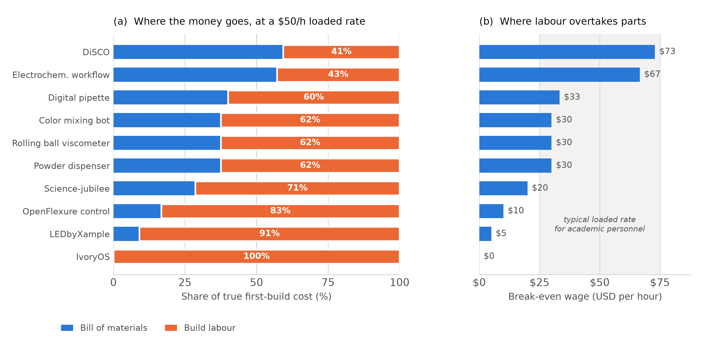
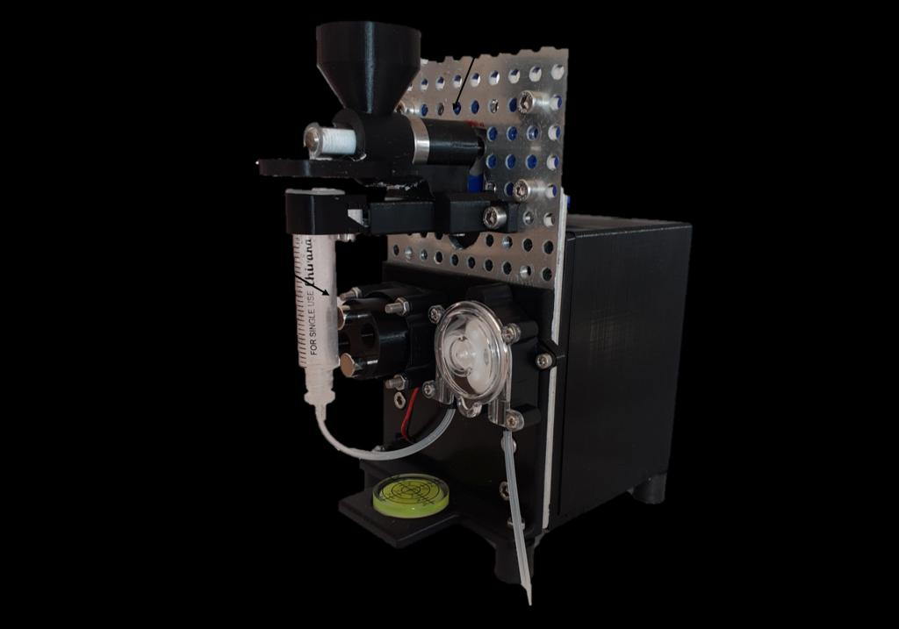
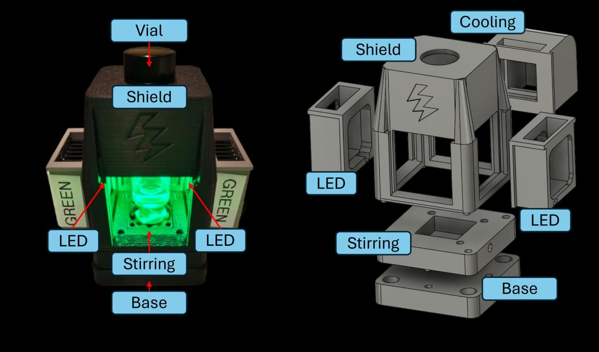
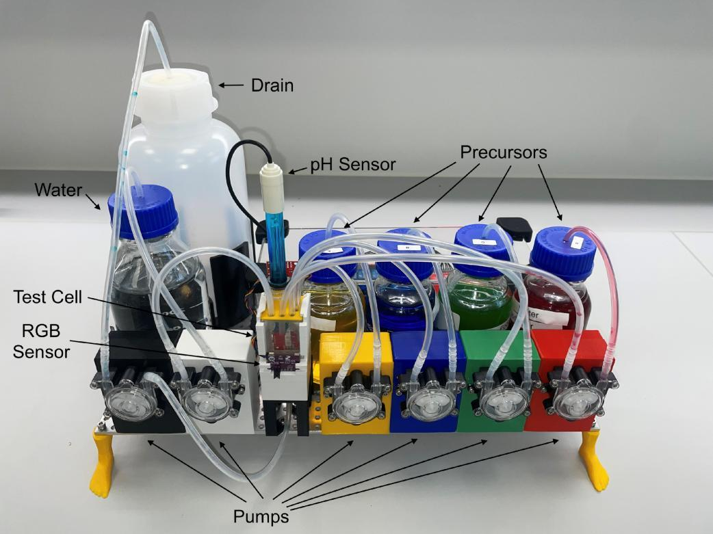
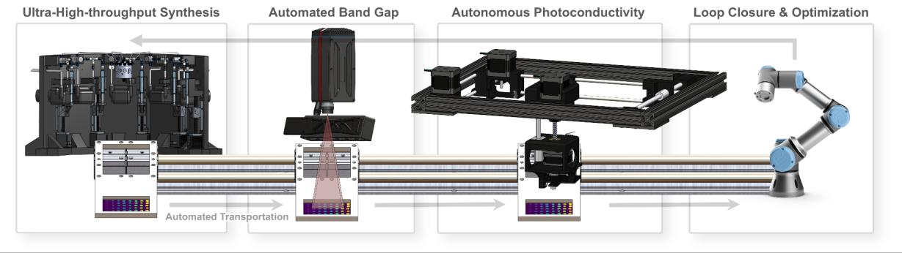
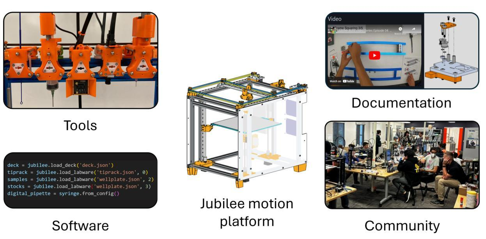
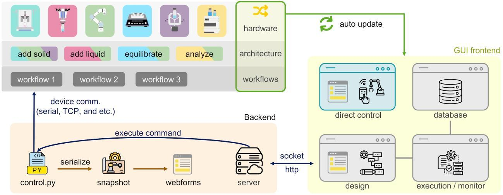

# Replication, not fabrication: documentation is the rate-limiting step for democratized self-driving labs

**A Perspective drawing on ten user-developed automation projects contributed to the Democratizing Self-Driving Labs workshop at Accelerate 2024**

Brenden Pelkie1, Sterling Baird2, Eunice Aissi3, Kenzo Aspuru-Takata2, Yang Cao2, Jin Hyun Chang4, Kshitij Gambhir4, Wm Salt Hale1, Lucy Hao5, Chance Hattrick2, Jason E. Hein2,5,6, Danli Luo1, Owen A. Melville2, Monique Ngan2, Louie Lucas Bisgaard Nyeland4, Nadya Peek1, Maria Politi5, Ethan Rajkumar2,5, Alexander E. Siemenn3, Blair Subbaraman1, Sonya Vasquez1, Jeffrey Watchorn2, Wenyu Zhang5, Rógvi Ziskason4, Lilo Pozzo1, Tonio Buonassisi3, Tejs Vegge4

1. University of Washington
2. Acceleration Consortium, University of Toronto
3. Massachusetts Institute of Technology
4. Technical University of Denmark
5. University of British Columbia
6. University of Bergen

<!-- AUTHOR-LIST QUERIES, resolve before submission:
     (a) Sonya Vasquez had no affiliation superscript in v1; provisionally set to 1
         (University of Washington, per ref. 21). CONFIRM.
     (b) Ethan Rajkumar's superscript carried a stray double comma in v1 ("2,5,,");
         corrected to 2,5.
     (c) Basita Das is credited as a DiSCO author in Table 1 and is a co-author on
         refs 17-19, but does not appear in the v1 author list. CONFIRM whether this
         is an intended omission or an error. Do not resolve without asking her.
-->

## Abstract

Democratizing self-driving labs (SDLs) is usually argued for on grounds of cost: user-developed, openly licensed automation is said to put SDLs within reach of researchers who cannot buy commercial platforms. We argue that this framing is misleading, and that acting on it misdirects community effort. Using the self-reported build costs and build times of ten user-developed automation projects contributed to a community workshop, we show that build labour, not the bill of materials, dominates the true cost of a first build: every one of the ten projects has a break-even wage — the hourly rate at which labour costs as much as parts — at or below $73/h, with a median of $30/h. At any loaded rate realistic for the graduate students, postdocs and staff who actually perform these builds, user-developed automation is not a cost-reduction strategy at the point of first build. It becomes one only on replication, where the same projects report median rebuild times of 17 hours. Replication, however, is not automatic: it happens only where documentation is complete enough to carry a new user through procurement, assembly, configuration, operation and troubleshooting. Our own sample bears this out in an uncomfortable way — three of the ten contributed projects still have no public design files eighteen months on. We therefore argue that documentation, not hardware, is the rate-limiting step for democratized SDLs, and that the field's incentives are aimed at the wrong target. We set out what follows for funders, journals, vendors and builders, including the limits beyond which user-developed automation should not be pushed.

**Keywords:** self-driving labs, open hardware, laboratory automation, documentation, reproducibility, research software sustainability

---

## 1. Introduction: the cost argument is the wrong argument

Self-driving labs (SDLs) are gaining broad adoption throughout chemicals and materials research.1–3 These systems — also referred to as autonomous experimentation platforms or materials acceleration platforms — combine automated experimentation workflows with machine learning-directed experimental design to iteratively optimize material properties or perform materials discovery tasks. Implementing one is a complex endeavour requiring careful integration of sample preparation, sample characterization, active learning, data management and system orchestration. Automating sample preparation and characterization accounts for a significant portion of that complexity,4 so many SDL implementations turn to commercial solutions for automation infrastructure.5,6 Commercial SDLs have enabled important contributions, but their expense and complexity put them out of reach for many scientists, and their normalization risks establishing SDLs as specialized equipment reserved for the most promising science and the best-resourced researchers.

The community's answer to this has been democratization, and the case for democratization is almost always made on price. Reviews of low-cost SDLs promote "frugal twin" platforms that reproduce the function of expensive systems at a fraction of the capital cost;7 recent work in this journal surveys how low-cost 3D printing can substitute for commercial laboratory automation.8 The implied argument is straightforward: commercial automation is expensive, user-developed automation has a small bill of materials, therefore user-developed automation democratizes access.

**We think this argument is wrong, and that it is wrong in a way that matters.** It is wrong because the bill of materials is not the cost. It is a minority of the cost. The dominant input to a user-developed automation project is skilled human time, and skilled human time is expensive, scarce, and — unlike a stepper motor — not on a downward price trend.

We can show this from data the community has already reported. Figure 1 uses the self-reported cost-to-reproduce and time-to-reproduce figures for the ten projects contributed to the Democratizing Self-Driving Labs workshop at the 2024 Accelerate Conference. For each project we compute its *break-even wage*: the fully loaded hourly rate at which the cost of build labour equals the bill of materials. Every project in the sample has a break-even wage at or below $73/h, and the median is $30/h. Below a builder's break-even wage, parts dominate; above it, labour does. Since $30/h is at or beneath the fully loaded cost of essentially any researcher in a position to build these systems, **the honest summary is that for most user-developed automation, the parts are the cheap part.**

***Figure 1.*** *The true cost of a first build is dominated by labour, not parts.* **(a)** Composition of first-build cost for the ten contributed projects at a fully loaded rate of $50/h, ordered by break-even wage. Percentages give the labour share. **(b)** The break-even wage for each project — the hourly rate at which build labour costs as much as the bill of materials. The shaded band spans $25–75/h, a range covering plausible fully loaded costs from graduate researcher to professional automation engineer. Every project's break-even wage falls at or below the top of that band. Underlying values are the self-reported figures in Table 1; the derivation is given in Section 4 and the analysis code and outputs are provided in the ESI.

This is not an argument against democratization. It is an argument that the community has been optimizing the wrong variable. If labour dominates first-build cost, then the way user-developed automation reduces the cost of access is not by being cheap to build once — it is **by being built once and reproduced many times.** The ten contributed projects report a median replication time of 17 hours against original development efforts the contributors describe as running to hundreds or thousands of hours. That ratio, not the parts price, is where the democratizing leverage lives.

And that reframes the problem entirely, because replication is not a property of hardware. A design does not replicate because its files are on the internet. It replicates when a stranger can be carried from an empty bench to a working instrument, which requires documentation covering all five of procurement, assembly, configuration, operation and troubleshooting. This is what the Open Source Hardware Association's definition is reaching for when it requires that a design be released "in such a way that anyone can make, modify, distribute, and use" it.9 Anything less is published, but not reproducible.

We therefore advance five claims, developed in Sections 4–8:

- **Claim 1.** User-developed automation is not, in general, a low-cost strategy at the point of first build; labour dominates the bill of materials at any realistic loaded rate. (Section 4)
- **Claim 2.** The economics of user-developed automation close only on replication, and only a minority of projects ever reach that point. (Section 5)
- **Claim 3.** Documentation, not hardware design, is the binding constraint on replication — and the academic incentive system does not pay for it. (Section 6)
- **Claim 4.** The binding skill constraint is not scientific or computational but mechanical and electrical: the "small stuff". (Section 7)
- **Claim 5.** User-developed automation has real limits, and identifying them is part of taking it seriously. (Section 8)

Our evidence is a set of ten projects contributed to a community workshop, described by the people who built them. Section 3 introduces those projects and states in advance, in Table 2, exactly which claim each one supports, complicates or contradicts. Projects that complicate our claims are the most useful ones in the sample, and we have not removed them.

### Relation to existing work

This Perspective is deliberately positioned against the prevailing framing rather than alongside it. Lo *et al.*'s review of low-cost SDLs7 and Doloi *et al.*'s recent survey of low-cost 3D printing for laboratory automation8 both catalogue what can be built cheaply, and both are valuable for that purpose. Our contribution is orthogonal and, on the central question, opposed: we take the same class of artefacts and argue that their capital cost is close to irrelevant to whether they democratize anything. Where those works ask *how cheaply can this be built*, we ask *what determines whether it is ever built a second time*, and answer that the determinant is documentation. We also depart from both in scope: our unit of analysis is not the device but the project, including the labour, the documentation and the community around it.

## 2. The workshop and the survey

Successful adoption of user-developed automation infrastructure requires community involvement. To support this, we organized the "Democratizing Self-Driving Labs" workshop at the 2024 Accelerate Conference in Vancouver, BC. The workshop featured talks, discussions and demonstrations aimed at generating community alignment around democratized automation. At its core was a showcase of user-developed automation infrastructure comprising 14 examples contributed by the community. These ranged from niche enhancements for existing tools to complete end-to-end automation pipelines, from hundreds to tens of thousands of dollars in price, and from one-off solutions to widely deployed open hardware initiatives.

Ten of the 14 showcased projects are analysed here. **[NEEDED: state the selection criterion explicitly — e.g. "the ten whose developers agreed to contribute a written description and cost/time estimates"; a reviewer will ask, and an unexplained 10-of-14 reads as selection bias.]**

We also surveyed workshop attendees on community needs for democratized SDL adoption. Respondents (n = 58) ranked "developing low-cost SDL equipment and shared blueprints" as a top priority for advancing democratized SDLs, and over 70% expressed willingness to publish hardware designs and related software.

Two things about that result are worth stating plainly, because they set up the rest of this Perspective. First, the community's stated priority is *equipment and blueprints* — that is, artefacts. Second, a supermajority say they are willing to publish designs. Both are consistent with the cost framing we are arguing against: they describe an intention to produce and release hardware, not an intention to make hardware reproducible. Section 6 shows what happens to that intention in practice.

> **[NEEDED — survey material for the ESI.]** The survey is currently the only community-level quantitative evidence in this Perspective and it is under-reported. Before submission we need: (i) the survey instrument, verbatim; (ii) the full response distribution for every item, not just the two summarized above; (iii) the response rate — 58 respondents out of how many attendees; (iv) whether responses were collected before, during, or after the showcase, since exposure to the showcase plausibly affects the answers; (v) confirmation of the ethics/consent status for publishing aggregate results. Items (i)–(iv) should appear as Supplementary Note S2.

## 3. The contributed projects, and what each one is here to show

Table 1 summarizes the ten projects. Table 2 then states, in advance and for every project, which of our five claims it bears on and in which direction. We ask readers to hold us to Table 2: a Perspective that presents examples without saying what they are evidence for is a catalogue, and the projects below are not offered as a catalogue.

**Table 1. The ten contributed user-developed automation projects.** Cost and time to reproduce are as reported by each project's developers.

| # | Project | Developers | Cost to reproduce (USD) | Time to reproduce | Design files and documentation |
| --- | --- | --- | --- | --- | --- |
| P1 | Powder dispensing module | Jin Hyun Chang, Kshitij Gambhir, Rógvi Ziskason, Louie Lucas Bisgaard Nyeland | $300 | 10 h | **[NEEDED — repository]** |
| P2 | LEDbyXample modular photoreactor | Owen A. Melville, Monique Ngan, Jeffrey Watchorn | $80–160 | 24 h | <https://github.com/owen-melville/photo-reactor> **[NEEDED — Zenodo DOI]** |
| P3 | Rolling ball viscometer | Jin Hyun Chang, Kshitij Gambhir, Rógvi Ziskason, Louie Lucas Bisgaard Nyeland | $300 | 10 h | **[NEEDED — repository]** |
| P4 | Color mixing bot | Jin Hyun Chang, Kshitij Gambhir, Rógvi Ziskason, Louie Lucas Bisgaard Nyeland | $300 | 10 h | <https://gitlab.com/auto_lab/47332-student-excercises> **[NEEDED — Zenodo DOI]** |
| P5 | DiSCO platform for photovoltaics synthesis and characterization | Alexander E. Siemenn, Eunice Aissi, Basita Das, Tonio Buonassisi | $30–40 K | 3 months | <https://github.com/PV-Lab/Archerfish>, <https://github.com/PV-Lab/SDCNN>, <https://github.com/PV-Lab/Autocharacterization-Bandgap> |
| P6 | Science-jubilee flexible automation platform | Brenden Pelkie, Maria Politi, Blair Subbaraman, Danli Luo, Nadya Peek, Sonya Vasquez, Wm Salt Hale | $2,000 | 100 h | <https://science-jubilee.readthedocs.io/> |
| P7 | Electrochemical workflow on science-jubilee | Yang Cao, Ethan Rajkumar, Ilya Yakavets | $20 K | 300 h | **[NEEDED — repository]** |
| P8 | Digital pipette Jubilee integration | Chance Hattrick, Sterling Baird | $100 | 3 h | **[NEEDED — archival deposit; currently forum threads only]**† |
| P9 | Public control of an OpenFlexure microscope | Kenzo Aspuru-Takata, Sterling Baird | $300 (microscope) | 30 h (incl. microscope build) | <https://ac-training-lab.readthedocs.io/> |
| P10 | IvoryOS GUI control software | Wenyu Zhang, Lucy Hao, Jason E. Hein | $0 (software) | 0–1 h per new hardware integration | <https://gitlab.com/heingroup/ivoryos> |

† P8 is currently documented in two threads on the accelerated-discovery.org Discourse forum. Forum posts carry no persistent identifier and are not archival; by our own Claim 3 this does not count as documentation of a reproducible design, and we have marked it accordingly rather than quietly citing the threads.

**Table 2. How each project bears on each claim.** *S* = supports, *C* = complicates, *X* = contradicts, — = not informative. Entries marked *C* and *X* are discussed explicitly in the corresponding section; we have not omitted them.

| Project | C1 cost | C2 replication | C3 documentation | C4 skills | C5 limits |
| --- | :---: | :---: | :---: | :---: | :---: |
| P1 Powder dispensing module | S | X | X | S | S |
| P2 LEDbyXample photoreactor | S | S | S | S | — |
| P3 Rolling ball viscometer | S | X | X | S | S |
| P4 Color mixing bot | S | S | S | S | — |
| P5 DiSCO platform | C | C | C | — | S |
| P6 Science-jubilee | S | S | S | S | S |
| P7 Electrochemical workflow | C | X | X | — | S |
| P8 Digital pipette integration | S | S | C | — | — |
| P9 OpenFlexure public control | S | S | S | S | — |
| P10 IvoryOS | S | S | S | C | — |

Brief descriptions follow. Full project descriptions as contributed by their developers, including complete build details, are provided as Supplementary Note S1.

### Stand-alone tools

**P1 — Powder dispensing module.** Solids handling, and powder dispensing in particular, is ubiquitous and hard to automate with useful precision. Commercial systems are accurate but expensive and inflexible; the existing open-hardware OpenTrickler10 did not meet the developers' material-compatibility or modularity requirements, and they additionally needed to mix the dispensed powder with an input liquid. Judging that high accuracy was not their binding criterion — dispensed amounts can be adjusted and averaged over iterative optimization campaigns — they built a system driving a precision auger with a stepper motor under feedback from an integrated balance. Powder is dispensed into a disposable syringe body where a peristaltic pump mixes it with liquid, and a low-cost interchangeable dispensing head allows dedicated components per powder.

***Figure 2.*** *Stand-alone powder dispensing module (P1).*

**P2 — LEDbyXample modular photoreactor.** Intense light is common in crosslinking, photopolymerization and reaction-pathway work. LEDbyXample is an inexpensive modular photoreactor for integration with automated chemistry setups, built from simple parts and a 3D printed frame. Swappable light-emitting modules carrying ~1 W LEDs of specific wavelengths mount on heat sinks at the reactor's side; a fan with mounted magnets in the base provides magnetic stirring; an active cooling module can be added. All modules are controlled by custom PCBs with a Raspberry Pi Pico and simple Python code. The developers sought a system more flexible and lower-cost than the open-hardware Wisconsin photoreactor11 and the budget commercial Pioreactor,12 with assembly simple enough that building it reinforces prototyping, 3D printing and microcontroller skills. Build documentation and a parts list are freely available.

***Figure 3.*** *LEDbyXample modular photoreactor (P2).*

**P3 — Rolling ball viscometer.** Complete rheological characterization requires large, expensive equipment and is difficult to automate, particularly sample loading and cleaning. Low-fidelity proxies are common in end-use applications, such as timing drainage from a perforated cup,13 and automated viscometry for Newtonian fluids has been demonstrated on pipetting robots by comparing set to actual dispense rates.14 This project applies the rolling-ball principle and Stokes' law: a sample is loaded into a clear tube, the tube is rotated so a small ball rolls through the fluid, and the ball's motion is captured with a high-speed camera. The geometry permits automated loading and cleaning with peristaltic pumps.

> **[NEEDED — figure.]** P3 is the only hardware project in this Perspective without a figure. Every other build is shown. Please supply a photograph or render.

### End-to-end automation systems

**P4 — Color mixing bot.** Implementing an SDL demands hardware engineering, software development, data science, domain science and system-wide debugging, and no conventional degree programme teaches that combination. Colour-matching experiments have become a standard entry point,15,16 requiring automated preparation, characterization, ML-based design and orchestration while remaining visually legible and chemically safe. This project extends the classic demonstration into a multi-objective setting by adding a pH-matching objective. Peristaltic pumps mix coloured and pH-adjusted stock solutions in a measuring chamber; an RGB sensor and pH probe provide readout; multi-objective Bayesian optimization learns the stock ratio hitting a target colour and pH. Its low cost, portability and absence of chemical or mechanical hazards suit it to teaching.

***Figure 4.*** *Color mixing bot (P4).*

**P5 — DiSCO materials synthesis and characterization system.** Bringing an SDL to life requires stringing components together with sample transfer and orchestration. Many builders use robotic arms to shuttle samples between workstations, which permits re-use of human-centric steps but caps throughput and imports the cost and complexity of reliable robotics. DiSCO (Discovery, Synthesis, Characterization and Optimization) instead simplifies the physical integration itself, targeting high-dimensional materials search spaces such as perovskite semiconductor compositions with high-throughput, low-fidelity screening that flags regions worth expensive follow-up. It integrates Archerfish combinatorial printing extended to 10-dimensional rapid drop-cast synthesis,17 automated optical and contact-based characterization,18,19 and custom machine learning models for experimental control,20 all arranged around a single linear rail so that sample positioning reduces to reliable motion along one axis. The modules are open-source apart from commercial components such as hyperspectral imagers.

***Figure 5.*** *DiSCO materials synthesis and characterization platform (P5).*

**P6 — Science-jubilee.** Where DiSCO brings samples to tools, science-jubilee brings tools to samples. It is an automation ecosystem of three parts: open-hardware experimental tools, software modules controlling them, and a community of contributing users. It builds on the Jubilee open-source tool-changing motion platform21 — assembled from a kit of common off-the-shelf parts and a few commercially available custom components — by adding tools and capabilities for experimental automation. Tool changing lets researchers run multi-step workflows without moving samples between locations or machines. A growing library of open-hardware tools covers liquid handling, imaging and sonication; a Python library provides a high-level programming interface; documented tool and software interfaces make the platform extensible. Documentation describes building, provisioning and using the system step by step, and the developers host workshops, run a Discord server and travel to demonstrate the platform. It has supported work from sonochemical quantum dot synthesis to automated plant growth monitoring.22,23

***Figure 6.*** *Science-jubilee platform elements: the base Jubilee motion platform, science-specific tools, control software, documentation, and support for a community of users. Jubilee drawing licensed CC BY 4.0, from <https://jubilee3d.com/>.*

**P7 — Electrochemical workflow for redox-active compounds.** This project uses science-jubilee as baseline infrastructure for a workflow spanning synthesis, isolation and characterization of redox-active compounds. An Opentrons OT-2 P300 pipette is driven through the science-jubilee adapter for liquid handling, and a custom tool is being developed to integrate a commercial BluRev rotating disk electrode for automated electrochemical characterization. The science-jubilee Python control software supports programming both synthesis (for example metal–ligand coordination compounds) and characterization (cyclic voltammetry, kinetic analysis of redox events). The developers chose the platform for its extensibility, programmability and cost; comparable workflows are possible on commercial platforms at substantially higher price.

**P8 — Digital pipette integration for multiple platforms.** Integrating heterogeneous mounting, power and control connections is a recurring cost when building SDLs from existing equipment; devices with stand-alone packaging, power and control are far easier to adopt. This project modified the Digital Pipette24 — a sub-$100 liquid handler with replaceable fluid-contacting components and luer-lock fluidic integration, built from a self-contained linear servo actuator, a syringe and 3D printed frame parts — so that it operates stand-alone. A 3D printed attachment allows mounting on motion platforms such as science-jubilee or robotic arms, and MQTT communication lets it operate in concert with other devices. The integration has been reproduced by several groups and science-jubilee users and is in active research use.

### Control and orchestration software

**P9 — Public control of an OpenFlexure microscope.** Automation opens new modes of equipment use: distributed experiments have already combined resources across continents,3,25 and SDLs operating as user facilities will need distributed access. This project built a remote interface to the OpenFlexure microscope,26 a low-cost, programmable, open-source platform whose programmability makes tasks such as large-area scans far more efficient. The interface uses MQTT to let users position the stage, focus and capture images through a Python interface, with a requesting-credential system allowing unrelated individuals to take turns. It extends existing open-source microscope control software such as µManager27 by allowing remote, public control, opening cloud experimentation for education or research to anyone with an internet connection.

**P10 — IvoryOS.** Hardware capability alone will not democratize SDLs; reliable orchestration and control software is equally critical infrastructure. It remains common for SDL developers to assemble control software from ad hoc scripts and notebooks, which gets an effort off the ground but imposes a steep learning curve on researchers without coding experience and creates maintainability, extensibility and reproducibility problems. Several frameworks address this, including ChemIDE and 𝜒DL,28,29 AlabOS30 and ChemOS 2.0,31 but integration with existing software is hard given the heterogeneity of SDL components, and fluid research objectives make rigidly configured control software difficult to maintain. IvoryOS provides adaptable, easily integrated GUI interfaces to SDL platforms.32 It works as an extension to existing Python scripts, capturing platform features at start-up by inspecting instances for available methods and parameter requirements and updating the web GUI accordingly, so no framework or layout constraint is imposed. The GUI additionally offers low-code workflow design, built-in iteration modes including high-throughput and adaptive experimentation, and a code-free interface for configuring optimization parameters and objectives.

***Figure 7.*** *IvoryOS dynamically generated control interface (P10).*

---

## 4. Claim 1: user-developed automation is not, in general, low-cost

Most of the contributed projects cite lower cost than commercial alternatives as a motivation, and on bills of materials they are right: P2 at $80–160 and P8 at $100 sit one to two orders of magnitude below any commercial equivalent. But the bill of materials is not the cost of the project. It is the cost of the parts.

We can quantify the rest from Table 1, because Table 1 reports build *time* as well as build *cost* — a column the community routinely collects and then does not use. Multiplying reported build hours by a fully loaded hourly rate gives a labour cost that can be set against the bill of materials directly. Table 3 does this at $50/h. Two conversions are stated for transparency: reported ranges are taken at their midpoint (so P2's "$80–160" enters as $120 and P10's "0–1 h" as 0.5 h), and P5's "3 months" is read as 12 weeks at 40 h, or 480 h at one full-time equivalent.

**Table 3. Labour and materials in the true cost of a first build, at a fully loaded rate of $50/h.** The break-even wage is the rate at which labour cost equals the bill of materials; it does not depend on the assumed rate.

| Project | Bill of materials | Build hours | Labour @ $50/h | Labour share | Break-even wage |
| --- | ---: | ---: | ---: | ---: | ---: |
| P10 IvoryOS | $0 | 0.5 | $25 | 100% | $0/h |
| P2 LEDbyXample photoreactor | $120 | 24 | $1,200 | 91% | $5/h |
| P9 OpenFlexure public control | $300 | 30 | $1,500 | 83% | $10/h |
| P6 Science-jubilee | $2,000 | 100 | $5,000 | 71% | $20/h |
| P1 Powder dispensing module | $300 | 10 | $500 | 62% | $30/h |
| P3 Rolling ball viscometer | $300 | 10 | $500 | 62% | $30/h |
| P4 Color mixing bot | $300 | 10 | $500 | 62% | $30/h |
| P8 Digital pipette integration | $100 | 3 | $150 | 60% | $33/h |
| P7 Electrochemical workflow | $20,000 | 300 | $15,000 | 43% | $67/h |
| P5 DiSCO platform | $35,000 | 480 | $24,000 | 41% | $73/h |

The choice of $50/h is an assumption, and we would rather expose it than hide it. Table 4 gives the sensitivity.

**Table 4. Sensitivity of the conclusion to the assumed fully loaded rate.**

| Fully loaded rate | Projects where labour exceeds materials | Median labour share |
| --- | ---: | ---: |
| $25/h | 4 / 10 | 45% |
| $50/h | 8 / 10 | 62% |
| $75/h | 10 / 10 | 71% |

The rate-independent statistic is the break-even wage in the final column of Table 3, and it is the one we would ask readers to carry away. Its median across the sample is $30/h and its maximum is $73/h. A researcher whose fully loaded cost exceeds $73/h — which includes most staff engineers, many postdoctoral researchers once benefits and overhead are counted, and every principal investigator — spends more on labour than on parts for **every project in this sample**, including the $35,000 one. A graduate researcher at the bottom of the band still crosses the break-even point for four of the ten.

**Two projects complicate this claim, and they are informative.** P5 (DiSCO) and P7 (electrochemical workflow) are the only projects where the bill of materials dominates at $50/h, at 59% and 57% respectively. Both are bespoke research platforms carrying genuinely expensive components — hyperspectral imagers, a commercial rotating disk electrode — and neither is plausibly described as a low-cost build. They matter because they mark the boundary of the population the "frugal twin" framing7 actually describes. The ten projects span three orders of magnitude of bill of materials, from $0 to $35,000, and treating that as one phenomenon is a mistake. There are at least two populations here: sub-$500 single-function or pedagogical tools, where the frugal-twin framing holds and where labour overwhelmingly dominates; and $20,000-and-up bespoke research platforms, where it does not apply at all and where user development is chosen for capability and control, not price. Democratization arguments that quietly generalize from the first population to the second are unsound.

There is a further asymmetry that Table 3 understates. The hours in Table 1 are *reproduction* hours — what it takes a competent builder to rebuild an existing design. Original development is far larger; contributors described efforts running to hundreds or thousands of hours. First-build labour share is therefore higher than Table 3 shows, in some cases by more than an order of magnitude. Table 3 is a conservative statement of Claim 1.

None of this means the time is wasted. Researchers who invest in SDL design and build work are better positioned to troubleshoot, modify and extend their platforms independently, and that capability has real and durable value. But it is a training investment, and it should be argued for as one. It is not a saving on capital expenditure, and presenting it as such invites a disappointment that damages the case for democratization when it arrives.

## 5. Claim 2: the economics close only on replication

If a first build costs more in labour than in parts, when does user-developed automation ever reduce the cost of access? On the second build, and on every build after that.

The replication numbers in Table 1 are strikingly good. Median time to reproduce across the ten projects is 17 hours. Eight of the ten can be reproduced in 100 hours or less, and three in under 10. Set that against original development efforts of hundreds to thousands of hours and the leverage is a factor of tens to hundreds — but only for designs that someone actually reproduces. **The value of user-developed automation is almost entirely in the amortization, and amortization requires replicas.**

P8, the Digital pipette integration, is the clearest positive case in the sample: a 3-hour, $100 rebuild that has in fact been reproduced by several groups and is in active research use in labs that did not develop it. Its total community value is a large multiple of its development cost precisely because the replication cost is near zero. P6, science-jubilee, makes the same point at larger scale and shows what produces that outcome: step-by-step build, provisioning and usage documentation, a Discord server for direct support, workshops, and travel to demonstrate the platform. None of that is hardware engineering. All of it is replication infrastructure. P10, IvoryOS, is the limiting case — software, where replication cost is essentially zero and the reported integration effort for new hardware is under an hour.

**Three projects contradict this claim, and they are the most important entries in Table 2.** P1, P3 and P7 have, eighteen months after the workshop, no public design files. Whatever their technical merit — and P1 and P3 are both economical, well-conceived instruments solving real problems — their replication count is currently zero and their replication cost is effectively infinite, because a stranger cannot begin. On the argument of this section, their contribution to democratized SDLs is at present zero. We include this assessment of our own contributors' work because a Perspective that exempted itself from its own thesis would not be worth publishing.

P5 complicates the claim differently. DiSCO's modules are open-source, but the platform is a bespoke integration around a specific linear-rail architecture for a specific class of materials problem; it is unlikely to be reproduced wholesale by anyone, and it is not obvious that it should be. Its democratizing contribution is at the level of the modules and the architectural argument rather than the platform. That distinction — between projects designed to be replicated and projects designed to be learned from — is one the field would benefit from making explicitly, and it should determine what documentation each type owes.

## 6. Claim 3: without documentation there is no open hardware

Claims 1 and 2 together imply that the binding constraint on democratized SDLs is whatever determines replication. That constraint is documentation.

To be adopted by other researchers, automation infrastructure needs documentation thoroughly describing the steps required to **procure, build, configure, run and troubleshoot** the system. Sharing CAD files and a parts list is not sufficient to empower a new user. In her closing keynote at Accelerate 2024, Nadya Peek described documentation as mandatory for open source hardware: for hardware, documentation *is* the source — it is how a new user turns a box of screws and a spool of filament into a working component of their automation ecosystem. Without documentation there is no open hardware, only published hardware. This is also what the OSHWA definition requires in substance,9 and it is a standard the field applies to itself unevenly at best.

Table 5 applies the five verbs to our own ten projects. We are not aware of another Perspective in this area that audits its own exemplars, and we think that omission is part of the problem.

**Table 5. Documentation self-audit against the five capabilities a replicator needs.** ● complete · ◐ partial · ○ absent.

| Project | Procure | Build | Configure | Run | Troubleshoot |
| --- | :---: | :---: | :---: | :---: | :---: |
| P1 Powder dispensing module | ○ | ○ | ○ | ○ | ○ |
| P2 LEDbyXample photoreactor | ● | ● | ◐ | ◐ | ○ |
| P3 Rolling ball viscometer | ○ | ○ | ○ | ○ | ○ |
| P4 Color mixing bot | ◐ | ◐ | ◐ | ● | ○ |
| P5 DiSCO platform | ○ | ○ | ◐ | ● | ○ |
| P6 Science-jubilee | ● | ● | ● | ● | ● |
| P7 Electrochemical workflow | ○ | ○ | ○ | ○ | ○ |
| P8 Digital pipette integration | ◐ | ◐ | ◐ | ◐ | ○ |
| P9 OpenFlexure public control | ◐ | ◐ | ● | ● | ◐ |
| P10 IvoryOS | n/a | n/a | ● | ● | ◐ |

> **[NEEDED — verification and consent.]** The entries above are provisional, assigned from the public resources listed in Table 1. Before submission every row must be (i) verified against the current state of each resource and (ii) confirmed with that project's developers, who are co-authors of this Perspective. This table must be published as a collective self-audit that the contributors have agreed to, not as a grading of colleagues. If any team objects, the row should be removed and the omission noted rather than the table softened.

The pattern is consistent and uncomfortable. One project of ten — science-jubilee — is complete across all five capabilities, and it is also the project with by far the most demonstrated replication. Troubleshooting documentation, the capability that most determines whether a frustrated new user succeeds or abandons the build, is the weakest column by a wide margin: it is essentially absent everywhere except the one project that has invested in a support community. And three projects are empty rows.

This is not a story about careless researchers. Every contributor here is a capable scientist working in a well-resourced group, and every one of them wanted their work to be used. Documentation is simply expensive: substantial up-front effort to prepare, continuing overhead to keep current, and ongoing direct support to new users. It is also, in the current system, almost entirely unrewarded. It does not appear in a publication record, it is not a fundable deliverable in most schemes, it does not appear in a tenure case, and it is not what a graduating student is examined on. When a group's marginal hour can go into a paper or into a troubleshooting guide, the incentive gradient points one way. Our own sample shows what that gradient produces even among people who explicitly convened to advance open hardware — and recall from Section 2 that over 70% of surveyed attendees said they were willing to publish designs. Willingness is not the constraint. Reward is.

The implications are concrete, and we state them as obligations rather than aspirations:

- **Funders** should treat documentation and user support as fundable, reportable deliverables with named effort attached, not as unfunded overhead on an instrumentation grant. A hardware development award that does not budget documentation effort is buying an artefact, not a capability.
- **Journals**, including this one, should require hardware Perspectives and papers to state which of the five capabilities their supporting materials cover, in the same way data availability statements are now required. The bar should be a description of what exists, not a promise.
- **Institutions and hiring committees** should count sustained, used documentation as scholarly output. It is closer to a methods paper than to a README.
- **Builders** should deposit archivally with a persistent identifier — a Zenodo DOI minted from the repository, not a forum thread — from the first release, and should treat troubleshooting notes as a first-class artefact accumulated during the build rather than reconstructed afterwards.
- **The community** should build shared documentation infrastructure: templates for the five capabilities, a hosting venue that does not decay, and review mechanisms so that documentation quality is assessed by someone other than its author.

We commit to the first and fourth of these for this Perspective: every project in Table 1 will have an archival deposit with a persistent identifier at the time of publication. **[NEEDED — this sentence is a commitment on behalf of ten teams. It must not be published until every team has agreed and every deposit exists. If any project cannot meet it, remove the project from Table 1 rather than weaken the sentence.]**

## 7. Claim 4: the binding skill constraint is the small stuff

Contributors reported remarkably similar development difficulties, and the pattern is not the one the field usually assumes.

Building automation equipment requires fluency across mechanical design and fabrication, electronics assembly and software configuration. Most of the presented projects — with notable exceptions — were built by chemists and materials scientists rather than by mechanical or electrical engineers, and contributors reported friction with all three, expressing frustration that seemingly trivial tasks held up progress. What they did *not* widely report is instructive: complex, application-specific design problems were largely not the blocker, and neither was programming. The blockers were wire crimping, connector selection, tolerance and fit in printed parts, power supply selection — the small stuff.

We hypothesize that the absence of a programming barrier reflects the widespread adoption of Python coursework in science curricula over the past five to ten years. Two decades ago, "the students cannot program" would have been the obvious first-order constraint on this kind of work; today it is not. That is a genuine success, and it is a success of curriculum rather than of tooling. If it can be done for programming it can be done for the small stuff.

The prescription is therefore concrete. What is needed is not a degree programme but a short, standard, shareable curriculum module — on the order of 20 contact hours — covering: crimping and connectorization, including which connector families to use and why; DC power supply selection, current budgeting and protection; reading a datasheet; basic tolerance and fit for 3D printed mechanical parts; fastener and bearing selection; safe practice for mains-adjacent wiring; and structured debugging of a mixed electromechanical system. Every item is teachable, none requires an engineering degree, and each appears in the friction our contributors reported. We would encourage the community to develop and share such a module in the same open, replicable manner we are arguing for elsewhere in this Perspective — and to document it accordingly.

P10 complicates this claim, and should. IvoryOS exists precisely because programmatic control of SDLs *is* a barrier for researchers without coding experience. The reconciliation is that our contributors are a selected population: people who had already built enough automation to present it at a workshop have, by construction, already cleared the programming hurdle. The barrier IvoryOS addresses is real and sits earlier in the funnel than our sample can see. This is a limitation of our evidence, not a refutation of the tool.

## 8. Claim 5: the limits of user-developed automation

Taking user-developed automation seriously means being clear about where it should stop.

Automation involving hazardous conditions or components — high pressures, X-ray sources, high-voltage systems, pyrophoric or highly toxic reagents — should not be built in an ad hoc manner. The failure modes are severe, the relevant engineering standards exist for good reason, and the review processes that accompany commercial equipment are part of what is being purchased. Contributors also reported non-technical friction here, including lengthy Environmental Health and Safety clearance for new systems. That friction is often appropriate; the answer is to engage with it early, not to route around it.

Similarly, systems requiring fabrication tolerances or metrological validation that are not widely available — specialized spectroscopy, calibrated reference instruments, anything whose output must be traceable — are usually better supplied commercially. P3, the rolling ball viscometer, illustrates the honest version of this trade: it measures Newtonian viscosity via Stokes' law, which is a genuine capability at a fraction of the cost, and it is not a rheometer. Presenting it as a rheometer would be a category error. P1 makes the same trade explicitly, accepting lower dispensing accuracy in exchange for modularity and cost because iterative optimization tolerates it. Stating the trade plainly is what distinguishes a defensible frugal instrument from an undefended one.

The most productive configuration is usually hybrid, and our sample shows it repeatedly: P6 integrates a commercial pipettor for low-cost, high-precision liquid handling; P5 pairs an off-the-shelf hyperspectral imager with a custom motion system; P7 builds around a commercial rotating disk electrode. In each case the commercial component supplies validated metrology and the user-developed component supplies integration, flexibility and control. This is not a compromise between two philosophies; it is what a well-designed system looks like.

That gives the community a specific ask to make of vendors: modular designs, documented and stable programming interfaces, published mechanical and electrical interface specifications, and documentation of the standard we are demanding of ourselves in Section 6. A vendor that ships an instrument with a documented API and a mechanical interface drawing captures the user-developed ecosystem around its product rather than competing with it. We would rather buy from such vendors, and we would encourage funders and procurement offices to weight these attributes explicitly.

## 9. Limitations

Our evidence has real weaknesses and the argument should be read with them in view.

The sample is ten self-selected projects from a single workshop at a single conference, described by the people who built them. Cost and time figures are self-reported, were not independently verified, and were produced without a common estimation protocol — contributors may reasonably have counted different things as build time. The ten were drawn from fourteen presented, and the selection criterion is stated in Section 2 **[NEEDED, per Section 2]**. The sample skews towards North American and Northern European groups at well-resourced institutions, which almost certainly understates the barriers faced elsewhere and may distort the labour-rate argument in either direction: labour is cheaper in absolute terms in many settings, but so is the opportunity cost of the alternative.

The labour analysis depends on treating reported build time as a proxy for labour cost at a single loaded rate. Table 4 gives the sensitivity, and the break-even wage in Table 3 removes the rate assumption entirely, but neither addresses the deeper issue that some of these hours are training and some are pure overhead, and the two have very different value. We have not attempted to separate them, and a study that did would sharpen Claim 1 considerably.

The survey (n = 58) is a convenience sample of workshop attendees — people who had already chosen to spend a conference session on democratized automation — and its results should not be read as representative of the wider SDL community.

Finally, the documentation audit in Table 5 is an assessment of the co-authors' own projects by the co-authors, which cuts both ways: we have unusually good information about these projects, and an obvious interest in how they appear.

## 10. Outlook

The community that convened at Accelerate 2024 has the technical capability it needs. Ten teams built ten working systems spanning three orders of magnitude of cost, and the binding constraint on their collective impact turns out not to be any of the things the field usually optimizes. It is not the price of parts, which is already low and falling. It is not programming ability, which a decade of curriculum reform has largely solved. It is whether the eleventh team can build the twelfth copy — and that is determined by documentation, community support and archival deposit, none of which the academic reward system currently pays for.

That is an unusually tractable problem. Documentation standards can be written. Templates can be shared. Funders can budget for support effort, journals can require capability statements, and committees can learn to count a well-maintained build guide as the scholarly contribution it is. None of this requires new science, and all of it is cheaper than the hardware.

There is no single right way to build an SDL, as the variety in this workshop demonstrates. But SDL builders face substantially the same problems, and at present solve them in isolation, sharing polished capabilities and scientific results while the hard-won knowledge of how the system was actually made goes unpublished. Online forums provide nascent spaces for this exchange33,34 and more are needed. This workshop provided one such space in person, where builders could see platforms running, trade advice and show their work to an audience that cared about it.

Building SDLs is hard. Building them so that someone else can build them again is harder, and it is the part that democratizes anything. That is where the community's effort should go.

---

## Data and code availability

The analysis underlying Figure 1 and Tables 3 and 4 uses only the self-reported figures in Table 1. The analysis script, the derived per-project values and the full rate-sensitivity sweep are provided in the ESI and archived at **[NEEDED — Zenodo DOI]**.

Design files and documentation for the contributed projects are listed in Table 1. **[NEEDED — all ten entries must resolve to an archival deposit with a persistent identifier before submission; see Section 6.]**

The survey instrument and full results are provided as Supplementary Note S2 **[NEEDED]**.

## Author contributions

BP: Conceptualization, compilation and organization of project contributions, writing — original draft, writing — review and editing. SGB, LDP, TV, TB: Conceptualization, writing — review and editing. All other authors: contribution of project descriptions, writing — review and editing. **[NEEDED — the labour-cost analysis in Section 4 and the documentation audit in Section 6 are new to this version and need attribution.]**

## Conflicts of interest

There are no conflicts of interest to declare.

## Funding acknowledgements

- Wenyu Zhang, Lucy Hao and Jason Hein acknowledge Canada Foundation for Innovation (CFI-35833), Natural Sciences and Engineering Research Council of Canada (RGPIN-2021-03168, Discovery Accelerator), and the University of British Columbia.
- Jin Hyun Chang and Tejs Vegge acknowledge Pioneer Center for Accelerating P2X Materials Discovery (CAPeX), DNRF grant number P3.
- Tejs Vegge acknowledges support from the European Union's Horizon 2020 research and innovation programme under grant agreement no. 957189 (BIG-MAP).
- Owen A. Melville, Monique Ngan, Jeffrey Watchorn, Yang Cao, Jason Hein, Wenyu Zhang and Lucy Hao acknowledge support provided to the University of Toronto's Acceleration Consortium from the Canada First Research Excellence Fund (CFREF-2022-00042).
- Lilo Pozzo acknowledges support from NSF POSE grant TIP-2229018 and NSF PREM grant DMR-2424949.

## References

1. Rupnow, C. C.; MacLeod, B. P.; Mokhtari, M.; Ocean, K.; Dettelbach, K. E.; Lin, D.; Parlane, F. G. L.; Chiu, H. N.; Rooney, M. B.; Waizenegger, C. E. B.; de Hoog, E. I.; Soni, A.; Berlinguette, C. P. A Self-Driving Laboratory Optimizes a Scalable Process for Making Functional Coatings. *Cell Rep. Phys. Sci.* **2023**, *4* (5), 101411. https://doi.org/10.1016/j.xcrp.2023.101411.
2. Bennett, J. A.; Orouji, N.; Khan, M.; Sadeghi, S.; Rodgers, J.; Abolhasani, M. Autonomous Reaction Pareto-Front Mapping with a Self-Driving Catalysis Laboratory. *Nat. Chem. Eng.* **2024**, *1* (3), 240–250. https://doi.org/10.1038/s44286-024-00033-5.
3. Strieth-Kalthoff, F.; Hao, H.; Rathore, V.; Derasp, J.; Gaudin, T.; Angello, N. H.; Seifrid, M.; Trushina, E.; Guy, M.; Liu, J.; Tang, X.; Mamada, M.; Wang, W.; Tsagaantsooj, T.; Lavigne, C.; Pollice, R.; Wu, T. C.; Hotta, K.; Bodo, L.; Li, S.; Haddadnia, M.; Wołos, A.; Roszak, R.; Ser, C. T.; Bozal-Ginesta, C.; Hickman, R. J.; Vestfrid, J.; Aguilar-Granda, A.; Klimareva, E. L.; Sigerson, R. C.; Hou, W.; Gahler, D.; Lach, S.; Warzybok, A.; Borodin, O.; Rohrbach, S.; Sanchez-Lengeling, B.; Adachi, C.; Grzybowski, B. A.; Cronin, L.; Hein, J. E.; Burke, M. D.; Aspuru-Guzik, A. Delocalized, Asynchronous, Closed-Loop Discovery of Organic Laser Emitters. *Science* **2024**, *384* (6697), eadk9227. https://doi.org/10.1126/science.adk9227.
4. Christensen, M.; Yunker, L. P. E.; Shiri, P.; Zepel, T.; Prieto, P. L.; Grunert, S.; Bork, F.; Hein, J. E. Automation Isn't Automatic. *Chem. Sci.* **2021**, *12* (47), 15473–15490. https://doi.org/10.1039/D1SC04588A.
5. Vescovi, R.; Ginsburg, T.; Hippe, K.; Ozgulbas, D.; Stone, C.; Stroka, A.; Butler, R.; Blaiszik, B.; Brettin, T.; Chard, K.; Hereld, M.; Ramanathan, A.; Stevens, R.; Vriza, A.; Xu, J.; Zhang, Q.; Foster, I. Towards a Modular Architecture for Science Factories. *Digit. Discov.* **2023**, *2* (6), 1980–1998. https://doi.org/10.1039/D3DD00142C.
6. Szymanski, N. J.; Rendy, B.; Fei, Y.; Kumar, R. E.; He, T.; Milsted, D.; McDermott, M. J.; Gallant, M.; Cubuk, E. D.; Merchant, A.; Kim, H.; Jain, A.; Bartel, C. J.; Persson, K.; Zeng, Y.; Ceder, G. An Autonomous Laboratory for the Accelerated Synthesis of Novel Materials. *Nature* **2023**, *624* (7990), 86–91. https://doi.org/10.1038/s41586-023-06734-w.
7. Lo, S.; Baird, S. G.; Schrier, J.; Blaiszik, B.; Carson, N.; Foster, I.; Aguilar-Granda, A.; Kalinin, S. V.; Maruyama, B.; Politi, M.; Tran, H.; Sparks, T. D.; Aspuru-Guzik, A. Review of Low-Cost Self-Driving Laboratories in Chemistry and Materials Science: The "Frugal Twin" Concept. *Digit. Discov.* **2024**, *3* (5), 842–868. https://doi.org/10.1039/D3DD00223C.
8. Doloi, S.; Das, M.; Li, Y.; Cho, Z. H.; Xiao, X.; Hanna, J. V.; Osvaldo, M.; Ng Wei Tat, L. Democratizing Self-Driving Labs: Advances in Low-Cost 3D Printing for Laboratory Automation. *Digit. Discov.* **2025**, *4* (7), 1685–1721. https://doi.org/10.1039/D4DD00411F.
9. Open Source Hardware Association. Open Source Hardware (OSHW) Definition 1.0. https://www.oshwa.org/definition/ (accessed 2026-08-28).
10. Bao, R. eamars/OpenTrickler, 2024. https://github.com/eamars/OpenTrickler (accessed 2024-12-14).
11. Lampkin, P. P.; Thompson, B. J.; Gellman, S. H. Versatile Open-Source Photoreactor Architecture for Photocatalysis Across the Visible Spectrum. *Org. Lett.* **2021**, *23* (13), 5277–5281. https://doi.org/10.1021/acs.orglett.1c01910.
12. Pioreactor. https://pioreactor.com/ (accessed 2024-12-14).
13. ASTM International. *Standard Test Method for Viscosity by Ford Viscosity Cup*, ASTM D1200-10(2018). https://www.astm.org/d1200-10r18.html (accessed 2024-12-11).
14. Soh, B. W.; Chitre, A.; Lee, W. Y.; Bash, D.; Kumar, J. N.; Hippalgaonkar, K. Automated Pipetting Robot for Proxy High-Throughput Viscometry of Newtonian Fluids. *Digit. Discov.* **2023**, *2* (2), 481–488. https://doi.org/10.1039/D2DD00126H.
15. Ginsburg, T.; Hippe, K.; Lewis, R.; Cleary, A.; Ozgulbas, D.; Butler, R.; Stone, C.; Stroka, A.; Vescovi, R.; Foster, I. Exploring Benchmarks for Self-Driving Labs Using Color Matching. In *Proceedings of the SC '23 Workshops of the International Conference on High Performance Computing, Network, Storage, and Analysis*; ACM: New York, NY, USA, 2023; pp 2147–2152. https://doi.org/10.1145/3624062.3624615.
16. Baird, S. G.; Sparks, T. D. Building a "Hello World" for Self-Driving Labs: The Closed-Loop Spectroscopy Lab Light-Mixing Demo. *STAR Protoc.* **2023**, *4* (2), 102329. https://doi.org/10.1016/j.xpro.2023.102329.
17. Siemenn, A. E.; Das, B.; Aissi, E.; Sheng, F.; Elliott, L.; Hudspeth, B.; Meyers, M.; Serdy, J.; Buonassisi, T. Archerfish: A Retrofitted 3D Printer for High-Throughput Combinatorial Experimentation via Continuous Printing. *Digit. Discov.* **2025**, *4* (4), 896–909. https://doi.org/10.1039/D4DD00249K.
18. Siemenn, A. E.; Aissi, E.; Sheng, F.; Tiihonen, A.; Kavak, H.; Das, B.; Buonassisi, T. Using Scalable Computer Vision to Automate High-Throughput Semiconductor Characterization. *Nat. Commun.* **2024**, *15* (1), 4654. https://doi.org/10.1038/s41467-024-48768-2.
19. Siemenn, A. E.; Das, B.; Ji, K.; Sheng, F.; Buonassisi, T. A Self-Supervised Robotic System for Autonomous Contact-Based Spatial Mapping of Semiconductor Properties. *Sci. Adv.* **2025**, *11* (27), eadw7071. https://doi.org/10.1126/sciadv.adw7071.
20. Siemenn, A. E.; Ren, Z.; Li, Q.; Buonassisi, T. Fast Bayesian Optimization of Needle-in-a-Haystack Problems Using Zooming Memory-Based Initialization (ZoMBI). *npj Comput. Mater.* **2023**, *9* (1), 79. https://doi.org/10.1038/s41524-023-01048-x.
21. Vasquez, S.; Twigg-Smith, H.; Tran O'Leary, J.; Peek, N. Jubilee: An Extensible Machine for Multi-Tool Fabrication. In *Proceedings of the 2020 CHI Conference on Human Factors in Computing Systems*; CHI '20; ACM: New York, NY, USA, 2020; pp 1–13. https://doi.org/10.1145/3313831.3376425.
22. Subbaraman, B.; de Lange, O.; Ferguson, S.; Peek, N. The Duckbot: A System for Automated Imaging and Manipulation of Duckweed. *PLOS ONE* **2024**, *19* (1), e0296717. https://doi.org/10.1371/journal.pone.0296717.
23. Politi, M.; Baum, F.; Vaddi, K.; Antonio, E.; Vasquez, S.; Bishop, B. P.; Peek, N.; Holmberg, V. C.; Pozzo, L. D. A High-Throughput Workflow for the Synthesis of CdSe Nanocrystals Using a Sonochemical Materials Acceleration Platform. *Digit. Discov.* **2023**, *2* (4), 1042–1057. https://doi.org/10.1039/D3DD00033H.
24. Yoshikawa, N.; Darvish, K.; Vakili, M. G.; Garg, A.; Aspuru-Guzik, A. Digital Pipette: Open Hardware for Liquid Transfer in Self-Driving Laboratories. *Digit. Discov.* **2023**, *2* (6), 1745–1751. https://doi.org/10.1039/D3DD00115F.
25. Guevarra, D.; Kan, K.; Lai, Y.; Jones, R. J. R.; Zhou, L.; Donnelly, P.; Richter, M.; Stein, H. S.; Gregoire, J. M. Orchestrating Nimble Experiments Across Interconnected Labs. *Digit. Discov.* **2023**, *2* (6), 1806–1812. https://doi.org/10.1039/D3DD00166K.
26. Collins, J. T.; Knapper, J.; Stirling, J.; Mduda, J.; Mkindi, C.; Mayagaya, V.; Mwakajinga, G. A.; Nyakyi, P. T.; Sanga, V. L.; Carbery, D.; White, L.; Dale, S.; Lim, Z. J.; Baumberg, J. J.; Cicuta, P.; McDermott, S.; Vodenicharski, B.; Bowman, R. Robotic Microscopy for Everyone: The OpenFlexure Microscope. *Biomed. Opt. Express* **2020**, *11* (5), 2447–2460. https://doi.org/10.1364/BOE.385729.
27. Edelstein, A.; Amodaj, N.; Hoover, K.; Vale, R.; Stuurman, N. Computer Control of Microscopes Using µManager. *Curr. Protoc. Mol. Biol.* **2010**, *92* (1), 14.20.1–14.20.17. https://doi.org/10.1002/0471142727.mb1420s92.
28. Mehr, S. H. M.; Craven, M.; Leonov, A. I.; Keenan, G.; Cronin, L. A Universal System for Digitization and Automatic Execution of the Chemical Synthesis Literature. *Science* **2020**, *370* (6512), 101–108. https://doi.org/10.1126/science.abc2986.
29. Hammer, A. J. S.; Leonov, A. I.; Bell, N. L.; Cronin, L. Chemputation and the Standardization of Chemical Informatics. *JACS Au* **2021**, *1* (10), 1572–1587. https://doi.org/10.1021/jacsau.1c00303.
30. Fei, Y.; Rendy, B.; Kumar, R.; Dartsi, O.; Sahasrabuddhe, H. P.; McDermott, M. J.; Wang, Z.; Szymanski, N. J.; Walters, L. N.; Milsted, D.; Zeng, Y.; Jain, A.; Ceder, G. AlabOS: A Python-Based Reconfigurable Workflow Management Framework for Autonomous Laboratories. *Digit. Discov.* **2024**, *3* (11), 2275–2288. https://doi.org/10.1039/D4DD00129J.
31. Sim, M.; Vakili, M. G.; Strieth-Kalthoff, F.; Hao, H.; Hickman, R. J.; Miret, S.; Pablo-García, S.; Aspuru-Guzik, A. ChemOS 2.0: An Orchestration Architecture for Chemical Self-Driving Laboratories. *Matter* **2024**, *7* (9), 2959–2977. https://doi.org/10.1016/j.matt.2024.04.022.
32. Zhang, W.; Hao, L.; Lai, V.; Corkery, R.; Jessiman, J.; Zhang, J.; Liu, J.; Sato, Y.; Politi, M.; Reish, M. E.; Greenwood, R.; Depner, N.; Min, J.; El-khawaldeh, R.; Prieto, P.; Trushina, E.; Hein, J. E. IvoryOS: An Interoperable Web Interface for Orchestrating Python-Based Self-Driving Laboratories. *Nat. Commun.* **2025**, *16* (1), 5182. https://doi.org/10.1038/s41467-025-60514-w.
33. Lab Automation Forums. https://labautomation.io/ (accessed 2024-12-14).
34. Accelerated Discovery — AI and Automation to Accelerate Materials Discovery. https://accelerated-discovery.org/ (accessed 2024-12-14).
