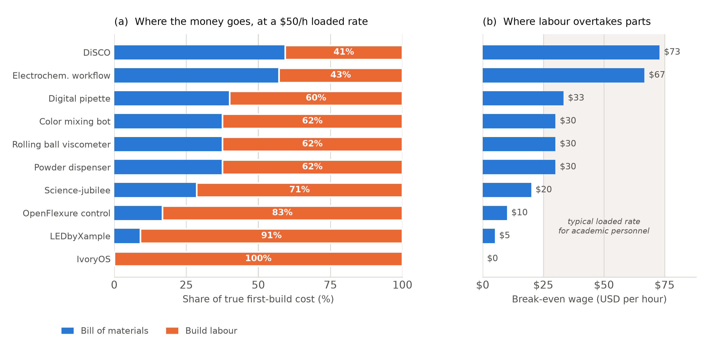
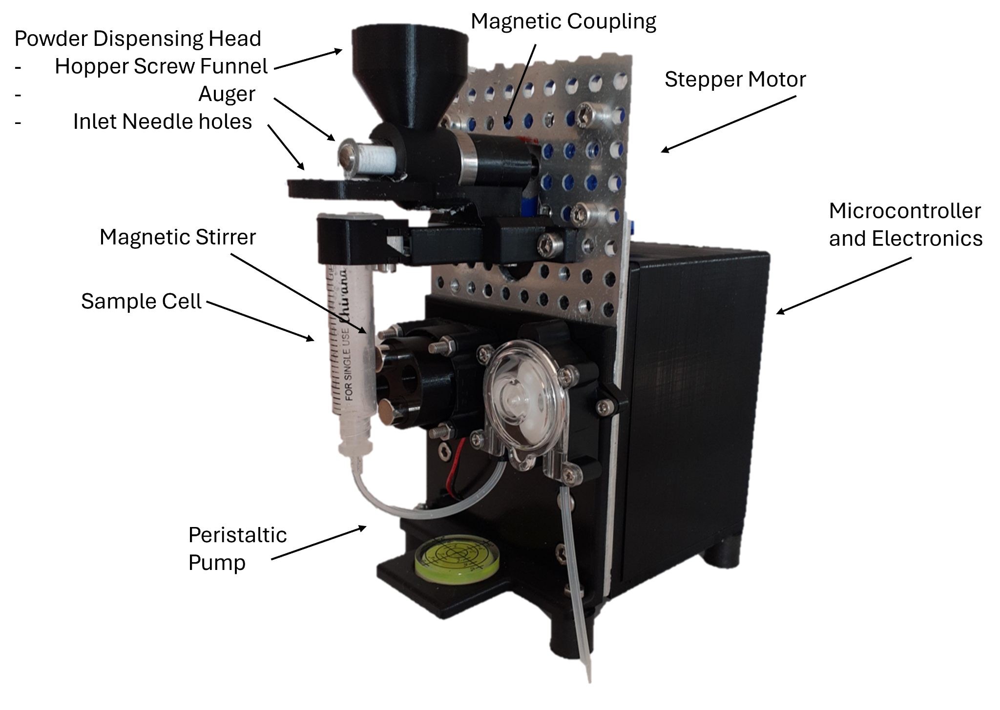
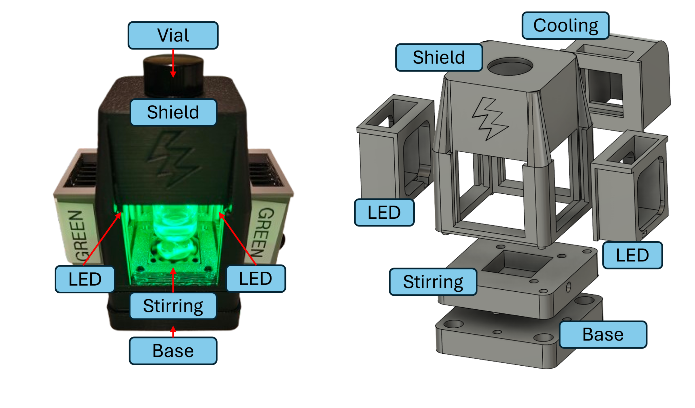
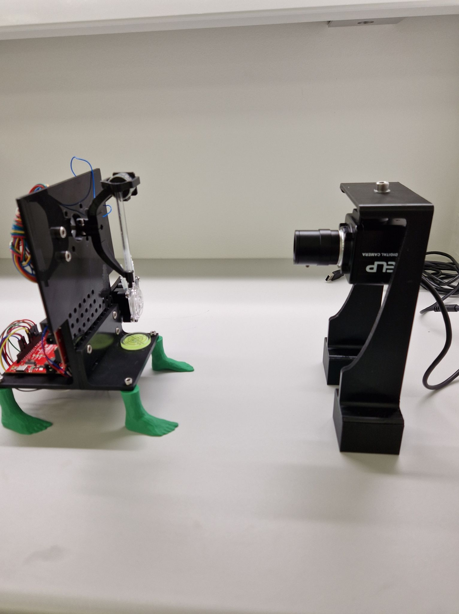
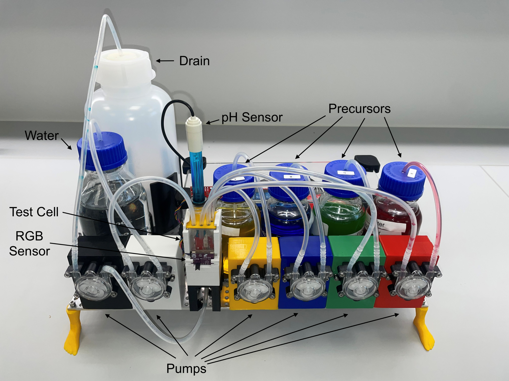
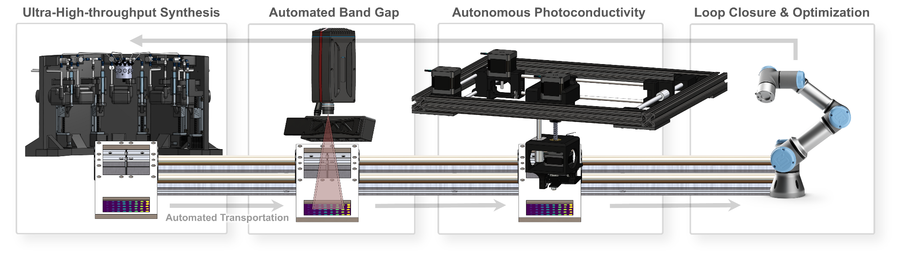
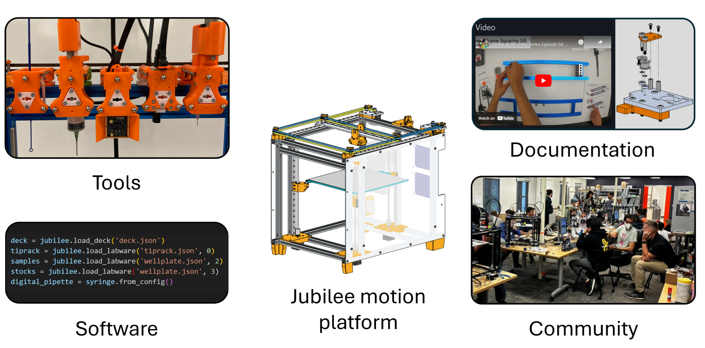
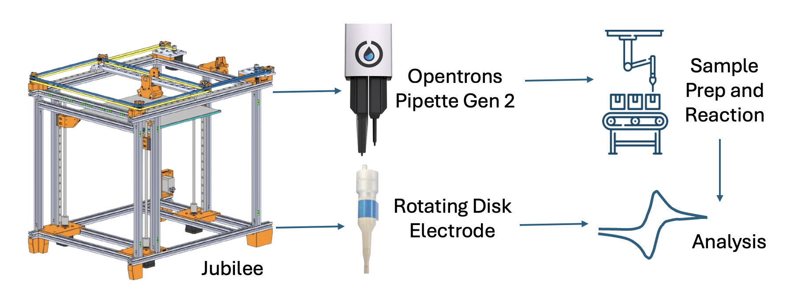
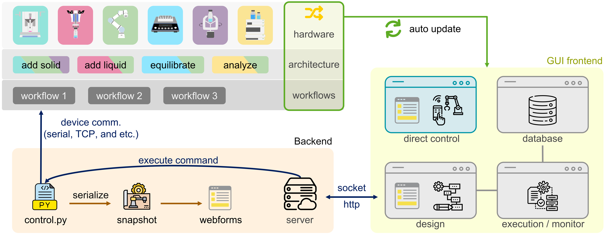

# Replication, not fabrication: documentation is the rate-limiting step for democratized self-driving labs

<!-- SIGN-OFF: ALL-6 (title). Ranked alternatives are in revision-notes-v2.md §2. -->

Brenden Pelkie1, Sterling G. Baird2,3,\*, Eunice Aissi4, Kenzo Aspuru-Takata3, Yang Cao3, Jin Hyun Chang5, Kshitij Gambhir5, Wm Salt Hale1, Lucy Hao6, Chance Hattrick3, Jason E. Hein3,6,7, Seth Leavitt2, Danli Luo1, Owen A. Melville3, Monique Ngan3, Louie Lucas Bisgaard Nyeland5, Nadya Peek1, Maria Politi6, Ethan Rajkumar3,6, Alexander E. Siemenn4, Blair Subbaraman1, Sonya Vasquez1, Jeffrey Watchorn3, Wenyu Zhang6, Rógvi Ziskason5, Lilo D. Pozzo1, Tonio Buonassisi4, Tejs Vegge5

1. University of Washington, Seattle, WA, USA
2. Department of Mechanical Engineering, Brigham Young University, Provo, UT, USA
3. Acceleration Consortium, University of Toronto, Toronto, ON, Canada
4. Massachusetts Institute of Technology, Cambridge, MA, USA
5. Technical University of Denmark, Kongens Lyngby, Denmark
6. University of British Columbia, Vancouver, BC, Canada
7. University of Bergen, Bergen, Norway

\* Corresponding author: Sterling G. Baird, sterling.baird@byu.edu

<!-- SIGN-OFF: SGB-1 (corresponding author line, e-mail, BYU-then-AC affiliation order).
     SIGN-OFF: SL-1 (Seth Leavitt's consent to authorship, affiliation at the time of the work, current contact).
     SIGN-OFF: ALL-2 (every author: full departmental address; RSC needs department, city, postcode, country).
     AUTHOR-LIST DECISIONS still open, carried over from v2 and NOT resolved here:
     (a) Sonya Vasquez had no affiliation superscript in v1; set to 1 (University of Washington), consistent with
         ref. 21. SIGN-OFF: NP-2.
     (b) Basita Das is credited as a DiSCO (P5) developer in Table 1 and is a co-author on refs 17-19, but has
         never been in the author list. SIGN-OFF: TB-2. Ask Basita Das and the P5 team before changing anything.
     (c) Ilya Yakavets is credited as a P7 developer in Table 1 but is not in the author list. SIGN-OFF: P7-3.
     (d) Author order: Seth Leavitt is inserted alphabetically in the contributor block, which is the least
         presumptuous position. SIGN-OFF: SGB-2 / BP-6. -->

## Abstract

We hypothesize that documentation, not hardware, is the rate-limiting step for democratizing self-driving labs (SDLs). The case for user-developed, openly shared laboratory automation is usually made on price. We argue that price is the wrong variable. Build labour, not the bill of materials, dominates the cost of a first build, so user-developed automation lowers the cost of access only when a design is replicated. A design is replicated only when its documentation can carry a new user through procurement, assembly, configuration, operation and troubleshooting. We test this hypothesis against ten user-developed automation projects contributed to the Democratizing Self-Driving Labs workshop at the 2024 Accelerate Conference. Before arguing any claim, we state for every project whether it supports, complicates or contradicts each of five sub-claims. The projects' own reported build costs and times give every one of them a break-even wage (the hourly rate at which build labour costs as much as the parts) of at most $73 per hour, with a median of $30 per hour. Median rebuild time is 17 hours. The exceptions are informative. Only two bespoke research platforms, each costing $20 000 or more, have break-even wages above $50 per hour. Three projects released no design files for more than two years after the workshop, so no one outside their developers could build them. A self-audit of the projects' public documentation finds troubleshooting guidance to be the scarcest capability. We conclude that funders, journals, institutions and builders should treat documentation as the primary deliverable of open laboratory hardware. We also set out where user-developed automation should give way to commercial instruments.

<!-- SIGN-OFF: TV-1 / P7-1. "Released no design files for more than two years after the workshop" is true as of
     2026-10-10 (verified; see revision-notes-v3.md §4). If work-in-progress repositories are published before
     submission, as the editor requires, the sentence stays true; §5 then switches to the variant in
     revision-notes-v3.md §5. -->

**Keywords:** self-driving labs, open hardware, laboratory automation, documentation, reproducibility, research software sustainability

---

## 1. Introduction: the hypothesis

Self-driving labs (SDLs) are gaining broad adoption throughout chemicals and materials research.1–3 These systems, also called autonomous experimentation platforms or materials acceleration platforms, combine automated experimentation with machine-learning-directed experimental design to optimize material properties or discover new materials. Building one means integrating sample preparation, sample characterization, active learning, data management and orchestration. Automating sample preparation and characterization accounts for much of that complexity,4 so many SDL implementations rely on commercial automation.5,6 Commercial SDLs have enabled important work. However, their expense and complexity put them out of reach for many scientists, and if they become the norm, SDLs risk becoming specialized equipment reserved for the best-resourced researchers.

The community's answer to this has been democratization, and the case for democratization is usually made on price. Reviews of low-cost SDLs promote "frugal twin" platforms that reproduce the function of expensive systems at a fraction of the capital cost.7 Recent work in this journal surveys how low-cost 3D printing can substitute for commercial laboratory automation.8 The implied argument is simple: commercial automation is expensive, user-developed automation has a small bill of materials, and so user-developed automation democratizes access.

**This Perspective tests a different hypothesis: documentation, not hardware, is the rate-limiting step for democratized SDLs.** The argument has three steps. First, the bill of materials is not the main cost of user-developed automation. Skilled human time is, and unlike a stepper motor, skilled time is scarce, expensive and not getting cheaper. Second, user-developed automation therefore lowers the cost of access only when a design built once is built again by others, because only then is the development labour amortized. Third, a design is built again only when its documentation can carry a stranger from an empty bench to a working instrument. If this hypothesis is right, the community has been optimizing the wrong variable. Effort spent making hardware cheaper buys little, and effort spent making it reproducible buys a great deal.

We can test the first step against data the community has already reported. Figure 1 uses the cost-to-reproduce and time-to-reproduce figures that the developers of the ten projects contributed to the Democratizing Self-Driving Labs workshop at the 2024 Accelerate Conference reported themselves. For each project we compute its *break-even wage*: the fully loaded hourly rate at which the cost of build labour equals the bill of materials. Every project in the sample has a break-even wage of at most $73/h, and the median is $30/h. Below a builder's break-even wage parts dominate the cost; above it labour does. A median of $30/h is comparable to or below the fully loaded cost of most people in a position to build these systems, so **for most user-developed automation, the parts are the cheap part.**

***Figure 1.*** *The true cost of a first build is dominated by labour, not parts.* **(a)** Composition of first-build cost for the ten contributed projects at a fully loaded rate of $50/h, ordered by break-even wage. Percentages give the labour share. **(b)** The break-even wage for each project: the hourly rate at which build labour costs as much as the bill of materials. The shaded band spans $25–75/h, a range covering plausible fully loaded costs from graduate researcher to professional automation engineer. Every project's break-even wage falls at or below the top of that band. Underlying values are the self-reported figures in Table 1; the derivation is given in Section 4, and the analysis code and outputs are provided in the ESI.

This is not an argument against democratization. It is an argument about where democratization comes from. If labour dominates first-build cost, user-developed automation does not reduce the cost of access by being cheap to build once. It reduces the cost **by being built once and reproduced many times.** The ten projects report a median rebuild time of 17 hours, whereas their contributors describe original development as running to hundreds or thousands of hours. That ratio, not the parts price, is where the democratizing leverage lies.

Replication, in turn, is not a property of hardware. A design does not replicate because its files are on the internet. It replicates when someone else can build it, which requires documentation covering five things: procurement, assembly, configuration, operation and troubleshooting. This is what the Open Source Hardware Association's definition is reaching for when it requires that a design be released "in such a way that anyone can make, modify, distribute, and use" it.9 A design that falls short of this has been published, but it has not been made reproducible.

The hypothesis breaks into five claims, each tested in its own section:

- **Claim 1.** User-developed automation is not, in general, a low-cost strategy at the point of first build: labour dominates the bill of materials at any realistic loaded rate. *Tested quantitatively against all ten projects' reported costs and times (Section 4).*
- **Claim 2.** The economics of user-developed automation close only on replication, and only a minority of projects reach that point. *Tested against the projects' replication record (Section 5).*
- **Claim 3.** Documentation, not hardware design, is the binding constraint on replication, and the academic incentive system does not pay for it. *Tested with a documentation self-audit of all ten projects (Section 6).*
- **Claim 4.** The binding skill constraint is not scientific or computational but mechanical and electrical: the "small stuff". *Tested against the difficulties the contributors reported (Section 7).*
- **Claim 5.** User-developed automation has real limits, and identifying them is part of taking it seriously. *Tested against the commercial–custom boundary each project drew (Section 8).*

Our evidence is ten projects contributed to a community workshop and described by the people who built them. Section 3 introduces them and, before any claim is argued, states in Table 2 which claim each project supports, complicates or contradicts. Each project description ends by saying what that project is evidence for. The projects that complicate our claims are the most informative ones in the sample, and we have kept them.

### Relation to existing work

This Perspective takes a position against the prevailing framing. Lo *et al.*'s review of low-cost SDLs7 and Doloi *et al.*'s survey of low-cost 3D printing for laboratory automation8 both catalogue what can be built cheaply, and both are valuable for that purpose. On the central question we disagree with both. We take the same class of artefacts and argue that their capital cost has little bearing on whether they democratize anything. Those works ask how cheaply something can be built. We ask what determines whether it is ever built a second time, and our answer is documentation. Our unit of analysis also differs: it is not the device but the project, including the labour, the documentation and the community around it.

Two strands of the open-hardware literature anticipate parts of this argument, and we build on both. Pearce's analysis of the return on investment in open scientific hardware locates the savings in digital replication by others rather than in the first build.101 That is our Claim 2, and our labour analysis adds the step that makes it bind: until a design is replicated, the developer's labour is a cost and not a saving. Bonvoisin *et al.* asked what the "source" of open-source hardware actually is, and found that projects publish very different subsets of the documentation a replicator needs.102 That is the premise of our Claim 3. What we add is a test of both ideas against a single community's projects, a quantitative statement of why the first build is the wrong place to look for savings, and an audit of our own documentation.

## 2. The workshop and the survey

Successful adoption of user-developed automation requires community involvement. To support it, we organized the "Democratizing Self-Driving Labs" workshop at the 2024 Accelerate Conference in Vancouver, BC. The workshop combined talks, discussions and demonstrations aimed at building community alignment around democratized automation. At its core was a showcase of 14 user-developed automation projects contributed by the community. They ranged from niche enhancements of existing tools to complete end-to-end pipelines, from hundreds to tens of thousands of dollars in cost, and from one-off solutions to widely deployed open hardware.

Ten of the 14 showcased projects are analysed here: those whose developers contributed a written description, with reproduction cost and time estimates, for this Perspective. The developers of the other four did not contribute one, so those four projects could not enter Table 1 or the analysis in Section 4.

<!-- SIGN-OFF: BP-1. The selection criterion above is the most likely one but has not been confirmed. Brenden
     must confirm or correct it. If the true criterion differs, rewrite the sentence; do not delete it. -->

During the workshop we also surveyed attendees on what the community needs to adopt democratized SDLs. Respondents (n = 58) ranked "developing low-cost SDL equipment and shared blueprints" as a top priority for advancing democratized SDLs, and over 70% said they were willing to publish hardware designs and related software. The survey items and the aggregate responses available to us are given in Supplementary Note S2.

<!-- SIGN-OFF: BP-2 / LDP-1. Supplementary Note S2 needs the instrument and full response distribution. If they
     cannot be recovered, use the fallback wording in sign-off-checklist.md (BP-2), which says so plainly.
     SIGN-OFF: BP-3 / LDP-1. Ethics/consent status of publishing aggregate survey results. -->

Two features of this result set up the rest of this Perspective. First, the community's stated priority is *equipment and blueprints*, that is, artefacts. Second, a large majority say they are willing to publish designs. Both fit the cost framing we argue against. They describe an intention to produce and release hardware, not an intention to make hardware reproducible. Section 6 shows what happened to that intention in our own sample.

## 3. The contributed projects, and what each one is evidence for

Table 1 summarizes the ten projects. Table 2 then states, in advance and for every project, which of the five claims it bears on and in which direction. We ask readers to hold us to Table 2. A Perspective that presents examples without saying what they are evidence for is a catalogue, and we do not offer these projects as a catalogue.

**Table 1. The ten contributed user-developed automation projects.** Cost and time to reproduce are as reported by each project's developers. Repository status, licence and archival deposits were checked on 2026-10-10; the evidence is in Supplementary Note S3.

| # | Project | Developers | Cost to reproduce (USD) | Time to reproduce | Design files and documentation |
| --- | --- | --- | --- | --- | --- |
| P1 | Powder dispensing module | Jin Hyun Chang, Kshitij Gambhir, Rógvi Ziskason, Louie Lucas Bisgaard Nyeland | $300 | 10 h | **[TO SUPPLY: work-in-progress repository, DTU team]** |
| P2 | LEDbyXample modular photoreactor | Owen A. Melville, Monique Ngan, Jeffrey Watchorn | $80–160 | 24 h | <https://github.com/owen-melville/photo-reactor> |
| P3 | Rolling ball viscometer | Jin Hyun Chang, Kshitij Gambhir, Rógvi Ziskason, Louie Lucas Bisgaard Nyeland | $300 | 10 h | **[TO SUPPLY: work-in-progress repository, DTU team]** |
| P4 | Color mixing bot | Jin Hyun Chang, Kshitij Gambhir, Rógvi Ziskason, Louie Lucas Bisgaard Nyeland | $300 | 10 h | <https://gitlab.com/auto_lab/47332-student-excercises> |
| P5 | DiSCO platform for photovoltaics synthesis and characterization | Alexander E. Siemenn, Eunice Aissi, Basita Das, Tonio Buonassisi | $30–40 K | 3 months | <https://github.com/PV-Lab/Archerfish>, <https://github.com/PV-Lab/SDCNN>, <https://github.com/PV-Lab/Autocharacterization-Bandgap> |
| P6 | Science-jubilee flexible automation platform | Brenden Pelkie, Maria Politi, Blair Subbaraman, Danli Luo, Nadya Peek, Sonya Vasquez, Wm Salt Hale | $2,000 | 100 h | <https://science-jubilee.readthedocs.io/> |
| P7 | Electrochemical workflow on science-jubilee | Yang Cao, Ethan Rajkumar, Ilya Yakavets | $20 K | 300 h | **[TO SUPPLY: work-in-progress repository, P7 team]** |
| P8 | Digital pipette Jubilee integration | Chance Hattrick, Sterling G. Baird | $100 | 3 h | **[TO SUPPLY: archival deposit, SGB]**† |
| P9 | Public control of an OpenFlexure microscope | Kenzo Aspuru-Takata, Sterling G. Baird | $300 (microscope) | 30 h (incl. microscope build) | <https://ac-training-lab.readthedocs.io/> |
| P10 | IvoryOS GUI control software | Wenyu Zhang, Lucy Hao, Jason E. Hein | $0 (software) | 0–1 h per new hardware integration | <https://gitlab.com/heingroup/ivoryos>; Zenodo [10.5281/zenodo.15272617](https://doi.org/10.5281/zenodo.15272617) |

† P8 is currently documented in two threads on the accelerated-discovery.org Discourse forum. Forum posts carry no persistent identifier and are not archival. By our own Claim 3 they do not count as documentation of a reproducible design, so we mark P8 accordingly instead of citing the threads.

<!-- SIGN-OFF: every team confirms its own Table 1 row (cost, time, developers, link): P1-P4 TV-1, P2 OM-1,
     P5 TB-1, P6 BP-7, P7 P7-1, P8/P9 SGB-7/SGB-8, P10 JEH-1. -->

**Table 2. How each project bears on each claim, stated before the claims are argued.** *S* = supports; *S⁻* = supports as a negative case (no public design files, so no replication was possible, which is what the claim predicts); *C* = complicates; *X* = contradicts; — = not informative. Criteria: for C1, S if the break-even wage (Table 3) is below $50/h and C if it is between $50 and $75/h (none exceeds $75/h). For C2 and C3, S requires that the project's replication or deployment beyond its developers is reported, either by them or in the literature. Every *C* is discussed in the section for that claim.

| Project | C1 cost | C2 replication | C3 documentation | C4 skills | C5 limits |
| --- | :---: | :---: | :---: | :---: | :---: |
| P1 Powder dispensing module | S | S⁻ | S⁻ | S | S |
| P2 LEDbyXample photoreactor | S | — | S | S | — |
| P3 Rolling ball viscometer | S | S⁻ | S⁻ | S | S |
| P4 Color mixing bot | S | — | S | S | — |
| P5 DiSCO platform | C | C | C | — | S |
| P6 Science-jubilee | S | S | S | S | S |
| P7 Electrochemical workflow | C | S⁻ | S⁻ | — | S |
| P8 Digital pipette integration | S | S | C | — | — |
| P9 OpenFlexure public control | S | S | S | S | — |
| P10 IvoryOS | S | S | S | C | — |

<!-- SIGN-OFF: SGB-9. v2 marked P1, P3 and P7 as X ("contradicts") on C2 and C3, but its own §5 text argued that
     they behave exactly as the claims predict. v3 relabels them S⁻ and states the criteria; see
     revision-notes-v3.md §3. P2 and P4 move from S to — on C2 pending replication counts from their teams
     (OM-2, TV-3): if either design has been built by anyone outside its developers, restore S.
     C4 marks rest on the contributors' collective report (§7); each team confirms its own C4 mark. -->

The descriptions below are condensed. The full descriptions as the developers contributed them, with complete build details, are given in Supplementary Note S1.

### Stand-alone tools

**P1: Powder dispensing module.** Solids handling, and powder dispensing in particular, is ubiquitous and hard to automate with useful precision. Commercial systems are accurate but expensive and inflexible. The existing open-hardware OpenTrickler10 did not meet the developers' material-compatibility or modularity requirements, and they also needed to mix the dispensed powder with an input liquid. The developers judged that high accuracy was not their binding criterion, because dispensed amounts can be adjusted and averaged over iterative optimization campaigns. They built a system in which a stepper motor drives a precision auger under feedback from an integrated balance. Powder is dispensed into a disposable syringe body, where a peristaltic pump mixes it with liquid, and a low-cost interchangeable dispensing head allows a dedicated head for each powder. *Evidence:* a $300 build whose 10 h reproduction time puts it on the labour side of the break-even line (C1). It made a deliberate accuracy-for-modularity trade (C5). With no design files public, it is one of the negative cases for C2 and C3.

***Figure 2.*** *Stand-alone powder dispensing module (P1).*

**P2: LEDbyXample modular photoreactor.** Intense light is common in crosslinking, photopolymerization and reaction-pathway work. LEDbyXample is an inexpensive modular photoreactor for integration with automated chemistry setups, built from simple parts on a 3D printed frame. Swappable light modules carrying ~1 W LEDs of specific wavelengths mount on heat sinks at the side of the reactor. A fan with magnets in the base provides magnetic stirring, and an active cooling module can be added. All modules are controlled by custom PCBs with a Raspberry Pi Pico and simple Python code. The developers wanted a system more flexible and cheaper than the open-hardware Wisconsin photoreactor11 and the budget commercial Pioreactor,12 with assembly simple enough that building it reinforces prototyping, 3D printing and microcontroller skills. Build documentation and a parts list are freely available. *Evidence:* the most labour-dominated hardware build in the sample, at 91% labour at $50/h (C1). It was designed to teach the mechanical and electrical skills of C4. Its public build documentation makes it a positive case for C3.

***Figure 3.*** *LEDbyXample modular photoreactor (P2).*

**P3: Rolling ball viscometer.** Complete rheological characterization requires large, expensive equipment and is difficult to automate, particularly sample loading and cleaning. Low-fidelity proxies are common in end-use applications, such as timing drainage from a perforated cup,13 and automated viscometry of Newtonian fluids has been demonstrated on pipetting robots by comparing set and actual dispense rates.14 This project applies the rolling-ball principle and Stokes' law. A sample is loaded into a clear tube, the tube is rotated so that a small ball rolls through the fluid, and a high-speed camera captures the ball's motion. The geometry permits automated loading and cleaning with peristaltic pumps. *Evidence:* an honest frugal instrument. It measures Newtonian viscosity and does not claim to be a rheometer (C5). It is labour-dominated at $50/h (C1), and like P1 it is a negative case for C2 and C3.

***Figure 4.*** *Rolling ball viscometer (P3). The tube assembly, left, is rotated so that a ball rolls through the loaded sample; the camera at right captures the ball's motion for the Stokes' law estimate of viscosity.*

<!-- SIGN-OFF: TV-2. Figure 4 was recovered from the DTU showcase slide deck (figures/source/dtu-modules-slides.pptx,
     slide 4), not supplied for publication. DTU confirms this view, or supplies another; CAD renders are in
     figures/source/. -->

### End-to-end automation systems

**P4: Color mixing bot.** Implementing an SDL demands hardware engineering, software development, data science, domain science and system-wide debugging, and no conventional degree programme teaches all of them together. Colour-matching experiments have become a standard entry point,15,16 because they require automated preparation, characterization, ML-based design and orchestration while staying visually legible and chemically safe. This project extends the classic demonstration with a second, pH-matching objective. Peristaltic pumps mix coloured and pH-adjusted stock solutions in a measuring chamber, an RGB sensor and a pH probe provide readout, and multi-objective Bayesian optimization learns the stock ratio that hits a target colour and pH. Its low cost, portability and absence of chemical or mechanical hazards suit it to teaching. *Evidence:* labour-dominated at $50/h (C1). It is built for teaching, which is what C4 calls for, and its public course repository makes it a positive case for C3.

***Figure 5.*** *Color mixing bot (P4).*

**P5: DiSCO materials synthesis and characterization system.** An SDL needs its components strung together with sample transfer and orchestration. Many builders use robotic arms to shuttle samples between workstations. This allows human-centric steps to be reused, but it caps throughput and brings in the cost and complexity of reliable robotics. DiSCO (Discovery, Synthesis, Characterization and Optimization) instead simplifies the physical integration itself. It targets high-dimensional materials search spaces such as perovskite semiconductor compositions, using high-throughput, low-fidelity screening to flag regions worth expensive follow-up. It integrates Archerfish combinatorial printing, extended to 10-dimensional rapid drop-cast synthesis,17 automated optical and contact-based characterization,18,19 and custom machine learning models for experimental control.20 All of these are arranged around a single linear rail, so that sample positioning reduces to reliable motion along one axis. The modules are open source apart from commercial components such as hyperspectral imagers. *Evidence:* the strongest complication in the sample. At $35,000 its parts outweigh its labour at $50/h (C1). It is valuable for capability rather than replication (C2), and its modules are published while the integrated platform has no build guide (C3). It also pairs commercial metrology with custom motion (C5).

***Figure 6.*** *DiSCO materials synthesis and characterization platform (P5).*

**P6: Science-jubilee.** Where DiSCO brings samples to tools, science-jubilee brings tools to samples. It is an automation ecosystem of three parts: open-hardware experimental tools, software modules that control them, and a community of contributing users. It builds on the Jubilee open-source tool-changing motion platform,21 which is assembled from a kit of common off-the-shelf parts and a few commercially available custom components, and adds tools and capabilities for experimental automation. Tool changing lets researchers run multi-step workflows without moving samples between locations or machines. A growing library of open-hardware tools covers liquid handling, imaging and sonication. A Python library provides a high-level programming interface, and documented tool and software interfaces make the platform extensible. The documentation describes building, provisioning and using the system step by step. The developers host workshops, run a Discord server and travel to demonstrate the platform. It has supported work ranging from sonochemical quantum dot synthesis to automated plant growth monitoring.22,23 *Evidence:* the positive control for the whole hypothesis. It has the most complete documentation in the sample and the most demonstrated replication, and its support infrastructure is the replication infrastructure Sections 5 and 6 call for.

***Figure 7.*** *Science-jubilee platform elements: the base Jubilee motion platform, science-specific tools, control software, documentation, and support for a community of users. Jubilee drawing licensed CC BY 4.0, from <https://jubilee3d.com/>.*

**P7: Electrochemical workflow for redox-active compounds.** This project uses science-jubilee as baseline infrastructure for a workflow spanning synthesis, isolation and characterization of redox-active compounds. An Opentrons OT-2 P300 pipette, driven through the science-jubilee adapter, handles liquids, and a custom tool is being developed to integrate a commercial BluRev rotating disk electrode for automated electrochemical characterization. The science-jubilee Python control software is used to program both synthesis, for example of metal–ligand coordination compounds, and characterization, such as cyclic voltammetry and kinetic analysis of redox events. The developers chose the platform for its extensibility, programmability and cost. Comparable workflows are possible on commercial platforms at substantially higher prices. *Evidence:* the second bespoke research platform whose parts outweigh labour at $50/h (C1). It is built around commercial metrology (C5). With no design files public, it is the third negative case for C2 and C3.

***Figure 8.*** *Electrochemical workflow for redox-active compounds (P7). The Jubilee motion platform carries an Opentrons Gen 2 pipette for sample preparation and reaction, and a BluRev rotating disk electrode, whose science-jubilee tool is still in development, for cyclic voltammetry and kinetic analysis of redox events.*

<!-- SIGN-OFF: P7-2. Figure 8 was recovered from the figure set submitted with the original showcase form. For v3 the
     institutional-logo strip was cropped and a spell-check underline removed; the original is
     figures/source/electrochemical-workflow-original-with-logos.png. The P7 team confirms the schematic is current. -->

**P8: Digital pipette integration for multiple platforms.** Integrating heterogeneous mounting, power and control connections is a recurring cost when SDLs are built from existing equipment. Devices with their own packaging, power and control are far easier to adopt. This project modified the Digital Pipette,24 a sub-$100 liquid handler with replaceable fluid-contacting parts and luer-lock fluidic connections, built from a self-contained linear servo actuator, a syringe and 3D printed frame parts. The modification lets it operate stand-alone. A 3D printed attachment mounts it on motion platforms such as science-jubilee or on robotic arms, and MQTT communication lets it work alongside other devices. The integration has been reproduced by several groups and science-jubilee users and is in active research use. *Evidence:* the clearest positive case for C2, a 3 h, $100 rebuild that others have made. It complicates C3, because it spread with only forum threads and direct help from its developers as documentation.

### Control and orchestration software

**P9: Public control of an OpenFlexure microscope.** Automation opens new modes of equipment use. Distributed experiments have already combined resources across continents,3,25 and SDLs run as user facilities will need distributed access. This project built a remote interface to the OpenFlexure microscope,26 a low-cost, programmable, open-source platform, and the programmability makes tasks such as large-area scans far more efficient. The interface uses MQTT to let users position the stage, focus and capture images through a Python interface. A credential-request system lets unrelated individuals take turns. It extends open-source microscope control software such as µManager27 by allowing remote, public control, which opens cloud experimentation for education or research to anyone with an internet connection. *Evidence:* it builds on one of the most widely replicated open scientific instruments and inherits its documentation-led model (C2, C3). Its build time is labour-dominated (C1).

**P10: IvoryOS.** Hardware capability alone will not democratize SDLs: reliable orchestration and control software is equally critical. SDL developers still commonly assemble control software from ad hoc scripts and notebooks. This gets a project started, but it imposes a steep learning curve on researchers without coding experience and causes problems of maintainability, extensibility and reproducibility. Several frameworks address this, including ChemIDE and 𝜒DL,28,29 AlabOS30 and ChemOS 2.0.31 Integrating with existing software is nonetheless hard, given how heterogeneous SDL components are, and changing research objectives make rigidly configured control software difficult to maintain. IvoryOS provides adaptable, easily integrated web interfaces to SDL platforms.32 It works as an extension to existing Python scripts. At start-up it inspects the platform's objects for their available methods and parameter requirements and updates the web GUI to match, so it imposes no framework or layout. The GUI also offers low-code workflow design, built-in iteration modes including high-throughput and adaptive experimentation, and a code-free interface for configuring optimization parameters and objectives. *Evidence:* the limiting case of replication, since software costs essentially nothing to copy (C2). It complicates C4, because it exists precisely because programming *is* a barrier for some researchers.

***Figure 9.*** *IvoryOS dynamically generated control interface (P10).*

---

## 4. Claim 1: user-developed automation is not, in general, low-cost

Most of the contributed projects cite lower cost than commercial alternatives as a motivation, and on bills of materials they are right: P2 at $80–160 and P8 at $100 sit one to two orders of magnitude below any commercial equivalent. But the bill of materials is not the cost of the project. It is the cost of the parts.

We can quantify the rest from Table 1, because Table 1 reports build *time* as well as build *cost*. The community routinely collects this column and then does not use it. Multiplying reported build hours by a fully loaded hourly rate gives a labour cost that can be compared directly with the bill of materials. Table 3 does this at $50/h. We state two conversions for transparency. Reported ranges are taken at their midpoint, so P2's "$80–160" enters as $120 and P10's "0–1 h" as 0.5 h. P5's "3 months" is read as 12 weeks at 40 h, or 480 h for one full-time equivalent.

**Table 3. Labour and materials in the true cost of a first build, at a fully loaded rate of $50/h.** The break-even wage is the rate at which labour cost equals the bill of materials; it does not depend on the assumed rate.

| Project | Bill of materials | Build hours | Labour @ $50/h | Labour share | Break-even wage |
| --- | ---: | ---: | ---: | ---: | ---: |
| P10 IvoryOS | $0 | 0.5 | $25 | 100% | $0/h |
| P2 LEDbyXample photoreactor | $120 | 24 | $1,200 | 91% | $5/h |
| P9 OpenFlexure public control | $300 | 30 | $1,500 | 83% | $10/h |
| P6 Science-jubilee | $2,000 | 100 | $5,000 | 71% | $20/h |
| P1 Powder dispensing module | $300 | 10 | $500 | 62% | $30/h |
| P3 Rolling ball viscometer | $300 | 10 | $500 | 62% | $30/h |
| P4 Color mixing bot | $300 | 10 | $500 | 62% | $30/h |
| P8 Digital pipette integration | $100 | 3 | $150 | 60% | $33/h |
| P7 Electrochemical workflow | $20,000 | 300 | $15,000 | 43% | $67/h |
| P5 DiSCO platform | $35,000 | 480 | $24,000 | 41% | $73/h |

The choice of $50/h is an assumption, and we would rather expose it than hide it. Table 4 gives the sensitivity.

**Table 4. Sensitivity of the conclusion to the assumed fully loaded rate.**

| Fully loaded rate | Projects where labour exceeds materials | Median labour share |
| --- | ---: | ---: |
| $25/h | 4 / 10 | 45% |
| $50/h | 8 / 10 | 62% |
| $75/h | 10 / 10 | 71% |

The rate-independent statistic is the break-even wage in the final column of Table 3, and it is the one we would ask readers to remember. Its median across the sample is $30/h and its maximum is $73/h. A researcher whose fully loaded cost exceeds $73/h spends more on labour than on parts for **every project in this sample**, including the $35,000 one. That group includes most staff engineers, many postdoctoral researchers once benefits and overhead are counted, and every principal investigator. Even at $25/h, the bottom of the band, labour exceeds parts for four of the ten.

**Two projects complicate this claim, and they are informative.** P5 (DiSCO) and P7 (the electrochemical workflow) are the only projects where the bill of materials dominates at $50/h, at 59% and 57% of first-build cost respectively. Both are bespoke research platforms with genuinely expensive components (hyperspectral imagers, a commercial rotating disk electrode), and neither can plausibly be called a low-cost build. They matter because they mark the boundary of the population the "frugal twin" framing7 actually describes. Excluding software, the ten projects' bills of materials span nearly three orders of magnitude, from $100 to $35,000, and treating that range as one phenomenon is a mistake. There are at least two populations here. The first is sub-$500 single-function or teaching tools, where the frugal-twin framing holds and labour overwhelmingly dominates. The second is bespoke research platforms costing $20,000 or more, where the framing does not apply and user development is chosen for capability and control, not price. Democratization arguments that quietly generalize from the first population to the second are unsound.

Table 3 also understates the asymmetry. The hours in Table 1 are *reproduction* hours: the time a competent builder needs to rebuild an existing design. Original development takes far longer; contributors described efforts running to hundreds or thousands of hours. The labour share of a first build is therefore higher than Table 3 shows, in some cases by more than an order of magnitude. Table 3 is a conservative statement of Claim 1.

None of this means the time is wasted. Researchers who invest in designing and building SDLs are better able to troubleshoot, modify and extend their platforms independently, and that capability has real and lasting value. But it is a training investment and should be argued for as one. It is not a saving on capital expenditure. Presenting it as one invites a disappointment that, when it comes, damages the case for democratization.

## 5. Claim 2: the economics close only on replication

If a first build costs more in labour than in parts, when does user-developed automation ever reduce the cost of access? On the second build, and on every build after that.

The replication numbers in Table 1 are strikingly good. The median time to reproduce across the ten projects is 17 hours. Eight of the ten can be reproduced in 100 hours or less, and five in 10 hours or less. Compared with original development efforts of hundreds to thousands of hours, that is leverage of a factor of tens to hundreds, but only for designs that someone actually reproduces. This is the mechanism Pearce identified in estimating the return on public investment in open scientific hardware: the savings are realized by replicators, not by the original developer.101 **The value of user-developed automation lies almost entirely in amortization, and amortization requires replicas.**

P8, the Digital pipette integration, is the clearest positive case in the sample. It is a 3-hour, $100 rebuild that several groups have in fact reproduced, and it is in active research use in labs that did not develop it. Its total value to the community is a large multiple of its development cost precisely because replication is so cheap. P6, science-jubilee, makes the same point at larger scale and shows what produces the outcome: step-by-step build, provisioning and usage documentation, a Discord server for direct support, workshops, and travel to demonstrate the platform. None of that is hardware engineering. All of it is replication infrastructure. P10, IvoryOS, is the limiting case. It is software, so replication costs essentially nothing, and the reported effort to integrate new hardware is under an hour.

**Three projects are negative cases, and they are the most uncomfortable entries in Table 2.** P1, P3 and P7 had no public design files when this Perspective was first submitted, and as of this writing, more than two years after the workshop, they still have none. P1 and P3 are both economical, well-conceived instruments that solve real problems. Whatever their technical merit, all three have been replicated zero times, and their replication cost is effectively infinite, because a stranger cannot begin. These are not counterexamples to Claim 2. They are what Claim 2 predicts for any design that is never released, and by the argument of this section their contribution to democratized SDLs so far is nil. We include this assessment of our own contributors' work because a Perspective that exempted itself from its own thesis would not be worth publishing. These cases are also weaker evidence than the positive ones, because failure to replicate has other possible explanations, such as a narrow user base or a design still in development. We return to this in Section 9.

<!-- SIGN-OFF: TV-1 / P7-1. True as of 2026-10-10. If WIP repositories exist at submission, replace this paragraph
     with the variant in revision-notes-v3.md §5 (same argument, updated facts). -->

P5 complicates the claim differently. DiSCO's modules are open source, but the platform is a bespoke integration around a specific linear-rail architecture for a specific class of materials problem. It is unlikely to be reproduced whole by anyone, and it is not obvious that it should be. Its contribution to democratization lies in its modules and its architectural argument, not in the platform. The distinction between projects designed to be replicated and projects designed to be learned from is one the field would benefit from making explicit, and it should determine what documentation each type owes.

## 6. Claim 3: without documentation there is no open hardware

Claims 1 and 2 together imply that the binding constraint on democratized SDLs is whatever determines replication. We argue that the constraint is documentation.

For other researchers to adopt it, automation infrastructure needs documentation that thoroughly describes how to **procure, build, configure, run and troubleshoot** the system. Sharing CAD files and a parts list is not enough to enable a new user. In her closing keynote at Accelerate 2024, Nadya Peek described documentation as mandatory for open-source hardware. For hardware, she argued, documentation *is* the source: it is how a new user turns a box of screws and a spool of filament into a working part of their automation ecosystem. Without documentation there is no open hardware, only published hardware. The OSHWA definition requires the same thing in substance,9 Bonvoisin *et al.* found that open-hardware projects meet it very unevenly,102 and our field applies it to itself unevenly at best.

<!-- SIGN-OFF: NP-1. Nadya Peek confirms the paraphrase of her keynote. -->

Table 5 audits our own ten projects against the five capabilities, plus the licence that the OSHWA definition makes a precondition of open hardware. We are not aware of another Perspective in this area that audits its own exemplars, and we think that omission is part of the problem. Every cell is tied to a specific public resource in Supplementary Note S3, so readers can check our scoring.

**Table 5. Documentation self-audit against the five capabilities a replicator needs, plus licensing.** ● complete · ◐ partial · ○ absent · n/a not applicable. Assessed from public resources on 2026-10-10; evidence for every cell is in Supplementary Note S3.

| Project | Procure | Build | Configure | Run | Troubleshoot | Licence |
| --- | :---: | :---: | :---: | :---: | :---: | :---: |
| P1 Powder dispensing module | ○ | ○ | ○ | ○ | ○ | — |
| P2 LEDbyXample photoreactor | ● | ● | ◐ | ◐ | ○ | none |
| P3 Rolling ball viscometer | ○ | ○ | ○ | ○ | ○ | — |
| P4 Color mixing bot | ◐ | ◐ | ◐ | ● | ○ | none |
| P5 DiSCO platform | ○ | ○ | ◐ | ● | ○ | Apache-2.0 / MIT |
| P6 Science-jubilee | ● | ● | ● | ● | ◐ | MIT |
| P7 Electrochemical workflow | ○ | ○ | ○ | ○ | ○ | — |
| P8 Digital pipette integration | ◐ | ◐ | ◐ | ◐ | ○ | — |
| P9 OpenFlexure public control | ◐ | ◐ | ● | ● | ◐ | MIT |
| P10 IvoryOS | n/a | n/a | ● | ● | ◐ | MIT |

<!-- SIGN-OFF: every team consents to its own row being published (TV-4, OM-3, TB-3, BP-8, P7-4, SGB-10, JEH-2).
     This is a collective self-audit the contributors agree to, not a grading of colleagues. If a team objects,
     remove the row and say so in the caption; do not soften the scores. -->

The pattern is consistent and uncomfortable. Only one project of ten, science-jubilee, is complete or nearly complete across all five capabilities, and it is also the project with by far the most demonstrated replication. Troubleshooting documentation is the weakest column by a wide margin. It is the capability that most determines whether a frustrated new user succeeds or abandons a build, and nowhere in the sample is it more than partial; where it exists at all, it lives in a support channel rather than in written guidance. Two of the four public hardware repositories carry no licence, which means that under default copyright a replicator has no permission to build from them. Three projects are empty rows.

<!-- SIGN-OFF: OM-4 / TV-5. If P2 or P4 add a licence before submission, update the Licence column and drop
     the licence sentence above. That is the better outcome, and it takes minutes. -->

This is not a story about careless researchers. Every contributor here is a capable scientist in a well-resourced group, and every one of them wanted their work to be used. Documentation is simply expensive. It takes substantial effort to prepare, continuing effort to keep current, and ongoing direct support for new users. It is also almost entirely unrewarded in the current system. It does not count in a publication record, it is not a fundable deliverable in most schemes, it does not appear in a tenure case, and graduating students are not examined on it. When a group's marginal hour can go into a paper or into a troubleshooting guide, the incentives point one way. Our own sample shows what those incentives produce even among people who convened specifically to advance open hardware. Recall from Section 2 that over 70% of surveyed attendees said they were willing to publish designs. Willingness is not the constraint. Reward is.

The implications are concrete, and we state them as obligations rather than aspirations:

- **Funders** should treat documentation and user support as fundable, reportable deliverables with named effort attached, not as unfunded overhead on an instrumentation grant. A hardware development award that does not budget for documentation is buying an artefact, not a capability.
- **Journals**, including this one, should require hardware papers and Perspectives to state which of the five capabilities their supporting materials cover, as data availability statements are now required. The bar should be a description of what exists, not a promise. Article formats that publish updates to existing hardware and code, such as this journal's Commit articles,103 give documentation work a citable home and deserve wider use.
- **Institutions and hiring committees** should count sustained, used documentation as scholarly output. It has more in common with a methods paper than with a README.
- **Builders** should deposit their designs archivally with a persistent identifier from the first release (for example a Zenodo DOI minted from the repository, not a forum thread), choose an open licence at the same moment, and treat troubleshooting notes as a first-class artefact recorded during the build rather than reconstructed afterwards.
- **The community** should build shared documentation infrastructure: templates for the five capabilities, building on existing documentation standards for open hardware,104 a hosting venue that does not decay, and review so that someone other than its author assesses documentation quality.

We hold this Perspective to the fourth obligation. Every project in Table 1 has a public repository at submission, and every project will have an archival deposit with a persistent identifier by publication.

<!-- SIGN-OFF: ALL teams (TV-6, OM-5, TB-4, BP-9, P7-5, SGB-11, JEH-3). This sentence commits ten teams. It must not
     be submitted until every team has agreed and every repository exists. If a project cannot meet it, remove
     that project from Table 1 rather than weaken the sentence (revision-notes-v3.md §5 lists what then changes). -->

## 7. Claim 4: the binding skill constraint is the small stuff

Contributors reported remarkably similar development difficulties, and the pattern is not the one the field usually assumes.

Building automation equipment requires fluency in mechanical design and fabrication, electronics assembly and software configuration. With notable exceptions, the projects presented were built by chemists and materials scientists rather than by mechanical or electrical engineers. Contributors reported friction with all three skills and frustration that seemingly trivial tasks held up progress. What they did *not* widely report is instructive. Complex, application-specific design problems were largely not the blocker, and neither was programming. The blockers were wire crimping, connector selection, tolerance and fit in printed parts, and power supply selection: the small stuff.

<!-- SIGN-OFF: ALL teams. Each team confirms that the difficulties described here match what it reported; the C4 marks
     in Table 2 depend on it. -->

We hypothesize that programming was not a barrier because Python coursework has spread through science curricula over the past five to ten years. Two decades ago, "the students cannot program" would have been the obvious first-order constraint on this kind of work. Today it is not. That is a genuine success, and it is a success of curriculum rather than of tooling. If it can be done for programming, it can be done for the small stuff.

The prescription is therefore concrete. What is needed is not a degree programme but a short, standard, shareable curriculum module of roughly 20 contact hours. It would cover crimping and connectorization, including which connector families to use and why; DC power supply selection, current budgeting and protection; reading a datasheet; basic tolerance and fit for 3D printed mechanical parts; fastener and bearing selection; safe practice for mains-adjacent wiring; and structured debugging of a mixed electromechanical system. Every item is teachable, none requires an engineering degree, and each corresponds to friction our contributors reported. P2 and P4 already point this way: both were designed in part to teach these skills. We encourage the community to develop and share such a module in the same open, replicable manner we argue for elsewhere in this Perspective, and to document it accordingly.

P10 complicates this claim, as it should. IvoryOS exists precisely because programmatic control of SDLs *is* a barrier for researchers without coding experience. The two observations fit together once we note that our contributors are a selected population. People who had already built enough automation to present it at a workshop have, by construction, cleared the programming hurdle. The barrier IvoryOS addresses is real; it sits earlier in the pipeline than our sample can see. That is a limitation of our evidence, not a refutation of the tool.

## 8. Claim 5: the limits of user-developed automation

Taking user-developed automation seriously means being clear about where it should stop.

Automation involving hazardous conditions or components, such as high pressures, X-ray sources, high-voltage systems, or pyrophoric or highly toxic reagents, should not be built in an ad hoc manner. The failure modes are severe, the relevant engineering standards exist for good reason, and the review processes that come with commercial equipment are part of what the buyer pays for. Contributors also reported non-technical friction here, including lengthy Environmental Health and Safety clearance for new systems. That friction is often appropriate. The answer is to engage with it early, not to route around it.

Similarly, systems that need fabrication tolerances or metrological validation that are not widely available (specialized spectroscopy, calibrated reference instruments, anything whose output must be traceable) are usually better bought commercially. P3, the rolling ball viscometer, illustrates the honest version of this trade. It measures Newtonian viscosity via Stokes' law, which is a genuine capability at a fraction of the cost, but it is not a rheometer, and presenting it as one would be a category error. P1 makes the same trade explicitly, accepting lower dispensing accuracy in exchange for modularity and cost because iterative optimization tolerates it. Stating the trade plainly is what distinguishes a defensible frugal instrument from an indefensible one.

The most productive configuration is usually hybrid, and our sample shows it repeatedly. P6 integrates a commercial pipettor for low-cost, high-precision liquid handling. P5 pairs an off-the-shelf hyperspectral imager with a custom motion system. P7 is built around a commercial rotating disk electrode. In each case the commercial component supplies validated metrology and the user-developed component supplies integration, flexibility and control. This is not a compromise between two philosophies. It is what a well-designed system looks like.

That gives the community a specific request to make of vendors: modular designs, documented and stable programming interfaces, published mechanical and electrical interface specifications, and documentation to the standard we demand of ourselves in Section 6. A vendor that ships an instrument with a documented API and a mechanical interface drawing captures the user-developed ecosystem around its product rather than competing with it. We would rather buy from such vendors, and we encourage funders and procurement offices to weight these attributes explicitly.

## 9. Limitations

Our evidence has real weaknesses, and the argument should be read with them in view.

The sample is ten self-selected projects from a single workshop at a single conference, described by the people who built them. Cost and time figures are self-reported, were not independently verified, and were produced without a common estimation protocol, so contributors may reasonably have counted different things as build time. The ten were drawn from 14 presented, on the criterion stated in Section 2. The sample is weighted towards North American and Northern European groups at well-resourced institutions. This almost certainly understates the barriers faced elsewhere, and it may distort the labour-rate argument in either direction: labour is cheaper in absolute terms in many settings, but so is the opportunity cost of the alternative.

The labour analysis treats reported build time as a proxy for labour cost at a single loaded rate. Table 4 gives the sensitivity, and the break-even wage in Table 3 removes the rate assumption entirely. Neither addresses the deeper issue that some of these hours are training and some are pure overhead, and the two have very different value. We have not attempted to separate them, and a study that did would sharpen Claim 1 considerably.

The negative cases in Section 5 show that undocumented projects were not replicated. They do not show that documentation alone would have caused replication. Demand, the size of the potential user base and the maturity of a design all plausibly matter too. A stronger test of Claim 3 would follow documented and undocumented designs of comparable demand over time, and we would welcome it.

The survey (n = 58) is a convenience sample of workshop attendees, people who had already chosen to spend a conference session on democratized automation, and its results should not be read as representative of the wider SDL community.

Finally, the documentation audit in Table 5 is an assessment of the co-authors' own projects by the co-authors. That cuts both ways: we have unusually good information about these projects, and an obvious interest in how they appear. We have tried to offset the second by tying every score to a public resource (Supplementary Note S3).

## 10. Outlook

The community that convened at Accelerate 2024 has the technical capability it needs. Ten teams built ten working systems whose costs span nearly three orders of magnitude, and the binding constraint on their collective impact turns out not to be anything the field usually optimizes. It is not the price of parts, which is already low and falling. It is not programming ability, which a decade of curriculum reform has largely solved. It is whether the eleventh team can build the twelfth copy, and that is determined by documentation, community support and archival deposit, none of which the academic reward system currently pays for.

That is an unusually tractable problem. Documentation standards can be written, and templates can be shared. Funders can budget for support effort, journals can require capability statements, and committees can learn to count a well-maintained build guide as the scholarly contribution it is. None of this requires new science, and all of it is cheaper than the hardware.

There is no single right way to build an SDL, as the variety in this workshop demonstrates. But SDL builders face substantially the same problems and currently solve them in isolation. They share polished capabilities and scientific results while the hard-won knowledge of how the system was actually made goes unpublished. Online forums provide nascent spaces for this exchange33,34 and more are needed. This workshop provided one in person, where builders could see platforms running, trade advice and show their work to an audience that cared about it.

Building SDLs is hard. Building them so that someone else can build them again is harder, and it is the part that democratizes anything. That is where the community's effort should go.

---

## Data availability

The analysis underlying Figure 1 and Tables 3 and 4 uses only the self-reported figures in Table 1. The analysis script (`labor_cost_analysis.py`), the derived per-project values (`table1-derived.csv`) and the full rate-sensitivity sweep (`sensitivity.csv`) are provided as ESI and archived at Zenodo, **[TO SUPPLY: DOI, SGB]**. The evidence behind every cell of Table 5 is given in Supplementary Note S3, and the project descriptions as contributed are given in Supplementary Note S1.

Design files and documentation for the contributed projects are listed in Table 1.

The survey items and aggregate results are provided as Supplementary Note S2.

<!-- SIGN-OFF: SGB-4. Mint the Zenodo DOI for the analysis folder from the final commit. A ready .zenodo.json is
     in analysis/; see sign-off-checklist.md. -->

## Author contributions

Using the CRediT taxonomy. **BP**: conceptualization, data curation (compilation and organization of the project contributions), writing – original draft (original submission), writing – review and editing. **SGB**: conceptualization, formal analysis (labour-cost analysis and documentation audit), project administration and supervision (revision), writing – original draft (revision), writing – review and editing. **SL**: conceptualization (revised argument), project administration (coordination of the revision, August–September 2026), writing – review and editing. **LDP, TV, TB**: conceptualization, writing – review and editing. **All other authors**: investigation (contribution of project descriptions and reproduction cost and time estimates), writing – review and editing.

<!-- SIGN-OFF: SGB-3, SL-1, BP-6 and ALL-3. Every author confirms their own roles. -->

## Conflicts of interest

There are no conflicts to declare.

<!-- SIGN-OFF: ALL-4. Every author re-confirms; anything new since 2024 (e.g. commercial sales of kits or
     instruments described here) must be declared. -->

## Use of generative AI

The restructured text of this revision, the labour-cost analysis code and the documentation audit were drafted with the assistance of a large language model (Claude, Anthropic), working at the direction of S. G. B. and S. L. in a version-controlled repository. Every bibliographic reference was checked against Crossref, and every repository, licence and deposit cited in Tables 1 and 5 was checked against the live resource. The authors reviewed, edited and verified all AI-assisted content and take full responsibility for the content of this article.

<!-- SIGN-OFF: SGB-3. Placement and wording to match RSC policy; see revision-notes-v3.md §6. -->

## Acknowledgements

We thank the attendees of the Democratizing Self-Driving Labs workshop at Accelerate 2024 for their participation and survey responses.

- Wenyu Zhang, Lucy Hao and Jason Hein acknowledge Canada Foundation for Innovation (CFI-35833), Natural Sciences and Engineering Research Council of Canada (RGPIN-2021-03168, Discovery Accelerator), and the University of British Columbia.
- Jin Hyun Chang and Tejs Vegge acknowledge Pioneer Center for Accelerating P2X Materials Discovery (CAPeX), DNRF grant number P3.
- Tejs Vegge acknowledges support from the European Union's Horizon 2020 research and innovation programme under grant agreement no. 957189 (BIG-MAP).
- Owen A. Melville, Monique Ngan, Jeffrey Watchorn, Yang Cao, Jason Hein, Wenyu Zhang and Lucy Hao acknowledge support provided to the University of Toronto's Acceleration Consortium from the Canada First Research Excellence Fund (CFREF-2022-00042).
- Lilo Pozzo acknowledges support from NSF POSE grant TIP-2229018 and NSF PREM grant DMR-2424949.

<!-- SIGN-OFF: ALL-5. The funding list is v1's, unchanged. Known gaps: no line for Sterling G. Baird, Chance
     Hattrick, Kenzo Aspuru-Takata or Ethan Rajkumar (Acceleration Consortium, plausibly CFREF-2022-00042; SGB-6),
     none for MIT (TB-5), none for most UW authors (BP-10/NP-3), none for BYU (SGB-6). Each author supplies or
     confirms their own line. -->

## References

1. Rupnow, C. C.; MacLeod, B. P.; Mokhtari, M.; Ocean, K.; Dettelbach, K. E.; Lin, D.; Parlane, F. G. L.; Chiu, H. N.; Rooney, M. B.; Waizenegger, C. E. B.; de Hoog, E. I.; Soni, A.; Berlinguette, C. P. A Self-Driving Laboratory Optimizes a Scalable Process for Making Functional Coatings. *Cell Rep. Phys. Sci.* **2023**, *4* (5), 101411. https://doi.org/10.1016/j.xcrp.2023.101411.
2. Bennett, J. A.; Orouji, N.; Khan, M.; Sadeghi, S.; Rodgers, J.; Abolhasani, M. Autonomous Reaction Pareto-Front Mapping with a Self-Driving Catalysis Laboratory. *Nat. Chem. Eng.* **2024**, *1* (3), 240–250. https://doi.org/10.1038/s44286-024-00033-5.
3. Strieth-Kalthoff, F.; Hao, H.; Rathore, V.; Derasp, J.; Gaudin, T.; Angello, N. H.; Seifrid, M.; Trushina, E.; Guy, M.; Liu, J.; Tang, X.; Mamada, M.; Wang, W.; Tsagaantsooj, T.; Lavigne, C.; Pollice, R.; Wu, T. C.; Hotta, K.; Bodo, L.; Li, S.; Haddadnia, M.; Wołos, A.; Roszak, R.; Ser, C. T.; Bozal-Ginesta, C.; Hickman, R. J.; Vestfrid, J.; Aguilar-Granda, A.; Klimareva, E. L.; Sigerson, R. C.; Hou, W.; Gahler, D.; Lach, S.; Warzybok, A.; Borodin, O.; Rohrbach, S.; Sanchez-Lengeling, B.; Adachi, C.; Grzybowski, B. A.; Cronin, L.; Hein, J. E.; Burke, M. D.; Aspuru-Guzik, A. Delocalized, Asynchronous, Closed-Loop Discovery of Organic Laser Emitters. *Science* **2024**, *384* (6697), eadk9227. https://doi.org/10.1126/science.adk9227.
4. Christensen, M.; Yunker, L. P. E.; Shiri, P.; Zepel, T.; Prieto, P. L.; Grunert, S.; Bork, F.; Hein, J. E. Automation Isn't Automatic. *Chem. Sci.* **2021**, *12* (47), 15473–15490. https://doi.org/10.1039/D1SC04588A.
5. Vescovi, R.; Ginsburg, T.; Hippe, K.; Ozgulbas, D.; Stone, C.; Stroka, A.; Butler, R.; Blaiszik, B.; Brettin, T.; Chard, K.; Hereld, M.; Ramanathan, A.; Stevens, R.; Vriza, A.; Xu, J.; Zhang, Q.; Foster, I. Towards a Modular Architecture for Science Factories. *Digit. Discov.* **2023**, *2* (6), 1980–1998. https://doi.org/10.1039/D3DD00142C.
6. Szymanski, N. J.; Rendy, B.; Fei, Y.; Kumar, R. E.; He, T.; Milsted, D.; McDermott, M. J.; Gallant, M.; Cubuk, E. D.; Merchant, A.; Kim, H.; Jain, A.; Bartel, C. J.; Persson, K.; Zeng, Y.; Ceder, G. An Autonomous Laboratory for the Accelerated Synthesis of Novel Materials. *Nature* **2023**, *624* (7990), 86–91. https://doi.org/10.1038/s41586-023-06734-w.
7. Lo, S.; Baird, S. G.; Schrier, J.; Blaiszik, B.; Carson, N.; Foster, I.; Aguilar-Granda, A.; Kalinin, S. V.; Maruyama, B.; Politi, M.; Tran, H.; Sparks, T. D.; Aspuru-Guzik, A. Review of Low-Cost Self-Driving Laboratories in Chemistry and Materials Science: The "Frugal Twin" Concept. *Digit. Discov.* **2024**, *3* (5), 842–868. https://doi.org/10.1039/D3DD00223C.
8. Doloi, S.; Das, M.; Li, Y.; Cho, Z. H.; Xiao, X.; Hanna, J. V.; Osvaldo, M.; Ng Wei Tat, L. Democratizing Self-Driving Labs: Advances in Low-Cost 3D Printing for Laboratory Automation. *Digit. Discov.* **2025**, *4* (7), 1685–1721. https://doi.org/10.1039/D4DD00411F.
9. Open Source Hardware Association. Open Source Hardware (OSHW) Definition 1.0. https://www.oshwa.org/definition/ (accessed 2026-10-10).
10. Bao, R. eamars/OpenTrickler, 2024. https://github.com/eamars/OpenTrickler (accessed 2026-10-10).
11. Lampkin, P. P.; Thompson, B. J.; Gellman, S. H. Versatile Open-Source Photoreactor Architecture for Photocatalysis Across the Visible Spectrum. *Org. Lett.* **2021**, *23* (13), 5277–5281. https://doi.org/10.1021/acs.orglett.1c01910.
12. Pioreactor. https://pioreactor.com/ (accessed 2026-10-10).
13. ASTM International. *Standard Test Method for Viscosity by Ford Viscosity Cup*, ASTM D1200-10(2018). https://www.astm.org/d1200-10r18.html (accessed 2026-10-10).
14. Soh, B. W.; Chitre, A.; Lee, W. Y.; Bash, D.; Kumar, J. N.; Hippalgaonkar, K. Automated Pipetting Robot for Proxy High-Throughput Viscometry of Newtonian Fluids. *Digit. Discov.* **2023**, *2* (2), 481–488. https://doi.org/10.1039/D2DD00126H.
15. Ginsburg, T.; Hippe, K.; Lewis, R.; Cleary, A.; Ozgulbas, D.; Butler, R.; Stone, C.; Stroka, A.; Vescovi, R.; Foster, I. Exploring Benchmarks for Self-Driving Labs Using Color Matching. In *Proceedings of the SC '23 Workshops of the International Conference on High Performance Computing, Network, Storage, and Analysis*; ACM: New York, NY, USA, 2023; pp 2147–2152. https://doi.org/10.1145/3624062.3624615.
16. Baird, S. G.; Sparks, T. D. Building a "Hello World" for Self-Driving Labs: The Closed-Loop Spectroscopy Lab Light-Mixing Demo. *STAR Protoc.* **2023**, *4* (2), 102329. https://doi.org/10.1016/j.xpro.2023.102329.
17. Siemenn, A. E.; Das, B.; Aissi, E.; Sheng, F.; Elliott, L.; Hudspeth, B.; Meyers, M.; Serdy, J.; Buonassisi, T. Archerfish: A Retrofitted 3D Printer for High-Throughput Combinatorial Experimentation via Continuous Printing. *Digit. Discov.* **2025**, *4* (4), 896–909. https://doi.org/10.1039/D4DD00249K.
18. Siemenn, A. E.; Aissi, E.; Sheng, F.; Tiihonen, A.; Kavak, H.; Das, B.; Buonassisi, T. Using Scalable Computer Vision to Automate High-Throughput Semiconductor Characterization. *Nat. Commun.* **2024**, *15* (1), 4654. https://doi.org/10.1038/s41467-024-48768-2.
19. Siemenn, A. E.; Das, B.; Ji, K.; Sheng, F.; Buonassisi, T. A Self-Supervised Robotic System for Autonomous Contact-Based Spatial Mapping of Semiconductor Properties. *Sci. Adv.* **2025**, *11* (27), eadw7071. https://doi.org/10.1126/sciadv.adw7071.
20. Siemenn, A. E.; Ren, Z.; Li, Q.; Buonassisi, T. Fast Bayesian Optimization of Needle-in-a-Haystack Problems Using Zooming Memory-Based Initialization (ZoMBI). *npj Comput. Mater.* **2023**, *9* (1), 79. https://doi.org/10.1038/s41524-023-01048-x.
21. Vasquez, S.; Twigg-Smith, H.; Tran O'Leary, J.; Peek, N. Jubilee: An Extensible Machine for Multi-Tool Fabrication. In *Proceedings of the 2020 CHI Conference on Human Factors in Computing Systems*; CHI '20; ACM: New York, NY, USA, 2020; pp 1–13. https://doi.org/10.1145/3313831.3376425.
22. Subbaraman, B.; de Lange, O.; Ferguson, S.; Peek, N. The Duckbot: A System for Automated Imaging and Manipulation of Duckweed. *PLOS ONE* **2024**, *19* (1), e0296717. https://doi.org/10.1371/journal.pone.0296717.
23. Politi, M.; Baum, F.; Vaddi, K.; Antonio, E.; Vasquez, S.; Bishop, B. P.; Peek, N.; Holmberg, V. C.; Pozzo, L. D. A High-Throughput Workflow for the Synthesis of CdSe Nanocrystals Using a Sonochemical Materials Acceleration Platform. *Digit. Discov.* **2023**, *2* (4), 1042–1057. https://doi.org/10.1039/D3DD00033H.
24. Yoshikawa, N.; Darvish, K.; Vakili, M. G.; Garg, A.; Aspuru-Guzik, A. Digital Pipette: Open Hardware for Liquid Transfer in Self-Driving Laboratories. *Digit. Discov.* **2023**, *2* (6), 1745–1751. https://doi.org/10.1039/D3DD00115F.
25. Guevarra, D.; Kan, K.; Lai, Y.; Jones, R. J. R.; Zhou, L.; Donnelly, P.; Richter, M.; Stein, H. S.; Gregoire, J. M. Orchestrating Nimble Experiments Across Interconnected Labs. *Digit. Discov.* **2023**, *2* (6), 1806–1812. https://doi.org/10.1039/D3DD00166K.
26. Collins, J. T.; Knapper, J.; Stirling, J.; Mduda, J.; Mkindi, C.; Mayagaya, V.; Mwakajinga, G. A.; Nyakyi, P. T.; Sanga, V. L.; Carbery, D.; White, L.; Dale, S.; Lim, Z. J.; Baumberg, J. J.; Cicuta, P.; McDermott, S.; Vodenicharski, B.; Bowman, R. Robotic Microscopy for Everyone: The OpenFlexure Microscope. *Biomed. Opt. Express* **2020**, *11* (5), 2447–2460. https://doi.org/10.1364/BOE.385729.
27. Edelstein, A.; Amodaj, N.; Hoover, K.; Vale, R.; Stuurman, N. Computer Control of Microscopes Using µManager. *Curr. Protoc. Mol. Biol.* **2010**, *92* (1), 14.20.1–14.20.17. https://doi.org/10.1002/0471142727.mb1420s92.
28. Mehr, S. H. M.; Craven, M.; Leonov, A. I.; Keenan, G.; Cronin, L. A Universal System for Digitization and Automatic Execution of the Chemical Synthesis Literature. *Science* **2020**, *370* (6512), 101–108. https://doi.org/10.1126/science.abc2986.
29. Hammer, A. J. S.; Leonov, A. I.; Bell, N. L.; Cronin, L. Chemputation and the Standardization of Chemical Informatics. *JACS Au* **2021**, *1* (10), 1572–1587. https://doi.org/10.1021/jacsau.1c00303.
30. Fei, Y.; Rendy, B.; Kumar, R.; Dartsi, O.; Sahasrabuddhe, H. P.; McDermott, M. J.; Wang, Z.; Szymanski, N. J.; Walters, L. N.; Milsted, D.; Zeng, Y.; Jain, A.; Ceder, G. AlabOS: A Python-Based Reconfigurable Workflow Management Framework for Autonomous Laboratories. *Digit. Discov.* **2024**, *3* (11), 2275–2288. https://doi.org/10.1039/D4DD00129J.
31. Sim, M.; Vakili, M. G.; Strieth-Kalthoff, F.; Hao, H.; Hickman, R. J.; Miret, S.; Pablo-García, S.; Aspuru-Guzik, A. ChemOS 2.0: An Orchestration Architecture for Chemical Self-Driving Laboratories. *Matter* **2024**, *7* (9), 2959–2977. https://doi.org/10.1016/j.matt.2024.04.022.
32. Zhang, W.; Hao, L.; Lai, V.; Corkery, R.; Jessiman, J.; Zhang, J.; Liu, J.; Sato, Y.; Politi, M.; Reish, M. E.; Greenwood, R.; Depner, N.; Min, J.; El-khawaldeh, R.; Prieto, P.; Trushina, E.; Hein, J. E. IvoryOS: An Interoperable Web Interface for Orchestrating Python-Based Self-Driving Laboratories. *Nat. Commun.* **2025**, *16* (1), 5182. https://doi.org/10.1038/s41467-025-60514-w.
33. Lab Automation Forums. https://labautomation.io/ (accessed 2026-10-10).
34. Accelerated Discovery — AI and Automation to Accelerate Materials Discovery. https://accelerated-discovery.org/ (accessed 2026-10-10).
101. Pearce, J. M. Return on Investment for Open Source Scientific Hardware Development. *Sci. Public Policy* **2016**, *43* (2), 192–195. https://doi.org/10.1093/scipol/scv034.
102. Bonvoisin, J.; Mies, R.; Boujut, J.-F.; Stark, R. What Is the "Source" of Open Source Hardware? *J. Open Hardw.* **2017**, *1* (1), 5. https://doi.org/10.5334/joh.7.
103. Yoshikawa, N.; Angers, K.; Darvish, K.; Okhovatian, S.; Bannerman, D.; Yakavets, I.; Radisic, M.; Aspuru-Guzik, A. Commit: Digital Pipette: Open Hardware for Liquid Transfer in Self-Driving Laboratories. *Digit. Discov.* **2026**, *5* (1), 93–97. https://doi.org/10.1039/D5DD00336A.
104. DIN SPEC 3105-1:2020-09. Open Source Hardware – Part 1: Requirements for Technical Documentation; Beuth Verlag: Berlin, 2020. https://gitlab.com/OSEGermany/OHS-3105 (accessed 2026-10-10).

---

## Table of contents entry

**One sentence (≤ 30 words):** The parts are the cheap part: across ten user-developed self-driving-lab projects, labour dominates first-build cost, so open lab automation pays off only when documentation makes replication possible.

**Graphic:** Figure 1(b) (break-even wage by project) at 8 cm × 4 cm.
