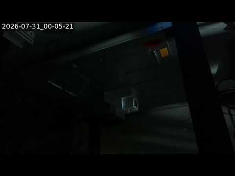

# OT-2 streaming camera

Raspberry Pi Zero 2 W + Camera Module 3 (imx708) that live-streams the Opentrons
OT-2 to YouTube, following the
[ac-training-lab picam setup](https://ac-training-lab.readthedocs.io/en/latest/devices/picam.html).

Streams appear on the **BYU VCL Hardware Streams** channel:
<https://www.youtube.com/@byu-vcl-hardware-streams>

Nothing on the Pi lives in this repo (the client code comes from
`AccelerationConsortium/ac-training-lab`, and the config file holds a secret), so
this document records what was applied so it can be reproduced or repaired.

## Device

| | |
|---|---|
| Hardware | Raspberry Pi Zero 2 W Rev 1.0, Camera Module 3 (imx708) |
| OS | Raspberry Pi OS / Debian 13 (trixie), kernel 6.18, Python 3.13 |
| Timezone | `America/Boise` (matches the 8 h chunk schedule below) |
| Access | Tailscale SSH, tags `tag:stream-cam-test` + `tag:tailscale-ssh` |
| Hostname / user / sudo password | GitHub Actions secrets `OT2_STREAM_CAM_HOSTNAME`, `OT2_STREAM_CAM_USERNAME`, `OT2_STREAM_CAM_PASSWORD` |

`sudo` is password-gated (no passwordless sudo, and polkit rejects
non-interactive `systemctl`), so feed the password over stdin rather than putting
it on a command line:

```bash
ssh "$OT2_STREAM_CAM_USERNAME@$OT2_STREAM_CAM_HOSTNAME" 'sudo -S -p "" <cmd>' <<< "$OT2_STREAM_CAM_PASSWORD"
```

## Software

```bash
sudo apt-get install -y --no-install-recommends git ffmpeg python3-venv iw fonts-dejavu-core
git clone --depth 1 --branch copilot/sub-pr-538 \
  https://github.com/AccelerationConsortium/ac-training-lab.git
cd ~/ac-training-lab/src/ac_training_lab/picam
python3 -m venv --system-site-packages venv
./venv/bin/pip install requests
```

The branch is `copilot/sub-pr-538` at `87a3ccb` — the same revision the other VCL
cam runs. `device.py` is then replaced with the copy running on that cam, which
carries fixes not yet committed upstream:

- capture landscape and rotate in ffmpeg (so 90°/270° output keeps the full
  sensor field of view instead of cropping to a vertical strip),
- optional `SENSOR_MODE` passed through to `rpicam-vid --mode`,
- `-g $((FRAME_RATE * 2))` on the libx264 branch, because YouTube wants a
  keyframe at least every 4 s and x264's default 250-frame GOP is 25 s at 10 fps.

`device.py` shells out to `rpicam-vid | ffmpeg`, so `python3-picamera2` is not
required.

## Configuration (`my_secrets.py`, mode `600`, not in git)

| Setting | Value | Why |
|---|---|---|
| `LAMBDA_FUNCTION_URL` | *(secret)* | AWS Lambda that creates/ends the YouTube broadcast; same one the other VCL cam uses |
| `CAM_NAME` | `picam-ot2` | appears in the broadcast title |
| `WORKFLOW_NAME` | `OT-2` | **must be unique per device** — drives the YouTube playlist and which stream gets ended |
| `PRIVACY_STATUS` | `public` | |
| `RESOLUTION` | `720p` | 1280×720 |
| `FRAME_RATE` | `10` | |
| `CAMERA_ROTATION` | `0` | landscape; revisit once the camera is on its final mount |
| `CAMERA_VFLIP` / `CAMERA_HFLIP` | `False` / `False` | ditto |
| `SENSOR_MODE` | `2304:1296` | imx708 otherwise auto-selects its cropped 1536×864 mode for ≤720p output and loses ~1/3 of the field of view |
| `TIMESTAMP_OVERLAY` | `True` | also forces the libx264 path, which is what applies the 2 s keyframe interval |

## Automatic startup and restart

Four independent layers, matching what the other VCL cam runs:

1. **`/etc/systemd/system/device.service`** — `Restart=always`, `RestartSec=10`,
   `TimeoutStartSec=60`, and `StartLimitIntervalSec=3600` / `StartLimitBurst=3`
   in `[Unit]` (they are ignored under `[Service]` on current systemd). Enabled,
   so it comes up on boot.

2. **8-hour chunking via a root crontab reboot.** Each boot calls the Lambda
   `end` (finalizing the previous broadcast, so YouTube stores that 8 h segment
   as its own video) then `create`. Do *not* add `RuntimeMaxSec=` — that would
   create off-schedule chunk boundaries.

   ```cron
   # Restart at 5 am, 1 pm, and 9 pm local time
   0 5,13,21 * * * /sbin/shutdown -r now
   ```

3. **RTMP stall watchdog** — `/usr/local/bin/stream-watchdog.sh`, run every
   minute by `stream-watchdog.timer` (`OnBootSec=2min`,
   `OnUnitActiveSec=1min`). It catches the one failure mode systemd cannot:
   `ffmpeg`/`rpicam-vid` alive but no data reaching YouTube, so nothing exits and
   `Restart=always` never fires. Ground truth is `bytes_acked` on the established
   TCP connection to the RTMP server (`ss -tin '( dport = :1935 )'`); three
   consecutive checks with no progress restart `device.service`, with a 180 s
   post-start grace period. Watchdog restarts are budgeted to
   `MAX_RESTARTS_PER_DAY` (default 6) over a rolling 24 h, persisted in
   `/var/lib/stream-watchdog/restarts`, so a persistent stall cannot spawn an
   endless series of throwaway broadcasts.

4. **Hardware watchdog** — already active by default on this image, so a kernel
   hang self-reboots.

Worst case is therefore roughly 3 scheduled chunks + ≤6 watchdog restarts + a few
crash-loop starts per day, not the hundreds a naive every-N-minutes restarter
could produce.

## Reliability fixes applied

- **Wi-Fi power save off** — the Pi Zero 2 W's `brcmfmac` driver wedges the
  connection until reboot with power save enabled. Applied live with
  `iw dev wlan0 set power_save off` and persisted:

  ```ini
  # /etc/NetworkManager/conf.d/wifi-powersave-off.conf
  [connection]
  wifi.powersave = 2
  ```

- **Persistent, bounded journald** — the journal was RAM-only, so every reboot
  (including the 8 h cron reboots) erased the logs needed to post-mortem an
  outage:

  ```ini
  # /etc/systemd/journald.conf.d/persistent.conf
  [Journal]
  Storage=persistent
  SystemMaxUse=100M
  ```

## Not yet wired: dead-man's switch

The watchdog supports an optional `HEALTHCHECK_URL` in `/etc/default/stream-watchdog`
(mode `600`, since anyone holding the ping URL can fake healthy pings). It is
pinged on every *healthy* check, so an external monitor alerts when the whole Pi
drops off the network — the one case no on-device logic can handle.

This is **not** configured on the OT-2 cam yet: it needs its own
[Healthchecks.io](https://healthchecks.io) check, not the one the other cam uses
— two devices pinging one check means either can mask the other's death.
Suggested settings once a second check exists (e.g. exposed as an
`OT2_HEALTHCHECKS_IO_URL` secret): period 5 min, grace 10 min, so a successful
watchdog self-heal never pages but a real outage does.

## Health checks

```bash
systemctl status device.service
journalctl -u device.service -f
journalctl -t stream-watchdog -n 20          # watchdog only logs stalls/restarts
ss -Htin state established '( dport = :1935 )' | grep -o 'bytes_acked:[0-9]*'
systemctl list-timers stream-watchdog.timer
```

`bytes_acked` climbing between two samples is the definitive "the stream is
really reaching YouTube" check. Avoid full-bandwidth speed tests on this Pi —
they saturate the uplink and cause the very stalls being monitored for.

## First verified frame

Grabbed from the live YouTube stream shortly after the first broadcast started
(2026-07-31 00:05 MDT — the lab lights were off, and the camera was not yet on
its final mount):



## Known transient

On `create`, YouTube occasionally returns `HttpError 409 SERVICE_UNAVAILABLE`
when adding the fresh broadcast to its playlist (seen on this cam's first
broadcast). The broadcast is created and streams fine; only the playlist-add
fails. The retry belongs in the Lambda
(`chalicelib/ytb_api_utils.py`), not on the Pi.

## Related

- [ac-training-lab picam docs](https://ac-training-lab.readthedocs.io/en/latest/devices/picam.html)
- `vertical-cloud-lab/streamingLambda` PR #2 — where the watchdog, Wi-Fi
  power-save and journald fixes were worked out
- vertical-cloud-lab/byu-vcl#172 — this setup
