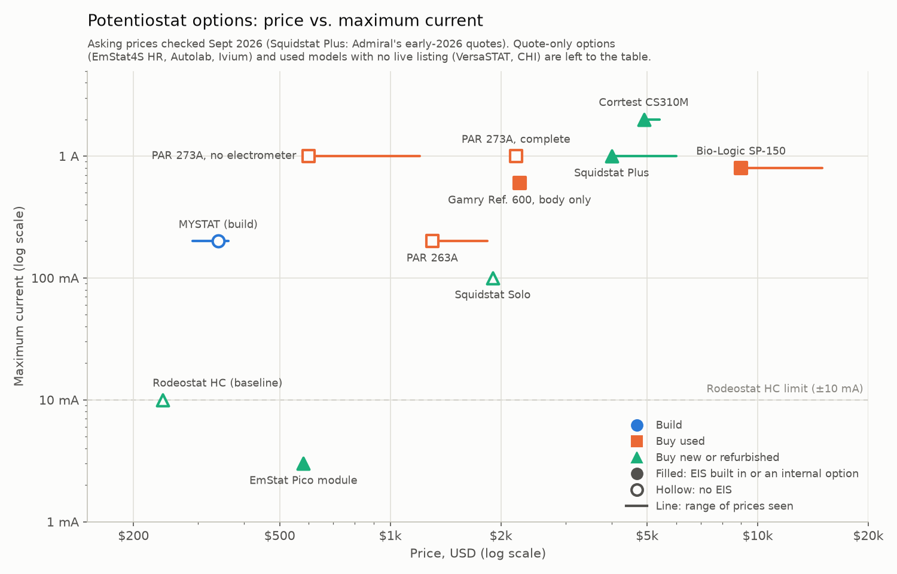

# Potentiostat selection for the CubXL

A summary of [issue #231](https://github.com/vertical-cloud-lab/byu-vcl/issues/231) as of
2026-09-28, folding in [#26](https://github.com/vertical-cloud-lab/byu-vcl/issues/26),
[#57](https://github.com/vertical-cloud-lab/byu-vcl/pull/57) and
[#213](https://github.com/vertical-cloud-lab/byu-vcl/issues/213). It sets every option the thread
found for replacing the Rodeostat HC side by side: buying used, buying new, and building. Prices
are asking prices or quotes, not sale prices. The data behind the chart, with a source for each
price, is in [`potentiostat-options.csv`](potentiostat-options.csv), and
[`scripts/plot_potentiostat_options.py`](../scripts/plot_potentiostat_options.py) redraws it.

## What we need, and what we don't know yet

From the conversation with Dr. Baird in #57: more current than the Rodeostat HC's ±10 mA, a
constant-current (galvanostat) mode, EIS if possible, and nothing analog-only. #26 also asked for
four channels. Three numbers are still open, and each option below depends on them:

1. **Maximum current** (electrode area × current density).
2. **Whether constant current is truly needed.**
3. **Whether EIS is needed, and up to what frequency.** If it's only for conductivity, the
   [$229.99 Atlas K 1.0 probe kit](https://atlas-scientific.com/kits/conductivity-k-1-0-kit/)
   from #213 reads conductivity straight into the Pi with no potentiostat.

Borrowing an instrument first costs nothing and would answer all three. Dr. Porter's lab reads its
conductivity cell with one (#213), and Dr. Baird suggested borrowing in #26.

## Bottom line

- **Best value: build a MYSTAT, about $340.** ±200 mA (20× the Rodeostat HC), constant current,
  four-electrode cells, and it runs from the Pi. No EIS, and it can't sample faster than every
  90 ms. It costs a few weeks of student time, plus a CubOS driver we'd write.
- **Best specs we have a price for: the Squidstat Plus, about $4k refurbished or $6k new**
  (Admiral's quotes in #26). ±1 A, EIS to 2 MHz on the new version, and CubOS already has a driver
  for it. Admiral ships no arm64 build, so it needs a small x86 PC beside the CubXL, about
  $250–400.
- **Most current per dollar: a complete PAR 273A, $2,198 used.** Over ±1 A and ±100 V, and the Pi
  can drive it over RS-232 with no vendor software. But the design is decades old with no
  manufacturer support, and EIS needs a separate lock-in amplifier (about $400–450) plus our own
  code.
- **Best all-rounder that runs on the Pi, if its price is right: the PalmSens EmStat4S HR.**
  ±200 mA, ±6 V, constant current and EIS to 200 kHz. CubOS's EmStat driver has already run an
  EmStat4 on a Pi. PalmSens only quotes prices, so we have to ask.
- **Cheapest EIS: a $580 EmStat Pico module.** But its ±3 mA is below the Rodeostat's. A MYSTAT
  plus an EmStat Pico, about $920, gives ±200 mA DC work and low-current EIS, all from the Pi.

## Price vs. maximum current

## Which to pick, by budget

| Budget | Pick | What you get | What you give up |
|---|---|---|---|
| ~$340 | **Build a MYSTAT** | ±200 mA, constant current, 4-electrode, on the Pi | EIS and fast sampling; student time |
| ~$920 | MYSTAT + EmStat Pico | Adds EIS to 200 kHz, at up to ±3 mA | Two boxes; the Pico has no constant current |
| ~$2,200–2,650 | **PAR 273A, complete** (+ 5210 lock-in for EIS) | Over ±1 A and ±100 V, on the Pi over RS-232 | Age, no support; we write the driver and the EIS code |
| ~$4,250–4,400 | **Squidstat Plus, refurbished** + x86 mini PC | ±1 A, EIS, CubOS driver already written, 90-day warranty | An extra computer; lower top EIS frequency than the new one |
| Quote needed | **EmStat4S HR** | ±200 mA, EIS to 200 kHz, on the Pi, CubOS driver | Unknown price; the driver has no constant current yet |
| ~$6,250–6,400 | Squidstat Plus, new + x86 mini PC | EIS to 2 MHz, 2-year warranty | Price |

**Best specs regardless of price:** the Squidstat Plus (new), Bio-Logic SP-150, Gamry
Reference 600, Autolab PGSTAT302N, a 2018-or-later VersaSTAT 4 and, on paper, the Corrtest CS310M
all reach ±600 mA or more with EIS to at least 1 MHz. Only the Squidstat has a CubOS driver.

**Not recommended right now:**

- **Bio-Logic SP-150 and Autolab PGSTAT302N:** about $9k–10k used.
- **Corrtest CS310M:** 2 A with EIS for about $5k, but it's Windows-only, imported, and its
  support is unknown.
- **PalmSens4:** ±30 mA for about €4.4k.
- **CHI 600E series:** ±250 mA, and EIS and constant current only on some models.
- **A bare PAR 273A:** no electrometer, so it can't be connected to a cell.
- **FreiStat:** its chip is out of stock for about a year.
- **Squidstat Solo:** ±100 mA and DC only for $1,900. A MYSTAT beats it on paper for a fifth of
  the price, though the Solo is a supported commercial instrument with a CubOS driver.

## All options

"Pi" means it can be driven from the CubXL's Raspberry Pi 5 (arm64 Linux) without another
computer. CubOS already has drivers for Admiral Squidstats (all four techniques) and PalmSens
EmStats (no constant current).

### Build

| Option | Price | Max current, voltage | Constant current | EIS | Pi? | Main catch |
|---|---|---|---|---|---|---|
| **[MYSTAT](https://github.com/matthew-yates/MYSTAT)** | ~$340 for one; $290 each for 3+; ~$1,160 for four | ±200 mA, ±12 V | Yes | No | Yes, plain-text serial; driver to write | 90 ms minimum sample interval. Its LTM8045 power module is out of stock until about 5 Nov. The firmware needs a safety timeout before unattended use |
| [FreiStat](https://github.com/IMTEK-FreiStat) (AD5941) | Under €80 in the paper | About ±3 mA (unverified) | Not documented | In the chip, not in its software | Yes | AD5941 out of stock, 49-week lead time |

The MYSTAT figure re-prices eight key lines of its
[bill of materials](https://github.com/matthew-yates/MYSTAT/blob/main/hardware/mystat_circuit_board/bill_of_materials/mystat.csv)
at Digi-Key on 2026-09-28: the five costliest, plus the ADC, output buffer and microcontroller.
Those were 63% of the 2020 parts cost and have risen 50%. The rest is kept at 2020 prices, and
shipping and tax are not included. The paper's total was $226.22. A single unit costs more per
board because OSH Park sells boards in sets of three.

### Buy used

| Option | Price | Max current, voltage | Constant current | EIS | Pi? | Main catch |
|---|---|---|---|---|---|---|
| **PAR 273A, complete** | [$2,198 landed](https://www.ebay.com/itm/307118614206) | Over ±1 A, over ±100 V | Yes | External 5210 lock-in (~$400–450) and the /92 option | Yes, RS-232 or GPIB, [command handbook](https://www.ebay.com/itm/363946817221) $49.99 | Old, unsupported; the only listing with the external electrometer |
| PAR 273A, bare | [$599](https://www.ebay.com/itm/407038585293) to $1,205 landed | Same | Yes | Same | Same | No electrometer, so it can't connect to a cell |
| PAR 263A | [$1,300](https://www.rescienceinc.com/product-page/princeton-applied-research-potentiostat-galvanostat-263a-1), final sale | ±200 mA (±2 A with option 94), ±20 V | Yes | Same as the 273A | Yes | Final sale; the included cell cable has frayed leads |
| Gamry Reference 600 | [$2,250](https://www.rescienceinc.com/product-page/gamry-reference600-potentiostat-gaivanostat-zra), body only | ±600 mA, over ±22 V | Yes | To 1 MHz (600+: 5 MHz) | No, Windows | Software licence is tied to the serial number; no cables |
| VersaSTAT 3 or 4 | No live listing found | ±650 mA (3) or ±1 A (4); ±2 A if built from Aug 2018 | Yes | FRA option, to 1 MHz | No, Windows; [NIST's Python code](https://github.com/usnistgov/autoSDC) | Check the build date, and that the FRA is installed |
| CHI 660E | No live listing found | ±250 mA, ±13 V | 660E only | 630E, 650E and 660E, to 1 MHz | No, Windows | Only some models in the series have EIS or constant current |
| Bio-Logic SP-150 | [$9,000](https://www.nextdayautomation.com/products/used-biologic-sp-150-single-channel-potentiostat-with-low-current-option-10%C2%B5a-1na) | ±800 mA, ±10 V | Yes | Option, to 1 MHz | No, Windows | Price; the listing doesn't say whether EIS is fitted |
| Autolab PGSTAT302N | [$9,750](https://www.rescienceinc.com/product-page/autolab-pgstat302n-potentiostat-galvanostat), out of stock | ±2 A, 30 V | Yes | FRA32M option | No, Windows | Price |

The eBay prices are from 2026-09-25. eBay blocked automated checks on 2026-09-28, so those
listings may have changed. ReScience's $650 273A and $1,300 263A were still in stock on
2026-09-28.

### Buy new or refurbished

| Option | Price | Max current, voltage | Constant current | EIS | Pi? | Main catch |
|---|---|---|---|---|---|---|
| Rodeostat HC (baseline) | [$240](https://iorodeo.com/products/rodeostat-hc) | ±10 mA, ±10 V | No | No | Yes | — |
| EmStat Pico module | [$580](https://www.digikey.com/en/products/detail/palmsens-bv/ESPICO-ALL/12817917) | ±3 mA, about −1.7 to +2 V | No | 0.016 Hz–200 kHz | Yes, CubOS driver | Less current than the Rodeostat |
| Squidstat Solo | [$1,900 list](https://www.admiralinstruments.com/products) | ±100 mA, ±12 V | Yes | No | x86 PC; same Admiral API | DC only |
| **Squidstat Plus** | ~$4k refurbished, ~$6k new (quotes, #26) | ±1 A, ±12 V | Yes | To 2 MHz (new) | x86 PC; CubOS driver | Needs the PC; the refurbished one has a lower top EIS frequency and a 90-day warranty |
| **EmStat4S HR** | [Quote only](https://www.palmsens.com/potentiostat/potentiostat-price/) | ±200 mA, ±6 V | Yes | 10 µHz–200 kHz; the analyser may be an option | Yes; CubOS driver, tested on the LR model | Unknown price; no constant current in the driver yet |
| Corrtest CS310M | [$4,900–5,400](https://corrtest.en.made-in-china.com/product/lyPmEBFSXtcu/China-Electrochemical-Workstation-Potentiostat-Galvanostat-with-Eis-Model-CS310m.html), before shipping and duties | ±2 A, ±21 V | Yes | To 1 MHz | No, Windows | Support and software quality |
| PalmSens4 | [About €4,430](https://www.thasar.com/collections/palmsens-potentiostat), one reseller | ±30 mA | Yes | To 1 MHz | Unverified | Low current for the price |
| Autolab PGSTAT204, Ivium Vertex or CompactStat | Quote only | ±400 mA; up to ±2 A | Yes | Options | No, Windows | Unknown price |

"x86 PC" means a small Linux or Windows mini PC next to the CubXL. N100 models run about
$250–400, for example [ameriDroid's at $379.95](https://ameridroid.com/products/ameridroid-intel-n100-mini-pc-16gb-ram-512gb-ssd)
with Windows 11 Pro.

### Four channels (#26)

- Four MYSTATs: about $1,160.
- [Squidstat Prime](https://www.admiralinstruments.com/potentiostats/squidstat-prime): four
  channels, ±250 mA, DC only, quote only.
- Squidstat Cycler: about $7k refurbished or $10k new (from #26).

## Integration notes

- **Runs from the Pi:** Rodeostat, MYSTAT, PAR 273A and 263A (RS-232), and PalmSens EmStat
  instruments.
  - PalmSens instruments speak MethodSCRIPT over serial, and CubOS's EmStat driver ran a real
    EmStat4 LR on a Pi in
    [CubOS#302](https://github.com/Ursa-Laboratories/CubOS/pull/302). That test was an OCP run
    only; CV and CA haven't been tried on hardware, and there is no constant-current mode.
- **Needs an x86 PC:** Squidstats. Admiral's Linux library is
  [x86-64 only](https://github.com/Admiral-Instruments/AdmiralSquidstatAPI). CubOS's Admiral
  driver runs CV, OCP, CA and CP.
- **Needs a Windows PC:** Gamry, VersaSTAT, CHI, Bio-Logic, Autolab, Ivium and Corrtest.
  - For CHI, [hardpotato](https://github.com/BU-KABlab/hardpotato), the library CubOS's EmStat
    driver uses, already drives the CHI 601E and 760E through their macro interface.
- **A second computer is more than its price:** it's one more machine to set up and keep on the
  network, and CubOS on the Pi needs a way to reach it. Device-to-device tailnet access is
  `tcp:22` only, so that probably means SSH.

## Buying checklist for used units

1. Confirm the EIS/FRA option is installed; listing titles often omit it.
2. Get the software licence transfer in writing (Gamry and Metrohm license by serial number).
3. Make sure the cell cable, and for a 273A the external electrometer, is included.
4. Ask for proof it works, such as a dummy-cell CV and the built-in self-test.
5. Budget for auction fees; BidSpotter was a 20% buyer's premium plus 6% tax.
6. Skip analog-only boxes.

## Corrections to earlier replies in #231

- **Bio-Logic SP-150:** ±800 mA, not ±400 mA. The "~$15k used" came from a 2021 dealer post, and a
  live listing is $9,000.
- **VersaSTAT:** it's ±2 A only if built from August 2018 or upgraded. Older VersaSTAT 3s are
  ±650 mA and older VersaSTAT 4s are ±1 A.
- **Gamry Interface 1000:** ±12 V applied and ±20 V compliance, not ±10 V, and only the E version
  has EIS. I couldn't find the "$6,995 Interface 1000E bundle" again; the most recent one I found
  was $3,500 and has sold out.
- **CHI 600E series:** limited to ±250 mA. EIS is only on the 630E, 650E and 660E, and constant
  current only on the 660E.
- **MYSTAT:** now about $340 for one and $1,160 for four, not about $900.
- **Squidstat Prime:** it really is four-channel, as #57 says, and DC only.
- **Already corrected in the thread:** Squidstat's Linux support is x86-only, and the PAR 273A and
  263A have RS-232 as well as GPIB.
