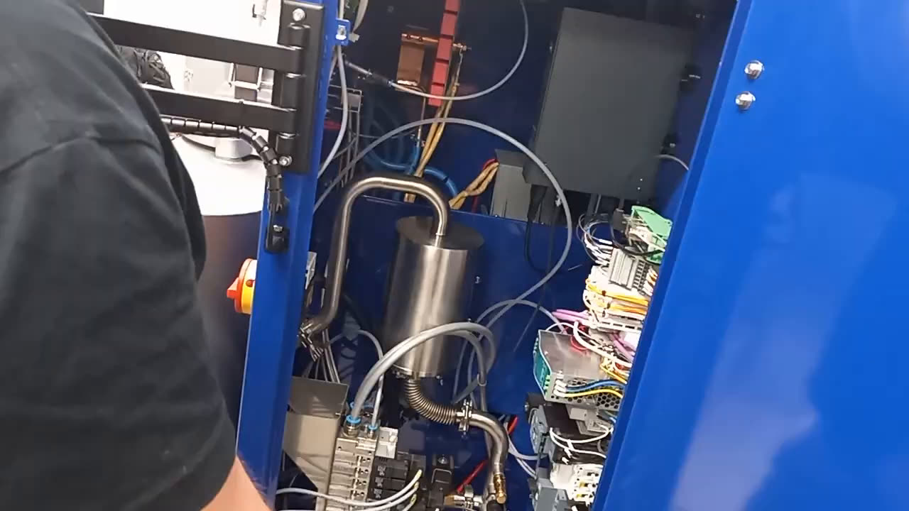

# rePowder HMI and ultrasonic generator: specs and ways to get data off them

For [#221](https://github.com/vertical-cloud-lab/byu-vcl/issues/221). The Oct 2 plan (#264) is to log settings and
readings for the run log (#261) by filming the HMI until AMAZEMET tells us how to export data. This page sets out what
the two controllers can do, so the camera plan and the questions to Bartosz rest on specs rather than guesses. Public
pages were fetched on 2026-10-07 through a lab Pi (residential IP). Specs from AMAZEMET's and SONICTECH's manuals are
taken from the notes in [PR #232](https://github.com/vertical-cloud-lab/byu-vcl/blob/323adba/atomizer-charge/repowder-reference/README.md),
since the manuals are copyrighted and not in this repo.

Every route below except the camera goes through AMAZEMET's control setup, so treat them as questions for Bartosz,
not plans. Nothing here has been tried on the machine.

## Summary

- **HMI: Weintek cMT2166X**, from Weintek's mid-range *cMT X Standard* line. It has **one 10/100 Ethernet port**, one
  USB host port, two serial ports and no SD slot. Its firmware can share the screen (VNC server with a view-only
  *monitor mode*, a browser view, the cMT Viewer app) and export logged data (the EasyWeb 2.0 web page, FTP, a USB
  backup to CSV). All of these use that one Ethernet port and sit behind passwords AMAZEMET controls. This tier has
  no OPC UA server and no SQL sync; those are on the *Advanced* line only.
- So a Pi on the HMI's network could take a **pixel-exact, view-only copy of the screen** over VNC instead of a camera
  behind anti-glare film. It could also pull the HMI's own data log, provided AMAZEMET's project records one and they
  give us a password.
- **Ultrasonic generator: SONICTECH STG1**, a compact Polish unit. It has a DB15 port with a **0–10 V power output**
  and 0–10 V amplitude input, plus 24 V start, error and status lines. Two RJ45 ports carry **RS-485 Modbus RTU**. In
  training video 1 it is a **plain box with no screen** inside the right-hand door, which fits the BASIC (PLC-driven)
  variant. If that is right, the HMI is its only display.
- The generator's ports are almost certainly in use already. The HMI sets scan offsets, which analog lines cannot
  carry, so something already drives the Modbus bus, and Modbus RTU allows only one master. The least intrusive tap
  is the 0–10 V power output, with AMAZEMET's OK.

*Training video 1 at 9:58 ([`wRc8p2_FnJo`](https://www.youtube.com/watch?v=wRc8p2_FnJo&t=589s), 720p). Bartosz says
"here we have the ultrasonic generator" at 9:49. The dark box at the top right is the size and shape of an STG1
(181 × 242.5 mm face), with cables leaving from the bottom and no screen. The nameplate would confirm it. At 10:28–10:44
Bartosz reaches into the DIN-rail stack at the right edge for "the PLC … the fuses". Most of it is behind the door, and
no model is readable at 720p.*

## HMI: Weintek cMT2166X

| Item | Value | Source |
| --- | --- | --- |
| Line | cMT X **Standard** (in `cMT2166X`, 2 = Standard, 16 = 15.6", 6 = one Ethernet port) | [comparison sheet](https://www.rusavtomatika.com/manuals/weintek/cMT-X_Comparison_ENG.pdf) |
| Display | 15.6", 1920 × 1080, 300 cd/m², pixel pitch 0.179 mm (active area ≈ 344 × 194 mm), capacitive glass | [datasheet](https://www.mouser.com/datasheet/3/6153/1/cMT2166X_Datasheet_ENG.pdf) (rev. 2024-05-14) |
| Processor, memory | Quad-core RISC, 1 GB RAM, 4 GB flash, RTC | datasheet |
| Ethernet | **10/100 Base-T × 1** | datasheet |
| USB | USB 2.0 host × 1 (Bartosz: on the back of the panel, used for HMI software updates) | datasheet; [video 1, 11:44](https://www.youtube.com/watch?v=wRc8p2_FnJo&t=704s) |
| Serial | Two DB9s. Con.A has COM1 (RS-485 2W/4W) and COM3 (RS-485 2W); Con.B has COM1 (RS-232 4W) and COM3 (RS-232 2W). RS-485 also speaks Siemens MPI at 187.5 kbit/s, on one port at a time | datasheet |
| Not fitted | SD slot, USB client, CAN, HDMI | datasheet |
| Power | 24 V DC ±20 %, 0.9 A, isolated | datasheet |
| Software | Projects built in EasyBuilder Pro ≥ 6.06.02. EasyAccess 2.0 remote access needs a paid activation card (RZACEA020) | datasheet |

**What the Standard line has, and lacks** ([comparison sheet](https://www.rusavtomatika.com/manuals/weintek/cMT-X_Comparison_ENG.pdf)):

| Has | Lacks (Advanced only) |
| --- | --- |
| VNC server, WebView (browser), cMT Viewer app, EasyWeb 2.0 web settings page, FTP file transfer, MQTT (including AWS IoT / Azure / Sparkplug B), OPC UA *client*, IP/USB camera object, JavaScript objects | OPC UA *server*, database server (MySQL/MS SQL sync), SQL query. CODESYS is not supported on the cMT2166X |

### Ways to get the HMI's data, least to most intrusive

| Route | What it gives | What it needs |
| --- | --- | --- |
| Camera on the screen (the current plan) | Whatever page is showing | Nothing from AMAZEMET. If the screen fills a 1080p frame, each camera pixel covers about one screen pixel. At 720p it is 1.5 screen pixels, still readable. Defocus slightly if moiré appears |
| **VNC, monitor mode** | Pixel-exact copy of the screen, view-only, recordable by the Pi and streamable | The HMI's Ethernet port. VNC is turned on from the HMI's System Settings ("VNC" tab, OS 20231201 or later) or from the project. *Monitor mode*, which makes the HMI refuse input from VNC clients, is a project setting (System Parameters » Remote, or system bit `LB-12088`). Without it, view-only is only a client flag. Port 5900. [EBPro ch. 5](https://www.rusavtomatika.com/upload_files/documents/weintek/EBPro/UserManual/eng/UserManual_separate_chapter/Chapter_05_System_Parameter_Settings.pdf) §5.6, [Maple: VNC server](https://maplesystems.com/knowledgebase/hmi/remote-access-iiot-features/remote-access-vnc-server/), [Maple: enabling VNC](https://maplesystems.com/technical-notes/enabling-vnc/) |
| WebView | The same screen in a browser, up to 4 users | Switched on in EasyWeb 2.0. It **monitors and controls**, so it is not for a public stream. [EasyWeb 2.0 manual](https://www.rusavtomatika.com/upload_files/documents/weintek/Document/UM0/cMT-X-Series-Easyweb-2.0-UserManual-eng.pdf) ch. 2 |
| **EasyWeb 2.0 » Data** | Export or backup of the *data log* (with trend view), *event log* and *operation log*, plus recipe backup | A browser at the HMI's IP, the History-level password, and a project that records data. EasyWeb exports drop decimal places, and the trend view needs "All records in one file". EasyWeb 2.0 manual ch. 1 |
| FTP | History files from the HMI (explicit FTPS from OS 20240308) | The History-level password, which governs FTP. cMT models store sampled data as `.db` files, which are not readable as they are. EBPro ch. 5 §5.13; [Maple: data sampling to CSV](https://maplesystems.com/technical-notes/converting-data-sampling-to-a-csv/) |
| USB backup | History converted to CSV on a stick | A Backup object that AMAZEMET would have to have put in the project ([Maple](https://maplesystems.com/technical-notes/converting-data-sampling-to-a-csv/)) |
| MQTT publish | Live tags pushed to our HiveMQ broker | An edit to AMAZEMET's project. The cleanest live feed, and the most intrusive |

Bartosz in training: "if you connect with HMI, you can download some data, parameters … so it has those capabilities.
But generally, we are using it as an app screen" ([video 1, 12:39](https://www.youtube.com/watch?v=wRc8p2_FnJo&t=759s)).

**Passwords.** EasyWeb 2.0 has four levels: System Setting, Upload Project, History and User, each with factory
default `111111`. History is the one to ask for: it can back up historical data and use FTP, but cannot change
settings or the project. Don't try the default on AMAZEMET's panel; ask them. The same point argues for keeping the HMI
**off any shared network**. If a Pi does connect, it should be the only thing on that segment, with no route
from campus or the tailnet to the panel.

**The one Ethernet port.** If the HMI talks to the PLC over Ethernet, which is likely for a current PLC, that port is
taken. A Pi would then need a small switch on that link, or a spare port on the PLC side. Both are AMAZEMET's call.

## Ultrasonic generator: SONICTECH STG1

| Item | Value | Source |
| --- | --- | --- |
| Maker | SONICTECH Ultrasonics, Kiełpin (Łomianki), near Warsaw, PL. Their line is mainly ultrasonic welding | [STG1 page](https://sonictechultrasonics.com/en/products/ultrasonic-generators/ultrasonic-generator-stg1) ([PL](https://sonictechultrasonics.com/pl/produkty/generatory-ultradzwiekowe/generator-ultradzwiekowy-stg1)) |
| Public feature list | Built-in sonotrode scan, digitally generated and controlled frequency, amplitude 50–100 % in percent steps, process-parameter monitoring, fan and temperature management, overload and short-circuit protection. "RS-485, optional Profinet, Profibus, Modbus, EtherCAT"; remote control of the process | STG1 page |
| Frequencies, power | 20, 30, 35, 40, 60, 70 kHz; 200–1000 W (EN page) or 500 / 1000 W (PL page). The manual lists **40 kHz at 0.5 kW only** | STG1 page; manual |
| Body | 230 V AC, IEC C14 inlet; 2 kg; 181 × 69.5 × 242.5 mm; IP20; 0–40 °C; DIN-rail or ear mount | STG1 page; manual |
| Variants | BASIC (no screen, driven remotely or by a PLC) or PREMIUM (touchscreen). Part number format `G<kHz><B\|P>-<500\|1000>-<mount>-<options>`, on the rear nameplate | manual p. 14 |
| Ours | 40 kHz; the frame above suggests BASIC | quote; video 1 |
| X3, DB15 | Inputs: start (24 V), clear error, **amplitude 0–10 V** (5–10 V → 50–100 %). Outputs: **power 0–10 V**; "US active", "Error" and "Nominal" (24 V, 0.2 A) | manual pp. 21–27 |
| X5 / X6, RJ45 | **RS-485 Modbus RTU**, default address 170, 8N1. Two ports, presumably for daisy-chaining | manual p. 27 |
| Other ports | X1 mains; X2 LEMO HV (>1 kV) to the transducer; X4 14-pin 3.81 mm terminal block | manual p. 21 |
| Scan readouts | Parallel and series resonance (Fp/Fs), impedances (Zp/Zs), F-start/stop offsets. Protection limits on current, voltage, impedance and frequency drift | manual pp. 32–34 |
| PC app | Bartosz: parameters can be changed by connecting an app to the generator, and AMAZEMET can take a remote session for troubleshooting. SONICTECH also sells an external control panel that plugs into RJ45, for BASIC units | [video 1, 9:49–10:28](https://www.youtube.com/watch?v=wRc8p2_FnJo&t=589s); [control units](https://sonictechultrasonics.com/en/products/control-units) |

Not public: the Modbus register map and the PC app. Ask SONICTECH or AMAZEMET.

### Ways to get the generator's data

1. **Through the HMI.** Its *Advanced ultrasonics* page runs the scan, sets the F-start/stop window from the peak
   (+200 / −600 Hz) and shows frequency, power and amplitude ([video 1, 20:38–22:53](https://www.youtube.com/watch?v=wRc8p2_FnJo&t=1238s)),
   so the camera or VNC route covers it.
2. **The 0–10 V power output (X3).** Passive and fast, so the Pi could log ultrasonic power per run at any rate. X3 is
   probably wired to the PLC already (start, amplitude), so this needs a DB15 breakout and an isolated ADC, and
   AMAZEMET's OK.
3. **Modbus RTU.** Modbus RTU allows only one master, and the PLC or HMI is almost certainly it, because the HMI sets
   F-start/stop offsets and runs scans, which analog lines cannot do. A second master would collide with it. A
   listen-only RS-485 sniffer on the spare RJ45 would not, but it needs the register map and AMAZEMET's OK.

## Induction furnace controller (for completeness)

Blue Power / Indutherm (the furnace is an AUS 500 "powered by AMAZEMET"). It has RS-232 and RJ45 Ethernet for
Indutherm's DMS software (Windows), which reads machine parameters, logs diagnostics, writes casting reports to file
and backs up programs ([PR #232 notes §9](https://github.com/vertical-cloud-lab/byu-vcl/blob/323adba/atomizer-charge/repowder-reference/README.md#9-controls-and-data-interfaces),
GU500 manual pp. 32, 57). Its GU 500 panel, with display and keypad, is in the recess at the module's upper right.
That is presumably the "generator display" to film, since the ultrasonic generator appears to have no screen.

## Questions for Bartosz (to add to the 2026-10-02 email)

1. Does the HMI reach the PLC over its one Ethernet port? Could we add a switch on that link, or is there a spare port
   on the PLC side?
2. Which data does the HMI project log (Data Sampling, event log), at what interval? Is there a USB/CSV backup
   button?
3. Could we have a History-level password for EasyWeb/FTP, and VNC enabled in *monitor mode* so the screen can be
   recorded without being controllable?
4. Is the STG1 driven over Modbus RTU or over the DB15 analog lines? Could we have its register map and the PC app?
5. Would a passive tap of the STG1's 0–10 V power output be acceptable?
