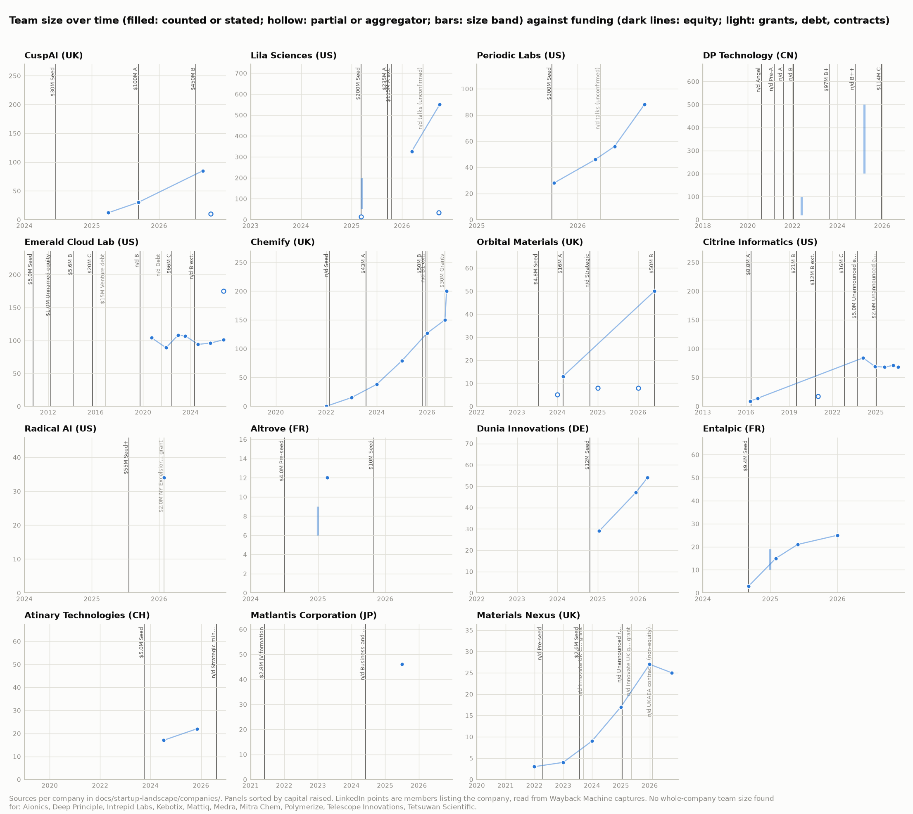
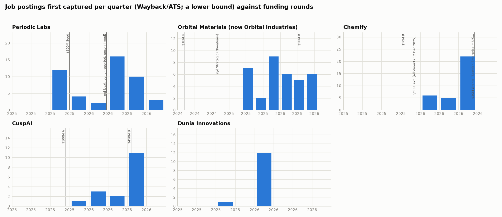
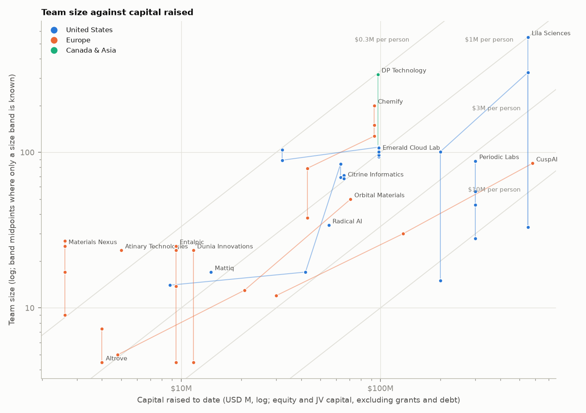
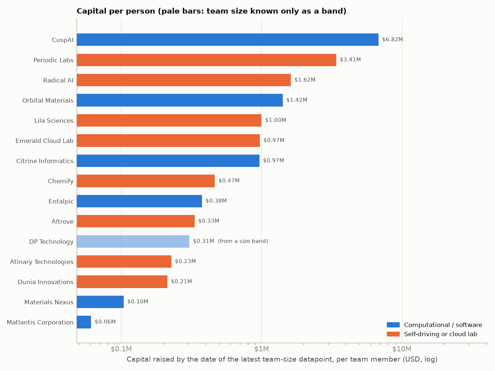
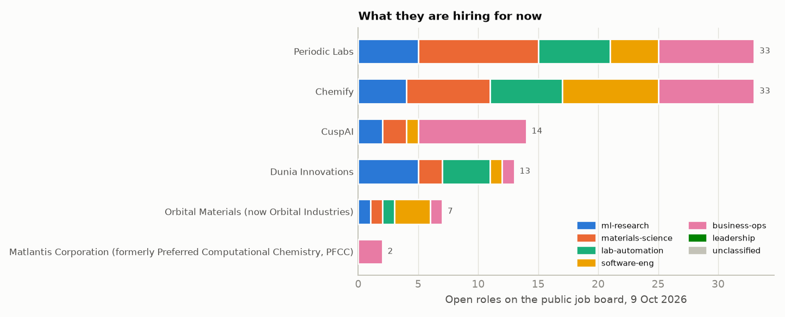
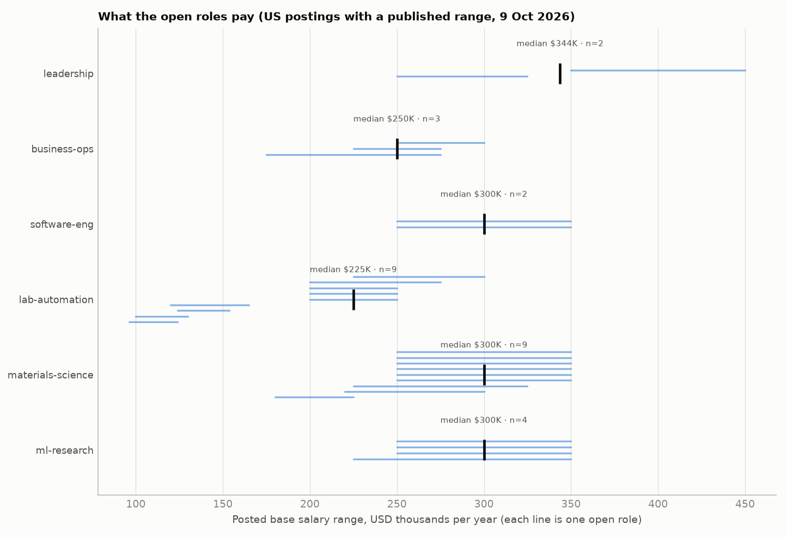

# AI-for-materials and self-driving-lab startups: who they hire, when, and how it tracks funding

A survey of 25 startups in the US, Europe, Canada and Asia. For each one: who holds which role, when they joined and what they did before; what jobs the company posts and how often its people leave; how big the team is; and how hiring moves against the funding timeline. It continues the enterprise/academic precedent work in [#155](https://github.com/vertical-cloud-lab/byu-vcl/issues/155). Data snapshot: **9 October 2026**.

**25 companies** are covered:
- **US:** Periodic Labs, Lila Sciences, Radical AI, Medra, Tetsuwan Scientific, Citrine Informatics, Kebotix, Mitra Chem, Aionics, Mattiq, Emerald Cloud Lab.
- **UK:** Orbital Materials (now Orbital Industries), CuspAI, Chemify, Materials Nexus.
- **Continental Europe:** Entalpic, Altrove, Dunia Innovations, Atinary.
- **Canada:** Telescope Innovations, Intrepid Labs.
- **Asia:** DP Technology, Deep Principle, Matlantis, Polymerize.

The one-row-per-company table is in [`summary.md`](summary.md), and each company has a sourced profile in [`companies/`](companies/).

## Findings

**1. Two funding eras.** The 2010–2021 cohort raised $11–100M each, mostly in $5–20M increments spread over years:
- [Citrine](companies/citrine-informatics.md): ~$66M across six Form Ds.
- [Kebotix](companies/kebotix.md): ~$24M.
- [Mattiq](companies/mattiq.md): ~$19M.
- [Aionics](companies/aionics.md): ~$11M.

The 2024–25 cohort raises that much in a single round:
- [Periodic Labs](companies/periodic-labs.md): a $300M seed (Sep 2025), with talks at a ~$7B valuation reported but unconfirmed.
- [Lila Sciences](companies/lila-sciences.md): $550M in seven months.
- [CuspAI](companies/cuspai.md): $580M in 25 months, including a $450M Series B at a $2.6B valuation (Jul 2026).
- [Medra](companies/medra.md): $63M in three months.

**2. Hiring follows a round by two to three quarters, then compounds.**



| Company | Team size over time | Hiring after the round |
|---|---|---|
| Periodic Labs | LinkedIn members 28 (Oct 2025) → 46 → 56 → 88 (Aug 2026) | Captured postings ran 2–4 a quarter over the winter after the $300M seed, then 16 in 2026Q2 |
| Lila Sciences | A 51–200 LinkedIn band at launch → 326 members (Mar 2026) → 550 (Oct 2026) | 22 postings the quarter after its Series A, then 89 in 2026Q2 |
| CuspAI | ~12 (registry, to Mar 2025) → ~30 (Sep 2025) → 85 (Aug 2026) | — |
| [Chemify](companies/chemify.md) | UK accounts give 15 → 38 → 79 → 127 average employees (2022–25), and the site now says 200+ | — |

Smaller rounds buy slower, steadier growth:
- [Materials Nexus](companies/materials-nexus.md): 3 → 27 over 2021–25 on a £2M seed plus grants.
- [Entalpic](companies/entalpic.md): 3 → 25 in 16 months on €8.5M.
- [Dunia](companies/dunia-innovations.md): 29 → 54 on $11.5M.



Hiring and funding do not always line up. Dunia posted 12 of its 13 open roles in a single week of February 2026 with no matching funding announcement. Citrine has posted only a trickle of roles since 2023, alongside small unannounced raises.

**3. Capital per person spans two orders of magnitude.** Each figure is capital raised by the date of the team-size count, per person:

| Group | Capital per person | Companies |
|---|---|---|
| Computational and software, small rounds | $0.1–0.4M | Materials Nexus, Entalpic, Dunia, Atinary |
| Physical-lab and older platform companies | ~$0.5–1M | Chemify $0.47M, Citrine and Emerald Cloud Lab ~$0.97M, Lila $1.0M |
| 2025 mega-rounds | $3–7M, still in the bank | Periodic $3.4M, CuspAI $6.8M |

 

**4. Physical-lab companies hire lab people; computational ones hire go-to-market.**
- Of Periodic's 33 open roles, ML research is only 5. Materials science has 10 and lab automation 6 (technicians, equipment, process and safety engineers). Its Head of People and Head of EHS seats are still open, which is what a lab build-out looks like.
- Lila's 106 openings split 17 ML, 18 materials science, 18 lab automation, 25 software and 28 business.
- CuspAI is computational. Nine of its 14 openings are partnerships, developer relations, programme or talent roles.
- [Orbital](companies/orbital-materials.md) rebranded as Orbital Industries around its May 2026 Series B. It now sells data-centre cooling fluids and compute hardware and hires forward-deployed and test engineers.



**5. What the roles pay.** 142 US postings publish a base range (Lila 105, Periodic 29, Medra 6, Tetsuwan 2). Median range midpoints by function:

| Function | Median midpoint |
|---|---|
| ML research | $290K |
| Leadership | $255K |
| Software | $217K |
| Materials science | $178K |
| Lab automation | $177K |
| Business and operations | $156K |

Periodic pays at the top of the market across the board:

| Periodic Labs role | Posted range |
|---|---|
| Research scientist | $250–350K |
| Automation engineer | $200–250K |
| Research associate | $180–225K |
| Laboratory technician | $100–130K |

Lila's comparable lab roles are much lower: senior research associate (automated chemistry) $80–118K and lab operations specialist $68–103K. These are useful benchmarks when hiring an automation engineer or lab technician for an academic self-driving lab. See `data/posted_pay.csv` and the [posted-pay table](summary.md#posted-pay).



**6. Who founds and leads.**
- **The 2025 cohort comes out of frontier AI labs and big-tech research.**
  - Periodic was founded by OpenAI's former VP of post-training research and a Google DeepMind materials research lead.
  - Orbital's CEO spent five years at DeepMind.
  - CuspAI pairs a University of Amsterdam ML professor and former Microsoft Research and Qualcomm VP with a PhD chemist from Google and Quantinuum.
- **The earlier cohort is faculty spinouts:**
  - Aspuru-Guzik (Kebotix)
  - Cronin (Chemify)
  - Mirkin (Mattiq)
  - Chueh (Mitra Chem)
  - Hein (Telescope)
  - Allen and Aspuru-Guzik (Intrepid)
  - Weinan E as DP Technology's chief scientific adviser
- **The faculty-founder route has raised $5–100M per company; the frontier-lab route $300–580M.** DP Technology, whose co-founder trained under Weinan E, is the exception at $200M+.
- **Lila builds out its executive layer.** It is a Flagship company and now lists 33 VP-and-above leaders, up from 15 at launch.

**7. Turnover and failure modes.** These are visible in team-page diffs, registry filings and Form D officer lists:
- **Citrine:** the co-founder and Chief Science Officer left in 2022. Five of the seven functional heads on the 2019 leadership page, plus the CTO, were gone by December 2023. LinkedIn members fell from 84 to 68 between Feb 2024 and Jul 2026, while the company raised only small unannounced amounts.
- **Kebotix:** the founder-CEO and two directors are absent from the 2023 Form D, and co-founder Aspuru-Guzik from the 2024 one. The website lists no team or openings, so the company's status is unclear.
- **Emerald Cloud Lab:**
  - Its team page has held at about 90–108 people for six years.
  - A WARN notice covered 30 jobs when it moved from South San Francisco to Austin (2023).
  - Laboratory-operations staff fell from 40 to 6 between 2020 and 2026, while scientific development held at about 30.
- **CEO changes:** Mattiq's CEO changed. Aionics's CEO is absent from its 2026 Form D, with no announcement found.
- **Chemify:** it has gone through two CTOs since 2024.
- **Lila:** five of the 15 leaders on its launch team page are missing from the current one (including its Chief Scientist). Some may have changed roles rather than left.
- **Pivots:** Orbital (to data-centre hardware) and Tetsuwan (to a browser-accessible biology cloud lab).

**8. What this means for the VCL** (the question behind #155).
- **Industry money reaches labs through strategic stakes and consortia more than through early VC.** Examples:
  - Bruker took a minority stake in Atinary (Aug 2026), which opened its own autonomous lab in Boston in early 2026.
  - NVIDIA's NVentures invested in Orbital and Lila.
  - CuspAI launched an "AI Materials Foundry" with 45+ founding partners (NVIDIA, Meta, Samsung, Hyundai and others) as consortium members rather than investors ([Dealroom](https://dealroom.co/news/139818-cuspai-closes-450m-series-b-at-2-6b-valuation-backed-by-bezos-and-uk-sov/), [Sifted](https://sifted.eu/articles/cuspai-lands-450m-round-to-accelerate-ai-materials-discovery)).

  Those consortium and strategic-partner models are the ones an academic facility can copy.
- **The cloud-lab precedent shows stable staffing.** Emerald Cloud Lab held ~100 people for six years, and its lab-operations group shrank from 40 to 6. Its funding is ~$100M from primary sources, or $150–180M per aggregators.

## Contents

## Contents

- [`summary.md`](summary.md): the one-row-per-company table, generated from the data.
- [`companies/`](companies/): one profile per company, with every row linked to its source:
  - funding rounds,
  - team size over time,
  - leadership with start dates and backgrounds,
  - staff roles,
  - current and historical job postings,
  - turnover.
- [`data/`](data/): the same facts as JSON (schema below), plus `funding_response.csv`, which pairs each round with hiring before and after it.
- [`figures/`](figures/): the plots, regenerated by `python scripts/startup_landscape/analyze.py`.

## Method

Each fact comes from a public source that is meant to be read. Every one is cited in the company profile.

| Question | Sources |
|---|---|
| Funding amount and timing | Company press releases and news. [SEC Form D](https://www.sec.gov/edgar/search/) for US companies (date of first sale, amount sold, officers and directors). UK [Companies House](https://find-and-update.company-information.service.gov.uk/) share allotments (SH01). Public-company filings where they exist. |
| Team size over time | People counted on the company's own team page, captured roughly yearly by the [Wayback Machine](https://web.archive.org/). LinkedIn *company* pages as captured by the Wayback Machine (size band and member count), read from archive.org and never from LinkedIn. "Average number of employees" in UK statutory accounts. French registry employee bands ([recherche-entreprises](https://recherche-entreprises.api.gouv.fr/)). Headcounts stated in press. Distinct authors per year with the company affiliation in [OpenAlex](https://openalex.org/), which is a lower bound on publishing research staff. |
| Titles, roles, start dates, backgrounds | Team pages, now and in Wayback captures (first capture listing a person ≈ start date). Hire announcements. Registry director appointments. Form D related persons. Published bios. OpenAlex affiliation histories. |
| Job postings | Today's openings from the public job-board APIs of the companies' applicant-tracking systems (Ashby, Greenhouse, Lever, Workable, Recruitee). These serve the same JSON the careers pages render. Posting history comes from Wayback Machine captures of job-board URLs: each posting's first and last capture, counted by quarter. |
| Turnover | People who drop off successive team-page captures. Registry resignations. News of departures, layoffs and shutdowns. |

The fetching is done by [`scripts/startup_landscape/fetch.py`](../../scripts/startup_landscape/fetch.py). It caches every response, sends a declared User-Agent, and throttles each host through a shared lock so that parallel workers stay polite. Figures and tables are built by [`scripts/startup_landscape/analyze.py`](../../scripts/startup_landscape/analyze.py).

### Whose names appear

This repository is public, so the profiles name **leadership only**:
- founders and C-suite,
- VP, Head-of and Director-level leaders,
- statutory directors and officers,
- board members and named advisors.

These are people whose role and bio the company or a public register already publishes. Everyone else is recorded by title, function, first- and last-seen dates and background category, without names, and linked to the team-page capture rather than to a personal profile. Birth dates, nationality and contact details are never recorded, even where a register shows them.

### Why LinkedIn was not driven directly

The request suggested headed Chromium on one of the lab's Raspberry Pis, with point-and-click mouse automation against LinkedIn. That was deliberately not done:

- **Contract.** LinkedIn's User Agreement §8.2 forbids using "software, devices, scripts, robots or any other means or processes … to scrape or copy the Services, including profiles and other data", and forbids bypassing "any access controls or use limits" ([LinkedIn help: prohibited software](https://www.linkedin.com/help/linkedin/answer/a1341387); [summary of the clause](https://conductatlas.com/platform/linkedin/linkedin-user-agreement/prohibition-on-scraping-and-automated-data-collection/)). In *hiQ Labs v. LinkedIn*, scraping public pages survived the federal anti-hacking claim (CFAA). It still ended in a breach-of-contract ruling (Nov 2022), a $500k consent judgment, and an order to delete the scraped data and code ([Wikipedia](https://en.wikipedia.org/wiki/HiQ_Labs_v._LinkedIn), [National Law Review](https://www.natlawreview.com/article/linkedin-s-data-scraping-battle-hiq-labs-ends-proposed-judgment), [Morgan Lewis](https://www.morganlewis.com/blogs/sourcingatmorganlewis/2022/12/linkedin-v-hiq-landmark-data-scraping-suit-provides-guidance-to-data-scrapers-and-web-operators)).
- **Detection evasion.** A residential IP plus simulated mouse movement is precisely a way around LinkedIn's bot detection. If it were caught, the lab network would be the one flagged.
- **Privacy.** Assembling per-person employment histories, including who left when, and publishing them, is a different act from citing a company's own team page, especially for staff in the EU and UK under GDPR.
- **Practicality.** No LinkedIn credential is provisioned, and logged-out LinkedIn shows little before its sign-in wall.

The company-level signal LinkedIn carries (size band, member count) is still used here, from Wayback Machine captures. If per-person LinkedIn data is wanted, there are legitimate routes:
- A person with a LinkedIn account reading profiles by hand, or using LinkedIn's own Talent Insights or Sales Navigator.
- LinkedIn's [Economic Graph Research Program](https://engineering.linkedin.com/blog/2017/03/announcing-the-economic-graph-research-program), which gives researchers aggregate, de-identified data in a sandbox.
- A licensed workforce dataset (e.g. Revelio Labs, Live Data Technologies, Coresignal).
- A PitchBook or Crunchbase subscription through the university. Ask the library or business school whether BYU already licenses one.

### Data schema

`data/<slug>.json`:

```json
{
  "company": "", "slug": "", "hq": "", "country": "US", "founded": "YYYY",
  "category": "AI-for-materials (computational)|self-driving lab|AI + high-throughput experimentation|cloud lab|materials informatics software",
  "focus": "", "status": "active|acquired|defunct|pivoted", "website": "",
  "funding":   [{"date", "round", "amount_usd_m", "original_amount", "type": "equity|grant|debt|ipo|jv-capital|other", "lead_investors", "source"}],
  "headcount": [{"date", "value", "low", "high", "method": "team-page|linkedin-band|registry|press|job-ad|openalex|other", "note", "source"}],
  "postings":  [{"period": "YYYYQn", "new_postings", "method", "source"}],
  "current_openings": {"date", "count", "by_function", "titles", "source"},
  "people":      [{"name", "title", "function", "seniority", "start", "start_basis", "end", "background", "source"}],
  "staff_roles": [{"title", "function", "first_seen", "last_seen", "background", "source"}],
  "departures":  [{"who", "title", "date", "basis", "source"}],
  "notes": []
}
```

Functions use one vocabulary throughout: `leadership`, `ml-research`, `materials-science`, `lab-automation`, `software-eng`, `business-ops`.

Some headcount entries carry `"partial": true`. These count only part of the company (one subsidiary, a leadership-only team page, the R&D group, publishing authors). They are drawn hollow in the timeline and never used as the company's team size. Points from archived LinkedIn pages use the member count ("View all N employees") as `value` and the self-reported band as `low`/`high`.

### Caveats

- **Wayback coverage is uneven.** Posting counts and team-page counts are lower bounds, and a quiet quarter can mean the crawler didn't visit. The trends are more trustworthy than the levels.
- **Team pages lag and select.** They lag hiring by weeks to months, and they often omit contractors, interns or whole functions. Some companies stop listing staff once they pass ~30 people.
- **LinkedIn size bands are self-reported** and coarse (11-50, 51-200 and so on). Member counts include alumni who never updated their profile.
- **OpenAlex affiliations are noisy.** Disambiguation errors and academic collaborators inflate them; obvious collaborators were filtered out by hand.
- **Funding figures mix sources.** Press amounts include tranches and extensions inconsistently. Form D reports the amount sold at filing. Non-USD amounts are converted at the rate of the time.
- **This is a snapshot.** Openings and team pages change weekly.

## Reproducing

```bash
pip install pypdf matplotlib
python scripts/startup_landscape/fetch.py ats periodic-labs                   # today's openings
python scripts/startup_landscape/fetch.py cdx-urls 'jobs.ashbyhq.com/periodic-labs/*'  # posting history
python scripts/startup_landscape/analyze.py                                    # figures + summary.md
```
