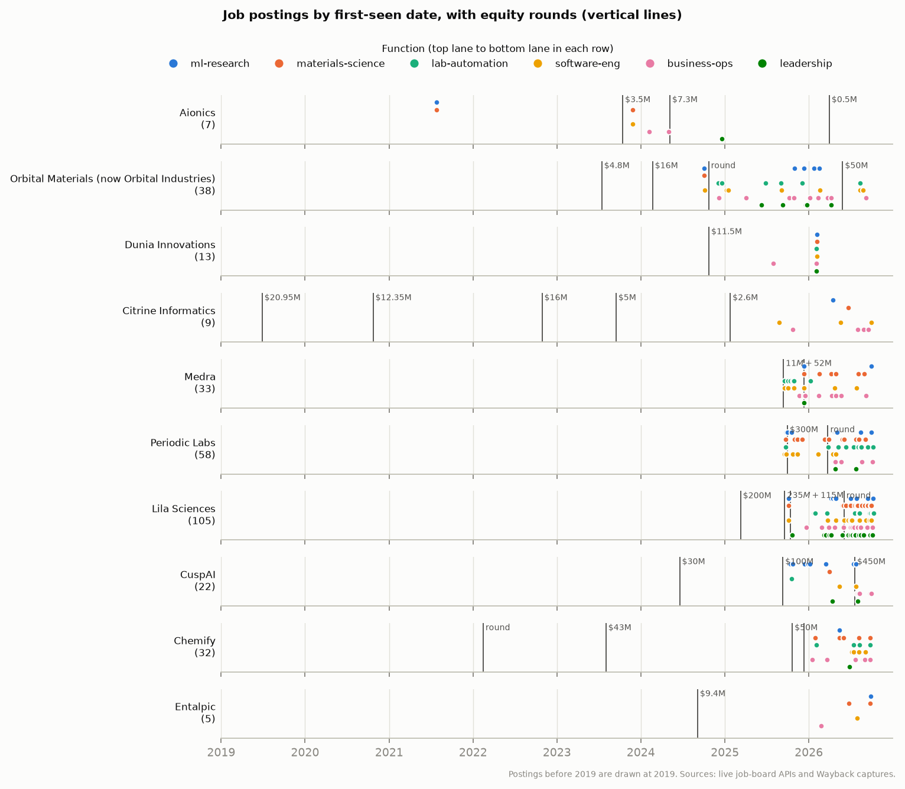

# Job postings: generated tables

Generated by `python scripts/startup_landscape/jobs.py build` from `data/job_postings.jsonl`. The findings are in [README.md](README.md); each company's postings and descriptions are on its own page.

## Coverage

| Company | Postings | With description | Open on 2026-10-10 | First seen | Last first-seen | Evidence |
|---|---|---|---|---|---|---|
| [Lila Sciences](lila-sciences.md) | 105 | 105 | 105 | 2025-10-06 | 2026-10-09 | live 105 |
| [Periodic Labs](periodic-labs.md) | 58 | 55 | 33 | 2025-09-18 | 2026-10-07 | live 33, wayback 43 |
| [Orbital Materials (now Orbital Industries)](orbital-materials.md) | 38 | 25 | 7 | 2024-10-02 | 2026-09-08 | live 7, wayback 32 |
| [Medra](medra.md) | 33 | 27 | 15 | 2025-09-17 | 2026-10-01 | live 15, wayback 26 |
| [Chemify](chemify.md) | 32 | 25 | 32 | 2026-01-16 | 2026-09-26 | live 32 |
| [CuspAI](cuspai.md) | 22 | 15 | 12 | 2025-10-14 | 2026-09-30 | live 12, wayback 15 |
| [Dunia Innovations](dunia-innovations.md) | 13 | 13 | 13 | 2025-07-29 | 2026-02-06 | live 13 |
| [Citrine Informatics](citrine-informatics.md) | 9 | 9 | 4 | 2025-08-25 | 2026-10-01 | live 4, wayback 5 |
| [Aionics](aionics.md) | 7 | 5 | 7 | 2021-07-27 | 2024-12-18 | live 7 |
| [Entalpic](entalpic.md) | 5 | 4 | 5 | 2026-02-23 | 2026-09-28 | live 5 |
| [Mitra Chem](mitra-chem.md) | 1 | 1 | 1 | 2026-10-10 | 2026-10-10 | live 1 |
| [Tetsuwan Scientific](tetsuwan-scientific.md) | 2 | 2 | 2 | 2026-06-03 | 2026-06-03 | live 2 |

**Total:** 325 postings, 286 with a description.

## The first roles each company posted

Postings first seen within 60 days of the company's earliest posting on record. For companies whose board was archived from the start, this is the founding hiring plan; for older companies it is only where the record begins.

| Company | Earliest posting | Roles in the first 60 days |
|---|---|---|
| Aionics | 2021-07-27 | Materials Informatics (Data Science) Intern, Undergraduate Level; Materials Informatics Intern, Ph.D. Level |
| Orbital Materials (now Orbital Industries) | 2024-10-02 | Full Stack Software Engineer; Researcher (Generative Models & Simulation); Researcher (LLMs) |
| Dunia Innovations | 2025-07-29 | Business Development Manager |
| Citrine Informatics | 2025-08-25 | Customer Success Manager L3; Research Engineering Manager |
| Medra | 2025-09-17 | Forward Deployed Robotics Engineer; Full Stack Software Engineer; Full Stack Software Engineer - Summer 2026 Internship; Full Stack Software Engineer - Winter 2026 Internship; Mechanical Engineer; Mechanical Engineer - Winter 2026 Internship; Robotics Software Engineer; Robotics Software Engineer - Summer 2026 Internship; Robotics Software Engineer - Winter 2026 Internship |
| Periodic Labs | 2025-09-18 | Automation Engineer; CUDA Kernel Engineer; Controls Engineer; Distributed Training Engineer; Facilities Manager; LLM Inference Engineer; Lead IT Engineer; Mechanical Engineer; Product Engineer; Reliability Engineer; Research Engineer - Midtraining; Research Engineer - Posttraining; Research Engineer, Lab Automation; Research Scientist, Condensed Matter Theory; Research Scientist, Materials Characterization; Research Scientist, Thin Films; Robotics Engineer; Supercompute Infrastructure Engineer; Systems Engineer |
| Lila Sciences | 2025-10-06 | Director of Product, Life Sciences (Chemistry); Senior / Engineer II, AI Lab Research Engineer; Senior Software Engineer, Applied AI; Software Engineer, AI Platform; Staff Forward Deployed Engineer, Life Sciences; Staff Forward Deployed Engineer, Physical Sciences (Level Flexible) |
| CuspAI | 2025-10-14 | Application Scientist (Lab Automation & Informatics); Applied AI/ML Engineer (Agents); Applied AI/ML Engineer (Materials Foundational Models); ML Infrastructure Engineer (ML Platform) |
| Chemify | 2026-01-16 | Analytical Technician; Production Chemist (Dispensary); Project Manager; Senior/ Staff Analytical Technician |
| Entalpic | 2026-02-23 | Stay up to date for any new positions ! |
| Tetsuwan Scientific | 2026-06-03 | Product Designer; Software Engineer |
| Mitra Chem | 2026-10-10 | Lab Technician |

## What the descriptions ask for, by function

Share of postings with a description that name each degree anywhere in the text ("PhD or equivalent experience" counts as naming a PhD), the median of the smallest "N+ years" figure in each description, and the skills most often named. Python is left out of the skills column because nearly every technical posting names it.

| Function | Postings with text | Name a PhD | Name a master's | Name a bachelor's | Median min. years | Most-named skills |
|---|---|---|---|---|---|---|
| ml-research | 39 | 41% | 28% | 8% | 4 | LLMs (49%), RL (36%), PyTorch (28%), JAX (28%), Bayesian opt./active learning (28%), publications (28%) |
| materials-science | 48 | 77% | 42% | 23% | 3 | synthesis (27%), robotics (25%), thin films/vacuum (25%), LIMS/ELN (21%), publications (19%), EHS/safety (19%) |
| lab-automation | 56 | 18% | 16% | 30% | 5.0 | robotics (61%), EHS/safety (46%), synthesis (30%), CAD/mechanical design (30%), thin films/vacuum (30%), PLC/controls (21%) |
| software-eng | 55 | 9% | 25% | 33% | 5.0 | Kubernetes/cloud (44%), robotics (40%), SQL/databases (36%), TypeScript/React (33%), EHS/safety (16%), PyTorch (15%) |
| business-ops | 57 | 14% | 16% | 30% | 5 | robotics (19%), LLMs (9%), SQL/databases (7%), LIMS/ELN (7%), publications (7%), synthesis (7%) |
| leadership | 31 | 45% | 19% | 10% | 8.0 | synthesis (32%), robotics (29%), LLMs (29%), EHS/safety (13%), Bayesian opt./active learning (10%), electrochemistry (6%) |

## Functions over time

Postings by the half-year they were first seen.

| Half-year | ml-research | materials-science | lab-automation | software-eng | business-ops | leadership | total |
|---|---|---|---|---|---|---|---|
| 2021H2 | 1 | 1 | 0 | 0 | 0 | 0 | 2 |
| 2023H2 | 0 | 1 | 0 | 1 | 0 | 0 | 2 |
| 2024H1 | 0 | 0 | 0 | 0 | 2 | 0 | 2 |
| 2024H2 | 1 | 1 | 4 | 1 | 1 | 1 | 9 |
| 2025H1 | 0 | 0 | 1 | 2 | 1 | 1 | 5 |
| 2025H2 | 15 | 6 | 17 | 13 | 8 | 5 | 64 |
| 2026H1 | 17 | 20 | 10 | 23 | 22 | 13 | 105 |
| 2026H2 | 15 | 25 | 31 | 21 | 30 | 14 | 136 |
