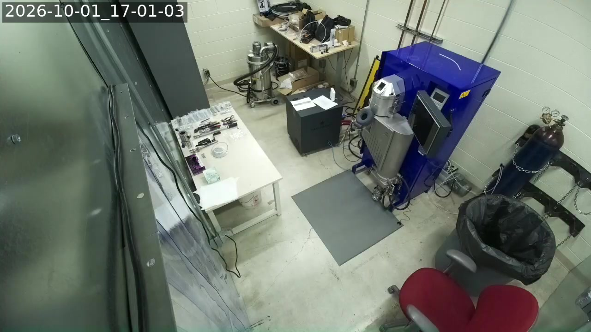
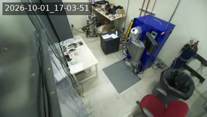

# Stream cams

The lab's livestream cameras run the Acceleration Consortium
[picam client](https://ac-training-lab.readthedocs.io/en/latest/devices/picam.html)
(`device.py` from `AccelerationConsortium/ac-training-lab`), which pipes `rpicam-vid`
into `ffmpeg` and pushes RTMP to the *BYU VCL Hardware Streams* YouTube channel. Each
camera's settings live on its Pi, in a file that also holds a secret, so none of it is
in this repo. This page records what is set and what has been changed.

## `picam-ot2`: now pointed at the atomizer room

| | |
| --- | --- |
| Pi | Raspberry Pi Zero 2 W behind `OT2_STREAM_CAM_HOSTNAME` (user `OT2_STREAM_CAM_USERNAME`, sudo password `OT2_STREAM_CAM_PASSWORD`), Camera Module 3 (imx708), Debian 13 |
| Points at | the atomizer room, as of 2026-10-01, **not the OT-2**. It still streams as `CAM_NAME = "picam-ot2"` and `WORKFLOW_NAME = "OT-2"`, so broadcasts are titled *OT-2 stream picam-ot2, …* and go into the *OT-2 Livestreams Playlist* (`PLdKz1vXA-rfQ`). The robot itself is cabled to the Pi behind `RPI_STREAM_CAM_HOSTNAME` ([`wireless-color-sensor/ot2/README.md`](../wireless-color-sensor/ot2/README.md#run-it)) |
| Client | `~/ac-training-lab/src/ac_training_lab/picam/device.py`, upstream `87a3ccb` plus a local patch (`SENSOR_MODE`, and a 2 s keyframe interval on the libx264 path), run by `device.service` |
| Settings | `my_secrets.py` in the same directory, mode `600`. It also holds the Lambda URL, so read individual lines rather than `cat` it |
| Watchdog | `stream-watchdog.timer` runs `/usr/local/bin/stream-watchdog.sh` every minute. It restarts `device.service` after 3 checks in a row with no RTMP bytes acknowledged, at most 6 times a day by default |
| Reboots | root crontab, `0 5,13,21 * * *`. Each boot starts a fresh broadcast from whatever `my_secrets.py` says |

### Current settings

| Setting | Value |
| --- | --- |
| `RESOLUTION` | `"240p"` (426×240). Was `"720p"` until 2026-10-01, see [Change log](#change-log) |
| `FRAME_RATE` | `10` |
| `SENSOR_MODE` | `"2304:1296"`, the full-field binned imx708 mode. Without it the sensor picks a cropped mode for small outputs |
| `TIMESTAMP_OVERLAY` | `True`: lab local time, top left. This also forces the libx264 re-encode |
| `CAMERA_VFLIP` / `CAMERA_HFLIP` | `True` / `True` (the camera is mounted upside down) |
| `CAMERA_ROTATION` | `0` |
| `PRIVACY_STATUS` | `"public"` |

### Changing a setting

Edit the one line, then restart once:

```bash
ssh "$OT2_STREAM_CAM_USERNAME@$OT2_STREAM_CAM_HOSTNAME" \
  'cd ~/ac-training-lab/src/ac_training_lab/picam &&
   sed -i "s/^RESOLUTION = .*/RESOLUTION = \"240p\"/" my_secrets.py &&
   grep -n "^RESOLUTION" my_secrets.py &&
   sudo -S -p "" systemctl restart device.service' <<< "$OT2_STREAM_CAM_PASSWORD"
```

`device.py` reads `my_secrets.py` only when it starts, so nothing changes until the
restart. A restart ends the current broadcast and creates a new one with a new video ID, and the
stream is off the air for 20–30 s while that happens. Every start also counts against `device.service`'s
`StartLimitBurst=3` per hour, so don't restart in a loop. If systemd does give up, the
watchdog starts the unit again after 10 minutes.

`RESOLUTION` accepts `144p`, `240p`, `360p`, `480p`, `720p` and `1080p`. The overlay font
scales as `max(16, height // 20)`: 36 px at 720p, 16 px at 240p.

### Change log

| When (MDT) | Change | Why |
| --- | --- | --- |
| 2026-10-01 17:01 | `RESOLUTION` `"720p"` → `"240p"`, then one restart of `device.service` | [#250](https://github.com/vertical-cloud-lab/byu-vcl/issues/250) |

Measured on either side of that change. The "before" figures are averages over the 720p
pipeline's 3 h 15 min run, and the "after" figures cover its first 5 minutes:

| | 720p (before) | 240p (after) |
| --- | --- | --- |
| `rpicam-vid` output | 1280×720 | 426×240 |
| ffmpeg CPU (of 400 %) | 111 % | 23 % |
| ffmpeg memory (of 415 MB) | 31 % | 18 % |
| Load average, 1 min | 1.29 | 0.36 |
| SoC temperature | 61.8 °C | 51.5 °C |
| Upload to YouTube | 2.54 Mbit/s | 0.29 Mbit/s |
| Renditions YouTube serves | up to 1280×720 (format 232) | 426×240 (229) and 256×144 (269) |
| Broadcast | [`3zjB1Q9Je_o`](https://www.youtube.com/watch?v=3zjB1Q9Je_o) (ended by the restart) | [`KhqPemW8hhc`](https://www.youtube.com/watch?v=KhqPemW8hhc) |

Upload is RTMP bytes acknowledged by YouTube, read with `ss -tin`, which is the counter
the watchdog also uses. That was 3.72 GB over the 720p socket's life, and 2.14 MB over
60 s at 240p. The Wi‑Fi signal was −61 dBm before the change. The renditions are from `yt-dlp -F`, run on
the other stream-cam Pi because YouTube refuses player extraction from a CI runner. The
watchdog logged no failed checks after the restart.

The view and overlay are the same in both, with the full field of view kept at 240p:

| 720p, before | 240p, after |
| --- | --- |
|  |  |

**The archive tooling assumes 720p.** `wireless-color-sensor/ot2/stream_grab_pi.py` asks
yt-dlp for format `232` (720p). Broadcasts from this camera after 2026-10-01 23:01 UTC do
not have that format, and their top rendition is `229`. `frames_from_stream.py`'s
`OVERLAY_CROP` likewise assumes the size of the 720p overlay. Both still work on the
earlier 720p archives, such as the 2026-09-09 colour session.

**Not yet observed:** a scheduled reboot after the change. The first is at 21:00 MDT on
2026-10-01. It should come back at 240p, since the setting is in the file, but nobody has
watched one do so yet.

Older records for this Pi are not on `main` yet:

- the original setup: [#172](https://github.com/vertical-cloud-lab/byu-vcl/issues/172), `docs/ot2-stream-cam.md` on branch `claude/issue-172-20260731-0633`
- the NetworkManager ACD change: [#237](https://github.com/vertical-cloud-lab/byu-vcl/issues/237), branch `claude/issue-237-20260926-0939`
- copies of the watchdog: [#202](https://github.com/vertical-cloud-lab/byu-vcl/pull/202), `wireless-color-sensor/ot2/livestream-pi/`
