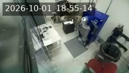
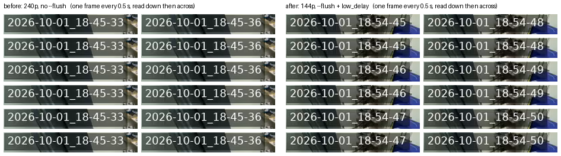

# Stream cams

The lab's livestream cameras run the Acceleration Consortium
[picam client](https://ac-training-lab.readthedocs.io/en/latest/devices/picam.html)
(`device.py` from `AccelerationConsortium/ac-training-lab`), which pipes `rpicam-vid`
into `ffmpeg` and pushes RTMP to the *BYU VCL Hardware Streams* YouTube channel. Each
camera's settings live on its Pi, in a file that also holds a secret, so none of it is
in this repo. This page records what is set and what has been changed.

## `picam-ot2`: now pointed at the atomizer room

| | |
| --- | --- |
| Pi | Raspberry Pi Zero 2 W behind `OT2_STREAM_CAM_HOSTNAME` (user `OT2_STREAM_CAM_USERNAME`, sudo password `OT2_STREAM_CAM_PASSWORD`), Camera Module 3 (imx708), Debian 13 |
| Points at | the atomizer room, as of 2026-10-01, **not the OT-2**. It streams as `CAM_NAME = "picam-ot2"` and `WORKFLOW_NAME = "atomizer"`, so broadcasts are titled *atomizer stream picam-ot2, …* and go into the [*atomizer Livestreams Playlist*](https://www.youtube.com/playlist?list=PLeosQpHvsjiY) (`PLeosQpHvsjiY`). Until 2026-10-01 17:38 MDT the workflow was `OT-2`, whose broadcasts the Lambda files into the *OT-2 Livestreams Playlist* (`PLdKz1vXA-rfQ`). The robot itself is cabled to the Pi behind `RPI_STREAM_CAM_HOSTNAME` ([`wireless-color-sensor/ot2/README.md`](../wireless-color-sensor/ot2/README.md#run-it)) |
| Client | `~/ac-training-lab/src/ac_training_lab/picam/device.py`, upstream `87a3ccb` plus a local patch, run by `device.service`. The patch adds `SENSOR_MODE`, and on the libx264 path a 2 s keyframe interval and (since 2026-10-01) `-r FRAME_RATE`. Since 2026-10-01 18:52 it also passes `--flush` to `rpicam-vid` and `-flags low_delay` to ffmpeg's video input; see [The overlay that skipped seconds](#the-overlay-that-skipped-seconds). The file before the `-r` change is `~/device.py.bak-2026-10-01`, and before the `--flush` change `~/device.py.bak-2026-10-01-flush` |
| Settings | `my_secrets.py` in the same directory, mode `600`. It also holds the Lambda URL, so read individual lines rather than `cat` it |
| Watchdog | `stream-watchdog.timer` runs `/usr/local/bin/stream-watchdog.sh` every minute. It restarts `device.service` after 3 checks in a row with no RTMP bytes acknowledged, at most 6 times a day by default |
| Reboots | root crontab, `0 5,13,21 * * *`. Each boot starts a fresh broadcast from whatever `my_secrets.py` says |

### Current settings

| Setting | Value |
| --- | --- |
| `CAM_NAME` | `"picam-ot2"` |
| `WORKFLOW_NAME` | `"atomizer"`. Was `"OT-2"` until 2026-10-01, see [Renaming the workflow](#renaming-the-workflow) |
| `RESOLUTION` | `"144p"` (256×144). Was `"720p"` until 2026-10-01 17:01 and `"240p"` until 18:52, see [Change log](#change-log) |
| `FRAME_RATE` | `2`. Was `10` until 2026-10-01 |
| `SENSOR_MODE` | `"2304:1296"`, the full-field binned imx708 mode. Without it the sensor picks a cropped mode for small outputs |
| `TIMESTAMP_OVERLAY` | `True`: lab local time, top left. This also forces the libx264 re-encode |
| `CAMERA_VFLIP` / `CAMERA_HFLIP` | `True` / `True` (the camera is mounted upside down) |
| `CAMERA_ROTATION` | `0` |
| `PRIVACY_STATUS` | `"public"` |

### Changing a setting

Edit the one line, then restart once:

```bash
ssh "$OT2_STREAM_CAM_USERNAME@$OT2_STREAM_CAM_HOSTNAME" \
  'cd ~/ac-training-lab/src/ac_training_lab/picam &&
   sed -i "s/^RESOLUTION = .*/RESOLUTION = \"144p\"/" my_secrets.py &&
   grep -n "^RESOLUTION" my_secrets.py &&
   sudo -S -p "" systemctl restart device.service' <<< "$OT2_STREAM_CAM_PASSWORD"
```

`device.py` reads `my_secrets.py` only when it starts, so nothing changes until the
restart. A restart ends the current broadcast and creates a new one with a new video ID, and the
stream is off the air for 20–30 s while that happens. Every start also counts against `device.service`'s
`StartLimitBurst=3` per hour, so don't restart in a loop. `systemctl reset-failed device.service`
zeroes that count, if a third restart within the hour can't wait. If systemd does give up, the
watchdog starts the unit again after 10 minutes.

`RESOLUTION` accepts `144p`, `240p`, `360p`, `480p`, `720p` and `1080p`. The overlay font
scales as `max(16, height // 20)`: 36 px at 720p, 16 px at 240p and 144p. At 144p the
timestamp's box covers about three quarters of the frame's width.

**Read the `Output #0` line after changing `FRAME_RATE`.** ffmpeg takes its output rate from
its own estimate of the piped input's rate (the `tbr` on the `Input #1` line), and at low rates
that estimate wanders. The first start at `FRAME_RATE = 2` estimated 1.50, so ffmpeg sent
1.5 fps and dropped a quarter of the frames. The next start estimated 2. At 10 fps the estimate
was 20 and ffmpeg still sent 10, which is why this never showed before. The `-r FRAME_RATE` in
the local patch pins the output to the camera's rate whatever the estimate, so expect
`Output #0 … 2 fps`.

**`systemctl status device.service` prints the stream key.** Its process list shows ffmpeg's
full command line, RTMP URL and all. The journal's `Streaming to:` and `create` response lines
carry it too. For the unit's state use `systemctl show device.service -p ActiveState -p SubState
-p ActiveEnterTimestamp -p NRestarts`, and pipe journal output through
`sed -E 's#live2/[A-Za-z0-9_-]+#live2/<key>#g'`.

### Renaming the workflow

The Lambda ([`vertical-cloud-lab/streamingLambda`](https://github.com/vertical-cloud-lab/streamingLambda/blob/05eb749/chalicelib/ytb_api_utils.py))
matches on `WORKFLOW_NAME` twice per start. Both matches are case-insensitive substring
matches:

- `end` completes every live broadcast whose *title* contains the name.
- `create` adds the new broadcast to the first playlist whose *title* contains the name. It
  creates `"<name> Livestreams Playlist"` only if no title does.

That has two consequences for a rename:

- **End the old name's broadcast yourself.** On start, the device only ends broadcasts that
  match the new name. Broadcasts are created with `enableAutoStop` off, so without this step
  the old one would sit "live" with no video coming in. Stop the service, end the old
  broadcast with the device's own call, then start the service again:

  ```bash
  cd ~/ac-training-lab/src/ac_training_lab/picam
  venv/bin/python -c "from device import call_lambda; call_lambda('end', 'picam-ot2', 'OT-2')"
  ```

- **A name that looks unused may still match a playlist.** The channel's Playlists tab, and
  yt-dlp's listing of it, leave some public playlists out. The atomizer one is among them.
  A fragment also matches: `doser` would put broadcasts in the powder doser's playlist. The
  complete list is `playlists.list(mine=True)` with the channel's own credentials, which is
  what the Lambda uses.

### Change log

| When (MDT) | Change | Why |
| --- | --- | --- |
| 2026-10-01 17:01 | `RESOLUTION` `"720p"` → `"240p"`, then one restart of `device.service` | [#250](https://github.com/vertical-cloud-lab/byu-vcl/issues/250) |
| 2026-10-01 17:38 | `WORKFLOW_NAME` `"OT-2"` → `"Atomizer"` and `FRAME_RATE` `10` → `2`. Stopped the service, ended the OT-2 broadcast `KhqPemW8hhc` [by hand](#renaming-the-workflow), started it | [#252](https://github.com/vertical-cloud-lab/byu-vcl/pull/252#issuecomment-5942678722) |
| 2026-10-01 17:44 | `WORKFLOW_NAME` `"Atomizer"` → `"atomizer"`, to match the existing playlist's title and `powder doser`. `device.py` gains `-r FRAME_RATE`. `reset-failed`, then one restart | ffmpeg was sending 1.5 fps, see [above](#changing-a-setting) |
| 2026-10-01 18:52 | `RESOLUTION` `"240p"` → `"144p"`. `device.py` gains `rpicam-vid --flush` and ffmpeg `-flags low_delay`. One restart | [#252](https://github.com/vertical-cloud-lab/byu-vcl/pull/252#issuecomment-5943385687): 144p, and the overlay was jumping several seconds at a time |

#### 720p → 240p

Measured on either side of that change. The "before" figures are averages over the 720p
pipeline's 3 h 15 min run, and the "after" figures cover its first 5 minutes:

| | 720p (before) | 240p (after) |
| --- | --- | --- |
| `rpicam-vid` output | 1280×720 | 426×240 |
| ffmpeg CPU (of 400 %) | 111 % | 23 % |
| ffmpeg memory (of 415 MB) | 31 % | 18 % |
| Load average, 1 min | 1.29 | 0.36 |
| SoC temperature | 61.8 °C | 51.5 °C |
| Upload to YouTube | 2.54 Mbit/s | 0.29 Mbit/s |
| Renditions YouTube serves | up to 1280×720 (format 232) | 426×240 (229) and 256×144 (269) |
| Broadcast | [`3zjB1Q9Je_o`](https://www.youtube.com/watch?v=3zjB1Q9Je_o) (ended by the restart) | [`KhqPemW8hhc`](https://www.youtube.com/watch?v=KhqPemW8hhc) |

Upload is RTMP bytes acknowledged by YouTube, read with `ss -tin`, which is the counter
the watchdog also uses. That was 3.72 GB over the 720p socket's life, and 2.14 MB over
60 s at 240p. The Wi‑Fi signal was −61 dBm before the change. The renditions are from `yt-dlp -F`, run on
the other stream-cam Pi because YouTube refuses player extraction from a CI runner. The
watchdog logged no failed checks after the restart.

The view and overlay are the same in both, with the full field of view kept at 240p:

| 720p, before | 240p, after |
| --- | --- |
|  |  |

#### 10 fps → 2 fps, and the `atomizer` workflow

Both columns are at 240p. The 10 fps figures average over that pipeline's first 35 minutes,
and the 2 fps ones over its first 3:

| | 10 fps (before) | 2 fps (after) |
| --- | --- | --- |
| ffmpeg output | 10 fps, keyframe every 20 frames | 2 fps, keyframe every 4 frames (2 s in both) |
| ffmpeg CPU (of 400 %) | 23 % | 12 % |
| `rpicam-vid` CPU | 5.0 % | 1.2 % |
| SoC temperature | 49.4 °C | 46.2 °C |
| Upload to YouTube, over 60 s | 0.30 Mbit/s | 0.18 Mbit/s |
| Broadcast | [`KhqPemW8hhc`](https://www.youtube.com/watch?v=KhqPemW8hhc), workflow `OT-2` | [`Lf4QFrrJ-lA`](https://www.youtube.com/watch?v=Lf4QFrrJ-lA), workflow `atomizer` |

Upload falls less than the frame rate does because the keyframe interval stays at 2 s, so at
2 fps one frame in four is a keyframe. ffmpeg's own counter read 439 frames in 219.5 s,
i.e. 2.0 fps. YouTube still serves 30 fps renditions (`229` and `269`), and repeats each
picture to fill them. The watchdog logged no failed checks after either restart.

That 2.0 fps was not 2 new pictures a second. ffmpeg met its rate by repeating frames, and the
overlay jumped 3–4 s at a time; see [The overlay that skipped seconds](#the-overlay-that-skipped-seconds).
A check made at the time compared consecutive decoded frames from YouTube and reported a new
picture every 0.5 s. It was wrong: re-encoding makes a repeated picture differ slightly from the
last, so comparing pixels cannot tell a repeat from a new frame. Reading the overlay can.

The intermediate broadcast [`TZ79Tej1hHY`](https://www.youtube.com/watch?v=TZ79Tej1hHY)
(17:38–17:44, titled *Atomizer …*) is the one that went out at 1.5 fps.

**The atomizer playlist already existed.** *atomizer Livestreams Playlist* (`PLeosQpHvsjiY`,
public) was made for this camera's move into the atomizer enclosure on 2026-09-29. Its
description says so, but it is missing from the channel's Playlists tab. The Lambda matched
the new name to it, so broadcasts now go straight there. Every OT-2 broadcast from
2026-09-29 15:27 UTC to `KhqPemW8hhc` was already in it. The Pi's journal shows the Lambda
filed each of them into the OT-2 playlist, so something else moved them. `KhqPemW8hhc` was
moved within 40 minutes of its creation. Nothing on either stream-cam Pi does that (no cron
jobs or timers, no playlist code), so it is somewhere else, or done by hand. With the rename
it has nothing left to move.

**The archive tooling assumes 720p.** `wireless-color-sensor/ot2/stream_grab_pi.py` asks
yt-dlp for format `232` (720p), and so does `~/ytframes/grab.py` on the other stream-cam Pi.
Broadcasts from this camera after 2026-10-01 23:01 UTC do not have that format. Their top
rendition is `229` (426×240), which after 2026-10-02 00:53 UTC is YouTube's upscale of the
144p feed; `269` (256×144) is the native one. `frames_from_stream.py`'s `OVERLAY_CROP` likewise
assumes the size of the 720p overlay. Both still work on the earlier 720p archives, such as the
2026-09-09 colour session. At 2 fps a frame grabbed at a given offset can be up to 0.5 s old,
and on this camera's 2 fps broadcasts before 2026-10-02 00:53 UTC the overlay is not a
reliable clock.

#### 240p → 144p

Both columns are at 2 fps under `atomizer`, and both were measured the same way, over 60 s,
about an hour into the 240p pipeline and 2 minutes into the 144p one:

| | 240p (before) | 144p (after) |
| --- | --- | --- |
| ffmpeg output | 426×240, 2 fps | 256×144, 2 fps |
| Camera frames ffmpeg dropped, and copies it sent instead | 2,892 and 2,893 of 8,144, over the whole 68 min | none in 2,989, the first 25 min |
| ffmpeg CPU (of 400 %) | 12.3 % | 9.5 % |
| `rpicam-vid` CPU | 1.1 % | 1.1 % |
| ffmpeg memory (RSS) | 67 MB | 61 MB |
| SoC temperature | 46.0 °C | 45.8 °C |
| Upload to YouTube | 0.18 Mbit/s | 0.07 Mbit/s |
| Renditions YouTube serves | `229` (426×240), `269` (256×144) | the same two; `229` is now an upscale |
| Broadcast | [`Lf4QFrrJ-lA`](https://www.youtube.com/watch?v=Lf4QFrrJ-lA) (ended by the restart) | [`osNAv6qmots`](https://www.youtube.com/watch?v=osNAv6qmots) |

The 144p column also has `--flush` and `low_delay`, described next. Neither adds work:
`--flush` changes when the camera's output leaves, and `low_delay` how ffmpeg schedules decoding.



#### The overlay that skipped seconds

At 2 fps the overlay stood still for 3–4 s and then jumped. In 60 s of the live 240p rendition,
read frame by frame with tesseract, it showed 21 distinct times; 15 of the 20 steps between
them were 3 or 4 s. In 60 s at 144p after the fix it shows every second, about 2 frames each.
Below, one frame every 0.5 s from each sample, decoded in order from YouTube's HLS segments:



**Cause: `rpicam-vid` buffered its output.** With `-o -` it `fwrite`s each frame to stdout,
and stdout into a pipe is block-buffered unless `--flush` is given: nothing reaches ffmpeg
until 4 KB has piled up. At 240p and 2 fps a P-frame was about 700 bytes, so ffmpeg read 4096
bytes every 2.5–3.5 s, about six frames at once (read from `/proc/<pid>/io` over 20 s).

- drawtext's `localtime` is the wall clock when a frame passes the filter, not when the
  camera took it. Every frame of a batch got the same second, and the clock jumped by the gap.
- `-use_wallclock_as_timestamps` likewise gave a batch one timestamp, so `-vsync cfr` kept one
  frame per output slot and filled the empty slots with copies. Over the 68 minutes of the
  2 fps, 240p pipeline, ffmpeg dropped 2,892 of the camera's frames and duplicated 2,893 to
  replace them, about a third of everything. The picture froze along with the clock.

It went unnoticed at 720p and 10 fps, presumably because bigger, more frequent frames filled
the buffer within about a frame; frame sizes from then were not measured, and neither was the
240p, 10 fps stretch (17:01–17:38). At 144p a P-frame is about 100 bytes, so without the fix a
batch would have been about 40 frames, or 20 s.

**Fix: `--flush`, plus `-flags low_delay`.** `--flush` makes `rpicam-vid` flush after every
frame. On its own that stops the jumps but leaves the overlay late, because ffmpeg's H.264
decoder runs 5 frame threads on 4 cores and holds back 4 frames. `-flags low_delay`, as an
input option, turns frame threading off. What remains is one frame, since ffmpeg's parser
must see the start of the next frame before it can pass one on. Offline, a copy of this
pipeline (ffmpeg 7.1.5, as on the Pi) was fed 2 fps 256×144 H.264 frames of about 650 bytes
on a 4-core runner, and timed each frame from its write to the filter:

| `rpicam-vid` output | Overlay late by | Seconds skipped |
| --- | --- | --- |
| buffered (4 KB), as before | 2.5–5.5 s, varying | 6 of 10 |
| `--flush` | 2.50 s (5 frames) | none |
| `--flush` + `low_delay` | 0.50 s (1 frame) | none |

`-threads 1` in place of `low_delay` measured the same. On the Pi, ffmpeg now reads from the
pipe every 0.49–0.51 s, 40 times in 20 s. Its progress line has carried no `dup=` or `drop=`
since the restart, which it prints only once one of them is non-zero.

The overlay now trails the moment the camera took the frame by about one frame: 0.5 s at
2 fps. Earlier archives trailed by at least 5 frames (1 for the parser, 4 for the decoder
threads), which at 10 fps is 0.5 s, plus any batching. That is inferred from the same
mechanism, not measured on those archives.

`rpicam-vid`'s own log goes into the video pipe, not the journal. `device.py` starts it with
`stderr=subprocess.STDOUT`, which joins its stderr to the stdout that feeds ffmpeg. That is
why the journal has no camera messages. ffmpeg's H.264 parser skips text between frames, and
the journal shows no decode errors since 17:44.

**Not yet observed:** a scheduled reboot after these changes. The first is at 21:00 MDT on
2026-10-01. It should come back as `atomizer` at 144p and 2 fps, with the flush fix, since
the settings are in `my_secrets.py` and the fix is in `device.py`, but nobody has watched one
do so yet.

Older records for this Pi are not on `main` yet:

- the original setup: [#172](https://github.com/vertical-cloud-lab/byu-vcl/issues/172), `docs/ot2-stream-cam.md` on branch `claude/issue-172-20260731-0633`
- the NetworkManager ACD change: [#237](https://github.com/vertical-cloud-lab/byu-vcl/issues/237), branch `claude/issue-237-20260926-0939`
- copies of the watchdog: [#202](https://github.com/vertical-cloud-lab/byu-vcl/pull/202), `wireless-color-sensor/ot2/livestream-pi/`
