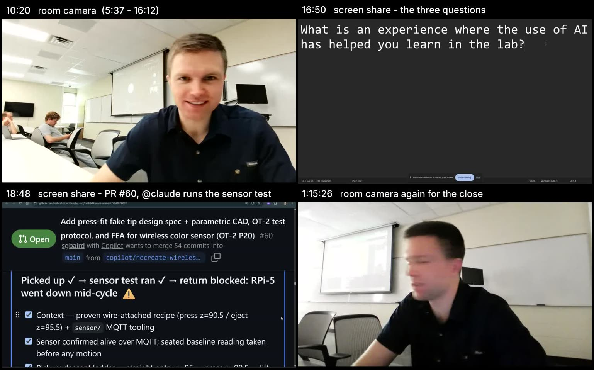

# VCL weekly group meeting — 2026-08-19 — recording artifacts

Recording of the weekly group meeting on high-level thoughts about the use of AI in the lab
([issue #183](https://github.com/vertical-cloud-lab/byu-vcl/issues/183); compilation in
[`../ai-in-the-lab.md`](../ai-in-the-lab.md)).

## Source

- **Original recording**: `VCL weekly group meeting-20260819_160112UTC-Meeting Recording.mp4`
  on Sterling's BYU OneDrive —
  [SharePoint/Stream share link](https://byu-my.sharepoint.com/:v:/g/personal/sbaird9_byu_edu/IQAhCotWVHEJQ4FQHXVHsz1VASzsf4iyN8yh_-5Clg94V58?e=au0TVR).
  75:34 (4534.7 s), 1920×1080 H.264 @ 16 fps, 16 kHz mono AAC, 453.7 MiB.
  Recorded 2026-08-19 16:01–17:16 UTC.
- **YouTube upload (unlisted)**:
  [VCL weekly group meeting - High-level thoughts about use of AI in the lab](https://youtu.be/f5_cQvuNKnA)
  — 62:01, published 2026-08-20 on the BYU Vertical Cloud Lab channel. It is ~13.5 min
  shorter than the original, so chapter times below (original timeline) shift accordingly.

The share link is anonymously accessible (verified 2026-08-20 from a GitHub Actions
runner — no BYU sign-in or residential IP needed). To re-download the original file:
`yt-dlp -f source "<share link>"` (the `source` format is the pristine MP4).

## What the video actually shows

Classifying every second of the original 75:34 recording by the mean luma of the main
region (`ffmpeg ... signalstats`, cross-checked on frames) gives the shot list below.
Sterling is screen sharing for **59 of the 75 minutes** — he announces it at 13:37
("I'm just going to screen share the…"), 15:20 and 16:04, and the Chrome
"teams.microsoft.com is sharing your screen" bar is visible along the bottom of the frame
throughout.



| Original timeline | On screen |
|---|---|
| 0:00 – 5:37 | avatar tiles / black — people joining |
| 5:37 – 16:12 | room camera, full frame (the in-person half of the room) |
| 16:12 – 20:21 | screen share: GitHub discussion [#178](https://github.com/vertical-cloud-lab/byu-vcl/discussions/178), then the three questions in a 500 %-zoom text editor (16:44 – 17:13), then the discussion thread and PR [#60](https://github.com/vertical-cloud-lab/byu-vcl/pull/60) with the `@claude` sensor-test run |
| 20:21 – 20:36 | room camera |
| 20:36 – 33:32 | screen share: the discussion thread (the powder-doser generative-CAD comment at 21:40), Tactiq at ~20:25 |
| 33:32 – 34:17 | room camera |
| 34:17 – 1:15:22 | screen share: his Teams window for the whole online breakout — Audrey on webcam when she speaks, Carl camera-off, the shared question text on the stage |
| 1:15:22 – 1:15:34 | room camera again, for the closing lines |

⚠️ **Credentials on screen.** At ~18:37 the shared screen shows a Colab notebook whose code
cell and parameter form contain live MQTT broker credentials (host, user, password). They
are in the original recording and therefore in the unlisted YouTube upload; the reels
render a black `screen redacted` box over that window (see [`reels/README.md`](reels/README.md)),
but the credentials are worth rotating regardless.

## Files in this directory

| File | Description |
|---|---|
| `transcript.vtt` | Teams meeting transcript, WebVTT as served by Stream |
| `transcript.json` | Same transcript, structured entries with speaker IDs and confidences |
| `transcript.txt` | Readable rendering, one line per utterance (`[HH:MM:SS] @speaker: text`) |
| `chapters.txt` | Derived chapter markers in YouTube-description format (original 75:34 timeline) |
| `audrey-carl-clip.vtt` | Captions re-timed for the extracted Audrey & Carl discussion clip |
| [`highlights/`](highlights/) | Edited 9:57 highlights compilation of the meeting + all eight pair discussions — EDL, render script, captions (incl. whisper captions for the seven breakout clips), chapters, contact-sheet preview (the MP4 itself is on the draft release and the Pi) |
| [`reels/`](reels/) | Seven vertical (1080×1920) "reels": one <60 s cut per breakout session, a group-discussion reel, and an everything reel — filler-word micro-edits, word-synced on-screen text (next-episode-preview style); EDL + renderer + captions (MP4s on the draft release and the Pi) |
| [`best-practices/`](best-practices/) | Evidence review of what the literature supports for these two formats (Edison `LITERATURE_HIGH`, 50 citations) plus a measured audit of the current renders against it — what holds up, ten specific findings, and what was done about each of them |
| `whisper-diarized-transcript.txt` | Whisper re-transcription with per-voice speaker attribution (`[HH:MM:SS] Name: text`) |
| `whisper-diarized-transcript.vtt` | Same, as WebVTT captions with `<v Name>` voice tags |
| `whisper-diarized-transcript.json` | Same, structured (display name, cluster id, times, text per utterance) |
| `audrey-carl-clip.whisper-diarized.vtt` | Diarized captions re-timed for the Audrey & Carl clip |
| `diarization.rttm` | Speaker turns in standard RTTM format (for diarization tooling) |
| `diarization-timeline.png` | Who-spoke-when timeline chart |
| `transcribe_diarize.py` | The pipeline that produced the above (reproducible; see below) |
| `speaker-names.json` | Cluster-id → display-name mapping used for the final render |
| [`CONSENT.md`](CONSENT.md) | Who appears in which artifact and how, what the publication ask has to disclose, the tiers, and the process — nothing is published and nobody has been asked yet |
| `consent-ledger.json` | The same, machine-readable, for recording each answer as it comes in |
| `pair-clip-framing.jpg` | Four frames sampled across each of the seven pair clips: five of the seven are ceiling/wall/floor throughout, which is why those bites render as audio cards |
| `screen-share-map.jpg` | Four frames showing the shot changes: room camera, the three questions on the screen share, PR #60 with Claude's run report, room camera again |
| `speaker-map-evidence.json` | Per-cluster evidence (talk time, Teams-speaker overlap, chapters, sample quotes) behind that mapping |

Stream has **no auto-generated chapters** for this video (`tableOfContentsVisibility: none`),
so `chapters.txt` was derived by hand from the transcript.

Speaker names come through anonymized (`@1`–`@4`) when the transcript is fetched via the
anonymous share link. Mapping, from on-screen name labels in the video and dialog context:

| ID | Person | Evidence |
|---|---|---|
| `@1` | Gage (inferred) | Online only until ~00:15 ("I'm pulling up at BYU right now"); Sterling lists the online trio as "Audrey, Gage, Carl" |
| `@2` | Carl Robison | On-screen participant label; answers "Carl, can you hear me?" |
| `@3` | Sterling Baird + in-room speakers | Recording ran on Sterling's account; the room mic attributes all in-person speech to this one channel |
| `@4` | Audrey Christiansen | On-screen participant label |

## Extracted clip: Audrey & Carl discussion

The eighth pair discussion from this meeting (the other seven were uploaded to the channel
on 2026-08-19 — see the compilation). Audrey and Carl joined remotely, so their breakout
happened inside the meeting itself; Sterling notes at 1:01:24 of the recording that their
discussion "is already recorded" and just needs uploading to the channel.

- **Boundaries**: 00:40:40.8 → 01:01:06.6 of the original recording (duration 20:25.8).
  Opens on the screen-shared prompt ("What is an experience where the use of AI has helped
  you learn in the lab or enhance productivity?"); the second question (what lab culture do
  we want around AI) starts at clip time ~10:28; ends as Audrey finishes "…make sure,
  whatever you use it for, you're comfortable declaring to the professor."
- **Encoding**: frame-accurate re-encode, H.264 CRF 20 at source resolution/frame rate,
  63.6 MB.
- **Suggested title** (matches the channel's naming convention):
  *Discussion between Audrey Christiansen and Carl Robison about experiences with AI in the lab*
- **Captions**: upload `audrey-carl-clip.vtt` alongside it.

## Where the large artifacts live

Video files are deliberately **not** committed to git.

- **Raspberry Pi** (the stream-cam Pi whose Tailscale hostname is injected as
  `$RPI_STREAM_CAM_HOSTNAME` in the coding-agent workflow): `~/vcl-meeting-recordings/2026-08-19/`
  holds the full original MP4, the extracted clip, copies of all transcript/chapter
  files (placed 2026-08-20; ~515 MB total, ~21.6 GB free on the card afterwards), the
  highlights compilation under `highlights/`, and the seven reels under `reels/`.
  `~/vcl-ai-clips/` additionally holds the seven break-off pair-discussion clips
  downloaded from YouTube (separate video+audio streams + SHA256SUMS, ~232 MB, placed
  2026-08-24 — YouTube blocks datacenter IPs, so future sessions can reuse these instead
  of re-downloading; a yt-dlp venv lives at `~/vcl-ai-clips/venv/`).
- **Draft GitHub release** [`meeting-2026-08-19-recording`](https://github.com/vertical-cloud-lab/byu-vcl/releases)
  (visible to repo collaborators only while a draft): the extracted clip, its captions, and
  the chapters file — downloadable without touching the Pi.
- The full recording can always be re-fetched from the share link above.

## Whisper transcript with speaker diarization (2026-08-24)

The Teams transcript separates *channels*, not *people* — everyone in the physical room
comes through Sterling's account as `@3`. Since roughly ten people took part, the meeting
was re-transcribed and diarized per voice (requested in
[PR #184](https://github.com/vertical-cloud-lab/byu-vcl/pull/184)):

- **ASR**: [faster-whisper](https://github.com/SYSTRAN/faster-whisper) 1.2.1,
  `distil-large-v3` int8 on CPU (chosen by calibration: 3.3× realtime on the Actions
  runner, near-large-v3 English accuracy), word timestamps, Silero VAD, participant
  names as hotwords.
- **Diarization**: 1.5 s / 0.75 s-hop windows over the speech regions → SpeechBrain
  ECAPA-TDNN (`spkrec-ecapa-voxceleb`) embeddings → agglomerative clustering (cosine,
  silhouette-selected k, then centroid reassignment + temporal smoothing). Level 1
  recovers the four *Teams channels*; the room-mic cluster is then **sub-clustered**
  after subtracting its mean embedding (removing the shared channel signature so
  distances reflect voice, not mic). Words are attributed to turns by midpoint;
  everything is deterministic from `speaker-names.json`.
- **Naming**: clusters were mapped to people via overlap with the Teams `@n` speakers,
  the chapter structure, and conversational anchors (who is addressed, who answers,
  self-references). Highlights: Xavier self-identifies ("Something Sam and I talked
  about…"); Gage's cluster contains both his early phone audio ("Carl, can you hear
  me?" = `@1`) and his in-room remarks after he arrived — same voice, two channels.
  Three clusters that split mid-sentence during fast exchanges were merged back into
  Sterling.

| Speaker row | Talk time | Confidence |
|---|---|---|
| Sterling Baird | 15.8 min | high (facilitation lines, screen-share reading, mid-sentence continuity across merged clusters) |
| Carl Robison | 10.5 min | high (Teams `@2`) |
| Andrew / Ronnie / Marcus | 7.9 min | the three are **not separable** on the shared room mic (opening prayer = Andrew, teacher/TA answer at 33:27 = Ronnie, equipment-troubleshooting answer at 37:11 = Marcus, all one cluster) |
| Audrey Christiansen | 6.2 min | high (Teams `@4`) |
| Cross-talk / far-field | 4.9 min | bucket of overlapping/distant speech; per-word text is unreliable here |
| Xavier Zaitzeff | 3.3 min | high (self-ID; the 1:07–1:11 "SparkNotes" monologue) |
| Gage | 2.0 min | medium (Teams `@1` + in-room education argument) |
| In-room (unidentified) | 1.3 min | short banter fragments (donuts joke, national-lab story) |

**Limitations**: no overlap-aware separation, so words during rapid multi-party banter
(esp. the 1:01–1:03 reconvene) can land on the wrong row or in the cross-talk bucket;
Ben Whitney and Sam Charles were not identifiable as distinct voices in the plenary
audio; distil-Whisper word timestamps are approximate (±0.1–0.2 s). Per-speaker audio
compilations (each row's turns concatenated, `voices/*.m4a`) are attached to the draft
release `meeting-2026-08-19-recording` for quick verification/relabeling — corrections
only need an edit to `speaker-names.json` and a re-run of the `render` stage.

To reproduce (Python 3.12; `pip install faster-whisper speechbrain scikit-learn
soundfile matplotlib` with CPU torch; ffmpeg):

```
ffmpeg -i meeting.mp4 -vn -ac 1 -ar 16000 work/audio.wav
python transcribe_diarize.py --stage asr --model distil-large-v3   # ~23 min on 4 vCPU
python transcribe_diarize.py --stage embed
python transcribe_diarize.py --stage cluster            # picks k=4 = the Teams channels
python transcribe_diarize.py --stage subcluster --parent 3 --force-k 7   # split room mic
python transcribe_diarize.py --stage subcluster --parent 7 --force-k 2
python transcribe_diarize.py --stage attribute
python transcribe_diarize.py --stage map                # evidence for naming
python transcribe_diarize.py --stage render --names speaker-names.json --voices voices
```

## Transcript API recipe (for future sessions)

The Stream watch page (`stream.aspx`, reached by following the share-link redirect) embeds a
`g_fileInfo` JSON containing `.spItemUrl` and `.driveAccessTokenV21`. With those:

- List transcripts: `GET {spItemUrl, with /_api/v2.0/ → /_api/v2.1/}/media/transcripts`
  with header `Authorization: Bearer {.driveAccessTokenV21}`
- Download: the `temporaryDownloadUrl` from the listing (send `Accept: */*`; returns VTT), or
  `…/media/transcripts/{id}/streamContent?format=json` for the structured version with
  speaker IDs (`format=docx` also works)

Tokens are short-lived but re-derivable from the share link at any time.
