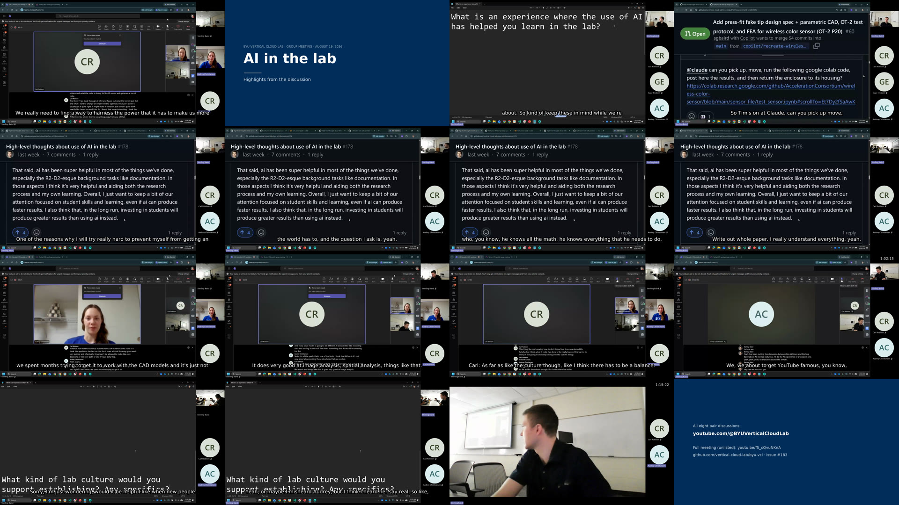

# AI-in-the-lab highlights compilation (2026-08-19 meeting)

A 6:41 edited highlights video cut from the full 75:34 meeting recording — high-density
but breathable: 14 segments across six titled parts, with burned-in captions, source
timecode bugs, loudness-normalized audio (−16 LUFS), and title/end cards. Cut boundaries
are word-aligned to faster-whisper word onsets (re-cut 2026-08-24 after the first version,
placed from Teams cue times, clipped the start of most segments' opening sentence).



## Where the video lives

Video files are deliberately **not** committed to git (see [`../README.md`](../README.md)).

- **Draft GitHub release** [`meeting-2026-08-19-recording`](https://github.com/vertical-cloud-lab/byu-vcl/releases):
  `ai-in-the-lab-highlights-20260819.mp4` (22.7 MB, 1920×1080@16fps) plus the sidecar
  captions and chapters.
- **Raspberry Pi** (stream-cam Pi): `~/vcl-meeting-recordings/2026-08-19/highlights/`.

## What's in the cut

Output chapters ([`highlights-chapters.txt`](highlights-chapters.txt), YouTube-description format):

```
0:00 Cold open: anyone can use AI (Carl)
0:31 The three questions
1:01 Exhibit A: @claude runs a sensor test
1:23 The e-bike problem
3:05 Jarvis, not autopilot
4:33 Meanwhile, online: Audrey & Carl
5:37 So what do we do?
6:36 Where to watch more
```

Segment sources (original 75:34 timeline — the on-screen timecode bug at the start of
each segment shows the same value):

| Output | Source | Segment |
|---|---|---|
| 0:00 | 45:01 | Cold open — Carl: "the biggest thing is just recognizing that we're going to have AI forever" → "if that's all you use, you're useless, because anyone can use AI" |
| 0:33 | 16:41 | Sterling reads the three discussion questions (screen share) |
| 1:04 | 18:25 | Tim's `@claude` comment: pick up the enclosure, run the Colab sensor test, post results |
| 1:25 | 26:29 | The e-bike analogy: complacency vs. competency, e-bikes vs. mountain biking |
| 2:16 | 29:29 | The rebuttal: "it's not like we can choose to not buy the e-bike … I bought it for everybody" |
| 3:08 | 30:31 | Tony Stark: "Jarvis is a support to Tony Stark, not doing Tony Stark's work" |
| 3:44 | 31:44 | Writing the paper yourself vs. backtracking through AI output; "where does the balance sit" |
| 4:36 | 49:04 | Audrey: what is *actually* grunt work — months of generative CAD vs. "plenty of us enjoy CAD" |
| 5:08 | 49:57 | Carl: "it's not there yet" / Audrey: "it doesn't live in the 3D world with us. It's all just code and stuff" |
| 5:19 | 56:51 | Carl: "I'm probably overusing it" / Audrey: "and probably under-using it, so we just need to…" |
| 5:40 | 1:02:15 | "We are about to get YouTube famous" (where the channel clips came from) |
| 5:52 | 1:04:55 | Audrey's action item: teach good AI patterns during onboarding |
| 6:13 | 1:05:45 | "We could make a reel of us — this is good, this is bad" (this video is that artifact) |
| 6:29 | 1:15:22 | "Okay, we'll probably call it good there. Thanks, Audrey, Carl. Thanks, everybody." |

## Files

| File | Description |
|---|---|
| [`edl.json`](edl.json) | Edit decision list: every cut boundary (source seconds), card copy, caption overrides, and a `why` per segment |
| [`make_highlights.py`](make_highlights.py) | Renders the whole thing with ffmpeg from the EDL + the Teams transcript |
| [`ai-in-the-lab-highlights-20260819.vtt`](ai-in-the-lab-highlights-20260819.vtt) | Sidecar captions on the compilation timeline (captions are also burned in) |
| [`highlights-chapters.txt`](highlights-chapters.txt) | Chapter markers on the compilation timeline |
| [`preview.jpg`](preview.jpg) | 4×4 contact sheet, one frame per segment/card |

## Reproducing

```bash
yt-dlp -f source -o original.mp4 "<SharePoint share link in ../README.md>"
python3 make_highlights.py --source original.mp4 --workdir /tmp/build
```

Needs `ffmpeg` (6.x) and the DejaVu fonts. Cut boundaries in `edl.json` are word-aligned:
each piece opens ≥0.3–0.5 s before its first word's faster-whisper onset and closes ≥0.3 s
after its last word ends, with cuts placed inside real speech gaps and snapped to the
16 fps frame grid. (The first cut used the Teams cue times ±0.25–0.45 s instead — those
timestamps lag the audio by ~0.5–1.2 s, which clipped the start of most opening
sentences.) Each segment is cut with input-seek re-encode (frame-accurate), gets two-pass
`loudnorm` (−16 LUFS), burned captions from `../transcript.vtt` (speakers tagged via
`../transcript.json`; in breakout segments, room-mic crosstalk cues are dropped and
Carl/Audrey get name prefixes), and the segments are joined with the concat *filter*
while padding/trimming each segment's audio to exactly its video duration — a stream-copy
concat of independently encoded MP4s accumulates AAC frame padding into ~240 ms of
audible A/V drift by mid-video.

## Known limitations

- Parts 03–04 (e-bike / Jarvis, ~2:00–4:15) sit on the static GitHub-discussion screen
  share, because that is what the recording shows while the room talks; the room is only
  visible in the small webcam sidebar.
- Every junction was QA'd by re-transcribing the first/last ~4 s of each rendered segment
  and checking the expected opening/closing words survive intact. If a boundary still
  sounds off, the fix remains a one-line nudge in `edl.json` (times are source-timeline
  seconds; word onsets can be read out of `../whisper-diarized-transcript.json`).
- Room-mic speech (`@3`) is captioned without speaker names; remote speakers are named.
  A diarized transcript (in progress on this PR) could improve the in-room attributions.
