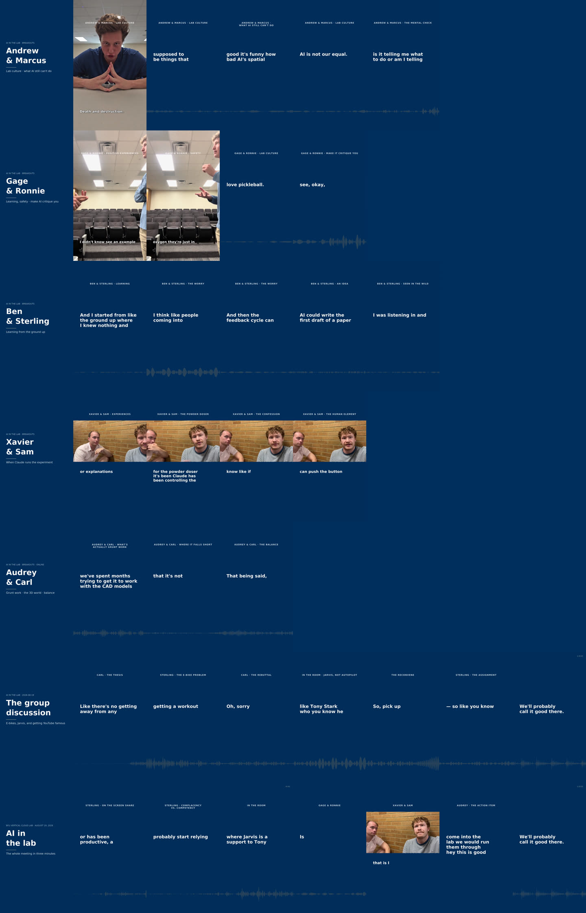

# AI-in-the-lab reels (2026-08-19 meeting + breakouts)

Seven vertical (1080×1920, Shorts/Reels-ready) quote-driven cuts of the 2026-08-19
meeting and its breakout pair discussions, in a **"next-episode preview" style** (the
Frieren end-credits idea from [PR #184](https://github.com/vertical-cloud-lab/byu-vcl/pull/184)):
snippets of the actual voices play while the quote text appears on screen **word-by-word in
sync with the audio**, over navy cards with a live waveform — or over the footage itself
for the two clips with real framing (Xavier & Sam; the Gage & Ronnie Short) and the
"Don't film me" cold open. Unlike the long-form [highlights](../highlights/) (which keeps
whole passages intact), these are **"reels-style" micro-edited**: filler words (um/uh,
stray *you know*s), false starts, stutters, and dead air are removed with word-level cuts,
so the density is high but every word is still the speaker's own.



## The set

| Reel | Length | Sources |
|---|---|---|
| `ai-in-the-lab-reel-01-andrew-marcus` | 0:51 | [`VwOiijuXEP8`](https://youtu.be/VwOiijuXEP8), [`ndbG_nHQljc`](https://youtu.be/ndbG_nHQljc) — "Don't film me" · act-not-acted-upon · spatial reasoning · "AI is not our equal / No. It is our tool." · the mental check |
| `ai-in-the-lab-reel-02-gage-ronnie` | 0:50 | [`s5ptE--EVIk`](https://youtu.be/s5ptE--EVIk), [`bIONIUZDsMk`](https://youtu.be/bIONIUZDsMk) — learn-then-apply · explosive powders vs. aluminum alloys · pickleball · "have it critique your ideas" |
| `ai-in-the-lab-reel-03-ben-sterling` | 0:53 | [`I0jG2o6wthg`](https://youtu.be/I0jG2o6wthg), [`Ef0jl63-rLg`](https://youtu.be/Ef0jl63-rLg) — "I literally built the machine" · the next-cohort worry · "that didn't work, try again" · AI-first-draft idea · Xavier praise |
| `ai-in-the-lab-reel-04-xavier-sam` | 0:51 | [`rwoLhubyzZo`](https://youtu.be/rwoLhubyzZo) — BoTorch docs · Claude runs the powder doser · "I couldn't do it right now… that's scary" · the human element |
| `ai-in-the-lab-reel-05-audrey-carl` | 0:48 | meeting recording (their breakout happened inside the call) — grunt work & months of CAD · "it doesn't live in the 3D world with us" · overusing/under-using |
| `ai-in-the-lab-reel-06-group-discussion` | 1:27 | meeting recording — Carl's thesis · the e-bike problem & rebuttal · Jarvis, not autopilot · "YouTube famous" · "we could make a reel of us" · the close |
| `ai-in-the-lab-reel-07-everything` | 2:45 | everything above — the whole meeting in three minutes: cold open, the three questions, `@claude` runs a sensor test, e-bike, Jarvis, one bite per pair, what-do-we-do, the close (chapters sidecar included) |

Each breakout-session reel is **under 60 seconds** (Shorts-eligible); the group reel and
the everything reel run longer by design (both still under the 3-minute Shorts limit).

## Where the videos live

Video files are deliberately **not** committed to git (see [`../README.md`](../README.md)).

- **Draft GitHub release** [`meeting-2026-08-19-recording`](https://github.com/vertical-cloud-lab/byu-vcl/releases):
  all seven MP4s + caption sidecars.
- **Stream-cam Pi**: `~/vcl-meeting-recordings/2026-08-19/reels/` (sha256-verified copies).

## Files here

| File | Description |
|---|---|
| [`reels-edl.json`](reels-edl.json) | The whole edit: per item, the audio keep-intervals (source seconds, fillers/false-starts/dead-air already cut), the kept words with their source-time onsets (drives the on-screen text), card copy, headers, bugs, and a `why` per item |
| [`make_reels.py`](make_reels.py) | Renders everything with ffmpeg + libass from the EDL: micro-cut concat with 15 ms anti-click fades, per-item two-pass loudnorm (−14 LUFS, Shorts level), navy cards with live waveform, word-by-word ASS karaoke, frame-exact joins |
| `*.vtt` | Sidecar captions per reel (phrase-level, output timeline) — the text is also burned in |
| `ai-in-the-lab-reel-07-everything.chapters.txt` | Chapter markers for the everything reel |
| [`asr_dump.py`](asr_dump.py) | Word-level ASR over padded windows of any source — regenerates the word-onset dumps the EDL was cut from |
| [`qa_reels.py`](qa_reels.py) | Junction QA: re-transcribes each rendered reel and checks every item's first/last words survive at the planned offsets |
| [`preview.jpg`](preview.jpg) | Contact sheet: one frame per segment of every reel |

## How the edit was made (and how to re-cut it)

1. **Word timing.** Candidate spans (drawn from the [highlights EDL](../highlights/edl.json)
   plus fresh picks from the clip transcripts in [`../highlights/sources/`](../highlights/sources/))
   were re-transcribed with faster-whisper `distil-large-v3` with `word_timestamps=True`,
   giving an onset/offset for every word (~1,900 words timed).
2. **Micro-cuts.** Keep-intervals were placed so that item edges sit ≥0.2–0.35 s clear of
   word onsets and interior splices sit 0.03–0.15 s off the neighbouring words, cutting:
   filler words where they had clean gaps (um/uh, stray *you know*s and *like*s), false
   starts and stutters ("we are you know", "then start then", "it's been—"), mid-sentence
   hedges, and pauses longer than ~0.6 s. Risky drops (fillers with no gap around them)
   were deliberately kept — no cut is worth an audible glitch. Every junction gets a 15 ms
   audio fade.
3. **Text reveal.** The kept words (with light display-only patches: "clot" → "Claude",
   "Bow Torch" → "BoTorch", "bikes" → "likes", capitalization) are burned as ASS karaoke —
   each word appears at its onset, phrases clear when the next begins. The same words
   produce the sidecar VTTs.
4. **QA.** Every rendered reel was re-transcribed end-to-end and each item's first/last
   words checked to be intact at the planned offsets; loudness and exact video==audio
   durations verified.

To re-render (needs `ffmpeg` 6.x with libass, DejaVu fonts):

```bash
# meeting recording (SharePoint share link in ../README.md)
yt-dlp -f source -o meeting.mp4 "<share link>"
# breakout clips: already on the Pi under ~/vcl-ai-clips/media/ (YouTube blocks
# datacenter IPs) — mux video+audio pairs into clips/<id>.mp4, or re-download
# with the recipe in ../highlights/README.md
python3 make_reels.py --source meeting.mp4 --clips-dir clips --workdir /tmp/reels-build
```

To change a cut: edit the item's `segments`/`words` in `reels-edl.json` and re-run with
`--only <reel-id>`; verify with `qa_reels.py --outdir <renders>`. Word-onset dumps for
new spans: `python3 asr_dump.py spans.json out.json` (needs `pip install faster-whisper`).

## Known limitations

- The two voices within a pair are not name-distinguished in captions/karaoke (headers
  identify the pair). Speaker attributions for meeting items follow
  [`../whisper-diarized-transcript.txt`](../whisper-diarized-transcript.txt).
- Some drawn-out fillers glued to the next word (e.g. a long "um" with no gap) were kept
  or only partially trimmed to avoid audible artifacts; a fade may leave a faint trace.
- The display text condenses a few unintelligible/garbled moments (e.g. "either have— tell
  AI…" area was cut entirely); patched words are all recorded in the EDL, so the mapping
  from display text to raw audio is fully auditable.
- Whisper occasionally mishears a word in the noisy phone recordings; obvious cases are
  patched in the EDL (`patch` entries), the rest are left as heard.
