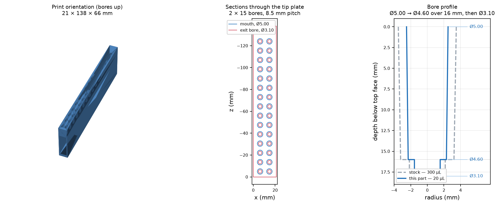

# Cub-XL tip rack — 20 µL variant (Ø5.0 → Ø4.6 taper, Ø3.1 exit bore)



A re-bored version of the Ursa 2 × 15 tip rack for the PANDA-BEAR / Cub-XL deck.
The stock part holds 300 µL tips; this one keeps the same bore *architecture* —
a tapered seat followed by a smaller exit bore — scaled down for 20 µL tips, per
[#151](https://github.com/vertical-cloud-lab/byu-vcl/issues/151).

Everything except the bores is untouched — same envelope, same 8.5 mm grid, same
side walls, end gussets, bottom rail and deck key pockets — so it drops onto the
Cub-XL deck exactly where the stock rack does.

## Files

| File | Purpose |
| --- | --- |
| `TipRack20uL.3mf` | **Print this.** Already in the recommended print orientation (bores up), positive octant, 21 × 138 × 66 mm, units = millimetre. |
| `TipRack20uL.stl` | Same solid in the *stock* `TipRack.stl` coordinate frame (21 × 66 × 138, +y up), so it is a drop-in geometric replacement anywhere CubOS/Cubware reference the original mesh. |
| `TipRack20uL.yaml` | CubOS labware config. Grid geometry is final; **`pickup_z` / `drop_z` are placeholders and must be measured** — see below. |
| `make_tip_rack_20ul.py` | Parametric generator. Re-run with `--top-diameter` / `--bottom-diameter` / `--taper-length` / `--exit-diameter` for any other bore profile. |
| `TipRack20uL.png` | Preview above — print orientation, top-down sections, and the bore profile against the stock one. |
| `TipRack.stl` | Vendored upstream source, sha256 `4a7e64a9…`, from [`Ursa-Laboratories/Cubware`](https://github.com/Ursa-Laboratories/Cubware/blob/main/labware/ursa_tip_rack/TipRack.stl). |

## What changed

The stock bores are a 300 µL tip seat: a **Ø6.980 → Ø6.424 taper over 16 mm**
(≈1.0° half-angle) followed by a **Ø4.32 through-bore** for the last 2 mm of the
18 mm plate. A 20 µL tip drops straight through that.

Each of the 30 bores is now the same profile scaled down:

| Feature | Stock (300 µL) | This part (20 µL) |
| --- | --- | --- |
| Taper, top → base | Ø6.980 → Ø6.424 | **Ø5.000 → Ø4.600** |
| Taper length | 16 mm | **16 mm** |
| Taper half-angle | 0.99° | **0.72°** |
| Exit bore | Ø4.32 × 2 mm | **Ø3.100 × 2 mm** |
| Plate thickness | 18 mm | 18 mm |

Unchanged: 21 × 66 × 138 mm envelope · 2 columns at x = 6.25 / 14.75 · 15 rows at
z = −5 → −124 · 8.5 mm pitch both ways · 18 mm top plate · 2 mm side walls · 5 mm
bottom rail · 17 × 43 mm cavity · two 2 mm-deep triangular deck key pockets,
7.4 × 6.7 mm, centres 90.00 mm apart.

## Verification

Checks run by `make_tip_rack_20ul.py` and after export:

- Result is **watertight**, consistently wound, **genus 31** — a clean solid with exactly 30 through-bores.
- Bore diameters ray-measured off the exported mesh, across flats:

  | Depth below top face | Nominal | Measured (min chord) |
  | --- | --- | --- |
  | 0 mm (mouth) | 5.0000 | **5.0000** |
  | 4 mm | 4.9000 | **4.9000** |
  | 8 mm | 4.8000 | **4.8000** |
  | 12 mm | 4.7000 | **4.7000** |
  | 16 mm (base of taper) | 4.6000 | **4.6000** |
  | 16–18 mm (exit bore) | 3.1000 | **3.1000** |

  All 30 bores measure 5.000 at the mouth and 3.100 at the exit. The facet
  polygon is circumscribed about the nominal circle, so the *tightest* dimension
  across a bore is nominal rather than up to 0.05 % undersize.
- Volume 81 114.4 mm³ (81.11 cm³), within 3.3 mm³ of the analytic prediction (facet discretisation).
- **Symmetric difference against the stock part below the tip plate = 0.000000 mm³** — the deck keys, walls, gussets and bottom rail are bit-for-bit identical.
- No material outside the 21 × 66 × 138 mm envelope (0.000000 mm³).
- `.3mf` round-trips through `trimesh` watertight, `unit="millimeter"`, single build item.

## Printing

Print as oriented in the `.3mf`: bottom rail on the bed, bores facing up. The
bores then print vertically (round, no support) and their seating rims print
last, clear of first-layer elephant's foot. The step from the base of the taper
down to the Ø3.1 exit bore faces upward, so it needs no support either; the only
overhang is the plate underside bridging the 17 mm cavity — routine for any
modern printer.

- PLA or PETG, 0.2 mm layers, 3 perimeters, ~20 % infill. No supports.
- **Check the fit before printing all 30.** Most FDM printers come out 0.1–0.2 mm
  undersize on vertical holes — at Ø5.0 that is a 2–4 % error. If your 20 µL tips
  bind, regenerate with the taper shifted up by the measured error, keeping the
  0.40 mm difference between the ends:

  ```bash
  pip install trimesh manifold3d numpy lxml networkx
  python make_tip_rack_20ul.py --top-diameter 5.2 --bottom-diameter 4.8
  ```

  A 0.2 mm slicer hole-compensation ("X-Y hole compensation" / "hole expansion")
  setting does the same thing without a regenerate.

## Calibration — do this before running a protocol

`TipRack20uL.yaml` carries the correct grid, but a 20 µL tip seats where its cone
matches the new, smaller taper — a different height than a 300 µL tip sits at in
the stock rack. `pickup_z` and `drop_z` are therefore carried over from upstream
only as starting points and **will be wrong for these tips**. Measure them
against the actual tips and pipette before running any hardware protocol, and set
`tip_length` to the physical tips in use — CubOS relies on it for collision
safety.
