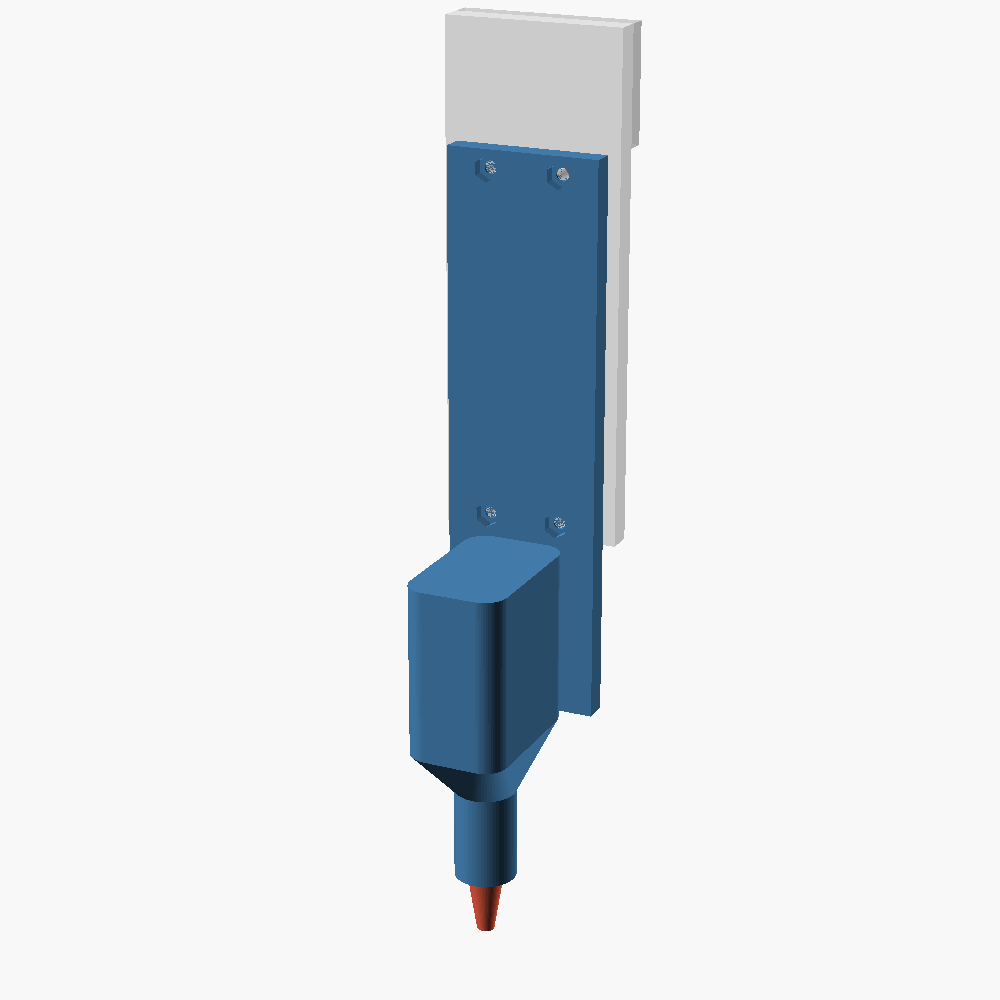
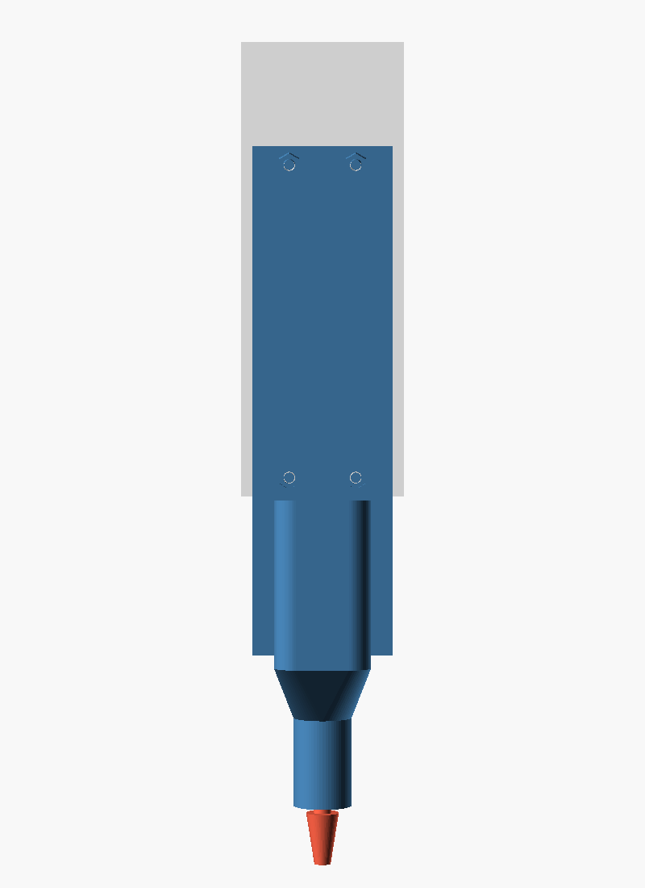
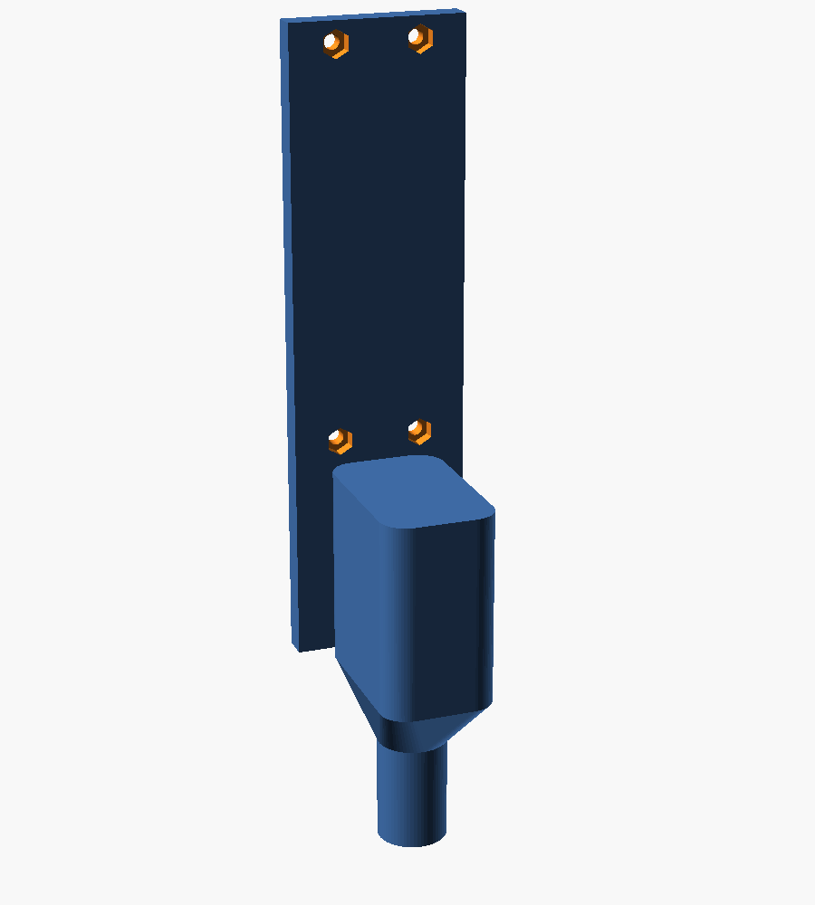
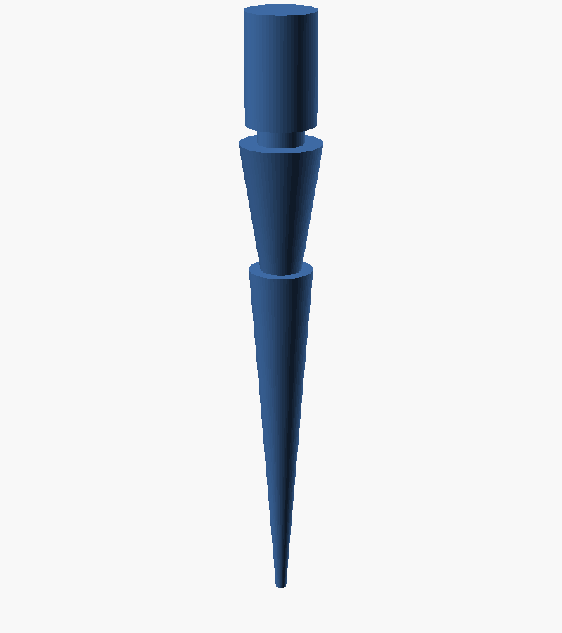

# Dummy pipette (P20 GEN2 stand-in) for CubXL dry runs — REV 2

A cheap, sacrificial, 3D-printable stand-in for the **Opentrons P20 Single-Channel
GEN2** that **screws directly onto the Cubware PAW-V2 OT2 backboard**
([Ursa-Laboratories/Cubware `mounts/ot2_backboard`](https://github.com/Ursa-Laboratories/Cubware/tree/main/mounts/ot2_backboard)).
Run gantry dry runs against it: if the machine crashes into deck or labware, a
~10-cent printed nozzle snaps off at a designed weak point instead of bending the
~$1k pipette or skipping the gantry (see issues #165 / #169).

| Assembly on backboard | Front | Body (nut pockets) | Nozzle (+ tip stand-in) |
| --- | --- | --- | --- |
|  |  |  |  |

*Grey = ghost of the backboard's pipette panel (with its raised carriage pocket
at the top). Blue = printed body. Red = sacrificial nozzle.*

## The spec

With the dummy screwed in, the **pipette-tip attachment point** (the nozzle end a
disposable tip would press onto) sits **exactly 100 mm below the bottom edge of
the backboard panel** (`NOZZLE_DROP = 100` in the SCAD; the render `echo`
confirms it, and the exported assembly STL bottoms out at Z = −100.000 with the
bottom edge at Z = 0). If "below the baseplate" should instead be measured from
the mounting holes or the panel top, change `NOZZLE_DROP` — everything below the
body re-stretches automatically (the collar length is derived, with an `assert`
guarding the budget).

## Mount interface (measured, not guessed)

Dimensions were extracted numerically from the actual Cubware CAD,
`PAW-V2 - OT2Mount_REV. 1 - OT2Mount.stl` (mesh-sliced; REV. 1 as of Jul 2026):

- The backboard's right-hand **pipette panel** is a vertical strip **46.5 mm
  wide**, front face = mounting plane.
- Four mounting holes on the panel centerline: **⌀4.0 mm through-holes with
  ⌀6.0 mm counterbores opening to the back** (screws insert from behind;
  the counterbore fits an M3 socket head). Pattern: pairs **19.0 mm** apart
  horizontally, the two pairs **89.06 mm** apart vertically, lower pair
  **5.41 mm** above the panel's bottom edge.
- A **raised carriage pocket starts 100.1 mm** above the bottom edge; the
  dummy's plate top is at 99.5 mm so it clears it.

The dummy's 6 mm back plate carries **four trapped M3 hex nuts** at that exact
pattern. To install: drop nuts into the front-face pockets, hold the plate
against the panel, and drive **4× M3×12 socket-head screws from the back of the
backboard** into the nuts (heads recess into the existing ⌀6 counterbores).
Note the backboard's ⌀4 holes give an M3 screw ~±0.5 mm of play — snug the
screws while the plate is referenced (e.g. flush to the panel edge) so the
datum is repeatable.

## Files

| File | What |
| --- | --- |
| `dummy_pipette_p20.scad` | Parametric source (OpenSCAD). All dimensions + docs inline. |
| `stl/dummy_pipette_p20_body.stl` | Print 1×: plate + housing + shoulder + collar (with nozzle socket + nut pockets). |
| `stl/dummy_pipette_p20_nozzle.stl` | Print several: sacrificial break-away nozzle, ends at the tip attachment point. |
| `stl/dummy_pipette_p20_nozzle_with_tip.stl` | Nozzle variant with a solid 20 µL-tip stand-in (lowest point = 139 mm below the edge) for full-envelope tests. |
| `stl/dummy_pipette_p20_assembly.stl` | Reference assembly in mounted position (datum: backboard bottom edge = Z0). |

## Fails safe by design

The nozzle is a separate part: a friction peg (⌀8 × 12 mm, 0.2 mm press fit)
into the collar, with the load path through a thin **frangible shear neck**
(`SHEAR_DIA = 5`, `SHEAR_H = 2`). A crash snaps the neck. Tune `SHEAR_DIA`
down to make it weaker — err toward *too weak*; a reprint is cheap, a
too-strong neck defeats the purpose.

## Print settings

- **PLA**, cheap and brittle is the point. Nozzle at **10–15 % infill**.
- **Body:** print on its back (plate face down — it's flat); supports only
  under the shoulder/collar. Or upright with a brim.
- **Nozzle:** prints upright out of the box (peg up).
- Hex pockets are sized for a standard M3 nut (5.5 AF + 0.1 clearance, 2.9 deep).

## P20 GEN2 realism caveat

Widths/diameters follow the P20 GEN2's general form (26 × 42 mm housing,
⌀16 ejector collar, tip cone), but the vertical proportions are **compressed to
honor the 100 mm spec** — a real P20 GEN2 is longer from mount to nozzle. The
dummy therefore protects against collisions for tool paths whose Z reference is
the 100 mm tip-attach point, not for the real pipette's full length. If you
later want a full-length envelope, set `NOZZLE_DROP` to the measured value on
the real installed pipette and reprint.

License: CC-BY-4.0.
