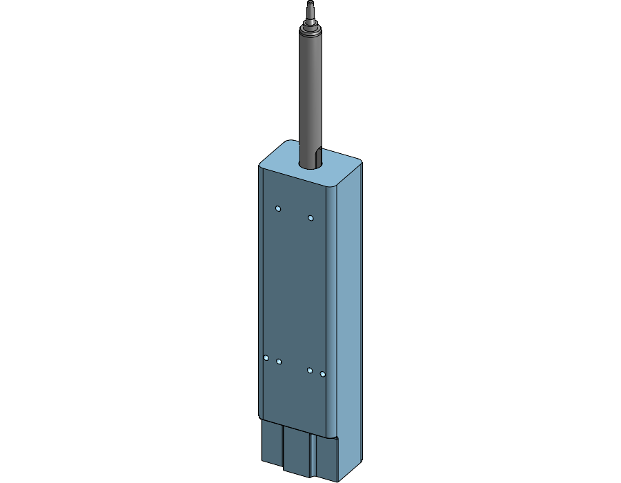

# Dummy pipette (OT-2 P20 stand-in) — Onshape mirror

A sacrificial 3D-printed stand-in for the Opentrons P20 Single-Channel GEN2, used
during CubXL dry runs so a gantry collision damages a printed part instead of the
real pipette. Designed by @benwhitney5463 with dimensions taken directly off the
OT-2 (see [#169](https://github.com/vertical-cloud-lab/byu-vcl/issues/169)).

**Source of truth is the Onshape document, not this folder:**
<https://byudesign.onshape.com/documents/7998140a612dc87389384e77/w/fb057218e57432289e21cd0b/e/b6dcdab4f2c49c67192f6f3a>

| | |
|---|---|
| Document | `dummy pipette` (`7998140a612dc87389384e77`) |
| Workspace | `fb057218e57432289e21cd0b` |
| Elements | Part Studio 1 (`b6dcdab4f2c49c67192f6f3a`), Assembly 1, BOM |
| Mirrored at | document `modifiedAt` 2026-08-05T23:28:48Z |



## ⚠️ There is no STL/STEP here, and that is not fixable from this end

The share link grants **anonymous read** (`"permission": "ANONYMOUS_ACCESS"`), which
covers metadata, the feature tree and rendered views — but **export is disabled on
the share**. Every geometry endpoint refuses an unauthenticated request:

| Endpoint | Result |
|---|---|
| `GET …/partstudios/…/stl`, `…/parasolid`, `…/gltf` | `401` |
| `GET …/partstudios/…/bodydetails`, `…/tessellatedfaces`, `…/boundingboxes` | `401` |
| `POST …/partstudios/…/translations` (STEP/STL export job) | `401` |
| `POST …/partstudios/…/featurescript` | `401` |
| `GET …/documents/…/export` | `403` |
| `GET …/documents/…/features`, `…/shadedviews`, `…/thumbnails` | `200` ✅ |

So what is committed is the **parametric definition and documentation**, not a mesh.
To get a printable file into the repo, one of these has to happen:

1. **@benwhitney5463 exports and commits it** — in Onshape, right-click the Part
   Studio tab → *Export* → **STEP** (for CAD interchange) and **STL** (binary, mm,
   for slicing). Drop both in `stl/` and `step/` here. Simplest path.
2. **Loosen the share** — *Share* → link settings → allow **Export**, or make the
   document public. `fetch_onshape.py` can then be extended to pull the mesh
   directly and this folder stays in sync automatically.
3. **Add Onshape API keys** as repo secrets (`ONSHAPE_ACCESS_KEY` /
   `ONSHAPE_SECRET_KEY`) from an account with access, and the translation endpoint
   becomes usable from CI.

## Contents

| Path | What |
|---|---|
| `onshape/features.json` | Full Part Studio feature tree — every sketch, constraint and dimension. This *is* the parametric design; the model is reconstructible from it. |
| `onshape/document.json`, `onshape/elements.json` | Document + element metadata (ids, workspace, timestamps) for provenance. |
| `img/view_*.png`, `img/thumbnail.png` | Server-rendered views (isometric, trimetric, front, right, top). |
| `DIMENSIONS.md` | Readable feature/dimension summary extracted from `features.json`. |
| `fetch_onshape.py` | Reproduces everything above; no credentials needed. |

Refresh with:

```bash
python hardware/dummy-pipette-p20/fetch_onshape.py --report
```

## Key dimensions

Pulled out of the feature tree — full listing in [`DIMENSIONS.md`](DIMENSIONS.md).

- **Body**: `Extrude 1`, 234 mm tall, from a profile ~44.7 mm wide × 32.4 mm deep,
  with an 11° draft, R5 / R3 / R2 fillets and a 0.5 mm × 45° chamfer.
- **Mounting holes**: six **Ø3 mm × 12 mm deep** blind holes on the back face —
  four at z = 124 mm (x = ±9, ±16.5) and two at z = 213 mm (x = ±9.5). The 89 mm
  row spacing and 19 mm pair spacing match the Cubware
  [`ot2_backboard`](https://github.com/Ursa-Laboratories/Cubware/tree/main/mounts/ot2_backboard)
  pipette-panel pattern that @alexc2684 pointed to.
- **Probe / tip cone**: built from `Revolve 1`–`Revolve 4` plus `Extrude 8`, i.e.
  the replaceable probe is a separate revolved body — this is the part meant to
  break instead of the pipette.

## Known issue (from the first print)

> the probe is made to be replaceable if it breaks, but the diameter is too wide,
> so the compliant mechanism breaks on entry — @benwhitney5463,
> [#169](https://github.com/vertical-cloud-lab/byu-vcl/issues/169)

The probe's outer diameter interferes on tip pickup and snaps the compliant
retention feature during insertion rather than on a genuine collision. Fix belongs
upstream in Onshape (shrink the probe OD / relieve the compliant arms), then
re-run `fetch_onshape.py` to refresh this mirror.

## Related

- [`docs/pipette-selection-cubxl.md`](../../docs/pipette-selection-cubxl.md)
- Cubware pipette wiring + mounts: [`documentation/opentrons-pipette-setup.md`](https://github.com/Ursa-Laboratories/Cubware/blob/main/documentation/opentrons-pipette-setup.md)
